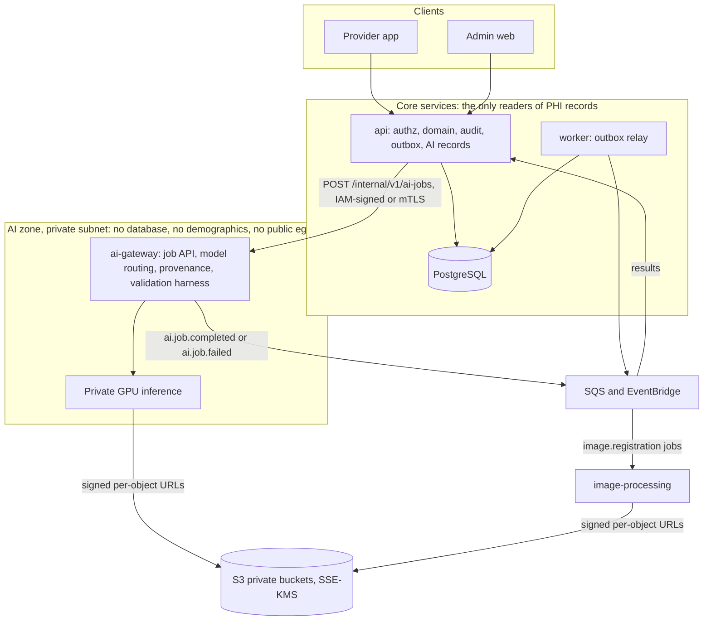
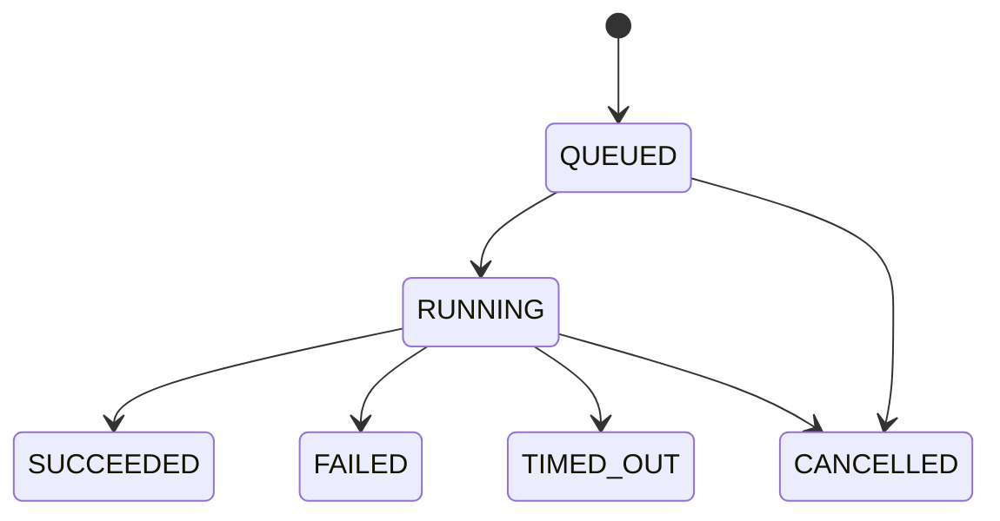
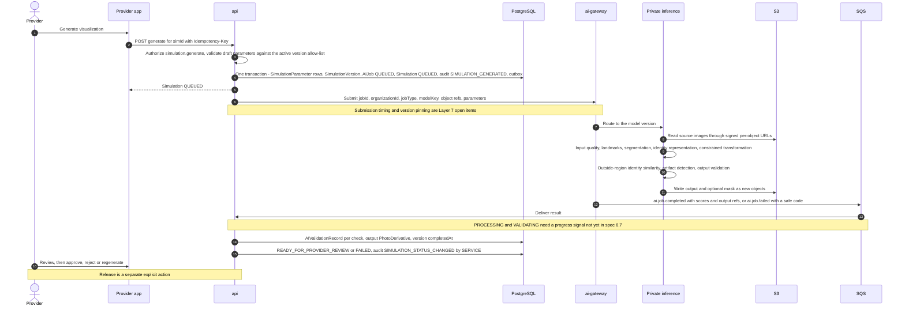

# AI architecture

| | |
|---|---|
| Version | 1.0 |
| Status | Layer 0 baseline, 2026-09-28 |
| Authority | Production Bible §2 (AI Platform surface), §7.3 (AI-training enforcement), §9 (AI outcome simulation), §10 (similar historical cases), §21.4 (AI/regulatory boundary), §23.2 (not offline), §25.2–25.4 (service boundaries, private AI inference, scale), §26, §27.1, §28.3, §30. ADR-0001 (organization-wide library), ADR-0006 (US only), ADR-0008 (spec proposals and delegated baselines). |
| Normative sources | [`TECHNICAL_SPECIFICATION.md`](TECHNICAL_SPECIFICATION.md) §2.1, §2.4, §3.1, §3.2, §3.4 (flow B), §5.2 (AI), §5.4.2, §5.4.10, §6.3 (Simulations), §6.7, §7.2, §7.6, §7.7, §10.2 (UD-04, UD-10, UD-29, UD-32); [`schema.prisma`](technical-spec/schema.prisma) section 5; [`constraints.sql`](technical-spec/constraints.sql) Layer 7 and Layer 8 fragments |

This document describes how Aestara runs AI: the isolated inference environment behind an authenticated gateway, the model registry and its rollouts, the validation harness, job provenance, similar-case search and AI data governance. The binding product rules for simulations (disclaimer, review, release, wording) are in [AI_SIMULATION_RULES.md](AI_SIMULATION_RULES.md).

---

## 1. Scope and boundary

| Capability | Layer | Source |
|---|---|---|
| `AIJob` record for automatic before/after registration (image processing, no model) | 3 | spec §5.8 |
| ai-gateway, internal job contract, service authentication | 7 | Roadmap M7.1 |
| Model registry, immutable versions, rollouts and rollback, admin visibility | 7 | [B §9.7, §17.1]; M7.2 |
| Private inference environment and job runner | 7 | [B §25.3]; M7.3 |
| Input-quality, landmark and segmentation models with validation records | 7 | M7.4 |
| Validation harness: identity similarity, artifacts, regression datasets | 7 | M7.5 |
| Simulation lifecycle and procedure-specific engines | 8 | [B §9]; M8.1–M8.5 |
| Case library, similar-case search, outcome measurements | 9 | [B §10]; M9.1–M9.3 |

**The boundary** [B §21.4, §1.2]: initial AI is clinician-controlled visualization with provider review. It performs no automatic diagnosis, dosing or treatment recommendation and makes no guaranteed-outcome claim. Any expansion of claims needs intended-use and regulatory review first. Layer 7's exit condition is "versioned AI jobs with provenance" [B §29].

---

## 2. Components

### 2.1 Responsibilities

| Deployable | Responsibility | Database | Source |
|---|---|---|---|
| `services/api` | Authorizes and records every AI action: creates `AIJob`, `Simulation`, `SimulationVersion` and parameter rows; persists results, validation records and derivatives; runs every state transition with audit | **Yes**, sole schema owner | spec §3.1 |
| `services/ai-gateway` (NestJS) | Internal job API, model routing via the active rollout, provenance capture, validation harness | **No**; reports results as events that the api persists | spec §2.1, §3.1 |
| Private AI inference (Python, PyTorch / ONNX Runtime) | Quality, landmarks, segmentation, simulation, identity similarity, artifact detection | **No** | spec §2.1, §3.1 |
| `services/image-processing` | Before/after registration (`IMAGE_REGISTRATION` jobs) and other pixel work | **No** | spec §3.1, §6.7 |
| worker | Outbox relay to SQS / EventBridge | Yes | spec §3.1 |

### 2.2 Components and trust boundaries

---

## 3. Isolation and minimum-necessary data

| Control | Design | Source |
|---|---|---|
| Network | Inference runs in a private subnet with no public egress; `/internal/v1/...` is never internet-routable | [B §2.1 "Private AI Jobs", §25.3]; spec §2.1, §6.1.1; UD-04 |
| Service authentication | api → ai-gateway uses IAM-signed requests or mTLS inside the VPC; queues are protected by IAM policies per producer and consumer | [B §21.2]; spec §6.7, §7.1 |
| No database | ai-gateway and inference cannot query PostgreSQL | spec §3.1 |
| Minimum necessary | A job carries `jobId`, `organizationId`, `jobType`, `modelKey`, `inputs: [{objectRef, role}]` and `parameters`. Never a name, date of birth, MRN, contact detail or free text | spec §3.1, §6.7, §7.2 rule 6 |
| Object access | Image bytes are read and written only through signed per-object URLs (at most 10 min); IAM is scoped per object class | spec §3.2, §7.1 |
| Stored summaries | `AIJob.inputSummary` holds identifiers and parameters; `resultSummary` holds scores and metrics. Neither holds image bytes or free-text PHI | `schema.prisma` |
| Third parties | No third-party generative-AI API receives patient images without a separately approved, BAA-covered decision | spec §2.4; UD-04 |
| Logs and traces | Allow-list logging and safe identifiers only | [B §26]; spec §7.2 |

The PHI that reaches the AI zone is therefore limited to the images themselves (spec §3.1).

---

## 4. Model registry and rollouts

A production model is never silently replaced [B §9.7]; spec §1.4 G11.

| Record | What it holds | Mutability (verified by) |
|---|---|---|
| `AIModel` (platform-level) | `key`, `task`, optional `simulationCategory` | Identity frozen; only name and description change (R10) |
| `AIModelVersion` | `version`, `artifactDigest` (SHA-256 of weights or inference container image), `parameterSchema` (allow-list of provider controls with no dosage, product, drug, unit, depth or technique fields), `inferenceDefaults`, `thresholds`, `intendedUse`, `validationSummary`, `status` | Immutable except `status`, `validationSummary`, `validatedAt`, `retiredAt` (E1–E2) |
| `AIModelRollout` | Which version is `ACTIVE`, platform-wide (`organizationId` NULL) or for one organization; `reason`, `changedById` | One `ACTIVE` row per (model, organization), NULLs included (E3–E4); version must belong to the model (E5); an active row can only be deactivated, and rollback inserts a new row (R11–R13); no deletes |

`AIModelTask` values: `INPUT_QUALITY`, `LANDMARK_DETECTION`, `SEGMENTATION`, `IDENTITY_REPRESENTATION`, `SIMULATION`, `ARTIFACT_DETECTION`, `IDENTITY_SIMILARITY`, `IMAGE_REGISTRATION`, `SIMILAR_CASE_EMBEDDING`, `OUTCOME_MEASUREMENT`. `AIModelVersionStatus` values: `REGISTERED`, `VALIDATING`, `VALIDATED`, `VALIDATION_FAILED`, `RETIRED`.

| Action | Endpoint (spec §6.3) | Permission (spec §4.4, UD-16) | Audit |
|---|---|---|---|
| View the registry and versions | `GET /ai-models`, `GET /ai-models/{id}/versions` | `ai.model.read*` (SUPER_ADMIN, ORGANIZATION_ADMIN) | — |
| Activate, deactivate or roll back, platform-wide or per organization | `POST /ai-models/{id}/rollouts` (`Idempotency-Key` required) | `ai.model.manage*`, platform scope only | `AI_MODEL_ROLLOUT_CHANGED*` |

AI deployments are independent of application deployments and versioned; rollback activates the previous version [B §28.3]; spec §7.6. Models are introduced only through the registry with validation evidence (spec §10.1 assumption 6). The database does not check a version's status when it is activated, so the rollout endpoint must enforce it; the exact rule is confirmed at Layer 7 (M7.2).

---

## 5. Validation harness

The harness (Layer 7, M7.5) produces `AIValidationRecord` evidence at two levels:

| Level | Subject | Tenant | Check types | Feeds |
|---|---|---|---|---|
| Model version | `modelVersionId` | None (`organizationId` NULL) | `MODEL_BENCHMARK`, `IDENTITY_PRESERVATION_REGRESSION` | `AIModelVersion.validationSummary` and status; rollout decisions |
| Job or output | `aiJobId` and/or `simulationVersionId` | Required (CHECK) | `INPUT_QUALITY`, `OUTSIDE_REGION_IDENTITY_SIMILARITY`, `ARTIFACT_DETECTION`, `OUTPUT_VALIDATION` | Simulation state transitions; the staff review screen |

Each record stores `result` (`PASS`, `FLAG`, `FAIL`), `score`, `threshold`, `details` and `validatorVersion`. Thresholds belong to the model version (`AIModelVersion.thresholds`) and are frozen with it. **No numeric threshold is set by the Bible or the spec**; thresholds, models and validation datasets are out of scope until Layers 7–8 (spec §11.4 item 5). Datasets built from patient media follow section 9. The Bible requires AI regression and identity-preservation tests [B §27.1] and regression validation before production [B §36].

---

## 6. Jobs, lifecycle and provenance

### 6.1 `AIJob`

| Field or rule | Design |
|---|---|
| Types | `INPUT_QUALITY_CHECK`, `LANDMARK_DETECTION`, `SEGMENTATION`, `SIMULATION_GENERATION`, `OUTPUT_VALIDATION`, `IMAGE_REGISTRATION`, `SIMILAR_CASE_SEARCH`, `OUTCOME_MEASUREMENT` |
| Idempotency | `idempotencyKey` unique per organization; retries never create a second job [B §20.3, §23.3] |
| Model | `modelVersionId` (foreign key added in Layer 7) |
| Tenancy | `organizationId` always; `patientId` when the job concerns a patient (composite FK) |
| Status | Diagram below: spec §5.4.10 (P, adopted by ADR-0008) |

A `SimulationVersion` links exactly one `AIJob` (`aiJobId` is unique). Whether the simulation pipeline also records its stages as separate `AIJob` rows, or only as validation records of that one job, is not specified (Layer 7, M7.1).

### 6.2 Simulation job sequence

The simulation state machine is spec §5.4.2; its rules are in [AI_SIMULATION_RULES.md](AI_SIMULATION_RULES.md).

### 6.3 Provenance

Every Bible provenance item [B §9.4] has a home, and all of it is immutable once written.

| Bible item | Recorded in | Immutability |
|---|---|---|
| Source asset IDs | `SimulationVersionSource` (photo, role `PRIMARY` or `ADDITIONAL_VIEW`); same patient by composite FK | E6–E7 |
| Procedure / treatment region | `Simulation.category`, `procedureKey`, `treatmentRegion` | — |
| AI model ID and version | `SimulationVersion.modelVersionId`; `AIJob.modelVersionId` | E8 |
| Inference configuration and provider parameters | `SimulationVersion.inferenceConfig`; `SimulationParameter` rows frozen at `/generate` | E8, R14 |
| Mask / segmentation reference, when retained | `SimulationVersion.maskObjectId` | E8–E10 |
| Output asset ID | `SimulationVersion.outputDerivativeId` → `PhotoDerivative` of kind `AI_SIMULATION_DERIVATIVE` | E9–E10 |
| Timestamps | Version `createdAt` / `completedAt`; job `queuedAt` / `startedAt` / `finishedAt`; approval `decidedAt`; `Simulation.releasedAt` | E10 |
| Generating user | `SimulationVersion.generatedById` | E8 |
| Reviewing provider | `SimulationApproval.reviewerUserId`, a `ProviderProfile` of the same organization | E14, R18 |
| Approval and release events | `SimulationApproval` rows; `Simulation.releasedVersionId`, `releasedById`, `releasedAt`; `AuditEvent` | E12–E14; audit append-only (G1–G3) |

Non-simulation jobs keep their provenance on `AIJob` (model version, input and result summaries), and `OutcomeMeasurement` records its method and model version (Layer 9).

---

## 7. Quality, landmark and segmentation services

- Each is a registered model (tasks `INPUT_QUALITY`, `LANDMARK_DETECTION`, `SEGMENTATION`) served by the private inference environment, versioned and rolled out like any other model (Layer 7, M7.4).
- For a simulation they are the first stages of the pipeline [B §9.2]. Input-quality failures return the safe, actionable `INPUT_QUALITY_INSUFFICIENT` with reasons drawn from the 13 capture guidance codes, so the fix is phrased the same way as at capture (spec §6.2, §6.6.6; [PHOTO_PROTOCOLS.md](PHOTO_PROTOCOLS.md)).
- A source view or category outside a model's validated domain returns `UNSUPPORTED_SIMULATION_INPUT` (spec §6.2).
- Live capture guidance is a different mechanism: it runs on the device with Vision and CoreML (spec §2.2).
- Segmentation masks are stored only when retained, as a separate object referenced from the version [B §9.4].

---

## 8. Similar-case search (Layer 9)

A provider may search the organization's consented, de-identified or otherwise authorized historical cases for visually relevant examples [B §10].

| Step | Design | Source |
|---|---|---|
| Curate | A `CaseLibraryEntry` wraps one `BeforeAfterSet`, records the originating `practiceId`, and is authorized by a `MediaRelease` that pins the permission versions relied on. Baseline category: `EDUCATION` | spec §5.2; UD-10 |
| Display | Other patients' cases are shown only through a **de-identified display derivative** (`displayDerivativeId`) | spec §5.2; UD-10 |
| Scope | Organization-wide across its practices, never across organizations; cross-organization datasets need a separately approved governance model | ADR-0001; [B §10] |
| Search | `POST /patients/{pid}/similar-cases/search` (`similarcase.search*`, `Idempotency-Key` required) creates an `AIJob` of type `SIMILAR_CASE_SEARCH` and ranked `SimilarCaseMatch` rows. Inputs may be procedure, view, starting visual features and approved metadata | [B §10]; spec §6.3 |
| Show | `POST …/similar-cases/{matchId}/shown` records `shownAt` and `shownById`; audit `SIMILAR_CASES_SHOWN*` | [B §10]; spec §7.3 |
| Label | "Similar Historical Cases", never "Your Predicted Result" | [B §10] |
| Withdraw | Revoking the authorizing release withdraws the entry (`WITHDRAWN`, with time and reason) | spec §5.2 |
| Patient app | No portal endpoint; staff only | spec §6.5 |

Bible §10 says "the practice's" library; the owner decided the library is organization-wide (D-01, ADR-0001), and `practiceId` lets users filter by originating practice.

---

## 9. Data governance

| Rule | Source |
|---|---|
| Simulation sources need the current grant that simulation use requires; baseline `CLINICAL_USE` | spec §3.4 flow B, §7.7; UD-32 |
| No production pipeline trains on patient media in the initial build | spec §7.7 |
| A future training dataset may include only assets with a current, explicit `AI_TRAINING` grant **and** a recorded governance approval; an evaluation dataset needs `INTERNAL_AI_EVALUATION` and an approval | [B §7.3]; spec §7.7 |
| Neither permission is ever inferred from clinical consent, clinical use or any other category | [B §7.1, §30] |
| Revocation removes the asset from future dataset builds | [B §7.3]; spec §7.7 |
| Dataset and approval records (a governance approval plus a manifest pinning permission versions, like `MediaReleasePermission`) are deferred to Layer 7; no dataset export endpoint exists before then | spec §7.7 |
| Lower environments never hold production data without an approved de-identification process | [B §28.1]; spec §7.2 rule 8 |
| Models are commercially licensable for this use and run privately | spec §10.1 assumption 6 |

---

## 10. Hosting

| Aspect | Baseline | Source |
|---|---|---|
| Inference hosting | ECS on EC2 GPU capacity in a private subnet; SageMaker asynchronous inference is the alternative. Confirmed with model licensing at Layer 7 kickoff | UD-04; spec §2.3; roadmap step 10 |
| Region | AWS us-east-1, multi-AZ, HIPAA-eligible services under BAA | ADR-0006; spec §2.3 |
| Images | Docker images in ECR; `artifactDigest` pins the weights or the inference image | spec §2.3; `schema.prisma` |
| Capacity | Dedicated AI capacity planning at the ~1,000-practice tier; instance types and scaling are not specified | [B §25.4] |

---

## 11. Failure handling

| Failure | Behaviour | Source |
|---|---|---|
| Input quality insufficient | Simulation `FAILED` with safe, actionable `INPUT_QUALITY_INSUFFICIENT` and guidance-code reasons | [B §34.2 #24]; spec §3.4 flow B, §6.2 |
| Input outside the validated domain | `422 UNSUPPORTED_SIMULATION_INPUT` | spec §6.2 |
| Inference error or threshold breach | `QUEUED` / `PROCESSING` / `VALIDATING` → `FAILED` with a safe error code; `AIJob.errorCode` set | spec §5.4.2 (P) |
| A late check or the provider finds the output unusable | `READY_FOR_PROVIDER_REVIEW → FAILED` | spec §5.4.2 |
| Job `TIMED_OUT` or `CANCELLED` | Job states exist (spec §5.4.10); how they map to the simulation state is not specified | Open item |
| AI outage | `503 SERVICE_UNAVAILABLE` + `Retry-After`; AI-outage runbook | [B §26]; spec §6.2, §7.6 |
| Duplicate submission or retry | Same `Idempotency-Key` replays; `AIJob` unique per (organization, key) | [B §23.3]; spec §6.1.8 |
| Excess requests | Per-user limits on AI generation: `429 RATE_LIMITED` + `Retry-After` | spec §6.1.10 |
| Device offline | Generation unavailable; the control is disabled with the reason shown | [B §23.2]; DESIGN_SYSTEM.md §6 |
| Recovery | `/regenerate` from `REJECTED` or `FAILED` creates a new version; nothing is overwritten | spec §5.4.2 |

Failed and rejected outputs are never visible to patients ([AI_SIMULATION_RULES.md](AI_SIMULATION_RULES.md)). Error messages never expose internals; details stay in server logs under the request ID (spec §6.1.5).

---

## 12. Observability

- Metrics: AI job duration and failure rate, queue depth and age, on one dashboard per environment (spec §7.6).
- Operational alerting on these metrics is required before production [B §36]; the AI-outage runbook covers degraded inference [B §26].
- Logs and traces carry safe identifiers and codes only (spec §7.2 rule 1; [B §26]).
- Synthetic checks never use real patient data [B §26].

---

## 13. Verification

| Suite | Covers | When |
|---|---|---|
| SQL behaviour suite ([`schema_behavior_tests.sql`](technical-spec/verification/schema_behavior_tests.sql)) | E1–E5 (registry, rollouts), E6–E15 (sources, provenance, approvals, release, parameters), R10–R14, R18 | Every CI run |
| Internal contract tests | The job submission schema has no demographic or free-text fields; unauthenticated internal calls are rejected | Layer 7 |
| Rollback test | Deactivate and re-activate a previous version; new jobs use it and history is unchanged (spec §9.1 Layer 7) | Layer 7 |
| Idempotency tests | Repeated `/generate` or `/regenerate` with one key yields one `AIJob` | Layer 8 |
| AI regression and identity-preservation tests | Validation harness runs against governed datasets before a version is activated [B §27.1] | Layer 7 onward |
| Cross-tenant and authorization tests | Simulation and similar-case routes; registry management is platform-scoped | Layers 7–9 |
| Load tests | k6 on simulation generate (spec §7.6) | Before releases that touch it |
| PHI log canary | No canary string appears in gateway or inference logs (spec §7.2) | Every CI run once the services exist |

---

## 14. Open items

| Item | Decided at |
|---|---|
| UD-04 inference hosting and model licensing | Layer 7 kickoff |
| How model versions are registered (the endpoint catalog has none) | Layer 7 (M7.2) |
| Which status a version needs before activation; the `AIModelVersionStatus` transitions (spec §5.4.10 has no machine for it) | Layer 7 (M7.2) |
| Rollout precedence when both an organization and a platform-wide `ACTIVE` rollout exist | Layer 7 (M7.2) |
| Job submission: after commit from the request, or through the outbox; pin the model version recorded at `/generate` (spec §6.7 passes only `modelKey`) | Layer 7 (M7.1) |
| A progress event for `QUEUED → PROCESSING → VALIDATING` (spec §6.7 defines only completed and failed) | Layer 7 (M7.1) |
| Mapping of `TIMED_OUT` and `CANCELLED` jobs to simulation states; retry policy | Layer 7 |
| Dataset and governance-approval entities (not yet in `schema.prisma` or the spec §5.8 Layer 7 list) | Layer 7 kickoff (ADR) |
| UD-29 simulation P transitions and `SIMULATION_GENERATED` timing; UD-32 simulation-source grant | Layer 8 kickoff |
| UD-10 library permission; de-identification method and derivative kind for display; where case embeddings are stored (no table models them) | Layer 9 kickoff |
