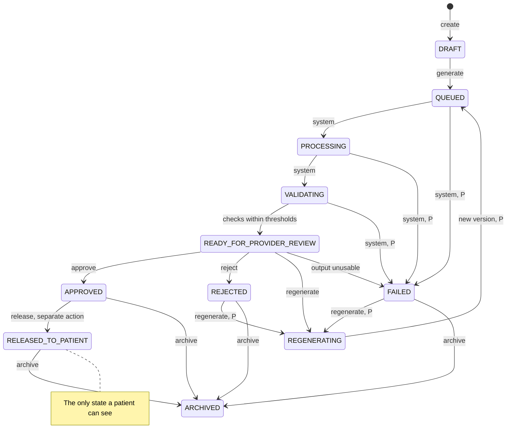

# AI simulation rules

| | |
|---|---|
| Version | 1.0 |
| Status | Layer 0 baseline, 2026-09-28 |
| Authority | Production Bible §1.1–1.2 (goals and non-goals), §9 (AI aesthetic outcome simulation, in full), §10 (similar-case labelling), §13.2 (patient visibility), §21.4 (AI/regulatory boundary), §23.2, §30 (constitution), §34.2 (acceptance #22–31). ADR-0008 (spec proposals adopted). |
| Normative sources | [`TECHNICAL_SPECIFICATION.md`](TECHNICAL_SPECIFICATION.md) §1.4 (G3–G6, G11), §3.4 (flow B), §4.4, §4.5, §4.7, §5.4.2, §6.3 (Simulations), §6.5, §6.6.3–6.6.5, §7.3, §7.7, §10.2 (UD-20, UD-29, UD-32); [`schema.prisma`](technical-spec/schema.prisma) `Simulation*`, `AIModelVersion`; [`constraints.sql`](technical-spec/constraints.sql) Layer 8; [`DESIGN_SYSTEM.md`](DESIGN_SYSTEM.md) §2 (C11–C12) and §3 |

These are the binding rules for AI outcome visualizations. Every rule has an ID (SIM-nn), its source, and how it is verified: **Test** means an automated test that must pass in CI; **Review** means a human check recorded in the layer acceptance review. The architecture that runs simulations is in [AI_ARCHITECTURE.md](AI_ARCHITECTURE.md).

---

## 1. How these rules work

- They bind Layers 7 and 8 (and Layer 9 for SIM-05). A feature that breaks one does not pass acceptance.
- They restate the Bible and the spec; they add no product behaviour. Where a value is not specified, the rule says so and points to the open items (section 9).
- Changing a rule is a change to locked behaviour: an ADR and a `CHANGELOG.md` entry come first [B §0].

---

## 2. Language and claims

| ID | Rule | Source | Verified by |
|---|---|---|---|
| SIM-01 | The product calls the output a **simulation** or **visualization**. It is never called a guaranteed result, an exact prediction or an outcome probability, in staff or patient text. | [B §9 preamble, §1.2, §30]; spec §1.4 G5 | Review of every simulation string at Layer 8 acceptance; UI tests that assert the forbidden phrases are absent from simulation screens |
| SIM-02 | No guarantee language anywhere: "guaranteed", "will look", "results in". Patient-facing text aims at about an 8th-grade reading level. | DESIGN_SYSTEM.md §3 | Copy review; UI string checks |
| SIM-03 | The patient-facing disclaimer is shown **verbatim**: "AI-generated visualization for consultation purposes. Actual clinical outcomes vary. This visualization is not a guarantee or prediction of medical results." The server adds it to every portal simulation DTO as a **required** field, so the DTO cannot be serialized without it. The app shows it above the image, and it is not collapsible. | [B §9.1, §34.2 #29]; spec §6.6.4; DESIGN_SYSTEM.md §3 | Test: contract test that the portal schema requires `disclaimer` equal to the constant; patient-app UI test |
| SIM-04 | Every AI image carries an "AI visualization" tag on the image itself, using the `simulation` colour role and never the accent, so it cannot be mistaken for a photo. | DESIGN_SYSTEM.md §3, §7 | Test: UI tests on staff and patient screens; Review |
| SIM-05 | Historical cases are labelled **"Similar Historical Cases"**, never "Your Predicted Result", and are never presented as the patient's outcome. | [B §10] | Test: Layer 9 UI test; Review |

---

## 3. What may be visualized

### 3.1 Categories

The seven initial categories, verbatim from Bible §9.6, with their enum values:

| Bible category | `SimulationCategory` | Provider controls / restrictions [B §9.6] |
|---|---|---|
| Lip filler | `LIP_FILLER` | Upper/lower visual volume, projection, Cupid's bow/vermillion definition; no dosage |
| Rhinoplasty | `RHINOPLASTY` | Bridge/dorsal contour, tip projection/rotation, width; no surgical-technique recommendation |
| Botulinum-toxin aesthetic visualization | `BOTULINUM_TOXIN` | Region-based appearance visualization; no brand, drug, units, depth, needle, or injection plan |
| Cheek/chin/jaw filler | `CHEEK_CHIN_JAW_FILLER` | Visual contour/intensity only; no product or dosing |
| Facelift/neck lift/blepharoplasty/brow lift | `FACIAL_LIFT_PROCEDURES` | Visualization parameters defined per validated model; no guarantee |
| Breast/body contour procedures | `BREAST_BODY_CONTOUR` | Multi-view visualization when validated; no operative-plan automation |
| Skin resurfacing/tightening | `SKIN_RESURFACING_TIGHTENING` | Appearance visualization only within validated domain |

`Simulation.procedureKey` names a specific procedure within a category (for example `BLEPHAROPLASTY`); `treatmentRegion` names the region.

### 3.2 Rules

| ID | Rule | Source | Verified by |
|---|---|---|---|
| SIM-06 | Only the seven categories above exist. A category ships only when its model version is validated; lip filler is first, and each further category is its own micro-prompt. | [B §9.6]; roadmap M8.2, M8.5 | Test: traceability check (7 categories); Review: validation evidence before each rollout |
| SIM-07 | **Visual parameters only.** Provider controls are the allow-list in the active model version's `parameterSchema`. The allow-list has no dosage, product, brand, drug, unit, depth, needle, injection-plan or technique field. The API rejects any parameter not in the allow-list, both at `PUT …/parameters` and at `/generate`. The keys in spec §6.6.3 (`upperLipVolume`, `cupidsBowDefinition`) only illustrate the style. | [B §9.6, §34.2 #31]; spec §1.4 G6, §3.4 flow B, §6.6.3 | Test: API test that an unknown parameter is rejected; contract test that the staff DTO has no such fields; `check_traceability.py` rejects any dose, unit, product, drug, depth, technique or syringe field on `SimulationParameter` (ADR-0017); Review of each `parameterSchema` before activation |
| SIM-08 | Parameter controls in the UI use visual terms only (volume, definition, projection) with a note that the model has no dose, product, unit, depth or technique settings. No control is labelled with units, syringes or dosage. | DESIGN_SYSTEM.md §3 | Test: UI test; Review |
| SIM-09 | **No recommendation.** The feature never produces a dosage, product, drug, technique, diagnosis, treatment recommendation or guaranteed-outcome statement. No simulation DTO has a field that could carry one. | [B §1.2, §21.4, §30, §34.2 #31]; spec §6.6.3 | Review of every simulation DTO and event at Layer 8 acceptance |
| SIM-10 | **Inputs.** Every source photo belongs to the same patient (database-enforced), is `ACCEPTED`, and holds the current grant simulation use requires (baseline `CLINICAL_USE`). Poor-quality input fails with the safe, actionable `INPUT_QUALITY_INSUFFICIENT`; input outside the validated domain returns `UNSUPPORTED_SIMULATION_INPUT`. | [B §34.2 #24]; spec §3.4 flow B, §6.2; UD-32 | Test: E6 (database); API tests for each failure |

---

## 4. Pipeline, identity preservation and thresholds

| ID | Rule | Source | Verified by |
|---|---|---|---|
| SIM-11 | Every generation runs the Bible pipeline in order: input quality validation, landmark detection, treatment-region segmentation, identity representation, provider-defined parameters, constrained transformation, outside-region identity similarity check, artifact detection, output validation. Every check is stored as an `AIValidationRecord` of that version. | [B §9.2]; spec §3.4 flow B | Test: integration test that each version has one record per check; Review of the pipeline per model |
| SIM-12 | **Identity preservation.** Unintended change outside the treatment region is minimized. A lip visualization must not unnecessarily alter eyes, nose, ears, hair, unrelated skin, background or overall identity. The outside-region identity check runs as the model specification defines. | [B §9.5, §34.2 #25] | Test: identity-preservation regression per model version (`IDENTITY_PRESERVATION_REGRESSION`, `MODEL_BENCHMARK`) before activation [B §27.1]; per-output check records |
| SIM-13 | **Thresholds** live in `AIModelVersion.thresholds` (a required field) and are frozen with the version. **The Bible and the spec set no numeric value.** The values in the spec §6.6.3 example (score 0.984, threshold 0.970) show the shape only and are not requirements. Values are set per validated model with its evidence. | [B §9.5]; spec §6.6.3, §11.4 item 5 | Test: E1 (version immutable); Review of thresholds and evidence at rollout |
| SIM-14 | `VALIDATING → READY_FOR_PROVIDER_REVIEW` only when every check is `PASS` or `FLAG` within thresholds. A breach sends the simulation to `FAILED` with a safe error code. Outputs crossing a threshold are rejected or flagged before release; the reviewer sees every check result in the staff DTO. | [B §9.5]; spec §5.4.2, §6.6.3 | Test: transition-table unit tests; API test with a failing check |

---

## 5. Review, approval and release

| ID | Rule | Source | Verified by |
|---|---|---|---|
| SIM-15 | **Provider review is required.** Only `/approve` or `/reject` by a holder of `simulation.approve` decides a reviewed output, and the reviewer must be a `ProviderProfile` of the same organization. A CONSULTANT with `simulation.review` can view but not decide. Decisions reference a version of the same simulation and are append-only. | [B §9.2, §9.4, §34.2 #27]; spec §3.4 flow B step 4, §4.5 note 2 | Test: R18, E11, E14; authorization matrix tests |
| SIM-16 | **Approve and release are separate steps.** Approval releases nothing. `/release` (`simulation.release`) is a second explicit action, allowed only from `APPROVED`; from any other state it returns `409 INVALID_STATE_TRANSITION` (spec §6.6.5). In the UI, release has its own confirmation sheet that names who will see what. | [B §9.2, §34.2 #28]; spec §5.4.2; DESIGN_SYSTEM.md C11–C12 | Test: API test releasing from `READY_FOR_PROVIDER_REVIEW` returns 409; UI test of the separate sheet |
| SIM-17 | **Release record.** Release requires the current `PATIENT_APP` grant, attaches the disclaimer, and records `releasedVersionId`, `releasedAt` and `releasedById`. The released version must be one of the simulation's own versions (database) **and** the approved one (API). The permission versions relied on are pinned through `MediaRelease` and `MediaReleasePermission`. `Idempotency-Key` is required; audit `SIMULATION_RELEASED`. | [B §7.3, §9.2]; spec §1.4 G3, §5.4.2, §6.3; UD-20 | Test: E12–E13, R15; API test that releasing a non-approved version is rejected |
| SIM-18 | **Patients see released simulations only.** The portal returns a simulation only when its status is `RELEASED_TO_PATIENT`, only its `releasedVersionId`, and only through the separate portal namespace with the fields of spec §6.6.4. `DRAFT`, `QUEUED`, `PROCESSING`, `VALIDATING`, `READY_FOR_PROVIDER_REVIEW`, unreleased `APPROVED`, `REJECTED`, `REGENERATING`, `FAILED` and `ARCHIVED` are never visible, and neither are other versions, parameters, validation scores or internal notes. | [B §13.2, §30, §34.2 #26]; spec §1.4 G4, §4.7, §6.5, §6.6.4 | Test: portal visibility tests for every state (spec §7.5); contract test on the portal DTO |
| SIM-19 | No transition takes a `RELEASED_TO_PATIENT` simulation back into review. It can only be archived (`simulation.approve`), which removes it from the portal because the portal filter is `RELEASED_TO_PATIENT`. | spec §4.7, §5.4.2 | Test: transition-table tests; portal test after archive |

---

## 6. Versioning and regeneration

| ID | Rule | Source | Verified by |
|---|---|---|---|
| SIM-20 | **One generation, one version.** Every `/generate` and `/regenerate` creates a new `SimulationVersion` (next `versionNumber`) and a new `AIJob`. Nothing is overwritten; earlier versions stay. | [B §9.2, §9.4]; spec §3.4 flow B, §5.4.2 | Test: API test; E9–E10 |
| SIM-21 | **Parameters.** Provider parameters are editable only while `DRAFT` (`draftParameters`, `PUT …/parameters`). `/generate` freezes them into append-only `SimulationParameter` rows, each with exactly one value. A regeneration may supply new parameters; they are recorded on the new version only. | spec §3.4 flow B, §6.3 | Test: R14, E15; API test that editing outside `DRAFT` returns 409 |
| SIM-22 | **Regeneration edges.** `READY_FOR_PROVIDER_REVIEW → REGENERATING` (Bible); `REJECTED` or `FAILED → REGENERATING` and `REGENERATING → QUEUED` with a new version (spec proposals, UD-29). Needs `simulation.generate` and an `Idempotency-Key`; audit `SIMULATION_REGENERATED`. There is no regeneration from `APPROVED` or `RELEASED_TO_PATIENT`. | [B §9.3]; spec §5.4.2; UD-29 | Test: unit tests for every allowed and forbidden edge |
| SIM-23 | **Idempotent jobs.** `/generate` and `/regenerate` require an `Idempotency-Key`; a retry never creates a second job. | [B §20.3, §23.3]; spec §6.1.8 | Test: repeated request yields one `AIJob` |
| SIM-24 | **Provenance is complete and immutable.** Every version references its source assets, model and version, inference configuration, parameters, output, optional mask, timestamps, generating user, reviewing provider, and approval and release events. The provenance core never changes, and a completed version never changes at all. | [B §9.4, §34.2 #23]; spec §5.2 | Test: E7–E10 |
| SIM-25 | **No silent model replacement.** A version runs only through an explicit, audited rollout, and the version used is recorded on the `SimulationVersion`. | [B §9.7]; spec §1.4 G11 | Test: E1–E5, R10–R13 |

---

## 7. Access, audit and operations

| ID | Rule | Source | Verified by |
|---|---|---|---|
| SIM-26 | **Authorization.** Create and set parameters: `simulation.create`. Generate and regenerate: `simulation.generate`. View: `simulation.review`. Approve, reject, archive: `simulation.approve`. Release: `simulation.release`. Default grants follow spec §4.5 (UD-17). Resources of another organization return a generic 404. | [B §3.3, §34.2 #22, #27]; spec §4.4–4.6 | Test: generated authorization matrix and cross-tenant tests |
| SIM-27 | **Every lifecycle event is audited**, in the same transaction as the change: `SIMULATION_CREATED*`, `SIMULATION_GENERATED`, `SIMULATION_STATUS_CHANGED*` (actor `SERVICE` for system steps), `SIMULATION_APPROVED`, `SIMULATION_REJECTED`, `SIMULATION_REGENERATED`, `SIMULATION_RELEASED`, and `SIMULATION_VIEWED` on every staff or patient content access. Metadata holds identifiers and codes only. | [B §22.1, §22.2, §34.2 #30]; spec §3.3, §5.4.2, §7.3 | Test: API tests assert one audit row per transition; G1–G3 |
| SIM-28 | **Online only.** Generation, regeneration, review decisions and release are not offline operations: none is an offline-capable create, and generation and release are excluded explicitly. | [B §23.2]; spec §6.1.8, §8; DESIGN_SYSTEM.md §6 | Test: iOS UI test of the offline state |
| SIM-29 | A consultation cannot complete while any of its simulations is `QUEUED`, `PROCESSING` or `VALIDATING`. | spec §5.4.1; UD-33 | Test: API test of the completion precondition |
| SIM-30 | **Originals stay untouched.** The output is a new `AI_SIMULATION_DERIVATIVE`; source photos are never modified. | [B §6.6, §30] | Test: C1–C4, C8–C9 |
| SIM-31 | **No permission follows from a simulation.** Generating, approving or releasing a simulation never grants or implies `AI_TRAINING` or any other category, and no output enters a dataset except under spec §7.7. | [B §7.1, §7.3, §30]; spec §7.7 | Test: D3; Review |
| SIM-32 | **Intended use.** Claims do not expand beyond clinician-controlled visualization without intended-use and regulatory review. | [B §21.4, §36] | Review at production readiness |

`*` marks spec-proposed events (spec §7.3, adopted under UD-19).

---

## 8. State machine and acceptance map

Diagram of spec §5.4.2 (the table there is normative). "P" marks spec proposals adopted by ADR-0008 and confirmed at Layer 8 (UD-29).

| Bible §34.2 acceptance criterion | Rules |
|---|---|
| #22 Only authorized users can create/generate | SIM-26 |
| #23 Every generation references source assets and model/version | SIM-24, SIM-25 |
| #24 Unsupported or poor-quality inputs fail with safe, actionable status | SIM-10 |
| #25 Outside-region identity validation runs per the model specification | SIM-12, SIM-14 |
| #26 Patient cannot see `READY_FOR_PROVIDER_REVIEW`, `REJECTED` or `FAILED` | SIM-18 |
| #27 Only an authorized provider can approve | SIM-15 |
| #28 Release is a separate explicit action after approval | SIM-16 |
| #29 Patient-facing release includes the disclaimer | SIM-03 |
| #30 All lifecycle events are audited | SIM-27 |
| #31 No dosage, product, drug, technique or guaranteed-outcome recommendation | SIM-07, SIM-09 |

---

## 9. Open items

| Item | Decided at |
|---|---|
| Whether a `FLAG` result may be approved, and how it is shown to the reviewer | Layer 8 kickoff |
| Numeric thresholds per model version and category (SIM-13) | Per category, Layer 8 (M8.2, M8.5) |
| Portal reads of released simulations: spec §4.7 does not repeat the use-time `PATIENT_APP` grant check that Bible §7.3 and UD-20 require; confirm it applies | Layer 8 kickoff with UD-20 |
| Which photos' permission versions a simulation release pins (the sources are the natural reading) | Layer 8 (M8.3) |
| UD-29 proposed transitions and `SIMULATION_GENERATED` timing; UD-32 simulation-source grant | Layer 8 kickoff |
