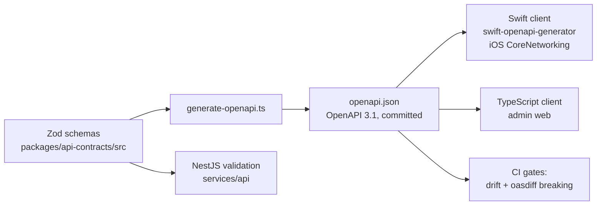

# API contracts

| | |
|---|---|
| Version | 1.0 |
| Status | Layer 0 baseline, 2026-09-28; updated for the Layer 1 kickoff decisions (ADR-0018), 2026-09-29 |
| Authority | Bible §20 (API contract and service conventions), §13 (patient app), §21.2, §23.3; ADR-0001, ADR-0006, ADR-0008, ADR-0018 (Layer 1 kickoff: K-09, K-11, K-17) |
| Normative sources | spec §6 (conventions §6.1, error catalog §6.2, endpoint catalogs §6.3 and §6.5, DTOs §6.6, internal contracts §6.7, tooling §6.8); `packages/api-contracts` and its generated `openapi.json` |

This document explains how the API is described, versioned, validated and checked. The endpoint catalogs stay in spec §6.3 (staff and admin) and spec §6.5 (patient portal), and are not repeated here. Code in `packages/api-contracts` is the executable form of this document.

## 1. Surfaces

| Surface | Base path | Callers | Auth |
|---|---|---|---|
| Staff and admin API | `/api/v1/…` | Provider iOS app, admin web | Bearer access token; tenant context from the token only. The admin web's refresh token travels only in an `HttpOnly` cookie limited to `/api/v1/auth/token/refresh`, with an `Origin` check (spec §4.2) |
| Patient portal API | `/api/v1/portal/…` | Patient iOS app | Bearer token for a patient identity; deny-by-default visibility (spec §4.7) |
| Internal service API | `/internal/v1/…` | api ↔ ai-gateway, api ↔ integration-service | Service-to-service auth inside the VPC; never internet-routable (spec §6.7) |
| Vendor webhooks | `/webhooks/v1/{vendor}` | EMR and other vendors | Vendor signature (HMAC), replay-protected, then enqueued |
| Health | `/health/live`, `/health/ready` | Load balancer | Unauthenticated; no data and no dependency details |

The patient portal has its own DTOs. Staff shapes are never reused for patients, so a new staff field can never leak into the patient app by accident (spec §6.5, [B §13.2]).

## 2. The contract pipeline

1. **Zod schemas are the source.**
   - Every request, response and error shape is a Zod schema in `packages/api-contracts`.
   - The server validates requests with them and rejects unknown fields (spec §3.3 step 7).
   - Enum values will be generated from the Prisma enums, so the database and the API cannot drift (spec §6.8; `packages/shared-types`, Layer 1).
2. **`openapi.json` is generated and committed.** `pnpm --filter @aestara/api-contracts build` renders it; nobody edits it by hand.
3. **Clients are generated.**
   - The iOS client comes from `openapi.json` through Apple's swift-openapi-generator, inside `CoreNetworking`.
   - The admin web client is generated the same way.
   - Neither is ever written by hand (spec §2.2). Both arrive with the first endpoints in Layer 1.
4. **CI gates.**
   - The committed document must equal a fresh render. A unit test checks this, and so does the `git diff` step after the build.
   - `oasdiff breaking` against the base branch must report nothing at error level.

Rule for schema files: import `z` from `src/zod.ts`, never from `zod`. That module extends Zod once so every schema can be registered as a named OpenAPI component.

## 3. What Layer 0 defines

Layer 0 delivers only the primitives every endpoint shares. `openapi.json` has an empty `paths` object until Layer 1 adds endpoints.

| Component | Kind | Rule | Source |
|---|---|---|---|
| `Uuid` | schema | Resource IDs are UUID strings | spec §6.1.2 |
| `RequestId` | schema | Server-generated UUIDv7, returned in `X-Request-Id` and in every error | spec §6.1.4 |
| `Timestamp` | schema | RFC 3339 UTC with milliseconds, e.g. `2026-09-25T14:03:11.412Z` | spec §6.1.2 |
| `DateOnly` | schema | `YYYY-MM-DD` | spec §6.1.2 |
| `Money`, `Currency` | schema | Decimal string with two fraction digits plus currency; USD only (ADR-0006); never a float | spec §6.1.2 |
| `ErrorCode` | schema | UPPER_SNAKE string; a catalog code or `<RESOURCE>_NOT_FOUND`. Clients must tolerate unknown codes. | spec §6.1.1, §6.2 |
| `FieldError`, `ErrorDetails` | schema | Field-level validation errors; details never contain PHI | spec §6.1.5 |
| `ErrorEnvelope` | schema | `{ error: { code, message, requestId, details? } }`; strict (no extra keys) | Bible §20.4, spec §6.1.5 |
| `PageInfo` | schema | `{ nextCursor?, hasMore }`; no total counts | spec §6.1.6 |
| `Limit`, `Cursor` | parameters | `limit` 1–100 (default 25); opaque, signed, expiring `cursor` | spec §6.1.6 |
| `IdempotencyKey` | parameter | `Idempotency-Key: <UUID>`; retained 7 days per actor | spec §6.1.8 |
| `IfMatch` / `ETag` | parameter / header | `"v{version}"`; required on PATCH and state changes of versioned resources | spec §6.1.7 |
| `ClientRequestId` | parameter | Optional `X-Client-Request-Id`; logged, never trusted | spec §6.1.4 |
| `Retry-After` | header | On 409 (idempotency in progress), 429 and 503 | spec §6.1.8, §6.1.10 |
| `Error400` … `Error503` | responses | One reusable error response per status in the catalog, plus 404 | spec §6.2 |
| `bearerAuth` | security scheme | HTTP bearer; the only way tenant context reaches the server | spec §6.1.3 |

The TypeScript helpers are `resourceEnvelope(schema)` for `{ data }` and `collectionEnvelope(schema)` for `{ data, page }` (spec §6.1.5). There is also `httpStatusFor(code)` and the `ERROR_CATALOG` constant, which the api will use to map domain errors to responses.

## 4. Conventions every endpoint follows

These rules are normative in spec §6.1; this is the checklist form.

1. **JSON and camelCase** fields; `UPPER_SNAKE` enums; absent optional fields are omitted, not `null`.
2. **Tenant context comes from the token only.** There is no organization header, and an `organizationId` in a path or body is never treated as entitlement.
3. **No PHI or secrets in URLs.** Search terms, names, date of birth, email and phone travel in request bodies (`POST …/search`), because URLs end up in load balancer, WAF and proxy logs. Invitation, password-reset and verification tokens also travel only in request bodies, never in a path or query string (spec §6.1.10; ADR-0018 K-09).
4. **No enumeration.** A resource that does not exist, belongs to another tenant, or is outside the caller's scope gets the same `404 <RESOURCE>_NOT_FOUND` body; only the `requestId` differs. `403 PERMISSION_DENIED` is returned only when the caller can already see the resource.
5. **Cursor pagination** with an allow-listed `sort`. Unknown query parameters return `400 VALIDATION_FAILED`.
6. **Optimistic concurrency.** Stale `If-Match` returns `412 VERSION_CONFLICT`; a missing one returns `428 PRECONDITION_REQUIRED`. The server never merges silently.
7. **Idempotency** is required on:
   - uploads
   - signatures
   - AI jobs
   - sync triggers
   - exports
   - message sends
   - every create that can be queued offline (photo session, photo, annotation, note)
   - patient creation, which is online-only because the duplicate check needs the server; the key only makes a retried request safe (spec §6.1.8; ADR-0018 K-17)

   Same key with a different body returns `409 IDEMPOTENCY_KEY_REUSED`.
8. **Media is always accessed through short-lived presigned URLs.**
   - Uploads get 10 minutes; downloads get 120 seconds (10 minutes for exports).
   - Object keys are opaque and never returned as data (spec §6.1.9).
9. **Errors are generic and safe.** They never contain stack traces, SQL, storage keys or hints that a record exists in another tenant (Bible §20.4). `500 INTERNAL_ERROR` details go to server logs only, keyed by `requestId`.
10. **Every state change** is an explicit action endpoint (`POST …/{id}/approve`), checked against the state machines in spec §5.4. There is no generic `PATCH status`.

## 5. Versioning and breaking changes

| Change | Allowed in v1? | How |
|---|---|---|
| New endpoint, new optional request field, new response field | Yes | Additive; regenerate `openapi.json` |
| New enum value or error code | Yes | Clients must tolerate unknown values (spec §6.1.1); iOS decoding uses a fallback case |
| Removing or renaming a field, endpoint or enum value; making an optional field required; tightening validation | No | Needs `/api/v2`; the oasdiff gate fails the build otherwise |
| Deprecation | Yes | `Deprecation` and `Sunset` headers at least one release ahead |

Run the gate locally with `pnpm --filter @aestara/api-contracts openapi:breaking`. It needs oasdiff v1.32.1: `go install github.com/oasdiff/oasdiff@v1.32.1`. It compares against `origin/main`; before the first contract reaches `main` it reports that there is no baseline.

## 6. Adding an endpoint (from Layer 1)

1. Confirm the endpoint, its permission and its audit event in spec §6.3/§6.5. If they are missing, raise an unresolved decision first; don't invent one (Bible §0.1).
2. Define request and response schemas in `packages/api-contracts/src/<domain>/…` from existing primitives. Use `resourceEnvelope` or `collectionEnvelope`.
3. Register the path in `buildRegistry()` with:
   - its `security`
   - reusable error responses (`$ref: '#/components/responses/Error404'`, …)
   - the `IdempotencyKey` or `IfMatch` parameter where spec §6.1 requires it
4. Run `pnpm --filter @aestara/api-contracts build test`, then commit `openapi.json`.
5. Implement it in `services/api` with the permission guard, validation from the same schema, the audit event, and the contract tests from [TESTING_STRATEGY.md](TESTING_STRATEGY.md):
   - declared permission
   - error envelope
   - pagination
   - idempotency
   - cross-tenant 404

Layer 1 builds the spec §6.4 subset. The Layer 1 kickoff (ADR-0018) added four endpoints to spec §6.3:
- `POST /auth/password/change`: change the password with the current password and a recent MFA
- `POST /auth/invitations/accept`: accept a staff invitation, with the token in the request body
- `POST /users/{id}/mfa-reset`: an administrator resets the second factors of a user who has lost them all
- `POST /organizations/{id}/admin-bootstrap`: the platform invites the first ORGANIZATION_ADMIN of an organization that has none

It also moved the patient invitation token into the request body: `POST /auth/patient-invitations/accept` (spec §6.5, Layer 5).

## 7. Internal and event contracts

Service-to-service contracts (spec §6.7) carry opaque object references, never demographics:
- AI job submission
- AI job result events
- image derivative jobs
- notification requests

Notification messages have **no content field**; the text is rendered from a template key with no PHI (Bible §14.3). These schemas join `packages/api-contracts` with the layer that builds each service: image jobs in Layer 2, notifications in Layer 5, AI in Layer 7.

## Open items

| Item | Where decided |
|---|---|
| Error-code clients: exact iOS fallback decoding pattern for unknown enum values | Layer 1, with the first generated Swift client |
| Enum generation from Prisma enums into `packages/shared-types` | Layer 1 (M1.1) |
