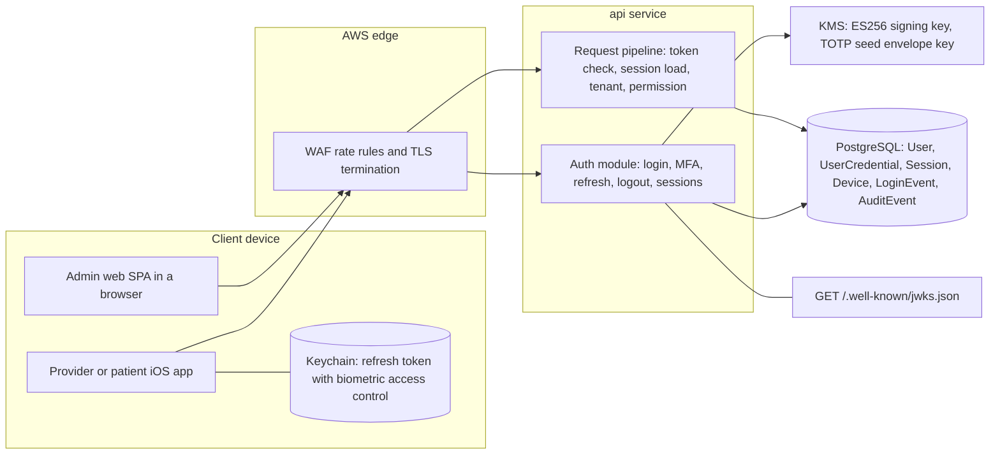
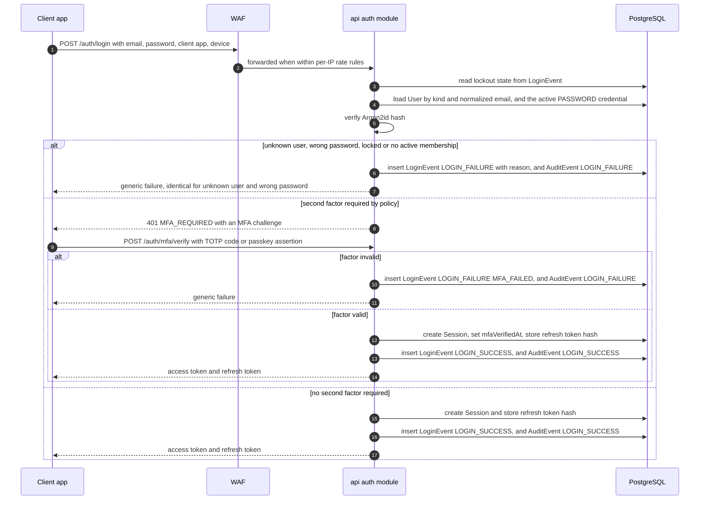
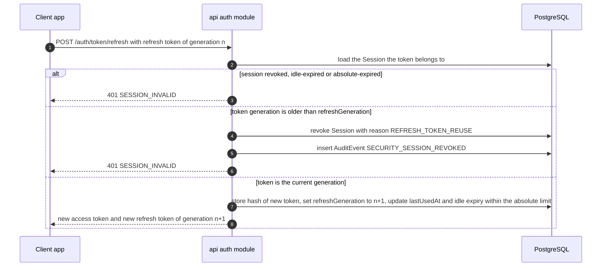
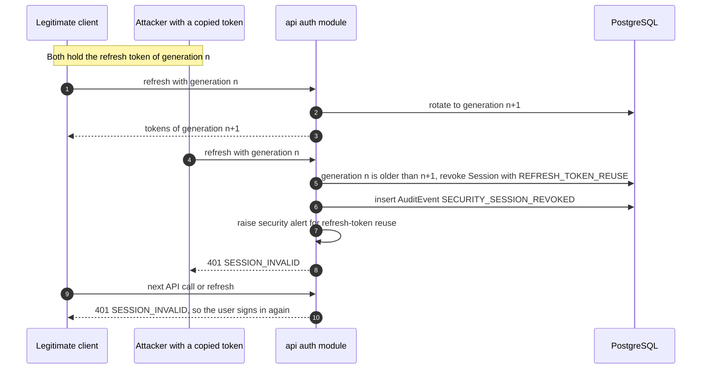
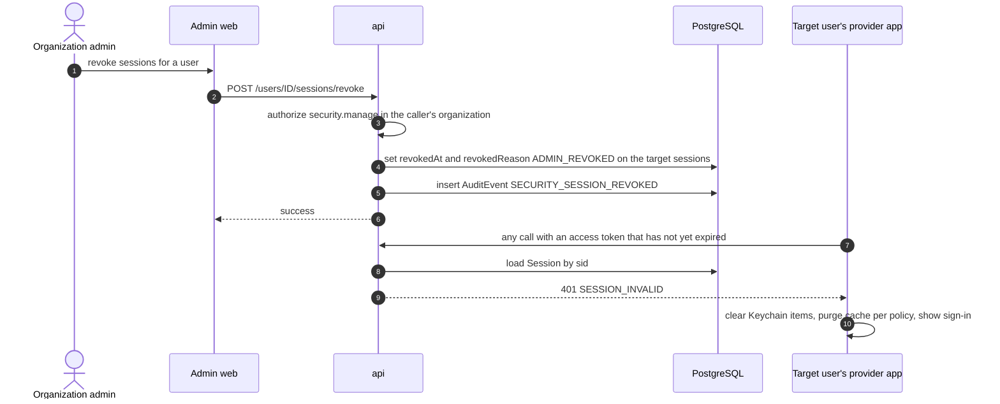
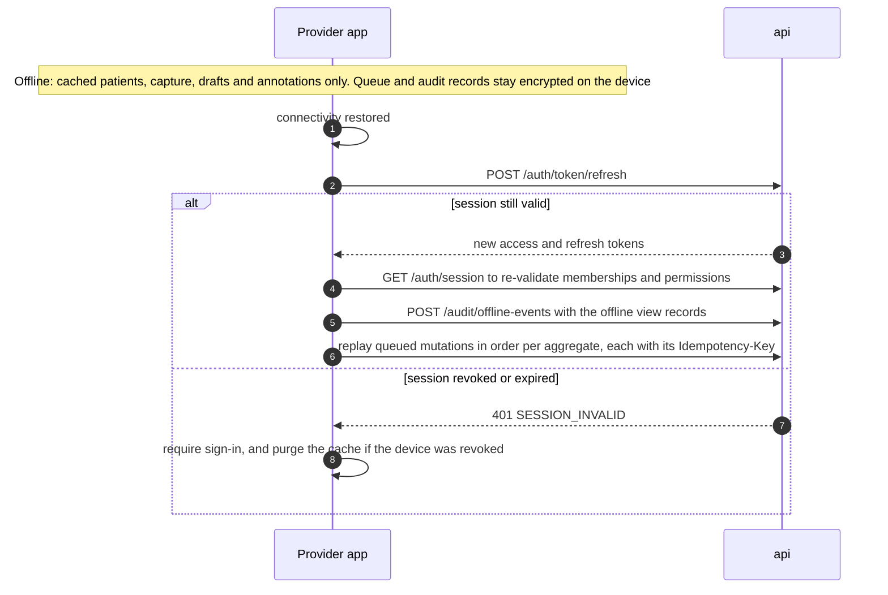

# Authentication Architecture

| | |
|---|---|
| Version | 1.0 |
| Status | Layer 0 baseline, 2026-09-28 |
| Authority | Production Bible §21.1 (authentication), §22.1 (audit), §23 (offline), §24.5 (deep links), §36 (readiness). ADR-0002 (first-party identity, D-02), ADR-0003 (admin SPA), ADR-0005 (iOS 26), ADR-0008 (delegated baselines UD-18, UD-27) |
| Normative sources | [`TECHNICAL_SPECIFICATION.md`](TECHNICAL_SPECIFICATION.md) spec §4.2 (authentication), spec §3.3 (request pipeline), spec §6.1.3 (tenant context), spec §6.3 (auth endpoints), spec §6.5 (patient invitation), spec §6.7 (service auth), spec §7.3 (audit), spec §7.5 (tests), spec §8 (offline). `schema.prisma` models `User`, `UserCredential`, `Session`, `Device`, `LoginEvent`; `constraints.sql` Layer 1 fragment |

How Aestara proves who is calling: people on three client surfaces, and backend services. It covers identities, credentials, sessions and tokens, client handling, the sign-in, MFA, refresh and revocation flows, lockout, recovery, offline re-authentication, audit and tests. What an authenticated caller may do is in [`AUTHORIZATION_RBAC.md`](AUTHORIZATION_RBAC.md).

---

## 1. Design summary

Owner decision D-02 (ADR-0002): identity lives in the API as a **first-party, OIDC-compatible** module.

| Property | Design | Source |
|---|---|---|
| Protocol | OAuth 2.1 / OIDC-compatible token semantics; public keys at `GET /.well-known/jwks.json` | spec §4.2, spec §6.3 |
| Passwords | Argon2id | spec §4.2 |
| Second factors | TOTP and WebAuthn passkeys | spec §4.2 |
| Access token | Signed JWT, ES256, key in KMS, **10-minute** lifetime, no permissions inside | spec §4.2 |
| Refresh token | Opaque, stored only as a hash, **rotated on every use**, reuse revokes the whole session | spec §4.2 |
| Session | Server-side `Session` row, loaded on **every** request, so revocation is immediate | spec §3.3, spec §7.5 |
| Libraries | `jose` 6.2, `@node-rs/argon2` 2.2, `otplib` 13.5, `@simplewebauthn/server` 14.0. No custom cryptography | spec §2.1, ADR-0002 |
| Assurance | Threat model in Layer 0 ([`THREAT_MODEL.md`](THREAT_MODEL.md)); external penetration test before production | ADR-0002 |

---

## 2. Identities

| Identity | Record | Tenant link | Client (`ClientApp`) | First layer |
|---|---|---|---|---|
| Staff | `User` of kind WORKFORCE | `Membership` per organization, plus scoped `UserRole` rows | `IOS_PROVIDER`, `ADMIN_WEB` | L1 |
| Platform operator | `User` of kind WORKFORCE with a PLATFORM-scope SUPER_ADMIN assignment | None needed: the assignment carries no organization | `ADMIN_WEB` | L1 |
| Patient | `User` of kind PATIENT | ACTIVE `PatientUserLink` per organization | `IOS_PATIENT` | L5 |
| Service | No `User` row | None: services act on identifiers passed in jobs | Not applicable | L2 onward |

Rules that bind implementers:

- `User` is **platform-level**, not tenant-owned: one person may hold memberships in several organizations (spec §4.1).
- `(kind, email)` is unique, and email is stored trimmed and lower-cased. The same address can therefore exist once as staff and once as patient; they are separate identities with separate credentials and sessions.
- `User.status` is INVITED, ACTIVE, LOCKED or DISABLED. `user.disable` acts on the **membership** in one organization, not on the platform user (schema comment on `Membership`). Users are disabled, never deleted (spec §5.1).
- Staff reach tenant data only through Membership plus UserRole, and patients only through PatientUserLink; never through `User` alone (schema comment on `User`).

---

## 3. Credentials

`UserCredential` holds all first-party credentials; secrets are never stored in plaintext. A database CHECK enforces the shape of each type, and a partial unique index allows only one active password per user (`constraints.sql`, Layer 1).

| Type | Stored as | Role | Rules |
|---|---|---|---|
| PASSWORD | Argon2id PHC string (`passwordHash`) | First factor | One active password per user. Hashing parameters and the password policy (length, breached-password checks) are not specified: set at Layer 1 (M1.3) and recorded in [`SECURITY_REQUIREMENTS.md`](SECURITY_REQUIREMENTS.md) |
| TOTP | Seed envelope-encrypted with a KMS key (`totpSecretCiphertext`) | Second factor | spec §4.2, spec §7.1 |
| WEBAUTHN | Credential ID, public key, signature counter | Second factor (passkey) | Relying-party ID and associated-domain setup for the apps are decided at M1.3 |

- **Enrollment and removal:** `POST /auth/mfa/enrollments` and `DELETE /auth/mfa/enrollments/{id}` need an authenticated session **plus step-up**, and enrollment needs an `Idempotency-Key` (spec §6.3).
- **Revocation:** credentials are revoked by setting `revokedAt`; they are not deleted.
- **MFA policy:** MFA is required for the admin web and for any admin role, per deployment policy, held in `OrganizationSetting` key `security.mfaPolicy` (spec §4.2; Bible [B §21.1] "Administrative MFA support/requirement according to deployment policy"). Patient-app MFA is not specified; biometrics are optional there.
- The spec calls passkeys a second factor. Passwordless sign-in with a passkey as the only factor is not specified.

---

## 4. Sessions and tokens

### 4.1 The session record

A `Session` row exists for every signed-in client. It is the unit of revocation.

| Column | Meaning |
|---|---|
| `userId`, `clientApp`, `deviceId` | Who, on which app, on which registered install |
| `organizationId` | The active tenant bound into issued access tokens; NULL when no organization is selected (platform operators) |
| `refreshTokenHash`, `refreshGeneration` | Hash of the one current refresh token and its rotation counter |
| `mfaVerifiedAt` | When a second factor was last verified in this session; drives step-up |
| `idleExpiresAt`, `absoluteExpiresAt` | Idle and absolute expiry; a CHECK keeps idle ≤ absolute |
| `revokedAt`, `revokedReason`, `revokedById` | Revocation; a CHECK requires a reason whenever `revokedAt` is set |
| `ipAddress`, `userAgent`, `lastUsedAt` | Security metadata |

`Device` records the app install (only a hash of the installation identifier is stored), its APNs token (from Layer 5) and its own `revokedAt`. Revoking a device cascades to its sessions (spec §4.2).

### 4.2 Access token

| Claim | Content |
|---|---|
| `sub` | User ID |
| `sid` | Session ID; the pipeline loads this session on every request |
| `org` | Active organization; the only source of tenant context (spec §6.1.3) |
| `app` | Client application |
| `amr` | Authentication methods used |

- ES256, key in KMS, lifetime **10 minutes** (spec §4.2).
- The pipeline verifies signature, expiry and audience, then loads the session; a revoked, expired or idle session means **401** (spec §3.3 step 3). Issuer and audience values are fixed at M1.3.
- **Permissions are not embedded.** They are evaluated per request, so a revoked role takes effect on the next call.

### 4.3 Refresh token

- Opaque; only its hash is stored (`Session.refreshTokenHash`).
- **Rotated on every use.** Each refresh issues a new refresh token and increments `refreshGeneration`.
- **Reuse detection.** Presenting a token from an older generation is treated as theft: the whole session is revoked with reason `REFRESH_TOKEN_REUSE`, `SECURITY_SESSION_REVOKED` is audited, and a security alert fires (spec §4.2, spec §7.6).
- The server must be able to tell "an older generation of this session's token" from "an unknown token". The schema comment on `Session` defines reuse by generation; how the opaque token identifies its session and generation is an M1.3 implementation choice.
- Because the rule is strict, **clients must never have two refreshes in flight** for one session; a legitimate race would look like reuse. Whether the server tolerates a grace window is not specified (§14).

### 4.4 Lifetimes and re-authentication (UD-18 defaults, spec §4.2)

All values are defaults, configurable per organization.

| Client | Access token | Session idle | Session absolute | Local re-authentication |
|---|---|---|---|---|
| Provider app | 10 min | 8 h | 7 d | Face ID / Touch ID after 5 min in the background |
| Admin web | 10 min | 30 min | 12 h | Not applicable (MFA at sign-in) |
| Patient app | 10 min | 30 d | 90 d | Biometrics optional |

### 4.5 Step-up

Designated sensitive actions need a recent `mfaVerifiedAt`; otherwise the API returns `403 REAUTHENTICATION_REQUIRED` (spec §4.2, spec §6.2). On iOS, LocalAuthentication additionally gates signing and export on the device. Named so far: MFA enrollment and removal (spec §6.3), and leaving staff-assisted patient signing mode, which requires staff re-authentication (UD-31; `DESIGN_SYSTEM.md` rule C13). The full list and the recency window are not specified; each layer's feature prompt names its step-up actions, and the Layer 1 list is set at kickoff (UD-18).

### 4.6 Organization switch

`PUT /auth/session/organization` re-checks the membership in the target organization and issues new tokens bound to it (spec §4.2). Tokens for the old organization stop being useful for the new one because tenant context comes only from the token. How the first organization is chosen at sign-in for a user with several memberships is decided at M1.3.

### 4.7 Revocation

Revocation takes effect on the very next request, because every request loads the session (spec §3.3 step 3). Both the access token and the refresh token of a revoked session are rejected immediately (spec §7.5).

| Trigger | Endpoint or event | `revokedReason` | Audit |
|---|---|---|---|
| Sign out | `POST /auth/logout` | `LOGOUT` | `LOGOUT` |
| User revokes one of their own sessions or devices | `DELETE /auth/sessions/{id}` | `LOGOUT` or `DEVICE_REVOKED` (confirmed at M1.3) | `SECURITY_SESSION_REVOKED` |
| Administrator revokes a user's sessions or devices | `POST /users/{id}/sessions/revoke` (`security.manage`) | `ADMIN_REVOKED`, `DEVICE_REVOKED` | `SECURITY_SESSION_REVOKED` |
| User or membership disabled | `POST /users/{id}/disable` | `USER_DISABLED`, `MEMBERSHIP_DISABLED` | `USER_DISABLED`, `SECURITY_SESSION_REVOKED` |
| Refresh-token reuse | `POST /auth/token/refresh` | `REFRESH_TOKEN_REUSE` | `SECURITY_SESSION_REVOKED` |
| Credential changed | Password reset (spec §6.3 has no separate password-change endpoint) | `CREDENTIAL_CHANGED` (the reason exists in the schema; which sessions it revokes is decided at M1.3) | Not specified (§14) |

---

## 5. Client handling per surface

| Concern | Provider iOS/iPadOS | Patient iOS | Admin web SPA |
|---|---|---|---|
| Refresh token | Keychain, access control `.biometryCurrentSet` with device-passcode fallback (spec §4.2) | Keychain [B §21.1] | Held in memory plus a `SameSite=Strict` HttpOnly cookie (spec §4.2) |
| Access token | Not specified by the spec; kept in memory is the natural reading for a 10-minute token (confirm at M1.9) | As provider app | Not specified; in memory is the natural reading (confirm at M1.11) |
| Unlock | LocalAuthentication gates app unlock after 5 min in the background, and step-up actions (signing, export) | Biometrics optional | Not applicable |
| Browser controls | Not applicable | Not applicable | Strict CORS (admin origin only), `Cache-Control: no-store` on PHI responses, HSTS (spec §6.1.10) |
| MFA | Per organization policy | Not specified | Required (spec §4.2) |
| Deep links | Always re-run authorization; never trust cached UI state [B §24.5] | Same | Same (route guards are hints only) |
| On revocation or sign-out | Clear Keychain items; purge cached patients and media per cache policy (UD-25) | Clear Keychain items | Drop in-memory tokens; cookie handling per the M1.3 decision |

Notes:

- `.biometryCurrentSet` invalidates the Keychain item when the device's enrolled biometrics change, so the user must sign in again with the password. The Layer 1 app treats this as an ordinary sign-in, not an error.
- The admin SPA wording in spec §4.2 does not say which secret the HttpOnly cookie carries. The split (for example, cookie-held refresh credential versus in-memory tokens), page-reload behavior and any extra CSRF measure beyond `SameSite=Strict` plus strict CORS are decided at M1.3 together with the admin web shell (M1.11).
- The design prototype (`apps/design-prototype`) has no authentication by design (ADR-0009) and is never a reference for these flows.

---

## 6. Flows

All paths below are relative to `/api/v1`. Error codes are from spec §6.2.

### 6.1 Sign-in with password and second factor

- Which identity kind is authenticated follows from the client (`app`): the provider app and admin web sign in WORKFORCE users, the patient app PATIENT users. This is the reading of the `(kind, email)` key; confirm at M1.3.
- Spec §4.2 asks for "PKCE-style proof" for native apps. The Layer 1 endpoint set is a direct credential exchange at `/auth/login`; how the proof binds into that exchange is decided at M1.3.
- The diagram writes nothing when it returns the MFA challenge. `LoginFailureReason` includes MFA_REQUIRED, so the schema anticipates ledgering that step; whether it is written as a `LoginEvent` LOGIN_FAILURE, and whether it is also audited, is decided at M1.3.
- Patients first set their credentials by accepting an invitation: `POST /auth/patient-invitations/{token}/accept` (Layer 5), which links the account and audits `PATIENT_ACCOUNT_LINKED`.

### 6.2 Refresh and rotation

### 6.3 Reuse detection

The legitimate user loses the session too. That is the intended trade-off: whoever holds a stolen token can never keep a session alive quietly.

### 6.4 Administrative revocation

### 6.5 Reconnect after offline work

See §9 for the rules.

---

## 7. Lockout and rate limiting (UD-27)

| Control | Design | Source |
|---|---|---|
| Edge | AWS WAF per-IP rate rules on public and authentication endpoints | spec §6.1.10, spec §7.1 |
| Account | Progressive lockout after repeated login failures, computed from `LoginEvent` | spec §6.1.10 |
| Sensitive endpoints | Per-user limits on exports, AI generation and search; `429 RATE_LIMITED` with `Retry-After` | spec §6.1.10 |
| Counter store | Database-backed in Layer 1; a shared Valkey (ElastiCache) store once more than one API task runs | spec §10.2 (UD-27) |
| Correlation | `LoginEvent` stores the submitted identifier only as a keyed hash (`identifierHash`), plus IP and user agent, so brute-force patterns can be found without keeping typed input | `schema.prisma` |
| Alerts | Login-failure spikes, `ACCESS_DENIED` bursts, refresh-token reuse | spec §7.6 |

Server-side failure reasons (`LoginFailureReason`): INVALID_CREDENTIALS, ACCOUNT_LOCKED, ACCOUNT_DISABLED, NO_ACTIVE_MEMBERSHIP, MFA_REQUIRED, MFA_FAILED, RATE_LIMITED. They go to the ledger, never to the client in a form that reveals whether an account exists (spec §4.2).

**Not specified, decided at Layer 1 kickoff (UD-27, M1.3):** failure thresholds and the backoff curve; lock duration; whether lockout sets `User.status = LOCKED` or is purely time-based; the unlock path; and how a locked account is signaled without enabling enumeration.

---

## 8. Account recovery

| Case | Specified | Not specified (decision point) |
|---|---|---|
| Forgotten password | `POST /auth/password/forgot` and `POST /auth/password/reset`, public, with an **identical response for unknown accounts** (spec §6.3). Layer 1 | Delivery channel, token format, lifetime and single use; whether a reset also requires the second factor; which sessions are revoked (`CREDENTIAL_CHANGED` exists); the audit event. **Layer 1 kickoff (M1.3)** |
| Lost second factor (TOTP device or passkey) | Nothing | Recovery codes, administrator-assisted reset, identity proofing. **Layer 1 kickoff (M1.3)**, as a new entry in spec §10.2 plus an ADR, because it is the most common account-takeover path |
| Patient account recovery | Nothing | **Layer 5 kickoff**, with UD-08 |
| Email verification | `User.emailVerifiedAt` exists | When verification is required. **Layer 1 kickoff** |

Two constraints bind whatever is chosen: recovery must not let platform or support staff reach patient data [B §17.2], and every recovery action that changes a credential must end in an audit trail.

Delivery of staff invitations and password-reset messages is also open: `POST /users` (invite) and the reset endpoints are Layer 1, while the notifications service and the local mail catcher arrive with Layer 5 (roadmap, ADR-0010).

---

## 9. Offline re-authentication (spec §8)

| Rule | Source |
|---|---|
| Offline, the provider app may show explicitly cached recent patients, capture photos, draft notes, annotate cached photos and queue work | [B §23.1] |
| Anything needing real-time authorization is unavailable offline: release, export, sign-off, permission changes, consent completion, AI generation, EMR sync | [B §23.2], spec §8 |
| The app unlock (Face ID / Touch ID after 5 min in the background) is a local LocalAuthentication check and works offline | spec §4.2 |
| Queued operations carry their `Idempotency-Key` (retained 7 days), so replay after reconnect never duplicates | spec §6.1.8, spec §8 |
| On reconnect, cached authorization is re-validated with `GET /auth/session` **before** replay; offline view audit records replay first through `POST /audit/offline-events` | spec §8 |
| Deep links always re-authorize | [B §24.5] |
| Sign-out or device revocation purges the cache; unsent records of a device revoked while offline are reported through the security runbook | spec §8 (UD-25) |

**Not specified, decided at Layer 2 kickoff (UD-25, M2.9):** the longest time the app may be used offline (the cache baseline is 7 days, the provider session's absolute limit is also 7 days); whether offline unlock is still allowed after the session's absolute expiry has passed; whether a queue may be replayed after the same user signs in again following an expired (not revoked) session.

---

## 10. Service-to-service authentication (spec §6.7)

| Interface | Direction | Authentication | Decided at |
|---|---|---|---|
| AI job submission | api → ai-gateway, `/internal/v1/ai-jobs` | IAM-signed requests **or** mTLS inside the VPC [P]; the choice is open | L7 (M7.1) |
| AI job results | ai-gateway → api via SQS | Queue IAM policy | L7 |
| Image jobs | api ↔ image-processing via SQS | Queue IAM policy | L2 |
| Notifications | api → notifications via SQS | Queue IAM policy | L5 |
| Integration | api ↔ integration-service | "Internal"; mechanism not specified | L10 |
| Vendor webhooks | vendor → `/webhooks/v1/{vendor}` | HMAC or vendor signature, replay-protected, then enqueued | L10 |

- `/internal/v1` is never internet-routable (spec §6.1.1). Each service has its own IAM role, and queue policies are set per producer and consumer (spec §7.1).
- Internal payloads, as specified, carry organization, job and object identifiers and job parameters only; never names, dates of birth, MRNs or other demographics (spec §3.1, spec §6.7).
- Imaging and AI services cannot query the database. The api persists their results and audits system transitions with actor type SERVICE (`AuditEvent.actorServiceId`).
- Workers share the api codebase and access PostgreSQL directly (spec §3.1). Like request handlers, they must run tenant-owned work inside a transaction that sets the tenant context, so RLS applies (ADR-0004; see [`AUTHORIZATION_RBAC.md`](AUTHORIZATION_RBAC.md)).

---

## 11. Audit events for authentication

The normative catalog is spec §7.3. Every login attempt writes **both** a `LoginEvent` (security ledger) and an `AuditEvent`; both tables are append-only by trigger (spec §5.5).

| Event | Written when |
|---|---|
| `LOGIN_SUCCESS` | Sign-in completes (after the second factor when required) |
| `LOGIN_FAILURE` | Any failed attempt, including a failed second factor |
| `LOGOUT` | `POST /auth/logout` |
| `SECURITY_SESSION_REVOKED` | Any revocation other than logout: own-session revoke, administrator revoke, disable, refresh-token reuse |
| `USER_DISABLED` | Membership disabled; the revoked sessions are also audited as `SECURITY_SESSION_REVOKED` |
| `ACCESS_DENIED` [P] | Authorization failures on sensitive endpoints (see [`AUTHORIZATION_RBAC.md`](AUTHORIZATION_RBAC.md)) |
| `PATIENT_ACCOUNT_LINKED` [P] | Patient invitation accepted (Layer 5) |

Event contents follow [B §22.2]: actor, organization, action, time, request ID, session, device, IP and user agent. **Passwords, codes, tokens, challenge values and typed identifiers are never logged or audited**; the log allow-list and the PHI canary test enforce it (spec §7.2).

---

## 12. Test obligations

Bible §36 requires "session expiration/revocation tested; secrets stored securely" before production.

| Test | Level and tool | Layer |
|---|---|---|
| Argon2id hashing; wrong password rejected; no plaintext or reversible secret stored | Unit (Vitest) | L1 |
| Unknown user and wrong password return identical responses, apart from `requestId`; same for password-reset requests | API (Testcontainers PostgreSQL) | L1 |
| MFA challenge flow; MFA required for admin web and admin roles per policy; TOTP and passkey verification | API | L1 |
| Refresh rotation: the previous token is rejected after use; reuse revokes the whole session and writes `SECURITY_SESSION_REVOKED` | API | L1 |
| Revoked session: access **and** refresh tokens rejected on the very next request (spec §7.5) | API | L1 |
| Idle and absolute expiry for each client default | API (controlled clock) | L1 |
| Disabling a user or membership revokes all their sessions | API | L1 |
| Organization switch re-checks membership; tokens carry only the new organization; body or path organization IDs are ignored | API plus cross-tenant suite | L1 |
| Tokens contain no permissions; a revoked role takes effect on the next call | API | L1 |
| Lockout and `429 RATE_LIMITED` with `Retry-After` | API | L1 |
| `LoginEvent` and `AuditEvent` are append-only; a failure always carries a reason | DB behavior suite (B7, B8, G series) | L1 |
| Secrets and PHI canary strings never appear in logs | API log capture | L1 |
| Keychain storage with biometric access control; re-authentication after 5 min in the background; deep links re-authorize | Swift Testing, XCUITest | L1 |
| Admin web sign-in with MFA; no token in web storage | Playwright | L1 (with M1.11) |
| Login p95 within the RLS performance gate | Benchmark (ADR-0004) | L1 |
| Service authentication on `/internal/v1` rejects unsigned callers | Integration | L7 |
| External penetration test | Third party | Before production (ADR-0002) |

---

## 13. Enterprise SSO (future option)

ADR-0002 keeps SAML/OIDC federation for large organizations as a later addition behind an identity-provider adapter; `User.externalIdpSubject` (unique) is reserved for it. Adding it needs a new ADR, which must answer at least:

- How an external subject maps to a `User`, and what happens to an existing password credential.
- Whether the external provider's MFA satisfies the organization's `security.mfaPolicy`.
- Whether roles may come from external groups, and how the separation-of-duties rules (spec §4.5) then apply.
- How external sign-out and account disablement reach Aestara sessions.

Whatever the answers, these invariants stay: server-side sessions with immediate revocation, tenant bound into the token, per-request permission evaluation, and `LOGIN_*` audit [B §21.1], [B §22.1].

---

## 14. Open items

| Item | Confirmed at |
|---|---|
| UD-18 session lifetimes and MFA defaults (§4.4) | L1 kickoff |
| UD-27 rate-limit store; lockout thresholds, duration and unlock path (§7) | L1 kickoff |
| Account recovery: password reset details, lost second factor, email verification (§8) | L1 kickoff (new decision-register entry and ADR) |
| MFA policy is per organization, but sign-in happens before an organization is selected: which policy applies at sign-in, and whether switching into a stricter organization forces a second factor | L1 kickoff |
| Admin SPA cookie contents, reload behavior and CSRF measures (§5) | L1 kickoff (M1.3, M1.11) |
| PKCE-style proof for native apps versus the direct `/auth/login` exchange (§6.1) | L1 kickoff (M1.3) |
| Refresh concurrency grace window, if any (§4.3) | L1 kickoff (M1.3) |
| Audit events for MFA enrollment and removal, password reset, and organization switch (none listed in spec §6.3); a password-change endpoint for signed-in users is also absent from spec §6.3 | L1 kickoff (UD-19) |
| How `LOGIN_FAILURE` for an unknown identifier is recorded, since `AuditEvent_actor_chk` requires a user ID for actor type USER | L1 kickoff (M1.3) |
| Scope of administrator revocation and of "disable revokes all sessions" for a user who also works in other organizations | L1 kickoff |
| Session policy for platform operators, whose sessions have no organization | L1 kickoff |
| Delivery channel for staff invitations and password reset before the Layer 5 notifications service | L1 kickoff |
| Keychain accessibility class for tokens (a this-device-only class keeps them out of iCloud Keychain backup and sync), and the exact access-control flags: `.biometryCurrentSet` alone gives no device-passcode fallback, which spec §4.2 asks for ([`IOS_ARCHITECTURE.md`](IOS_ARCHITECTURE.md) open items) | L1 (M1.9) |
| The patient invitation token travels in the URL path (`/auth/patient-invitations/{token}/accept`), which the spec's URL-logging rationale (spec §6.1.10) argues against for secrets; the proposed fix moves it into the request body ([`API_CONTRACTS.md`](API_CONTRACTS.md) open items) | L1 kickoff; the endpoint itself is Layer 5 |
| Service-to-service mechanism for ai-gateway: IAM-signed requests or mTLS | L7 kickoff (M7.1) |
| Offline duration and replay after re-sign-in (§9) | L2 kickoff (UD-25) |
