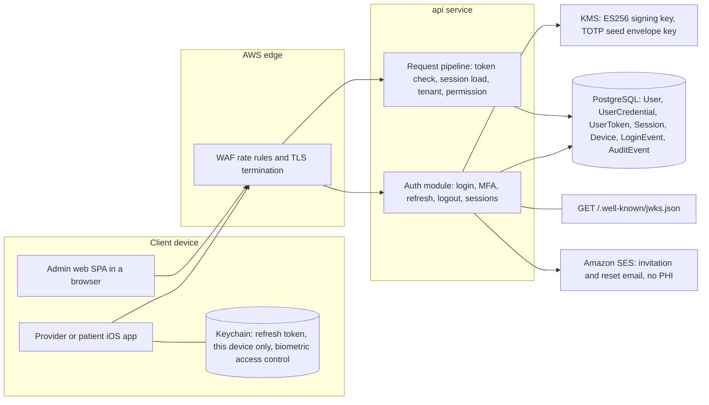
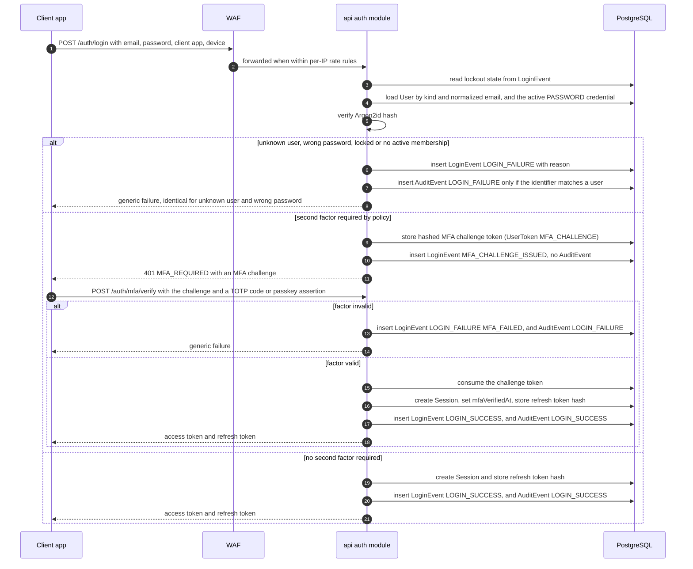
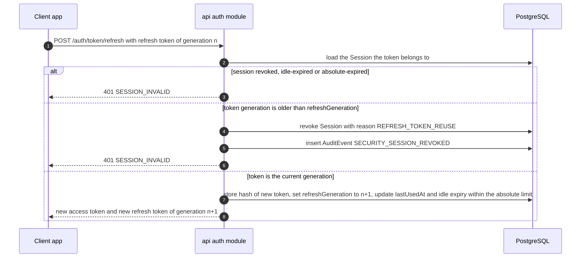
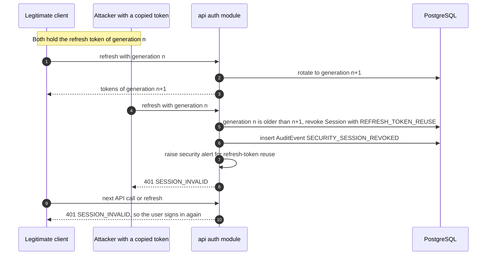
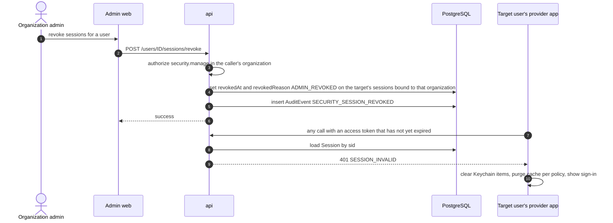
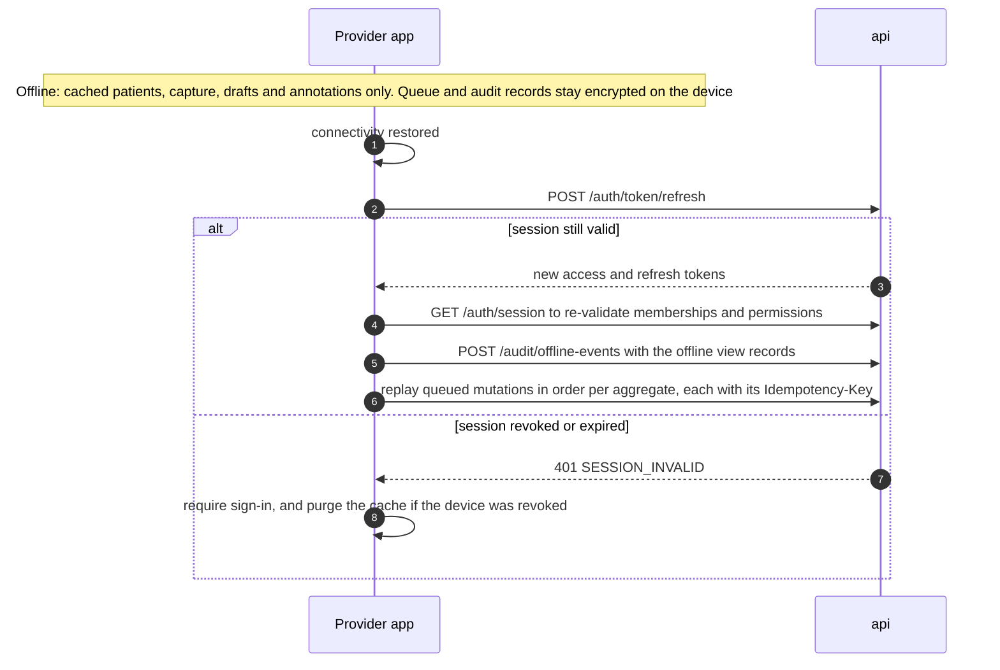

# Authentication Architecture

| | |
|---|---|
| Version | 1.0 |
| Status | Layer 0 baseline, 2026-09-28; updated for the Layer 1 kickoff decisions (ADR-0018), 2026-09-29 |
| Authority | Production Bible §21.1 (authentication), §22.1 (audit), §23 (offline), §24.5 (deep links), §36 (readiness). ADR-0002 (first-party identity, D-02), ADR-0003 (admin SPA), ADR-0005 (iOS 26), ADR-0008 (delegated baselines UD-18, UD-27), ADR-0018 (Layer 1 kickoff decisions K-03, K-09 to K-15, K-22) |
| Normative sources | [`TECHNICAL_SPECIFICATION.md`](TECHNICAL_SPECIFICATION.md) spec §4.2 (authentication), spec §3.3 (request pipeline), spec §6.1.3 (tenant context), spec §6.1.10 (no secrets in URLs), spec §6.3 (auth endpoints), spec §6.5 (patient invitation), spec §6.7 (service auth), spec §7.3 (audit), spec §7.5 (tests), spec §8 (offline). `schema.prisma` models `User`, `UserCredential`, `UserToken`, `Session`, `Device`, `LoginEvent`; `constraints.sql` Layer 1 fragment |

How Aestara proves who is calling: people on three client surfaces, and backend services. It covers identities, credentials, sessions and tokens, client handling, the sign-in, MFA, refresh and revocation flows, lockout, recovery, offline re-authentication, audit and tests. What an authenticated caller may do is in [`AUTHORIZATION_RBAC.md`](AUTHORIZATION_RBAC.md).

---

## 1. Design summary

Owner decision D-02 (ADR-0002): identity lives in the API as a **first-party, OIDC-compatible** module.

| Property | Design | Source |
|---|---|---|
| Protocol | OAuth 2.1 / OIDC-compatible token semantics; public keys at `GET /.well-known/jwks.json`. First-party clients sign in directly over TLS (`POST /auth/login`); there is no redirect-based code flow, so **no PKCE** | spec §4.2, spec §6.3; ADR-0018 K-11 |
| Passwords | Argon2id; NIST SP 800-63B policy: at least 12 characters, checked against a common and breached-password list, no composition rules | spec §4.2; ADR-0018 K-15 |
| Second factors | TOTP and WebAuthn passkeys. **Always required for the admin web and any admin role** | spec §4.2; ADR-0018 K-03 |
| One-time tokens | Invitation, password-reset and sign-in challenge tokens: random, stored only as a hash (`UserToken`), expiring, single use, sent only in request bodies | spec §4.2, spec §6.1.10; ADR-0018 K-09, K-15 |
| Access token | Signed JWT, ES256, key in KMS, **10-minute** lifetime, no permissions inside | spec §4.2 |
| Refresh token | Opaque, stored only as a hash, **rotated on every use**, reuse revokes the whole session | spec §4.2 |
| Session | Server-side `Session` row, loaded on **every** request, so revocation is immediate | spec §3.3, spec §7.5 |
| Libraries | `jose` 6.2, `@node-rs/argon2` 2.2, `otplib` 13.5, `@simplewebauthn/server` 14.0. No custom cryptography | spec §2.1, ADR-0002 |
| Assurance | Threat model in Layer 0 ([`THREAT_MODEL.md`](THREAT_MODEL.md)); external penetration test before production | ADR-0002 |

---

## 2. Identities

| Identity | Record | Tenant link | Client (`ClientApp`) | First layer |
|---|---|---|---|---|
| Staff | `User` of kind WORKFORCE | `Membership` per organization, plus scoped `UserRole` rows | `IOS_PROVIDER`, `ADMIN_WEB` | L1 |
| Platform operator | `User` of kind WORKFORCE with a PLATFORM-scope SUPER_ADMIN assignment | None needed: the assignment carries no organization | `ADMIN_WEB` | L1 |
| Patient | `User` of kind PATIENT | ACTIVE `PatientUserLink` per organization | `IOS_PATIENT` | L5 |
| Service | No `User` row | None: services act on identifiers passed in jobs | Not applicable | L2 onward |

Rules that bind implementers:

- `User` is **platform-level**, not tenant-owned: one person may hold memberships in several organizations (spec §4.1).
- `(kind, email)` is unique, and email is stored trimmed and lower-cased. The same address can therefore exist once as staff and once as patient; they are separate identities with separate credentials and sessions.
- `User.status` is INVITED, ACTIVE, LOCKED or DISABLED. `user.disable` acts on the **membership** in one organization, not on the platform user (schema comment on `Membership`). Users are disabled, never deleted (spec §5.1).
- Staff reach tenant data only through Membership plus UserRole, and patients only through PatientUserLink; never through `User` alone (schema comment on `User`).

---

## 3. Credentials

`UserCredential` holds all first-party credentials; secrets are never stored in plaintext. A database CHECK enforces the shape of each type, and a partial unique index allows only one active password per user (`constraints.sql`, Layer 1).

| Type | Stored as | Role | Rules |
|---|---|---|---|
| PASSWORD | Argon2id PHC string (`passwordHash`) | First factor | One active password per user. Policy per NIST SP 800-63B: at least 12 characters, checked against a common and breached-password list, no composition rules (spec §4.2; ADR-0018 K-15). The Argon2id cost parameters are not specified: set in M1.3 and recorded in [`SECURITY_REQUIREMENTS.md`](SECURITY_REQUIREMENTS.md) |
| TOTP | Seed envelope-encrypted with a KMS key (`totpSecretCiphertext`) | Second factor | spec §4.2, spec §7.1 |
| WEBAUTHN | Credential ID, public key, signature counter | Second factor (passkey) | Relying-party ID and associated-domain setup for the apps are decided at M1.3 |

- **Enrollment and removal:** `POST /auth/mfa/enrollments` and `DELETE /auth/mfa/enrollments/{id}` need an authenticated session **plus step-up**, and enrollment needs an `Idempotency-Key`. Both are audited as `SECURITY_CREDENTIAL_CHANGED` (spec §6.3, spec §7.3).
- **Password change:** `POST /auth/password/change` needs the current password and a recent MFA, and is audited as `SECURITY_CREDENTIAL_CHANGED` (spec §4.2, spec §6.3; ADR-0018 K-15).
- **Revocation:** credentials are revoked by setting `revokedAt`; they are not deleted.
- **MFA policy:** MFA is **always required for the admin web and for any admin role**. An organization's policy (`OrganizationSetting` key `security.mfaPolicy`) may require it for more users, never fewer. At sign-in, before an organization is chosen, the strictest policy among the user's active memberships applies (spec §4.2; ADR-0018 K-03; Bible [B §21.1] "Administrative MFA support/requirement according to deployment policy"). Patient-app MFA is not specified; biometrics are optional there.
- The spec calls passkeys a second factor. Passwordless sign-in with a passkey as the only factor is not specified.

### 3.1 One-time tokens (`UserToken`)

Emailed links and sign-in steps use single-use secrets held in `UserToken` (spec §5.2; ADR-0018 K-09, K-15).

| Purpose | Used for | Context it carries |
|---|---|---|
| `INVITATION` | Staff invitation, accepted with `POST /auth/invitations/accept` | The organization whose membership it activates |
| `PASSWORD_RESET` | `POST /auth/password/reset`; valid **30 minutes** (spec §4.2) | None |
| `MFA_CHALLENGE` | The pending second factor after an accepted password, completed with `POST /auth/mfa/verify` | The client app the session will be issued to |
| `WEBAUTHN_REGISTRATION` | A pending passkey registration for a signed-in user | The WebAuthn challenge |

- Only a SHA-256 hash of the random token is stored. The token itself travels only in request bodies, never in a path, query string, log or audit record (spec §6.1.10).
- Every token expires and is consumed once. Failed attempts are counted, and the token is consumed at the limit.
- A database CHECK fixes the context each purpose carries. Triggers let only the attempt counter and the consumption stamp change, and a consumed token can never change again (`constraints.sql`, Layer 1).
- Transactional email (invitations, password reset; no PHI) goes out from the api through Amazon SES under the BAA; Mailpit catches it in local `docker compose`. The notifications service still arrives in Layer 5 (ADR-0018 K-14).

---

## 4. Sessions and tokens

### 4.1 The session record

A `Session` row exists for every signed-in client. It is the unit of revocation.

| Column | Meaning |
|---|---|
| `userId`, `clientApp`, `deviceId` | Who, on which app, on which registered install |
| `organizationId` | The active tenant bound into issued access tokens; NULL when no organization is selected (platform operators) |
| `refreshTokenHash`, `refreshGeneration` | Hash of the one current refresh token and its rotation counter |
| `mfaVerifiedAt` | When a second factor was last verified in this session; drives step-up |
| `idleExpiresAt`, `absoluteExpiresAt` | Idle and absolute expiry; a CHECK keeps idle ≤ absolute |
| `revokedAt`, `revokedReason`, `revokedById` | Revocation; a CHECK requires a reason whenever `revokedAt` is set |
| `ipAddress`, `userAgent`, `lastUsedAt` | Security metadata |

`Device` records the app install (only a hash of the installation identifier is stored), its APNs token (from Layer 5) and its own `revokedAt`. Revoking a device cascades to its sessions (spec §4.2).

### 4.2 Access token

| Claim | Content |
|---|---|
| `sub` | User ID |
| `sid` | Session ID; the pipeline loads this session on every request |
| `org` | Active organization; the only source of tenant context (spec §6.1.3) |
| `app` | Client application |
| `amr` | Authentication methods used |

- ES256, key in KMS, lifetime **10 minutes** (spec §4.2).
- The pipeline verifies signature, expiry and audience, then loads the session; a revoked, expired or idle session means **401** (spec §3.3 step 3). Issuer and audience values are fixed at M1.3.
- **Permissions are not embedded.** They are evaluated per request, so a revoked role takes effect on the next call.

### 4.3 Refresh token

- Opaque; only its hash is stored (`Session.refreshTokenHash`).
- **Rotated on every use.** Each refresh issues a new refresh token and increments `refreshGeneration`.
- **Reuse detection.** Presenting a token from an older generation is treated as theft: the whole session is revoked with reason `REFRESH_TOKEN_REUSE`, `SECURITY_SESSION_REVOKED` is audited, and a security alert fires (spec §4.2, spec §7.6).
- The server must be able to tell "an older generation of this session's token" from "an unknown token". The schema comment on `Session` defines reuse by generation; how the opaque token identifies its session and generation is an M1.3 implementation choice.
- Because the rule is strict, **clients must never have two refreshes in flight** for one session; a legitimate race would look like reuse. Whether the server tolerates a grace window is not specified (§14).

### 4.4 Lifetimes and re-authentication (UD-18 defaults, spec §4.2)

All values are defaults, configurable per organization. ADR-0018 K-03 confirmed them for Layer 1.

| Client | Access token | Session idle | Session absolute | Local re-authentication |
|---|---|---|---|---|
| Provider app | 10 min | 8 h | 7 d | Face ID / Touch ID after 5 min in the background |
| Admin web | 10 min | 30 min | 12 h | Not applicable (MFA at sign-in) |
| Patient app | 10 min | 30 d | 90 d | Biometrics optional |

### 4.5 Step-up

Designated sensitive actions need a recent `mfaVerifiedAt`; otherwise the API returns `403 REAUTHENTICATION_REQUIRED` (spec §4.2, spec §6.2). On iOS, LocalAuthentication additionally gates signing and export on the device. Named so far: MFA enrollment and removal, password change (spec §6.3), and leaving staff-assisted patient signing mode, which requires staff re-authentication (UD-31; `DESIGN_SYSTEM.md` rule C13). The full list and the recency window are not specified; each layer's feature prompt names its step-up actions, and M1.3 fixes the Layer 1 recency window.

### 4.6 Organization switch

`PUT /auth/session/organization` re-checks the membership in the target organization and issues new tokens bound to it. It is audited as `ORGANIZATION_SWITCHED`, and every later event carries the new tenant (spec §4.2, spec §7.3; ADR-0018 K-04). Tokens for the old organization stop being useful for the new one because tenant context comes only from the token. How the first organization is chosen at sign-in for a user with several memberships is decided at M1.3.

Because sign-in already applies the strictest MFA policy among the user's active memberships (§3), a switch never meets a stricter policy than the one satisfied at sign-in. What happens when a membership is added or a policy is tightened during a session is not specified (§14).

### 4.7 Revocation

Revocation takes effect on the very next request, because every request loads the session (spec §3.3 step 3). Both the access token and the refresh token of a revoked session are rejected immediately (spec §7.5).

| Trigger | Endpoint or event | `revokedReason` | Audit |
|---|---|---|---|
| Sign out | `POST /auth/logout` | `LOGOUT` | `LOGOUT` |
| User revokes one of their own sessions or devices | `DELETE /auth/sessions/{id}` | `LOGOUT` or `DEVICE_REVOKED` (confirmed at M1.3) | `SECURITY_SESSION_REVOKED` |
| Organization administrator revokes a user's sessions or devices | `POST /users/{id}/sessions/revoke` (`security.manage`): only the sessions bound to the administrator's organization | `ADMIN_REVOKED`, `DEVICE_REVOKED` | `SECURITY_SESSION_REVOKED` |
| Platform security revokes a user's sessions | `POST /users/{id}/sessions/revoke` with `security.manage` at platform scope: all of the user's sessions | `ADMIN_REVOKED` | `SECURITY_SESSION_REVOKED` |
| Membership disabled | `POST /users/{id}/disable`: ends only that organization's sessions | `MEMBERSHIP_DISABLED` | `USER_DISABLED`, `SECURITY_SESSION_REVOKED` |
| Refresh-token reuse | `POST /auth/token/refresh` | `REFRESH_TOKEN_REUSE` | `SECURITY_SESSION_REVOKED` |
| Password reset completed | `POST /auth/password/reset`: all of the user's sessions | `CREDENTIAL_CHANGED` | `SECURITY_CREDENTIAL_CHANGED`, `SECURITY_SESSION_REVOKED` |
| Administrator MFA reset | `POST /users/{id}/mfa-reset` (`security.manage`): removes the second factors and ends all of the user's sessions | `CREDENTIAL_CHANGED` or `ADMIN_REVOKED` (confirmed at M1.6) | `SECURITY_CREDENTIAL_CHANGED`, `SECURITY_SESSION_REVOKED` |

The scope rules are spec §4.2 (ADR-0018 K-12). An organization administrator never ends a user's sessions in another organization; a password reset, an administrator MFA reset and platform security end all of them. A password change through `POST /auth/password/change` is audited, but the spec does not say whether it ends the user's other sessions (§14). The schema reason `USER_DISABLED` fits a disable of the platform-level user; no spec §6.3 endpoint does that yet.

---

## 5. Client handling per surface

| Concern | Provider iOS/iPadOS | Patient iOS | Admin web SPA |
|---|---|---|---|
| Refresh token | Keychain, `kSecAttrAccessibleWhenPasscodeSetThisDeviceOnly` with access control `.biometryCurrentSet`; **no fallback to the device passcode** (spec §4.2; ADR-0018 K-22) | Keychain (spec §4.2) [B §21.1]; biometrics are optional in this app, so its access-control flags are set in Layer 5 | **Only** in an `HttpOnly`, `Secure`, `SameSite=Strict` cookie whose path is `/api/v1/auth/token/refresh` (spec §4.2; ADR-0018 K-11) |
| Access token | In memory (spec §4.2) | In memory (spec §4.2) | In memory; never in web storage (spec §4.2) |
| Unlock | LocalAuthentication gates app unlock after 5 min in the background, and step-up actions (signing, export) | Biometrics optional | Not applicable |
| Browser controls | Not applicable | Not applicable | Every cookie-authenticated request must carry an allow-listed `Origin` (CSRF defense, spec §4.2); strict CORS (admin origin only), `Cache-Control: no-store` on PHI responses, HSTS (spec §6.1.10) |
| MFA | Always for an admin role; otherwise per organization policy, which may only add users (spec §4.2) | Not specified | Always required (spec §4.2; ADR-0018 K-03) |
| Deep links | Always re-run authorization; never trust cached UI state [B §24.5] | Same | Same (route guards are hints only) |
| On revocation or sign-out | Clear Keychain items; purge cached patients and media per cache policy (UD-25) | Clear Keychain items | Drop in-memory tokens; the server rejects the cookie's refresh token once the session is revoked (spec §7.5) |

Notes:

- There is no PKCE. PKCE protects redirect-based authorization-code flows, and Aestara's clients sign in directly with `POST /auth/login` over TLS (spec §4.2; ADR-0018 K-11).
- `kSecAttrAccessibleWhenPasscodeSetThisDeviceOnly` keeps the refresh token on this device only, out of iCloud Keychain backup and sync. `.biometryCurrentSet` makes the item unreadable when the enrolled biometrics change. If biometrics are unavailable or have changed, the user signs in again with password and MFA; there is no fallback to the device passcode (spec §4.2; ADR-0018 K-22). The Layer 1 app treats this as an ordinary sign-in, not an error.
- The admin web never holds the refresh token in script: the cookie is sent only to the refresh path. A page reload loses the in-memory access token, and the SPA gets a new one from `POST /auth/token/refresh` with the cookie. `SameSite=Strict`, the `Origin` allow-list and strict CORS together guard against CSRF (spec §4.2; ADR-0018 K-11). The admin SPA's Content Security Policy is not specified (§14).
- The design prototype (`apps/design-prototype`) has no authentication by design (ADR-0009) and is never a reference for these flows.

---

## 6. Flows

All paths below are relative to `/api/v1`. Error codes are from spec §6.2.

### 6.1 Sign-in with password and second factor

- Which identity kind is authenticated follows from the client (`app`): the provider app and admin web sign in WORKFORCE users, the patient app PATIENT users. This is the reading of the `(kind, email)` key; confirm at M1.3.
- This is a direct first-party login over TLS. There is no redirect-based authorization-code flow, so there is no PKCE (spec §4.2; ADR-0018 K-11).
- **When a second factor is required:** always for the admin web and for a user holding any admin role; otherwise when the strictest `security.mfaPolicy` among the user's active memberships requires it (spec §4.2; ADR-0018 K-03).
- **The MFA step is not a failure.** `401 MFA_REQUIRED` means "password accepted, second factor pending". It is written as `LoginEvent` `MFA_CHALLENGE_ISSUED`, with no `AuditEvent`, and it does not count toward lockout. `LoginFailureReason` has no MFA_REQUIRED value (spec §4.2; ADR-0018 K-15). The challenge is a `UserToken` bound to the client app (§3.1).
- **Unknown identifier:** the attempt is recorded in `LoginEvent` only (keyed hash of the identifier, IP, reason), because an `AuditEvent` with actor type USER needs a user. An `AuditEvent` `LOGIN_FAILURE` is written when the identifier matches a user. The client response is identical either way (spec §4.2; ADR-0018 K-13).
- Staff first set their credentials by accepting an invitation (§6.6). Patients do the same with `POST /auth/patient-invitations/accept`, the token in the request body (Layer 5), which links the account and audits `PATIENT_ACCOUNT_LINKED` (spec §6.5, spec §6.1.10; ADR-0018 K-09).

### 6.2 Refresh and rotation

### 6.3 Reuse detection

The legitimate user loses the session too. That is the intended trade-off: whoever holds a stolen token can never keep a session alive quietly.

### 6.4 Administrative revocation

### 6.5 Reconnect after offline work

See §9 for the rules.

### 6.6 Staff invitation and the first administrator

| Step | Endpoint | Audit |
|---|---|---|
| An administrator invites a user and creates the membership; the api emails a single-use invitation token (`UserToken` INVITATION, naming the organization) through SES | `POST /users` (`user.create`, never for oneself) | `USER_CREATED` |
| The user accepts with the token in the request body: sets the password, enrolls a second factor where policy requires it, and the membership becomes active | `POST /auth/invitations/accept` (public, invitation token) | `SECURITY_CREDENTIAL_CHANGED` |
| The platform invites an organization's first ORGANIZATION_ADMIN, only while the organization has no active one | `POST /organizations` or `POST /organizations/{id}/admin-bootstrap` (`organization.manage` at platform scope) | `CONFIGURATION_CHANGED` (create); `USER_CREATED`, `ROLE_ASSIGNED` (bootstrap) |

Sources: spec §4.5 rule 2, spec §6.3; ADR-0018 K-05, K-09, K-14. The invitation token's lifetime is not specified (§14).

---

## 7. Lockout and rate limiting (UD-27)

| Control | Design | Source |
|---|---|---|
| Edge | AWS WAF per-IP rate rules on public and authentication endpoints | spec §6.1.10, spec §7.1 |
| Account | Progressive lockout computed from `LoginEvent`: 5 consecutive failures lock the account for 15 minutes; each further lock within 24 hours doubles the period, up to 24 hours. The count restarts after a successful sign-in or a password reset. `MFA_CHALLENGE_ISSUED` is not a failure and does not count | spec §4.2, spec §6.1.10; ADR-0018 K-15 |
| Sensitive endpoints | Per-user limits on exports, AI generation and search; `429 RATE_LIMITED` with `Retry-After` | spec §6.1.10 |
| Counter store | Database-backed in Layer 1; a shared Valkey (ElastiCache) store once more than one API task runs | spec §10.2 (UD-27) |
| Correlation | `LoginEvent` stores the submitted identifier only as a keyed hash (`identifierHash`), plus IP and user agent, so brute-force patterns can be found without keeping typed input | `schema.prisma` |
| Alerts | Login-failure spikes, `ACCESS_DENIED` bursts, refresh-token reuse | spec §7.6 |

Server-side failure reasons (`LoginFailureReason`): INVALID_CREDENTIALS, ACCOUNT_LOCKED, ACCOUNT_DISABLED, NO_ACTIVE_MEMBERSHIP, MFA_FAILED, RATE_LIMITED. They go to the ledger, never to the client in a form that reveals whether an account exists (spec §4.2). A pending second factor is not a failure: it is the `LoginEvent` type `MFA_CHALLENGE_ISSUED` (ADR-0018 K-15).

The UD-27 baseline (WAF plus database-backed lockout in Layer 1; a shared counter store only when more than one api task runs) was re-confirmed unchanged in ADR-0018. **Still not specified, decided in M1.3:** whether lockout also sets `User.status = LOCKED` or stays purely time-based; any unlock path besides the lock expiring; and how a locked account is signaled without enabling enumeration.

---

## 8. Account recovery

| Case | Specified | Not specified (decision point) |
|---|---|---|
| Forgotten password | `POST /auth/password/forgot` and `POST /auth/password/reset`, public, with an **identical response for unknown accounts**. The reset token is sent by email, stored only as a hash (`UserToken` PASSWORD_RESET), valid **30 minutes**, single use, and travels in the request body. Completing a reset revokes all the user's sessions and is audited as `SECURITY_CREDENTIAL_CHANGED` and `SECURITY_SESSION_REVOKED` (spec §4.2, spec §6.3; ADR-0018 K-15). Layer 1 (M1.3) | Whether a reset also requires the second factor. **M1.3** |
| Password change while signed in | `POST /auth/password/change` needs the current password and a recent MFA; audited as `SECURITY_CREDENTIAL_CHANGED` (spec §4.2, spec §6.3; ADR-0018 K-15). Layer 1 (M1.3) | Whether it also ends the user's other sessions. **M1.3** |
| Lost second factor (TOTP device or passkey) | An administrator-initiated MFA reset: `POST /users/{id}/mfa-reset` (`security.manage`) removes the factors and revokes all sessions, and the user enrolls again at the next sign-in. An organization administrator may reset only a user whose sole active membership is in that organization; otherwise platform security does it, because credentials are platform-level. Audited as `SECURITY_CREDENTIAL_CHANGED` and `SECURITY_SESSION_REVOKED` (spec §4.2, spec §6.3; ADR-0018 K-15). Layer 1 (M1.6) | How the administrator verifies the requester's identity before the reset. **M1.6** |
| Patient account recovery | Nothing | **Layer 5 kickoff**, with UD-08 |
| Email verification | `User.emailVerifiedAt` exists | When verification is required. **M1.3** |

Two constraints bind every recovery path: recovery must not let platform or support staff reach patient data [B §17.2], and every recovery action that changes a credential ends in an audit trail (`SECURITY_CREDENTIAL_CHANGED`, spec §7.3).

Invitation and password-reset email goes out from the api through Amazon SES in Layer 1, with Mailpit in local `docker compose`; the notifications service still arrives in Layer 5 (ADR-0018 K-14).

---

## 9. Offline re-authentication (spec §8)

| Rule | Source |
|---|---|
| Offline, the provider app may show explicitly cached recent patients, capture photos, draft notes, annotate cached photos and queue work | [B §23.1] |
| Anything needing real-time authorization is unavailable offline: release, export, sign-off, permission changes, consent completion, AI generation, EMR sync | [B §23.2], spec §8 |
| The app unlock (Face ID / Touch ID after 5 min in the background) is a local LocalAuthentication check and works offline | spec §4.2 |
| Queued operations carry their `Idempotency-Key` (retained 7 days), so replay after reconnect never duplicates | spec §6.1.8, spec §8 |
| On reconnect, cached authorization is re-validated with `GET /auth/session` **before** replay; offline view audit records replay first through `POST /audit/offline-events` | spec §8 |
| Deep links always re-authorize | [B §24.5] |
| Sign-out or device revocation purges the cache; unsent records of a device revoked while offline are reported through the security runbook | spec §8 (UD-25) |

**Not specified, decided at Layer 2 kickoff (UD-25, M2.9):** the longest time the app may be used offline (the cache baseline is 7 days, the provider session's absolute limit is also 7 days); whether offline unlock is still allowed after the session's absolute expiry has passed; whether a queue may be replayed after the same user signs in again following an expired (not revoked) session.

---

## 10. Service-to-service authentication (spec §6.7)

| Interface | Direction | Authentication | Decided at |
|---|---|---|---|
| AI job submission | api → ai-gateway, `/internal/v1/ai-jobs` | IAM-signed requests **or** mTLS inside the VPC [P]; the choice is open | L7 (M7.1) |
| AI job results | ai-gateway → api via SQS | Queue IAM policy | L7 |
| Image jobs | api ↔ image-processing via SQS | Queue IAM policy | L2 |
| Notifications | api → notifications via SQS | Queue IAM policy | L5 |
| Integration | api ↔ integration-service | "Internal"; mechanism not specified | L10 |
| Vendor webhooks | vendor → `/webhooks/v1/{vendor}` | HMAC or vendor signature, replay-protected, then enqueued | L10 |

- `/internal/v1` is never internet-routable (spec §6.1.1). Each service has its own IAM role, and queue policies are set per producer and consumer (spec §7.1).
- Internal payloads, as specified, carry organization, job and object identifiers and job parameters only; never names, dates of birth, MRNs or other demographics (spec §3.1, spec §6.7).
- Imaging and AI services cannot query the database. The api persists their results and audits system transitions with actor type SERVICE (`AuditEvent.actorServiceId`).
- Workers share the api codebase and access PostgreSQL directly (spec §3.1). Like request handlers, they set the tenant for each job and run tenant-owned work inside a transaction that sets the tenant context, so RLS applies (spec §3.5; ADR-0004; ADR-0018 K-16; see [`AUTHORIZATION_RBAC.md`](AUTHORIZATION_RBAC.md)).

---

## 11. Audit events for authentication

The normative catalog is spec §7.3. Every login attempt writes a `LoginEvent` (security ledger). An `AuditEvent` is also written when the identifier matches a user; an unknown identifier is recorded in `LoginEvent` only, and the MFA challenge step (`MFA_CHALLENGE_ISSUED`) writes no `AuditEvent` (spec §4.2; ADR-0018 K-13, K-15). Both tables are append-only by trigger (spec §5.5).

| Event | Written when |
|---|---|
| `LOGIN_SUCCESS` | Sign-in completes (after the second factor when required) |
| `LOGIN_FAILURE` | A failed attempt for an identifier that matches a user, including a failed second factor |
| `LOGOUT` | `POST /auth/logout` |
| `SECURITY_SESSION_REVOKED` | Any revocation other than logout: own-session revoke, administrator revoke, disable, refresh-token reuse, password reset, administrator MFA reset |
| `SECURITY_CREDENTIAL_CHANGED` [P] | Password changed or reset, second factor enrolled or removed, administrator MFA reset, invitation accepted. Details give the factor type and the action, never a secret (ADR-0018 K-04) |
| `ORGANIZATION_SWITCHED` [P] | `PUT /auth/session/organization` (ADR-0018 K-04) |
| `USER_DISABLED` | Membership disabled; the revoked sessions are also audited as `SECURITY_SESSION_REVOKED` |
| `ACCESS_DENIED` [P] | Authorization failures on routes that touch patient data; identical repeats from one actor collapse into one event with a count (ADR-0018 K-10; see [`AUTHORIZATION_RBAC.md`](AUTHORIZATION_RBAC.md)) |
| `PATIENT_ACCOUNT_LINKED` [P] | Patient invitation accepted (Layer 5) |

Event contents follow [B §22.2]: actor, organization, action, time, request ID, session, device, IP and user agent. **Passwords, codes, tokens, challenge values and typed identifiers are never logged or audited**; the log allow-list and the PHI canary test enforce it (spec §7.2).

---

## 12. Test obligations

Bible §36 requires "session expiration/revocation tested; secrets stored securely" before production.

| Test | Level and tool | Layer |
|---|---|---|
| Argon2id hashing; wrong password rejected; no plaintext or reversible secret stored | Unit (Vitest) | L1 |
| Password policy: fewer than 12 characters, or a common or breached password, is rejected; no composition rule is enforced | Unit, API | L1 |
| Unknown user and wrong password return identical responses, apart from `requestId`; same for password-reset requests; an unknown identifier writes a `LoginEvent` and no `AuditEvent` | API (Testcontainers PostgreSQL) | L1 |
| MFA challenge flow: always required for the admin web and admin roles; organization policy only adds users; the strictest policy among active memberships applies at sign-in; the challenge writes `MFA_CHALLENGE_ISSUED`, no `AuditEvent`, and does not count toward lockout; TOTP and passkey verification | API | L1 |
| One-time tokens: stored only as a hash; an expired, consumed or over-attempted token is rejected; a reset token expires after 30 minutes; no token is accepted in a path or query string | API, contract | L1 |
| Password reset and administrator MFA reset revoke all the user's sessions; password change needs the current password and a recent MFA; each writes `SECURITY_CREDENTIAL_CHANGED` | API | L1 |
| Refresh rotation: the previous token is rejected after use; reuse revokes the whole session and writes `SECURITY_SESSION_REVOKED` | API | L1 |
| Revoked session: access **and** refresh tokens rejected on the very next request (spec §7.5) | API | L1 |
| Idle and absolute expiry for each client default | API (controlled clock) | L1 |
| Revocation scope: disabling a membership, or an organization administrator's revocation, ends only that organization's sessions; platform security ends all of them | API | L1 |
| Organization switch re-checks membership and writes `ORGANIZATION_SWITCHED`; tokens carry only the new organization; body or path organization IDs are ignored | API plus cross-tenant suite | L1 |
| Tokens contain no permissions; a revoked role takes effect on the next call | API | L1 |
| Lockout: 5 consecutive failures lock for 15 minutes, doubling within 24 hours up to 24 hours; `429 RATE_LIMITED` with `Retry-After` | API (controlled clock) | L1 |
| `LoginEvent` and `AuditEvent` are append-only; a failure always carries a reason | DB behavior suite (B7, B8, G series) | L1 |
| Secrets and PHI canary strings never appear in logs | API log capture | L1 |
| Keychain storage this-device-only with `.biometryCurrentSet`; changed biometrics force a password and MFA sign-in; re-authentication after 5 min in the background; deep links re-authorize | Swift Testing, XCUITest | L1 |
| Admin web sign-in with MFA; no token in web storage; the refresh cookie is `HttpOnly`, `Secure`, `SameSite=Strict` and limited to the refresh path; a cookie request without an allow-listed `Origin` is rejected | Playwright, API | L1 (with M1.11) |
| Login p95 within the RLS performance gate | Benchmark (ADR-0004) | L1 |
| Service authentication on `/internal/v1` rejects unsigned callers | Integration | L7 |
| External penetration test | Third party | Before production (ADR-0002) |

---

## 13. Enterprise SSO (future option)

ADR-0002 keeps SAML/OIDC federation for large organizations as a later addition behind an identity-provider adapter; `User.externalIdpSubject` (unique) is reserved for it. Adding it needs a new ADR, which must answer at least:

- How an external subject maps to a `User`, and what happens to an existing password credential.
- Whether the external provider's MFA satisfies the organization's `security.mfaPolicy`.
- Whether roles may come from external groups, and how the separation-of-duties rules (spec §4.5) then apply.
- How external sign-out and account disablement reach Aestara sessions.

Whatever the answers, these invariants stay: server-side sessions with immediate revocation, tenant bound into the token, per-request permission evaluation, and `LOGIN_*` audit [B §21.1], [B §22.1].

---

## 14. Open items

The Layer 1 kickoff (ADR-0018) settled the MFA rule, client token handling, lockout thresholds, password policy, reset and recovery, login audit, revocation scope, email delivery, the Keychain settings and the body-borne invitation tokens; the sections above state each decision. What remains:

| Item | Confirmed at |
|---|---|
| Lockout details: whether lockout also sets `User.status = LOCKED`, any unlock path besides the lock expiring, and how a locked account is signaled without enumeration (§7) | M1.3 |
| Whether a password reset also requires the second factor, and whether a password change ends the user's other sessions (§4.7, §8) | M1.3 |
| Email verification: when it is required (§8) | M1.3 |
| Refresh concurrency grace window, if any (§4.3) | M1.3 |
| Session policy for platform operators, whose sessions have no organization | M1.3 |
| A membership added or an MFA policy tightened during a session: whether the next organization switch needs a new second factor (§4.6) | M1.3 |
| Lifetime of the staff invitation token (§6.6), and how an administrator verifies the requester's identity before an MFA reset (§8) | M1.6 |
| Content Security Policy for the admin SPA (§5; [`SECURITY_REQUIREMENTS.md`](SECURITY_REQUIREMENTS.md) open items) | M1.11 |
| Keychain access-control flags for the patient app, where biometrics are optional (§5) | L5 kickoff |
| Service-to-service mechanism for ai-gateway: IAM-signed requests or mTLS | L7 kickoff (M7.1) |
| Offline duration and replay after re-sign-in (§9) | L2 kickoff (UD-25) |
