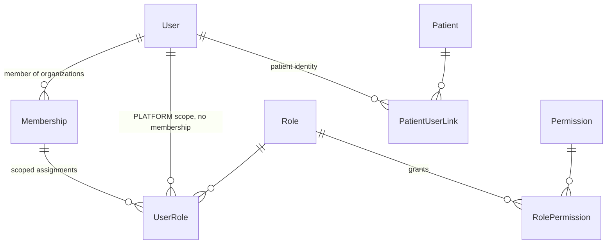
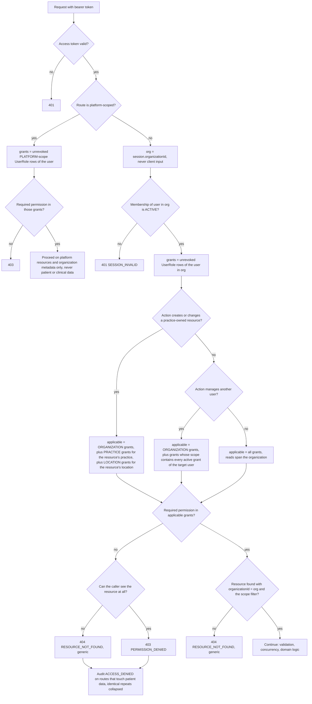
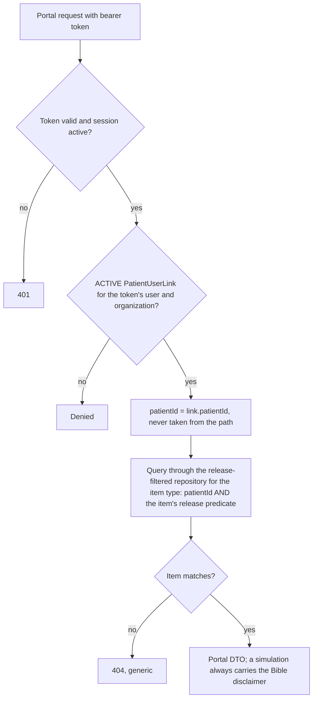
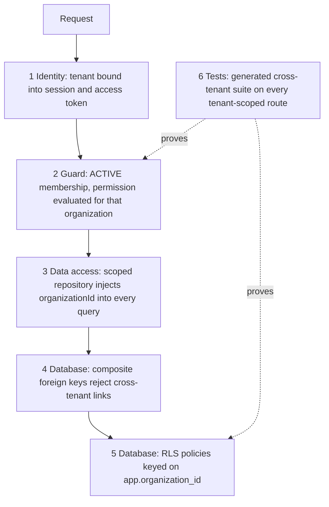

# Authorization and RBAC

| | |
|---|---|
| Version | 1.0 |
| Status | Layer 0 baseline, 2026-09-28; updated for the Layer 1 kickoff decisions (ADR-0018), 2026-09-29 |
| Authority | Production Bible §3.1 (tenancy), §3.3 (permission model), §13.2 (patient visibility), §17.2 (administrative safeguards), §20.3 (no enumeration), §21.2 (tenant isolation tested automatically), §36 (readiness). ADR-0001 (D-01), ADR-0004 (D-04, RLS), ADR-0008 (delegated baselines UD-16, UD-17, UD-30), ADR-0018 (Layer 1 kickoff decisions K-01, K-02, K-05 to K-08, K-10, K-16) |
| Normative sources | [`TECHNICAL_SPECIFICATION.md`](TECHNICAL_SPECIFICATION.md) spec §3.3 (request pipeline), spec §3.5 (isolation in depth), spec §4.1, spec §4.3–§4.7 (roles, catalog, matrix, algorithm, portal), spec §6.1.3, spec §6.1.10, spec §6.2, spec §6.5, spec §7.5. [`technical-spec/constraints.sql`](technical-spec/constraints.sql) and [`technical-spec/schema.prisma`](technical-spec/schema.prisma) |

How the server decides whether an authenticated caller may perform an action on a resource, and the independent layers that keep one organization's data away from another's. Who holds which role, in plain language, is in [`USER_ROLES_AND_PERMISSIONS.md`](USER_ROLES_AND_PERMISSIONS.md); how the caller is authenticated is in [`AUTHENTICATION_ARCHITECTURE.md`](AUTHENTICATION_ARCHITECTURE.md).

---

## 1. Principles

| # | Principle | Source |
|---|---|---|
| A1 | Roles grant permissions; API services evaluate permissions; UI hiding is convenience only and never a security boundary | [B §3.3] |
| A2 | Code checks **permissions, never role names**. Even ORIGINAL photo access is `photo.export`, not "is a surgeon" | spec §4.4 |
| A3 | Tenant context comes only from the verified session; client-supplied organization IDs are never proof of entitlement | [B §3.1], spec §6.1.3 |
| A4 | Permissions are evaluated per request, never embedded in tokens, so revocation is immediate | spec §4.2 |
| A5 | A resource the caller cannot see returns the same 404 as one that does not exist | [B §20.3], spec §6.1.10 |
| A6 | Deny by default: an unapproved portal entity is invisible; a route without a declared access rule fails its contract test | spec §4.7, spec §6.8 |
| A7 | Isolation is enforced in depth: token, guard, data layer, composite foreign keys, RLS and generated tests | spec §3.5 |
| A8 | Authorization is never mocked in tests; it runs against a real PostgreSQL | spec §2.3 |

---

## 2. The permission model



| Object | Level | Meaning |
|---|---|---|
| `Permission` | Platform | Catalog of keys: the 41 Bible keys [B §3.3] plus the adopted UD-16 keys (spec §4.4). The complete catalog and the spec §4.5 default matrix are seeded as data in M1.1, so later layers never rewrite role data (ADR-0018 K-01) |
| `Role` | Platform (system, `organizationId` NULL) or organization (custom, UD-07) | A named set of permissions. The ten system keys are unique by partial index (B1). Layer 1 uses system roles only (ADR-0018 K-02) |
| `RolePermission` | With the role | Role → permission grant |
| `Membership` | Organization | A user's membership in one organization; must be ACTIVE for any tenant access |
| `UserRole` | Organization or platform | One scoped assignment: role, scope, optional practice and location, who assigned it, when it was revoked |

### 2.1 Scope types

| Scope | Columns that must be set (DB CHECK `UserRole_scope_shape_chk`) | Needs a membership | Held by |
|---|---|---|---|
| PLATFORM | No organization, practice or location | No | SUPER_ADMIN only (spec §4.3) |
| ORGANIZATION | Organization only | Yes (composite FK to `Membership`) | Any non-platform role |
| PRACTICE | Organization and practice | Yes | Any non-platform role |
| LOCATION | Organization, practice and a location **of that practice** | Yes | Any non-platform role |

A user may have at most one active assignment of the same role at the same scope (partial unique index, B5). Assignments are revoked with `revokedAt`, never deleted, so history stays reviewable.

### 2.2 Effective permissions

The effective permission set for one request is the union of the permissions of the **applicable** grants: the caller's unrevoked `UserRole` rows in the session's organization, narrowed by scope for writes to practice-owned records (§4). `GET /auth/session` returns the caller's effective permissions as **UI hints only** (spec §6.3). Clients use them to hide or explain controls ([`DESIGN_SYSTEM.md`](DESIGN_SYSTEM.md) rule C9), never to decide access.

Where the Bible defines only write keys, reads are mapped onto existing keys (for example, reading consultations needs `consultation.create`; reading message threads needs `message.send` plus participation). The full mapping table is spec §4.4.

Layer 1 endpoints enforce the 13 Bible §32 keys plus `organization.read`, `organization.manage`, `security.manage` and `configuration.manage` (spec §6.4; ADR-0018 K-01).

---

## 3. Where checks live in the request pipeline (spec §3.3)

Every authenticated call runs the same eleven steps. The authorization-relevant ones are 3–6 and 9.

| Step | What happens | Failure |
|---|---|---|
| 1 Edge | WAF rate rules, TLS; the gateway injects nothing trusted | WAF block |
| 2 Request ID | Server-generated `X-Request-Id` (UUIDv7) on logs, traces, audit and errors | — |
| 3 Authentication | Verify the access token (signature, expiry, audience); load the `Session` | 401 `UNAUTHENTICATED` or `SESSION_INVALID` |
| 4 Tenant context | `organizationId` from the session only; membership must be ACTIVE | 401 `SESSION_INVALID` |
| 5 Permission guard | The route's declared permission (`@RequirePermission('patient.read')`) against permissions computed from `UserRole` scope | 403 or 404 (§6) |
| 6 Resource scoping | The data layer adds `organizationId` and practice scope to every query | 404 `<RESOURCE>_NOT_FOUND` |
| 7 Validation | Zod schema from `api-contracts`; unknown fields rejected | 400 `VALIDATION_FAILED` |
| 8 Concurrency, idempotency | `If-Match`, `Idempotency-Key` | 412, 428, 409 |
| 9 Domain logic | State changes go through the aggregate's transition table, which checks the permission **per transition** (spec §5.4) | 409 `INVALID_STATE_TRANSITION`, 403 |
| 10 Transaction | State change, `AuditEvent` and `OutboxEvent` rows commit together or not at all | — |
| 11 Response | DTO mapper (never the Prisma model); `Cache-Control: no-store` on PHI | — |

Steps 3–5 map onto NestJS guards, which run before any handler code (spec §2.1); step 6 is a Prisma client extension that **requires** a tenant context and injects `organizationId` into every query on tenant-owned models (spec §3.5 layer 3). Unscoped access exists only through an explicitly named platform repository used by SUPER_ADMIN tooling and migrations.

---

## 4. The evaluation algorithm (spec §4.6)

### 4.1 Flowchart



### 4.2 Pseudocode

Verbatim from spec §4.6 (normative there):

```
authorize(request, requiredPermission, resource):
  session   = verifyAccessToken(request)                 // 401 on failure
  if route is platform-scoped:                           // e.g. POST /organizations, platform audit
      grants = UserRole where user=session.userId, scope=PLATFORM, revokedAt IS NULL
      require requiredPermission ∈ permissions(grants)   // 403 otherwise
      only platform resources and organization metadata  // §4.5 rule 2; ADR-0018 K-06
      (organizations, practices, memberships, account status);
      never patient or clinical data
      return
  org       = session.organizationId                     // never from client input
  member    = Membership(org, session.userId) ACTIVE     // 401 SESSION_INVALID if not
  grants    = UserRole where user=session.userId, org=org, revokedAt IS NULL
  if action creates/changes a practice-owned resource      // consultation, appointment,
      applicable = grants where scope = ORGANIZATION       // procedure, photo session, plan
                   or (scope = PRACTICE and practiceId = resource.practiceId)
                   or (scope = LOCATION and locationId = resource.locationId)
  else if action manages another user (update, disable, roles, sessions)
      applicable = grants where scope = ORGANIZATION
                   or every active grant of the target user lies inside the grant's scope
                                                        // §4.5 rule 3; ADR-0018 K-07
  else applicable = grants            // reads span the whole organization (D-01)
  if requiredPermission ∉ permissions(applicable.roles):
      if caller cannot even see the resource -> 404 <RESOURCE>_NOT_FOUND (generic)
      else                                    -> 403 PERMISSION_DENIED
      audit ACCESS_DENIED on routes that touch patient data;   // ADR-0018 K-10
      identical repeats from one actor collapse into one event with a count
  load resource WITH organizationId = org (and scope filter)  // 404 if absent
```

### 4.3 Reading the algorithm

| Line | Meaning for implementers |
|---|---|
| `verifyAccessToken` | Includes loading the session (spec §3.3 step 3): revoked, expired or idle means 401 |
| `if route is platform-scoped` | Declared on the route, never inferred from the caller. Only PLATFORM-scope grants count. The branch reaches **platform resources and organization metadata only**: the permission catalog, system roles, the AI registry, platform audit, and organizations, practices, memberships and account status. It never reaches patient or clinical data. The platform database role has no access to patient or clinical tables, so this holds even if a handler is wrong (spec §3.5, spec §4.6; ADR-0018 K-06) |
| `org = session.organizationId` | From the token-bound session only. A platform operator's session has no organization, so tenant routes answer 401 for it |
| `member = Membership(...) ACTIVE` | A disabled membership fails every tenant request at once |
| `if action creates/changes a practice-owned resource` | Practice-owned means consultation, appointment, procedure, photo session, plan (ADR-0001). For a create, the resource's practice and location are the ones named in the request, which composite foreign keys tie to the organization |
| `else if action manages another user` | Updating, disabling, assigning or revoking roles for, or revoking sessions of another user. An ORGANIZATION grant always applies; a PRACTICE or LOCATION grant applies only when every active grant of the target user lies inside it. Organization-wide users therefore need an ORGANIZATION_ADMIN (spec §4.5 rule 3; ADR-0018 K-07) |
| `else applicable = grants` | Reads, and changes to other records that are not practice-owned, consider every grant in the organization (D-01) |
| `if caller cannot even see the resource` | "See" means the caller could read it: they hold the domain's read permission (or mapped key) and, for messages, participate in the thread. Otherwise 404, identical to "does not exist" |
| `audit ACCESS_DENIED` | Follows both the 404 and the 403 outcome, on every route that touches patient data. Identical repeats from the same actor collapse into one event with a count. The 404 body stays identical to a missing record, so auditing never reveals existence (spec §4.6, spec §7.3; ADR-0018 K-10). The `AuditEvent` outcome is DENIED. Bursts raise a security alert (spec §7.6) |
| `load resource WITH organizationId = org` | The tenant filter is part of the query itself, never a comparison after loading by ID, so "other tenant" and "does not exist" take the same path |

### 4.4 Worked examples

| Caller | Action | Result | Why |
|---|---|---|---|
| NURSE_INJECTOR_AESTHETICIAN, PRACTICE scope A1 | Open a patient whose primary practice is A2 | 200 | Reads span the organization |
| Same | Create a consultation at practice A2 | 403 `PERMISSION_DENIED` | The patient is visible; the grant does not cover A2 |
| FRONT_DESK | `GET` a consultation | 404 `CONSULTATION_NOT_FOUND` | No consultation read (mapped to `consultation.create`), so the caller cannot see it |
| CONSULTANT | Approve a simulation | 403 `PERMISSION_DENIED` | `simulation.review` lets it see the simulation; approval needs `simulation.approve` |
| Staff member not in the thread | Read a message thread | 404 | Thread access needs participation as well as `message.send` |
| Any user of organization B | `GET` a patient of organization A | 404 `PATIENT_NOT_FOUND` | Byte-for-byte the same body as a random ID, apart from `requestId` |
| SUPER_ADMIN with only a platform grant | Call a tenant route | 401 `SESSION_INVALID` | No organization and no membership in the session |
| PRACTICE_ADMIN, PRACTICE scope A1 | Assign SURGEON_PHYSICIAN at practice A2 | Rejected | Separation-of-duties rule 3 (§7) |
| PRACTICE_ADMIN, PRACTICE scope A1 | Disable a nurse who also holds a grant at practice A2 | 403 `PERMISSION_DENIED` | The nurse is visible (`user.read`), but not every grant lies inside A1 (rule 3) |
| SUPER_ADMIN | Bootstrap an admin for an organization that already has an active ORGANIZATION_ADMIN | Rejected | Rule 2: the bootstrap is allowed only while the organization has none |
| ORGANIZATION_ADMIN | Assign a role to itself | Rejected | Rule 1; the DB CHECK is the backstop (R4) |

---

## 5. D-01: read and write semantics across practices

Owner decision D-01 (ADR-0001): patient data **may be shared across the practices of one organization and never across organizations**. Bible §1.2's "cross-practice" sharing prohibition is read as cross-organization.

| Action class | Grants considered | Example |
|---|---|---|
| Read anything in the organization | Every unrevoked grant in the organization | A PRACTICE-scoped surgeon reads the full history of a patient seen at another practice |
| Create or change a practice-owned record | ORGANIZATION grants, plus PRACTICE grants for that practice, plus LOCATION grants for that location | A LOCATION-scoped nurse can schedule only at that location |
| Create or change an organization-level record (patient demographics, users, templates) | Every grant, plus the separation-of-duties rules | A PRACTICE-scoped front desk can update any patient's phone number |
| Anything in another organization | Nothing. Impossible by construction | Token-bound tenant, composite foreign keys, RLS, generated tests |

Consequences worth knowing:

- **The similar-case library is organization-wide** (ADR-0001). `CaseLibraryEntry.practiceId` records the originating practice for filtering only (spec §5.2).
- **LOCATION scope needs a location on the record.** `TreatmentPlan` has no `locationId`, and `locationId` is optional on consultations, appointments and procedures. Under the algorithm, a LOCATION-scoped grant never covers writes to a plan or to a record without a location. `PhotoSession.practiceId` is optional too, so a session without a practice can be changed only through an ORGANIZATION-scoped grant. M1.1 records, for every Layer 1 model, whether it is organization-owned or practice-owned, and tests it. Later models are classified in their layer, and the plan location question stays with Layer 4 (ADR-0018 K-08; §12).

---

## 6. 404, not 403

| Situation | Response | Source |
|---|---|---|
| Resource does not exist | 404 `<RESOURCE>_NOT_FOUND`, generic message | spec §6.1.10 |
| Resource is in another organization | The same 404, with no timing or message difference | spec §3.5 layer 6 |
| Resource is outside the caller's readable scope (no read permission, not a thread participant) | The same 404 | spec §4.6 |
| Resource is visible, but the action is not permitted | 403 `PERMISSION_DENIED` | spec §6.1.10 |
| Visible, action permitted, but a recent second factor is needed | 403 `REAUTHENTICATION_REQUIRED` | spec §6.2 |
| Export or release without a current purpose-specific media grant | 403 `MEDIA_PERMISSION_NOT_GRANTED` | spec §6.2 |
| No valid token; session revoked or expired; membership inactive | 401 `UNAUTHENTICATED` or `SESSION_INVALID` | spec §6.2 |

Related rules: lists return only visible items and no total counts by default (spec §6.1.6); the patient profile shows per-tab counts only for tabs the caller may read, and the timeline filters every item by its domain permission (spec §6.3); error messages never contain stack traces, SQL, storage keys or cross-tenant existence hints [B §20.4]. The iOS and web "permission denied" state never reveals whether a record exists ([`DESIGN_SYSTEM.md`](DESIGN_SYSTEM.md) §6).

---

## 7. Separation-of-duties enforcement

The four rules are stated in spec §4.5 and explained in [`USER_ROLES_AND_PERMISSIONS.md`](USER_ROLES_AND_PERMISSIONS.md).

| Rule | Enforced by | Test |
|---|---|---|
| 1 Nobody assigns a role to themselves or creates their own membership | Authorization service on `POST /users` and `POST /users/{id}/role-assignments`; DB CHECK `UserRole_no_self_assignment_chk` (`assignedById <> userId`) as a backstop for role assignment. Self-membership is service-enforced only | DB behavior R4; API separation-of-duties suite |
| 2 Platform scope only bootstraps an organization's first ORGANIZATION_ADMIN, through an audited action (`POST /organizations` or `POST /organizations/{id}/admin-bootstrap`) allowed only while the organization has no active ORGANIZATION_ADMIN; never targets its own account; never grants a role carrying `patient.*`, `photo.*`, `consultation.*`, `simulation.*` or `document.*`, or a clinical consent permission (`consent.assign`, `consent.sign.provider`, `consent.void`) | Authorization service, evaluated on the platform branch | API suite |
| 3 A PRACTICE_ADMIN grants only roles and scopes within its own practice, never ORGANIZATION_ADMIN or SUPER_ADMIN, and manages only users whose active grants all lie within its scope | Authorization service: the target role's permissions and the target scope are compared with the granter's scope; for user management, every active grant of the target user is compared (§4.2) | API suite |
| 4 Every grant and revocation is audited and appears in a periodic access-review export | `ROLE_ASSIGNED`, `ROLE_REVOKED` [P] in the same transaction (spec §3.3 step 10) | Audit assertions in the API suite |

Other database-level backstops on the same objects: the scope shape (B2), a location must belong to the named practice (B3), one active duplicate at most (B5), and a simulation reviewer must be a `ProviderProfile` of the same organization (R18).

Rule 2 covers clinical consent actions (signing, voiding, assigning), not `consent.template.manage`, which is administrative. The platform can therefore bootstrap an ORGANIZATION_ADMIN, whose default role holds `consent.template.manage` (spec §4.5; ADR-0018 K-05). The error code for a separation-of-duties rejection is not specified (§12).

---

## 8. Patient-portal authorization (spec §4.7)

The patient app talks only to `/api/v1/portal`: a separate controller namespace with separate DTOs. Portal handlers can query only through **release-filtered repositories**, so a staff DTO holding drafts, rejected versions, internal notes or validation scores cannot be returned to a patient even by mistake (spec §6.5).



Visibility rules (excerpt; normative table in spec §4.7):

| Item | Visible to the patient only when |
|---|---|
| Simulation | Status RELEASED_TO_PATIENT, through the released version only; READY_FOR_PROVIDER_REVIEW, REJECTED and FAILED never [B §34.2] |
| Photo or before/after | Current PATIENT_APP grant **and** an unrevoked `MediaRelease` with purpose PATIENT_APP [B §7.3] |
| Treatment plan | Status is SENT_TO_PATIENT, VIEWED, ACCEPTED, DECLINED, EXPIRED, SCHEDULED or COMPLETED |
| Anything else | **Not visible.** An entity is exposed only after a visibility rule for it is approved and added to spec §4.7 |

Rules that bind implementers:

- **Deny by default is structural.** No portal repository exists for an entity without an approved rule; adding one is a change-controlled edit to spec §4.7 (UD-30).
- **Patient writes are transitions.** Viewing, accepting or declining a plan and viewing or signing a consent run through the aggregate's transition table with the actor "patient (link)" (spec §5.4.3, spec §5.4.4). Other patient writes (acknowledging an instruction, content engagement events, photo-request uploads, messages) have no spec §5.4 machine but follow the same rule: only on items the patient can already see (spec §6.5).
- **Messages** need an active link **and** thread participation (spec §6.5).
- **The disclaimer is a required DTO field**, so a portal simulation cannot be serialized without it (spec §6.6.4).
- **One organization at a time.** A patient login linked to several organizations sees one per token and never a combined view (UD-08).
- **Link revocation** takes effect on the next request.

---

## 9. Defense in depth



| Layer | Mechanism | Catches | Status |
|---|---|---|---|
| 1 Identity | Tenant bound at organization selection; switching issues new tokens | Client-supplied tenant IDs | [P], adopted |
| 2 Guard | ACTIVE membership; permission evaluated for that organization only | Missing or wrong permission | [B §3.3] |
| 3 Data access | Prisma client extension requires a tenant context and injects `organizationId`; the platform repository is explicit and named | A handler that forgets a filter | [P], adopted |
| 4 Composite foreign keys | Every child references its parent by `(organizationId, …)`; CHECKs close the `MATCH SIMPLE` gaps; verified A1–A5, C5, D9, E6, F7, R1–R2, R18 | Application bugs that would link records across tenants or patients | [P], adopted |
| 5 Row-Level Security | Policies on every tenant-owned table (`FORCE ROW LEVEL SECURITY`) keyed on `SET LOCAL app.organization_id`, set from the verified token in the per-request transaction; an unset value matches no rows. The application role has no `BYPASSRLS`; migrations run as a separate owner role; platform operations use a separate role limited to platform tables | A query that escapes layer 3 | D-04; spec §3.5 (ADR-0018 K-16) |
| 6 Generated tests | Tenant B credentials against tenant A IDs return 404 on every tenant-scoped route | Regressions in layers 1–5 | [B §27.1], [B §36] |

**Application-enforced links.** Three references cannot use composite keys and rely on layers 2, 3, 5 and 6: `ConsentSignature.signerUserId` and `ThreadParticipant.userId` (the signer or participant may be the patient's platform-level user) and the polymorphic `IntegrationMapping.localId` (spec §5.1).

### 9.1 RLS and its performance gate (ADR-0004)

- **Gate.** The Layer 1 benchmark (roadmap M1.1) must show at most **10% added p95 latency and at most 5 ms absolute** on login, patient search and patient open. If it fails, ADR-0004 is revisited and the policy design is revised (simpler predicates, index changes) before Layer 1 goes further. RLS is never silently dropped.
- **Design** (spec §3.5; ADR-0018 K-16):
  - The application database role has no `BYPASSRLS`, and tenant tables use `FORCE ROW LEVEL SECURITY`.
  - Every request runs in a transaction that sets `app.organization_id` from the verified token with `SET LOCAL`. An unset value matches no rows.
  - The sign-in membership lookup, before any tenant is chosen, uses one narrow `SECURITY DEFINER` function.
  - Platform operations use a separate role limited to platform tables, with no access to patient or clinical tables (K-06).
  - Workers (outbox relay, exports, retention, sync) set the tenant for each job.
- **Where the policies live.** Not in `constraints.sql` today; they are written with the Layer 1 migrations (M1.1).
- **Still decided in M1.1:** the policy SQL itself; how tables whose `organizationId` is nullable by design handle platform or pre-tenant rows (`AuditEvent`, `LoginEvent`, `Session`, `UserRole`, `Role`, `FeatureFlag`, `AIModelRollout`, `AIValidationRecord`, `IdempotencyKey`, `OutboxEvent`, `Notification`, and `UserToken`, whose organization is set only for an invitation); and how `SET LOCAL` is issued through the Prisma driver adapter.

### 9.2 Generated cross-tenant tests

The route table is enumerated automatically; for every tenant-scoped route, tenant B's user requests tenant A's resource IDs and must get a 404 identical to a random-UUID request, with no timing difference (spec §3.5, spec §7.5). The envelope's `requestId` differs per request by design, so the comparison excludes it. The suite runs in CI against real PostgreSQL (Testcontainers), and a new route joins it without anyone writing a test.

---

## 10. How a new endpoint declares its permission

Every route states its access rule before it is merged. The API contract tests assert the declared permission of every endpoint, and the cross-tenant tests are generated from the route table (spec §6.8).

1. **Choose the rule.** One of the forms used in spec §6.3 and spec §6.5:

   | Rule | Meaning | Example |
   |---|---|---|
   | A permission key | `@RequirePermission('<key>')` on the route | `POST /patients` → `patient.create` |
   | Permission plus a relationship | Key and a resource condition | `message.send` + thread participant |
   | `authenticated` | Any valid session; the handler acts only on the caller's own records | `GET /auth/sessions` |
   | `authenticated` + step-up | Recent second factor required | `POST /auth/mfa/enrollments` |
   | `challenge`, `refresh token`, `public` | Authentication endpoints only | `/auth/*`, health |
   | Portal | Active patient link plus the item's visibility rule | `/portal/*` |

2. **If no key fits,** do not invent one. Raise a change request: ADR, `CHANGELOG.md` entry and an update to spec §4.4 and spec §4.5 **before** implementation [B §0]. The UD-16 mapping table shows how gaps were handled so far.
3. **Say whether the action creates or changes a practice-owned record,** so the write-scope branch of §4 applies.
4. **Use the scoped repository** for every read and write. The platform repository is for platform-scoped routes only.
5. **Name the not-found code** (`<RESOURCE>_NOT_FOUND`) and make "not visible" and "not found" one code path.
6. **Route state changes through the transition table,** which carries the permission per transition (spec §5.4).
7. **Declare the audit event,** and whether the route touches patient data, which makes it audit `ACCESS_DENIED` (spec §4.6).
8. **For a portal endpoint,** the visibility rule must already be in spec §4.7.
9. **In the feature prompt** [B §33], AUTHORIZED USERS lists permissions, not roles.

---

## 11. Test obligations

Bible §36 requires automated cross-tenant tests for every sensitive domain and server-side permission checks on every sensitive endpoint.

| Suite | Asserts | Source | From |
|---|---|---|---|
| Cross-tenant generator | Every tenant-scoped route returns an identical 404 for another tenant's IDs | spec §7.5 | L1 |
| Role × endpoint matrix | Each cell of the spec §4.5 matrix allows or denies as specified, generated from the matrix | spec §7.5 | L1 |
| 404 versus 403 | Invisible resources return 404; visible-but-forbidden return 403; on routes that touch patient data `ACCESS_DENIED` is audited, and identical repeats collapse into one event with a count | spec §4.6, spec §6.1.10 | L1 |
| Separation of duties | Self-assignment, a platform actor granting clinical roles or bootstrapping an organization that already has an active admin, a practice admin granting beyond its scope or managing a user with grants outside it: all rejected | spec §4.5, spec §7.5 | L1 |
| D-01 scope | Reads across practices succeed; practice-owned writes outside scope fail | ADR-0001 | L1, then each layer that adds a practice-owned record |
| Revocation takes effect | A revoked role, disabled membership or revoked session stops access on the next request | spec §4.2, spec §7.5 | L1 |
| RLS | With the application role and a tenant context set, rows of another organization are invisible even to a query without an `organizationId` filter; an unset tenant sees no rows; the application role has no `BYPASSRLS`; the platform role cannot read patient or clinical tables | ADR-0004; spec §3.5 | L1 |
| RLS benchmark | The ADR-0004 gate on login, patient search, patient open | ADR-0004 | L1 |
| Database behavior | Scope shape, self-assignment, duplicate assignment, composite foreign keys (B1–B5, R4, A1–A5, R1–R2, R18) | `constraints.sql` | L1 onward |
| Portal visibility | For every portal endpoint, drafts, rejected or failed simulations, unreleased documents, planned procedures and internal notes never appear | spec §7.5 | L5 |
| Media permission | Export or release with a revoked or expired grant fails | spec §7.5 | L2 |
| Clients do not decide | API tests call endpoints directly, never through UI gating; iOS deep links re-run authorization [B §24.5] | [B §3.3] | L1 |

---

## 12. Open items

The Layer 1 kickoff (ADR-0018) confirmed UD-16, UD-17 and UD-07 for Layer 1 (K-01, K-02), the `ACCESS_DENIED` and `ROLE_REVOKED` events (K-04, K-10), separation-of-duties rules 2 and 3 (K-05, K-07) and platform reach (K-06); §4 and §7 state them. What remains:

| Item | Confirmed at |
|---|---|
| Error code returned for a separation-of-duties rejection | M1.6 |
| LOCATION-scoped grants and records without a location; photo sessions without a practice (§5) | M1.1 for Layer 1 models (ADR-0018 K-08); L2 (photo sessions) and L4 (plans) |
| Which other records count as practice-owned (the list names consultation, appointment, procedure, photo session, plan; message threads, consent templates, protocols, appointment types, feature flags and integrations also carry an optional `practiceId`) | M1.1 for Layer 1 models, then each layer for its own (ADR-0018 K-08) |
| Remaining RLS questions (§9.1) | L1 (M1.1) |
| UD-30 portal visibility of procedures, appointments, telehealth; UD-20 PATIENT_APP grant | L5 kickoff |
| `PatientUserLink` allows several patient records per login in one organization, while spec §4.7 assumes a single `link.patientId` | L5 kickoff (UD-08; deferred there by ADR-0018 K-24) |
| Spec §4.7 shows a released simulation without checking the current PATIENT_APP grant at read time, while Bible §7.3 and the UD-20 baseline require that check for patient-app media; the Bible wins ([`ACCEPTANCE_CRITERIA.md`](ACCEPTANCE_CRITERIA.md) F-44) | L5 and L8 kickoffs (UD-20) |
| `UserRole.roleId` references `Role(id)` alone, so once custom roles exist another organization's custom role could be assigned (F-28). Layer 1 uses system roles only; `UserRole` gets a composite key when custom roles are enabled (ADR-0018 K-02) | With UD-07, before custom roles are enabled |
| Support access to tenant data | Not in scope until specified [B §17.1] |
