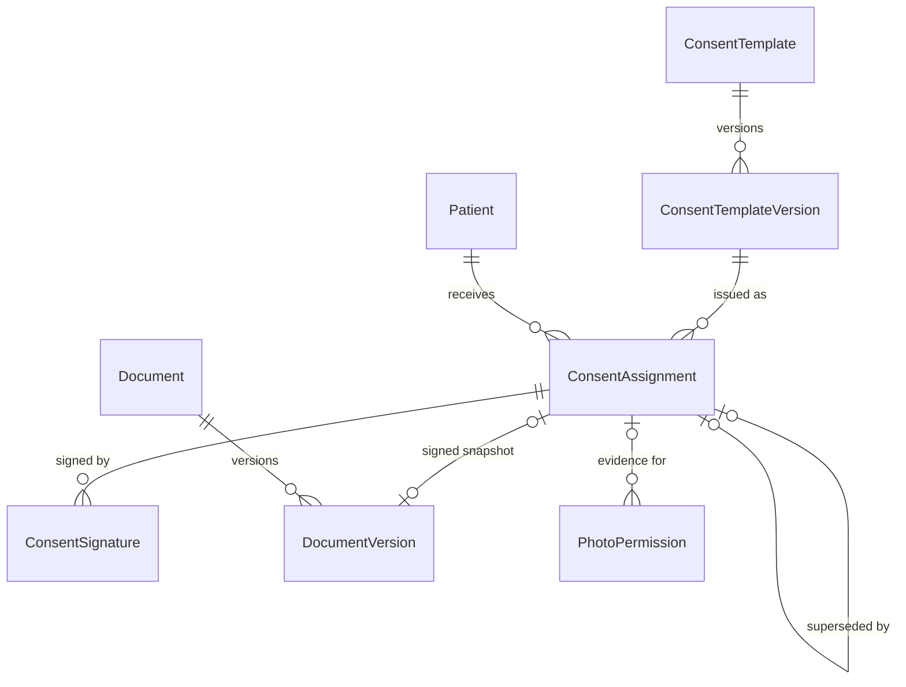
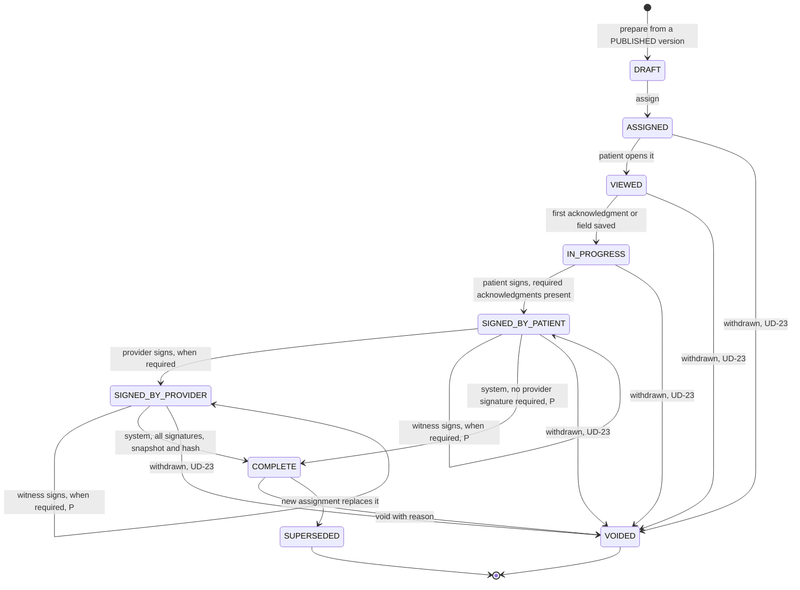
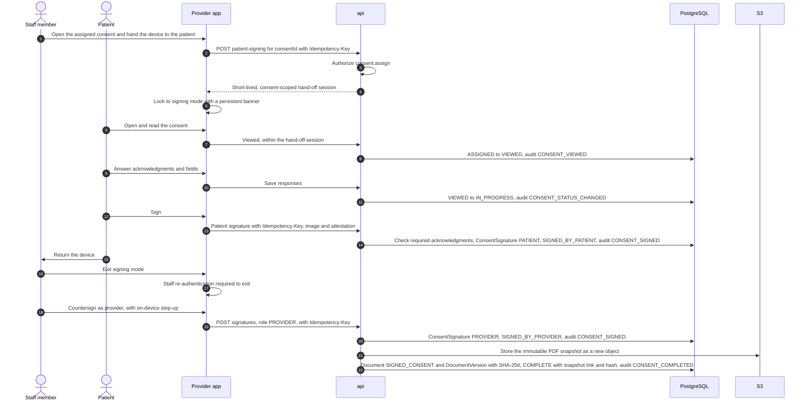

# Consent architecture

| | |
|---|---|
| Version | 1.0 |
| Status | Layer 0 baseline, 2026-09-28 |
| Authority | Production Bible §7.1 (clinical consent never implies media permission), §11.1 (plan acceptance is not consent), §12 (documents, consents, instructions, education), §13.3 (patient actions), §21.1 (re-authentication), §22.1 (audit), §23 (offline), §30, §36 ("versioned templates; immutable signed snapshot/hash; audit"). ADR-0008 (spec proposals and delegated baselines). |
| Normative sources | [`TECHNICAL_SPECIFICATION.md`](TECHNICAL_SPECIFICATION.md) §1.4 (G9), §4.4, §4.7, §5.2 (Documents, consents, instructions & education), §5.4.4, §5.4.10, §6.3 (Documents, consents…; Consent templates), §6.5, §6.6.6 (consent builder block types), §7.3, §8, §10.2 (UD-23, UD-31); [`schema.prisma`](technical-spec/schema.prisma) section 6; [`constraints.sql`](technical-spec/constraints.sql) Layer 4 fragment; [`DESIGN_SYSTEM.md`](DESIGN_SYSTEM.md) C11, C13 |

This document describes how consent templates are built and versioned, how a consent moves from assignment to a completed, immutable signed snapshot, how void and supersede work, how in-clinic signing hands the device to the patient safely, and how education and instructions are assigned. It organizes the normative spec and adds diagrams, rules and tests.

---

## 1. Scope and layers

| Capability | Layer | Source |
|---|---|---|
| Consent template builder (13 block types), versioning and publishing | 4 | Roadmap M4.5 |
| Assignment, staff-assisted in-clinic signing, immutable snapshot and SHA-256 | 4 | Roadmap M4.6; UD-31 |
| Education CMS (versioned content) and assignment tracking | 4 | M4.7 |
| Instructions by procedure or consultation | 4 | M4.8 |
| Patient review and signing in the patient app | 5 | [B §13.3]; M5.5 |

Layer 4's exit condition, "patient-facing plan/document workflow is testable" [B §29], is met in clinic through staff-assisted signing, before the patient app exists (spec §9.1).

---

## 2. Principles

1. **Versioned templates; executed documents never change.** Publishing freezes a version; editing a template creates a new version; nothing already signed is touched [B §12.2]; spec §1.4 G9.
2. **Every completed consent has an immutable signed snapshot and its SHA-256** [B §12.3, §36].
3. **The state machine is explicit** and enforced by one server-side transition table (spec §5.4, §5.4.4).
4. **A consent is not a media permission.** Clinical consent never implies website, advertising, research, education or AI-training use [B §7.1, §30]. A signed consent can be the *evidence* for an explicit, per-category permission transition ([PHOTO_ARCHITECTURE.md](PHOTO_ARCHITECTURE.md) section 9).
5. **Choosing a treatment plan is not consent.** Plan acceptance is never medical authorization; consent is always a separate `ConsentAssignment` [B §11.1]; spec §5.4.3.
6. **Signing is online only**, idempotent, and never duplicated by a retry [B §23.3]; spec §8.

---

## 3. Data model

Excerpt; the normative catalog is spec §5.2 and the definition is `schema.prisma` section 6.

| Entity | Role | Key rules (verified by) |
|---|---|---|
| `ConsentTemplate` | Template identity; organization-owned, optionally one practice | — |
| `ConsentTemplateVersion` | Ordered builder `blocks` (JSON, validated against a versioned JSON schema), `requiresProviderSignature`, `requiresWitnessSignature`, `contentHash` set at publish; `DRAFT → PUBLISHED → RETIRED` | One open draft per template; published versions frozen and forward-only (F1–F6) |
| `ConsentAssignment` | A consent issued to one patient, optionally linked to a consultation, procedure or treatment plan; `responses` keyed by block ID; lifecycle timestamps; snapshot link and hash; void and supersede fields | `COMPLETE` needs snapshot and hash (F8); executed consents frozen and never reopened (F10, R5–R6); snapshot of the same patient (F7) |
| `ConsentSignature` | One signature per signer role (`PATIENT`, `PROVIDER`, `WITNESS`): signer, `signerName`, method (`DRAWN`, `TYPED`), signature image object, exact attestation text shown, time, IP, device, idempotency key | Append-only; one per role; idempotency key unique per organization |
| `Document` / `DocumentVersion` | The signed snapshot is a `Document` of type `SIGNED_CONSENT` with an immutable `DocumentVersion` carrying its SHA-256 | Document versions immutable (F11) |

---

## 4. Templates and versioning

| Step | Endpoint (spec §6.3) | Permission | Audit |
|---|---|---|---|
| Create a template | `POST /consent-templates` | `consent.template.manage` | — |
| Start a new draft version | `POST …/{tid}/versions` | `consent.template.manage` | — |
| Edit draft blocks | `PATCH …/{tid}/versions/{vid}` with `If-Match` | `consent.template.manage` | — |
| Publish (freezes, hashes) | `POST …/{tid}/versions/{vid}/publish` | `consent.template.manage` | `CONSENT_TEMPLATE_PUBLISHED*` |
| Retire the template | `POST …/{tid}/retire` | `consent.template.manage` | — |
| Read templates | `GET /consent-templates`, `GET …/{tid}` | `consent.assign` | — |

- A published version stores `contentHash`, the SHA-256 of its canonicalized blocks, with `publishedAt` and `publishedById` (CHECK). After publishing, only `PUBLISHED → RETIRED` is possible (F3–F4).
- Only one `DRAFT` version per template can be open at a time (F6). Editing a template means starting a new version (F5).
- New assignments are prepared only from a `PUBLISHED` version (spec §5.4.4). An existing assignment keeps pointing at the frozen version it was issued from.
- In the default matrix, ORGANIZATION_ADMIN holds `consent.template.manage` organization-wide and PRACTICE_ADMIN within its practice (spec §4.5).
- Template content must be original or licensed; vendor consent or education text is never copied [B §0.1, §30].

---

## 5. The builder elements

The 13 elements of Bible §12.1 and their block types. Excerpt; normative list in spec §6.6.6. Each block is `{ "id": "<stable id>", "type": "<TYPE>", … }`, and captured values are stored in `ConsentAssignment.responses` under the block ID.

| # | Bible element | Block type | Captures a response |
|---|---|---|---|
| 1 | Heading | `HEADING` | No |
| 2 | Paragraph | `PARAGRAPH` | No |
| 3 | Bullets | `BULLETS` | No |
| 4 | Image | `IMAGE` | No |
| 5 | Video acknowledgment | `VIDEO_ACKNOWLEDGMENT` | Yes: watched and acknowledged |
| 6 | Checkbox | `CHECKBOX` | Yes, optional |
| 7 | Required checkbox | `REQUIRED_CHECKBOX` | Yes; must be checked before the patient can sign |
| 8 | Initial | `INITIAL` | Yes |
| 9 | Text field | `TEXT_FIELD` | Yes |
| 10 | Date | `DATE` | Yes |
| 11 | Patient signature | `PATIENT_SIGNATURE` | Yes → `ConsentSignature(PATIENT)` |
| 12 | Provider signature | `PROVIDER_SIGNATURE` | Yes → `ConsentSignature(PROVIDER)`; sets `requiresProviderSignature` |
| 13 | Witness signature | `WITNESS_SIGNATURE` | Yes → `ConsentSignature(WITNESS)`; sets `requiresWitnessSignature` |

The traceability check confirms all 13 (spec §11.2). Adding a block type changes a Bible list and needs an ADR first [B §0]. Which response blocks other than `REQUIRED_CHECKBOX` can be marked required (for example `INITIAL`, `DATE`, `VIDEO_ACKNOWLEDGMENT`) is not specified (open item).

---

## 6. Lifecycle

### 6.1 States

Diagram of spec §5.4.4, which is normative. "P" marks spec proposals adopted by ADR-0008; the pre-completion void rows are the UD-23 baseline.

### 6.2 Walkthrough

| Stage | Who | Rule | Audit |
|---|---|---|---|
| Prepare | Staff with `consent.assign` | `POST …/consents` (`Idempotency-Key` required) from a published version | `CONSENT_STATUS_CHANGED*` |
| Assign | Staff with `consent.assign` | `POST …/{consentId}/assign`; from now on the patient can see it (portal rule: status is not `DRAFT`, spec §4.7) | `CONSENT_ASSIGNED` |
| View | Patient (portal link or in-clinic hand-off) | First open | `CONSENT_VIEWED` |
| Respond | Patient | First acknowledgment or field saved | `CONSENT_STATUS_CHANGED*` |
| Patient signature | Patient | Refused until every required acknowledgment is present | `CONSENT_SIGNED` |
| Provider countersign | Holder of `consent.sign.provider` | Only when the version requires it | `CONSENT_SIGNED` |
| Witness | Staff with `consent.assign` records it | Only when required; any time in either signed state before completion | `CONSENT_SIGNED` |
| Complete | System | All required signatures present; snapshot and SHA-256 generated | `CONSENT_COMPLETED` |

Every transition writes its audit row in the same transaction as the state change (spec §3.3 step 10, §5.4). Invalid transitions return `409 INVALID_STATE_TRANSITION`.

---

## 7. Signing

### 7.1 Signature rules

| Rule | Design | Source |
|---|---|---|
| Endpoint | Staff: `POST …/{consentId}/signatures` (provider with `consent.sign.provider`; witness with `consent.assign`). Patient: `POST /portal/consents/{id}/signatures` (Layer 5) or the in-clinic hand-off (Layer 4) | spec §6.3, §6.5 |
| Idempotency | `Idempotency-Key` required; `ConsentSignature.idempotencyKey` unique per organization, so a retry never creates a second signature | [B §20.3, §23.3]; spec §6.1.8 |
| One per role | At most one `PATIENT`, one `PROVIDER`, one `WITNESS` signature per consent | `schema.prisma` |
| Evidence | Signature image stored as its own object (`SIGNATURE` class), method, exact attestation text displayed, signer name, time, IP address, device | `schema.prisma` |
| Append-only | Signatures are never edited or deleted | `constraints.sql` Layer 4 |
| Step-up | On the provider device, LocalAuthentication gates signing; the server can require a recent MFA verification for designated sensitive actions | [B §21.1]; spec §4.2 |
| Offline | Not available; signatures are never queued | spec §8 |
| Witness who is not a user | `signerUserId` is NULL and `signerName` identifies the witness | `schema.prisma` |

### 7.2 Signing sequence (in-clinic, with provider countersign)

In the patient app (Layer 5) the same states are reached through `GET /portal/consents`, `POST …/{id}/viewed`, `PUT …/{id}/responses` and `POST …/{id}/signatures`, with the patient's own session (spec §6.5).

---

## 8. Staff-assisted in-clinic signing

UD-31 baseline, confirmed at Layer 4 kickoff: yes, with a consent-scoped hand-off and staff re-authentication to exit.

| Rule | Design | Source |
|---|---|---|
| Opening | `POST …/{consentId}/patient-signing` by a holder of `consent.assign`, `Idempotency-Key` required | spec §4.4, §6.3 |
| Scope | The hand-off session is short-lived and limited to that one consent: review, respond, sign | spec §6.3 |
| Lock | A persistent banner shows signing mode; the patient cannot navigate elsewhere | DESIGN_SYSTEM.md C13 |
| Exit | Leaving signing mode requires staff re-authentication (DESIGN_SYSTEM.md names Face ID) | spec §6.3; DESIGN_SYSTEM.md C13 |
| Audit | `CONSENT_VIEWED` and `CONSENT_SIGNED` as for portal signing | spec §6.3 |
| Confirmation | Signing and voiding are confirmed with a sheet that says who sees what and whether it can be undone | DESIGN_SYSTEM.md C11 |

Not specified, and decided at Layer 4 (M4.6): the hand-off lifetime; how the patient's identity is confirmed and recorded when the patient has no platform account (before Layer 5 there is none, and `signerUserId` is nullable); and which actor the audit rows name for patient actions inside the hand-off.

---

## 9. The immutable signed snapshot and hash

| Aspect | Design | Verified by |
|---|---|---|
| When | Generated by the system on the transition to `COMPLETE` | spec §5.4.4 |
| What | An immutable PDF snapshot of the executed consent, stored as a new object | spec §5.4.4 |
| Where | `Document` of type `SIGNED_CONSENT` with a `DocumentVersion` (object link and SHA-256); `ConsentAssignment.signedDocumentVersionId` and `signedSnapshotHash` | `schema.prisma` |
| Required | `COMPLETE` is impossible without the completion time, the snapshot link and the hash (CHECK) | F8 |
| Same patient | The snapshot must belong to the same patient (composite FK) | F7 |
| Immutable | The document version cannot change; the executed consent is frozen apart from void and supersede bookkeeping | F10–F11 |
| Download | `POST …/{consentId}/access-urls` (`consent.assign`), a signed URL of 120 s | spec §6.1.9, §6.3 |
| Template link | The assignment keeps its template version, whose `contentHash` identifies the exact published content | `schema.prisma` |

The layout of the PDF and the relation between `signedSnapshotHash` and `DocumentVersion.sha256` are not specified beyond the fields above (open item).

---

## 10. Void and supersede

| Transition | Rule | Permission | Audit |
|---|---|---|---|
| `COMPLETE → VOIDED` | `/void` with a reason, "according to policy"; records `voidedAt`, `voidedById`, `voidReason` (CHECK) | `consent.void` | `CONSENT_VOIDED` |
| `COMPLETE → SUPERSEDED` | `/supersede` creates a replacement assignment; `supersededAt` and `supersededByAssignmentId` are recorded; one replacement supersedes at most one consent (unique) | `consent.assign` | `CONSENT_STATUS_CHANGED*` |
| `ASSIGNED` … `SIGNED_BY_PROVIDER` → `VOIDED` | Withdrawn before completion, with a reason (UD-23 baseline) | `consent.void` | `CONSENT_VOIDED` |

- `VOIDED` and `SUPERSEDED` are terminal. The database allows only `COMPLETE → VOIDED` and `COMPLETE → SUPERSEDED` from an executed consent and rejects any attempt to reopen, edit or re-complete it (R5–R6, F12).
- Voiding or superseding never alters the snapshot, the signatures or the responses.
- A voided or superseded consent stays visible to the patient in the portal (the rule is "status is not `DRAFT`", spec §4.7).
- Void is destructive-styled and never the default button (DESIGN_SYSTEM.md C4).

Not specified: the void policy itself; when the old consent becomes `SUPERSEDED` (when the replacement is created, or when it completes); whether an unused `DRAFT` can be discarded; and whether voiding a consent that was evidence for a media permission starts any permission workflow. Section 14 lists them.

---

## 11. Minors and guardians

UD-23 baseline, confirmed at Layer 4 kickoff: "GUARDIAN signer if minors are in scope".

- Whether minors are in scope is not yet decided.
- `PatientContact` already supports kind `GUARDIAN`, but `SignerRole` has only `PATIENT`, `PROVIDER` and `WITNESS`, and one signature per role is allowed. If minors are in scope, Layer 4 adds a guardian signer through an ADR and a schema change before implementation.
- Age thresholds and state-specific rules are not specified (US only, ADR-0006).
- Proxy access to the patient app is deferred (UD-08).

---

## 12. Education content and instructions

| Aspect | Education [B §12.5] | Instructions [B §12.6] |
|---|---|---|
| Model | `EducationContent` with `EducationContentVersion` (`DRAFT → PUBLISHED → RETIRED`, one draft, published frozen, R7) | `PatientInstruction` pointing at a published content version (types include `PRE_OP_INSTRUCTION`, `POST_OP_INSTRUCTION`) |
| Content types | Video, image, animation, text, PDF, procedure explanation, FAQ, pre-op instruction, post-op instruction | Same library |
| Assignment | `ContentAssignment`, optionally tied to a consultation or procedure; `POST …/content-assignments` (`content.read`); `…/{id}/presented` records presentation in the consultation | Assigned by procedure **or** consultation (CHECK, at least one); `POST …/instructions` (`content.read`); `…/{id}/release` sets `releasedToPatientAt` |
| Tracking | `ASSIGNED → OPENED → VIEWED → COMPLETED → ACKNOWLEDGED` (states from the Bible, ordering proposed, spec §5.4.10), each with a timestamp | Patient acknowledgment (`patientAcknowledgedAt`) is tracked **separately** from clinical completion (`clinicalCompletedAt`, `consultation.edit`) |
| Patient app | `GET /portal/content`, `POST …/{id}/events` | `GET /portal/instructions`, `POST …/{id}/acknowledge` (`Idempotency-Key` required) |
| Audit | `CONTENT_ASSIGNED*` | `INSTRUCTION_ASSIGNED*`, `INSTRUCTION_ACKNOWLEDGED*` |
| Administration | `/content` library and versions (`content.manage`), `CONFIGURATION_CHANGED*` on versions | Same |

Content is original or licensed only [B §0.1]. Which engagement states apply to which content type ("where appropriate", [B §12.5]) is not specified.

---

## 13. Audit events

Excerpt; the catalog is normative in spec §7.3. Metadata holds identifiers and codes only, never consent text or responses [B §22.2].

| Event | Written when |
|---|---|
| `CONSENT_STATUS_CHANGED*` | Prepared (`DRAFT`), first response (`IN_PROGRESS`), superseded |
| `CONSENT_ASSIGNED` | Issued to the patient |
| `CONSENT_VIEWED` | First opened, in the portal or in-clinic |
| `CONSENT_SIGNED` | Each patient, provider or witness signature |
| `CONSENT_COMPLETED` | Snapshot and hash written; `COMPLETE` |
| `CONSENT_VOIDED` | Voided, before or after completion |
| `CONSENT_TEMPLATE_PUBLISHED*` | A template version is published |
| `DOCUMENT_VIEWED*` | A signed snapshot is downloaded through the documents API |
| `CONTENT_ASSIGNED*`, `INSTRUCTION_ASSIGNED*`, `INSTRUCTION_ACKNOWLEDGED*` | Education and instruction assignment and acknowledgment |
| `PHOTO_PERMISSION_CHANGED` | A media permission transition that cites a signed consent as evidence |

---

## 14. Verification

| Suite | Covers | When |
|---|---|---|
| SQL behaviour suite ([`schema_behavior_tests.sql`](technical-spec/verification/schema_behavior_tests.sql)) | F1–F6 (template versioning), F7–F12 (snapshot, hash, frozen execution, void), R5–R7 (no reopening; content forward-only) | Every CI run |
| State-machine unit tests | Every allowed and forbidden edge of spec §5.4.4, including witness-only and pre-completion void | Layer 4 |
| API integration tests | Signing refused without required acknowledgments; one signature per role; idempotent retries; provider signature needs `consent.sign.provider`; completion writes the snapshot and a hash that matches the stored bytes | Layer 4 |
| Authorization and cross-tenant tests | Every consent, template and content route | Layer 4 |
| iOS UI tests | Hand-off locks navigation; exit requires staff re-authentication; separate confirmation sheets | Layer 4 |
| Portal visibility tests | `DRAFT` never visible; assigned consents visible; instructions only when released | Layer 5 |

---

## 15. Open items

| Item | Decided at |
|---|---|
| UD-23: minors in scope; guardian signer role (needs a `SignerRole` change); void policy | Layer 4 kickoff |
| UD-31: hand-off lifetime; patient identity confirmation in clinic; audit actor for hand-off actions | Layer 4 kickoff (M4.6) |
| Which response blocks can be required (beyond `REQUIRED_CHECKBOX`), and the error returned when signing without them | Layer 4 (M4.5–M4.6) |
| How the signature image is transferred (no signature upload-intent endpoint is listed) | Layer 4 (M4.6) |
| Canonicalization for `contentHash`; PDF snapshot layout; relation of `signedSnapshotHash` to `DocumentVersion.sha256` | Layer 4 (M4.5–M4.6) |
| When the superseded consent changes state; discarding an unused `DRAFT` | Layer 4 (M4.6) |
| `POST …/{consentId}/access-urls` lists no audit event, while `DOCUMENT_VIEWED` exists for signed-consent downloads | Layer 4 kickoff (UD-19) |
| Whether voiding a consent that was evidence for a media permission triggers a permission review | Layer 4 kickoff |
| Engagement states per education content type | Layer 4 (M4.7) |
