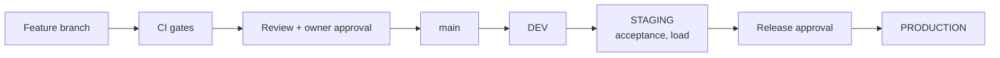

# Deployment

| | |
|---|---|
| Version | 1.0 |
| Status | Layer 0 baseline, 2026-09-28. CI gates are live; nothing is deployed yet. |
| Authority | Bible §26 (runbooks, feature flags), §28 (environments, CI gates, deployment), §30 (the owner approves progression); ADR-0010 |
| Normative sources | spec §2.3 (CI/CD), spec §7.6 (migrations, AI deployments, runbooks); `.github/workflows/ci.yml`, `infrastructure/terraform`, [INFRASTRUCTURE.md](INFRASTRUCTURE.md) |

This document explains how a change travels from a branch to production, and how each kind of artifact is released:
- services
- database migrations
- infrastructure
- iOS apps
- the admin web
- AI models

It also covers what gates the process and what to do when something goes wrong.

## 1. Path to production [B §28.1]

- Work happens on a feature branch. The owner approves merges to `main` (`CLAUDE.md`).
- `main` deploys to dev automatically once deployment is wired in Layer 1.
- Promotion to staging and then production deploys **the same immutable artifacts**. Only configuration differs.
- **No deployment when a required gate fails** [B §28.2].

## 2. CI gates [B §28.2]

| Bible gate | Job | Status |
|---|---|---|
| Formatting and linting | `workspace` (Biome), `terraform` (fmt, tflint) | Live |
| Type checking | `workspace` (tsc) | Live |
| Unit, API and database tests | `workspace` (Vitest), `spec` (database behaviour suite on PostgreSQL 18); the API and cross-tenant suites join in Layer 1 | Live, grows each layer |
| Migration validation | `spec` (fresh database: schema plus constraints). Per-layer migrations from Layer 1 | Live |
| Dependency and security scanning | `security` (OSV-Scanner); Dependabot updates | Live |
| Container scanning | Trivy on each image before push | Layer 1, with the first image |
| Terraform validation and plan review | `terraform` (validate, tflint, checkov); the plan is reviewed by a person before any apply | Validation live; plan review with the first account |
| iOS build and tests | `ios` (macOS 26, Xcode 26.6) | Live |
| Contract compatibility | `workspace` (OpenAPI drift, oasdiff breaking changes) | Live |
| Documentation integrity | `spec` (pack completeness, references, Bible export) | Live |

Flaky tests are fixed, never skipped, disabled or quarantined to get a green build ([TESTING_STRATEGY.md](TESTING_STRATEGY.md)).

## 3. Services (from Layer 1)

1. CI builds one Docker image per service, tagged with the git commit SHA. ECR tags are immutable.
2. Trivy scans the image; critical findings fail the build.
3. The image is pushed to the environment's ECR repository (`modules/compute`).
4. The ECS service is updated to the new task definition with a rolling deployment. It uses a deployment circuit breaker with automatic rollback when health checks fail.
5. `/health/ready` gates traffic. Synthetic journeys confirm the release ([INFRASTRUCTURE.md](INFRASTRUCTURE.md) §6).

**Rollback:** redeploy the previous task definition, whose image is still in ECR. Database changes are always backward-compatible with the previous release (section 4), so an app rollback never needs a database rollback.

## 4. Database migrations [B §28.3, spec §7.6]

Migrations are forward-planned and use **expand → migrate → contract**:

| Phase | What ships | Rule |
|---|---|---|
| Expand | New tables, columns, indexes and constraint fragments; old paths keep working | Released before the code that needs it |
| Migrate | Code writes to the new shape; a backfill runs as an idempotent job | Observable progress; resumable |
| Contract | Old columns and paths are removed | Only after a release has proven the new path |

- Prisma Migrate produces the SQL. The layer's `constraints.sql` fragment ships inside the same migration, so triggers and checks cannot drift from tables (spec §5.8).
- Every migration has a written rollback plan, and CI applies the whole chain to a fresh database and runs the behaviour suite.
- Migrations run as a one-off ECS task before the new service version starts. A failed migration stops the deployment.
- Destructive steps never run in the same release that stops using the data.

## 5. Infrastructure

1. Change Terraform on a branch. CI runs fmt, validate, tflint and checkov.
2. After merge, a person runs `terraform plan -out=tfplan` for the target environment, reviews it, and applies exactly that plan.
3. Production applies need owner approval. A plan that replaces or destroys data stores (RDS, S3) is rejected unless it is the explicit subject of an ADR.
4. CI never holds long-lived AWS keys. The proposed baseline is GitHub OIDC with per-environment roles; it is decided at Layer 1 kickoff ([INFRASTRUCTURE.md](INFRASTRUCTURE.md) open items).

## 6. iOS apps

| Step | Provider app | Patient app |
|---|---|---|
| Build | Tuist generate, then `xcodebuild` on the macOS 26 runner (Xcode 26.6) | Same |
| Internal testing | TestFlight internal group, from the end of Layer 1 | TestFlight, from Layer 5 |
| Release | App Store, or custom-app distribution for practices (decided before first release) | App Store |
| Versioning | Marketing version per release; build number from CI | Same |

Before the first TestFlight build we need the Apple Developer team and bundle identifier prefix (UD-34). The skeleton uses `com.aestara.*` provisionally. The minimum OS is iOS/iPadOS 26 (ADR-0005). App releases are independent of server releases because the API only changes additively within `/api/v1` ([API_CONTRACTS.md](API_CONTRACTS.md) §5).

## 7. Admin web (from Layer 1)

It is a static build of the React SPA (ADR-0003), uploaded to a private S3 bucket and served through CloudFront with WAF. It is fronted only for static assets; it never serves PHI [B §25.3]. Releases are atomic: new assets are uploaded under content-hashed names, then `index.html` is switched and invalidated. Rollback switches `index.html` back.

## 8. AI models (from Layer 7)

AI model deployments are independent of application deployments, versioned, and support rollback [B §28.3]:
- A model version is registered, validated against the harness thresholds, then rolled out through the registry (`AIModelRollout`).
- Rollback activates the previous version.
- A version that fails validation is never rolled out ([AI_ARCHITECTURE.md](AI_ARCHITECTURE.md)).

## 9. Feature flags

Flags allow controlled rollout per organization or practice [B §26]. **A flag never bypasses authorization**: it can hide a feature, never grant access. Flags are stored as `FeatureFlag` rows (Layer 2), changed by platform administrators, and audited.

## 10. Secrets and configuration

- Runtime secrets (database credentials, signing keys, vendor credentials) live in AWS Secrets Manager. They are injected into ECS tasks as secrets, never as plain environment variables in task definitions or images.
- Signing keys for access tokens are KMS keys (spec §4.2).
- Configuration that is not secret lives in the task definition, per environment.
- Nothing secret is committed. `.env.example` holds local-only values.

## 11. Runbooks [B §26]

Each runbook is kept with the operations dashboards and exercised before production. These are the outlines; each is expanded when its layer ships.

| Runbook | Detect | First actions | Recover and follow up |
|---|---|---|---|
| **Authentication outage** | Login-failure spike; `/health/ready` failing on auth dependencies | Check KMS signing-key access, database connectivity and recent deploys; roll back if a deploy caused it | Existing sessions keep working until their access tokens expire; communicate to practices; post-incident review |
| **Storage outage** | Upload success rate drops; S3 or KMS errors | Confirm with AWS Health; the iOS apps keep capturing offline and queue uploads (spec §8) | Queued uploads replay with the same idempotency keys; verify checksums; review |
| **AI outage** | AI job failure rate; queue age | Pause generation (flag); the UI shows the service-unavailable state; nothing is released to patients automatically | Resume; failed jobs are re-requested by providers, never auto-retried into release |
| **Integration outage** | Sync health; dead-letter growth | Pause the adapter; nothing is silently dropped (spec §5.4.9) | Replay dead letters after the fix; surface conflicts to staff |
| **Suspected data exposure** | GuardDuty or WAF alerts; access-denied bursts; a report | Contain: revoke affected sessions and devices and rotate credentials; preserve CloudTrail, audit and WORM evidence | Assess scope from the audit log; the operator's breach-notification process [B §21.3]; review |
| **Failed deployment** | Circuit breaker; health checks; synthetic journey failure | Automatic rollback to the previous task definition; stop the pipeline | Fix forward on a branch; migrations are backward-compatible, so no data rollback is needed |

## Open items

| Item | Decision point |
|---|---|
| CI → AWS authentication (GitHub OIDC roles) and deployment job | Layer 1 kickoff |
| Container scanning threshold policy (which severities block) | Layer 1, with the first image |
| Pinning third-party GitHub Actions to commit SHAs | Layer 1 kickoff (see [THREAT_MODEL.md](THREAT_MODEL.md)) |
| iOS distribution model for practices (App Store vs custom apps) | Before the first release to a practice |
| Release approval roles beyond the owner | Production readiness |
