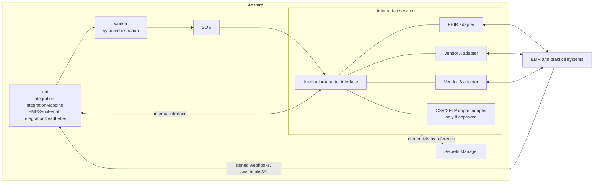
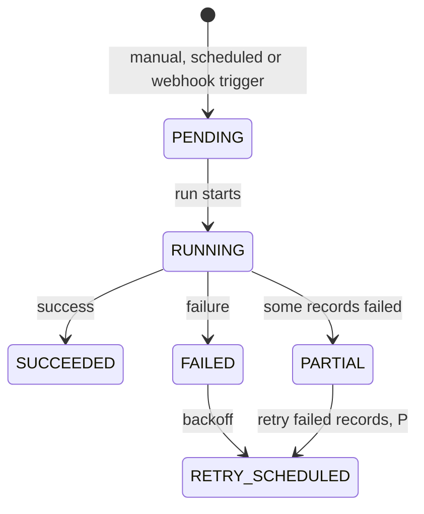
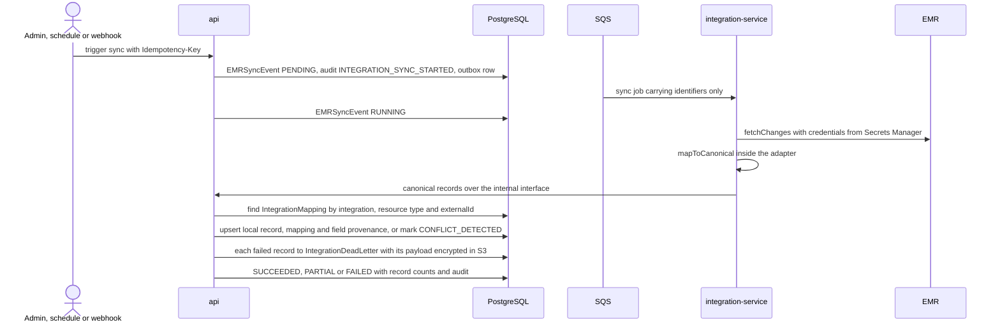

# EMR Integrations

| | |
|---|---|
| Version | 1.0 |
| Status | Layer 0 baseline, 2026-09-28 |
| Authority | Production Bible §18 (integration layer), §1.1 (vendor-independent connectivity), §1.2 (not an EHR replacement), §15.3 (appointment conflicts), §21.3 and §25.3 (BAAs, eligible services), §23.2 (not offline), §29 (Layer 10). ADR-0001 (tenancy), ADR-0006 (US only), ADR-0008 (delegated proposals) |
| Normative sources | Technical Specification §3.1 (service boundaries), §3.4 (flow D), §5.2 (integration tables), §5.4.9 (sync states), §6.3 (integration endpoints), §6.7 (adapter interface, webhooks), §7.1–§7.2 (secrets, PHI), §9.1 (Layer 10); `schema.prisma` models `Integration`, `IntegrationMapping`, `EMRSyncEvent`, `IntegrationDeadLetter` |

This document describes how Aestara connects to EMR and practice-management systems: the adapter boundary, canonical resources, the sync lifecycle, idempotency, conflict handling, dead letters, security and monitoring. The integration tables, APIs and services are built in Layer 10; earlier layers only carry the schema hooks listed in section 3.

---

## 1. Goals and boundaries

**Goals**

- Support EMR connectivity without coupling the product to one vendor [B §1.1].
- Map external records to a small set of canonical resources, with external ID mapping, idempotent upserts, conflict detection, retry with backoff, dead-letter handling, per-sync audit and status, and **no silent data loss** [B §18.4].
- Keep field-level provenance for mapped data where practical [B §18.4].

**Boundaries**

| Boundary | Rule | Source |
|---|---|---|
| Product scope | Aestara does not replace an enterprise EHR, billing, claims or e-prescribing system | [B §1.2], [B §11.3] |
| Vendor specifics | Stay inside adapters and never leak into product code | [B §18.1] |
| Surface | Backend only; no client talks to an EMR | [B §2] |
| Database | integration-service never touches PostgreSQL; api persists mappings, sync runs and dead letters | spec §3.1 [P] |
| Offline | EMR sync is not available offline | [B §23.2] |
| Tenancy | Every integration belongs to one organization (optionally one practice); data never crosses organizations | ADR-0001 |
| Compliance | Only vendors and services under the applicable agreements (BAA) may exchange PHI | [B §21.3], [B §25.3] |
| CSV/SFTP | Only if approved | [B §18.1] |

---

## 2. Adapter model

"Vendor A" and "Vendor B" are the Bible's placeholders [B §18.1]; no vendor has been selected (section 11).

**The interface.** Spec §6.7 names the `IntegrationAdapter` operations `fetchChanges`, `upsert`, `mapToCanonical` and `mapFromCanonical`. As the names indicate, adapters read changes from the external system, write to it, and translate between the vendor format and Aestara's canonical resources. Signatures, error model and paging are defined in roadmap M10.1.

**An integration instance** (`Integration` row) records:

| Field | Purpose |
|---|---|
| `kind` | `FHIR`, `VENDOR` or `CSV_SFTP` |
| `adapterKey` | The adapter implementation, for example `fhir-r4` (a schema example, not a decision) |
| `practiceId` | Optional practice scope within the organization |
| `status` | `DISABLED` (default), `ENABLED`, `ERROR` |
| `config` | Non-secret adapter settings only |
| `secretRef` | Secrets Manager reference; secret material is never stored in the database |
| `systemOfRecord` | The canonical resources for which the external system is the system of record |

---

## 3. Canonical resources

The Bible fixes nine canonical resources [B §18.2]; they are the `CanonicalResourceType` enum (verified 9/9, spec §11.2). Which local entity each maps to, and in which direction, is decided per adapter in Layer 10. The table shows the integration hooks the schema already provides.

| Canonical resource | Enum value | Integration hooks in `schema.prisma` today |
|---|---|---|
| Patient | `PATIENT` | `Patient.externalEmrIdentifier`; `Patient.mrn` is an "internal or externally mapped identifier" [B §4.2]; `Patient.createdById` is `NULL` only for integration or system creation; `PatientMedicalHistory.source = INTEGRATION` |
| Practitioner | `PRACTITIONER` | `IntegrationMapping` only (`ProviderProfile` carries the NPI) |
| Appointment | `APPOINTMENT` | `Appointment.sourceSystem = INTEGRATION`, `integrationId`, `externalId`, `externalVersion`, `lastSyncedAt`, `syncConflictDetectedAt`; unique `(integrationId, externalId)` |
| Encounter | `ENCOUNTER` | `IntegrationMapping` only |
| DocumentReference | `DOCUMENT_REFERENCE` | `Document.type = EXTERNAL_EMR` |
| Media | `MEDIA` | `PhotoSession.source` and `PatientPhoto.source = IMPORT` (only imports may omit the capturing user) |
| Consent | `CONSENT` | `IntegrationMapping` only; separately, `PhotoPermission.evidence = INTEGRATION_IMPORT` records a media-permission version whose evidence came from an integration |
| Procedure | `PROCEDURE` | `Procedure.externalId` |
| Observation | `OBSERVATION` | None; "where genuinely needed" [B §18.2] |

Imported media still follow every media rule: originals are immutable, and no permission is inferred from another [B §6.6], [B §7.1].

---

## 4. Sync lifecycle

A sync run is one `EMRSyncEvent` with a direction (`INBOUND` or `OUTBOUND`), an optional resource type and a trigger (`SCHEDULED`, `MANUAL`, `WEBHOOK`, `RETRY`).

**States** (Appendix A; visualization of the normative table in spec §5.4.9):

`FAILED → RETRY_SCHEDULED` is the spec's reading of the Bible diagram; `PARTIAL → RETRY_SCHEDULED` is proposed (P). A retry is a **new** `EMRSyncEvent` (trigger `RETRY`, `retryOfId` set, `attempt` incremented) that starts again at `PENDING`.

**An inbound run** (spec §3.4 flow D; the internal call shapes are defined in M10.1):

Webhooks arrive at `/webhooks/v1/{vendor}`, are signature-verified (HMAC or vendor signature) and replay-protected, then enqueued for processing like any other trigger (spec §6.7).

---

## 5. Idempotent upsert, conflicts and no silent loss

| Concern | Mechanism | Source |
|---|---|---|
| Duplicate runs | `POST /integrations/{id}/sync` requires `Idempotency-Key`; `EMRSyncEvent.idempotencyKey` is unique per integration | spec §6.1.8, `schema.prisma` |
| Duplicate records | `IntegrationMapping` is unique on `(integrationId, resourceType, externalId)` and on `(integrationId, resourceType, localId)`: one local record per external record per integration, so a re-import updates instead of duplicating | spec §5.2 |
| Version tracking | `IntegrationMapping.externalVersion` and `lastSyncedAt`; `Appointment.externalVersion` | `schema.prisma` |
| Field provenance | `IntegrationMapping.fieldProvenance` records where each mapped field came from | [B §18.4] |
| Conflict detection | A conflict sets `conflictState = CONFLICT_DETECTED` on the mapping (and `Appointment.syncConflictDetectedAt` for appointments). A local edit that collides with integration data returns `409 SYNC_CONFLICT`. Conflicts are surfaced and never silently overwritten | [B §15.3], [B §18.4], spec §6.2 |
| Conflict review | `GET /integrations/{id}/mappings?conflictState=` lists conflicts | spec §6.3 |
| System of record | For resources in `Integration.systemOfRecord`, the external system is the system of record: local records carry mapping and sync metadata, and conflicts are still surfaced rather than overwritten. For appointments, local transitions become proposals synced outward | [B §15.3], spec §5.4.6 |
| No silent loss | Every record that fails becomes an `IntegrationDeadLetter` row; the run ends `PARTIAL` or `FAILED` with `recordsProcessed` and `recordsFailed` | [B §18.4], spec §3.4 |

How a detected conflict is resolved (who decides, which value wins, and how `RESOLVED` is recorded) is not specified, and spec §6.3 has no resolve endpoint (section 11).

---

## 6. Retries and dead letters

**Retries.** A failed (or, proposed, partial) run moves to `RETRY_SCHEDULED` with `nextRetryAt`, and a new linked run starts when that time arrives (worker sync orchestration, spec §3.1). Exhausted retries dead-letter (spec §5.4.9). The backoff schedule and the maximum number of attempts are not specified (section 11).

**Dead letters.**

| Aspect | Design | Source |
|---|---|---|
| Row | `IntegrationDeadLetter`: sync event, resource type, external ID, error code, status, resolver | spec §5.2 |
| Payload | Raw payloads may contain PHI, so they live in S3 as a `StorageObject` of class `INTEGRATION_PAYLOAD`, in a separate integration-payload bucket, envelope-encrypted | spec §7.1, §7.4 |
| Status | `OPEN`, `REPLAYED`, `RESOLVED`, `DISCARDED` (enum; the transitions are not in spec §5.4) | `schema.prisma` |
| Operations | `POST /integrations/{id}/dead-letters/{dlId}/replay` and `/discard`, both requiring `integration.manage` and `Idempotency-Key` | spec §6.3 |
| Retention | Record category `INTEGRATION_PAYLOAD` in `RetentionPolicy`; nothing is deleted without a customer policy | spec §5.7 |

---

## 7. Mapping tables

The entity diagram is in [DATABASE_SCHEMA.md](DATABASE_SCHEMA.md) §3.8; the catalog rows are in spec §5.2.

| Table | Key columns | Rules |
|---|---|---|
| `Integration` | `kind`, `adapterKey`, `status`, `config`, `secretRef`, `systemOfRecord`, `practiceId` | Tenant-owned; composite FK to `Practice` |
| `IntegrationMapping` | `integrationId`, `resourceType`, `localId`, `externalId`, `externalVersion`, `fieldProvenance`, `conflictState`, `lastSyncedAt` | Two unique keys (section 5). `localId` is polymorphic, so its tenancy is **application-enforced** and covered by the authorization and cross-tenant suites (spec §5.1) |
| `EMRSyncEvent` | `integrationId`, `direction`, `resourceType`, `trigger`, `status`, `attempt`, `retryOfId`, `idempotencyKey`, `nextRetryAt`, `recordsProcessed`, `recordsFailed`, `errorSummary` | `errorSummary` is a safe summary with no PHI; retry chain via composite FK |
| `IntegrationDeadLetter` | `syncEventId`, `resourceType`, `externalId`, `payloadObjectId`, `errorCode`, `status` | Payload by reference to an encrypted object |

Constraint added in Layer 10: `Appointment_integration_source_chk` is re-created so an integration-sourced appointment must carry `integrationId` and `externalId` (it forbids `INTEGRATION` as a source until then).

---

## 8. Security: credentials, BAAs and PHI

| Control | Design | Source |
|---|---|---|
| Credentials | Vendor credentials live in AWS Secrets Manager; `Integration.secretRef` holds only the reference; the API returns secrets by reference only | [B §21.2], spec §6.3, §7.1 |
| Vendor agreements | Each EMR vendor exchanging PHI must be covered by a BAA and the customer's agreements; each vendor decision is recorded as a UD or ADR | [B §21.3], [B §25.3], spec §10.4 |
| Webhook authenticity | HMAC or vendor signature verification and replay protection before anything is enqueued | spec §6.7 |
| Internal traffic | api and integration-service talk only inside the VPC; the specific service-authentication mechanism for this interface is listed as "Internal" in spec §6.7 | spec §6.7 |
| PHI in operations data | Queue messages carry identifiers only; logs carry IDs and codes only; audit metadata never holds clinical content; `errorSummary` carries no PHI | spec §7.2 |
| Encryption | Integration payloads are envelope-encrypted with KMS | spec §7.1 |
| Least privilege | Only integration-service calls external EMRs; network egress controls are in [INFRASTRUCTURE.md](INFRASTRUCTURE.md) | spec §3.2 |
| Permissions | `integration.read` (default: SUPER_ADMIN, ORGANIZATION_ADMIN) and `integration.manage` (default: ORGANIZATION_ADMIN) | spec §4.5 (UD-17) |
| Tenancy | Integration, mapping, sync and dead-letter rows are tenant-owned with composite FKs; routes are covered by the generated cross-tenant tests | spec §5.1, §7.5 |

---

## 9. Monitoring and operations

| Need | Design | Source |
|---|---|---|
| Health metrics | Integration sync health, queue depth and age, outbox lag, on the per-environment dashboard | [B §26], spec §7.6 |
| Admin visibility | Admin web module "Integrations and mapping status": sync events, conflicts, dead letters (roadmap M10.4) | [B §17.1], spec §6.3 |
| Audit | `INTEGRATION_SYNC_STARTED` (when a sync is triggered through the API), `INTEGRATION_SYNC_SUCCEEDED` and `INTEGRATION_SYNC_FAILED` (worker, actor `SERVICE`), `INTEGRATION_CONFIG_CHANGED` [P] on configuration changes | [B §22.1], spec §6.3, §7.3 |
| Visible job status | Every sync run and its status is visible; no hidden background work | [B §22.4] |
| Runbook | "Integration outage" is one of the six required runbooks | [B §26], [DEPLOYMENT.md](DEPLOYMENT.md) |

---

## 10. Layer 10 delivery and tests

| Item | Content | Source |
|---|---|---|
| Tables | `Integration`, `IntegrationMapping`, `EMRSyncEvent`, `IntegrationDeadLetter` | spec §5.8 |
| Constraints | Re-created `Appointment_integration_source_chk` | `constraints.sql` |
| APIs | `/integrations` (instances, enable and disable, sync trigger, sync events, mappings, dead letters) and `/webhooks/v1/{vendor}` | spec §6.3, §6.7 |
| Roadmap | M10.1 service, interface, mappings and provenance · M10.2 FHIR R4 adapter (patients, practitioners, appointments first) · M10.3 sync engine · M10.4 monitoring UI · M10.5 first partner vendor adapter · M10.6 acceptance | [DEVELOPMENT_ROADMAP.md](DEVELOPMENT_ROADMAP.md) (plan only) |
| Must-pass tests | Idempotent upsert, conflict surfacing, no silent loss | spec §9.1 |
| Other tests | Integration-adapter tests [B §27.1]; generated cross-tenant and authorization tests for every integration route; the PHI log canary; webhook signature and replay rejection | spec §7.5, [TESTING_STRATEGY.md](TESTING_STRATEGY.md) |
| Exit | Selected partner integrations stable | [B §29] |

Earlier layers already carry the hooks listed in section 3 (for example `Patient.externalEmrIdentifier` from Layer 1 and the appointment integration columns from Layer 6), so Layer 10 adds tables without reshaping earlier ones.

---

## 11. Open items and vendor decisions

| Item | Status | Confirmed at |
|---|---|---|
| **Which EMR vendors first** | **Not specified** by the Bible or the spec. The Bible names "Vendor A" and "Vendor B" only as placeholders [B §18.1]; the roadmap plans a FHIR adapter first and then "first partner vendor adapter" without naming one. No UD exists yet; record the choice as a UD or ADR, with the vendor's BAA status | Layer 10 kickoff |
| FHIR version | Not fixed by the spec; the roadmap plans R4 and `schema.prisma` uses `fhir-r4` as an example key | Layer 10 kickoff |
| HL7 v2 | Bible §2 lists "FHIR/HL7/vendor adapters", but `IntegrationKind` has no HL7 value; whether HL7 v2 is a `VENDOR` adapter or needs its own kind is not specified | Layer 10 kickoff |
| CSV/SFTP approval | Allowed "only if approved" [B §18.1]; the enum value exists, the approval does not | Layer 10 kickoff |
| Canonical-to-local mapping and direction | Which local entity each canonical resource maps to (notably Encounter, Consent, Observation) and which resources flow in, out or both | Layer 10 (M10.1) |
| Conflict resolution | No resolve endpoint or rule for `CONFLICT_DETECTED → RESOLVED` | Layer 10 (M10.3) |
| Retry policy | Backoff schedule and maximum attempts | Layer 10 (M10.3) |
| Audit for `PARTIAL`, `RETRY_SCHEDULED` and non-manual starts | Spec §5.4 says every transition is audited, but the catalog has no event for `PARTIAL` or `RETRY_SCHEDULED`, no sync `…_STATUS_CHANGED` event exists, and spec §6.3 ties `INTEGRATION_SYNC_STARTED` only to the manual trigger endpoint | Layer 10 (UD-19) |
| Dead-letter and `IntegrationStatus` transitions | Enums exist; transitions and the meaning of `ERROR` are not specified | Layer 10 |
| System-of-record behavior beyond appointments | Specified for appointments only (spec §5.4.6) | Layer 10 |
| integration-service runtime and service authentication | Language not fixed by spec §2; the internal interface's authentication is listed only as "Internal" | Layer 10 (M10.1) |
