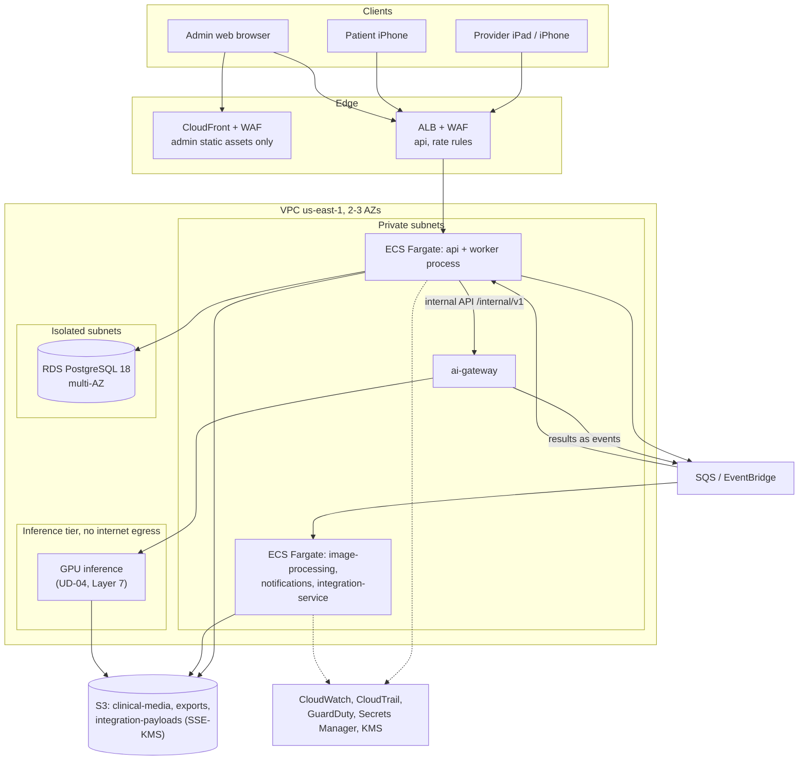

# Infrastructure

| | |
|---|---|
| Version | 1.0 |
| Status | Layer 0 baseline, 2026-09-28. Terraform written and statically checked; **not yet applied to any AWS account.** |
| Authority | Bible §21.2–21.3 (security rules, HIPAA-ready posture), §25.1–25.4 (stack, services, AWS map, scale), §26 (observability), §28 (environments); ADR-0006 (United States only), ADR-0010 |
| Normative sources | spec §2.3 (infrastructure stack), spec §3.1–3.2 (services and components), spec §7.1, §7.4, §7.6 (security mechanisms, media storage, operations commitments); `infrastructure/terraform` |

This document describes where Aestara runs and how the cloud estate is built. The Terraform in `infrastructure/terraform` is the executable form. [DEPLOYMENT.md](DEPLOYMENT.md) covers how changes reach it.

## 1. Principles

1. **United States only.** The production region is `us-east-1`, multi-AZ. The Terraform `region` variable rejects anything but a US commercial region (ADR-0006).
2. **HIPAA-eligible services only.** Every service that stores or processes PHI must be covered by the operator's AWS Business Associate Addendum and configured for regulated data [B §21.3, §25.3]. Code alone does not make a deployment compliant; the BAA, policies, training and incident response are the operator's (Bible §21.3).
3. **One AWS account per environment.** `allowed_account_ids` stops Terraform from running against the wrong account. A mistake in dev can never reach production data.
4. **Private by default.**
   - No public buckets, and no permanent or public media URLs.
   - Patient media is never cached on a public CDN [B §25.3].
   - The database sits in subnets with no route to the internet.
5. **Encrypted everywhere.** TLS in transit. Customer-managed KMS keys per purpose (data, media, logs) with yearly rotation. EBS encryption on by default [B §21.2].
6. **Everything is code.** Terraform is the only way to change infrastructure. A plan is reviewed before every apply (Bible §28.2).

## 2. Topology

This is the Bible §25.3 deployment map. The api and its worker process (same codebase, spec §3.1) are the only components that talk to the database. AI jobs are submitted through the internal API and their results come back as queue events (spec §6.7). Imaging and AI services receive opaque object references and never see demographics (spec §3.1).

## 3. What exists now and what each layer adds

| Component | Terraform module | Layer 0 | Added later |
|---|---|---|---|
| KMS keys (data, media, logs) | `modules/kms` | Yes | — |
| Account baseline: S3 public-access block, EBS default encryption, multi-region CloudTrail with log-file validation delivered to an Object Lock bucket, GuardDuty, IAM Access Analyzer, access-log bucket | `modules/account-baseline` | Yes | Security alert metric filters and alarms (Layer 1); CloudTrail delivery to a separate security account (spec §7.1, F-59) |
| VPC: public, private and isolated subnets; NAT; flow logs; S3 gateway endpoint | `modules/network` | Yes | Interface endpoints (ECR, Secrets Manager, Logs) as services arrive |
| Buckets: clinical-media (deletes denied), exports, integration-payloads | `modules/storage` | Yes | Presigned-upload CORS rules, the VPC-endpoint bucket condition and the overwrite denial from spec §7.1/§7.4 (Layer 2, F-61) |
| RDS PostgreSQL 18 | `modules/database` | Yes | RDS Proxy if connection counts need it (~100 practices) |
| ECS cluster, ECR repositories, service log groups, task security group | `modules/compute` | Yes | api task definition and service, ALB, WAF, ACM certificate (Layer 1) |
| Remote state (versioned, KMS, TLS-only S3 with lock files) | `bootstrap` | Yes | — |
| SQS / EventBridge for the transactional outbox | — | No | Layer 2 (M2.2) |
| CloudFront + WAF for the admin SPA | — | No | Layer 1, with the admin web |
| Notifications: APNs credentials, SES, SMS | — | No | Layer 5 |
| AI inference: ECS on EC2 GPU in a subnet tier with **no internet egress** (spec §2.1) | — | No | Layer 7 (UD-04, F-62) |
| Cross-region backup copies | — | No | Production readiness (roadmap step 14) |

Layer 0 deploys nothing that runs code. The modules exist so every later layer adds to a reviewed, checked baseline instead of starting from scratch.

## 4. Environments

| Environment | Purpose | Data | Sizing (Terraform) |
|---|---|---|---|
| Local | Developer machines, Codespaces, Claude Code on the web | Synthetic only | `docker compose` PostgreSQL 18 |
| dev | Integration of merged work | Synthetic only | 2 AZs, single NAT gateway, `db.t4g.medium` single-AZ |
| staging | Release candidate, acceptance and load tests | Synthetic only | 3 AZs, NAT per AZ, `db.t4g.large` multi-AZ |
| production | Customers | PHI | 3 AZs, NAT per AZ, `db.r7g.large` multi-AZ |

Production data is never copied into a lower environment unless an approved de-identification process exists [B §28.1]. CIDRs are `10.40/16` for dev, `10.41/16` for staging and `10.42/16` for production, so the environments can be peered later without overlap.

## 5. Security controls in the platform

| Bible §21.2 rule | Mechanism | Where |
|---|---|---|
| TLS in transit | RDS `rds.force_ssl=1`; bucket policies deny non-TLS; ALB HTTPS only (Layer 1) | `modules/database`, `modules/storage` |
| Encryption at rest | RDS, snapshots and Performance Insights use the data key. Buckets use the media key with SSE-KMS and bucket keys, and deny uploads encrypted with any other key. Logs use the logs key. EBS is encrypted by default. | `modules/kms`, `storage`, `database`, `account-baseline` |
| No public buckets or permanent URLs | Account-level and bucket-level public-access blocks, `BucketOwnerEnforced`, presigned URLs only | `account-baseline`, `storage` |
| Originals never destroyed | Versioning on, and `s3:DeleteObject`/`DeleteObjectVersion` denied on clinical media for every principal (a future retention role can be allowed once UD-24 is decided) | `modules/storage` |
| Secrets Manager | RDS master password created and rotated by Secrets Manager (`manage_master_user_password`); no secrets in Terraform or state | `modules/database` |
| Least privilege | One IAM role per service (Layer 1+); task security group with no inbound access until a load balancer exists | `modules/compute` |
| Tamper-resistant audit trail | CloudTrail across all regions with log-file validation and KMS, delivered to an Object Lock bucket (compliance mode in staging and production). A separate security account follows the account-structure decision (F-59). The application audit log's WORM copy arrives with the outbox (Layer 2, spec §7.3). | `modules/account-baseline` |
| No PHI in logs | The database logs no statement text (`log_statement=none`). Application logs are filtered before they leave the process (spec §7.2). | `modules/database`, services |
| WAF and rate limits | WAF on the ALB and CloudFront with rate rules on public and auth endpoints | Layer 1 |

Static checks enforce this on every change: `terraform validate`, tflint with the AWS ruleset, and checkov (341 policy checks passing). Every checkov suppression sits inline with its reason.

## 6. Observability [B §26, spec §7.6]

| Commitment | Implementation |
|---|---|
| Structured logs with strict PHI filtering | JSON logs per service to CloudWatch log groups encrypted with the logs key. A logger-level PHI filter and a CI "PHI log canary" test (spec §7.5). |
| Metrics | API latency and error rate per route; queue depth and age; upload success rate; AI job duration and failure rate; integration sync health; outbox lag; audit-to-WORM lag (spec §7.6) |
| Tracing | OpenTelemetry traces carrying safe identifiers only (request ID, resource IDs), never names or clinical content [B §26] |
| Dashboards | One CloudWatch dashboard per environment with the metrics above and SLO burn |
| Security alerts | CloudWatch metric filters and GuardDuty findings on: `ACCESS_DENIED` bursts, login-failure spikes, refresh-token reuse, audit/WORM divergence, WAF blocks, IAM anomalies |
| Synthetic checks | Scripted journeys every 5 minutes against a synthetic tenant (login → search → open synthetic patient → capture upload intent). They never use real patient data. |

Metric and alarm resources arrive with the services they watch, starting in Layer 1.

## 7. Backup, restore and disaster recovery

| Item | Baseline |
|---|---|
| Database | Automated backups kept 35 days with point-in-time recovery; final snapshot on deletion; deletion protection on |
| Objects | S3 versioning on every bucket; clinical media cannot be deleted |
| Cross-region copies | RDS snapshot copies and S3 replication to a second **US** region (spec §7.6). The region and its KMS keys are chosen at production readiness (open item). |
| Restore drill | Quarterly, into an isolated account, verified by row counts and checksums [B §36] |
| DR exercise | Before enterprise rollout [B §25.4] |
| RPO / RTO | Not specified by the Bible. They are proposed at production readiness and approved by the owner (open item). |

## 8. Scale posture [B §25.4]

| Scale | Posture |
|---|---|
| ~10 practices (pilot) | This baseline: single region, multi-AZ database, Fargate services with modest autoscaling, encrypted object storage |
| ~100 practices | Capacity monitoring, worker scaling, queue partitioning, search/index strategy, SLOs; RDS Proxy and Valkey counters (UD-27) as needed |
| ~1,000 practices | Horizontal API and worker scaling, database partitioning strategy, tenant-aware rate limits, dedicated AI capacity, DR exercises |

## 9. Running Terraform

Commands, prerequisites and the state bootstrap are in `infrastructure/terraform/README.md`. In short:
1. Bootstrap each account's state bucket once.
2. For each environment: `terraform init -backend-config=bucket=…`, then `plan`, a human review, then `apply` of the reviewed plan.

CI never applies. It only validates (see [DEPLOYMENT.md](DEPLOYMENT.md)).

## Open items

| Item | Decision point |
|---|---|
| AWS account IDs and the AWS Organizations structure, including the separate security account for CloudTrail (spec §7.1); BAA signed | Before the first `apply` (Layer 1) |
| Domain names and TLS certificates for the api and admin web | Layer 1 kickoff |
| How CI authenticates to AWS for plans and deploys (GitHub OIDC with per-environment roles is the proposed baseline) | Layer 1 kickoff |
| Second US region for backup copies; RPO/RTO targets | Production readiness (roadmap step 14) |
| SLO and load-test targets | Before production (see [TESTING_STRATEGY.md](TESTING_STRATEGY.md)) |
| Human production access to PHI (break-glass role, session recording, approval) | Before production (see [THREAT_MODEL.md](THREAT_MODEL.md)) |
| DDoS protection beyond WAF (AWS Shield Advanced) | Production readiness |
