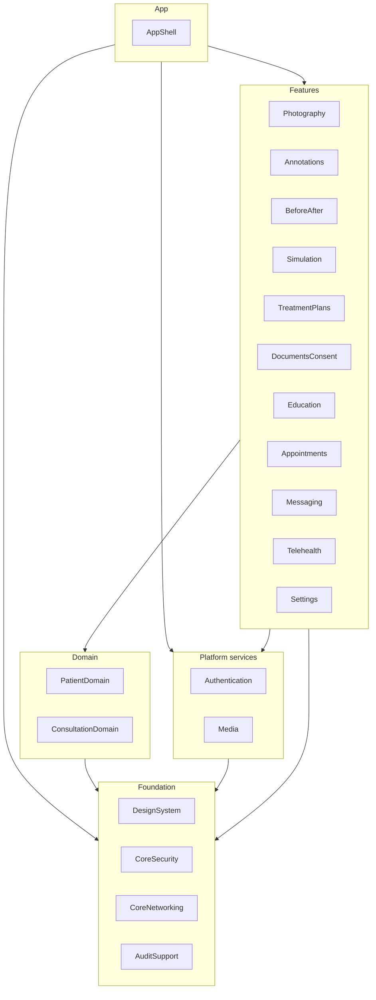
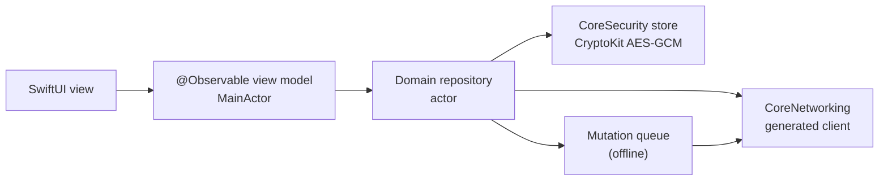

# iOS architecture

| | |
|---|---|
| Version | 1.0 |
| Status | Layer 0 baseline, 2026-09-28; updated for the Layer 1 kickoff decisions (ADR-0018), 2026-09-29 |
| Authority | Bible §2, §13, §23, §24.1–24.5, §21.1–21.2; ADR-0005 (iOS/iPadOS 26, intuitive controls), ADR-0011 (one token source), ADR-0018 (Layer 1 kickoff: K-17, K-22) |
| Normative sources | spec §2.2 (client stack), spec §4.2 (authentication on devices), spec §8 (offline and sync contract), [DESIGN_SYSTEM.md](DESIGN_SYSTEM.md); `apps/ios-provider/Modules/modules.json`, `apps/ios-provider/Project.swift`, `apps/ios-patient/Project.swift` |

This document describes how the two iOS apps are built:
- **Provider iPad/iPhone app:** surgeons, injectors, nurses, photographers, consultants and front desk.
- **Patient iPhone app.**

It covers the module structure, the rules that keep it clean, how offline work and security are handled on the device, and how it is built and tested.

## 1. Platform and stack

| Area | Choice | Source |
|---|---|---|
| Minimum OS | iOS/iPadOS **26** | D-05, ADR-0005 |
| Language and UI | Swift 6 language mode with complete strict-concurrency checking, SwiftUI, Swift Concurrency | [B §24.3], spec §2.2 |
| Frameworks | AVFoundation, Vision, CoreML, Metal (where useful), CryptoKit, LocalAuthentication, Keychain, URLSession, BackgroundTasks. ARKit is reserved for the future 3D layer only. | [B §24.3] |
| Packages | Swift Package Manager: one local package per Bible §24.4 module | spec §2.2 |
| Project generation | **Tuist** (Swift manifests); generated `.xcodeproj`/`.xcworkspace` are never committed | [B §31] "reproducible method", spec §2.2 |
| API client | Generated from `packages/api-contracts/openapi.json` by swift-openapi-generator, inside CoreNetworking | spec §2.2, §6.8 |
| Offline store | CryptoKit AES-GCM-sealed records and media files; key in the Keychain; Data Protection class *Complete* (ADR-0023 K2-17) | [B §23.3], spec §2.2 |
| Toolchain in CI | macOS 26 runner, Xcode 26.6, Swift tools 6.2 | `.github/workflows/ci.yml` |

## 2. Repository layout

```text
apps/ios-provider/
├── Project.swift               Tuist: app target "AestaraProvider" (iPhone + iPad), depends on AppShell
├── Sources/AestaraProviderApp.swift   @main; hosts AppShell.ProviderRootView
├── Modules/
│   ├── modules.json            tier, Bible section, layer and allowed dependencies of every module
│   └── <Module>/Package.swift  one local Swift package per Bible §24.4 module (20)
└── scripts/check_module_graph.py   architecture rules, run in CI (no Swift needed)
apps/ios-patient/
├── Project.swift               Tuist: app target "AestaraPatient" (iPhone)
└── Sources/AestaraPatientApp.swift
```

The patient app reuses three provider modules: DesignSystem, CoreNetworking and CoreSecurity (spec §2.2). It has no module of its own in Layer 0; its screens arrive with Layer 5.

## 3. Module graph

Every module belongs to a tier. Dependencies may only point to a lower tier, with same-tier dependencies allowed in the foundation and domain tiers. **Feature modules never depend on other feature modules.** Anything two features share moves down into a domain or platform module.



| Module | Tier | Bible | Responsibility | Built from |
|---|---|---|---|---|
| DesignSystem | foundation | §24.1–24.2 | Design tokens (generated), shared SwiftUI components and view states | Layer 0 (tokens); Layer 1 (components) |
| CoreSecurity | foundation | §21.2, §23.3 | Keychain and biometric gate (Layer 1); encrypted store (CryptoKit AES-GCM) and secure wipe (Layer 2, M2.9) | Layer 1 |
| CoreNetworking | foundation | §20 | Generated API client, request correlation, idempotency keys, error envelope | Layer 1 |
| AuditSupport | foundation | §22, §23.3 | Client audit context; offline audit replay queue | Layer 2 |
| Authentication | platform | §21.1 | Sign-in, MFA, token refresh, biometric unlock, revocation handling | Layer 1 |
| Media | platform | §6.6, §21.2 | Signed upload/download, checksums, encrypted media cache | Layer 2 |
| PatientDomain | domain | §4, §23 | Patient models, search, create with duplicate check (Layer 1); cached recent patients (Layer 2, UD-25) | Layer 1 |
| ConsultationDomain | domain | §5 | Consultation lifecycle, notes and concerns (spec §5.4.1) | Layer 3 |
| Photography | feature | §6 | Guided capture, live guidance, ghost overlay, capture review, upload queue | Layer 2 |
| Annotations | feature | §6.6 | Annotation layers kept separate from the immutable original | Layer 3 |
| BeforeAfter | feature | §8 | Five comparison modes; display-only alignment | Layer 3 |
| Simulation | feature | §9 | Visualization request, provider review, approve, then separate release, with the disclaimer | Layer 8 |
| TreatmentPlans | feature | §11 | Plans A/B/C, estimates, procedure tracking | Layer 4 |
| DocumentsConsent | feature | §12 | Consent assignment and signing, staff-assisted signing mode | Layer 4 |
| Education | feature | §12.5 | Education content and care instructions | Layer 4 |
| Appointments | feature | §15 | Schedule and appointment lifecycle | Layer 6 |
| Messaging | feature | §14 | Secure messaging with attachments | Layer 5 |
| Telehealth | feature | §16 | Virtual consultations through the approved vendor SDK | Layer 6 |
| Settings | feature | §17, §21.1 | Account, security and device settings | Layer 1 |
| AppShell | app | §24.4–24.5 | Composition root: adaptive navigation, routing, deep links | Layer 1 |

The exact allowed dependencies of each module are in `modules.json`, and each `Package.swift` must match it. `check_module_graph.py` enforces the following in CI (`workspace` and `ios` jobs) and fails the build on any violation:
- the module set equals Bible §24.4
- `Package.swift` files match `modules.json`
- the tier rules hold, and there are no cycles
- the patient app's dependency closure stays within its three modules
- the Swift tokens match the token package

**Layer 0 state.**
- DesignSystem contains the generated tokens and their tests.
- AppShell contained the root view, which showed only the brand name.

**Layer 1 state** (ADR-0022).
- CoreNetworking: the client generated at build time from `openapi.json` (swift-openapi-generator), with correlation, token-refresh and error-envelope middleware, and `APIError`.
- CoreSecurity: the Keychain (refresh token bound to the current biometric set, this device only), the installation ID and the biometric gate.
- Authentication: `AuthStore` (password, TOTP, authenticator enrollment, organization choice, relock after 5 minutes in the background) and the sign-in screens.
- PatientDomain: patient models, the meaning of a search string, and `PatientRepository`.
- Settings: account, organization switch, sign-out.
- AppShell: the root view switches between sign-in and the signed-in shell (a sidebar on iPad, tabs on iPhone); patient list and search, create with the duplicate check, and the profile with all twelve tabs; the privacy cover.
- Tests: module tests per package; Keychain tests hosted in the app (`AestaraProviderTests`); UI tests (`AestaraProviderUITests`) on iPhone and iPad against the real api.
- Every other module holds a documented boundary (its responsibility and Bible section) and no code, because Bible §30 forbids faking behaviour before its layer.

## 4. Adaptive layout and navigation

One scene definition serves iPad and iPhone and adapts on horizontal size class ([B §24.5], [DESIGN_SYSTEM.md](DESIGN_SYSTEM.md) §4):
- **iPad (regular):** `NavigationSplitView` with a 264-pt sidebar and a 340-pt list pane.
- **iPhone (compact):** a `TabView` with Patients, Schedule, Capture, Messages and More, plus large titles and push navigation.

AppShell owns the navigation model. Features expose views and routes but never navigate across each other directly. The intuitive-controls rules C1–C15 in DESIGN_SYSTEM.md §2 are binding (ADR-0005); every feature's UI goes through the checklist in DESIGN_SYSTEM.md §11.

**Deep links re-authorize.** Opening a link to a patient, photo or consent goes through the normal authorization path and never trusts cached UI state ([B §24.5], spec §8 rule 5).

## 5. Data flow inside a feature



- **Views stay thin.** State and actions live in `@Observable` view models on the main actor. Domain repositories are actors that own networking and persistence.
- **DTOs stop at the repository.** Generated API types are mapped to domain models inside the repository. Views never see transport types (Bible §31, DTO/persistence separation).
- **The server decides.** The app hides actions the user's permissions do not include, but authorization is always enforced server-side. A `403`/`404` from the server is handled as the real answer (spec §4.6).
- **Every data view implements the six view states:** normal, loading, empty, error, permission denied and offline (DESIGN_SYSTEM.md §6).

## 6. Offline and synchronization

The device follows spec §8 exactly; this is the implementation shape.

| Rule | How |
|---|---|
| What works offline | Cached recent patients, photo capture, note drafts, annotating cached photos, queueing uploads and mutations [B §23.1]. AI generation, EMR sync, release, export, sign-off, permission changes and consent completion need a connection [B §23.2]; the UI disables them with the offline banner. Patient creation is online-only too, because the duplicate check needs the server (spec §6.1.8; ADR-0018 K-17). |
| Encrypted at rest | Records and cached media sealed with CryptoKit AES-GCM; keys in the Keychain; files use Data Protection *Complete* (spec §7.1; ADR-0023 K2-17). |
| Mutation queue | Each operation stores a UUIDv7 `operationId`, which is sent as `Idempotency-Key`. Creates also store a client-generated `id`, and updates the resource `version`, which is sent as `If-Match`. Operations replay in order per aggregate; a failed dependency pauses only its dependents (spec §8 rules 1–3). |
| Conflicts | `412 VERSION_CONFLICT` is shown to the user with both versions. Nothing is auto-resolved by timestamp [B §23.3]. |
| Reconnect | Re-validate the session (`GET /auth/session`), replay offline audit records first (`POST /audit/offline-events`), then mutations (spec §8 rules 5 and 8). |
| Originals | Stored encrypted with their SHA-256. The local original is kept until the server reports the photo accepted (verified and scanned clean); a rejected photo keeps it so it can be uploaded again as a new photo (spec §8 rule 6; ADR-0025). |
| Cache policy | Maximum patients and maximum age from the `PracticeSetting` `offline.cachePolicy` (default 25 recent patients, 7 days). It covers the recent-patients list, the profiles and photo lists opened, and the thumbnails and previews viewed (spec §8 rule 7; ADR-0025). |
| Upload queue | One per user and organization (`UploadQueue`, Photography): sessions first, then each photo's intent, write-once `PUT` and completion, with UUIDv7 IDs and keys fixed when queued. Replay stops at the first network or server failure and resumes on the next sync: after sign-in, after each accepted photo, on returning to the foreground and when the network path comes back (ADR-0025). |

## 7. Security on the device

| Concern | Design |
|---|---|
| Tokens | Short-lived access token in memory. The refresh token is in the Keychain as `kSecAttrAccessibleWhenPasscodeSetThisDeviceOnly` with access control `.biometryCurrentSet`, so it stays on this device and is unreadable once the enrolled biometrics change. There is no fallback to the device passcode: if biometrics are unavailable or have changed, the user signs in again with password and MFA (spec §4.2; ADR-0018 K-22). A background app requires Face ID or Touch ID again after the configured time: 5 minutes by default for the provider app. |
| Step-up | Signing and export require a fresh biometric check on the device, and the server also requires a recent MFA verification (spec §4.2). |
| Staff-assisted signing | The consent-scoped hand-off locks the app to the consent. Leaving it needs staff re-authentication (UD-31, DESIGN_SYSTEM.md C13). |
| No PHI leaks | No PHI in logs, analytics, crash reports, notification payloads, URLs or pasteboard defaults (Bible §21.2, spec §7.2). Notifications carry only a deep-link identifier. |
| Sign-out and session end | Sign-out tries once more to upload, asks for confirmation if photos would be lost, then deletes the queue, cached media, patient summaries and cached lists. Offline view records stay sealed for that user and organization and replay at their next sign-in, so no audited view is lost. A session ending without a sign-out (expiry, revocation, failed unlock) deletes the caches and keeps the queue sealed for the same user. A device revoked while offline has its unsent records reported through the security runbook (spec §8 rules 7 and 8; ADR-0025). |
| Transport | TLS only, with App Transport Security at its defaults (no exceptions). |

## 8. Build, test and run

```bash
mise install                              # installs the pinned Tuist (mise.toml)
cd apps/ios-provider && tuist generate    # opens AestaraProvider.xcworkspace
cd apps/ios-patient && tuist generate     # opens AestaraPatient.xcworkspace
python3 apps/ios-provider/scripts/check_module_graph.py   # architecture rules
pnpm tokens                               # after editing packages/design-tokens/tokens.json
```

| Test level | Tool | Where | From |
|---|---|---|---|
| Design tokens | Swift Testing | `Modules/DesignSystem/Tests` | Layer 0 |
| View models and domain logic | Swift Testing | each module's `Tests/` | Layer 1 |
| Mutation queue, offline replay, conflict surfacing | Swift Testing with an in-memory store | CoreSecurity, PatientDomain, Photography | Layers 1–2 |
| UI automation for critical flows | XCUITest | app targets | Layer 1 onward [B §27.1] |
| Accessibility | UI tests find controls by label (Layer 1); XCUITest audits (Dynamic Type, VoiceOver) with the snapshot tool (Layer 2, ADR-0022); the token contrast gate | app targets | Layer 1 onward |

The CI `ios` job generates both projects, builds both apps for the simulator (the provider app for iPhone and iPad), runs the module tests (DesignSystem, CoreNetworking, PatientDomain, CoreSecurity, AuditSupport, Media, Photography) and the hosted Keychain tests on an iPhone simulator. Beside it, on its own runner, the `ios-ui` job starts the api, the worker, image-processing and the AWS emulator with a fresh database and runs the UI tests on an iPhone and a 13-inch iPad, in portrait: sign-in, a new patient, a standard Face photo session on the Debug-only synthetic camera through to thumbnails, a tag, a media permission, and search, with accessibility audits of the capture, gallery and permission screens. Each layer adds its module tests to the job.

## Open items

| Item | Decision point |
|---|---|
| Apple Developer team and bundle identifier prefix (`com.aestara.*` is provisional) | UD-34, before the first TestFlight build (end of Layer 1) |
| ~~Snapshot-testing tool for SwiftUI views and the automated accessibility audit~~ | Closed: swift-snapshot-testing and `performAccessibilityAudit()` (ADR-0023 K2-21) |
| ~~App-switcher privacy screen and jailbreak signals~~ | Closed: ADR-0022; see [THREAT_MODEL.md](THREAT_MODEL.md) |
