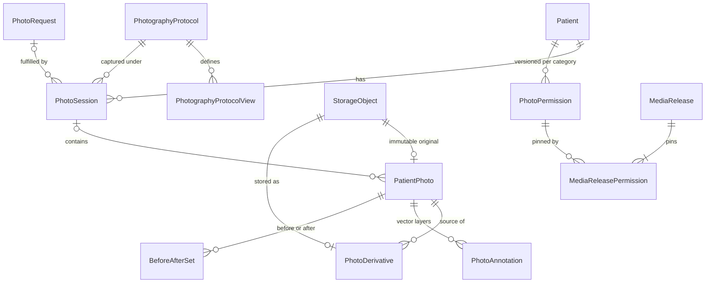
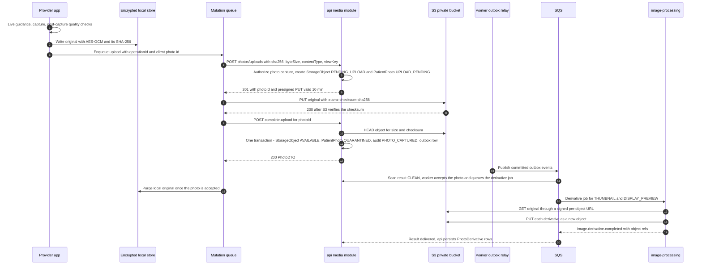
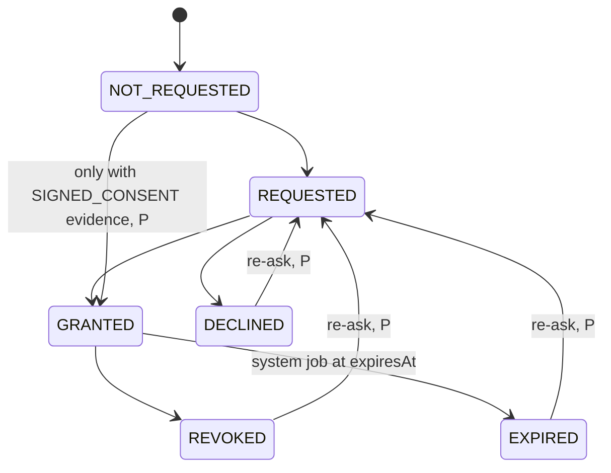
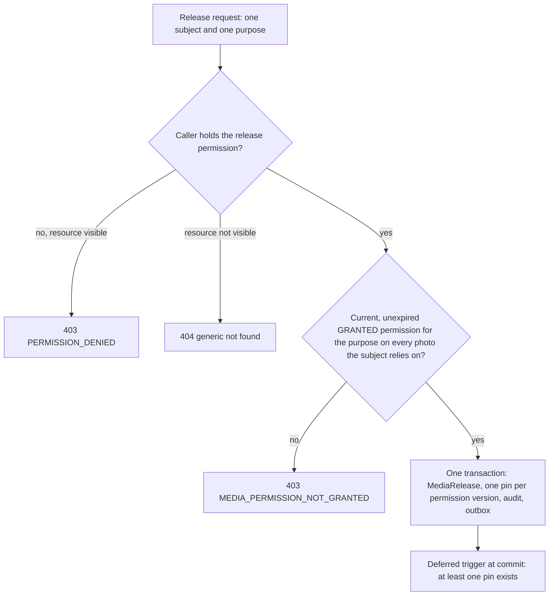
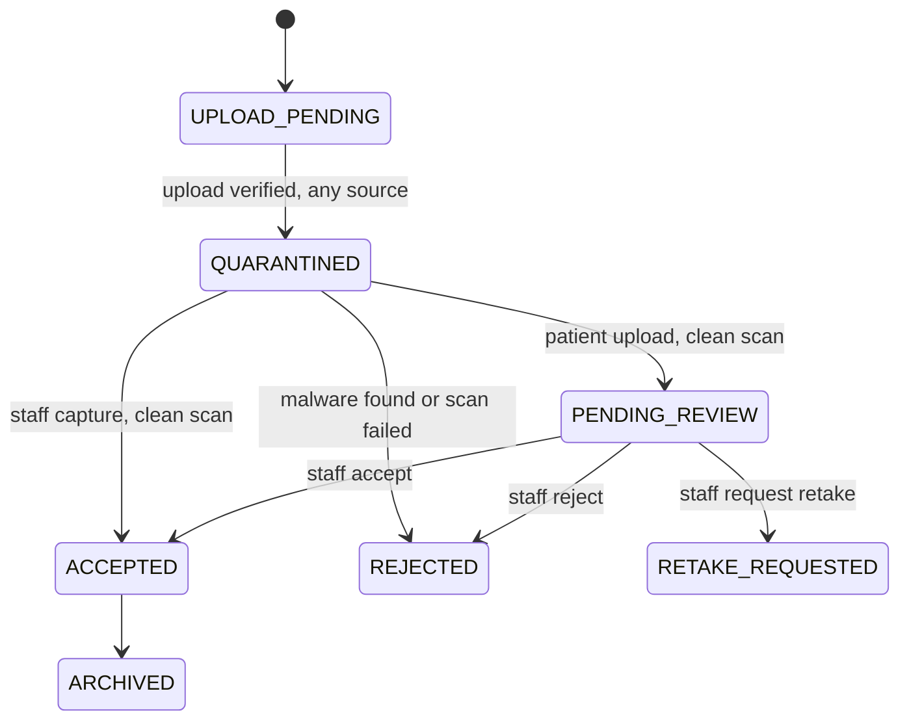

# Photo architecture

| | |
|---|---|
| Version | 1.0 |
| Status | Layer 0 baseline, 2026-09-28 |
| Authority | Production Bible §6 (clinical photography), §7 (media permissions and releases), §8 (before/after), §13.4 (patient photo upload), §21.2 (security rules), §22.3 (retention), §23 (offline), §30 (constitution). ADR-0001 (organization boundary), ADR-0004 (RLS), ADR-0008 (spec proposals adopted). |
| Normative sources | [`TECHNICAL_SPECIFICATION.md`](TECHNICAL_SPECIFICATION.md) §3.4 (flows A and C), §5.2 (Photography & media), §5.4.5, §5.4.10, §5.7, §6.1.8, §6.1.9, §6.3 (Photography; Before / after), §7.4, §8; [`schema.prisma`](technical-spec/schema.prisma) section 4; [`constraints.sql`](technical-spec/constraints.sql) Layer 2 and Layer 3 fragments |

This document explains how Aestara captures, stores, derives, permits, releases and retains clinical photographs, so that an original is never altered and no photo is used for a purpose without a current, purpose-specific permission. It organizes the normative spec and adds diagrams and verification; if the two ever differ, the spec wins (and the Bible wins over both).

Protocols, views and live capture guidance are in [PHOTO_PROTOCOLS.md](PHOTO_PROTOCOLS.md). AI use of photos is in [AI_ARCHITECTURE.md](AI_ARCHITECTURE.md).

---

## 1. Scope and layers

| Capability | Layer | Source |
|---|---|---|
| Storage ledger, upload intents, checksum verification, signed URLs, write-once objects | 2 | Roadmap M2.1; spec §5.8 |
| Protocols, photo sessions, uploads (offline-capable client IDs), guided capture | 2 | [B §6.1–6.5]; M2.3–M2.5 |
| Thumbnails and display previews as immutable derivatives | 2 | [B §6.6]; M2.6 |
| Media permissions (versioned per category) and releases with permission pins | 2 | [B §7]; M2.8 |
| Offline capture queue, encrypted local store, offline audit replay | 2 | [B §23]; spec §8; M2.9 |
| Retention policies | 2 | [B §22.3]; M2.10 |
| Annotations, before/after sets, registration, purpose-specific export | 3 | [B §8]; M3.4–M3.7 |
| Patient photo requests, quarantine intake, staff review | 5 | [B §13.4]; M5.8 |
| Simulation output derivatives | 8 | [B §9]; see [AI_SIMULATION_RULES.md](AI_SIMULATION_RULES.md) |

Layer 2's exit condition is "standard photo session works end to end" [B §29].

---

## 2. Invariants

These hold in every layer. Section 16 lists what enforces each one.

1. **The original is immutable.** It is uploaded once, verified by checksum, and never edited, overwritten, re-pointed or burned into [B §6.6, §30].
2. **Everything else is a derivative.** Thumbnails, previews, annotation renders, before/after composites, simulations and exports are new objects that reference their source and generation metadata [B §6.6].
3. **No permission implies another.** Each of the nine categories is granted, declined, revoked and expires independently. Clinical use or clinical consent never implies marketing, research or AI training [B §7.1–7.2, §30].
4. **Use is checked at the time of use**, against the current grant, and every release pins the permission versions it relied on [B §7.3]; spec §1.4 G3.
5. **Storage is private.** No public bucket, no public CDN, no permanent URL; access is through short-lived signed URLs only [B §14.4, §21.2, §25.3].
6. **Tenancy is enforced server-side and in the database.** Photos are readable across the practices of one organization and never across organizations (ADR-0001); every photo link is a composite `(organizationId, patientId, …)` foreign key (spec §5.1).
7. **No PHI leaves the API boundary** in object keys, URLs, logs, queue messages or push payloads (spec §7.2).

---

## 3. Components

| Component | Photo responsibilities | Database access | Source |
|---|---|---|---|
| Provider app modules `Photography`, `Media`, `Annotations`, `BeforeAfter` | Camera, live guidance, on-device quality checks, SHA-256 of the original, encrypted local store, upload queue, viewers, comparison rendering | Local encrypted store only | [B §24.4]; spec §2.2, §8 |
| Patient app | Requested photo capture and upload into quarantine | None | [B §13.4]; spec §3.4 flow C |
| `services/api` media module | Upload intents, completion and verification, signed URLs, `StorageObject` ledger, permissions, releases, audit, outbox | Yes (sole schema owner) | spec §3.1 |
| worker | Outbox relay, retention jobs, permission-expiry job | Yes | spec §3.1 |
| `services/image-processing` (Python, UD-06, ADR-0023 K2-01) | Thumbnails, display previews, normalization, before/after registration, annotated and export renders | **None**; jobs over SQS, objects via signed per-object URLs | spec §3.1, §6.7 |
| Malware scanning | Scans every uploaded object (GuardDuty Malware Protection for S3, or ClamAV); results reach the worker as events (ADR-0023 K2-04) | None; the worker records results | spec §2.1 |
| Amazon S3 | Private, versioned, SSE-KMS buckets | — | spec §2.1, §7.4 |
| SQS / EventBridge | `image.derivative.requested` / `.completed`, `image.registration.*`, outbox events such as `photo.captured` and `photo_permission.revoked` | — | spec §3.4, §5.4.5, §6.7 |

Image-processing never receives names, dates of birth, MRNs or free text: only opaque object references and job parameters (spec §3.1 minimum-necessary principle, §7.2 rule 6).

---

## 4. Data model

Excerpt; the normative catalog is spec §5.2 (Photography & media) and the precise definition is `schema.prisma` section 4.

| Entity | Role in this architecture | Layer |
|---|---|---|
| `StorageObject` | Ledger of every S3 object: class, bucket, opaque key, SHA-256, size, status, scan status, KMS alias. Write-once after `verifiedAt`. The key is never returned by the API. | 2 |
| `PhotographyProtocol`, `PhotographyProtocolView` | Protocol and its required/optional views (see [PHOTO_PROTOCOLS.md](PHOTO_PROTOCOLS.md)) | 2 |
| `PhotoSession` | Patient, protocol, source, capturer, time, optional consultation/procedure/practice/location [B §6.1] | 2 |
| `PatientPhoto` | Clinical photo; `originalObjectId` points at the immutable original; capture and quality metadata; `positionMatchScore` | 2 |
| `PhotoDerivative` | One immutable derivative of one source photo, with `generationMetadata` | 2 |
| `PhotoTag` | Free-form tags | 2 |
| `PhotoPermission` | Append-only permission version per category and scope | 2 |
| `MediaRelease`, `MediaReleasePermission` | A release of exactly one asset for one purpose, and every permission version it relied on | 2 |
| `PhotoAnnotation` | Vector annotation layer, never burned into the original | 3 |
| `BeforeAfterSet` | Two different photos of the same patient plus a display-only registration transform | 3 |
| `PhotoRequest` | Provider request for patient-captured photos | 5 |

---

## 5. Capture and upload pipeline

### 5.1 Steps

Bible §6.3 defines the capture workflow; spec §3.4 flow A defines the upload contract.

| # | Step | Where | Rule |
|---|---|---|---|
| 1 | Choose patient and protocol; start a session | App → `POST …/photo-sessions` | `photo.capture`; `Idempotency-Key` required; client UUIDv7 allowed (spec §6.1.8) |
| 2 | Choose a view, live guidance, capture, post-capture checks, accept or retake | App, on device | [PHOTO_PROTOCOLS.md](PHOTO_PROTOCOLS.md) |
| 3 | Protect locally | App | Original written to the encrypted store with its SHA-256: CryptoKit AES-GCM for media and metadata, keys in Keychain, Data Protection *Complete* (ADR-0023 K2-17; spec §7.1, §8 rule 6) |
| 4 | Queue | App | Queued operation carries `operationId` (sent as `Idempotency-Key`) and the client photo `id` (spec §8 rule 1) |
| 5 | Upload intent | `POST …/photos/uploads` | `photo.capture`; type allow-list JPEG/PNG and the 50 MiB limit checked (ADR-0023 K2-02); creates `StorageObject` `PENDING_UPLOAD` and `PatientPhoto` `UPLOAD_PENDING`; returns a presigned `PUT` valid 10 min with `Content-Type`, `x-amz-checksum-sha256` and `If-None-Match: *` headers; replaying the intent returns a fresh URL (spec §6.1.9, §6.6.2; ADR-0023 K2-03) |
| 6 | Upload bytes | App → S3 | S3 rejects a body whose SHA-256 differs from the signed header (spec §7.4) |
| 7 | Complete | `POST …/photos/{phid}/complete-upload` | `Idempotency-Key` required; the API re-reads size and checksum from S3; checks the first bytes; in one transaction: `StorageObject` `AVAILABLE` + `verifiedAt` (write-once from here), `PatientPhoto` `QUARANTINED`, audit `PHOTO_CAPTURED`, outbox `photo.captured` (spec §3.3 step 10, §3.4 flow A; ADR-0023 K2-05) |
| 7a | Scan | Malware scanner → worker | Clean: `PatientPhoto` `ACCEPTED` and the derivative job queued. Infected or failed: `REJECTED`, `PHOTO_REJECTED`, security alert; the object is never served (ADR-0023 K2-04) |
| 8 | Derivatives | image-processing | `THUMBNAIL` (400 px) and `DISPLAY_PREVIEW` (2048 px) written through presigned `PUT`s to objects the API registered first; the API verifies them and persists `PhotoDerivative` rows from the result event (spec §6.7; ADR-0023 K2-06) |
| 9 | Purge local original | App | After the photo is accepted (verified and scanned clean), per cache policy [B §23.3]; spec §8 rule 6 |

Nothing becomes visible to any user before steps 7 and 7a succeed (spec §6.1.9).

### 5.2 Sequence: capture, upload, verify, derive

### 5.3 Failures

| Situation | Result | Source |
|---|---|---|
| File type not allowed | `415 UNSUPPORTED_MEDIA_TYPE`, at intent or completion | spec §6.1.9, §6.2 |
| File too large | `413 PAYLOAD_TOO_LARGE` (50 MiB or 100 megapixels, ADR-0023 K2-02) | spec §6.2 |
| Size or checksum mismatch at completion | `422 UPLOAD_VERIFICATION_FAILED`; the photo stays invisible | spec §6.1.9, §6.2 |
| Retry with the same key after success | Original status and current representation replayed | spec §6.1.8 |
| Same key still processing / reused with another body | `409 IDEMPOTENCY_IN_PROGRESS` + `Retry-After` / `409 IDEMPOTENCY_KEY_REUSED` | spec §6.1.8 |
| Client ID collides with an existing record | Generic `409 CONFLICT` | spec §6.1.8 |
| Patient not visible, or in another organization | `404 PATIENT_NOT_FOUND`, identical body either way | spec §6.1.10 |
| Storage outage | `503 SERVICE_UNAVAILABLE` + `Retry-After`; storage-outage runbook [B §26] | spec §6.2, §7.6 |
| Derivative job fails | The original stays `ACCEPTED`; `GET …/photos/{phid}` reports each derivative as pending, available or failed. Transient failures retry three times (1, 5, 30 minutes); undecodable files fail at once (ADR-0023 K2-06) | spec §6.3 |
| Scan finds malware or cannot complete | `REJECTED`; never served; `PHOTO_REJECTED`; the app offers to upload the kept local original again or to retake (ADR-0023 K2-04) | spec §5.4.10 |

### 5.4 Resumability

Resumability is defined at the **operation** level. The intent, the `PUT` and the completion are queued operations retried with the same `Idempotency-Key` and client photo ID, so a retry can never create a second photo (spec §8 rules 1–3). ADR-0023 K2-03 settles the rest:

- there is no byte-range or multipart resumption: an original is at most 50 MiB and goes in one `PUT`;
- after the 10-minute URL expires, the client replays the intent with the same key: while the photo is `UPLOAD_PENDING`, its current representation includes a fresh URL.

---

## 6. Original protection and derivatives

The Bible's derivative tree [B §6.6], as modelled:

| Bible node | Model | Produced by | Layer |
|---|---|---|---|
| ORIGINAL (immutable) | `PatientPhoto.originalObjectId` → `StorageObject` | Client upload, verified by the API | 2 |
| THUMBNAIL | `PhotoDerivative` kind `THUMBNAIL` | image-processing, after capture | 2 |
| DISPLAY_PREVIEW | kind `DISPLAY_PREVIEW` | image-processing, after capture | 2 |
| ANNOTATION_LAYER | `PhotoAnnotation`: vector JSON, coordinates normalized 0..1 relative to the original | Provider app | 3 |
| ANNOTATED_DERIVATIVE | kind `ANNOTATED_DERIVATIVE`, with `annotationId` | image-processing render | 3 |
| BEFORE_AFTER_DERIVATIVE | kind `BEFORE_AFTER_DERIVATIVE`, with `beforeAfterSetId` | Composite export | 3 |
| AI_SIMULATION_DERIVATIVE | kind `AI_SIMULATION_DERIVATIVE`; `SimulationVersion.outputDerivativeId` | AI inference | 8 |
| MARKETING_DERIVATIVE, EXPORT_DERIVATIVE | kinds of the same names | Purpose-specific export (`POST …/photos/{phid}/exports`) | 3 |

Rules:

- Every derivative references its source photo and carries `generationMetadata` (generator name and version, parameters, transforms) and, where a job produced it, `generatedByJobId` [B §6.6].
- Derivatives are immutable. Regenerating one inserts a new row and a new object (verified C8–C9).
- Annotations are separate rows and never alter pixels of the original. Only a render creates pixels, and it is a new derivative.
- Archiving a photo (`POST …/photos/{phid}/archive`, `ACCEPTED → ARCHIVED`) changes its status only; the original is retained (spec §6.3, §5.4.10). Archived photos are hidden from lists by default, shown by a filter with an "Archived" badge, and never reused (ADR-0023 K2-14).
- `ORIGINAL` bytes are served only through `access-urls` with the `photo.export` permission, and every issuance is audited (spec §6.3).

---

## 7. Storage layout and encryption

From spec §7.4 and §7.1, and as built in `infrastructure/terraform/modules/storage` (Layer 0, not yet applied; [INFRASTRUCTURE.md](INFRASTRUCTURE.md)):

| Concern | Design |
|---|---|
| Buckets | One private bucket per environment for clinical media, plus separate buckets for exports and for integration payloads (different lifecycle and IAM). Terraform names them `clinical-media`, `exports` and `integration-payloads` |
| Keys | `{objectClass}/{random UUIDv7}`: opaque, with no tenant, patient or PHI in the key, and never overwritten. `objectClass` is a `StorageObjectClass` value (`CLINICAL_ORIGINAL`, `CLINICAL_DERIVATIVE`, `AI_ARTIFACT`, `DOCUMENT`, `SIGNATURE`, `MESSAGE_ATTACHMENT`, `CONTENT_MEDIA`, `DATA_EXPORT`, `INTEGRATION_PAYLOAD`) |
| Overwrite and delete protection | S3 versioning on every bucket. The `clinical-media` bucket policy denies `s3:DeleteObject` and `s3:DeleteObjectVersion` to every principal until a retention role is approved (UD-24, ADR-0014), and denies `s3:PutObject` without `If-None-Match: *`, so no key is ever overwritten (spec §7.4; ADR-0023 K2-09) |
| Encryption at rest | SSE-KMS with bucket keys, using the per-environment customer-managed `media` KMS key; the bucket policy rejects uploads encrypted with any other key. `StorageObject.kmsKeyAlias` records the key |
| Public access | S3 Block Public Access at account and bucket level; bucket policies deny non-TLS access, and deny service-role access that does not come through the VPC endpoint (spec §7.1). Devices use presigned URLs signed by a separate presigning role limited to putting and getting clinical objects (ADR-0023 K2-09) |
| IAM | One role per service; S3 access scoped per object class |
| Checksums | SHA-256 declared at intent, verified by S3 on `PUT` and again by the API on completion |
| Device | Data Protection *Complete*, CryptoKit AES-GCM-sealed records and media, keys in Keychain (ADR-0023 K2-17) |
| CDN | None for patient media [B §25.3] |

`clinical-media` holds every object class except `DATA_EXPORT` (`exports`) and `INTEGRATION_PAYLOAD` (`integration-payloads`); the WORM audit copy goes to `audit-archive`, with Object Lock (ADR-0023 K2-07, K2-09).

---

## 8. Signed access

All lifetimes come from spec §6.1.9 and §7.1.

| Access | URL | Lifetime | Endpoint | Permission | Audit |
|---|---|---|---|---|---|
| Upload an original | Presigned `PUT` | 10 min | `POST …/photos/uploads` | `photo.capture` | `PHOTO_CAPTURED` at completion |
| View `THUMBNAIL` / `DISPLAY_PREVIEW` | Presigned `GET` | 120 s | `POST …/photos/{phid}/access-urls` | `photo.view` | `PHOTO_VIEWED` |
| View `ORIGINAL` | Presigned `GET` | 120 s | same | `photo.export` | `PHOTO_VIEWED` (always) |
| Download an export | Presigned `GET` | 10 min | export endpoints | `photo.export` / `data.export*` | per endpoint (spec §6.3) |
| Patient views own photo | Presigned `GET` | 120 s | `POST /portal/photos/{id}/access-urls` | Active patient link + current `PATIENT_APP` grant + unrevoked `PATIENT_APP` release (spec §4.7) | `PHOTO_VIEWED` |
| Service reads or writes an object | Signed per-object URL | ≤ 10 min | Issued for a job | Service IAM role | — |

Every download URL carries `Content-Disposition` and `Cache-Control: private, no-store`. Object keys appear only inside signed URLs; they are never returned as data or in errors (spec §6.1.9). Opening a cached photo offline writes a local audit record that is replayed later (section 13).

---

## 9. Media permissions

### 9.1 Categories and independence

The nine categories [B §7.1] are independent rows: `CLINICAL_USE`, `PATIENT_APP`, `EDUCATION`, `WEBSITE`, `SOCIAL_MEDIA`, `PAID_ADVERTISING`, `RESEARCH`, `AI_TRAINING`, `INTERNAL_AI_EVALUATION`. No category implies another, and no code path may derive one from another [B §7.2]. A signed clinical consent can be recorded as the *evidence* for a grant (`evidence = SIGNED_CONSENT`, pointing at an executed consent), but the grant is still an explicit, per-category transition recorded by an authorized user (see [CONSENT_ARCHITECTURE.md](CONSENT_ARCHITECTURE.md)).

### 9.2 States

Diagram of spec §5.4.5 (the table there is normative). Each transition inserts a new version and stamps `supersededAt` on the previous one; permission `photo.permission.manage`; audit `PHOTO_PERMISSION_CHANGED`.

### 9.3 Scope, evidence, history

| Aspect | Design | Source |
|---|---|---|
| Scope | `PATIENT_WIDE`, `PHOTO_SESSION` or `PHOTO`; shape enforced by CHECK. The UI offers patient-wide plus per-photo exceptions. The most specific current row wins (photo, then session, then patient-wide); no row means `NOT_REQUESTED` | spec §5.2; UD-21 (ADR-0023 K2-15) |
| Evidence | `SIGNED_CONSENT` (must reference an executed consent; available from Layer 4), `PATIENT_APP_ACTION`, `STAFF_ATTESTATION`, `INTEGRATION_IMPORT` | `schema.prisma`; `constraints.sql` Layer 2/4 |
| History | Append-only; one current row per (patient, category, scope target); a superseded row is frozen; no deletes | verified D1–D9 |
| Expiry | `expiresAt`; a system job moves `GRANTED → EXPIRED`, and use-time checks also honour `expiresAt` | spec §5.4.5 |
| Revocation | Blocks future use for that purpose immediately and emits `photo_permission.revoked` for downstream compliance workflows | [B §7.3]; spec §5.4.5 |
| API | `GET /patients/{pid}/photo-permissions` and `…/history` (`photo.permission.read`); `POST /patients/{pid}/photo-permissions` (`photo.permission.manage`, `Idempotency-Key` required) | spec §6.3 |

### 9.4 Enforcement points

| Use | Grant checked at the time of use | Source |
|---|---|---|
| Patient-app visibility of photos and before/after | Current `PATIENT_APP` grant **and** an unrevoked `MediaRelease` with purpose `PATIENT_APP` | [B §7.3]; spec §4.7; UD-20 |
| Marketing export and the marketing library | Current grant for the purpose (`WEBSITE`, `SOCIAL_MEDIA`, `PAID_ADVERTISING`) at export time; MARKETING sees only assets with a current release for those purposes | [B §3.2, §7.3]; spec §4.4 |
| Any purpose-specific export | Current grant for that purpose; a before/after composite checks both photos | [B §8.3]; spec §6.3 |
| Simulation sources | Current `CLINICAL_USE` grant (baseline) | spec §3.4 flow B, §7.7; UD-32 |
| Similar-case library | `EDUCATION` grant and a de-identified display derivative (baseline), authorized through a `MediaRelease` | spec §5.2; UD-10 |
| AI training / internal evaluation datasets | `AI_TRAINING` / `INTERNAL_AI_EVALUATION` plus a recorded governance approval; no such pipeline exists before Layer 7 | [B §7.3]; spec §7.7 |

A failed check returns `403 MEDIA_PERMISSION_NOT_GRANTED` (spec §6.2).

---

## 10. Releases and permission pinning

A `MediaRelease` records that exactly one asset was released or exported for one purpose. The subject is one of: photo or derivative (Layer 2), before/after set (added in Layer 3), simulation (added in Layer 8); a CHECK enforces "exactly one" and is re-created as subjects are added (verified D10). After insert, only the revocation columns may change, once.

`MediaReleasePermission` pins **every** `PhotoPermission` version the release relied on; a before/after set or a simulation can depend on several photos' grants. A deferred constraint trigger rejects, at commit, a release that pins nothing; pins are append-only (verified R15–R17). Pinning makes the authorization for each release provable later, even after the grant is revoked or superseded.

| Action | Endpoint | Permission | Audit |
|---|---|---|---|
| Release for a non-patient purpose | `POST /patients/{pid}/media-releases` | `photo.export` | `MEDIA_RELEASED*` |
| Release to the patient app | same | `consultation.complete` | `MEDIA_RELEASED*` |
| Revoke a release | `POST …/media-releases/{id}/revoke` | same as release | `MEDIA_RELEASE_REVOKED*` |
| Release a simulation | `POST …/simulations/{simId}/release` | `simulation.release` | `SIMULATION_RELEASED` |

`*` marks spec-proposed events and keys (spec §4.4, §7.3). Both the release and the permission check happen online only (spec §8).

A permission change that leaves a release's effective grant other than `GRANTED` (revocation, expiry, or a more specific decline) also revokes the dependent active releases in the same transaction, with `MEDIA_RELEASE_REVOKED`, so a later re-grant never revives an old release. Every use still re-checks the grant at read time, and the outbox event `photo_permission.revoked` lists the affected releases for the downstream compliance workflow [B §7.3] (ADR-0023 K2-15).

---

## 11. Before/after registration

| Rule | Design | Source |
|---|---|---|
| Same patient, two different photos | Composite FKs include `patientId`; CHECK `beforePhotoId <> afterPhotoId` | [B §8.1, §34.1 #12–13]; verified C5–C7 |
| Authorization | Create and queue automatic registration with `photo.view`; adjust manual registration with `photo.annotate` and `If-Match` | spec §4.4, §6.3 |
| Compatible view | Checked on create | [B §8.1]; spec §6.3 |
| Registration modes | `NONE`, `AUTOMATIC`, `MANUAL`; `NONE` means no transform (CHECK) | `schema.prisma`; `constraints.sql` Layer 3 |
| Automatic registration | `AIJob` of type `IMAGE_REGISTRATION` (Layer 3, no model), run by image-processing over `image.registration.*` | spec §5.8, §6.7 |
| Transform | 2D transform in normalized coordinates, stored on the set and **applied at display time only**. It never produces a new original and never modifies either photo. | `schema.prisma` |
| Reset and disable | `PATCH …/before-after/{setId}` can reset registration; automatic registration can be disabled or reset | [B §34.1 #17] |
| Comparison modes | Side-by-side, swipe, cross-fade, blink, overlay, synchronized zoom and pan: client rendering of display previews plus the transform | [B §8.2]; spec §6.3 |
| Export | Composite export checks the purpose grant for both photos, creates a `BEFORE_AFTER_DERIVATIVE` and writes `PHOTO_EXPORTED` | [B §8.3, §34.1 #18–19] |

---

## 12. Patient photo intake and malware scanning

Patient uploads arrive in Layer 5 (spec §3.4 flow C). The provider creates a `PhotoRequest` (protocol required, requested view keys); the patient captures and uploads through the portal; the object lands in quarantine and is validated before anyone reviews it.

Diagram of the `PatientPhoto` machine in spec §5.4.10 (P, adopted by ADR-0008). Staff review uses `POST …/photos/{phid}/review` with `photo.capture` and writes `PHOTO_INTAKE_REVIEWED*`.

Malware scanning (UD-22, confirmed by ADR-0023 K2-04): Amazon GuardDuty Malware Protection for S3 if it is in BAA scope, otherwise a ClamAV worker; every uploaded object is scanned, whatever its source. `StorageObject.scanStatus` records `NOT_REQUIRED`, `PENDING`, `CLEAN`, `INFECTED` or `ERROR`. Scanning is required for patient uploads and message attachments [B §13.4, §14.4]; spec §2.1. ADR-0023 extends it to provider captures (K2-04) and adds the scan step to every source: an `INFECTED` or `ERROR` result moves the photo `QUARANTINED → REJECTED` and the object to `REJECTED` (K2-05).

---

## 13. Offline capture

Capture works offline; server-dependent steps do not [B §23.1–23.2]; spec §8.

| Rule | Design | Source |
|---|---|---|
| Offline creates | `PhotoSession`, `PatientPhoto` and `PhotoAnnotation` may carry a client-generated UUIDv7 | spec §6.1.8 |
| Ordering | Operations replay in order per aggregate (the session before its photos); a failed dependency pauses its dependents only | spec §8 rule 2 |
| No duplicates | Retries reuse the same `Idempotency-Key` | spec §8 rule 3 |
| Local originals | Stored encrypted with their SHA-256; purged after `complete-upload` confirms the checksum | spec §8 rule 6 |
| Cache policy | `PracticeSetting` `offline.cachePolicy`: 25 recent patients, 7 days, purge on sign-out, device revocation or session expiry; the queue belongs to one user in one organization | spec §8 rule 7; UD-25 (ADR-0023 K2-17) |
| Re-authorization | On reconnect the app re-validates the session (`GET /auth/session`) before replay | spec §8 rule 5 |
| Offline views | Opening a cached patient or photo writes an encrypted local audit record, replayed first through `POST /audit/offline-events` with `offline = true` and the original timestamp | spec §8 rule 8 |
| Online only | Export, release, permission changes | spec §8 |

`capturedAt` is set on the device at capture and is immutable once stored (trigger); `PHOTO_CAPTURED` is written when the server verifies the upload.

---

## 14. Retention

Retention is policy-driven and never hard-coded [B §22.3]; spec §5.7.

- `RetentionPolicy` rows per organization and record category (`CLINICAL_PHOTO`, `AI_ARTIFACT`, `DATA_EXPORT`, and others) define a period and an action: `ARCHIVE`, `DELETE` or `REVIEW`. A `DELETE` policy must state a period (CHECK, verified H6).
- **If no policy exists for a category, nothing is deleted automatically.** Legal hold is modelled before any `DELETE` policy is allowed (UD-24, confirmed at Layers 1–2).
- Purging deletes the S3 object and marks the ledger row `PURGED` with `purgedAt`. The ledger row, checksum and audit trail remain (verified C10).
- Deletion workflows account for backups (RDS snapshots, S3 version-expiry windows) and downstream integrations [B §22.3].
- Local device media follows the cache policy (section 13), independent of server retention.

---

## 15. Audit events

Excerpt; the catalog and event contents are normative in spec §7.3. Audit metadata carries identifiers and codes only, never clinical content [B §22.2].

| Event | Written when |
|---|---|
| `PHOTO_CAPTURED` | `complete-upload` succeeds |
| `PHOTO_VIEWED` | A signed view URL is issued (staff or portal); offline views replayed |
| `PHOTO_EXPORTED` | A purpose-specific export, including before/after composites |
| `PHOTO_PERMISSION_CHANGED` | Any permission transition, user or system (expiry) |
| `MEDIA_RELEASED*` / `MEDIA_RELEASE_REVOKED*` | Release and revocation |
| `PHOTO_ANNOTATED*` | Annotation created or changed |
| `BEFORE_AFTER_CREATED*` | Before/after set created |
| `PHOTO_INTAKE_REVIEWED*` | Staff decision on a patient upload |
| `PHOTO_REJECTED*` | A scan blocked a photo (system actor) |
| `PHOTO_ARCHIVED*` | A photo was archived |
| `CONFIGURATION_CHANGED*` | Protocol, flag, setting and retention-policy changes |
| `ACCESS_DENIED*` | Authorization failure on a sensitive endpoint |

---

## 16. What can never happen

| Never | Prevented by | Proven by |
|---|---|---|
| An original is edited, overwritten, deleted by the app or re-pointed | `PatientPhoto_original_immutable`, `StorageObject_write_once` and `StorageObject_identity_immutable` triggers; S3 versioning; the `clinical-media` bucket policy denies deletes (overwrite denial arrives with the per-service IAM roles); derivatives are new objects | C1–C4, C8–C9; `checkov` in the `terraform` CI job |
| An annotation or registration alters the original's pixels | Annotations are vector rows; registration is a display-time transform; renders are new derivatives | C8–C9; before/after API tests ([B §34.1 #14]) |
| A permission is inferred from another category, or from clinical consent | Independent rows per category; `SIGNED_CONSENT` is evidence for an explicit transition, not a grant | D3; media permission tests (spec §7.5) |
| A use without a current grant | Use-time check on export, release and portal read | Media permission tests with revoked and expired grants (spec §7.5) |
| A release without a recorded authorization | Deferred constraint trigger; append-only pins | R15–R17 |
| A cross-patient or cross-organization photo link | Composite FKs; RLS (ADR-0004); tenant-scoped repositories | C5, D9, R1–R2; generated cross-tenant tests |
| Unverified bytes become visible | Visibility only after `complete-upload` verification | API tests: checksum mismatch returns 422 |
| A public bucket or a permanent URL | Account-level Block Public Access, bucket policies, presigned URLs of at most 10 min, keys never returned, no CDN | `checkov`; API contract tests that no response carries an object key |
| PHI in object keys, URLs, logs or queue messages | Opaque keys, POST search, allow-list logging, reference-only job payloads | PHI log canary test (spec §7.2) |
| A patient sees an unreleased photo | Release-filtered portal repositories, deny by default | Portal visibility tests (spec §7.5) |
| Automatic deletion without a customer policy | No default policy; CHECK on `DELETE` | H6 |

---

## 17. Verification

| Suite | Covers | When |
|---|---|---|
| SQL behaviour suite ([`behavior/`](technical-spec/verification/behavior/), fragments `L02`, `L03`) | C1–C10 (originals, storage, before/after, derivatives), D1–D10 (permissions, releases), R1–R3 (photo sessions), R15–R17 (pins), H6 (retention) | Every CI run (`spec` job) |
| API integration tests (Testcontainers PostgreSQL) | Upload intent and completion, checksum mismatch, idempotent replay, access-URL permissions per variant, export and release with revoked or expired grants | Layer 2 onward |
| Generated cross-tenant tests | Every photo route returns an identical 404 for another organization's IDs | Layer 2 onward |
| Portal visibility tests | Photos and before/after need a current grant and an unrevoked release | Layer 5 |
| iOS tests (Swift Testing, XCUITest) | Encrypted store, queue ordering, idempotent retries, local purge after verification, offline audit replay | Layer 2 |
| Infrastructure checks (`terraform validate`, `tflint`, `checkov`) | Private buckets, encryption, versioning, public-access blocks | Every CI run (`terraform` job) |

See [TESTING_STRATEGY.md](TESTING_STRATEGY.md) for tooling and [SECURITY_REQUIREMENTS.md](SECURITY_REQUIREMENTS.md) for the security controls.

---

## 18. Decisions and open items

The Layer 2 kickoff decided every Layer 2 item ([LAYER_2_KICKOFF.md](LAYER_2_KICKOFF.md), ADR-0023):

| Item | Decision |
|---|---|
| UD-06 image-processing language | Python 3.13 with pyvips; no database access; presigned per-object URLs per job; JPEG and PNG loaders only, under a pixel limit and a time limit (K2-01) |
| Photo formats and size limits | JPEG originals; JPEG and PNG accepted; no HEIC until an HEVC licence review (Layer 5); 50 MiB and 100 megapixels (K2-02) |
| Multipart resumption; renewing an expired upload URL | One `PUT` per original, no multipart; replaying the intent returns a fresh URL (K2-03) |
| UD-22 malware scanning, provider captures, `INFECTED` / `ERROR` | Every upload is scanned; an infected or failed scan rejects the photo through `QUARANTINED → REJECTED` (K2-04, K2-05) |
| Derivative retry | `AIJob` of type `IMAGE_DERIVATIVE`; three attempts for transient failures; dead-letter queues (K2-06) |
| Bucket placement | `clinical-media` for every class except `DATA_EXPORT` and `INTEGRATION_PAYLOAD`; new `audit-archive` (K2-09) |
| Spec §7.1/§7.4 controls not yet in Terraform (F-61) | Overwrite denial through conditional writes; VPC-endpoint-only service access; a presigning role for devices (K2-09) |
| How `ARCHIVED` photos appear | Hidden by default, shown by a filter with a badge, never reused (K2-14) |
| UD-21 granularity and precedence | Patient-wide plus per-photo exceptions; the most specific current row wins (K2-15) |
| Whether revoking a permission revokes the releases that pinned it | Yes, when the release's effective grant ends; reads still re-check (K2-15) |
| What `CLINICAL_USE` gates | Not capture or staff viewing; the uses the spec names (K2-16) |
| UD-25 offline cache policy | Practice setting, 25 patients and 7 days; CryptoKit AES-GCM store (K2-17) |
| UD-24 retention defaults and legal hold | Policies recorded; `DELETE` refused until legal hold; no retention job in Layer 2 (K2-19) |

Still open:

| Item | Decided at |
|---|---|
| Which export purposes produce `MARKETING_DERIVATIVE` versus `EXPORT_DERIVATIVE`; the "compatible view" rule for before/after | Layer 3 (M3.5, M3.7) |
| UD-20 `PATIENT_APP` grant for the patient's own media | Layer 5 kickoff |
| HEIC uploads (needs an HEVC decoder licence) | Layer 5 kickoff |
