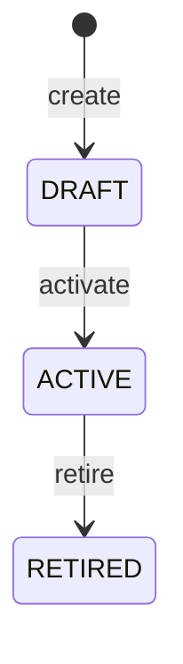

# Photo protocols

| | |
|---|---|
| Version | 1.0 |
| Status | Layer 0 baseline, 2026-09-28 |
| Authority | Production Bible §6.1–6.5 (photo sessions, standard protocols, capture workflow, live guidance, ghost alignment), §13.4 (patient photo upload), §17.1 (admin module "Photography protocols"), §24.2 (photo capture overlays), §30. ADR-0005 (intuitive controls), ADR-0008. |
| Normative sources | [`TECHNICAL_SPECIFICATION.md`](TECHNICAL_SPECIFICATION.md) §5.2 (Photography & media), §6.3 (Photography), §6.6.2, §6.6.6 (live capture guidance codes), §4.4 (protocol permissions); [`schema.prisma`](technical-spec/schema.prisma) `PhotographyProtocol`, `PhotographyProtocolView`, `PatientPhoto`; [`DESIGN_SYSTEM.md`](DESIGN_SYSTEM.md) §2 (C14) and §3 |

This document defines the standardized photography that makes before/after comparisons consistent: the standard protocols and their views, how administrators configure protocols, the live guidance vocabulary, the quality checks, and the ghost overlay with its position-match score. The upload, storage and permission pipeline that follows capture is in [PHOTO_ARCHITECTURE.md](PHOTO_ARCHITECTURE.md).

---

## 1. Scope

| Capability | Layer | Source |
|---|---|---|
| Standard protocols seeded per organization; admin protocol editor | 2 | Roadmap M2.3; spec §6.3 |
| Guided capture on iOS: camera, pose, framing, blur and lighting checks, guidance codes, ghost overlay, position-match score | 2 | Roadmap M2.5 |
| Patient-side capture for requested photos, with client guidance where available | 5 | [B §13.4]; M5.8 |

Rule for this document: **no protocol, view or guidance code exists beyond those the Bible lists.** Practices may author custom protocols [B §6.2]; those are data entered by administrators, not product defaults.

---

## 2. Standard protocols

The Bible's three standard protocols [B §6.2], exactly as listed. Each is seeded into every organization (spec §5.2), starting in Layer 2 (spec §6.3, organizations row).

| Protocol | `bodyRegion` | Views, in Bible order |
|---|---|---|
| Face | `FACE` | Front; Left 45; Right 45; Left profile; Right profile |
| Breast | `BREAST` | Front; Left oblique; Right oblique; Left lateral; Right lateral |
| Abdomen/body contour | `ABDOMEN_BODY` | Front; Left 45; Right 45; Left profile; Right profile; Back |

View keys are stable `UPPER_SNAKE` strings, unique within a protocol (`@@unique([protocolId, viewKey])`). The schema documents the style with the examples `FRONT`, `LEFT_45`, `RIGHT_45`, `LEFT_PROFILE` and `BACK`, and the upload DTO uses `LEFT_45` (spec §6.6.2). The exact keys for the other views are fixed by the Layer 2 seed.

Not specified by the Bible, and decided at Layer 2 kickoff (M2.3):

- which views of the standard protocols are **required** and which are **optional** (the Bible says each protocol marks this, but gives no values for its own examples);
- default `captureInstructions` and `poseTarget` tolerances for the standard views;
- the status in which the standard protocols are seeded, and how organizations created in Layer 1 receive them.

Bible §6.2 titles the table "Standard protocol examples". The spec treats the three as the seeded standard set; that reading is recorded here and not extended.

---

## 3. Protocol model and lifecycle

Excerpt; the normative definition is `schema.prisma`.

| Field | Meaning |
|---|---|
| `PhotographyProtocol.organizationId`, `practiceId?` | Always tenant-owned; optionally limited to one practice |
| `name`, `bodyRegion`, `description` | `bodyRegion` is `FACE`, `BREAST`, `ABDOMEN_BODY` or `OTHER` |
| `status` | `DRAFT`, `ACTIVE`, `RETIRED` |
| `supersedesId` | The protocol this one replaces (at most one successor per protocol) |
| `version` | Optimistic concurrency; edits require `If-Match` (spec §6.1.7) |
| `PhotographyProtocolView.viewKey`, `name`, `sortOrder` | Stable key, display name, capture order |
| `isRequired` | Required or optional view [B §6.2] |
| `captureInstructions` | Text shown to the photographer or patient [B §6.2] |
| `poseTarget` | Target pose and framing tolerances used by live guidance (flexible JSON) |

- The spec has no transition table for protocols (spec §5.4.10 lists none). The diagram is this document's reading of the `/activate` and `/retire` endpoints (spec §6.3); whether a `DRAFT` protocol may be retired or deleted is not specified (open item).
- A protocol is **frozen once `ACTIVE`**. Changing it means creating a new protocol that supersedes it (spec §5.2). This is enforced by the API; `constraints.sql` has no trigger for it (open item).
- Because active protocols never change, every photo keeps an exact link to the view definition it was captured under (`PatientPhoto.protocolViewId` and `viewKey`), and before/after pairs can compare like with like.
- A photo session always names its protocol [B §6.1]; a `PhotoRequest` must name one too (spec §5.2).

---

## 4. Protocol configuration by administrators

Administrators manage protocols in the admin web module "Photography protocols" [B §17.1].

| Action | Endpoint (spec §6.3) | Permission | Audit |
|---|---|---|---|
| List and read protocols and views | `GET /photography-protocols`, `GET …/{id}` | `photo.capture` or `photo.view` | — |
| Create a custom protocol (DRAFT) | `POST /photography-protocols` | `practice.manage` | `CONFIGURATION_CHANGED*` |
| Edit a DRAFT protocol and its views | `PATCH …/{id}` with `If-Match` | `practice.manage` | `CONFIGURATION_CHANGED*` |
| Activate | `POST …/{id}/activate` | `practice.manage` | `CONFIGURATION_CHANGED*` |
| Retire | `POST …/{id}/retire` | `practice.manage` | `CONFIGURATION_CHANGED*` |

The mapping of protocol management to `practice.manage` is a spec proposal adopted under UD-16. In the default matrix (spec §4.5, UD-17), ORGANIZATION_ADMIN holds `practice.manage` organization-wide and PRACTICE_ADMIN within its practice scope. A custom protocol may define any views the practice needs; each view is marked required or optional and may carry capture instructions [B §6.2]. The server validates every field; the admin UI hiding a control is never the security boundary [B §3.3].

---

## 5. Capture workflow

Bible §6.3, with where each step runs:

| # | Step [B §6.3] | Where |
|---|---|---|
| 1 | Choose patient and protocol | Provider app; session created through the API or queued offline |
| 2 | Choose a required view | App; each view is marked required or optional [B §6.2], and remaining required views are stated in words, for example "1 required view left" (DESIGN_SYSTEM.md C9) |
| 3 | Open camera | App (AVFoundation) |
| 4 | Evaluate orientation, pose, framing, distance, tilt, lighting | On device (Vision, CoreML; spec §2.2) |
| 5 | Show live correction guidance | On device, using the codes in section 6 |
| 6 | Capture | App; the shutter never moves (DESIGN_SYSTEM.md C3) |
| 7 | Post-capture quality checks | On device; results stored in `PatientPhoto.qualityChecks` |
| 8 | Accept or retake | Photographer decides |
| 9 | Encrypt and upload the immutable original | [PHOTO_ARCHITECTURE.md](PHOTO_ARCHITECTURE.md) section 5 |
| 10 | Generate derivatives; record metadata and checksum; `PHOTO_CAPTURED` | Server |
| 11 | Next view | App |

Steps 1–8 work offline [B §23.1].

---

## 6. Live guidance vocabulary and codes

The Bible's vocabulary [B §6.4] and its codes (spec §6.6.6). The provider app's on-device guidance and the patient app's upload guidance emit these codes, and the UI turns them into plain text.

| Bible phrase | Codes | Corrects (Bible §6.3 check; this document's reading) |
|---|---|---|
| MOVE LEFT / RIGHT | `MOVE_LEFT`, `MOVE_RIGHT` | Framing |
| MOVE CLOSER / BACK | `MOVE_CLOSER`, `MOVE_BACK` | Distance |
| CAMERA TOO HIGH / LOW | `CAMERA_TOO_HIGH`, `CAMERA_TOO_LOW` | Framing (camera height) |
| LEVEL CAMERA | `LEVEL_CAMERA` | Tilt |
| PATIENT TURN LEFT / RIGHT | `PATIENT_TURN_LEFT`, `PATIENT_TURN_RIGHT` | Pose and orientation |
| RAISE / LOWER CHIN | `RAISE_CHIN`, `LOWER_CHIN` | Pose |
| LIGHTING TOO DARK | `LIGHTING_TOO_DARK` | Lighting |
| RETAKE - MOTION BLUR | `RETAKE_MOTION_BLUR` | Sharpness, found after capture |

Rules:

- **Exactly 13 codes.** Spec §6.6.6 publishes them as shared enumerations in `packages/api-contracts`. They are not in the package yet (Layer 0 holds only the shared primitives, [API_CONTRACTS.md](API_CONTRACTS.md) §3) and join it with the first contract that uses them. The traceability check already confirms all 13 in the spec (spec §11.2). A condition none of them expresses has no code; adding one changes a Bible vocabulary and needs an ADR and a `CHANGELOG.md` entry first [B §0].
- The same codes appear in `PatientPhoto.qualityChecks` and in `INPUT_QUALITY_INSUFFICIENT.details.reasons` when AI input quality fails (spec §6.2, §6.6.6), so staff see one vocabulary everywhere.
- **One instruction at a time, in words** (DESIGN_SYSTEM.md C14): for example "Raise chin slightly", with a framing oval sized to the face and quality chips for lighting, distance and pose. On iPhone the chips are hidden and the guidance line stays (DESIGN_SYSTEM.md §4).
- Guidance text is US English (ADR-0006) and externalized so it can be localized later (spec §10.1).
- Live guidance runs on device with Vision and CoreML (spec §2.2).

---

## 7. Quality checks

| Check | When | Recorded in | Source |
|---|---|---|---|
| Orientation, pose, framing, distance, tilt, lighting | Live, before capture | Not stored; drives guidance | [B §6.3] |
| Post-capture quality (for example motion blur) | After capture | `PatientPhoto.qualityChecks` (codes and results, no free text) | [B §6.3]; `schema.prisma` |
| Device, lens, exposure and pose estimates | At capture | `PatientPhoto.captureMetadata` (for example `yawDeg`, `pitchDeg`) | spec §6.6.2 |
| Patient upload guidance | Patient app, where available | Same fields | [B §13.4] |
| Staff intake review of patient uploads | Server-side, after quarantine | `reviewedById`, `reviewedAt`, `reviewNote` | spec §3.4 flow C |

Quality checks inform the photographer, who accepts or retakes [B §6.3]. Numeric thresholds are not specified; per-view tolerances live in `PhotographyProtocolView.poseTarget` and are set at Layer 2 (M2.5). Whether any check can block acceptance of a photo is also not specified.

---

## 8. Ghost alignment and the position-match score

A previous standardized image may be overlaid on the live camera with adjustable opacity [B §6.5]. Landmark and pose comparison may produce a photographic position-match score and guidance.

| Aspect | Rule | Source |
|---|---|---|
| Overlay | Optional, opacity adjustable, shown over the live camera | [B §6.5]; DESIGN_SYSTEM.md C14 |
| Score | `PatientPhoto.positionMatchScore`, decimal 0..1 (`Decimal(5,4)`); also sent in the upload intent's `captureMetadata` | `schema.prisma`; spec §6.6.2 |
| Required label | "Photographic position match, not a medical measurement." | DESIGN_SYSTEM.md §3 |
| Forbidden labels | "Medical accuracy" [B §6.5]; presenting the score as a medical measurement (DESIGN_SYSTEM.md §2 C14) | [B §6.5] |
| Meaning | Describes how closely the camera and patient position match the reference photo. It says nothing about anatomy, treatment or outcome. | [B §6.5]; spec §6.6.6 |
| Not an outcome measure | Measured outcome comparisons are a separate Layer 9 feature (`OutcomeMeasurement`) | spec §5.2 |

Accessibility: the score is shown with a word and not by colour alone (DESIGN_SYSTEM.md §5).

Not specified, and decided at Layer 2 (M2.5): which previous image the ghost overlay uses (for example, which earlier photo of the same view key), and how the overlay behaves when that image is not in the offline cache.

---

## 9. Patient-requested photos

In Layer 5 a provider can ask the patient for photos (spec §3.4 flow C):

1. Staff create a `PhotoRequest` with a protocol and the requested view keys (`POST /patients/{pid}/photo-requests`, `photo.capture`).
2. The patient app shows the protocol's views and capture instructions [B §13.4].
3. The patient captures with client guidance where available, using the same codes.
4. The upload lands in quarantine, is validated, then waits for staff review ([PHOTO_ARCHITECTURE.md](PHOTO_ARCHITECTURE.md) section 12).

The request moves `OPEN → SUBMITTED → COMPLETED`, or `OPEN → CANCELLED | EXPIRED` (spec §5.4.10).

---

## 10. Verification

| Check | How |
|---|---|
| The seeded standard protocols equal Bible §6.2 (protocols, views, order) | Layer 2 seed test against the table in section 2 |
| The guidance enumeration has exactly the 13 codes | `check_traceability.py` (13/13 today) plus an `api-contracts` unit test |
| An ACTIVE protocol cannot be edited; changes supersede | API integration test (application-enforced) |
| Protocol management needs `practice.manage`; reads need `photo.capture` or `photo.view` | Generated authorization matrix tests (spec §7.5) |
| Protocols of another organization are invisible | Generated cross-tenant tests |
| The score label reads "Photographic position match, not a medical measurement." and "medical accuracy" appears nowhere | iOS UI tests on the capture screen; copy review |
| Guidance shows one instruction at a time, with a visible alternative to every gesture | iOS UI tests; DESIGN_SYSTEM.md §11 checklist |

---

## 11. Open items

| Item | Decided at |
|---|---|
| Required/optional flags, instructions and pose tolerances for the standard views; exact view keys | Layer 2 kickoff (M2.3) |
| Seeding: initial status of standard protocols; how organizations created in Layer 1 receive them (spec §6.3 and §11.3 #16 move protocol seeding to Layer 2, and the `schema.prisma` comment now says the same, ADR-0017) | Layer 2 kickoff (M2.3) |
| Protocol freeze is application-enforced only; add a database trigger or accept | Layer 2 kickoff |
| Whether activating a superseding protocol retires its predecessor automatically | Layer 2 (M2.3) |
| Protocol status transitions beyond `/activate` and `/retire` (for example retiring or discarding a `DRAFT`); no spec §5.4 table exists | Layer 2 (M2.3) |
| Whether `POST …/photo-sessions/{sid}/complete` is refused while required views are missing | Layer 2 (M2.4) |
| Quality thresholds; whether any check blocks acceptance | Layer 2 (M2.5) |
| Ghost overlay reference-image selection and offline behaviour | Layer 2 (M2.5) |
