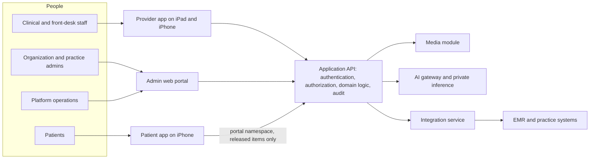

# Product Requirements

| | |
|---|---|
| Version | 1.0 |
| Status | Layer 0 baseline, 2026-09-28 |
| Authority | Production Bible §0–§18, §23, §27, §29, §30, §32, §34, §36. ADR-0001 (tenancy boundary), ADR-0006 (United States only), ADR-0008 (delegated proposals) |
| Normative sources | [`TECHNICAL_SPECIFICATION.md`](TECHNICAL_SPECIFICATION.md) spec §1 (§1.1–§1.6), spec §5.8 and spec §9.1 (layer mapping), spec §10.2 (decision register). Catalogs stay in the spec: entities (spec §5.2), state machines (spec §5.4), permissions (spec §4.4), endpoints (spec §6.3, spec §6.5), audit events (spec §7.3), offline contract (spec §8) |

This document states what Aestara must do and must never do, as a register of traceable requirements. Each requirement has a stable ID, its Bible source and the build layer that delivers it. It organizes the Bible; it does not replace the Bible, the spec's catalogs or [`ACCEPTANCE_CRITERIA.md`](ACCEPTANCE_CRITERIA.md).

---

## 1. How to use this document

| Reader | Use |
|---|---|
| Feature-prompt author (Bible §33) | Cite the `PR-*` IDs a micro-prompt implements in its PURPOSE and ACCEPTANCE CRITERIA sections. |
| Engineer | Follow the "Spec detail" pointer to the normative contract. Never implement from the one-line summary alone. |
| Reviewer | At each layer's acceptance review, every `PR-*` row assigned to that layer is PASS, FAIL or DEFERRED BY SPECIFICATION [B §31]. |
| Owner | Change a requirement only through change control (§9). |

**ID rules.** IDs have the form `PR-<DOMAIN>-nn`. An ID is never reused or renumbered. A withdrawn requirement keeps its row, marked "Withdrawn" with the ADR that withdrew it.

**Layer column.** The layer that first delivers the requirement, from spec §1.6, spec §5.8 and spec §9.1. "L2, L3" means the requirement is split: the first layer delivers the core and the second completes it (for example, a domain built in L3 whose patient-facing release arrives with the patient app in L5).

---

## 2. Product vision and boundaries

Aestara is a **visual consultation and patient-engagement platform for aesthetic medicine practices** [B §1]. It unifies patient records, standardized clinical photography, consultation workflows, education, treatment planning, consents, before/after comparison, secure communication, telehealth and clinician-controlled AI aesthetic visualizations (spec §1.1).

| Boundary | Statement | Source |
|---|---|---|
| Who it serves | Aesthetic medicine practices, grouped into customer organizations, on one shared multi-tenant SaaS deployment | [B §1.1], spec §10.1 |
| Where | United States only: HIPAA posture, US English, USD, US time zones, NPI; AWS us-east-1, multi-AZ | ADR-0006 |
| Clinical role of AI | Clinician-controlled visualization with provider review and explicit release. Never diagnosis, dosing, treatment recommendation or a guaranteed outcome | [B §1.2], [B §21.4] |
| Commercial role | Estimates and references to external financing, payment and invoice systems. Not a ledger, claims engine or payment processor | [B §11.3] |
| Record-keeping role | A consultation and engagement system that integrates with EMRs through adapters. Not a replacement EHR | [B §1.2], [B §18.1] |
| Data boundary | Patient data may be shared across the practices of one organization and never across organizations | ADR-0001 |
| Compliance | Compliance-ready controls. Software alone does not make a customer compliant | [B §21.3] |

The core clinical flow (patient → consultation → photos → before/after and visualization → plans → consents → released items in the patient app) is drawn in spec §1.3 and detailed in [`WORKFLOWS.md`](WORKFLOWS.md).

---

## 3. Users and surfaces

| Surface | Primary users | Responsibility | Source | First delivered |
|---|---|---|---|---|
| Provider iOS/iPadOS app (iPad landscape first, iPhone supported) | Surgeons/physicians, nurses/injectors/aestheticians, photographers, consultants, front desk | Patient care workflow, capture, consultation, planning, consent management, secure communication | [B §2], [B §24] | L1 shell |
| Patient iOS app | Patients | Released consultations, simulations, documents, instructions, appointments, messages, telehealth | [B §2], [B §13] | L5 |
| Admin web portal | Organization and practice administrators; platform operations | Users, roles, practices, locations, content, integrations, audit, configuration, support | [B §2], [B §17] | L1 API; web shell confirmed at L1 kickoff (roadmap M1.11) |
| Application API | All first-party clients | Authentication, authorization, domain logic, versioned contracts, audit | [B §2] | L1 |
| Media module | Via the API only | Upload, derivatives, signed access, retention, checksum, storage isolation | [B §2], [B §25.2] | L2 |
| AI platform | Provider workflow through an internal API | Quality checks, landmarks, segmentation, simulation, validation, provenance | [B §2] | L7 (infrastructure), L8 (simulation) |
| Integration service | Backend only | FHIR/HL7/vendor adapters, sync status, mapping, retries | [B §2], [B §18] | L10 |

Roles, scopes and what each role may do are explained in [`USER_ROLES_AND_PERMISSIONS.md`](USER_ROLES_AND_PERMISSIONS.md).

---

## 4. Success criteria [B §1]

Bible §1 is titled "Product Vision, Boundaries & Success Criteria". Its measurable content is the seven product goals [B §1.1], proven through the layer exit conditions [B §29] and acceptance criteria [B §32], [B §34], [B §36]. The Bible sets no quantitative business metrics (adoption, time saved, conversion). None are invented here; if the owner wants product KPIs, they need a new decision (§10).

| # | Product goal [B §1.1] | Success means | Proven by | Layers |
|---|---|---|---|---|
| S1 | One consultation workspace from intake through follow-up | Every Bible §5.1 step is reachable from one consultation workspace, and the patient profile shows all twelve Bible §4.3 tabs | L3 exit "consultation with standardized imagery is functional"; spec §5.4.1 completion preconditions | L1, L3 |
| S2 | Standardized clinical photography for consistent, reproducible before/after | A standard protocol session runs end to end with live guidance; before/after compares two photos of the same patient without touching originals | L2 exit; [B §34.1] #12–21 | L2, L3 |
| S3 | Clinician-controlled simulations, never represented as guaranteed | Only approved, explicitly released simulations reach patients, always with the disclaimer | [B §34.2] #22–31 | L7, L8 |
| S4 | Patient engagement through an app containing only released materials | A patient sees only their own records, and only released or assigned items | L5 exit; portal visibility tests (spec §7.5) | L5 |
| S5 | Traceable, versioned consent and media-permission workflows | Consents produce an immutable signed snapshot with a hash; every permission change is a new audited version | L4 exit; [B §36] "Consents" row; DB behavior suite | L2, L4 |
| S6 | Future EMR connectivity without vendor coupling | Vendor specifics live only inside adapters; selected partner integrations are stable | L10 exit | L10 |
| S7 | Commercial SaaS that grows from a pilot to thousands of practices | Tenant isolation is proven automatically; the architecture follows the Bible §25.4 scale tiers; the RLS performance gate passes | L1 exit "cross-tenant tests pass"; ADR-0004 gate; load tests (spec §7.6) | L1 onward |

---

## 5. Explicit non-goals

| Non-goal | Source | What it means for engineering |
|---|---|---|
| No automatic diagnosis | [B §1.2], [B §21.4] | No feature labels, scores or classifies a patient's condition |
| No prescribing of medication, product, dosage, injection depth or surgical technique | [B §1.2], [B §9.6] | Model parameter allow-lists contain no such fields; DTOs have none (spec §6.6.3) |
| No visualization presented as an exact prediction or guaranteed result | [B §1.2], [B §9] | Product vocabulary is "simulation" or "visualization"; the disclaimer is a required DTO field (spec §6.6.4) |
| No replacement of billing, claims, e-prescribing or an enterprise EHR | [B §1.2], [B §11.3] | Estimates and invoice references only; no payment processor or ledger (spec §2.4) |
| No patient data sharing across organizations | [B §1.2] as interpreted by ADR-0001 | Sharing inside one organization is allowed; across organizations it is impossible by construction |
| No 3D digital patient | [B §1.2], [B §29] | Layer 11 is a separate, approved expansion only |
| No call recording | [B §16.2] | `TelehealthSession` has no recording field by design |
| No impersonation or break-glass support tooling | [B §17.1], spec §1.5 | Not built unless separately specified |
| No cross-organization case datasets | [B §10] | Needs a separately approved governance model |
| No CSV/SFTP import adapter | [B §18.1] | Only if approved |
| No training on patient media in the initial build | [B §7.3], spec §7.7 | Dataset and governance entities are deferred to Layer 7 |
| No patient video capture | spec §10.1 | Clinical media are photographs; education content may be video |
| No third-party generative-AI API receiving patient images | spec §2.4 | Only with a separately approved, BAA-covered decision (UD-04) |
| No clinical decision-support claims | [B §21.4] | Intended-use and regulatory review before claims expand |
| No deployment outside the United States | ADR-0006 | Locale and region stay configurable in code only |

---

## 6. Requirements register

Columns: **ID** · **Requirement** (one line; the Bible and spec hold the detail) · **Bible** · **Layer** · **Spec detail**.

### 6.1 Access, identity and tenancy (ACCESS)

| ID | Requirement | Bible | Layer | Spec detail |
|---|---|---|---|---|
| PR-ACCESS-01 | Tenancy is platform → organization → practice → location, and every tenant-owned record carries organization ownership | [B §3.1] | L1 | spec §4.1 |
| PR-ACCESS-02 | Authorization is decided server-side; client-supplied organization IDs are never proof of entitlement; UI hiding is never a security boundary | [B §3.1], [B §3.3] | L1 | spec §3.3, spec §4.6 |
| PR-ACCESS-03 | The ten Bible roles exist and grant the 41 Bible permission keys | [B §3.2], [B §3.3] | L1 | spec §4.3–§4.5 |
| PR-ACCESS-04 | Patient data is readable across the practices of one organization and never across organizations; practice/location scope limits writes to practice-owned records | [B §1.2] (ADR-0001) | L1 | spec §4.6 |
| PR-ACCESS-05 | Error responses never allow patient enumeration or reveal cross-tenant existence | [B §20.3], [B §20.4] | L1 | spec §6.1.10 |
| PR-ACCESS-06 | Authentication is OIDC/OAuth-compatible with short-lived access tokens, server-side session and device revocation, Face ID/Touch ID re-authentication, Keychain secrets and administrative MFA | [B §21.1] | L1 | spec §4.2 |
| PR-ACCESS-07 | Platform operators have no casual browsing access to patient records | [B §17.2] | L1 | spec §4.5 |

### 6.2 Patient record and intake (PATIENT)

| ID | Requirement | Bible | Layer | Spec detail |
|---|---|---|---|---|
| PR-PATIENT-01 | Staff create a patient by entering demographics, validating fields, searching for probable duplicates, confirming creation and opening the profile | [B §4.1] | L1 | spec §6.3 (Patients), spec §6.2 `DUPLICATE_PATIENT_SUSPECTED` |
| PR-PATIENT-02 | The server assigns tenant ownership; `organizationId` is never accepted from the client | [B §4.1], [B §4.2] | L1 | spec §6.6.1 |
| PR-PATIENT-03 | The patient record holds at least the Bible §4.2 fields, including status ACTIVE, INACTIVE, ARCHIVED or DECEASED where policy supports it | [B §4.2] | L1 | spec §5.2, `schema.prisma` `Patient` |
| PR-PATIENT-04 | A primary practice is optional or required according to deployment policy | [B §4.2] | L1 | spec §5.8 (OrganizationSetting) |
| PR-PATIENT-05 | Staff with `patient.read` search the organization's patients; search terms never travel in URLs | [B §32], [B §21.2] | L1 | spec §5.6, spec §6.1.10 |
| PR-PATIENT-06 | The profile shows twelve tabs: Overview, Timeline, Consultations, Photos, Before / After, AI Simulations, Treatment Plans, Procedures, Documents, Instructions, Appointments, Messages | [B §4.3] | L1 shell; each tab filled by its domain's layer | spec §6.3 |
| PR-PATIENT-07 | Opening a patient requires authentication, tenant-scope validation and `patient.read`, and writes `PATIENT_VIEWED` | [B §4.3] | L1 | spec §6.3 |
| PR-PATIENT-08 | `patient.read` unlocks demographics only; clinical tabs and timeline items need their own domain permission | [B §3.2] | L1, L3 | spec §4.4 (UD-16) |
| PR-PATIENT-09 | Staff update demographics with optimistic concurrency and archive patients; each change is audited | [B §4.2], [B §20.3], [B §22.1] | L1 | spec §6.1.7 |
| PR-PATIENT-10 | Contacts (emergency contact, guardian, caregiver) are recorded per patient | [B §19] | L1 | spec §5.2 |
| PR-PATIENT-11 | Medical history (allergies, medications, conditions, prior procedures) and aesthetic concerns are recorded and reviewable during consultation | [B §5.1], [B §19] | L3 | spec §5.2 |

### 6.3 Consultation (CONSULT)

| ID | Requirement | Bible | Layer | Spec detail |
|---|---|---|---|---|
| PR-CONSULT-01 | A consultation follows the Bible state machine; any non-final state may be canceled when policy allows | [B §5.2] | L3 | spec §5.4.1 |
| PR-CONSULT-02 | Invalid transitions are rejected server-side | [B §5.2] | L3 | spec §6.2 `INVALID_STATE_TRANSITION` |
| PR-CONSULT-03 | The workspace supports the twenty Bible §5.1 steps, from opening the patient to completing the consultation | [B §5.1] | L3; steps enabled as L2–L8 arrive | spec §5.4.1 |
| PR-CONSULT-04 | Completion is gated by the adopted preconditions (reason or concern recorded, no simulation in progress, summary generated, release decision recorded, no draft notes) | [B §5.1] | L3 | spec §5.4.1 (UD-33) |
| PR-CONSULT-05 | Notes can be drafted, including offline, and finalized; final notes are immutable and corrected by addenda | [B §5.1], [B §23.1] | L3 | spec §5.2, spec §10.2 (UD-15) |
| PR-CONSULT-06 | A consultation summary document is generated; approved patient-facing materials are released only by an explicit action | [B §5.1], [B §13.2] | L3 (summary), L5 (release) | spec §6.3 (Consultations) |
| PR-CONSULT-07 | Consultation lifecycle events are audited | [B §5.1], [B §22.1] | L3 | spec §7.3 |

### 6.4 Clinical photography (PHOTO)

| ID | Requirement | Bible | Layer | Spec detail |
|---|---|---|---|---|
| PR-PHOTO-01 | A photo session belongs to an organization, patient, protocol, capturing user and date/time, with optional consultation, procedure and location | [B §6.1] | L2 | spec §5.2 |
| PR-PHOTO-02 | Standard Face, Breast and Abdomen/body-contour protocols exist with their Bible views; practices author custom protocols with required/optional views and capture instructions | [B §6.2] | L2 | [`PHOTO_PROTOCOLS.md`](PHOTO_PROTOCOLS.md) |
| PR-PHOTO-03 | Capture follows the Bible workflow: protocol, required view, pose/framing/distance/tilt/lighting evaluation, live guidance, capture, quality checks, accept or retake, upload, derivatives, checksum, `PHOTO_CAPTURED` | [B §6.3] | L2 | spec §3.4 |
| PR-PHOTO-04 | Live guidance uses exactly the Bible vocabulary | [B §6.4] | L2 | spec §6.6.6 |
| PR-PHOTO-05 | Ghost alignment overlays a previous standardized image with adjustable opacity; any score is a photographic position match, never medical accuracy | [B §6.5] | L2 | spec §6.6.6 |
| PR-PHOTO-06 | Originals are never destructively edited; every derivative kind references its source and generation metadata | [B §6.6] | L2 (derivative kinds arrive with their layers) | spec §1.4 G2 |
| PR-PHOTO-07 | An original becomes visible only after the server verifies its size and SHA-256 checksum | [B §6.3], [B §2] | L2 | spec §6.1.9 |
| PR-PHOTO-08 | Annotations are separate vector layers, never burned into originals | [B §5.1], [B §6.6] | L3 | spec §5.2 |
| PR-PHOTO-09 | Photos are reached only through short-lived signed URLs; each view is audited; the ORIGINAL variant needs `photo.export` | [B §21.2], [B §22.1] | L2 | spec §6.1.9, spec §6.3 (Photography) |
| PR-PHOTO-10 | Photos can be tagged | [B §19] | L2 | spec §5.2 |

### 6.5 Media permissions and releases (MEDIA)

| ID | Requirement | Bible | Layer | Spec detail |
|---|---|---|---|---|
| PR-MEDIA-01 | Nine independent permission categories exist: CLINICAL_USE, PATIENT_APP, EDUCATION, WEBSITE, SOCIAL_MEDIA, PAID_ADVERTISING, RESEARCH, AI_TRAINING, INTERNAL_AI_EVALUATION | [B §7.1] | L2 | spec §5.2 |
| PR-MEDIA-02 | Each category follows the Bible permission states, and every change is a new audited version | [B §7.2] | L2 | spec §5.4.5 |
| PR-MEDIA-03 | No permission implies another; clinical use never implies website, advertising, research or AI training | [B §7.2], [B §30] | L2 | spec §1.4 G3 |
| PR-MEDIA-04 | Marketing export checks the current permission at the time of export | [B §7.3] | L2, L3 | spec §6.3 (Photography) |
| PR-MEDIA-05 | Patient-app visibility requires a PATIENT_APP permission plus provider release | [B §7.3] | L5 | spec §4.7 (UD-20) |
| PR-MEDIA-06 | AI-training pipelines ingest only assets with explicit AI_TRAINING permission and governance approval | [B §7.3] | L7 | spec §7.7 |
| PR-MEDIA-07 | Revocation prevents future use for that purpose and triggers any defined downstream compliance workflow | [B §7.3] | L2 | spec §5.4.5 |
| PR-MEDIA-08 | Every release records each permission version it relied on | [B §7.2], [B §7.3] | L2 | spec §5.2 (`MediaReleasePermission`) |

### 6.6 Before/after comparison (BA)

| ID | Requirement | Bible | Layer | Spec detail |
|---|---|---|---|---|
| PR-BA-01 | A set is created from exactly two photos of the same patient; the backend verifies same patient, authorization and a compatible view | [B §8.1], [B §34.1] | L3 | spec §6.3 (Before / after) |
| PR-BA-02 | Optional automatic registration and manual alignment, both resettable | [B §8.1], [B §8.2] | L3 | spec §5.8 (`AIJob` in L3) |
| PR-BA-03 | Side-by-side, swipe slider, cross-fade, blink, overlay, synchronized zoom and synchronized pan modes | [B §8.2] | L3 | spec §6.3 (Before / after) |
| PR-BA-04 | Export requires authorization and purpose-specific permission, creates a derivative, writes `PHOTO_EXPORTED` and leaves originals unchanged | [B §8.3] | L3 | spec §6.3 (Before / after) |
| PR-BA-05 | Invalid or unauthorized image IDs never reveal cross-tenant existence | [B §34.1] | L3 | spec §6.1.10 |

### 6.7 AI simulation (SIM)

| ID | Requirement | Bible | Layer | Spec detail |
|---|---|---|---|---|
| PR-SIM-01 | Product language is "simulation" or "visualization", never guaranteed result, exact prediction or outcome probability | [B §9] | L8 | [`AI_SIMULATION_RULES.md`](AI_SIMULATION_RULES.md) |
| PR-SIM-02 | Every patient-facing simulation carries the Bible disclaimer verbatim | [B §9.1] | L8 | spec §6.6.4 |
| PR-SIM-03 | The pipeline runs quality validation, landmarks, segmentation, identity representation, constrained transformation, outside-region identity similarity, artifact detection and output validation before provider review | [B §9.2] | L7, L8 | spec §3.4 |
| PR-SIM-04 | A simulation follows the Bible state machine | [B §9.3] | L8 | spec §5.4.2 |
| PR-SIM-05 | The provider approves, rejects or regenerates; release is a separate explicit action after approval | [B §9.2], [B §34.2] | L8 | spec §5.4.2 |
| PR-SIM-06 | Provenance is recorded for every generation (sources, region, model and version, parameters, mask when retained, output, timestamps, generating user, reviewing provider, approval and release events) | [B §9.4] | L8 | spec §5.2 |
| PR-SIM-07 | Outputs crossing artifact or identity-similarity thresholds are rejected or flagged before release | [B §9.5] | L7, L8 | spec §5.4.2 |
| PR-SIM-08 | Only the Bible §9.6 categories, each within its restrictions; no dosage, product, drug, unit, depth, needle, technique or operative-plan control | [B §9.6], [B §34.2] | L8 | spec §1.4 G6 |
| PR-SIM-09 | Every production model has immutable model/version records, validation metadata, activation status and rollback, and is never silently replaced | [B §9.7] | L7 | spec §1.4 G11 |
| PR-SIM-10 | Unsupported or poor-quality inputs fail with a safe, actionable status | [B §34.2] | L8 | spec §6.2 `INPUT_QUALITY_INSUFFICIENT` |
| PR-SIM-11 | Patients never see READY_FOR_PROVIDER_REVIEW, REJECTED or FAILED outputs | [B §13.2], [B §34.2] | L8 | spec §4.7 |
| PR-SIM-12 | All simulation lifecycle events are audited | [B §34.2] | L8 | spec §5.4.2 |

### 6.8 Similar historical cases (CASE)

| ID | Requirement | Bible | Layer | Spec detail |
|---|---|---|---|---|
| PR-CASE-01 | Providers search an authorized historical case library by procedure, view, starting visual features and approved metadata | [B §10] | L9 | spec §6.3 (Simulations) |
| PR-CASE-02 | Results are labeled "Similar Historical Cases", never "Your Predicted Result" | [B §10] | L9 | spec §6.3 (Simulations) |
| PR-CASE-03 | Only media with the required consent/permission enter the library | [B §10] | L9 | spec §10.2 (UD-10) |
| PR-CASE-04 | The system records which historical cases were shown during a consultation | [B §10] | L9 | spec §5.2 (`SimilarCaseMatch`) |
| PR-CASE-05 | The library is organization-wide and never spans organizations | [B §10] (ADR-0001) | L9 | spec §5.2 (`CaseLibraryEntry`) |

### 6.9 Treatment plans, estimates and procedures (PLAN)

| ID | Requirement | Bible | Layer | Spec detail |
|---|---|---|---|---|
| PR-PLAN-01 | A plan option carries the Bible §11.1 fields (treatment, area, provider, description, quantity, price, discount, estimated total, financing reference, notes, proposed date) | [B §11.1] | L4 | spec §5.2 |
| PR-PLAN-02 | A consultation may present Plan A, Plan B and Plan C | [B §11.1] | L4 | spec §5.2 |
| PR-PLAN-03 | A plan follows the Bible state machine | [B §11.2] | L4 (patient responses L5) | spec §5.4.3 |
| PR-PLAN-04 | Accepting a plan is never medical authorization or consent | [B §11.1] | L4 | spec §5.4.3 |
| PR-PLAN-05 | Estimates and financing/payment references only; no ledger, claims or payment processing | [B §11.3] | L4 | spec §2.4 |
| PR-PLAN-06 | Procedures are tracked from planned through scheduled and completed | [B §4.3], [B §11] | L4 | spec §5.4.10 |

### 6.10 Documents, consents, education and instructions (CONSENT, EDU, DOC)

| ID | Requirement | Bible | Layer | Spec detail |
|---|---|---|---|---|
| PR-CONSENT-01 | The consent builder offers the thirteen Bible block types | [B §12.1] | L4 | spec §6.6.6 |
| PR-CONSENT-02 | Publishing creates a new version; executed documents never change when a template is edited | [B §12.2] | L4 | spec §1.4 G9 |
| PR-CONSENT-03 | Consent runs from assignment through acknowledgments and required signatures to an immutable signed snapshot with a document hash | [B §12.3] | L4 | [`CONSENT_ARCHITECTURE.md`](CONSENT_ARCHITECTURE.md) |
| PR-CONSENT-04 | A consent follows the Bible state machine; COMPLETE may later be VOIDED or SUPERSEDED by policy | [B §12.4] | L4 | spec §5.4.4 |
| PR-CONSENT-05 | Patients sign in clinic with staff assistance (L4) and in the patient app (L5) | [B §13.3], [B §29] | L4, L5 | spec §10.2 (UD-31) |
| PR-EDU-01 | The education library holds original or licensed video, image, animation, text, PDF, procedure explanation, FAQ, pre-op and post-op content | [B §12.5], [B §0.1] | L4 | spec §5.2 |
| PR-EDU-02 | Assigned, opened, viewed, completed and acknowledged states are tracked where appropriate | [B §12.5] | L4, L5 | spec §5.4.10 |
| PR-EDU-03 | Instructions are versioned and assigned by procedure or consultation; acknowledgment is tracked separately from clinical completion | [B §12.6] | L4 | spec §6.3 (Documents) |
| PR-DOC-01 | Patient documents are versioned with an immutable file and SHA-256 per version, and reach the patient only when released | [B §12], [B §13.2] | L3, L4 (release L5) | spec §5.2 |

### 6.11 Patient app (PAPP)

| ID | Requirement | Bible | Layer | Spec detail |
|---|---|---|---|---|
| PR-PAPP-01 | Navigation: Home, My Consultation, My Simulations, My Photos, My Treatment Plans, My Procedures, My Documents, My Instructions, Appointments, Messages, Telehealth, Profile | [B §13.1] | L5 (simulations L8; appointments and telehealth L6) | spec §6.5 |
| PR-PAPP-02 | A patient sees only their own records and only content explicitly released or assigned to the patient surface; anything without an approved rule is denied | [B §13.2] | L5 | spec §4.7 |
| PR-PAPP-03 | Provider drafts and rejected or failed simulations are never exposed | [B §13.2], [B §30] | L5, L8 | spec §1.4 G4 |
| PR-PAPP-04 | Patients view released items, upload requested photos, sign consents, acknowledge instructions, view/propose appointments where enabled, message, join telehealth and manage account/session/security preferences | [B §13.3] | L5 (L6 scheduling and telehealth, L8 simulations) | spec §6.5 |
| PR-PAPP-05 | Patient photo upload goes through protocol instructions, quarantine, malware/file validation and staff review before entering the clinical record | [B §13.4] | L5 | spec §3.4 |
| PR-PAPP-06 | Patients authenticate through an invitation and account link; one login may link to several organizations, never showing data across them | [B §13], [B §29] | L5 | spec §10.2 (UD-08) |

### 6.12 Messaging and notifications (MSG)

| ID | Requirement | Bible | Layer | Spec detail |
|---|---|---|---|---|
| PR-MSG-01 | A thread belongs to an organization and patient; access needs thread membership plus the applicable permission | [B §14.1] | L5 | spec §6.3 (Messaging) |
| PR-MSG-02 | Messages carry text, approved images, documents and instruction references | [B §14.1] | L5 | spec §5.2 |
| PR-MSG-03 | A message follows the Bible states, with retry metadata on FAILED | [B §14.2] | L5 | spec §5.4.7 |
| PR-MSG-04 | Push payloads carry generic text only, never patient or clinical content | [B §14.3] | L5 | spec §7.2 |
| PR-MSG-05 | Attachments have type and size limits, malware scanning, signed short-lived download, no permanent URLs and download/view audit | [B §14.4] | L5 | spec §6.1.9 |

### 6.13 Appointments and scheduling (APPT)

| ID | Requirement | Bible | Layer | Spec detail |
|---|---|---|---|---|
| PR-APPT-01 | An appointment carries the Bible §15.1 fields, including time zone, source system and external identifier | [B §15.1] | L6 | spec §5.2 |
| PR-APPT-02 | An appointment follows the Bible state machine | [B §15.2] | L6 | spec §5.4.6 |
| PR-APPT-03 | When an external system is system of record, local appointments carry mapping and sync metadata and conflicts are surfaced, never silently overwritten | [B §15.3] | L6 (fields), L10 (sync) | spec §5.4.6 |

### 6.14 Telehealth (TELE)

| ID | Requirement | Bible | Layer | Spec detail |
|---|---|---|---|---|
| PR-TELE-01 | Waiting room, video/audio, mute, camera switch, optional screen/photo sharing, consultation context, treatment-plan review and call metadata | [B §16.1] | L6 | spec §6.3 (Appointments) |
| PR-TELE-02 | Calls are not recorded; recording needs a separate consent, retention, encryption and jurisdiction review | [B §16.2] | L6 | spec §5.2 |
| PR-TELE-03 | A telehealth session follows the Bible state machine | [B §16.3] | L6 | spec §5.4.8 |

### 6.15 Administrative web portal (ADMIN)

| ID | Requirement | Bible | Layer | Spec detail |
|---|---|---|---|---|
| PR-ADMIN-01 | Manage organizations, practices and locations | [B §17.1] | L1 | spec §6.3 (Organizations) |
| PR-ADMIN-02 | Manage users, roles, permission assignments and provider profiles | [B §17.1] | L1 | spec §6.3 (Users) |
| PR-ADMIN-03 | Audit viewer | [B §17.1] | L1 | spec §6.3 (Integrations, audit) |
| PR-ADMIN-04 | Security, session and device administration | [B §17.1] | L1 | spec §4.2 |
| PR-ADMIN-05 | Photography protocol management | [B §17.1] | L2 | spec §6.3 (Photography) |
| PR-ADMIN-06 | Feature flags and practice configuration; flags never bypass authorization | [B §17.1], [B §26] | L2 (organization settings L1) | spec §5.2 |
| PR-ADMIN-07 | Content library, consent templates and versions, treatment/procedure catalog | [B §17.1] | L4 | spec §6.3 (Consent templates) |
| PR-ADMIN-08 | AI model registry visibility and rollout controls | [B §17.1] | L7 | spec §6.3 (Integrations, audit) |
| PR-ADMIN-09 | Integrations and mapping status | [B §17.1] | L10 | [`EMR_INTEGRATIONS.md`](EMR_INTEGRATIONS.md) |
| PR-ADMIN-10 | Sensitive support access is minimal, explicit, time-bound where possible and audited; impersonation/break-glass is not built unless separately specified | [B §17.1], [B §17.2] | Not scheduled | spec §4.5 |

### 6.16 EMR and practice-system integration (INT)

| ID | Requirement | Bible | Layer | Spec detail |
|---|---|---|---|---|
| PR-INT-01 | Vendor mapping stays inside adapters behind one adapter interface | [B §18.1] | L10 | spec §6.7 |
| PR-INT-02 | Canonical resources: Patient, Practitioner, Appointment, Encounter, DocumentReference, Media, Consent, Procedure, and Observation where genuinely needed | [B §18.2] | L10 | [`EMR_INTEGRATIONS.md`](EMR_INTEGRATIONS.md) |
| PR-INT-03 | A sync run follows the Bible state machine | [B §18.3] | L10 | spec §5.4.9 |
| PR-INT-04 | External ID mapping, idempotent upserts, conflict detection, retry/backoff, dead letters, per-sync audit/status, no silent data loss, field-level provenance where practical | [B §18.4] | L10 | spec §3.4 |

### 6.17 Offline mode (OFFLINE)

| ID | Requirement | Bible | Layer | Spec detail |
|---|---|---|---|---|
| PR-OFFLINE-01 | Offline, the provider app can view explicitly cached recent patients, capture photos, draft notes, annotate cached photos and queue uploads/mutations | [B §23.1] | L2 (cache, capture, queue), L3 (notes, annotations) | spec §8 |
| PR-OFFLINE-02 | Server AI generation, EMR sync, operations needing real-time authorization and server-dependent finalization are unavailable offline | [B §23.2] | L2 onward | spec §8 |
| PR-OFFLINE-03 | All cached sensitive data is encrypted | [B §23.3] | L1 (Keychain), L2 (store) | spec §7.1 |
| PR-OFFLINE-04 | Queued operations use deterministic IDs and idempotency and never duplicate signatures, records or AI jobs | [B §23.3] | L2 | spec §6.1.8 |
| PR-OFFLINE-05 | Edit conflicts are surfaced explicitly; clinical and consent data is never resolved by newest timestamp | [B §23.3] | L2, L3 | spec §8 |
| PR-OFFLINE-06 | Local media is purged per cache policy after secure upload and verification | [B §23.3] | L2 | spec §10.2 (UD-25) |
| PR-OFFLINE-07 | Views made offline are still audited and replayed on reconnect | [B §4.3], [B §22.1] | L2 | spec §8 |

### 6.18 Audit and data lifecycle (AUDIT, DATA)

| ID | Requirement | Bible | Layer | Spec detail |
|---|---|---|---|---|
| PR-AUDIT-01 | The Bible minimum audit events are written with actor, organization, resource, action, time, request ID and device/session metadata, without clinical content | [B §22.1], [B §22.2] | L1 onward | spec §7.3 |
| PR-AUDIT-02 | Audit is immutable and tamper-resistant | [B §21.2] | L1 | spec §7.3 |
| PR-DATA-01 | Retention is policy-driven and configurable; no universal period is hard-coded | [B §22.3] | L2 | spec §5.7 |
| PR-DATA-02 | Patient export runs as an asynchronous job with visible status; generation and download are audited | [B §22.4] | L4 | spec §6.3 (Integrations, audit) |

---

## 7. Non-negotiable guardrails (spec §1.4)

These hold in every layer. Each is enforced in at least two places; the enforcement column lives in spec §1.4 and is not repeated here.

| # | Guardrail | Bible | Expanded in |
|---|---|---|---|
| G1 | Tenancy is enforced server-side; client-supplied organization IDs are never proof of entitlement | [B §3.1] | [`AUTHORIZATION_RBAC.md`](AUTHORIZATION_RBAC.md) |
| G2 | Original clinical photos are never destructively edited | [B §6.6] | [`PHOTO_ARCHITECTURE.md`](PHOTO_ARCHITECTURE.md) |
| G3 | No permission implies another; clinical consent never implies marketing, research or AI training | [B §7.1], [B §7.2] | [`CONSENT_ARCHITECTURE.md`](CONSENT_ARCHITECTURE.md), [`PHOTO_ARCHITECTURE.md`](PHOTO_ARCHITECTURE.md) |
| G4 | Provider drafts and rejected/failed simulations never reach patients | [B §13.2], [B §34.2] | [`AUTHORIZATION_RBAC.md`](AUTHORIZATION_RBAC.md) |
| G5 | Simulations are never described as guaranteed or exact outcomes | [B §9] | [`AI_SIMULATION_RULES.md`](AI_SIMULATION_RULES.md) |
| G6 | No automatic dosing, diagnosis, drug/product or technique recommendation | [B §1.2], [B §9.6], [B §21.4] | [`AI_SIMULATION_RULES.md`](AI_SIMULATION_RULES.md) |
| G7 | No PHI in logs, analytics, crash reports, URLs or push payloads | [B §14.3], [B §21.2] | [`SECURITY_REQUIREMENTS.md`](SECURITY_REQUIREMENTS.md) |
| G8 | Explicit state machines instead of boolean clusters | [B §19.1] | [`WORKFLOWS.md`](WORKFLOWS.md) |
| G9 | Consents are versioned; executed documents never change | [B §12.2] | [`CONSENT_ARCHITECTURE.md`](CONSENT_ARCHITECTURE.md) |
| G10 | Audit is immutable and tamper-resistant | [B §21.2], [B §22] | [`SECURITY_REQUIREMENTS.md`](SECURITY_REQUIREMENTS.md) |
| G11 | A production AI model is never silently replaced | [B §9.7] | [`AI_ARCHITECTURE.md`](AI_ARCHITECTURE.md) |
| G12 | Implement only the authorized layer, then stop | [B §0.1], [B §30] | [`DEVELOPMENT_ROADMAP.md`](DEVELOPMENT_ROADMAP.md) |

---

## 8. Where acceptance criteria live

Requirements say *what*; acceptance criteria say *how we prove it*. They live in these places, in this order of authority.

| Source | What it holds | Applies to |
|---|---|---|
| [B §0.2] | The five questions every feature answers (what, who, data, states, proof) | Every feature |
| [B §27.2] | The eleven-point definition of done | Every micro-prompt |
| [B §29] (spec §1.6) | One exit condition per layer | Each layer |
| [B §32] | Layer 1 acceptance criteria 1–15 | Layer 1 |
| [B §34.1], [B §34.2] | Representative criteria #12–31 for before/after and AI simulation. The Bible numbers them from 12; keep its numbers when citing | Layers 3 and 8 |
| [B §36] | Production readiness checklist | Before production |
| spec §9.1 | Must-pass tests per layer | Each layer |
| [`ACCEPTANCE_CRITERIA.md`](ACCEPTANCE_CRITERIA.md) | The consolidated, numbered criteria per layer, traced to the `PR-*` IDs above | Each layer's acceptance review |
| Feature prompts [B §33] | Numbered, objectively testable criteria for one micro-prompt | One micro-prompt |
| [`TESTING_STRATEGY.md`](TESTING_STRATEGY.md) | Which test level proves each kind of criterion | All |

Every layer ends with a PASS / FAIL / DEFERRED BY SPECIFICATION table and a stop [B §30], [B §31].

---

## 9. Changing a requirement

1. Any change to a locked workflow, state machine, permission or data contract is documented **before** implementation [B §0].
2. Write an ADR in [`ARCHITECTURE_DECISIONS.md`](ARCHITECTURE_DECISIONS.md) and a [`CHANGELOG.md`](CHANGELOG.md) entry; update the spec section that is the normative home of the change.
3. Update the affected rows here: change the text, or mark the row "Withdrawn" with the ADR number. Never renumber.
4. A requirement the Bible states cannot be removed by an ADR alone; the Bible wins until the owner revises it [B §0].

---

## 10. Open items

| Item | Status | Confirmed at |
|---|---|---|
| Quantitative product success metrics | Not specified by the Bible; none adopted | Owner decision if wanted |
| Bible §10 says "the practice's" case library; ADR-0001 makes the library organization-wide | ADR-0001 governs as the owner's interpretation; recorded as a conflict for the owner to confirm | L9 kickoff (with UD-10) |
| Admin web shell in Layer 1 (Bible §32 names only the iOS shell) | Proposed in roadmap M1.11 | L1 kickoff |
| UD-15 final notes; UD-28 consultation transitions; UD-33 completion preconditions | Adopted baseline (spec §10.2) | L3 kickoff |
| UD-11 estimate vs quote; UD-14 in-clinic plan acceptance; UD-23 pre-completion void and minors; UD-31 staff-assisted signing | Adopted baseline | L4 kickoff |
| UD-08 patient identity across organizations; UD-20 PATIENT_APP grant for own media; UD-30 portal visibility of procedures, appointments and telehealth | Adopted baseline | L5 kickoff |
| UD-05 telehealth vendor | Adopted baseline | L6 kickoff |
| UD-04 inference hosting | Adopted baseline | L7 kickoff |
| UD-32 media grant for simulation sources; UD-29 simulation transitions | Adopted baseline | L8 kickoff |
| UD-10 case-library permission and de-identification | Adopted baseline | L9 kickoff |
| UD-25 offline cache policy | Adopted baseline | L2 kickoff |
