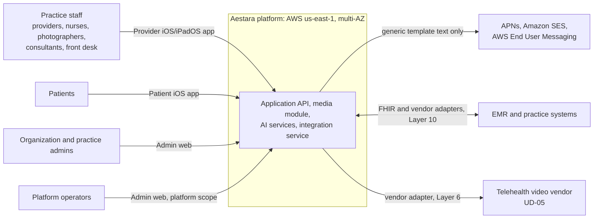
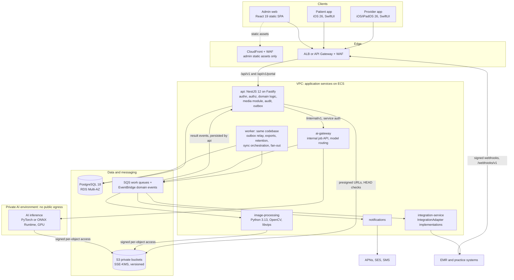
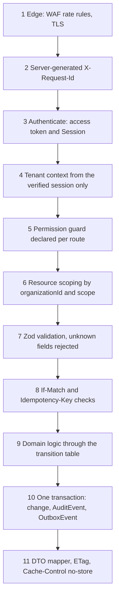
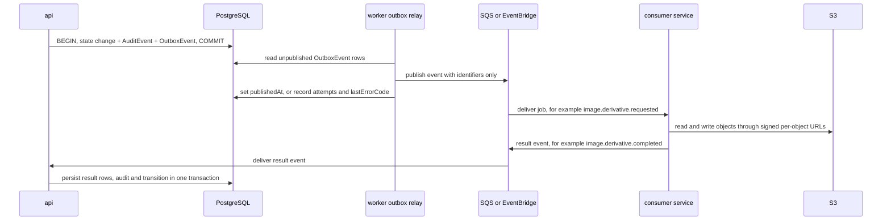

# System Architecture

| | |
|---|---|
| Version | 1.0 |
| Status | Layer 0 baseline, 2026-09-28 |
| Authority | Production Bible §2, §3.1, §20.3, §21, §25, §26, §31 ("Architecture requirements"). ADR-0001 (tenancy boundary), ADR-0002 (identity), ADR-0003 (admin SPA), ADR-0004 (RLS), ADR-0006 (US only), ADR-0008 (delegated proposals) |
| Normative sources | Technical Specification §1 (product), §2 (tech stack), §3.1 (services), §3.3 (request pipeline), §3.4 (key flows), §3.5 (tenant isolation), §6.7 (internal contracts), §7 (security); `technical-spec/schema.prisma` |

This document shows how Aestara is put together: the people and systems it serves, the deployable containers, who owns which data, how a request and an event travel, and how tenant isolation is layered. It organizes and diagrams the locked specification. If this document and the spec disagree, the spec wins and this document is corrected.

---

## 1. Scope and reading guide

| Topic | Where it lives |
|---|---|
| Cloud topology, networks, environments, observability | [INFRASTRUCTURE.md](INFRASTRUCTURE.md) |
| Release process, migrations in production, runbooks | [DEPLOYMENT.md](DEPLOYMENT.md) |
| Folder layout of the monorepo | [REPOSITORY_STRUCTURE.md](REPOSITORY_STRUCTURE.md) |
| Tables, constraints, RLS, migrations | [DATABASE_SCHEMA.md](DATABASE_SCHEMA.md) |
| REST conventions and endpoint groups | [API_CONTRACTS.md](API_CONTRACTS.md) |
| Sign-in, tokens, sessions | [AUTHENTICATION_ARCHITECTURE.md](AUTHENTICATION_ARCHITECTURE.md) |
| Roles, permissions, scope evaluation | [AUTHORIZATION_RBAC.md](AUTHORIZATION_RBAC.md) |
| Photos, storage, derivatives | [PHOTO_ARCHITECTURE.md](PHOTO_ARCHITECTURE.md) |
| AI gateway, registry, inference | [AI_ARCHITECTURE.md](AI_ARCHITECTURE.md) |
| EMR adapters and sync | [EMR_INTEGRATIONS.md](EMR_INTEGRATIONS.md) |
| iOS modules and offline store | [IOS_ARCHITECTURE.md](IOS_ARCHITECTURE.md) |
| Security controls and threats | [SECURITY_REQUIREMENTS.md](SECURITY_REQUIREMENTS.md), [THREAT_MODEL.md](THREAT_MODEL.md) |
| End-to-end business workflows | [WORKFLOWS.md](WORKFLOWS.md) |

The static design prototype in `apps/design-prototype` is not part of this architecture. It has no backend, is never deployed as the product and is excluded from production builds (ADR-0009).

---

## 2. System context

Aestara is one shared multi-tenant deployment (spec §10.1) in AWS us-east-1 across multiple Availability Zones (D-06). Four groups of people use it through three first-party clients [B §2]. It depends on a small set of external services, each of which must be HIPAA-eligible or covered by a BAA before it handles PHI [B §21.3, §25.3].

| External dependency | Used for | Constraint | Source |
|---|---|---|---|
| APNs, Amazon SES, AWS End User Messaging (SMS) | Push, email, SMS | Payload is a fixed template key; no patient or clinical content | [B §14.3], spec §2.1, §7.2 |
| EMR and practice-management systems | Inbound and outbound sync of canonical resources | Vendor specifics stay inside adapters; vendor BAA required | [B §18], [EMR_INTEGRATIONS.md](EMR_INTEGRATIONS.md) |
| Telehealth video vendor | Waiting room, video and audio | BAA-capable vendor; calls are not recorded | [B §16], spec §2.1 (UD-05) |
| Enterprise identity providers | Not used at launch | Identity is first-party; SSO federation can be added later behind an adapter | ADR-0002 |

Platform operators act through the platform-scope `SUPER_ADMIN` role, which holds no `patient.*` permission, so they cannot browse patient records [B §17.2]. Separation-of-duties rule 2 in spec §4.5 closes the path by which an operator could grant themselves clinical access.

---

## 3. Containers

Supporting AWS services across the platform: Secrets Manager (all secrets), KMS customer-managed keys per environment, CloudWatch and X-Ray (metrics, logs, traces), CloudTrail (account activity, delivered to an Object Lock bucket) [B §25.3], spec §7.1.

| Container | Technology | Responsibility | Talks to | PostgreSQL | Built in |
|---|---|---|---|---|---|
| `services/api` | NestJS 12, Fastify, TypeScript 6.0 | All public REST endpoints; authentication and authorization; domain logic and state transitions; the media module (upload intents, signed URLs, storage ledger); audit; outbox writes | PostgreSQL, S3, ai-gateway | **Sole owner of the schema** | Layer 1 |
| worker | Same codebase as api, separate process | Outbox relay, exports, retention jobs, sync orchestration, notification fan-out, permission-expiry job | PostgreSQL, S3, SQS | Yes | Layer 2 onward (outbox relay, roadmap M2.2) |
| `services/image-processing` | Python 3.13, OpenCV, pyvips (UD-06) | Thumbnails, display previews, normalization, before/after registration, annotated and export renders | SQS, S3 (signed, per object) | **No** | Layer 2 (derivatives), Layer 3 (registration) |
| `services/ai-gateway` | NestJS (TypeScript) | Internal AI job API, model routing through the active rollout, provenance capture, validation harness | api (internal), SQS, inference | **No**: results return as events | Layer 7 |
| AI inference | Python, PyTorch or ONNX Runtime, private GPU (UD-04) | Quality, landmarks, segmentation, simulation, identity similarity, artifact detection | ai-gateway only | **No** | Layers 7–8 |
| `services/notifications` | Not fixed by spec §2 | APNs, email and SMS delivery of generic templates | SQS, providers | No | Layer 5 |
| `services/integration-service` | Not fixed by spec §2 | FHIR, vendor and CSV adapters behind one `IntegrationAdapter` interface | api (internal), SQS, external EMRs | **No**: api persists mappings | Layer 10 |
| `apps/admin-web` | React 19, TypeScript, Vite 8, TanStack Router/Query | Administration SPA, served as static assets | api | — | Layer 1 onward (shell confirmed at Layer 1 kickoff) |
| `apps/ios-provider`, `apps/ios-patient` | Swift 6, SwiftUI, Tuist, GRDB + SQLCipher | Provider and patient apps | api | — | Layers 1 and 5 |

Sources: spec §2, §3.1; Bible §25.2 allows either a media service or a media module, and the spec places the media module inside api [P].

---

## 4. Data ownership

**Minimum-necessary rule (spec §3.1):** only api and worker can read patient demographics. Imaging and AI services receive opaque object references plus job parameters. They never receive a name, date of birth or MRN, and they cannot query the database, so PHI in the AI environment is limited to the images themselves.

| Data | Owner and writer | Who may read it | Notes |
|---|---|---|---|
| All relational records (87 tables) | api, through Prisma Migrate under a migration owner role | api and worker only | Tenancy enforced by composite FKs and RLS; see [DATABASE_SCHEMA.md](DATABASE_SCHEMA.md) |
| Media bytes in S3 | Media module in api owns the `StorageObject` ledger | Clients and services only through short-lived presigned URLs for one object | Keys are opaque random paths, never returned as data (spec §6.1.9, §7.4) |
| Derivatives, AI outputs | image-processing and inference write new objects; from result events, api records `PhotoDerivative` and `AIValidationRecord` rows and completes the `SimulationVersion` created at `/generate` (spec §3.4 B, §6.7) | As media bytes | Originals are never overwritten [B §6.6] |
| Audit trail | api and worker insert `AuditEvent` in the same transaction as the change | `audit.read` holders, per tenant | Append-only by trigger and grants; WORM copy in S3 Object Lock (spec §7.3) |
| Domain events | `OutboxEvent` rows written by api and worker in the same transaction as the change | Relay in worker | Payloads carry identifiers only |
| Integration mappings and sync runs | api persists; integration-service holds none | api, worker | spec §3.1, §6.7 |
| Secrets | Secrets Manager | The owning service's IAM role | `Integration.secretRef` stores only a reference |
| On-device clinical cache | Provider app | The signed-in user on that device | GRDB + SQLCipher, key in Keychain; purge rules (spec §8) |

---

## 5. Request pipeline

Every authenticated call follows the same eleven steps (spec §3.3). The portal namespace `/api/v1/portal` adds the patient-visibility filter of spec §4.7 and uses its own DTOs (spec §6.5).

| Step | Failure response (excerpt; normative catalog in spec §6.2) |
|---|---|
| 3 Authenticate | `401 UNAUTHENTICATED`, `401 SESSION_INVALID` |
| 4–6 Tenant, permission, scope | `404 <RESOURCE>_NOT_FOUND` when the caller cannot see the resource; `403 PERMISSION_DENIED` only when it can [B §20.3] |
| 7 Validation | `400 VALIDATION_FAILED` |
| 8 Concurrency, idempotency | `412 VERSION_CONFLICT`, `428 PRECONDITION_REQUIRED`, `409 IDEMPOTENCY_IN_PROGRESS`, `409 IDEMPOTENCY_KEY_REUSED` |
| 9 Transition | `409 INVALID_STATE_TRANSITION` [B §5.2]; `409 IMMUTABLE_RECORD` when a database trigger rejects a change |

Binding rules for implementers:

- `organizationId` never comes from a header, body or path parameter [B §3.1]. There is no `X-Organization-Id` header (spec §6.1.3).
- PHI never appears in a URL; search uses `POST` bodies (spec §6.1.10).
- Handlers return DTOs from `packages/api-contracts`, never Prisma models [B §20.3].
- UI hiding is convenience only; the API is the security boundary [B §3.3].

---

## 6. Eventing and asynchronous work

The Bible's "Audit/Event Bus" [B §2.1] is realized as a **transactional outbox** feeding **SQS** (work queues) and **EventBridge** (domain events) [B §25.3], spec §2.1 [P].

| Rule | Detail | Source |
|---|---|---|
| No lost or phantom events | Events are published only after the business change commits, because they are rows in the same transaction | spec §2.1, §3.3 step 10 |
| Identifiers only | `OutboxEvent.payload` and every queue message carry IDs and codes, never PHI | spec §7.2, `schema.prisma` |
| Only api and worker write the database | Imaging, AI and integration services report results as events that api persists | spec §3.1, §6.7 |
| Audit WORM copy | The relay streams audit rows to an S3 bucket with Object Lock (compliance mode); a daily job reconciles counts | spec §7.3 |
| Visible job status | Long-running work (exports, AI jobs, syncs) exposes its status in the UI; no hidden background work | [B §22.4] |
| Duplicate delivery | SQS standard queues deliver at least once (the spec does not fix the queue type), so consumers must tolerate duplicates. AI jobs carry a unique `idempotencyKey`; the de-duplication mechanism for other consumers is not specified in the spec and is settled in roadmap M2.2 | spec §6.7 |

Queue contracts (excerpt; normative list in spec §6.7): `image.derivative.requested` / `completed`, `image.registration.*`, `ai.job.completed` / `failed`, `notification.requested` (no content field exists).

---

## 7. Key flows

Each flow is specified in spec §3.4 and walked through end to end in [WORKFLOWS.md](WORKFLOWS.md).

| Flow | Summary | Detail |
|---|---|---|
| A. Photo capture and upload | Capture and on-device checks, SHA-256 of the original, upload intent, direct `PUT` to S3 with checksum, `complete-upload` verification, `PHOTO_CAPTURED`, derivative jobs through the outbox | spec §3.4, [PHOTO_ARCHITECTURE.md](PHOTO_ARCHITECTURE.md) |
| B. AI visualization | `DRAFT` with same-patient sources, `/generate` freezes parameters and queues an `AIJob`, ai-gateway runs the validation pipeline, provider approves or rejects, release is a separate explicit action with the mandatory disclaimer | spec §3.4, §5.4.2, [AI_ARCHITECTURE.md](AI_ARCHITECTURE.md) |
| C. Patient photo intake | `PhotoRequest`, portal upload into quarantine, malware and file-type checks, staff review, accept or request retake | spec §3.4, §5.4.10 |
| D. Integration sync | `EMRSyncEvent` with idempotency key, canonical mapping, idempotent upsert through `IntegrationMapping`, conflicts surfaced, dead letters, retry with backoff | spec §3.4, [EMR_INTEGRATIONS.md](EMR_INTEGRATIONS.md) |
| Authentication | First-party login, MFA, rotating refresh tokens with reuse detection, server-side revocation | spec §4.2, [AUTHENTICATION_ARCHITECTURE.md](AUTHENTICATION_ARCHITECTURE.md) |

---

## 8. Tenant isolation in depth

Patient data may be shared across the practices of one organization and never across organizations (D-01, ADR-0001). Reads span the organization; practice or location scope limits who may create or change practice-owned records (spec §4.6). Six independent layers enforce the boundary (spec §3.5):

| # | Layer | Mechanism | Where it is detailed |
|---|---|---|---|
| 1 | Identity | Tenant bound into the session and access token at organization selection; switching organization issues new tokens | [AUTHENTICATION_ARCHITECTURE.md](AUTHENTICATION_ARCHITECTURE.md) |
| 2 | Guard | Membership must be `ACTIVE`; permissions evaluated for that organization only | [AUTHORIZATION_RBAC.md](AUTHORIZATION_RBAC.md) |
| 3 | Data access | A Prisma client extension requires a tenant context and injects `organizationId` into every query on tenant-owned models; unscoped access only through an explicitly named platform repository | [AUTHORIZATION_RBAC.md](AUTHORIZATION_RBAC.md) |
| 4 | Database constraints | Composite foreign keys that include `organizationId` (and `patientId` where same-patient is required), plus CHECKs that close `MATCH SIMPLE` gaps | [DATABASE_SCHEMA.md](DATABASE_SCHEMA.md) §4 |
| 5 | Row-Level Security | Policies keyed on `SET LOCAL app.organization_id`; application role without `BYPASSRLS`; Layer 1 performance gate (≤ 10% added p95 and ≤ 5 ms) | [DATABASE_SCHEMA.md](DATABASE_SCHEMA.md) §6, ADR-0004 |
| 6 | Tests | Generated cross-tenant tests: tenant B credentials against tenant A IDs return a `404` whose body matches a random-UUID request byte for byte, apart from the per-request `requestId` | [TESTING_STRATEGY.md](TESTING_STRATEGY.md), spec §7.5 |

---

## 9. Tech stack summary

Versions as checked on 2026-09-25 and recorded in spec §2; lockfiles pin exact versions. Changing any row needs an ADR.

| Area | Choice | Version |
|---|---|---|
| Runtime | Node.js 24 LTS "Krypton" | 24.x |
| Language | TypeScript | 6.0.x |
| Monorepo | pnpm workspaces + Turborepo | pnpm 12.x, turbo 2.x |
| API framework | NestJS 12 on the Fastify adapter | @nestjs/core 12.1 |
| Contracts | Zod 4 → OpenAPI 3.1 | zod 4.6, zod-to-openapi 9.1 |
| Database | PostgreSQL on Amazon RDS, Multi-AZ | 18 targeted, ≥ 15 required |
| ORM and migrations | Prisma ORM 7 with `@prisma/adapter-pg` | 7.10 (not 8 until GA) |
| Search | `pg_trgm` + `btree_gin` | — |
| Object storage | Amazon S3, private, SSE-KMS, versioning, Block Public Access | — |
| Queues and events | SQS + EventBridge, fed by a transactional outbox | — |
| Image processing | Python 3.13, OpenCV, libvips (pyvips) | — |
| AI gateway | NestJS (TypeScript) | — |
| AI inference | Python, PyTorch / ONNX Runtime, private GPU | — |
| Notifications | APNs (token auth), Amazon SES, AWS End User Messaging | — |
| Authentication | `jose`, `@node-rs/argon2`, `otplib`, `@simplewebauthn/server` | jose 6.2, argon2 2.2, otplib 13.5, simplewebauthn 14.0 |
| Logging | `pino` with allow-list redaction | pino 10.3 |
| Tracing and metrics | OpenTelemetry SDK → AWS Distro for OpenTelemetry → CloudWatch / X-Ray | @opentelemetry/sdk-node 0.222 |
| iOS | Swift 6 language mode, SwiftUI, Swift Concurrency; Tuist; swift-openapi-generator; GRDB + SQLCipher | iOS/iPadOS 26 minimum (D-05) |
| Admin web | React 19 + TypeScript + Vite 8, TanStack Router/Query | — |
| Cloud and compute | AWS, HIPAA-eligible services; ECS on Fargate for API and workers; ECS on EC2 GPU (or SageMaker, UD-04) for inference | — |
| IaC | Terraform, one root module per environment | — |
| CI/CD | GitHub Actions | — |
| Tests | Vitest, Testcontainers + PostgreSQL, Playwright, Swift Testing / XCTest + XCUITest | — |
| Local development | Docker Compose with `postgres:18`; LocalStack and a mail catcher arrive with Layers 2 and 5 | — |

Deliberately excluded (spec §2.4): public CDN caching of patient media, PHI-capable third-party analytics or crash SDKs, third-party generative-AI APIs receiving patient images, payment or claims engines, GraphQL.

---

## 10. Quality attributes and scale

### 10.1 Quality attributes

| Attribute | How the architecture delivers it | Source |
|---|---|---|
| Confidentiality | TLS 1.2+ everywhere; KMS encryption at rest; allow-list log redaction; no PHI in URLs, push or audit metadata; minimum-necessary AI and imaging inputs | spec §7.1, §7.2 |
| Tenant isolation | Six layers (section 8) | spec §3.5 |
| Integrity | Database triggers make originals, executed consents, model versions and ledgers immutable; explicit state machines | spec §5.4, §5.5 |
| Auditability | Audit row in the same transaction as every state change; WORM copy | spec §3.3, §7.3 |
| Availability and recovery | RDS Multi-AZ, automated backups and PITR, cross-region snapshot copy, S3 versioning and replication, quarterly restore drill | spec §7.6 |
| Performance | RLS gate (≤ 10% added p95, ≤ 5 ms) on login, patient search and patient open; k6 load tests on critical endpoints | ADR-0004, spec §7.6 |
| Evolvability | Versioned API with additive-only `v1`; per-layer table rollout; adapter boundary for EMRs; model registry with rollback | spec §5.8, §6.1.1, [B §18.1], [B §9.7] |
| Offline resilience | Encrypted local store and ordered, idempotent mutation queue; conflicts surfaced, never auto-merged | spec §8 |
| Observability | Metrics per route and queue, dashboards per environment, synthetic checks against a synthetic tenant, security alerts | [B §26], spec §7.6 |
| Clinical safety | Provider review and a separate release step for simulations; mandatory disclaimer; no dosing, diagnosis or treatment recommendation fields | spec §1.4 (G4–G6) |

Numeric availability, latency, RPO and RTO targets are not specified in the Bible or the spec (section 13).

### 10.2 Scale targets

The pilot is about 10 practices; the design must not block about 1,000 [B §1.1, §25.4].

| Scale | Bible posture [B §25.4] | Specified mechanisms |
|---|---|---|
| ~10 practices | Single production region, multi-AZ database, containerized API and workers, encrypted object storage, modest autoscaling | us-east-1 multi-AZ (D-06); `pg_trgm` patient search; WAF rate rules plus database-backed login lockout (UD-27) |
| ~100 practices | Capacity monitoring, worker scaling, stronger queue partitioning, search and index strategy, observability and SLOs | Monthly partitions for `AuditEvent` and `LoginEvent`; read replicas for reporting; consider OpenSearch (spec §5.6) |
| ~1,000 practices | Horizontal API and worker scaling, database partitioning, tenant-aware rate limits, dedicated AI capacity, disaster-recovery exercises | Evaluate hash partitioning by `organizationId`, RDS Proxy, per-tenant rate limits (spec §5.6); evaluate per-tenant KMS keys (spec §7.1); DR exercise before enterprise rollout (spec §7.6) |

Choices made now so the larger tiers stay open: time-ordered UUIDv7 keys; `organizationId`-leading indexes; `AuditEvent` with no foreign keys so it can be partitioned; stateless API tasks behind a load balancer; queue-driven workers; a shared rate-limit store (ElastiCache for Valkey) once more than one API task runs (UD-27).

---

## 11. Bible §31 architecture requirements

Each requirement from the Layer 0 kickoff prompt [B §31], the mechanism that satisfies it, and where it is specified.

| Requirement [B §31] | Mechanism | Specified in | Layer 0 state |
|---|---|---|---|
| Multi-tenant organization/practice/location model | `PLATFORM → ORGANIZATION → PRACTICE → LOCATION`; `organizationId` on every tenant-owned table; scoped `UserRole` assignments; sharing within one organization only | spec §4.1, §5.1, §5.2; ADR-0001 | Designed; tables arrive in Layer 1 |
| Server-side permission authorization | Permission declared per route; effective permissions computed per request from scoped roles; tenant from token only; `404` for invisible resources | spec §3.3, §4.4–§4.6 | Designed; guard built in roadmap M1.4 |
| PostgreSQL + migrations | PostgreSQL 18 on RDS Multi-AZ; Prisma Migrate with per-layer migrations that carry `constraints.sql` fragments; fresh-database check in CI | spec §2.1, §5.8, §10.4 | Schema and behavior suite run in CI on PostgreSQL 18 |
| Immutable original photo architecture | Write-once `StorageObject`; trigger-protected `PatientPhoto.originalObjectId`; derivatives as new immutable rows; S3 versioning and no overwrite of existing keys | spec §1.4 (G2), §5.5, §7.4 | Enforced by `constraints.sql` (verified C1–C4, C8–C10) |
| Secure object storage and signed access | Private SSE-KMS buckets with Block Public Access; opaque keys; presigned `PUT` (10 min) and `GET` (120 s); every issuance audited | spec §6.1.9, §7.1, §7.4 | Storage module in Terraform; media module in Layer 2 |
| Versioned APIs | `/api/v1`, `/api/v1/portal`, `/internal/v1`, `/webhooks/v1`; additive-only within `v1`; `oasdiff` gate; generated Swift and TypeScript clients | spec §6.1.1, §6.8 | `packages/api-contracts` primitives with OpenAPI drift check and `oasdiff` breaking-change gate in CI |
| AI services isolated behind authenticated internal APIs | ai-gateway reachable only inside the VPC with IAM-signed requests or mTLS; inference in a private environment without public egress; object references only, no database access | spec §3.1, §6.7, §7.2 | Designed; built in Layer 7 |
| Audit/event architecture | Append-only `AuditEvent` written in the same transaction as the change; transactional outbox to SQS/EventBridge; WORM copy with daily reconciliation | spec §3.3, §5.5, §7.3 | Audit triggers verified (G1–G4); outbox in Layer 2 |
| Offline-safe iOS architecture | GRDB + SQLCipher store; ordered mutation queue with `Idempotency-Key` and client UUIDv7; `If-Match` conflicts surfaced; offline audit replay; purge after verified upload | spec §2.2, §8 | Tuist workspace with the 20 [B §24.4] modules builds in CI |
| IaC | Terraform root modules per environment (dev, staging, production) plus a state bootstrap root, composing account-baseline, network, KMS, storage, database and compute modules | spec §2.3; [B §25.1]; ADR-0014 | fmt, `terraform validate`, tflint and checkov in CI; not yet applied to any AWS account ([INFRASTRUCTURE.md](INFRASTRUCTURE.md)) |
| Clear separation between DTOs and persistence models | Zod schemas in `packages/api-contracts`; DTO mappers in every handler; separate portal DTOs; API enums generated from Prisma enums | spec §3.3, §6.5, §6.8; [B §20.3] | Shared primitives (error envelope, cursor pagination, request metadata) exist |

---

## 12. Deployment topology

Detailed in [INFRASTRUCTURE.md](INFRASTRUCTURE.md) and [DEPLOYMENT.md](DEPLOYMENT.md). The fixed points are:

- Environments `LOCAL → DEV → STAGING → PRODUCTION` [B §28.1]; lower environments never hold production data without an approved de-identification process.
- One AWS region (us-east-1), multiple Availability Zones (D-06).
- ECS on Fargate for the API and workers; GPU capacity for inference (UD-04) (spec §2.3).
- CloudFront serves the admin SPA's static assets only; patient media is never cached on a public CDN [B §25.3].
- Deployments are versioned and repeatable; AI model rollouts are independent of application deployments [B §28.3].

---

## 13. Open items

| Item | Status | Confirmed at |
|---|---|---|
| RLS performance gate result | Benchmark in roadmap M1.1; design revised, not dropped, if it fails (ADR-0004) | Layer 1 |
| PostgreSQL 18 availability on RDS in us-east-1 | ADR-0014 pins RDS PostgreSQL 18 (parameter family `postgres18`), but the Terraform has not been applied; 17 is the fallback (spec §2.1) | First `terraform apply` (Layer 1, [INFRASTRUCTURE.md](INFRASTRUCTURE.md)) |
| Rate-limit store (UD-27) | WAF + database lockout first; Valkey when more than one API task runs | Layer 1 |
| Image-processing language (UD-06), malware scanning (UD-22) | Python; managed scanning if in BAA scope, else ClamAV worker | Layer 2 |
| Outbox consumer de-duplication | Not specified beyond `AIJob.idempotencyKey` | Layer 2 (M2.2) |
| Telehealth vendor (UD-05) | BAA-capable; Amazon Chime SDK evaluated first | Layer 6 |
| AI inference hosting (UD-04) | ECS on EC2 GPU in a private subnet; SageMaker async as alternative | Layer 7 |
| Runtime language of notifications and integration-service | Not fixed by spec §2; Bible §25.1 prefers TypeScript/Node.js | Layer 5, Layer 10 |
| Numeric SLOs, RPO and RTO | Not specified; Bible expects SLOs at the ~100-practice tier | Before production readiness (roadmap step 14) |
