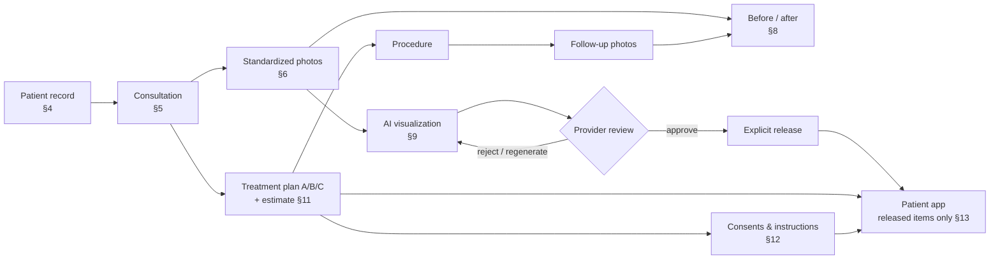
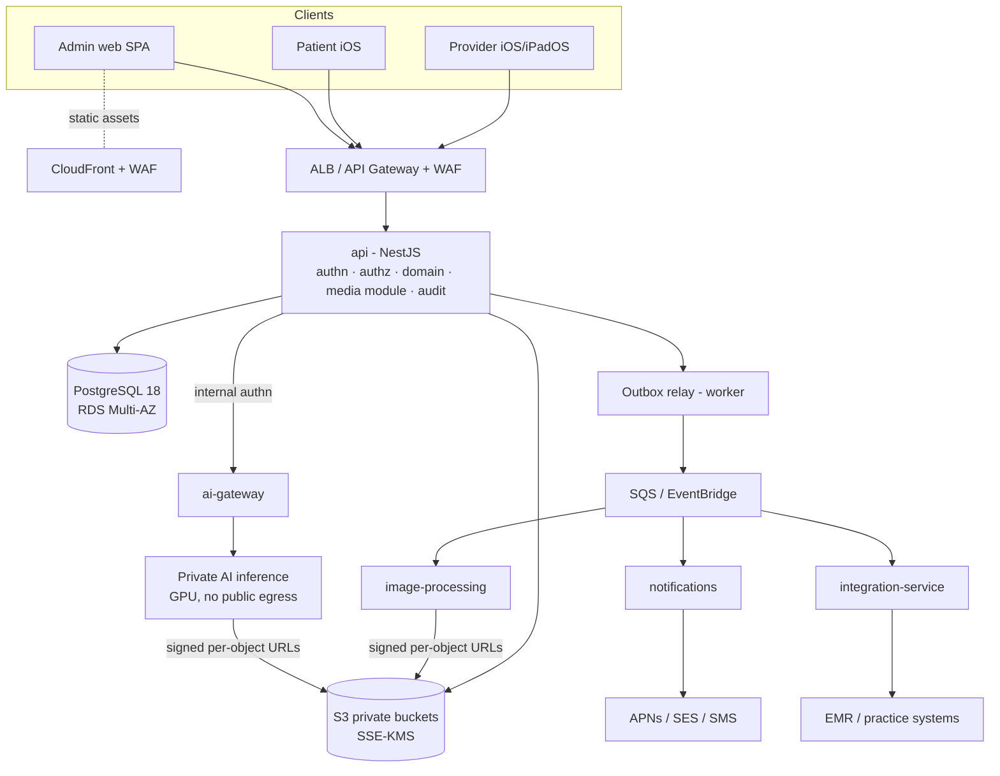
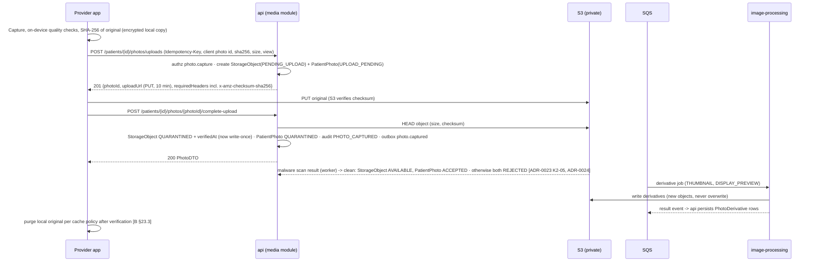
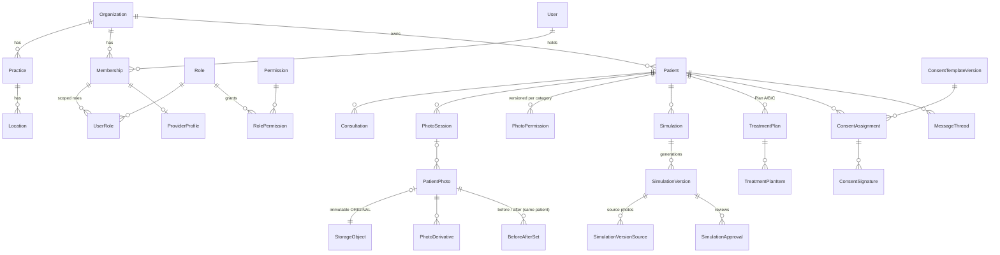

# Aesthetic Platform — Technical Specification

**Version 1.0 · LOCKED baseline · 2026-09-25**

| Item | Value |
|---|---|
| Status | **LOCKED.** Owner decisions recorded 2026-09-25 (§10.2, `ARCHITECTURE_DECISIONS.md`). Changes to a locked decision go through change control: a new ADR plus a `CHANGELOG.md` entry, *before* implementation [B §0]. |
| Source of truth | `Aesthetic_Platform_Software_Production_Bible_v1.0.pdf` (repository root, 52 pages, dated 2026-09-25) |
| Authority | Production Bible **>** this specification. If they ever disagree, the Bible wins and this document gets corrected. |
| Purpose | Turn the Bible into an engineering-ready baseline: **tech stack**, **database schema**, **API contracts**. It also names every gap the Bible leaves open, so none of them gets quietly assumed in code. |
| Decisions | [`ARCHITECTURE_DECISIONS.md`](ARCHITECTURE_DECISIONS.md) (ADR log) · [`CHANGELOG.md`](CHANGELOG.md) |
| Feeds | The Layer 0 documentation pack (Bible §31): `ARCHITECTURE_DECISIONS.md`, `DATABASE_SCHEMA.md`, `API_CONTRACTS.md`, `AUTHORIZATION_RBAC.md`, `SECURITY_REQUIREMENTS.md`, and others (see §9.2). |
| Companion files | [`technical-spec/schema.prisma`](technical-spec/schema.prisma): full draft relational schema (validated). [`technical-spec/constraints.sql`](technical-spec/constraints.sql): integrity rules Prisma cannot express (validated). [`technical-spec/verification/`](technical-spec/verification/): the checks behind §11, re-runnable. |

## Contents

0. [How to read this document](#0-how-to-read-this-document)
1. [What we are building](#1-what-we-are-building)
2. [Tech stack](#2-tech-stack)
3. [System architecture](#3-system-architecture)
4. [Identity, tenancy & authorization](#4-identity-tenancy--authorization)
5. [Database schema](#5-database-schema)
6. [API contracts](#6-api-contracts)
7. [Security, privacy & audit](#7-security-privacy--audit)
8. [Offline & synchronization contract](#8-offline--synchronization-contract-b-23)
9. [Build-layer mapping](#9-build-layer-mapping)
10. [Assumptions, unresolved decisions & proposals](#10-assumptions-unresolved-decisions--proposals)
11. [Verification report](#11-verification-report)

---

## 0. How to read this document

Every design statement is tagged with where it comes from. That keeps us honest about Bible §0.1: *"Do not silently invent product behavior when this Bible already specifies it"* and *"record it as an unresolved decision instead of burying an assumption in code."*

| Tag | Meaning |
|---|---|
| **[B §n]** | Specified by the Production Bible, section *n*. Not open to reinterpretation here. |
| **[P]** | **Proposed** by this specification: an engineering choice or a gap-filler the Bible does not dictate. Accepting this spec approves **every** [P] in §§2–8 unless you strike it; §10.3 lists the most consequential ones. Nothing tagged [P] is locked until you approve it. |
| **[UD-nn]** | **Unresolved decision.** The Bible is silent or ambiguous, and choosing wrong would create a permanent dependency. §10.2 gives options and a recommendation for each. |

What this document is **not**: it isn't Layer 0. No repository skeleton, application code, migrations or UI are created here. Layer 0 (Bible §31) turns this baseline into the formal documentation pack and the repo skeleton, after you accept it.

---

## 1. What we are building

### 1.1 In one paragraph

A **visual consultation and patient-engagement platform for aesthetic medicine practices** [B §1]. Clinicians use an iPad/iPhone app to run a consultation end to end. They open the patient, capture **standardized clinical photographs** with live positioning guidance, and compare **before/after** images. They generate a **clinician-controlled AI visualization** of a possible aesthetic change, build **treatment plan options with estimates**, collect **versioned e-consents**, and assign **education and instructions**. Only what the clinician explicitly **releases** reaches the patient's own iPhone app, alongside secure messaging, appointments and telehealth. An admin web portal manages organizations, users, roles, content, integrations and audit. Everything is multi-tenant SaaS, built to grow from a pilot to thousands of practices [B §1.1].

### 1.2 Who uses what

| Surface | Users | What it does | Source |
|---|---|---|---|
| **Provider app** (iOS/iPadOS, iPad-landscape first) | Surgeons/physicians, nurses/injectors/aestheticians, photographers, consultants, front desk | Patient records, photo capture, consultations, before/after, AI visualization review, treatment plans, consents, messaging, telehealth | [B §2, §24] |
| **Patient app** (iOS) | Patients | Released consultations, simulations, photos, plans, documents, instructions, appointments, messages, telehealth; requested photo uploads; consent signing | [B §13] |
| **Admin web portal** | Organization/practice admins; platform operations | Orgs/practices/locations, users & roles, protocols, content, consent templates, catalog, AI model rollout, integrations, audit, security, feature flags | [B §17] |
| **Application API** | All first-party clients | Authentication, authorization, domain logic, versioned contracts, audit | [B §2] |
| **Media service** | Via the API only | Uploads, derivatives, signed access, retention, checksums, storage isolation | [B §2] |
| **AI platform** | Provider workflow via internal API | Quality checks, landmarks, segmentation, simulation, validation, provenance | [B §2, §9] |
| **Integration service** | Backend only | FHIR/HL7/vendor adapters, sync status, mapping, retries | [B §18] |

### 1.3 The core clinical flow



### 1.4 Non-negotiable guardrails, and where this spec enforces each one

These come from Bible §0.1, §1.2 and the Development Constitution (§30). Each one is enforced in at least two places: the database, the API or process controls.

| # | Guardrail | Enforced by |
|---|---|---|
| G1 | Tenancy is enforced server-side; client-supplied org IDs are never proof of entitlement [B §3.1] | Tenant bound into the access token (§4.2); tenant-scoped data access layer (§3.5); **composite foreign keys** that make cross-tenant links impossible in the database (§5.1, verified A1–A5, R1–R2); automated cross-tenant tests (§7.5) |
| G2 | Original clinical photos are never destructively edited [B §6.6] | Write-once `StorageObject` and immutable `PatientPhoto.originalObjectId` triggers (verified C1–C4); derivatives are separate immutable rows (C8–C9); S3 private bucket with versioning (§7.4) |
| G3 | No permission implies another; clinical consent never implies marketing/research/AI-training [B §7.1] | Independent permission rows per category (D3); append-only versioned history (D4–D7); export/release checks the *current* grant at use time and pins **every** version relied on (`MediaReleasePermission`, required at commit, R15–R17); AI-training gate (§7.7) |
| G4 | Provider drafts and rejected/failed simulations are never exposed to patients [B §13.2, §34.2 #26] | Separate patient-portal API namespace with its own DTOs that can only select released states, **deny-by-default** for any entity without a visibility rule (§4.7, §6.5); release requires `RELEASED_TO_PATIENT` with version/time/actor (E12–E13) |
| G5 | Simulations are never described as guaranteed or exact outcomes [B §9] | The mandatory disclaimer [B §9.1] is embedded server-side in every patient-facing simulation DTO (§6.6.4); product vocabulary is "simulation/visualization" |
| G6 | No automatic dosing, diagnosis, drug/product or technique recommendation [B §1.2, §9.6, §21.4] | Model versions carry an allow-listed `parameterSchema` with no dosage/product/technique fields; the registered version is immutable (E1); the API rejects unknown parameters |
| G7 | No PHI in logs, analytics, crash reports or push payloads [B §14.3, §21.2] | Push text is a fixed template key only (`Notification.templateKey`); allow-list log redaction; no PHI in URLs (search uses POST bodies); AI workers receive image references, never demographics (§7.2) |
| G8 | Explicit state machines instead of boolean clusters [B §19.1] | Every Appendix A state machine is a Postgres enum plus a server-side transition table (§5.4); status-to-timestamp CHECK constraints |
| G9 | Consents are versioned; executed documents never change [B §12.2] | Published template versions are frozen (F1–F6); executed assignments are frozen apart from void/supersede bookkeeping, and **cannot be reopened** (F9–F12, R5–R6); signed snapshot + SHA-256 hash required for `COMPLETE` (F8) |
| G10 | Audit is immutable/tamper-resistant [B §21.2, §22] | `AuditEvent` append-only by trigger (G1–G3) plus DB grants plus export to WORM storage (§7.3) |
| G11 | A production AI model is never silently replaced [B §9.7] | Immutable `AIModel` identity and `AIModelVersion` content (E1, R10); activation only via an explicit, audited `AIModelRollout` whose rows can only be deactivated, never edited (R11–R13); one active version per scope (E3–E5) |
| G12 | Implement only the authorized layer, then stop [B §0.1, §30] | Process: this spec gives a per-layer table rollout (§9.1) so no layer ships tables or endpoints early |

### 1.5 Explicit non-goals for the first production build [B §1.2]

No automatic diagnosis. No prescribing of medication, product, dosage, injection depth or surgical technique. No visualization presented as an exact prediction. No replacement of billing, claims, e-prescribing or an enterprise EHR. No patient data sharing across organizations (D-01: Bible §1.2's "cross-practice" is read as cross-organization; sharing across the practices of one organization is allowed, §4.6). No 3D digital patient (deferred to Layer 11). No call recording (§16.2). No break-glass impersonation unless separately specified (§17.1).

### 1.6 Build layers [B §29]

| Layer | Scope | Exit condition |
|---|---|---|
| 0 Architecture Foundation | Monorepo plan, architecture docs, DB design, API conventions, security model, design system, IaC skeleton, ADRs | Architecture pack accepted; repo can be initialized reproducibly |
| 1 Identity, Tenancy, Patients | Auth, orgs, practices, locations, users, permissions, patient CRUD/search, audit, provider app shell | Cross-tenant tests pass; iOS login/patients work |
| 2 Photography Core | Protocols, sessions, camera, upload, immutable originals, derivatives, permissions | Standard photo session works end to end |
| 3 Consultations & Before/After | Consultation lifecycle, annotations, before/after, timeline | Consultation with standardized imagery is functional |
| 4 Documents, Consent, Education, Plans | Versioned docs/consents/content, plans/estimates | Patient-facing plan/document workflow is testable |
| 5 Patient App & Messaging | Patient auth, released content, secure messaging, notifications | Patient can securely access assigned/released records |
| 6 Telehealth & Scheduling | Appointments, telehealth workflow | Scheduled virtual consultation lifecycle works |
| 7 AI Infrastructure | AI gateway, model registry, quality, landmarks, segmentation, validation harness | Versioned AI jobs with provenance |
| 8 Outcome Simulation | Procedure-specific visualization engines, provider review/release | Initial validated simulation categories |
| 9 Similar Cases & Outcome Analysis | Historical case search, measured comparisons | Permission-safe similar-case workflow |
| 10 Integrations | FHIR/vendor adapters, sync monitoring | Selected partner integrations stable |
| 11 3D Digital Patient | Depth/multi-view model, 3D visualization | Separate approved product expansion |

---

## 2. Tech stack

Versions were checked against the npm registry and nodejs.org on **2026-09-25**. Layer 0 pins exact versions in lockfiles. "Source" shows whether the Bible mandates the choice.

### 2.1 Backend & data

| Area | Choice | Version | Source | Why |
|---|---|---|---|---|
| Runtime | Node.js **24 LTS "Krypton"** | 24.x | [B §31] "current supported LTS" | Active LTS today, supported to April 2028. Node 26 enters Active LTS in late October 2026; kept on 24 through Layer 4 and re-evaluated at the Layer 5 kickoff [ADR-0023 K2-22, ADR-0026 K3-24, ADR-0028 K4-27]. |
| Language | TypeScript | **6.0.x** | [B §25.1] | NestJS 12's CLI ships TypeScript ~6.0. TypeScript 7.0 (native compiler) is out but not yet supported by the NestJS toolchain (decorator metadata). Adopt 7.x when NestJS supports it. |
| Monorepo | **pnpm workspaces** + Turborepo | pnpm 12.x, turbo 2.x | [B §31] pnpm · [P] Turborepo | Turborepo adds cached, dependency-aware task runs across ~15 packages. It is optional and can be removed without changing structure. |
| API framework | **NestJS 12** on the **Fastify** adapter | @nestjs/core 12.1 | [B §25.1] NestJS · [P] Fastify | Nest gives modules, guards and interceptors that map directly onto authz/audit/tenancy. Fastify gives lower latency and schema-first request handling. |
| Contracts & validation | **Zod 4** schemas in `packages/api-contracts`, compiled to **OpenAPI 3.1** | zod 4.6, zod-to-openapi 9.1 | [P] | One source for runtime validation, TS types and the published OpenAPI document. DTOs are separate from DB models [B §20.3]. |
| Database | **PostgreSQL 18** (Amazon RDS, Multi-AZ) | ≥ 15 required, 18 targeted | [B §25.1] PostgreSQL · [P] version | `NULLS NOT DISTINCT` and partial indexes (constraints.sql) need ≥ 15. PG 18 has native `uuidv7()`. Confirm the RDS region supports 18 at Layer 0 (17 is an acceptable fallback). |
| ORM / migrations | **Prisma ORM 7** with the `@prisma/adapter-pg` driver adapter | 7.10 (stable) | [B §25.1] | Prisma 8 is at release-candidate stage (npm's `latest` tag currently points at 8.0.0-rc). **Do not adopt 8 until it is GA.** |
| Search | PostgreSQL B-tree indexes on database-maintained search keys, queried with leakproof operators so they work under Row-Level Security (ADR-0020) | — | [P] | Name-prefix and exact-identifier patient search. Revisit OpenSearch at the ~100-practice tier [B §25.4]. |
| Object storage | **Amazon S3**, private, SSE-KMS, versioning, Block Public Access | — | [B §25.3] | No public buckets and no public CDN for patient media [B §21.2, §25.3]. |
| Queues & events | **SQS** (work queues) + **EventBridge** (domain events), fed by a **transactional outbox** | — | [B §25.3] · [P] outbox | The outbox (`OutboxEvent`) guarantees events are published only when the DB change commits: no lost or phantom events. |
| Workers | NestJS worker processes (same codebase, separate deployables) | — | [B §25.2] "worker" | Exports, sync, derivatives, retention jobs; the UI always exposes job status [B §22.4]. |
| Image processing | **Python 3.13** service using libvips (pyvips); OpenCV joins in Layer 3 for registration | pyvips-binary (libvips 8.18); opencv-python-headless from Layer 3 | [P] · [UD-06, confirmed ADR-0023 K2-01] | Registration and alignment need OpenCV. Images are decoded only by pyvips; OpenCV receives pixel arrays [ADR-0026 K3-13]. Keeping all pixel work in one language avoids two imaging stacks. Bible §25.1 prefers TypeScript "or another approved strongly typed framework", so Python (typed, mypy strict) is adopted by delegation (ADR-0008). |
| AI gateway | NestJS (TypeScript) | — | [P] | Authenticated internal job API, model routing, provenance [B §25.2]. |
| AI inference | Python + PyTorch / ONNX Runtime in a **private** GPU environment (no public egress) | — | [B §2.1] "Private AI Jobs" (privacy) · [P] Python · [UD-04] hosting | Patient images never go to third-party AI APIs unless a separately approved BAA-covered service is chosen. Python is the de facto ML runtime but is not the Bible's preferred backend language (§25.1), so it is adopted by delegation (ADR-0008). |
| Notifications | APNs (token auth), Amazon SES (email), AWS End User Messaging (SMS) | — | [P] | SES and End User Messaging are HIPAA-eligible AWS services; APNs is Apple's service and receives only generic text plus a deep-link identifier. Payloads are generic text only [B §14.3]. |
| Authentication | First-party OIDC-compatible auth module: `jose` (JWT), `@node-rs/argon2` (Argon2id), `otplib` (TOTP), `@simplewebauthn/server` (passkeys) | jose 6.2, argon2 2.2, otplib 13.5, simplewebauthn 14.0 | [B §21.1] OIDC-compatible · **D-02** first-party | See §4.2. Enterprise SSO federation can be added later behind an identity-provider adapter. |
| Telehealth video | Vendor adapter (BAA-capable vendor) | — | [UD-05] | Layer 6 decision; the schema is vendor-agnostic (`TelehealthSession.vendor`). |
| Malware scanning | Amazon GuardDuty Malware Protection for S3, if within the BAA's scope; otherwise a ClamAV worker behind the same interface | — | [UD-22, confirmed ADR-0023 K2-04] | **Every uploaded object is scanned**, whatever its source; required at least for patient uploads and attachments [B §13.4, §14.4]. Locally and in CI, a scanner that flags only the EICAR test file. |
| Logging | `pino` structured JSON with **allow-list** redaction | pino 10.3 | [B §26] · [P] | Only IDs and codes are logged, never request bodies. |
| Tracing & metrics | OpenTelemetry SDK → AWS Distro for OpenTelemetry → CloudWatch / X-Ray | @opentelemetry/sdk-node 0.222 | [B §26] · [P] | Distributed tracing using safe identifiers only. |

### 2.2 Clients

| Area | Choice | Source | Notes |
|---|---|---|---|
| iOS language & UI | Swift 6 language mode, SwiftUI, Swift Concurrency | [B §24.3] | Strict concurrency checking on from day one. |
| iOS frameworks | AVFoundation, Vision, CoreML, Metal, ARKit (future 3D only), CryptoKit, LocalAuthentication, Keychain, URLSession, BackgroundTasks | [B §24.3] | Vision/CoreML power on-device live capture guidance (pose, framing, blur, lighting). |
| iOS packages | Swift Package Manager, one local package per module from Bible §24.4 | [B §24.3–24.4] | 20 provider modules (AppShell … AuditSupport). Patient app reuses CoreNetworking, CoreSecurity, DesignSystem. |
| Xcode project generation | **Tuist** (Swift manifests) | [B §31] "reproducible method" · [P] | Built for heavily modular apps; XcodeGen is the fallback. |
| iOS API client | Apple **swift-openapi-generator** from the OpenAPI 3.1 contract | [P] | The client is generated, never hand-written, so it can't drift from the server. |
| iOS offline store | **CryptoKit AES-GCM**-sealed records and media files, key held in Keychain (`WhenUnlockedThisDeviceOnly`); Data Protection class *Complete* | [B §23.3] "all cached sensitive data encrypted" · [P] · ADR-0023 K2-17 | A small store; no third-party cryptography dependency. Deterministic mutation queue (§8). |
| Minimum OS | iOS/iPadOS **26** | **D-05** | Current major minus one at September 2026. Owner requirement: **controls must be intuitive** on both iPhone and iPad. The interaction rules are in `DESIGN_SYSTEM.md`. |
| Admin web | **React 19 + TypeScript + Vite 8** single-page app, TanStack Router/Query, generated TS client | **D-03** | The Bible does not name a web framework. A static SPA fits "CloudFront/WAF (admin/public static assets only)" [B §25.3]: no server-side rendering tier handles PHI. |

### 2.3 Infrastructure, delivery & quality

| Area | Choice | Source |
|---|---|---|
| Cloud | AWS, HIPAA-eligible services only, under the customer's/operator's BAA [B §21.3, §25.3] | [B] |
| Compute | Docker images in ECR; ECS on **Fargate** for API/workers; ECS on **EC2 GPU** capacity (or SageMaker, UD-04) for inference | [B §25.1, §25.3] |
| Edge | CloudFront + AWS WAF for admin static assets only; API via ALB (or API Gateway) with WAF rate rules | [B §25.3] |
| Secrets & keys | AWS Secrets Manager; KMS customer-managed keys per environment (envelope encryption) | [B §21.2] |
| IaC | **Terraform** (AWS provider), one root module per environment: dev / staging / production | [B §25.1, §28.1] |
| CI/CD | **GitHub Actions** (repo is on GitHub). Gates from [B §28.2]: format/lint, typecheck, unit/API/DB tests, migration validation, dependency scan (OSV-Scanner + Dependabot), container scan (Trivy), `terraform validate`/`tflint`/`checkov` plus plan review, iOS build/tests on macOS runners | [B §28.2] · [P] tools |
| Test tooling | Vitest (unit/domain), **Testcontainers** + real PostgreSQL (DB/API/authz/tenant tests, never mocks for authz), Playwright (admin web E2E), Swift Testing/XCTest + XCUITest (iOS) | [B §27.1] · [P] tools |
| Local development | Docker Compose: `postgres:18`, **moto** (S3, SQS, EventBridge, KMS; LocalStack now needs an account token, ADR-0023 K2-08), Mailpit | [P] |

### 2.4 Deliberately *not* in the stack

- **No public CDN caching of patient media**, and no permanent public URLs [B §21.2, §25.3].
- **No third-party analytics, session-replay or crash SDKs that can capture PHI.** iOS crash diagnostics use MetricKit; any vendor tool needs a BAA plus PHI scrubbing, and approval.
- **No third-party generative-AI API receiving patient images** without a separately approved, BAA-covered decision (UD-04).
- **No payment processor, ledger or claims engine** [B §11.3]. Estimates plus references only.
- **No GraphQL.** The Bible's contract rules (§20) are REST resource conventions, and one contract style keeps authorization review tractable.

---

## 3. System architecture

### 3.1 Services and responsibilities [B §2.1, §25.2]

| Deployable | Responsibility | Talks to | Touches PostgreSQL? |
|---|---|---|---|
| `services/api` | All public REST endpoints (`/api/v1`, `/api/v1/portal`), authn/authz, domain logic, audit, outbox. **Includes the media module** (upload intents, signed URLs, storage ledger) [B §25.2 allows "media-service *or* media module"] [P] | PostgreSQL, S3, SQS/EventBridge, ai-gateway (internal) | **Yes: sole owner of the schema** |
| `worker` (same codebase as api, separate process) | Outbox relay, exports, retention jobs, sync orchestration, notification fan-out, permission-expiry job | PostgreSQL, S3, SQS | Yes |
| `services/image-processing` | Thumbnails, display previews, normalization, before/after registration, annotated/export renders | SQS (jobs in/results out), S3 (signed, per-object access) | **No** [P] |
| `services/ai-gateway` | Internal AI job API, model routing via the active rollout, provenance capture, validation harness | api (internal), SQS, inference environment | **No** [P]: reports results as events the api persists |
| AI inference (private) | Quality, landmarks, segmentation, simulation, identity-similarity, artifact detection | ai-gateway only | **No** |
| `services/notifications` | APNs / email / SMS delivery of generic templates | SQS, providers | No |
| `services/integration-service` | FHIR / vendor / CSV adapters behind one `IntegrationAdapter` interface [B §18.1] | api (internal), SQS, external EMRs | No [P]: mappings persisted by api |

**Minimum-necessary principle [P]:** only `api`/`worker` can read patient demographics. Imaging and AI services receive **opaque object references plus job parameters**. They never receive a name, date of birth or MRN, and they cannot query the database. That keeps PHI exposure in the AI environment to the images themselves.

### 3.2 Component diagram



### 3.3 Request pipeline: every authenticated call [B §3.3, §20.3, §22]

1. **Edge:** WAF rate rules and TLS termination. The gateway injects nothing trusted.
2. **Request ID:** a server-generated `X-Request-Id` (UUIDv7) is attached to logs, traces, audit rows and the error envelope.
3. **Authentication:** verify the access token (signature, expiry, audience) and load the `Session`. A revoked, expired or idle session means **401**.
4. **Tenant context:** `organizationId` comes **only** from the verified session/token, never from a header, body or path parameter. The membership must be `ACTIVE`.
5. **Permission guard:** the required permission is declared on each route (e.g. `@RequirePermission('patient.read')`), and effective permissions are computed server-side from `UserRole` scope (§4.6).
6. **Resource scoping:** the data layer adds `organizationId` (and practice scope) to every query. A resource the caller can't see returns **404 with a generic message**, the same response whether it doesn't exist or belongs to another tenant [B §20.3 "no patient enumeration"].
7. **Validation:** Zod schema from `api-contracts`; unknown fields are rejected.
8. **Concurrency and idempotency:** check `If-Match` and `Idempotency-Key` where required (§6.1).
9. **Domain logic:** state transitions go through a single transition table per aggregate (§5.4); invalid transitions return **409 INVALID_STATE_TRANSITION** [B §5.2].
10. **Same transaction:** the state change, the `AuditEvent` row and any `OutboxEvent` rows commit together, or none do.
11. **Response:** a DTO mapper (never the Prisma model) with `ETag` where applicable, and `Cache-Control: no-store` on PHI responses.

### 3.4 Key flows

**A. Photo capture and upload [B §6.3, §6.6]**



**B. AI visualization [B §9.2–9.3, §34.2]**

1. `POST /patients/{id}/simulations` (`simulation.create`) creates the Simulation `DRAFT` with source photos (audit `SIMULATION_CREATED`). The server checks that each source is the **same patient** (DB-enforced) and `ACCEPTED`, and holds whichever current media-permission grant simulation use requires. **Which category that is, is [UD-32]**; the Bible does not say, and "no permission implies another" [B §7.1] forbids guessing. Provider parameters are edited on the DRAFT (`draftParameters`).
2. `POST …/{simId}/generate` (`simulation.generate`, `Idempotency-Key` **required**) validates the draft parameters against the active model version's allow-list and freezes them into append-only `SimulationParameter` rows. It then creates a `SimulationVersion` plus an `AIJob` (`QUEUED`), sets the Simulation to `QUEUED`, and writes audit `SIMULATION_GENERATED`.
3. ai-gateway runs input quality → landmarks → segmentation → identity representation → constrained transformation → outside-region identity similarity → artifact detection → output validation, with every check persisted as an `AIValidationRecord`. The status moves `PROCESSING` → `VALIDATING` → `READY_FOR_PROVIDER_REVIEW`, or `FAILED` with a **safe, actionable** error code (e.g. `INPUT_QUALITY_INSUFFICIENT`) [B §34.2 #24]. Every system transition is audited as `SIMULATION_STATUS_CHANGED` with actor type `SERVICE` [B §34.2 #30].
4. The provider approves or rejects (both `simulation.approve`: a review decision belongs to the "reviewing provider" [B §9.2, §9.4], and the DB requires the reviewer to be a `ProviderProfile` of the same organization, R18), or regenerates (`simulation.generate`, new version). Approval does **not** release anything.
5. `POST …/{simId}/release` (`simulation.release`) is a **separate explicit action** [B §34.2 #28]. It requires `APPROVED` plus the release rules (§5.4.2) and writes audit `SIMULATION_RELEASED`. The patient-portal DTO always carries the Bible §9.1 disclaimer.

**C. Patient photo upload intake [B §13.4]:** provider creates a `PhotoRequest` → patient uploads through the portal (the object lands `QUARANTINED`) → malware and file-type validation → `PENDING_REVIEW` → staff `ACCEPTED` (enters the clinical record) or `RETAKE_REQUESTED`/`REJECTED`, with every step audited.

**D. Integration sync [B §18]:** a manual, scheduled or webhook trigger creates an `EMRSyncEvent` (`PENDING`, with idempotency key). The adapter maps canonical resources, upserts idempotently via `IntegrationMapping`, and records conflicts (`CONFLICT_DETECTED`, never silently overwritten). Failed records go to `IntegrationDeadLetter` (payload encrypted in S3), and the run ends `SUCCEEDED`/`PARTIAL`/`FAILED` → `RETRY_SCHEDULED` with backoff.

### 3.5 Tenant isolation in depth [B §3.1, §21.2, §36]

| Layer | Mechanism | Status |
|---|---|---|
| 1. Identity | Tenant bound to the session and access token at org selection; switching org issues new tokens | [P] |
| 2. Guard | Membership must be `ACTIVE`; permission evaluated for that org only | [B §3.3] |
| 3. Data access | Tenant-scoped repository layer: a Prisma client extension **requires** a tenant context and injects `organizationId` into every query on tenant-owned models. Unscoped access is only possible through an explicitly named platform repository (used by SUPER_ADMIN tooling and migrations). | [P] |
| 4. Database | **Composite foreign keys** `(organizationId, …)` on every parent/child link, plus CHECKs wherever a nullable composite FK could otherwise be skipped by Postgres `MATCH SIMPLE`. An automated query confirms every such FK is covered (§11). The database rejects cross-tenant links even if application code has a bug (verified A1–A5, C5, D9, E6, F7, R1–R2, R18). A few links are application-enforced only (§5.1). | [P] |
| 5. Database | PostgreSQL Row-Level Security on every tenant-owned table (`FORCE ROW LEVEL SECURITY`), keyed on `SET LOCAL app.organization_id` set from the verified token in each request transaction; an unset value matches no rows. The application DB role has no `BYPASSRLS`; migrations run as a separate owner role. The sign-in membership lookup, before any tenant is chosen, uses one narrow `SECURITY DEFINER` function. Platform operations use a separate role limited to platform tables, with no access to patient or clinical tables. Workers set the tenant for each job [ADR-0018 K-06, K-16]. **Performance gate:** the Layer 1 benchmark must show ≤ 10% added p95 latency and ≤ 5 ms absolute on core endpoints (login, patient search, patient open), otherwise the policy design is revised before Layer 1 ships | **D-04** |
| 6. Tests | Every tenant-scoped endpoint is run by an automated cross-tenant test generator (tenant B credentials against tenant A IDs must return 404, with no timing or message difference) | [B §27.1, §36] |

---

## 4. Identity, tenancy & authorization

### 4.1 Tenant hierarchy [B §3.1]

`PLATFORM → ORGANIZATION → PRACTICE → LOCATION`

- **Tenant-owned** (carries `organizationId`): everything patient-related, plus clinical, content, configuration, integration and storage records.
- **Platform-level** (no `organizationId`, by design): `User` (one person may work for several organizations), `Permission` (catalog), system `Role`s, `AIModel`/`AIModelVersion` (registry), and platform-default `FeatureFlag`/`AIModelRollout` rows.
- Practice/location scoping is added where operationally relevant: appointments, consultations, procedures, sessions, settings, role assignments.

### 4.2 Authentication [B §21.1] (first-party identity, D-02)

| Concern | Design |
|---|---|
| Protocol | OAuth 2.1 / OIDC-compatible token semantics. First-party clients sign in directly over TLS (`POST /auth/login`). There is no redirect-based authorization-code flow, so PKCE does not apply. **iOS:** access token in memory, refresh token in the Keychain (see *Biometric re-auth*). **Admin web:** access token in memory; the refresh token only in an `HttpOnly`, `Secure`, `SameSite=Strict` cookie whose path is limited to `/api/v1/auth/token/refresh`. Every cookie-authenticated request must carry an allow-listed `Origin` (CSRF defense). Enterprise SSO (SAML/OIDC federation for large organizations) can be added later behind an identity-provider adapter. [ADR-0018 K-11] |
| Credentials | Argon2id password hashes; TOTP and WebAuthn/passkeys as second factors (`UserCredential`). **MFA is always required for the admin web and for any admin role.** An organization's policy (`OrganizationSetting security.mfaPolicy`) may require it for more users, never fewer [B §21.1]. At sign-in, before an organization is chosen, the strictest policy among the user's active memberships applies. [ADR-0018 K-03] |
| Passwords and recovery | Passwords follow NIST SP 800-63B: at least 12 characters, checked against a common and breached-password list, no composition rules. **Lockout:** 5 consecutive failures lock the account for 15 min; each further lock within 24 h doubles the period, up to 24 h. The count comes from `LoginEvent` and restarts after a successful sign-in or a password reset; WAF rate rules also protect the endpoint. **Reset:** a single-use token sent by email, stored only as a hash (`UserToken`), valid 30 min; completing a reset revokes all the user's sessions. **Change:** `POST /auth/password/change` needs the current password and a recent MFA. **Lost factors:** a user who has lost every second factor needs an admin-initiated MFA reset (`security.manage`) and enrolls again at the next sign-in. [ADR-0018 K-15] |
| Access token | Signed JWT (ES256, key in KMS). Claims: `sub` (user), `sid` (session), `org` (active organization), `app` (client), `amr`. **Lifetime 10 min.** Permissions are *not* embedded: they are evaluated per request so revocation takes effect immediately. [P] |
| Refresh token | Opaque, stored only as a hash on `Session`, **rotated on every use**. Presenting an older generation is treated as theft: the whole session is revoked with reason `REFRESH_TOKEN_REUSE`. [P] |
| Session policy defaults | Provider app: idle 8 h, absolute 7 d, Face ID/Touch ID re-auth after 5 min in background. Admin web: idle 30 min, absolute 12 h. Patient app: idle 30 d, absolute 90 d, biometrics optional. All configurable per organization. [P] · [UD-18] |
| Biometric re-auth | Refresh token stored in the Keychain as `kSecAttrAccessibleWhenPasscodeSetThisDeviceOnly` with access control `.biometryCurrentSet`. There is **no passcode fallback**: if biometrics are unavailable or the enrolled set changes, the item cannot be read and the user signs in again with password and MFA [ADR-0018 K-22]. LocalAuthentication gates the app unlock and step-up actions (signing, export) on-device [B §21.1]. The server additionally requires a recent `mfaVerifiedAt` for designated sensitive actions. [P] |
| Revocation | Server-side: `Session.revokedAt`; device revocation cascades to its sessions → audit `SECURITY_SESSION_REVOKED` [B §21.1, §22.1]. **Scope:** an organization admin revokes only sessions bound to that organization, and disabling a membership ends only that organization's sessions. A password reset, an admin MFA reset and platform security (`security.manage` at platform scope) revoke all of the user's sessions. [ADR-0018 K-12] |
| Organization switch | `PUT /auth/session/organization` re-checks membership and issues new tokens bound to the new org. Audited as `ORGANIZATION_SWITCHED` [ADR-0018 K-04]. |
| Login audit | Each attempt writes a `LoginEvent` (security ledger). An `AuditEvent` `LOGIN_SUCCESS`/`LOGIN_FAILURE`/`LOGOUT` is also written when the identifier matches a user; an attempt for an unknown identifier is recorded in `LoginEvent` only (keyed hash of the identifier, IP, reason). A `MFA_REQUIRED` login response means "password accepted, second factor pending": it is recorded as the step `MFA_CHALLENGE_ISSUED`, not as a failure, and does not count toward lockout. Identical client-facing error for unknown user versus bad password (no account enumeration). [ADR-0018 K-13, K-15] |

### 4.3 Roles [B §3.2]

System roles are defined once at platform level (`Role.organizationId = NULL`), one key per Bible row [P] (splitting e.g. SURGEON_PHYSICIAN into two keys later is a data change, not a schema change):

`SUPER_ADMIN` · `ORGANIZATION_ADMIN` · `PRACTICE_ADMIN` · `SURGEON_PHYSICIAN` · `NURSE_INJECTOR_AESTHETICIAN` · `PHOTOGRAPHER` · `CONSULTANT` · `FRONT_DESK` · `MARKETING` · `PATIENT`

Assignments (`UserRole`) carry an explicit **scope**: `PLATFORM` (SUPER_ADMIN only), `ORGANIZATION`, `PRACTICE` or `LOCATION` (DB-enforced shape, verified B2–B5). Whether organizations may define **custom roles** is [UD-07]; the schema already supports it (`Role.organizationId` non-null).

### 4.4 Permission catalog

**Bible permissions [B §3.3]: 41 keys, seeded exactly:**

| Domain | Keys |
|---|---|
| Patient | `patient.read` `patient.create` `patient.update` `patient.archive` |
| Photo | `photo.capture` `photo.view` `photo.annotate` `photo.export` `photo.permission.read` `photo.permission.manage` |
| Consultation | `consultation.create` `consultation.edit` `consultation.complete` |
| Simulation | `simulation.create` `simulation.generate` `simulation.review` `simulation.approve` `simulation.release` |
| Treatment plan | `treatmentplan.create` `treatmentplan.edit` `treatmentplan.send` |
| Consent | `consent.template.manage` `consent.assign` `consent.sign.provider` `consent.void` |
| Communication | `message.send` `appointment.manage` `telehealth.start` |
| Users & roles | `user.read` `user.create` `user.update` `user.disable` `role.read` `role.assign` |
| Practice | `practice.read` `practice.manage` |
| Content | `content.read` `content.manage` |
| Integration | `integration.read` `integration.manage` |
| Audit | `audit.read` |

**Gaps [UD-16]:** several Bible-required capabilities have no permission key in §3.3. Change control (Bible §0) says permission changes must be documented before implementation, so these are **proposals, not defaults**:

| Capability (Bible source) | Proposed resolution [P] |
|---|---|
| Create/manage organizations (§17.1; SUPER_ADMIN / ORGANIZATION_ADMIN) | New `organization.read`, `organization.manage` |
| Read consultations, plans, messages, appointments (only write keys exist) | **Map, don't add:** reads require the domain's lowest write key *or* `patient.read` plus a clinical key. Proposal: `consultation.create` implies read of consultations; `message.send` implies read of threads the user participates in; `appointment.manage` covers reads. Keeps the catalog as the Bible wrote it. |
| Photography protocols, treatment catalog, appointment types (§17.1) | Use existing `practice.manage` |
| Documents (read, upload, release) (§12, §13.2) | New `document.read` and `document.manage`. `patient.read` is **demographics/profile only** and never unlocks clinical content, so FRONT_DESK and PHOTOGRAPHER cannot read consultation summaries, signed consents or medical history [B §3.2]. |
| Education/instruction assignment (§12.5–12.6) | Use `content.read` to assign, `consultation.edit` to clinically complete instructions |
| Patient photo intake review (§13.4) | Use `photo.capture` |
| Procedures (§4.3, §13.1) | New `procedure.manage` |
| Patient data export (§22.4) | New `data.export` |
| Session/device revocation by admins (§17.1 "Security/session/device administration") | New `security.manage` |
| AI model registry & rollout (§17.1) | New `ai.model.read`, `ai.model.manage` (platform scope only for manage) |
| Feature flags & settings (§17.1) | New `configuration.manage` |
| Similar-case search (§10) | New `similarcase.search` (Layer 9) |
| Marketing library access (§3.2 MARKETING) | New `marketing.library.read`: only assets with a current `MediaRelease` for WEBSITE / SOCIAL_MEDIA / PAID_ADVERTISING |

**Endpoint → permission mappings needing approval [UD-16]:** where a Bible key exists but the Bible doesn't say which one guards an action, this spec maps it as follows. Each mapping is a proposal.

| Action | Mapped permission |
|---|---|
| Read consultations, notes, medical history, concerns | `consultation.create` |
| Read treatment plans; read the treatment catalog | `treatmentplan.create` |
| Read message threads (staff), download attachments, mark read | `message.send` **and** thread participation |
| Read appointments | `appointment.manage` |
| Schedule an accepted plan (`/schedule`, which creates its procedures); Layer 6 adds appointment links, which also need `appointment.manage` | `procedure.manage` [ADR-0028 K4-08] |
| Record a patient's in-clinic plan response (opens the hand-off) | `treatmentplan.send` [ADR-0028 K4-06] |
| Read photography protocols | `photo.capture` or `photo.view` |
| Create before/after sets; queue automatic registration | `photo.view` (non-destructive; originals untouched) |
| Adjust manual registration; tag photos | `photo.annotate` |
| Access the ORIGINAL variant | `photo.export` (a permission, never a role check [B §3.3]) |
| Review patient-uploaded photos | `photo.capture` |
| Record a witness signature; staff-assisted patient signing | `consent.assign` |
| Reject a simulation; archive a simulation | `simulation.approve` |
| View simulations | `simulation.review` (view only; no decisions) |
| Release materials to the patient app | `consultation.complete` (consultation materials) / `simulation.release` (simulations) / `document.manage` (documents) |
| Assign education and instructions; mark instruction clinically complete | `content.read` / `consultation.edit` |
| Manage protocols, treatment catalog, appointment types | `practice.manage` |

### 4.5 Proposed default role → permission matrix [P] · [UD-17]

The Bible gives each role's *typical scope* [B §3.2] but no matrix. Layer 1 needs one to seed roles. This proposal follows the Bible's wording literally and errs on the side of **least privilege**. Practices can grant more once custom roles exist (UD-07).

Legend: ● granted · ○ granted within the assignment's practice/location scope · — not granted. Columns: **SA** SUPER_ADMIN, **OA** ORGANIZATION_ADMIN, **PA** PRACTICE_ADMIN, **SP** SURGEON_PHYSICIAN, **NI** NURSE_INJECTOR_AESTHETICIAN, **PH** PHOTOGRAPHER, **CO** CONSULTANT, **FD** FRONT_DESK, **MK** MARKETING.

| Permission | SA | OA | PA | SP | NI | PH | CO | FD | MK |
|---|---|---|---|---|---|---|---|---|---|
| patient.read | — | — | ○ | ● | ● | ● | ● | ● | — |
| patient.create | — | — | ○ | ● | ● | — | ● | ● | — |
| patient.update | — | — | ○ | ● | ● | — | ● | ● | — |
| patient.archive | — | — | ○ | ● | — | — | — | — | — |
| photo.capture | — | — | — | ● | ● | ● | — | — | — |
| photo.view | — | — | — | ● | ● | ● | ● | — | — |
| photo.annotate | — | — | — | ● | ● | — | — | — | — |
| photo.export | — | — | — | ● | — | — | — | — | ● ¹ |
| photo.permission.read | — | — | — | ● | ● | ● | ● | — | — |
| photo.permission.manage | — | — | — | ● | ● | — | — | — | — |
| consultation.create | — | — | — | ● | ● | — | ● | — | — |
| consultation.edit | — | — | — | ● | ● | — | ● | — | — |
| consultation.complete | — | — | — | ● | — | — | — | — | — |
| simulation.create | — | — | — | ● | ● | — | — | — | — |
| simulation.generate | — | — | — | ● | ● | — | — | — | — |
| simulation.review | — | — | — | ● | ● | — | ● ² | — | — |
| simulation.approve | — | — | — | ● | — | — | — | — | — |
| simulation.release | — | — | — | ● | — | — | — | — | — |
| treatmentplan.create | — | — | — | ● | ● | — | ● | — | — |
| treatmentplan.edit | — | — | — | ● | ● | — | ● | — | — |
| treatmentplan.send | — | — | — | ● | — | — | ● | — | — |
| consent.template.manage | — | ● | ○ | — | — | — | — | — | — |
| consent.assign | — | — | — | ● | ● | — | ● | — | — |
| consent.sign.provider | — | — | — | ● | — | — | — | — | — |
| consent.void | — | — | — | ● | — | — | — | — | — |
| message.send | — | — | — | ● | ● | — | ● | — | — |
| appointment.manage | — | — | ○ | ● | ● | — | ● | ● | — |
| telehealth.start | — | — | — | ● | ● | — | — | — | — |
| user.read | ● | ● | ○ | — | — | — | — | — | — |
| user.create | ● | ● | ○ | — | — | — | — | — | — |
| user.update | ● | ● | ○ | — | — | — | — | — | — |
| user.disable | ● | ● | ○ | — | — | — | — | — | — |
| role.read | ● | ● | ○ | — | — | — | — | — | — |
| role.assign | ● | ● | ○ ³ | — | — | — | — | — | — |
| practice.read | ● | ● | ○ | ● | ● | ● | ● | ● | — |
| practice.manage | — | ● | ○ | — | — | — | — | — | — |
| content.read | — | ● | ○ | ● | ● | — | ● | — | — |
| content.manage | — | ● | ○ | — | — | — | — | — | — |
| integration.read | ● | ● | — | — | — | — | — | — | — |
| integration.manage | — | ● | — | — | — | — | — | — | — |
| audit.read | ● ⁴ | ● | ○ | — | — | — | — | — | — |

¹ MARKETING exports only assets that already have a current purpose-specific release and grant [B §3.2, §7.3]. It has **no** `patient.read`.
² CONSULTANT sees simulations for discussion but cannot approve, reject or release. Review decisions need `simulation.approve` ("without implicit clinical authority" [B §3.2]).
³ PRACTICE_ADMIN may assign only roles at or below its own scope, never ORGANIZATION_ADMIN or SUPER_ADMIN.
⁴ SUPER_ADMIN reads **platform-level** audit only. It holds no `patient.*` permission, so platform operators cannot browse patient records [B §17.2]. Support access to a tenant is a separate, time-bound, audited grant that is **not in scope** until specified [B §17.1].

`PATIENT` holds no staff permission; patient access is governed by §4.7.

**Defaults for the proposed keys [P] · [UD-16/17]:** `organization.read` SA OA · `organization.manage` SA (create), OA (own org) · `document.read` SP NI CO · `document.manage` SP NI · `procedure.manage` SP NI · `data.export` OA · `security.manage` SA OA PA(○) · `ai.model.read` SA OA · `ai.model.manage` SA · `configuration.manage` OA PA(○) · `similarcase.search` SP · `marketing.library.read` MK.

**Separation-of-duties rules [P]** (enforced by the authorization service, tested in §7.5; the first is also a DB CHECK, R4):
1. Nobody can assign a role to themselves, or create a membership for themselves.
2. Platform-scope `user.create` / `role.assign` exist only to **bootstrap** an organization's first ORGANIZATION_ADMIN. The bootstrap is an audited platform action (`POST /organizations`, or `POST /organizations/{id}/admin-bootstrap`), allowed only while the organization has no active ORGANIZATION_ADMIN. The platform actor cannot target its own account and can never grant a role carrying any `patient.*`, `photo.*`, `consultation.*`, `simulation.*` or `document.*` permission, or a clinical consent permission (`consent.assign`, `consent.sign.provider`, `consent.void`). `consent.template.manage` is administrative, so the rule does not block the ORGANIZATION_ADMIN bootstrap. This closes the path by which a platform operator could reach patient records [B §17.2]. [ADR-0018 K-05]
3. A PRACTICE_ADMIN can grant only roles and scopes within its own practice scope. It manages (updates, disables, assigns or revokes roles for, revokes sessions of) only users whose active role grants all lie within that scope; organization-wide users need an ORGANIZATION_ADMIN. [ADR-0018 K-07]
4. Every grant and revocation is audited (`ROLE_ASSIGNED` / `ROLE_REVOKED`) and appears in a periodic access review export.

### 4.6 Authorization evaluation [B §3.3] [P]

```
authorize(request, requiredPermission, resource):
  session   = verifyAccessToken(request)                 // 401 on failure
  if route is platform-scoped:                           // e.g. POST /organizations, platform audit
      grants = UserRole where user=session.userId, scope=PLATFORM, revokedAt IS NULL
      require requiredPermission ∈ permissions(grants)   // 403 otherwise
      only platform resources and organization metadata  // §4.5 rule 2; ADR-0018 K-06
      (organizations, practices, memberships, account status);
      never patient or clinical data
      return
  org       = session.organizationId                     // never from client input
  member    = Membership(org, session.userId) ACTIVE     // 401 SESSION_INVALID if not
  grants    = UserRole where user=session.userId, org=org, revokedAt IS NULL
  if action creates/changes a practice-owned resource      // consultation, appointment,
      applicable = grants where scope = ORGANIZATION       // procedure, photo session, plan
                   or (scope = PRACTICE and practiceId = resource.practiceId)
                   or (scope = LOCATION and locationId = resource.locationId)
  else if action manages another user (update, disable, roles, sessions)
      applicable = grants where scope = ORGANIZATION
                   or every active grant of the target user lies inside the grant's scope
                                                        // §4.5 rule 3; ADR-0018 K-07
  else applicable = grants            // reads span the whole organization (D-01)
  if requiredPermission ∉ permissions(applicable.roles):
      if caller cannot even see the resource -> 404 <RESOURCE>_NOT_FOUND (generic)
      else                                    -> 403 PERMISSION_DENIED
      audit ACCESS_DENIED on routes that touch patient data;   // ADR-0018 K-10
      identical repeats from one actor collapse into one event with a count
  load resource WITH organizationId = org (and scope filter)  // 404 if absent
```

**Patient visibility (D-01, owner decision):** patient data **may be shared across the practices of the same organization**, and **never across organizations** (other customers of the platform). Bible §1.2's "cross-practice" means cross-*organization*. A staff member with a read permission can find and read any patient of their organization. Their role scope (practice/location) limits where they may **create or change** practice-owned records. Cross-organization access is impossible by construction (token-bound tenant, composite FKs, RLS).

### 4.7 Patient-app authorization [B §13.2]

A `PATIENT`-kind user reaches data only through an `ACTIVE` `PatientUserLink` for the org in their token. Every portal query is filtered by `patientId = link.patientId` **and** by the item's release predicate:

| Item | Visible to the patient only when |
|---|---|
| Consultation summary | Summary `Document` has `releasedToPatientAt` set |
| Simulation | `status = RELEASED_TO_PATIENT`, via `releasedVersionId` only; `READY_FOR_PROVIDER_REVIEW`/`REJECTED`/`FAILED` never [B §34.2 #26] |
| Photo / before-after | Current `PATIENT_APP` grant **and** an unrevoked `MediaRelease` with purpose `PATIENT_APP` [B §7.3] |
| Treatment plan | `status ∈ {SENT_TO_PATIENT, VIEWED, ACCEPTED, DECLINED, EXPIRED, SCHEDULED, COMPLETED}` |
| Consent | `status ≠ DRAFT` (assigned to the patient) |
| Instruction / education | Assigned (`PatientInstruction.releasedToPatientAt` / `ContentAssignment`) |
| Messages | Participant in the thread |
| Procedures | `status ∈ {SCHEDULED, COMPLETED}`; the portal DTO never includes `notes` [P] · [UD-30] |
| Appointments | The patient's own appointments in any status; internal `reason` text is excluded unless marked patient-visible [P] · [UD-30] |
| Telehealth | Sessions linked to the patient's own appointment; a join token only while `SCHEDULED`/`WAITING` inside the join window [P] |
| **Anything else** | **Not visible.** Deny by default: an entity is exposed in the portal only after a visibility rule for it is approved and added to this table. |

---

## 5. Database schema

The complete, validated draft lives in **[`technical-spec/schema.prisma`](technical-spec/schema.prisma)** (88 models, 83 enums). The rules Prisma cannot express are in **[`technical-spec/constraints.sql`](technical-spec/constraints.sql)**. This section explains the design. The files are the precise definition.

### 5.1 Conventions [B §19.1]

| Rule | Implementation |
|---|---|
| UUID identifiers [B] | Every primary key is a **UUIDv7** (time-ordered, index-friendly) in a native `uuid` column. Generated by the Prisma client (`@default(uuid(7))`). Offline-capable records may be created with a **client-generated** UUIDv7 (§8). |
| Tenant ownership [B] | Every tenant-owned table has `organizationId`. |
| **Composite foreign keys** [P] | Every child references its parent by `(organizationId, parentId)`, or `(organizationId, patientId, parentId)` where the Bible demands same-patient guarantees (before/after, simulation sources, consents, permissions). Parents expose a matching `@@unique([organizationId, id])`. Where a composite FK has two nullable columns (which Postgres skips under `MATCH SIMPLE`), a CHECK forces evaluation. **Result: the database cannot store a cross-tenant or cross-patient link** on any enforced relation. Provider fields (appointment/consultation/plan provider, performer, telehealth host, simulation reviewer) reference `ProviderProfile(organizationId, userId)`, so a provider from another tenant can't be attached. **Application-enforced only** (by design): `ConsentSignature.signerUserId` and `ThreadParticipant.userId` point to platform `User` because the signer/participant may be the patient; `IntegrationMapping.localId` is polymorphic. These are covered by the authorization and cross-tenant test suites instead. |
| Foreign keys & indexes [B] | 281 foreign keys. Every tenant/parent FK is covered by a unique or composite index, and tenant-leading indexes support list queries (`organizationId, patientId, createdAt`). Actor/authorship FKs (`createdById`, `capturedByUserId`, …) are indexed only where a query needs them, because users are disabled, never deleted, so no cascading check needs them. Deliberate exception: `AuditEvent` has **no** FKs (append-only, partition-ready, must outlive the rows it references). |
| Timestamps & authorship [B] | `createdAt`/`updatedAt` as `timestamptz(3)`, stored in UTC. Authorship columns (`createdById`, `capturedByUserId`, `reviewerUserId`, …) where clinically or operationally meaningful. |
| State machines, not booleans [B] | Each Appendix A object has a Postgres enum and a transition table (§5.4). CHECK constraints tie states to their required timestamps and actors (e.g. `COMPLETED` needs `completedAt` and `completedById`). |
| JSON only for flexible metadata [B] | `Json` is used only for: consent builder blocks, annotation vector layers, capture/quality metadata, AI configs/scores, adapter configs, settings values, frozen snapshots. **Never** for relationships, statuses or anything queried relationally. |
| Soft delete is not access control [B] | No generic `deletedAt` filter. Lifecycle is explicit (`ARCHIVED` states, `retiredAt`, `supersededAt`, `revokedAt`), and authorization never depends on a deletion flag. Clinical rows are never hard-deleted by application code. Removal follows retention policy (§5.7). |
| Optimistic concurrency [B §20.3] | Concurrently editable records carry `version Int`, exposed as the `ETag` and checked via `If-Match` (§6.1.7). |
| Money | `Decimal(12,2)` plus ISO-4217 `currency`. Totals are computed server-side; clients never submit totals. |
| Immutability | Enforced **in the database** by triggers (error `AE001` → API `409 IMMUTABLE_RECORD`): originals, storage objects, derivatives, document versions, published template versions, executed consents, signatures, completed simulation versions, model versions, permission history, audit and login ledgers. |
| Naming | Physical names equal the Prisma names (PascalCase tables, camelCase columns) so the spec, ORM and SQL line up 1:1. Owner decision **D-07**: keep the default names (no `@@map`). |

### 5.2 Entity catalog

**88 tables:** all **70 entities named in Bible §19**, plus **18 supporting tables** that other Bible sections require (marked ✚; each cites its source). Bible §19: *"at minimum the following entities."*

#### Identity & tenancy (11 + 2)

| Entity | Purpose | Key relations & rules | Layer |
|---|---|---|---|
| User | Platform-level identity (workforce or patient) | Unique `(kind, email)`; not tenant-owned; status `INVITED/ACTIVE/LOCKED/DISABLED` | 1 |
| Organization | Top tenant | Unique `slug` | 1 |
| Practice | Operating unit of an org | Unique `(organizationId, name)`; IANA `timezone` | 1 |
| Location | Physical site of a practice | FK `(organizationId, practiceId)` | 1 |
| Membership | User ↔ organization; `user.disable` acts here | Unique `(organizationId, userId)` | 1 |
| Role | System (org NULL) or custom role | System keys unique (partial index) | 1 |
| Permission | Catalog of permission keys | Unique `key`; seeded from §4.4 | 1 |
| RolePermission | Role → permission grants | PK `(roleId, permissionId)` | 1 |
| UserRole | Scoped role assignment | Scope shape CHECK; requires membership (composite FK); one active duplicate max | 1 |
| Device | Registered app install, APNs token | Unique `(userId, installationIdHash)`; revocable | 1 |
| Session | Server-side session, rotating refresh token | Revocation reason required when revoked | 1 |
| ✚ UserCredential | Password / TOTP / passkey (first-party identity, D-02) | Shape CHECK per type; one active password | 1 |
| ✚ UserToken | Single-use secret for an emailed link (staff invitation, password reset) or a sign-in step (MFA challenge, passkey registration) (§4.2; ADR-0018 K-09, K-15) | Stored only as a hash; expires; consumed once; an invitation names its organization | 1 |

#### Provider & patient (6 + 1)

| Entity | Purpose | Key relations & rules | Layer |
|---|---|---|---|
| ProviderProfile | Clinical identity within an org (credentials, NPI, bookable) | FK `(organizationId, userId)` → Membership; target of every "provider" field | 1 |
| StaffProfile | Non-clinical staff profile | FK → Membership | 1 |
| Patient | Bible §4.2 minimum entity | Unique `(organizationId, mrn)`; database-maintained search keys with B-tree indexes (ADR-0020); `ARCHIVED` ⇔ `archivedAt` | 1 |
| PatientContact | Emergency contact / guardian / caregiver | FK → Patient | 1 |
| PatientMedicalHistory | Allergies, medications, conditions, prior procedures | Category enum; source (staff / intake / integration; staff only in Layer 3); edited with If-Match, never deleted [ADR-0026 K3-08] | 3 |
| PatientConcern | Aesthetic concern by area | Area from a list registered in code; linked to consultations [ADR-0026 K3-08] | 3 |
| ✚ PatientUserLink | Patient-app account ↔ patient record (§13) | Unique `(organizationId, patientId, userId)`; `INVITED/ACTIVE/REVOKED` | 5 |

#### Scheduling & consultation (8 + 2)

| Entity | Purpose | Key relations & rules | Layer |
|---|---|---|---|
| Appointment | §15.1 fields incl. timezone, source system, external ID | Location must belong to the practice (3-column FK); `endsAt > startsAt`; integration source needs mapping | 6 ³ |
| Consultation | §5 workflow container | State machine §5.4.1 (trigger); content frozen in review and once closed; completion records the release decision [ADR-0026 K3-01, K3-02, K3-04] | 3 |
| ConsultationNote | Clinical notes (offline-draftable) | `FINAL` ⇔ `finalizedAt`; FINAL immutable; corrections are addenda (`correctsNoteId`, a FINAL note of the same consultation) [UD-15, ADR-0026 K3-07] | 3 |
| Procedure | Planned/performed procedure ("Procedures" tab) | Optional link to the accepted plan item (1:1); machine §5.4.10 (trigger); a time when `SCHEDULED`, performer and time when `COMPLETED`, a reason when `CANCELLED`; no dose, product or lot fields [ADR-0028 K4-08, K4-09] | 4 |
| Treatment | Org treatment/procedure catalog | Unique `(organizationId, code)`, code optional; optional default price; retired (`INACTIVE`), never deleted; nothing seeded; the simulation category is set from Layer 8 [ADR-0028 K4-03] | 4 |
| TreatmentCategory | Catalog hierarchy | Self-FK within tenant; retired, never deleted [ADR-0028 K4-03] | 4 |
| TreatmentPlan | One option (Plan A/B/C) | State machine §5.4.3 (trigger); only a `DRAFT` changes; server-computed totals ≥ 0 in USD; one accepted option per consultation; the response records its source (in clinic, with the hand-off, attestation and typed name; or a sibling's acceptance); cancelling needs a reason; never deleted [UD-14; ADR-0028 K4-04 to K4-08] | 4 |
| TreatmentPlanItem | Line: treatment, area, provider, qty, price, discount | Amount CHECKs; changes only while the plan is `DRAFT` (trigger) [ADR-0028 K4-04] | 4 |
| ✚ AppointmentType | Practice-configurable appointment types (§15.1 "appointment type") | `isTelehealth` flag | 6 |
| ✚ ConsultationConcern | Concerns selected for a consultation (§5.1) | Same-patient composite FKs | 3 |

³ Appointment tables may be created in Layer 3 if consultations need scheduling links earlier. See §5.8.

#### Photography & media (10 + 2)

| Entity | Purpose | Key relations & rules | Layer |
|---|---|---|---|
| PhotographyProtocol | Standard or custom protocol | Standard protocols (§6.2) seeded per org; frozen when `ACTIVE`, changes supersede | 2 |
| PhotographyProtocolView | Required/optional view + capture instructions + pose target | Unique `(protocolId, viewKey)` | 2 |
| PhotoSession | Capture session (patient, protocol, capturer, time, optional consultation/procedure/practice/location) | Capturer required unless IMPORT; location implies practice; offline client IDs | 2 |
| PatientPhoto | Clinical photo record → immutable ORIGINAL | Original, patient and capture time immutable (trigger) | 2 |
| PhotoDerivative | THUMBNAIL … EXPORT_DERIVATIVE (§6.6) | Immutable; references source photo + generation metadata | 2 |
| PhotoAnnotation | Vector annotation layer (never burned into the original) | Offline client IDs; versioned JSON layer, no measurement tools; author-only changes [ADR-0026 K3-10] | 3 |
| PhotoTag | Free-form photo tags | Unique `(photoId, tag)` | 2 |
| PhotoPermission | Versioned permission per category (§7) | Append-only; one *current* row per scope (partial unique) | 2 |
| MediaRelease | Asset released/exported for a purpose | Exactly one subject; ≥ 1 pinned permission (checked at commit); only revocation may change | 2 |
| BeforeAfterSet | Before + after of the **same patient** (§8) | Composite FKs incl. `patientId`; photos must differ; the before photo is the earlier one (trigger); compatible views checked by the api [ADR-0026 K3-11] | 3 |
| ✚ StorageObject | Ledger of every S3 object (Media Service §2: checksum, retention, isolation) | Write-once after verification; key never exposed via API | 2 |
| ✚ PhotoRequest | Provider request for patient photos (§13.4) | Protocol required; `OPEN → SUBMITTED → COMPLETED` [P] | 5 |
| ✚ MediaReleasePermission | Every permission version a release relied on (§7.3; a before/after or simulation can depend on several) | Same-patient composite FKs; append-only | 2 |

#### AI (10 + 3)

| Entity | Purpose | Key relations & rules | Layer |
|---|---|---|---|
| AIModel | Registry entry (platform-level) | Unique `key` | 7 |
| AIModelVersion | Immutable version: artifact digest, parameter allow-list, thresholds, intended use | Immutable except lifecycle status | 7 |
| AIJob | Any AI/imaging job with idempotency key | Unique `(organizationId, idempotencyKey)`; created in Layer 2 for image derivatives (`IMAGE_DERIVATIVE`, ADR-0023 K2-06), used in Layer 3 for automatic registration; model FK added in Layer 7 | 2 |
| AIValidationRecord | Per-check evidence (quality, identity similarity, artifacts, benchmarks) | Tenant required for job/output records | 7 |
| Simulation | Canonical §9.3 state machine; draft parameters until `/generate` | Release requires version, time and actor | 8 |
| SimulationVersion | One generation attempt with full provenance (§9.4) | Provenance immutable; fully immutable after completion | 8 |
| SimulationParameter | Provider-set parameter (allow-listed), frozen at `/generate` | Exactly one value; append-only | 8 |
| SimulationApproval | Append-only review decisions | Version must belong to the same simulation; reviewer is a same-org ProviderProfile | 8 |
| SimilarCaseMatch | Which historical cases were shown, when, to whom (§10) | — | 9 |
| OutcomeMeasurement | Measured comparison values (Layer 9) | Method + model provenance | 9 |
| ✚ AIModelRollout | Which version is active, platform-wide or per org (§9.7 rollback, §17.1 rollout) | One `ACTIVE` per (model, org), NULLs included | 7 |
| ✚ SimulationVersionSource | Source asset IDs per generation (§9.4, §34.2 #23) | Same-patient composite FK | 8 |
| ✚ CaseLibraryEntry | Consented historical case in the organization's library (§10; shared across the org's practices per D-01, never across organizations) | `practiceId` records the originating practice for filtering; authorized by a MediaRelease (revoking it withdraws the entry) | 9 |

#### Documents, consents, instructions & education (9 + 2)

| Entity | Purpose | Key relations & rules | Layer |
|---|---|---|---|
| ConsentTemplate | Template identity | Organization-wide or one practice; a retired template takes no new assignments [ADR-0028 K4-11, K4-22] | 4 |
| ConsentTemplateVersion | Builder blocks (§12.1); publish freezes content | One open DRAFT; published immutable; `contentHash` = SHA-256 of the blocks and signature flags in RFC 8785 canonical JSON [ADR-0028 K4-11] | 4 |
| ConsentAssignment | Consent issued to a patient (§12.4 state machine) | Machine §5.4.4 (trigger); prepared from a `PUBLISHED` version of a current template; signed responses frozen; `COMPLETE` needs the `SIGNED_CONSENT` snapshot, whose SHA-256 is the stored hash; executed = frozen; not voided while a current media permission cites it [UD-23; ADR-0028 K4-12, K4-15, K4-16] | 4 |
| ConsentSignature | Patient / provider / witness signature | Append-only; idempotency key; one per role; vector strokes or a typed name, stored as a JSON signature object (no image upload); a patient signature names its hand-off [ADR-0028 K4-14] | 4 |
| Document | Patient document (summary, signed consent, upload, …) | Release timestamp gates patient visibility; Layer 3 types: consultation summary and uploaded clinical PDF [ADR-0026 K3-16, K3-17]; Layer 4 adds signed consents and estimates [ADR-0028 K4-10, K4-15] | 3–4 |
| DocumentVersion | Immutable file version + SHA-256 | Immutable | 3–4 |
| PatientInstruction | Versioned instruction by procedure **or** consultation | A `PUBLISHED` pre-op or post-op instruction version (trigger); acknowledgment separate from clinical completion; released to the patient from Layer 5 [ADR-0028 K4-18] | 4 |
| EducationContent | Org content library item (original or licensed content only) | Organization-wide; the nine Bible types [ADR-0028 K4-17] | 4 |
| ContentAssignment | Assigned/opened/viewed/completed/acknowledged tracking (§12.5) | A `PUBLISHED` version (trigger); Layer 4 records the assignment and its presentation in a consultation, the patient's states arrive in Layer 5 [ADR-0028 K4-18] | 4 |
| ✚ EducationContentVersion | Versioned content (Layer 4 "versioned … content") | One open DRAFT; published frozen; publishing needs the source and licence [ADR-0028 K4-17] | 4 |
| ✚ PatientHandoff | Locked hand-off of the provider device to the patient, for in-clinic signing or a plan response (§11.1, §12.3) | Hashed token scoped to one consent or one plan option, tied to the staff session and device; 15 minutes idle, 60 at most; the staff member confirms the patient's identity [UD-31; ADR-0028 K4-13] | 4 |

#### Communication (6)

| Entity | Purpose | Key relations & rules | Layer |
|---|---|---|---|
| MessageThread | Thread owned by org + patient (§14.1) | — | 5 |
| ThreadParticipant | Membership in a thread (required for access) | Unique `(threadId, userId)` | 5 |
| Message | Text + references to documents/instructions | `DRAFT/SENT/DELIVERED/READ/FAILED`; retry metadata | 5 |
| MessageAttachment | Scanned file with signed, short-lived access | 1:1 StorageObject | 5 |
| Notification | Generic-template push/email/SMS/in-app | **No content field exists**, only `templateKey` | 5 |
| TelehealthSession | §16 session; **no recording field by design** | 1:1 appointment; host is a ProviderProfile | 6 |

#### Integration & audit (5 + 3)

| Entity | Purpose | Key relations & rules | Layer |
|---|---|---|---|
| Integration | Adapter instance, non-secret config, `secretRef`, system-of-record set | — | 10 |
| IntegrationMapping | External ID ↔ local ID, field provenance, conflict state | Unique per `(integration, type, externalId)` and `(…, localId)` | 10 |
| EMRSyncEvent | One sync run (§18.3 state machine) | Idempotency key; retry chain | 10 |
| AuditEvent | Append-only audit (§22) | Trigger-enforced append-only; no FKs by design | 1 |
| LoginEvent | Authentication security ledger | Append-only | 1 |
| ✚ IntegrationDeadLetter | Per-record failures kept for replay (§18.4 "no silent data loss") | Payload encrypted in S3 | 10 |
| ✚ OutboxEvent | Transactional outbox to SQS/EventBridge (§2.1 event bus) | IDs only in payload | 2 |
| ✚ IdempotencyKey | Replay protection (§20.3) | Unique `(actorKey, key)`; stores outcome reference, not body | 1 |

#### Commercial & configuration (5 + 3)

| Entity | Purpose | Key relations & rules | Layer |
|---|---|---|---|
| Estimate | Frozen priced snapshot of a plan (not a ledger, §11.3) | Frozen once issued; issued only for a `PROPOSED`, `ACCEPTED` or `SCHEDULED` plan; one `ISSUED` per plan; voiding needs a reason; PDF as a Document of type `ESTIMATE` [ADR-0028 K4-10] | 4 |
| Quote | Not modelled: estimates only [UD-11] | A later, separately approved billing scope may add a quote that references an estimate [ADR-0028 K4-01] | — |
| InvoiceReference | Pointer to an external invoice | Unique per external system/ID; created by practice-system adapters, never typed by staff [ADR-0028 K4-02] | 10 |
| FeatureFlag | Platform/org/practice flag; never bypasses authz (§26) | Unique `(key, org, practice)` incl. NULLs | 2 |
| PracticeSetting | Typed practice settings | Keys registered in code | 2 |
| ✚ OrganizationSetting | Org-level policy (MFA, session, MRN, primary-practice rule) | Keys registered in code | 1 |
| ✚ RetentionPolicy | Policy-driven retention per record category (§22.3) | No hard-coded default; DELETE needs a period | 2 |
| ✚ DataExportJob | Async, audited, status-visible export (§22.4) | One patient in Layer 4; purpose (`OTHER` needs a note); machine §5.4.10 (trigger); result object + download count [ADR-0028 K4-21] | 4 |

### 5.3 Core relationship overview

Only the core entities are shown; the full graph is in `schema.prisma`.



### 5.4 State machines

The server enforces each machine through **one transition table per aggregate**: a single function `transition(aggregate, action, actor)` that checks the current state, permission and preconditions, writes the new state, audit and outbox rows in one transaction, and otherwise returns `409 INVALID_STATE_TRANSITION` [B §5.2]. **Every transition writes an audit event** [B §5.1 "Audit lifecycle events", §34.2 #30]: the specific Bible event where one exists, otherwise the object's `…_STATUS_CHANGED` event, with actor type `SERVICE` for system transitions. Source column: **B** = drawn in the Bible; **P** = proposed (listed for approval in §10).

#### 5.4.1 Consultation [B §5.2, Appendix A]

| From | To | Action | Permission | Audit | Src |
|---|---|---|---|---|---|
| — | DRAFT | `POST …/consultations` | consultation.create | CONSULTATION_CREATED | B |
| DRAFT | IN_PROGRESS | `/start` | consultation.edit | CONSULTATION_STATUS_CHANGED | B |
| IN_PROGRESS | AWAITING_INFORMATION | `/request-information` | consultation.edit | ″ | B |
| AWAITING_INFORMATION | READY_FOR_REVIEW | `/submit-for-review` | consultation.edit | ″ | B |
| AWAITING_INFORMATION | IN_PROGRESS | `/resume` | consultation.edit | ″ | P |
| IN_PROGRESS | READY_FOR_REVIEW | `/submit-for-review` | consultation.edit | ″ | P ⁱ |
| READY_FOR_REVIEW | IN_PROGRESS | `/return-to-progress` | consultation.edit | ″ | P |
| READY_FOR_REVIEW | COMPLETED | `/complete` | consultation.complete | CONSULTATION_COMPLETED | B |
| COMPLETED | ARCHIVED | `/archive` | consultation.complete | CONSULTATION_STATUS_CHANGED | B |
| any non-final ⁱⁱ | CANCELLED | `/cancel` (when policy allows) | consultation.edit | ″ | B |
| CANCELLED | ARCHIVED | `/archive` | consultation.complete | ″ | P |

ⁱ The Bible lists the states in order; a consultation with no missing information may skip AWAITING_INFORMATION. The P rows are confirmed [UD-28, ADR-0026 K3-01], and a trigger enforces the table. ⁱⁱ Non-final = DRAFT, IN_PROGRESS, AWAITING_INFORMATION, READY_FOR_REVIEW.

**Bible §5.1 "mandatory sequence" → transition preconditions [UD-33, confirmed ADR-0026 K3-03].** The 20 steps are the consultation workflow. Steps the Bible marks optional ("Annotate if needed", "Optional AI visualization") or conditional are UI guidance. These gate `READY_FOR_REVIEW → COMPLETED`; `/complete` answers `422 COMPLETION_PRECONDITIONS_NOT_MET` with `details.unmet` naming each one that fails:

| Precondition for `/complete` | Bible step |
|---|---|
| A reason or at least one concern is recorded | Select reason / concerns |
| No simulation is `QUEUED`, `PROCESSING` or `VALIDATING` (checked from Layer 8, which creates simulations) | Optional AI visualization → provider reviews |
| A consultation summary was generated after the consultation last entered `READY_FOR_REVIEW` | Generate consultation summary |
| A release decision is recorded: `MATERIALS_RELEASED` by the Layer 5 `/release`, or `NOTHING_TO_RELEASE` confirmed in the `/complete` request, the only value Layer 3 accepts [ADR-0026 K3-04] | Release approved patient-facing materials |
| No consultation note is still `DRAFT` | Discuss / document |

The other steps (protocol selection, capture, quality review, education, plans, estimates, consents, instructions, scheduling) are available throughout `IN_PROGRESS` and tracked on the timeline, but do not block completion, because not every consultation needs every step.

**What each state allows [ADR-0026 K3-02].** `DRAFT`: reason, primary provider, location and selected concerns; no notes until `/start`. `IN_PROGRESS` and `AWAITING_INFORMATION`: everything, including notes and linked photo sessions. `READY_FOR_REVIEW`: reason, provider, location, concerns and notes are frozen (`/return-to-progress` to change them), so `/submit-for-review` also requires that no note is `DRAFT`; the summary is generated here. `COMPLETED`: frozen except addenda to final notes and regenerating the summary after one. `CANCELLED` and `ARCHIVED`: frozen. Triggers enforce the frozen columns; archived consultations are hidden from lists by default.

**Cancellation [ADR-0026 K3-05].** Any non-final state, by `consultation.edit` within the practice, with a required reason (at most 500 characters, stored on the consultation, never in audit metadata or logs). Nothing attached is deleted or detached. There is no configurable cancellation policy in Layer 3.

#### 5.4.2 Simulation [B §9.3, §34.2, Appendix A]

| From | To | Trigger | Permission | Audit | Src |
|---|---|---|---|---|---|
| — | DRAFT | create with source photos | simulation.create | SIMULATION_CREATED | B |
| DRAFT | QUEUED | `/generate` (Idempotency-Key required) | simulation.generate | SIMULATION_GENERATED ⁱ | B |
| QUEUED | PROCESSING | worker picks up the job | system | SIMULATION_STATUS_CHANGED | B |
| PROCESSING | VALIDATING | inference complete | system | SIMULATION_STATUS_CHANGED | B |
| VALIDATING | READY_FOR_PROVIDER_REVIEW | all checks PASS/FLAG within thresholds | system | SIMULATION_STATUS_CHANGED | B |
| READY_FOR_PROVIDER_REVIEW | FAILED | provider or late check marks the output unusable | simulation.approve / system | SIMULATION_STATUS_CHANGED | B |
| QUEUED / PROCESSING / VALIDATING | FAILED | input quality, inference error or threshold breach (safe error code) | system | SIMULATION_STATUS_CHANGED | P ⁱⁱ |
| READY_FOR_PROVIDER_REVIEW | APPROVED | `/approve` | simulation.approve | SIMULATION_APPROVED | B |
| READY_FOR_PROVIDER_REVIEW | REJECTED | `/reject` | simulation.approve | SIMULATION_REJECTED | B |
| READY_FOR_PROVIDER_REVIEW | REGENERATING | `/regenerate` | simulation.generate | SIMULATION_REGENERATED | B |
| REJECTED / FAILED | REGENERATING | `/regenerate` | simulation.generate | SIMULATION_REGENERATED | P |
| REGENERATING | QUEUED | new SimulationVersion + AIJob | system | SIMULATION_STATUS_CHANGED | P |
| APPROVED | RELEASED_TO_PATIENT | `/release`: separate explicit action; needs the current grant for patient-app display [UD-20]; disclaimer attached | simulation.release | SIMULATION_RELEASED | B |
| APPROVED / REJECTED / FAILED / RELEASED_TO_PATIENT | ARCHIVED | `/archive` (when allowed) | simulation.approve | SIMULATION_STATUS_CHANGED | B |

ⁱ SIMULATION_GENERATED is recorded when an authorized user requests the generation (the audited human act). Each later system step writes SIMULATION_STATUS_CHANGED (actor `SERVICE`), so the full lifecycle is in the audit trail [B §34.2 #30]. [UD-29] ⁱⁱ The Bible draws FAILED only as an outcome after READY_FOR_PROVIDER_REVIEW; failing earlier in the pipeline is [P]. SIMULATION_VIEWED is written on every staff or patient content access.

#### 5.4.3 Treatment plan [B §11.2, Appendix A]

| From | To | Trigger | Permission | Src |
|---|---|---|---|---|
| — | DRAFT | create | treatmentplan.create | B |
| DRAFT | PROPOSED | `/propose` | treatmentplan.edit | B |
| PROPOSED | DRAFT | `/revise`: change an option before the patient responds | treatmentplan.edit | P [ADR-0028 K4-05] |
| DRAFT | CANCELLED | `/cancel` with a reason: discard a draft (nothing is deleted) | treatmentplan.edit | P [ADR-0028 K4-05] |
| PROPOSED | SENT_TO_PATIENT | `/send` (Layer 5) | treatmentplan.send | B |
| SENT_TO_PATIENT | VIEWED | patient opens it in the portal (Layer 5) | patient (link) | B |
| VIEWED | ACCEPTED / DECLINED | patient responds in the portal (Layer 5) | patient (link) | B |
| VIEWED | EXPIRED | system at `expiresAt` (Layer 5) | system | B |
| SENT_TO_PATIENT | EXPIRED | system at `expiresAt` (never opened; Layer 5) | system | P |
| PROPOSED | ACCEPTED / DECLINED | staff-recorded in-clinic response: the patient chooses and types their name in a hand-off (`IN_CLINIC`) | treatmentplan.send | **UD-14** [ADR-0028 K4-06] |
| PROPOSED (from Layer 5 also SENT_TO_PATIENT, VIEWED) | DECLINED | system, in the transaction that accepts another option of the same consultation (`SIBLING_ACCEPTED`) | system | **UD-14** [ADR-0028 K4-07] |
| ACCEPTED | SCHEDULED | `/schedule`: creates one `PLANNED` procedure per item (Layer 6 adds appointment links) | procedure.manage | B [ADR-0028 K4-08] |
| SCHEDULED | COMPLETED | `/complete`: every linked procedure `COMPLETED` or `CANCELLED`, at least one `COMPLETED` | treatmentplan.edit | B [ADR-0028 K4-08] |
| SCHEDULED | CANCELLED | `/cancel` with a reason; cancels the plan's open procedures with it | treatmentplan.edit | B [ADR-0028 K4-08] |

Acceptance is **not** medical authorization or consent [B §11.1]. The API response and patient UI say so, and consent is always a separate `ConsentAssignment`.

Every transition writes `TREATMENT_PLAN_STATUS_CHANGED`; a sibling's decline has actor type `SYSTEM`, and an in-clinic response records its channel, never the patient's name. Only a `DRAFT` plan's fields and items change. A database trigger enforces the table and the frozen content, and at most one option of a consultation is `ACCEPTED`, `SCHEDULED` or `COMPLETED`. A plan without a consultation has no siblings. Drafts are never declined by a sibling's acceptance: the patient never saw them. The Layer 5 rows join the trigger in Layer 5 [ADR-0028 K4-05 to K4-08].

#### 5.4.4 Consent [B §12.3–12.4, Appendix A]

| From | To | Trigger | Permission | Audit | Src |
|---|---|---|---|---|---|
| — | DRAFT | prepare assignment from the latest PUBLISHED version of a current template | consent.assign | CONSENT_STATUS_CHANGED | B |
| DRAFT | VOIDED | `/void` with a reason: discard a draft (never shown to the patient, never deleted) | consent.void | CONSENT_VOIDED | P [ADR-0028 K4-12] |
| DRAFT | ASSIGNED | `/assign` (issue to patient) | consent.assign | CONSENT_ASSIGNED | B |
| ASSIGNED | VIEWED | patient opens it | patient (link) | CONSENT_VIEWED | B |
| VIEWED | IN_PROGRESS | first acknowledgment/field saved | patient (link) | CONSENT_STATUS_CHANGED | B |
| IN_PROGRESS | SIGNED_BY_PATIENT | patient signature (all required acknowledgments present) | patient (link) | CONSENT_SIGNED | B |
| SIGNED_BY_PATIENT | SIGNED_BY_PROVIDER | provider signature (when the version requires one) | consent.sign.provider | CONSENT_SIGNED | B |
| SIGNED_BY_PATIENT / SIGNED_BY_PROVIDER | (same state) | witness signature, when required; recorded at any point before COMPLETE | consent.assign | CONSENT_SIGNED | P |
| SIGNED_BY_PROVIDER | COMPLETE | all required signatures present; immutable PDF snapshot + SHA-256 generated | system | CONSENT_COMPLETED | B |
| SIGNED_BY_PATIENT | COMPLETE | the version requires no provider signature, and any required witness signature is present (covers witness-only consents) | system | CONSENT_COMPLETED | P |
| COMPLETE | VOIDED | `/void` with reason, per policy | consent.void | CONSENT_VOIDED | B |
| COMPLETE | SUPERSEDED | the replacement prepared by `/supersede` completes (same transaction) | consent.assign | CONSENT_STATUS_CHANGED | B [ADR-0028 K4-16] |
| ASSIGNED … SIGNED_BY_PROVIDER | VOIDED | withdrawn before completion, with a reason | consent.void | CONSENT_VOIDED | **UD-23** [ADR-0028 K4-16] |

In Layer 4 the patient's rows happen in the in-clinic hand-off that a holder of `consent.assign` opens (`ASSIGNED`, `VIEWED` or `IN_PROGRESS`); from Layer 5 also in the patient app [UD-31; ADR-0028 K4-13]. Their audit rows name the staff member who opened the hand-off (actor type `USER`) with `metadata.handoffId`. A patient signature given in `VIEWED`, with no response saved, passes through `IN_PROGRESS` in the same transaction [P]. A patient signature without every required response answers `422 CONSENT_INCOMPLETE`. A void reason is at most 500 characters and is stored, never audited or logged; voiding a consent that a current media-permission grant cites as evidence answers `409 CONSENT_IS_EVIDENCE`. If a replacement is voided before it completes, the consent it would replace stays `COMPLETE`. Preparing a consent for a patient under 18 on that day answers `422 PATIENT_IS_MINOR`: minors are out of scope [ADR-0028 K4-16]. A database trigger enforces this whole table [ADR-0028 K4-12].

#### 5.4.5 Photo permission [B §7.2, Appendix A]

Stored as append-only versions: each transition inserts a new row and stamps `supersededAt` on the previous one (audit `PHOTO_PERMISSION_CHANGED`, permission `photo.permission.manage`).

| From | To | Src |
|---|---|---|
| NOT_REQUESTED | REQUESTED | B |
| REQUESTED | GRANTED / DECLINED | B |
| GRANTED | REVOKED | B |
| GRANTED | EXPIRED (system job at `expiresAt`; use-time checks also honour `expiresAt`) | B |
| NOT_REQUESTED | GRANTED, only with `evidence = SIGNED_CONSENT` (request and grant captured together in clinic) | P |
| DECLINED / REVOKED / EXPIRED | REQUESTED (re-ask) | P |

Revocation blocks future use for that purpose immediately and emits `photo_permission.revoked` for downstream compliance workflows [B §7.3].

#### 5.4.6 Appointment [B §15.2]

`REQUESTED → CONFIRMED → CHECKED_IN → IN_PROGRESS → COMPLETED`; `REQUESTED | CONFIRMED → CANCELLED`; `CONFIRMED → NO_SHOW`. All **B**. Permission `appointment.manage`; the patient may create `REQUESTED` where enabled [B §13.3]. When an external system is system of record, local transitions are proposals synced outward, and conflicts are surfaced [B §15.3].

#### 5.4.7 Message [B §14.2]

`DRAFT → SENT → DELIVERED → READ`; `SENT → FAILED` with `retryCount`/`nextRetryAt` (**B**); `FAILED → SENT` on a successful retry (**P**).

#### 5.4.8 Telehealth [B §16.3]

`SCHEDULED → WAITING → ACTIVE → ENDED`; `SCHEDULED | WAITING → CANCELLED`; `ACTIVE → DISCONNECTED → ACTIVE` on reconnect (**B**); `DISCONNECTED → ENDED` after a reconnect timeout (**P**).

#### 5.4.9 Integration sync [B §18.3]

`PENDING → RUNNING → SUCCEEDED | PARTIAL | FAILED` (**B**); `FAILED → RETRY_SCHEDULED` (**B**, reading of the Bible's diagram); `PARTIAL → RETRY_SCHEDULED` for the failed records (**P**). A retry is a new `EMRSyncEvent` linked by `retryOfId` with incremented `attempt`, and exhausted retries dead-letter.

#### 5.4.10 Proposed machines for objects the Bible does not diagram [P]

| Object | States |
|---|---|
| Patient | `ACTIVE`, `INACTIVE` and `DECEASED` change into one another only through an update (`patient.update`, If-Match, audited `PATIENT_UPDATED`). `ACTIVE \| INACTIVE \| DECEASED → ARCHIVED` only through `/archive` (`patient.archive`). An update never sets or clears `ARCHIVED`, and nothing changes a patient's status automatically [ADR-0018 K-20] |
| PatientPhoto | `UPLOAD_PENDING → QUARANTINED` (upload verified; every source is scanned) · `QUARANTINED → ACCEPTED` (staff capture, clean scan, system) · `QUARANTINED → PENDING_REVIEW → ACCEPTED \| RETAKE_REQUESTED \| REJECTED` (patient upload, clean scan) · `QUARANTINED → REJECTED` (scan found malware or could not complete, system, `PHOTO_REJECTED`) · `ACCEPTED → ARCHIVED` (`PHOTO_ARCHIVED`). Enforced by a trigger [ADR-0023 K2-04, K2-05] |
| PhotographyProtocol | `DRAFT → ACTIVE` (`/activate`; activating a successor retires its predecessor in the same transaction) · `ACTIVE → RETIRED` (`/retire`) · `DRAFT → RETIRED` (discard a draft). No deletes. Fields and views frozen once not `DRAFT` (trigger); only `ACTIVE` protocols start sessions [ADR-0023 K2-10] |
| AIJob | `QUEUED → RUNNING → SUCCEEDED \| FAILED \| TIMED_OUT`; `QUEUED \| RUNNING → CANCELLED` |
| PhotoRequest | `OPEN → SUBMITTED → COMPLETED`; `OPEN → CANCELLED \| EXPIRED` |
| Procedure | Created `PLANNED` · `PLANNED → SCHEDULED → COMPLETED` · `PLANNED \| SCHEDULED → CANCELLED`. `SCHEDULED` needs a time, `COMPLETED` a performer and time, `CANCELLED` a reason; closed procedures are frozen; each transition writes `PROCEDURE_STATUS_CHANGED`. Enforced by a trigger [ADR-0028 K4-09] |
| Template / content version | `DRAFT → PUBLISHED → RETIRED` (DB-enforced forward-only, F4, R7) |
| Estimate | `DRAFT → ISSUED → SUPERSEDED \| VOID` (DB-enforced forward-only, R8–R9). Issuing supersedes the previous `ISSUED` estimate of the plan in the same transaction; `VOID` needs a reason [ADR-0028 K4-10] |
| DataExportJob | `REQUESTED → RUNNING → COMPLETED \| FAILED`; `COMPLETED → EXPIRED` (7 days after completion); `REQUESTED → CANCELLED`. Enforced by a trigger [ADR-0028 K4-21] |
| ContentAssignment | `ASSIGNED → OPENED → VIEWED → COMPLETED → ACKNOWLEDGED` (states from [B §12.5]; ordering P). Layer 4 creates `ASSIGNED` only; which patient states apply to which content type is decided at the Layer 5 kickoff [ADR-0028 K4-18] |

### 5.5 Integrity rules enforced in the database (`constraints.sql`)

| Rule | Mechanism | Verified |
|---|---|---|
| No cross-tenant links on enforced relations | Composite FKs (`schema.prisma`) + CHECKs closing `MATCH SIMPLE` gaps | A1–A5, R1–R2, R18 |
| Role assignment scope shape; no duplicate active assignment; no self-assignment | CHECKs + partial unique (NULLS NOT DISTINCT) | B2–B5, R4 |
| System role keys unique | Partial unique index | B1 |
| Original photo identity immutable | Trigger | C1–C2 |
| Photo status follows the §5.4.10 machine | Trigger (transition table) | C11 |
| Protocol status forward-only; fields and views frozen once not `DRAFT` | Triggers | C12–C14 |
| Every audit row is fed to the WORM copy | Trigger inserts an outbox row in the same transaction | G5 |
| Storage objects write-once after verification; keys never change | Triggers | C3–C4, C10 |
| Before/after = two different photos of the same patient, the before one captured earlier; a set keeps its photos | Composite FK + CHECK + trigger | C5–C7, C15–C17 |
| Consultation status follows the §5.4.1 machine; content frozen in review and once closed; completion needs its actor and release decision; cancelling needs a reason; review and completion leave no draft note; never deleted | Triggers + CHECKs | H3, H7–H8, H12–H14, H17–H20, H23–H28 |
| Notes: FINAL immutable and never deleted; written while the consultation is open, only addenda after completion; an addendum corrects a FINAL note of the same consultation; concerns frozen with the content | Triggers + composite FK | H2, H9–H11, H15–H16, H21–H22 |
| Derivatives immutable | Trigger | C8–C9 |
| One current permission per scope; history append-only; scope shape | Partial unique + triggers + CHECK | D1–D9 |
| Media release covers exactly one asset, pins ≥ 1 permission version (deferred constraint trigger); only revocation may change; pins append-only | CHECK + triggers | D10, R15–R17 |
| Model identity and versions immutable; one active rollout; rollouts deactivate-only; same-model versions | Triggers + partial unique + composite FK | E1–E5, R10–R13 |
| Simulation sources same patient; provenance and parameters immutable; approvals append-only by a same-org provider; release completeness | Composite FKs + triggers + CHECK | E6–E15, R14, R18 |
| Published templates frozen; forward-only status; one draft; a hash in hex | Triggers + partial unique + CHECK | F1–F6, F13 |
| Executed consents frozen and never reopened; snapshot + hash required; same-patient snapshot | Triggers + CHECK + composite FK | F7–F12, R5–R6 |
| Consent status follows the whole §5.4.4 table; created `DRAFT` from a `PUBLISHED` version of a current template; keeps its patient and version; signed responses frozen; the snapshot is a `SIGNED_CONSENT` version whose SHA-256 is the stored hash; one open replacement, of a `COMPLETE` consent of the same template; supersession needs the completed replacement; not voided while a current grant cites it; a void reason of at most 500 characters; never deleted | Triggers + CHECKs + partial unique | F14–F19, F25–F26, F30–F37 |
| Hand-off: one target matching its purpose; at most 60 minutes; bound to the opener's session and device; ended once with a reason, then frozen; a signature names a hand-off of its own consent | CHECKs + triggers | F20–F24 |
| `SIGNED_CONSENT` media-permission evidence, and only it, cites a `COMPLETE` consent of the same patient | CHECK + composite FK + trigger | F27–F29 |
| Education: publishing needs the source and licence; assignments and instructions point at `PUBLISHED` versions, instructions at pre-op or post-op content | CHECK + triggers | F38–F42 |
| Treatment plan status follows the §5.4.3 rows of the built layers; created `DRAFT`; only a `DRAFT` changes, with its items; USD, and a line total of quantity × price less a discount that never exceeds it; one accepted option per consultation; the response records its source and never changes; completion needs its procedures closed; cancelling needs a reason; never deleted | Triggers + CHECKs + partial unique | J1–J15, J18, J22–J26 |
| Procedure status follows §5.4.10; time, performer and reason by state; closed procedures frozen; never deleted | Triggers + CHECKs | J16–J17, J19–J21 |
| Estimates issued only for a `PROPOSED`, `ACCEPTED` or `SCHEDULED` plan; one `ISSUED` per plan; void needs a reason | Trigger + partial unique + CHECK | J27–J30 |
| Patient export: one patient; `OTHER` needs a note; created `REQUESTED`; status follows §5.4.10 | CHECKs + triggers | J31–J34 |
| Issued estimates and published content forward-only | Triggers | R7–R9 |
| Photo session: capturer required (non-import), location implies practice | CHECKs | R1–R3 |
| Audit and login ledgers append-only (no UPDATE, DELETE or TRUNCATE) | Triggers (+ DB grants in deployment) | G1–G4, B7–B8 |
| Status ⇔ timestamp/actor consistency | CHECKs | H1, H3, E12, F8 |
| Retention DELETE needs an explicit period | CHECK | H6 |

### 5.6 Indexing, search & scale [B §25.4]

- **Patient search (ADR-0020):** a trigger keeps search keys on `Patient`:
  - `firstNameKey`, `lastNameKey`, `preferredNameKey`: lower-case, accent-free, alphanumeric only
  - `emailKey`: trimmed and lower-cased
  - `phoneKey`: digits only

  B-tree indexes on `(organizationId, key)` serve a **name prefix** as the range `key >= k AND key < k′`, and exact email or phone matches. B-tree `(organizationId, dateOfBirth)` and unique `(organizationId, mrn)` serve the other exact matches. Every predicate is leakproof, so the indexes stay usable under Row-Level Security; `LIKE`, `lower()` and trigram operators are not, so they are not used for search. Search terms travel in a **POST body**, never a URL (§6.1.10).
- **Hot paths** are covered by tenant-leading composite indexes (`organizationId, patientId, createdAt/startsAt/capturedAt`).
- **~100 practices:** partition `AuditEvent` and `LoginEvent` monthly (declarative range partitioning via raw-SQL migration). Retention detaches and archives whole partitions to WORM storage instead of deleting rows. Add read replicas for reporting, and consider OpenSearch for search.
- **~1,000 practices:** evaluate hash-partitioning large tenant tables by `organizationId`, tenant-aware connection pooling (RDS Proxy), and per-tenant rate limits [B §25.4].

### 5.7 Data lifecycle [B §22.3]

- **Nothing is hard-coded.** `RetentionPolicy` rows per organization and record category define period and action (`ARCHIVE`, `DELETE`, `REVIEW`). **If no policy exists for a category, nothing is automatically deleted** [P]. Legal-hold modelling is [UD-24].
- Purging media deletes the S3 object and marks `StorageObject.status = PURGED`. The ledger row, checksums and audit trail remain, so history stays explainable.
- Deletion workflows must account for backups (RDS snapshot and S3 version expiry windows) and downstream integrations [B §22.3].

### 5.8 Migration rollout by layer [P]

The **whole** schema is designed now so later layers can't force a redesign. **Tables are created only by the layer that uses them** [B §0.1 "implement only the currently authorized phase"]:

| Layer | Migration creates |
|---|---|
| 1 | Organization, Practice, Location, User, UserCredential, UserToken ⁱ, Membership, Role, Permission, RolePermission, UserRole, Device, Session, LoginEvent, ProviderProfile, StaffProfile, Patient, PatientContact, AuditEvent, IdempotencyKey ⁱ, OrganizationSetting ⁱ |
| 2 | StorageObject, PhotographyProtocol, PhotographyProtocolView, PhotoSession, PatientPhoto, PhotoDerivative, PhotoTag, PhotoPermission, MediaRelease, MediaReleasePermission, OutboxEvent, FeatureFlag, PracticeSetting, RetentionPolicy, AIJob ⁱⁱ |
| 3 | Consultation, ConsultationNote, ConsultationConcern, PatientConcern, PatientMedicalHistory, PhotoAnnotation, BeforeAfterSet, Document, DocumentVersion |
| 4 | TreatmentCategory, Treatment, TreatmentPlan, TreatmentPlanItem, Procedure, Estimate, ConsentTemplate, ConsentTemplateVersion, ConsentAssignment, ConsentSignature, PatientHandoff, EducationContent, EducationContentVersion, ContentAssignment, PatientInstruction, DataExportJob (+ `PhotoSession.procedureId` FK) |
| 5 | PatientUserLink, PhotoRequest, MessageThread, ThreadParticipant, Message, MessageAttachment, Notification |
| 6 | AppointmentType, Appointment, TelehealthSession |
| 7 | AIModel, AIModelVersion, AIModelRollout, AIValidationRecord (+ `AIJob.modelVersionId` FK) |
| 8 | Simulation, SimulationVersion, SimulationVersionSource, SimulationParameter, SimulationApproval |
| 9 | CaseLibraryEntry, SimilarCaseMatch, OutcomeMeasurement |
| 10 | Integration, IntegrationMapping, EMRSyncEvent, IntegrationDeadLetter, InvoiceReference |

ⁱ Beyond the literal Bible §32 scope, justified [P]: `UserToken` because staff invitations, password reset and MFA challenges need single-use, hashed, expiring tokens [B §21.1] (ADR-0018 K-09, K-15); `IdempotencyKey` because patient creation must be retry-safe [B §20.3, §23.3]; `OrganizationSetting` because the MFA/session policy and the "primary practice optional/required by deployment policy" rule [B §4.2, §21.1] are Layer 1 behavior. ⁱⁱ `AIJob` is the generic job record. Layer 2 creates it for image derivatives (job type `IMAGE_DERIVATIVE`, image processing, no model; ADR-0023 K2-06), Layer 3 uses it for automatic before/after registration [B §34.1 #17], and Layer 7 adds the model FK.

Some forward references are nullable (e.g. `Appointment.consultationId`, `PhotoSession.procedureId`, `PhotoDerivative.generatedByJobId`). They are added by the later layer's migration together with their FK, so no layer contains a dangling reference. The matching `constraints.sql` fragments are ordered by layer in the same way.

---

## 6. API contracts

### 6.1 Conventions [B §20]

#### 6.1.1 Base path and versioning

- Staff and admin API: **`/api/v1/...`** [B §20.1]. Patient app: **`/api/v1/portal/...`** (§6.5). Internal services: **`/internal/v1/...`**, never internet-routable. Vendor webhooks: **`/webhooks/v1/{vendor}`**, signature-verified.
- Within `v1` only **additive** changes are allowed (new endpoints, new optional fields, new enum values that clients must tolerate). Breaking changes require `/api/v2`. Deprecations announce `Deprecation` and `Sunset` headers at least one release ahead. CI blocks breaking changes (§6.8).

#### 6.1.2 Formats

JSON (UTF-8), `camelCase` fields. Timestamps are RFC 3339 UTC with milliseconds (`2026-09-25T14:03:11.412Z`); dates are `YYYY-MM-DD`. IDs are UUID strings. Enums are `UPPER_SNAKE`. **Money is a decimal string plus currency** (`{"amount":"1250.00","currency":"USD"}`), never floats. Absent optional fields are omitted, not `null`, unless `null` carries meaning.

#### 6.1.3 Authentication and tenant context

`Authorization: Bearer <access token>` on every call except `/auth/login`, token refresh, password reset and health checks. **Tenant context comes from the token only.** There is no `X-Organization-Id` header, and `organizationId` in bodies or paths is never trusted as entitlement [B §3.1]. Paths containing an organization ID (`/organizations/{id}`) are authorized against the token's org, or against platform scope for SUPER_ADMIN.

#### 6.1.4 Request correlation [B §20.3]

The server generates `X-Request-Id` (UUIDv7) for every request and returns it in the response header and every error envelope. Clients may send `X-Client-Request-Id` for their own correlation; it is logged but never trusted.

#### 6.1.5 Envelopes

```jsonc
// single resource
{ "data": { "id": "0192…", "…": "…" } }

// collection (cursor pagination)
{ "data": [ { … }, { … } ],
  "page": { "nextCursor": "eyJ…", "hasMore": true } }

// error [B §20.4] (+ optional details)
{ "error": {
    "code": "PATIENT_NOT_FOUND",
    "message": "The requested patient could not be accessed.",
    "requestId": "0192f7c4-…",
    "details": { "fieldErrors": [ { "path": "dateOfBirth", "code": "INVALID_DATE", "message": "Must be a valid date." } ] }
} }
```

Error messages never contain stack traces, SQL, storage keys or cross-tenant existence hints [B §20.4].

#### 6.1.6 Pagination, filtering, sorting [B §20.3]

- **Cursor pagination:** `?limit=` (default 25, max 100) and `&cursor=` (opaque, signed, expires). No total counts by default, which is cheaper and avoids enumeration.
- **Filtering** uses explicit, documented query parameters per endpoint (e.g. `?status=IN_PROGRESS&practiceId=…&from=…&to=…`). Unknown parameters return `400 VALIDATION_FAILED`.
- **Sorting:** `?sort=createdAt` / `?sort=-createdAt`, from a per-endpoint allow-list.

#### 6.1.7 Concurrency: ETag / If-Match [B §20.3]

Concurrently editable resources (patient, consultation, note, treatment plan, treatment catalog entry [ADR-0029], template draft, protocol, annotation, settings, appointment) return `ETag: "v{version}"`. Every `PATCH` or state-changing action on them **requires** `If-Match`.

- A stale version returns `412 VERSION_CONFLICT` with the current version in `details`. The client must re-fetch and re-apply; the server never silently merges.
- A missing `If-Match` returns `428 PRECONDITION_REQUIRED`.

#### 6.1.8 Idempotency [B §20.3, §23.3]

`Idempotency-Key: <UUID>` is **required** on: every upload intent and completion, consent signatures, AI job creation (`/generate`, `/regenerate`, registration, similar-case search), external sync triggers, export requests, message sends, **every create that can be queued offline** (photo session, photo, annotation, note), and patient creation. It is accepted on all other `POST`s. **Patient creation is online-only**, because the duplicate check needs the server [B §4.1, §23.1]; its key only makes a retried request safe [ADR-0018 K-17].

| Situation | Response |
|---|---|
| Same key, same canonical body, completed | Replays the original status and the **current** representation of the created resource (the outcome reference is stored, not the body, to avoid duplicating PHI) |
| Same key, still processing | `409 IDEMPOTENCY_IN_PROGRESS` + `Retry-After` |
| Same key, different body | `409 IDEMPOTENCY_KEY_REUSED` |

Keys are scoped per actor and retained **7 days** [P], long enough to cover the offline mutation queue.

**Client-generated IDs [P]:** offline-capable creates (PhotoSession, PatientPhoto, PhotoAnnotation, ConsultationNote, Message) may include `id` (UUIDv7). The server validates the format; a collision with an existing, non-replayed record returns a generic `409 CONFLICT`.

#### 6.1.9 Media access [B §14.4, §20.3, §21.2]

- **Uploads:** `POST …/uploads` returns a presigned S3 `PUT` URL valid **10 min** [P], with required headers (`Content-Type`, `x-amz-checksum-sha256`, `If-None-Match: *`, so an object is never overwritten). One `PUT` per object, no multipart. While the photo is `UPLOAD_PENDING`, replaying the intent with the same `Idempotency-Key` returns a fresh URL. Then `POST …/complete-upload` makes the server verify size, checksum and the file's first bytes before anything becomes visible: it takes the SHA-256 that S3 verified on upload, or computes it by reading the object when the store reports none [ADR-0023 K2-03].
- **Downloads:** `POST …/access-urls` returns a presigned `GET` URL valid **120 s** [P] (exports and documents: 10 min [ADR-0026 K3-15, K3-16]) for one object and variant, with `Content-Disposition` and `Cache-Control: private, no-store`. Each issuance writes the view/download audit event.
- Object keys are **opaque random paths with no PHI**. They appear only inside short-lived signed URLs and are never returned as data or in errors. There are no permanent or public URLs.
- Size and type allow-lists are enforced both at intent time and at completion: **JPEG and PNG for photos**, at most **50 MiB** and **100 megapixels** (HEIC is not accepted until an HEVC decoder licence is reviewed, re-decided in Layer 5) [ADR-0023 K2-02]; PDF for documents, at most 50 MiB, first bytes `%PDF-`, scanned like every upload [ADR-0026 K3-16]; configured attachment types. The file's first bytes must match the declared type.

#### 6.1.10 Other rules

- **No PHI in URLs:** search terms, names, DOB, email and phone always travel in request bodies (`POST /patients/search`), because URLs end up in load-balancer, WAF and proxy logs [P, from B §21.2 "no sensitive data in logs"].
- **No secrets in URLs:** invitation, password-reset and verification tokens travel only in request bodies, never in a path or query string [ADR-0018 K-09].
- **No enumeration** [B §20.3]: a resource that is nonexistent, in another tenant, or outside the caller's scope always gets the same `404 <RESOURCE>_NOT_FOUND` body. `403 PERMISSION_DENIED` is returned only when the caller can already see the resource but lacks the action permission.
- **Rate limits** [B §20.3, §21.2]: WAF per-IP rate rules on public/auth endpoints; progressive lockout after repeated login failures (from `LoginEvent`); per-user limits on sensitive endpoints (exports, AI generation, search) with `429 RATE_LIMITED` + `Retry-After`. A shared counter store (ElastiCache for Valkey) arrives when horizontal scaling needs it [UD-27].
- **Security headers:** HSTS, `X-Content-Type-Options: nosniff`, `Cache-Control: no-store` on all PHI responses, strict CORS (admin web origin only).
- **Health:** `GET /health/live` and `GET /health/ready`, unauthenticated, with no data and no dependency details. These are liveness/readiness probes. The Bible's *synthetic* health checks [B §26] are separate scripted journeys against a synthetic tenant with no real patient data (§7.6).

### 6.2 Error code catalog [P]

| HTTP | Code | When |
|---|---|---|
| 400 | `VALIDATION_FAILED` | Schema/field validation failed; `details.fieldErrors[]` |
| 400 | `MALFORMED_REQUEST` | Unparseable JSON, wrong content type |
| 401 | `UNAUTHENTICATED` | Missing/invalid/expired access token |
| 401 | `SESSION_INVALID` | Session revoked or expired, or membership inactive |
| 401 | `MFA_REQUIRED` | Login step needs a second factor |
| 403 | `PERMISSION_DENIED` | Resource visible, action not permitted |
| 403 | `REAUTHENTICATION_REQUIRED` | Step-up needed (recent MFA/biometric) for a sensitive action |
| 403 | `SEPARATION_OF_DUTIES` | A role grant, membership or user-management action breaks a §4.5 separation-of-duties rule (ADR-0021) |
| 403 | `MEDIA_PERMISSION_NOT_GRANTED` | Export/release without a current purpose-specific grant [B §7.3, §8.3] |
| 404 | `<RESOURCE>_NOT_FOUND` | e.g. `PATIENT_NOT_FOUND`, `PHOTO_NOT_FOUND`: not visible (generic message) |
| 409 | `INVALID_STATE_TRANSITION` | Action not allowed from current state [B §5.2] |
| 409 | `IMMUTABLE_RECORD` | Attempt to modify a frozen record (DB error AE001) |
| 409 | `DUPLICATE_PATIENT_SUSPECTED` | Create without confirming probable duplicates [B §4.1]; `details.candidates` holds opaque IDs + match reasons |
| 409 | `IDEMPOTENCY_IN_PROGRESS` / `IDEMPOTENCY_KEY_REUSED` | §6.1.8 |
| 409 | `CONFLICT` | Unique constraint (e.g. MRN already in use) |
| 409 | `SYNC_CONFLICT` | Integration data conflicts with local edits [B §15.3, §18.4] |
| 409 | `CONSENT_IS_EVIDENCE` | Voiding a consent that a current media-permission grant cites as evidence; record a new permission version first [ADR-0028 K4-16] |
| 412 | `VERSION_CONFLICT` | `If-Match` stale |
| 413 | `PAYLOAD_TOO_LARGE` | Upload exceeds limit |
| 415 | `UNSUPPORTED_MEDIA_TYPE` | File type not allowed |
| 422 | `UPLOAD_VERIFICATION_FAILED` | Size/checksum mismatch on completion |
| 422 | `COMPLETION_PRECONDITIONS_NOT_MET` | `/complete` with a §5.4.1 precondition unmet; `details.unmet` names each one [ADR-0026 K3-03] |
| 422 | `INCOMPATIBLE_VIEWS` | A before/after set from photos of different views (view key and pose target) [ADR-0026 K3-11] |
| 422 | `CONSENT_INCOMPLETE` | A patient signature without every required response; `details.missing` lists the block IDs [ADR-0028 K4-12] |
| 422 | `PATIENT_IS_MINOR` | Preparing a consent for a patient under 18 on that day: minors are out of scope [ADR-0028 K4-16] |
| 422 | `BEFORE_AFTER_ORDER` | A before/after set whose before photo is not the earlier one [ADR-0026 K3-11] |
| 422 | `REQUIRED_VIEWS_MISSING` | Completing a photo session with required views missing, without `acknowledgeMissingRequiredViews`; `details.viewKeys` [ADR-0023 K2-13] |
| 422 | `INPUT_QUALITY_INSUFFICIENT` | AI input fails quality checks; `details.reasons` holds actionable codes (e.g. `LIGHTING_TOO_DARK`) [B §34.2 #24] |
| 422 | `UNSUPPORTED_SIMULATION_INPUT` | View/category outside the validated model domain |
| 428 | `PRECONDITION_REQUIRED` | `If-Match` missing |
| 429 | `RATE_LIMITED` | With `Retry-After` |
| 500 | `INTERNAL_ERROR` | Unexpected; details only in server logs (by requestId) |
| 503 | `SERVICE_UNAVAILABLE` | Dependency outage (AI, storage, integration), with `Retry-After` |

### 6.3 Endpoint catalog: staff & admin API

Notation: **Perm** = required permission (see §4.4 for proposed keys marked *). **Idem** = `Idempotency-Key` required (R) or accepted (–). **Audit** = event written. **L** = layer. Paths are relative to `/api/v1`. `{pid}` = patient ID. Resource groups match Bible §20.2; groups marked ✚ are additions needed by other Bible sections.

#### Auth & session (`/auth`) [B §20.2, §21.1]

| Method & path | Purpose | Perm | Idem | Audit | L |
|---|---|---|---|---|---|
| `POST /auth/login` | Credentials → session (or `MFA_REQUIRED` challenge) | public | – | LOGIN_SUCCESS / LOGIN_FAILURE | 1 |
| `POST /auth/mfa/verify` | Complete an MFA challenge | challenge | – | LOGIN_SUCCESS / LOGIN_FAILURE | 1 |
| `POST /auth/token/refresh` | Rotate refresh token → new access token (admin web: refresh token from the cookie, `Origin` checked; §4.2) | refresh token | – | (SECURITY_SESSION_REVOKED on reuse) | 1 |
| `POST /auth/logout` | Revoke current session | authenticated | – | LOGOUT | 1 |
| `GET /auth/session` | Current user, active org, memberships, effective permissions (UI hints only) | authenticated | – | – | 1 |
| `PUT /auth/session/organization` | Switch active organization → new tokens | authenticated + membership | – | ORGANIZATION_SWITCHED* | 1 |
| `GET /auth/sessions` · `DELETE /auth/sessions/{id}` | List/revoke own sessions & devices | authenticated | – | SECURITY_SESSION_REVOKED | 1 |
| `POST /auth/password/forgot` · `POST /auth/password/reset` | Reset flow (identical response for unknown accounts; token in the body; a completed reset revokes all sessions) | public | – | SECURITY_CREDENTIAL_CHANGED*, SECURITY_SESSION_REVOKED | 1 |
| `POST /auth/password/change` | Change password (current password and a recent MFA) | authenticated + step-up | – | SECURITY_CREDENTIAL_CHANGED* | 1 |
| `POST /auth/invitations/accept` | Accept a staff invitation (token in the body): set the password, enroll a second factor where policy requires it, activate the membership | invitation token | – | SECURITY_CREDENTIAL_CHANGED* | 1 |
| `POST /auth/mfa/enrollments` · `DELETE /auth/mfa/enrollments/{id}` | Enroll/remove TOTP or passkey. During sign-in, a user who must use MFA but has none enrolls TOTP with the sign-in challenge in the body (ADR-0021) | authenticated + step-up, or MFA challenge | R | SECURITY_CREDENTIAL_CHANGED* | 1 |
| `POST /auth/mfa/enrollments/{id}/confirm` | Confirm a pending factor (TOTP code or passkey registration); only confirmed factors count (ADR-0021) | authenticated + step-up | – | SECURITY_CREDENTIAL_CHANGED* | 1 |
| `GET /.well-known/jwks.json` | Public signing keys (OIDC-compatible), served under `/api/v1` | public | – | – | 1 |

#### Organizations, practices, locations (`/organizations`, `/practices`, `/locations`) [B §17.1, §20.2]

| Method & path | Purpose | Perm | Audit | L |
|---|---|---|---|---|
| `GET /organizations` · `POST /organizations` | List (platform) / create organization and bootstrap its first ORGANIZATION_ADMIN (§4.5 rule 2). System roles are platform-level (not copied); standard photo protocols are seeded from Layer 2 | organization.read* / organization.manage* (platform scope) | CONFIGURATION_CHANGED* | 1 |
| `POST /organizations/{id}/admin-bootstrap` | Invite the first ORGANIZATION_ADMIN of an organization that has no active one (§4.5 rule 2) | organization.manage* (platform scope) | USER_CREATED, ROLE_ASSIGNED | 1 |
| `GET /organizations/{id}` · `PATCH /organizations/{id}` | View/update own organization | organization.read* / organization.manage* | CONFIGURATION_CHANGED* | 1 |
| `GET /practices` · `POST /practices` | List/create practices | practice.read / practice.manage | CONFIGURATION_CHANGED* | 1 |
| `GET /practices/{id}` · `PATCH /practices/{id}` | View/update | practice.read / practice.manage | CONFIGURATION_CHANGED* | 1 |
| `GET /locations` · `POST /locations` · `GET/PATCH /locations/{id}` | Locations within practices | practice.read / practice.manage | CONFIGURATION_CHANGED* | 1 |

#### Users, roles, permissions (`/users`, `/roles`, `/permissions`) [B §20.2, §32]

| Method & path | Purpose | Perm | Idem | Audit | L |
|---|---|---|---|---|---|
| `GET /users` · `GET /users/{id}` | List/view org users (filter by practice, role, status) | user.read | – | – | 1 |
| `POST /users` | Invite/create user + membership (never for oneself; §4.5 rules) | user.create | R | USER_CREATED | 1 |
| `PATCH /users/{id}` | Update profile/contact | user.update | – | USER_UPDATED | 1 |
| `POST /users/{id}/disable` | Disable membership; revokes that organization's sessions (§4.2) | user.disable | – | USER_DISABLED, SECURITY_SESSION_REVOKED | 1 |
| `POST /users/{id}/role-assignments` | Assign role at scope (never to oneself; cannot exceed own scope; platform actors cannot grant clinical roles) | role.assign | – | ROLE_ASSIGNED | 1 |
| `DELETE /users/{id}/role-assignments/{assignmentId}` | Revoke assignment | role.assign | – | ROLE_REVOKED* | 1 |
| `GET/PUT /users/{id}/provider-profile` · `GET/PUT /users/{id}/staff-profile` | Provider/staff profile | user.read / user.update | – | USER_UPDATED | 1 |
| `POST /users/{id}/sessions/revoke` | Admin revocation of a user's sessions/devices: those bound to the admin's organization; platform scope revokes all (§4.2) | security.manage* | – | SECURITY_SESSION_REVOKED | 1 |
| `POST /users/{id}/mfa-reset` | Admin-initiated reset for a user who has lost every second factor: removes the factors and revokes all sessions. An organization admin may reset only a user whose sole active membership is in that organization; otherwise platform security does it (§4.2) | security.manage* | – | SECURITY_CREDENTIAL_CHANGED*, SECURITY_SESSION_REVOKED | 1 |
| `GET /roles` · `GET /roles/{id}` | Roles + permission sets | role.read | – | – | 1 |
| `GET /permissions` | Permission catalog | role.read | – | – | 1 |

#### Patients (`/patients`) [B §4, §20.2]

| Method & path | Purpose | Perm | Idem | Audit | L |
|---|---|---|---|---|---|
| `POST /patients/search` | Search by a prefix of the last, first or preferred name, or exact DOB, MRN, phone or email (body only; §5.6, ADR-0020) | patient.read | – | – | 1 |
| `GET /patients` | Recent/filtered list (status, practice); no PHI in query | patient.read | – | – | 1 |
| `POST /patients/duplicate-check` | Probable-duplicate candidates before create [B §4.1] | patient.create | – | – | 1 |
| `POST /patients` | Create; server assigns tenant; `confirmNoDuplicate` required if candidates exist | patient.create | R | PATIENT_CREATED | 1 |
| `GET /patients/{pid}` | Profile (demographics; per-tab counts only for tabs the caller may read) | patient.read | – | PATIENT_VIEWED | 1 |
| `PATCH /patients/{pid}` | Update demographics, and status `INACTIVE` / `DECEASED` (If-Match; §5.4.10) | patient.update | – | PATIENT_UPDATED | 1 |
| `POST /patients/{pid}/archive` | Archive (If-Match) | patient.archive | – | PATIENT_ARCHIVED | 1 |
| `GET /patients/{pid}/timeline` | Chronological events (metadata only), built from the domain tables, newest first, cursor-paginated, filterable by domain [ADR-0027]. **Each item is filtered by the caller's permission for its domain**, so demographics-only roles see only demographic/scheduling items [ADR-0026 K3-18] | patient.read (+ per-item) | – | – | 3 |
| `GET/POST /patients/{pid}/contacts` · `PATCH/DELETE …/{id}` | Contacts | patient.read / patient.update | – | PATIENT_UPDATED | 1 |
| `GET/POST /patients/{pid}/medical-history` · `PATCH …/{id}` | History entries (clinical: **not** readable with `patient.read`) | consultation.create (read) / consultation.edit | – | PATIENT_UPDATED | 3 |
| `GET/POST /patients/{pid}/concerns` · `PATCH …/{id}` | Concerns | consultation.create (read) / consultation.edit | – | PATIENT_UPDATED | 3 |

#### Consultations (`/patients/{pid}/consultations`) [B §5, §20.2]

| Method & path | Purpose | Perm | Idem | Audit | L |
|---|---|---|---|---|---|
| `GET …/consultations` · `GET …/consultations/{cid}` | List/view | consultation.create (read) | – | – | 3 |
| `POST …/consultations` | Create (DRAFT) | consultation.create | R | CONSULTATION_CREATED | 3 |
| `PATCH …/consultations/{cid}` | Reason, provider, location (If-Match) | consultation.edit | – | – | 3 |
| `POST …/{cid}/start` · `/request-information` · `/resume` · `/submit-for-review` · `/return-to-progress` · `/cancel` | Transitions (§5.4.1, If-Match); `/cancel` takes a required reason [ADR-0026 K3-05]; all online only (§8) | consultation.edit | – | CONSULTATION_STATUS_CHANGED* | 3 |
| `POST …/{cid}/complete` · `/archive` | Complete (If-Match; body `releaseDecision`, only `NOTHING_TO_RELEASE` in Layer 3; `422 COMPLETION_PRECONDITIONS_NOT_MET`) / archive (If-Match) [ADR-0026 K3-03, K3-04] | consultation.complete | – | CONSULTATION_COMPLETED / CONSULTATION_STATUS_CHANGED* | 3 |
| `PUT …/{cid}/concerns` | Set selected concerns | consultation.edit | – | – | 3 |
| `GET/POST …/{cid}/notes` · `PATCH/DELETE …/notes/{nid}` · `POST …/notes/{nid}/finalize` | Notes (offline-capable create and draft edits; client ID). Only the author edits, discards (`DELETE`, drafts only) or finalizes a draft; finalizing is online only; an addendum names `correctsNoteId` [UD-15, ADR-0026 K3-07] | consultation.edit | R (create) | CONSULTATION_NOTE_FINALIZED* (finalize) | 3 |
| `POST …/{cid}/summary` | Generate the consultation summary PDF (a new version of the consultation's summary document), in `READY_FOR_REVIEW` or after an addendum [ADR-0026 K3-17] | consultation.edit | R | DOCUMENT_ADDED* | 3 |
| `POST …/{cid}/release` | Release approved patient-facing materials (summary, selected items) | consultation.complete | R | DOCUMENT_RELEASED* | 5 |

#### Photography (`/patients/{pid}/photo-sessions`, `/patients/{pid}/photos`, ✚ `/photography-protocols`) [B §6, §7, §20.2]

| Method & path | Purpose | Perm | Idem | Audit | L |
|---|---|---|---|---|---|
| `GET/POST /photography-protocols` · `GET/PATCH …/{id}` · `POST …/{id}/activate` · `/retire` | Protocols & views (frozen when active; edits supersede) | photo.capture or photo.view (read) / practice.manage | – | CONFIGURATION_CHANGED* | 2 |
| `GET …/photo-sessions` · `POST …/photo-sessions` | List / start session (client ID allowed) | photo.view / photo.capture | R | – | 2 |
| `GET …/photo-sessions/{sid}` · `POST …/{sid}/complete` | View (reports missing required views) / complete (`422 REQUIRED_VIEWS_MISSING` unless `acknowledgeMissingRequiredViews`) [ADR-0023 K2-13] | photo.view / photo.capture | – | – | 2 |
| `GET …/photos` | List (filter by session, view, date, status) | photo.view | – | – | 2 |
| `POST …/photos/uploads` | Upload intent → photo ID + presigned PUT | photo.capture | R | – | 2 |
| `POST …/photos/{phid}/complete-upload` | Verify checksum/size, finalize ORIGINAL, queue derivatives | photo.capture | R | PHOTO_CAPTURED | 2 |
| `GET …/photos/{phid}` | Metadata + derivative availability | photo.view | – | – | 2 |
| `POST …/photos/{phid}/access-urls` | Signed GET for a variant (THUMBNAIL, DISPLAY_PREVIEW; ORIGINAL needs `photo.export`) | photo.view | – | PHOTO_VIEWED | 2 |
| ✚ `POST …/photos/access-urls` | Signed THUMBNAIL or DISPLAY_PREVIEW URLs for up to 60 photos in one request (galleries); never ORIGINAL [ADR-0023 K2-14] | photo.view | – | PHOTO_VIEWED (one per photo) | 2 |
| `PUT …/photos/{phid}/tags` | Replace tags | photo.annotate | – | – | 2 |
| `POST …/photos/{phid}/review` | Intake decision: ACCEPT / REQUEST_RETAKE / REJECT | photo.capture | – | PHOTO_INTAKE_REVIEWED* | 5 |
| `POST …/photos/{phid}/archive` | Archive photo (original retained; hidden from lists by default, never reused) [ADR-0023 K2-14] | photo.capture | – | PHOTO_ARCHIVED* | 2 |
| `GET/POST …/photos/{phid}/annotations` · `PATCH/DELETE …/annotations/{aid}` | Vector annotations (client ID allowed); accepted, unarchived photos; only the author changes or deletes a layer [ADR-0026 K3-10] | photo.view / photo.annotate | R (create) | PHOTO_ANNOTATED* | 3 |
| `POST …/photos/{phid}/exports` · `GET …/exports/{eid}` · `POST …/exports/{eid}/access-urls` | Purpose-specific export derivative (checks the current grant, pins it, renders asynchronously with visible status); download while the release is active [ADR-0026 K3-14, K3-15; ADR-0027] | photo.export + photo.view + step-up | R (create) | PHOTO_EXPORTED (create) / PHOTO_VIEWED (download) | 3 |
| `GET /patients/{pid}/photo-permissions` · `GET …/history` | Current state per category/scope; full version history | photo.permission.read | – | – | 2 |
| `POST /patients/{pid}/photo-permissions` | Record a transition (category, scope, target, state, evidence, expiry) | photo.permission.manage | R | PHOTO_PERMISSION_CHANGED | 2 |
| `GET/POST /patients/{pid}/media-releases` · `POST …/{id}/revoke` | Release assets for a purpose (PATIENT_APP, WEBSITE, …); pins every permission version relied on | photo.export (non-patient purposes) / consultation.complete (PATIENT_APP), each with photo.view [ADR-0027, F-71] | R | MEDIA_RELEASED* / MEDIA_RELEASE_REVOKED* | 2 |
| `GET/POST /patients/{pid}/photo-requests` · `POST …/{id}/cancel` | Request patient uploads | photo.capture | R | – | 5 |

`ORIGINAL` variant access requires the `photo.export` permission (never a role check [B §3.3]) and is always audited [P]. Quarantined and rejected photos are never served. A scan that finds malware or cannot complete rejects the photo with `PHOTO_REJECTED*` (system actor) [ADR-0023 K2-04].

#### Before / after (`/patients/{pid}/before-after`) [B §8, §34.1]

| Method & path | Purpose | Perm | Idem | Audit | L |
|---|---|---|---|---|---|
| `GET …/before-after` · `GET …/{setId}` | List/view sets | photo.view | – | – | 3 |
| `POST …/before-after` | Create from **exactly two** accepted, unarchived photos of this patient; compatible views (same view key and pose target, else `422 INCOMPATIBLE_VIEWS`); the before photo is the earlier one (else `422 BEFORE_AFTER_ORDER`) [ADR-0026 K3-11] | photo.view | R | BEFORE_AFTER_CREATED* | 3 |
| `PATCH …/{setId}` | Manual alignment (similarity transform), reset to `NONE` (If-Match) [ADR-0026 K3-13] | photo.annotate | – | – | 3 |
| `POST …/{setId}/auto-registration` | Queue automatic registration job (`AIJob` of type IMAGE_REGISTRATION, Layer 3), on request only; hidden by the flag `beforeAfter.autoRegistration` [ADR-0026 K3-13] | photo.annotate | R | – | 3 |
| `POST …/{setId}/exports` | Composite export (checks purpose grant for **both** photos); status and download as for photo exports (`GET …/exports/{eid}` · `POST …/exports/{eid}/access-urls`) [ADR-0026 K3-15; ADR-0027] | photo.export + photo.view + step-up | R (create) | PHOTO_EXPORTED (create) / PHOTO_VIEWED (download) | 3 |

Comparison modes (side-by-side, swipe, cross-fade, blink, overlay, synchronized zoom/pan) are **client rendering** of display previews plus the registration transform. The original is never modified [B §8.2, §34.1 #14].

#### Simulations (`/patients/{pid}/simulations`) [B §9, §34.2]

| Method & path | Purpose | Perm | Idem | Audit | L |
|---|---|---|---|---|---|
| `GET …/simulations` · `GET …/{simId}` | List/view (staff DTO incl. versions, validation summary) | simulation.review | – | SIMULATION_VIEWED (on view) | 8 |
| `POST …/simulations` | Create DRAFT: category, procedureKey, region, sourcePhotoIds | simulation.create | R | SIMULATION_CREATED* | 8 |
| `PUT …/{simId}/parameters` | Set draft provider parameters while DRAFT (validated against the active model's allow-list; frozen at `/generate`) | simulation.create | – | – | 8 |
| `POST …/{simId}/generate` | DRAFT → QUEUED | simulation.generate | **R** | SIMULATION_GENERATED | 8 |
| `POST …/{simId}/approve` | Approve the current version (If-Match) | simulation.approve | – | SIMULATION_APPROVED | 8 |
| `POST …/{simId}/reject` | Reject with reason (a provider review decision) | simulation.approve | – | SIMULATION_REJECTED | 8 |
| `POST …/{simId}/regenerate` | New version with (optionally) new parameters | simulation.generate | **R** | SIMULATION_REGENERATED | 8 |
| `POST …/{simId}/release` | APPROVED → RELEASED_TO_PATIENT (separate explicit action) | simulation.release | R | SIMULATION_RELEASED | 8 |
| `POST …/{simId}/archive` | Archive a terminal result | simulation.approve | – | SIMULATION_STATUS_CHANGED* | 8 |
| `POST …/{simId}/versions/{vid}/access-urls` | Signed URL for output/source previews | simulation.review | – | SIMULATION_VIEWED | 8 |
| `POST /patients/{pid}/similar-cases/search` · `POST …/similar-cases/{matchId}/shown` | Similar Historical Cases (never "your result") | similarcase.search* | R | SIMILAR_CASES_SHOWN* | 9 |

#### Treatment plans & estimates (`/patients/{pid}/treatment-plans`) [B §11]

| Method & path | Purpose | Perm | Idem | Audit | L |
|---|---|---|---|---|---|
| `GET …/treatment-plans` · `GET …/{planId}` | List/view options A/B/C; every plan DTO says that accepting a plan is not consent to treatment [ADR-0028 K4-04] | treatmentplan.create (read) | – | – | 4 |
| `POST …/treatment-plans` | Create a DRAFT option, from a consultation (next free letter) or from the profile | treatmentplan.create | R | – | 4 |
| `PATCH …/{planId}` · `PUT …/{planId}/items` | Edit a DRAFT plan & items; server recomputes totals, USD decimal strings (If-Match) | treatmentplan.edit | – | – | 4 |
| `POST …/{planId}/propose` · `/revise` | DRAFT → PROPOSED; PROPOSED → DRAFT [ADR-0028 K4-05] | treatmentplan.edit | – | TREATMENT_PLAN_STATUS_CHANGED* | 4 |
| `POST …/{planId}/record-response` | Open the in-clinic response hand-off for a PROPOSED option, after the staff member confirms the patient's identity; the patient responds through `/handoff/plan-response` [UD-14; ADR-0028 K4-06] | treatmentplan.send | R | – | 4 |
| `POST …/{planId}/send` | PROPOSED → SENT_TO_PATIENT | treatmentplan.send | – | TREATMENT_PLAN_STATUS_CHANGED* | 5 |
| `POST …/{planId}/schedule` | ACCEPTED → SCHEDULED; creates one PLANNED procedure per item [ADR-0028 K4-08] | procedure.manage* | R | TREATMENT_PLAN_STATUS_CHANGED* | 4 |
| `POST …/{planId}/complete` · `/cancel` | SCHEDULED → COMPLETED (procedures closed, else `409 INVALID_STATE_TRANSITION` listing them); DRAFT or SCHEDULED → CANCELLED with a reason, cancelling open procedures [ADR-0028 K4-08] | treatmentplan.edit | – | TREATMENT_PLAN_STATUS_CHANGED* (+ PROCEDURE_STATUS_CHANGED*) | 4 |
| `POST …/{planId}/estimates` · `GET …/estimates` | Issue a frozen estimate for a PROPOSED, ACCEPTED or SCHEDULED plan, superseding the previous one; its PDF is a Document of type `ESTIMATE` downloaded with `document.read` [ADR-0028 K4-10] | treatmentplan.edit / treatmentplan.create (read) | R | DOCUMENT_ADDED* | 4 |
| `POST …/estimates/{estimateId}/void` | Void with a reason (stored, never audited) | treatmentplan.edit | – | – | 4 |
| `GET/POST /patients/{pid}/procedures` · `PATCH …/{id}` · `POST …/{id}/schedule` · `/complete` · `/cancel` | Procedures: §5.4.10 machine; no dose fields [ADR-0028 K4-09] | procedure.manage* | R (create) | PROCEDURE_STATUS_CHANGED* (transitions) | 4 |
| `GET/POST /treatment-categories` · `PATCH …/{id}` · `GET/POST /treatments` · `PATCH …/{id}` | Treatment/procedure catalog, organization-wide [B §17.1; ADR-0028 K4-03] | treatmentplan.create (read) / practice.manage (organization scope) | – | CONFIGURATION_CHANGED* | 4 |

#### Documents, consents, instructions, education (`/patients/{pid}/documents`, ✚ `…/consents`, ✚ `…/instructions`, ✚ `…/content-assignments`) [B §12]

| Method & path | Purpose | Perm | Idem | Audit | L |
|---|---|---|---|---|---|
| `GET …/documents` · `GET …/{docId}` | List/view documents | document.read* | – | – | 3 |
| `POST …/documents/uploads` · `POST …/{docId}/complete-upload` | Upload a clinical document (new version on existing doc): PDF only, at most 50 MiB, first bytes `%PDF-`, write-once and scanned [ADR-0026 K3-16] | document.manage* | R | DOCUMENT_ADDED* (complete) | 3 |
| `POST …/{docId}/access-urls` | Signed download | document.read* | – | DOCUMENT_VIEWED* | 3 |
| `POST …/{docId}/release` | Release to patient app | document.manage* | – | DOCUMENT_RELEASED* | 5 |
| `GET …/consents` · `GET …/{consentId}` | List/view assignments | consent.assign (read) | – | – | 4 |
| `POST …/consents` | Prepare (DRAFT) from the latest published version of a current template, optionally linked to a consultation, plan or procedure of the patient; `422 PATIENT_IS_MINOR` [ADR-0028 K4-12, K4-16] | consent.assign | R | CONSENT_STATUS_CHANGED* | 4 |
| `POST …/{consentId}/assign` | Issue to patient | consent.assign | – | CONSENT_ASSIGNED | 4 |
| `POST …/{consentId}/signatures` | Provider or witness signature: vector strokes or a typed name, with the attestation shown; no upload [ADR-0028 K4-14] | consent.sign.provider (provider) / consent.assign (witness) | **R** | CONSENT_SIGNED (+ CONSENT_COMPLETED) | 4 |
| `POST …/{consentId}/patient-signing` | **Staff-assisted in-clinic signing:** opens a short-lived, consent-scoped hand-off on the provider device (`ASSIGNED`, `VIEWED` or `IN_PROGRESS`), after the staff member confirms the patient's identity; the patient reviews, responds and signs through `/handoff`; exiting requires staff re-authentication [UD-31; ADR-0028 K4-13] | consent.assign | R | – | 4 |
| `POST …/{consentId}/void` | Void with a reason (≤ 500 characters, never audited): a draft, a consent before completion, or a COMPLETE one; `409 CONSENT_IS_EVIDENCE` [ADR-0028 K4-16] | consent.void | – | CONSENT_VOIDED | 4 |
| `POST …/{consentId}/supersede` | Prepare the replacement of a COMPLETE consent from the template's latest published version; the old one becomes SUPERSEDED when the replacement completes [ADR-0028 K4-16] | consent.assign | R | CONSENT_STATUS_CHANGED* | 4 |
| `POST …/{consentId}/access-urls` | Signed snapshot download (10 minutes) [ADR-0028 K4-15] | consent.assign | – | DOCUMENT_VIEWED* | 4 |
| `GET/POST …/instructions` · `POST …/{id}/clinical-complete` | Instructions by procedure/consultation, from a published pre-op or post-op instruction version; clinical completion records who and when [ADR-0028 K4-18] | content.read / consultation.edit | R (create) | INSTRUCTION_ASSIGNED* | 4 |
| `POST …/instructions/{id}/release` | Release to the patient app [ADR-0028 K4-18] | consultation.edit | – | – | 5 |
| `GET/POST …/content-assignments` · `POST …/{id}/presented` | Education assignment of a published version, optionally to a consultation or procedure / presented in consultation [ADR-0028 K4-18] | content.read | R (create) | CONTENT_ASSIGNED* | 4 |

#### ✚ In-clinic hand-off (`/handoff`, `/handoffs`) [B §11.1, §12.3; UD-31]

Routes under `/handoff` accept only a hand-off token (opened by `…/patient-signing` or `…/record-response`), and a hand-off token can call nothing else; the staff session cannot call them. The token is stored hashed, ends 15 minutes after the last activity and at most 60 minutes after opening, and is revoked when the patient signs or responds, or staff exit. Each audit row names the staff member who opened the hand-off (actor type `USER`) with `metadata.handoffId` [ADR-0028 K4-13].

| Method & path | Purpose | Perm | Idem | Audit | L |
|---|---|---|---|---|---|
| `GET /handoff` | What the hand-off is scoped to: the consent (blocks and saved responses) or the plan option (items, estimated total, "accepting this plan is not consent to treatment"), with the patient's name | hand-off token | – | – | 4 |
| `POST /handoff/viewed` | ASSIGNED → VIEWED | hand-off token (consent) | – | CONSENT_VIEWED | 4 |
| `PUT /handoff/responses` | Save responses (If-Match); the first moves VIEWED → IN_PROGRESS | hand-off token (consent) | – | CONSENT_STATUS_CHANGED* (first) | 4 |
| `POST /handoff/signature` | Patient signature: vector strokes or a typed name, with the attestation shown; `422 CONSENT_INCOMPLETE`; ends the hand-off [ADR-0028 K4-14] | hand-off token (consent) | **R** | CONSENT_SIGNED (+ CONSENT_COMPLETED) | 4 |
| `POST /handoff/plan-response` | ACCEPTED or DECLINED with the name the patient typed and the attestation shown; declines the sibling options; ends the hand-off [UD-14; ADR-0028 K4-06, K4-07] | hand-off token (plan) | **R** | TREATMENT_PLAN_STATUS_CHANGED* | 4 |
| `POST /handoffs/{handoffId}/end` | Staff take the device back after the biometric gate, or step-up where biometrics are unavailable; revokes the token | the staff member who opened it | – | – | 4 |

#### Consent templates (`/consent-templates`) & content (`/content`) [B §12, §17.1, §20.2]

| Method & path | Purpose | Perm | Audit | L |
|---|---|---|---|---|
| `GET /consent-templates` · `POST /consent-templates` · `GET …/{tid}` | Templates | consent.assign (read) / consent.template.manage | – | 4 |
| `POST …/{tid}/versions` · `PATCH …/{tid}/versions/{vid}` | New DRAFT version / edit draft blocks (If-Match) | consent.template.manage | – | 4 |
| `POST …/{tid}/versions/{vid}/publish` · `POST …/{tid}/retire` | Publish (freezes; SHA-256 of the RFC 8785 canonical blocks and signature flags) / retire (no new assignments) [ADR-0028 K4-11] | consent.template.manage | CONSENT_TEMPLATE_PUBLISHED* | 4 |
| `GET /content` · `POST /content` · `GET …/{id}` | Education library | content.read / content.manage | – | 4 |
| `POST /content/{id}/versions` · `PATCH …/versions/{vid}` · `POST …/versions/{vid}/publish` · `POST …/media-uploads` | Versioned content + one media file per version (MP4 ≤ 200 MiB, JPEG or PNG ≤ 20 MiB, PDF ≤ 50 MiB; write-once, scanned); publishing needs the source and licence [ADR-0028 K4-17] | content.manage (organization scope) | CONFIGURATION_CHANGED* | 4 |

#### Appointments (`/patients/{pid}/appointments`, ✚ `/appointments`, ✚ `/appointment-types`) & telehealth (`/telehealth`) [B §15, §16]

| Method & path | Purpose | Perm | Idem | Audit | L |
|---|---|---|---|---|---|
| `GET /appointments?practiceId&from&to&providerUserId` | Practice schedule view | appointment.manage | – | – | 6 |
| `GET/POST /patients/{pid}/appointments` · `PATCH …/{aid}` | Patient appointments (If-Match) | appointment.manage | R (create) | APPOINTMENT_STATUS_CHANGED* | 6 |
| `POST …/{aid}/confirm` · `/check-in` · `/start` · `/complete` · `/cancel` · `/no-show` | Transitions (§5.4.6) | appointment.manage | – | APPOINTMENT_STATUS_CHANGED* | 6 |
| `GET/POST /appointment-types` · `PATCH …/{id}` | Types | practice.manage | – | CONFIGURATION_CHANGED* | 6 |
| `POST /telehealth/sessions` · `GET /telehealth/sessions/{id}` | Create for an appointment / view | telehealth.start | R | – | 6 |
| `POST /telehealth/sessions/{id}/join` | Host join token (short-lived, vendor) | telehealth.start | – | TELEHEALTH_STATUS_CHANGED* | 6 |
| `POST /telehealth/sessions/{id}/admit` · `/end` · `/cancel` | WAITING → ACTIVE, end, cancel | telehealth.start | – | TELEHEALTH_STATUS_CHANGED* | 6 |

#### Messaging (`/patients/{pid}/message-threads`, ✚ `/message-threads`) [B §14]

| Method & path | Purpose | Perm | Idem | Audit | L |
|---|---|---|---|---|---|
| `GET /message-threads?status=OPEN&practiceId=` | Staff inbox (participant threads) | message.send | – | – | 5 |
| `GET/POST /patients/{pid}/message-threads` · `GET …/{tid}` | Threads for a patient | message.send | R (create) | – | 5 |
| `GET …/{tid}/messages` · `POST …/{tid}/messages` | Read / send (client ID; attachments by reference) | message.send + participant | **R** | MESSAGE_SENT | 5 |
| `POST …/{tid}/attachments/uploads` | Attachment upload intent (scanned before use) | message.send + participant | R | – | 5 |
| `POST …/{tid}/attachments/{attId}/access-urls` | Signed download | message.send + participant | – | ATTACHMENT_DOWNLOADED | 5 |
| `POST …/{tid}/read` | Mark read up to a message | message.send + participant | – | – | 5 |
| `POST /devices` · `DELETE /devices/{id}` | Register/unregister APNs token | authenticated | – | – | 5 |
| `GET /notifications` · `POST /notifications/{id}/read` | In-app notification feed (generic text) | authenticated | – | – | 5 |

#### Integrations, audit, exports, administration (`/integrations`, `/audit`, ✚ `/exports`, ✚ `/ai-models`, ✚ `/feature-flags`, ✚ `/settings`) [B §17, §18, §22]

| Method & path | Purpose | Perm | Idem | Audit | L |
|---|---|---|---|---|---|
| `GET /integrations` · `POST /integrations` · `GET/PATCH …/{id}` | Adapter instances (secrets by reference only) | integration.read / integration.manage | – | INTEGRATION_CONFIG_CHANGED* | 10 |
| `POST /integrations/{id}/enable` · `/disable` | Toggle | integration.manage | – | INTEGRATION_CONFIG_CHANGED* | 10 |
| `POST /integrations/{id}/sync` | Trigger sync (resource type, direction) | integration.manage | **R** | INTEGRATION_SYNC_STARTED | 10 |
| `GET /integrations/{id}/sync-events` · `GET …/mappings?conflictState=` · `GET …/dead-letters` | Monitoring, conflicts, dead letters | integration.read | – | – | 10 |
| `POST /integrations/{id}/dead-letters/{dlId}/replay` · `/discard` | Operate on dead letters | integration.manage | R | – | 10 |
| `GET /audit/events` · `GET /audit/events/{id}` | Filter by actor, patientId, action, resource, time; tenant-scoped | audit.read | – | – | 1 |
| `POST /audit/offline-events` | Replay view events recorded while offline (batch; original timestamps; `metadata.offline = true`) [P] | authenticated (events limited to the caller's own actions on resources it may read) | **R** | PATIENT_VIEWED / PHOTO_VIEWED | 2 |
| `POST /exports/patient-match` | Find the patient by ID or MRN (in the body) and show their name and date of birth to confirm [ADR-0028 K4-21] | data.export* | – | PATIENT_VIEWED | 4 |
| `POST /exports` · `GET /exports/{id}` | Request one patient's export with a purpose, after step-up, at most 5 per user per hour; visible job status [ADR-0028 K4-21] | data.export* | **R** | DATA_EXPORT_REQUESTED | 4 |
| `POST /exports/{id}/access-urls` | Download the export (10 minutes, step-up; counted) | data.export* | – | DATA_EXPORT_DOWNLOADED* | 4 |
| `GET /ai-models` · `GET /ai-models/{id}/versions` | Registry visibility | ai.model.read* | – | – | 7 |
| `POST /ai-models/{id}/rollouts` | Activate/deactivate/rollback version (platform or org) | ai.model.manage* | R | AI_MODEL_ROLLOUT_CHANGED* | 7 |
| `GET/PUT /settings/organization/{key}` | Organization policy settings (MFA, sessions, primary-practice rule) (If-Match) | configuration.manage* | – | CONFIGURATION_CHANGED* | 1 |
| `GET/PUT /feature-flags/{key}` · `GET/PUT /settings/practices/{practiceId}/{key}` | Flags (a replace: a flag has no version) & practice settings (If-Match on `version`) [ADR-0024]. Keys are registered in code with their defaults; a practice row wins over an organization row, which wins over the default; no platform-wide rows in Layer 2 [ADR-0023 K2-18] | configuration.manage* | – | CONFIGURATION_CHANGED* | 2 |
| `GET/POST /retention-policies` | Retention policy per record category. `ARCHIVE` and `REVIEW` only; `DELETE` is refused until legal hold is modelled; no retention job runs in Layer 2 [ADR-0023 K2-19] | configuration.manage* | – | CONFIGURATION_CHANGED* | 2 |

Integration **worker** activity writes INTEGRATION_SYNC_SUCCEEDED / INTEGRATION_SYNC_FAILED, and **export completion** writes DATA_EXPORT_COMPLETED (actor type `SERVICE`).

### 6.4 Layer 1 contract subset

Bible §32 authorizes: `/auth/*`, `/organizations`, `/practices`, `/locations`, `/users` (+ role assignments, provider/staff profiles), `/roles`, `/permissions`, `/patients` (search, list, duplicate-check, create, view, update, archive, contacts) and `/audit/events`, plus health. **[P] addition:** `/settings/organization`, because the MFA/session policy and the primary-practice rule are Layer 1 behavior (§5.8 ⁱ). The permissions are the 13 listed in Bible §32, plus `organization.read`, `organization.manage`, `security.manage` and `configuration.manage` (UD-16, confirmed in ADR-0018 K-01). The audit events are the 11 in Bible §32, plus `ROLE_REVOKED`, `ACCESS_DENIED`, `CONFIGURATION_CHANGED`, `SECURITY_CREDENTIAL_CHANGED` and `ORGANIZATION_SWITCHED` (UD-19, confirmed in ADR-0018 K-04).

### 6.5 Patient portal API (`/api/v1/portal`) [B §13]

A **separate controller namespace with separate DTOs** [P]. Portal handlers can only query through release-filtered repositories (§4.7), so a staff DTO containing drafts, rejected versions, internal notes or validation scores cannot be returned to a patient, even by mistake. The patient's identity and `patientId` come from the token and `PatientUserLink`, never from the path.

| Method & path | Purpose | Idem | Audit | L |
|---|---|---|---|---|
| `POST /auth/patient-invitations/accept` | Accept invitation (token in the body, §6.1.10), set credentials, link account | R | PATIENT_ACCOUNT_LINKED* | 5 |
| `GET /portal/home` | Counts + next actions (unsigned consents, unread messages, upcoming appointment) | – | – | 5 |
| `GET /portal/consultations` · `GET …/{id}` | Released consultation summaries & education | – | – | 5 |
| `GET /portal/simulations` · `POST …/{id}/access-urls` | **RELEASED_TO_PATIENT only**, with disclaimer | – | SIMULATION_VIEWED | 8 |
| `GET /portal/photos` · `POST …/{id}/access-urls` | Photos/before-after with PATIENT_APP grant + release | – | PHOTO_VIEWED | 5 |
| `GET /portal/treatment-plans` · `POST …/{id}/viewed` · `/accept` · `/decline` | Plans sent to the patient | R (accept/decline) | TREATMENT_PLAN_STATUS_CHANGED* | 5 |
| `GET /portal/procedures` | My procedures (visibility rule §4.7: scheduled/completed only, no notes) | – | – | 5 |
| `GET /portal/documents` · `POST …/{id}/access-urls` | Released documents | – | – | 5 |
| `GET /portal/consents` · `POST …/{id}/viewed` · `PUT …/{id}/responses` · `POST …/{id}/signatures` | Review/sign assigned consents | R (signature) | CONSENT_VIEWED / CONSENT_SIGNED | 5 |
| `GET /portal/instructions` · `POST …/{id}/acknowledge` | Acknowledge instructions | R | INSTRUCTION_ACKNOWLEDGED* | 5 |
| `GET /portal/content` · `POST …/{id}/events` | Education engagement (opened/viewed/completed/acknowledged) | – | – | 5 |
| `GET /portal/photo-requests` · `POST …/{id}/uploads` · `POST …/{id}/submit` | Requested photo capture/upload into quarantine | R | – | 5 |
| `GET /portal/appointments` · `POST /portal/appointments` | View / propose (where enabled) | R | – | 6 |
| `GET/POST /portal/message-threads` · `…/{tid}/messages` · attachments | Secure messaging (active patient link **and** thread participation) | R (send) | MESSAGE_SENT / ATTACHMENT_DOWNLOADED | 5 |
| `POST /portal/telehealth/{id}/join` | Patient join token (waiting room) | – | TELEHEALTH_STATUS_CHANGED* | 6 |
| `GET/PATCH /portal/profile` · `GET/DELETE /portal/sessions` | Account/session/security preferences | – | SECURITY_SESSION_REVOKED | 5 |

### 6.6 Representative DTOs

Canonical definitions will live as Zod schemas in `packages/api-contracts`. These examples fix the shapes.

#### 6.6.1 Patient

```jsonc
// POST /api/v1/patients   (Idempotency-Key: 0192f7d0-…)
{ "firstName": "Ana", "middleName": null, "lastName": "Reyes", "preferredName": "Ana",
  "dateOfBirth": "1988-04-12", "email": "ana@example.com", "phone": "+15555550123",
  "primaryPracticeId": "0192…", "mrn": null, "confirmNoDuplicate": false }

// 201 Created   ETag: "v1"
{ "data": {
    "id": "0192f7d1-…", "status": "ACTIVE",
    "firstName": "Ana", "middleName": null, "lastName": "Reyes", "preferredName": "Ana",
    "dateOfBirth": "1988-04-12", "email": "ana@example.com", "phone": "+15555550123",
    "mrn": "A-000142", "externalEmrIdentifier": null, "primaryPracticeId": "0192…",
    "createdAt": "2026-09-25T14:03:11.412Z", "updatedAt": "2026-09-25T14:03:11.412Z", "version": 1 } }
```

`organizationId` is **never accepted** in requests (the server assigns it) and is not needed in responses.

#### 6.6.2 Photo upload intent

```jsonc
// POST /api/v1/patients/{pid}/photos/uploads   (Idempotency-Key required)
{ "id": "0192f7e0-…",                     // optional client UUIDv7 (offline capture)
  "photoSessionId": "0192f7df-…", "viewKey": "LEFT_45",
  "contentType": "image/jpeg", "byteSize": 4821933,
  "sha256": "9f2c…e1", "capturedAt": "2026-09-25T14:05:02.000Z",
  "captureMetadata": { "deviceModel": "iPad16,3", "yawDeg": 44.1, "pitchDeg": 1.2, "positionMatchScore": 0.93 } }

// 201 Created
{ "data": { "photoId": "0192f7e0-…", "status": "UPLOAD_PENDING",
    "upload": { "method": "PUT", "url": "https://…signed…", "expiresAt": "2026-09-25T14:15:02.000Z",
                "headers": { "Content-Type": "image/jpeg", "x-amz-checksum-sha256": "…", "If-None-Match": "*" } } } }
```

#### 6.6.3 Simulation (staff view)

```jsonc
{ "data": {
    "id": "0192…", "patientId": "0192…", "consultationId": "0192…",
    "category": "LIP_FILLER", "procedureKey": null, "treatmentRegion": "LIPS",
    "status": "READY_FOR_PROVIDER_REVIEW", "version": 3,
    "currentVersion": {
      "id": "0192…", "versionNumber": 2,
      "sourcePhotoIds": ["0192…"],
      "model": { "key": "lip-visualizer", "version": "1.0.0" },
      "parameters": [ { "key": "upperLipVolume", "value": "0.40" }, { "key": "cupidsBowDefinition", "value": "0.20" } ],
      "validation": [ { "check": "OUTSIDE_REGION_IDENTITY_SIMILARITY", "result": "PASS", "score": "0.984", "threshold": "0.970" },
                      { "check": "ARTIFACT_DETECTION", "result": "PASS" } ],
      "generatedBy": { "userId": "0192…", "displayName": "Dr. Kim" }, "completedAt": "2026-09-25T14:21:40.018Z" },
    "availableActions": ["APPROVE", "REJECT", "REGENERATE"] } }
```

There are no dosage, product, drug, unit, depth or technique fields, by construction [B §9.6, §34.2 #31].

#### 6.6.4 Simulation (patient portal view)

```jsonc
{ "data": {
    "id": "0192…", "category": "LIP_FILLER", "releasedAt": "2026-09-25T15:02:00.000Z",
    "releasedBy": { "displayName": "Dr. Kim" },
    "disclaimer": "AI-generated visualization for consultation purposes. Actual clinical outcomes vary. This visualization is not a guarantee or prediction of medical results.",
    "media": { "beforePreviewAvailable": true, "visualizationAvailable": true } } }
```

The disclaimer text is Bible §9.1 verbatim. It is added server-side and is a **required** schema field, so a portal simulation DTO cannot be serialized without it [B §34.2 #29].

#### 6.6.5 Invalid transition error

```jsonc
// POST /api/v1/patients/{pid}/simulations/{simId}/release  while status = READY_FOR_PROVIDER_REVIEW
// 409
{ "error": { "code": "INVALID_STATE_TRANSITION",
             "message": "This simulation must be approved before it can be released.",
             "requestId": "0192…",
             "details": { "currentStatus": "READY_FOR_PROVIDER_REVIEW", "allowedActions": ["APPROVE", "REJECT", "REGENERATE"] } } }
```

#### 6.6.6 Shared enumerations published in `api-contracts`

Clients and server share these enums so the provider app, patient app and API speak one vocabulary.

**Consent builder block types [B §12.1]:** each block in `ConsentTemplateVersion.blocks` is `{ "id": "<stable id>", "type": "<TYPE>", … }`:

| Block type | Bible element | Captures a response? |
|---|---|---|
| `HEADING` | Heading | No |
| `PARAGRAPH` | Paragraph | No |
| `BULLETS` | Bullets | No |
| `IMAGE` | Image | No |
| `VIDEO_ACKNOWLEDGMENT` | Video acknowledgment | Yes (watched + acknowledged) |
| `CHECKBOX` | Checkbox | Yes (optional) |
| `REQUIRED_CHECKBOX` | Required checkbox | Yes (must be checked to sign) |
| `INITIAL` | Initial | Yes |
| `TEXT_FIELD` | Text field | Yes |
| `DATE` | Date | Yes |
| `PATIENT_SIGNATURE` | Patient signature | Yes → `ConsentSignature(PATIENT)` |
| `PROVIDER_SIGNATURE` | Provider signature | Yes → `ConsentSignature(PROVIDER)`; sets `requiresProviderSignature` |
| `WITNESS_SIGNATURE` | Witness signature | Yes → `ConsentSignature(WITNESS)`; sets `requiresWitnessSignature` |

**Live capture guidance codes [B §6.4]:** the provider app's on-device guidance and the patient app's upload guidance emit these codes, and the UI localizes them: `MOVE_LEFT`, `MOVE_RIGHT`, `MOVE_CLOSER`, `MOVE_BACK`, `CAMERA_TOO_HIGH`, `CAMERA_TOO_LOW`, `LEVEL_CAMERA`, `PATIENT_TURN_LEFT`, `PATIENT_TURN_RIGHT`, `RAISE_CHIN`, `LOWER_CHIN`, `LIGHTING_TOO_DARK`, `RETAKE_MOTION_BLUR`. The same codes appear in `PatientPhoto.qualityChecks` and in `INPUT_QUALITY_INSUFFICIENT.details.reasons`. The ghost-alignment `positionMatchScore` is labelled a **photographic position match**, never medical accuracy [B §6.5].

### 6.7 Internal service contracts [B §2, §25.2]

| Interface | Direction | Contract | Auth |
|---|---|---|---|
| AI job submission | api → ai-gateway | `POST /internal/v1/ai-jobs {jobId, organizationId, jobType, modelKey, inputs:[{objectRef, role}], parameters}` (opaque object references only, no demographics) | Service-to-service: IAM-signed requests or mTLS inside the VPC [P] |
| AI job results | ai-gateway → api | Event on SQS `ai.job.completed` / `ai.job.failed` with scores and output object refs; api persists `AIValidationRecord`, `PhotoDerivative` and transitions | Queue IAM policy |
| Image jobs | api → image-processing → api | SQS `image.derivative.requested {jobId, attempt, source:{url, contentType, sha256}, outputs:[{kind, url, maxEdgePx}]}` with presigned per-object URLs (≤ 10 min) for output objects the api registered first / `image.derivative.completed` or `.failed` [ADR-0023 K2-06]. Exports reuse this job with export outputs, read from the original through a presigned URL issued for the job [ADR-0026 K3-15]. `image.registration.requested {jobId, attempt, before:{url}, after:{url}}` with presigned URLs of the two display previews / `image.registration.completed {jobId, transform, inliers}` or `.failed`; no image is written [ADR-0026 K3-13] | Queue IAM policy |
| Notifications | api → notifications | SQS `notification.requested {notificationId, userId, channel, templateKey, deepLink}`; **no content field exists** | Queue IAM policy |
| Integration | api ↔ integration-service | `IntegrationAdapter` interface (`fetchChanges`, `upsert`, `mapToCanonical`, `mapFromCanonical`); vendor specifics stay inside adapters [B §18.1] | Internal |
| Vendor webhooks | vendor → `/webhooks/v1/{vendor}` | HMAC/signature verified, replay-protected, then enqueued | Vendor signature |

### 6.8 Contract tooling [P]

1. `packages/api-contracts` defines requests, responses, errors and enums as **Zod** schemas. Enum values are generated from the Prisma enums so the DB and API cannot drift.
2. A build step emits `openapi.json` (OpenAPI 3.1), committed to the repo.
3. CI runs `oasdiff` breaking-change detection against `main`; a breaking change fails unless the path version is bumped.
4. The Swift client (swift-openapi-generator) and admin-web TS client are generated from `openapi.json`.
5. **API contract tests** assert every endpoint's declared permission, error envelope, pagination and idempotency behavior [B §27.1]. **Cross-tenant tests** are generated from the route table.

---

## 7. Security, privacy & audit

This section is an outline. Layer 0 expands it into `SECURITY_REQUIREMENTS.md` and `THREAT_MODEL.md`.

### 7.1 Bible security rules → mechanisms [B §21.2]

| Rule | Mechanism |
|---|---|
| TLS in transit | TLS 1.2+ (1.3 preferred) at ALB/CloudFront; TLS to RDS enforced (`rds.force_ssl`); internal service traffic stays inside the VPC over TLS |
| Encryption at rest (DB, objects, backups, local cache) | RDS + snapshots encrypted with KMS CMK; S3 SSE-KMS (bucket key); iOS: Data Protection *Complete* + CryptoKit AES-GCM-sealed records and media, keys in Keychain [ADR-0023 K2-17] |
| KMS / envelope encryption | Per-environment CMKs; TOTP seeds and integration payloads envelope-encrypted; per-tenant keys evaluated at the ~1,000-practice tier |
| No sensitive data in logs/analytics/crash/push | §7.2 |
| No public buckets / permanent URLs | S3 Block Public Access (account-level), bucket policies deny non-TLS and non-VPC-endpoint access for services, presigned URLs ≤ 10 min signed by a dedicated presigning role that devices can use [ADR-0023 K2-09] |
| Tenant isolation, tested automatically | §3.5, §7.5 |
| Signed temporary media access | §6.1.9 |
| WAF / rate limits / abuse monitoring | AWS WAF managed rules + rate rules; login lockout; anomaly alerts on `ACCESS_DENIED` bursts |
| Secrets Manager | All secrets (DB credentials via RDS-managed rotation, APNs keys, vendor keys); nothing in env files or images |
| Least privilege IAM, service-to-service auth | One IAM role per service; S3 access scoped per object class; queue policies per producer/consumer |
| Tamper-resistant audit | §7.3 |
| Dependency & container scanning in CI | OSV-Scanner/Dependabot + Trivy; deploy blocked on high/critical findings without an approved exception |
| Cloud activity trail [B §25.3] | AWS CloudTrail (all regions, log-file validation, delivered to an Object-Lock bucket in a separate security account) |

### 7.2 PHI handling rules [P, from B §14.3, §21.2, §26]

1. **Logs:** pino with an **allow-list** serializer. Only IDs, codes, durations and counts are logged; request/response bodies never are. A CI test injects canary PHI strings and asserts they never appear in captured log output.
2. **URLs:** no PHI in paths or query strings (search is a POST).
3. **Push/email/SMS:** fixed template text only ("You have a new secure message."), and the deep link carries opaque IDs only.
4. **Analytics:** none in the patient app that could capture PHI. Product analytics, if any, are server-side aggregates without identifiers [UD-19 scope].
5. **Crash reporting:** MetricKit diagnostics; any third-party SDK requires a BAA and demonstrated scrubbing.
6. **AI and imaging environments:** receive object references and parameters only. No names, DOB, MRN, contact details or free text.
7. **Audit metadata:** identifiers and codes only, never clinical content [B §22.2].
8. **Lower environments:** never contain production data without an approved de-identification process [B §28.1]. Seeds are synthetic.

### 7.3 Audit event catalog [B §22]

**Bible minimum events: 36 (all present in `AuditAction`):**

| Group | Events |
|---|---|
| Authentication | LOGIN_SUCCESS · LOGIN_FAILURE · LOGOUT |
| Patient | PATIENT_CREATED · PATIENT_VIEWED · PATIENT_UPDATED · PATIENT_ARCHIVED |
| Photo | PHOTO_CAPTURED · PHOTO_VIEWED · PHOTO_EXPORTED · PHOTO_PERMISSION_CHANGED |
| Consultation | CONSULTATION_CREATED · CONSULTATION_COMPLETED |
| Simulation | SIMULATION_GENERATED · SIMULATION_VIEWED · SIMULATION_APPROVED · SIMULATION_REJECTED · SIMULATION_REGENERATED · SIMULATION_RELEASED |
| Consent | CONSENT_ASSIGNED · CONSENT_VIEWED · CONSENT_SIGNED · CONSENT_COMPLETED · CONSENT_VOIDED |
| Messaging | MESSAGE_SENT · ATTACHMENT_DOWNLOADED |
| Users | USER_CREATED · USER_UPDATED · USER_DISABLED · ROLE_ASSIGNED |
| Integration | INTEGRATION_SYNC_STARTED · INTEGRATION_SYNC_SUCCEEDED · INTEGRATION_SYNC_FAILED |
| Export | DATA_EXPORT_REQUESTED · DATA_EXPORT_COMPLETED |
| Security | SECURITY_SESSION_REVOKED |

*Naming interpretation [UD-19]:* the Bible writes grouped lists such as "USER_CREATED / UPDATED / DISABLED / ROLE_ASSIGNED". Bible §32 spells `ROLE_ASSIGNED` and `LOGOUT` as standalone names, so this spec applies one rule: a token that already contains an underscore is a complete name (`ROLE_ASSIGNED`, `ATTACHMENT_DOWNLOADED`, `LOGIN_FAILURE`); a bare word takes its line's prefix (`PATIENT_` + `VIEWED`), except `LOGOUT`, which §32 spells standalone. **One deliberate exception:** the photo line's `PERMISSION_CHANGED` is named `PHOTO_PERMISSION_CHANGED`, because roles also have permissions and a bare `PERMISSION_CHANGED` would be ambiguous in the audit viewer. Confirm or override in UD-19.

**Proposed additional events [P]** (each justified by a Bible requirement to audit something the minimum list doesn't name):

| Event | Justification |
|---|---|
| SIMULATION_CREATED · SIMULATION_STATUS_CHANGED | "All lifecycle events are audited" [B §34.2 #30]; system transitions use actor type `SERVICE` |
| CONSENT_STATUS_CHANGED | Consent lifecycle steps not covered by a named event (draft, in-progress, superseded) [B §12.4] |
| DOCUMENT_VIEWED | Parity with PHOTO_VIEWED for signed consents and summaries [B §14.4 "audit download/view events"] |
| ACCESS_DENIED | Security event alerts [B §26]; authorization failures on routes that touch patient data, with identical repeats from one actor collapsed into one event with a count [ADR-0018 K-10] |
| ROLE_REVOKED | Counterpart of ROLE_ASSIGNED; access reviews |
| PATIENT_ACCOUNT_LINKED | Patient app account creation [B §13] |
| CONSULTATION_STATUS_CHANGED | "Audit lifecycle events" [B §5.1] |
| PHOTO_ANNOTATED · PHOTO_INTAKE_REVIEWED · BEFORE_AFTER_CREATED | Clinical media changes; intake "Audit events" [B §13.4] |
| PHOTO_REJECTED · PHOTO_ARCHIVED | A scan blocked a photo (system actor; security event [B §26]); a clinical photo was archived (parity with PATIENT_ARCHIVED) [ADR-0023 K2-20] |
| CONSULTATION_NOTE_FINALIZED · DOCUMENT_ADDED | A final note becomes part of the legal record; a document or a new version was uploaded or generated (the consultation summary) [ADR-0026 K3-19] |
| MEDIA_RELEASED · MEDIA_RELEASE_REVOKED | Release and revocation tracking [B §7] |
| SIMILAR_CASES_SHOWN | "Records which historical cases were shown" [B §10] |
| AI_MODEL_ROLLOUT_CHANGED | Never silently replace a model [B §9.7] |
| TREATMENT_PLAN_STATUS_CHANGED · PROCEDURE_STATUS_CHANGED · APPOINTMENT_STATUS_CHANGED · TELEHEALTH_STATUS_CHANGED | Lifecycle traceability; procedures are traced as plans are [ADR-0028 K4-23] |
| CONSENT_TEMPLATE_PUBLISHED · DOCUMENT_RELEASED · CONTENT_ASSIGNED · INSTRUCTION_ASSIGNED · INSTRUCTION_ACKNOWLEDGED | Versioned documents and patient-facing release [B §12, §13.2] |
| INTEGRATION_CONFIG_CHANGED · CONFIGURATION_CHANGED | Admin changes [B §17.2] |
| DATA_EXPORT_DOWNLOADED | "Export generation **and download** are audited" [B §22.4] |
| SECURITY_CREDENTIAL_CHANGED | Password changed or reset, second factor enrolled or removed, admin MFA reset. Details give the factor type and the action, never a secret [B §21.1, §22.1] [ADR-0018 K-04] |
| ORGANIZATION_SWITCHED | The session's active organization changed; every later event carries the new tenant [B §22.2] [ADR-0018 K-04] |

**Layer 4 rules [ADR-0028 K4-23]:** preparing and superseding a consent write `CONSENT_STATUS_CHANGED`; downloading a signed consent writes `DOCUMENT_VIEWED`; the estimate PDF and the consent snapshot write `DOCUMENT_ADDED`; `CONSENT_COMPLETED` carries the snapshot's SHA-256, which the WORM copy anchors outside the database [ADR-0028 K4-15]; actions in a hand-off name the staff member who opened it. Metadata never holds consent text, responses, signatures, names, notes, reasons or prices [B §22.2].

**Event contents [B §22.2]:** actor (type, user or service), organization, resource type and ID, action, outcome, timestamp, request ID, session and device, IP/user agent, `patientId` (identifier only, enabling per-patient access reports), and non-clinical metadata.

**Tamper resistance [B §21.2]:** (1) DB triggers block UPDATE/DELETE/TRUNCATE; (2) the application DB role has only `INSERT, SELECT` on audit tables; (3) the outbox relay streams audit rows to an **S3 bucket with Object Lock (compliance mode)** as the long-term WORM copy; (4) a daily job reconciles DB against WORM counts and alerts on divergence. Layer 1 relies on (1) and (2); (3) and (4) arrive with the outbox in Layer 2 [ADR-0018 K-18]. For (3), a trigger on `AuditEvent` inserts an outbox row in the same transaction, and the relay writes batches of audit rows to the `audit-archive` bucket (Object Lock compliance mode, 6 years, in staging and production; governance mode, 1 day, in dev) [ADR-0023 K2-07].

### 7.4 Media storage layout [B §6.6, §21.2]

- One private bucket per environment for clinical media, plus separate buckets for exports and for integration payloads (different lifecycle and IAM). `clinical-media` holds every object class except `DATA_EXPORT` (`exports`) and `INTEGRATION_PAYLOAD` (`integration-payloads`); `audit-archive` holds the WORM audit copy [ADR-0023 K2-09].
- Keys are `{objectClass}/{random UUIDv7}`: opaque, no tenant/patient/PHI in the key, never overwritten. S3 versioning is on, and non-admin roles are denied `s3:DeleteObject` and `s3:PutObject` on existing keys: the bucket policy refuses a `PUT` without `If-None-Match: *` (S3 conditional writes) [ADR-0023 K2-09].
- Uploads verify `x-amz-checksum-sha256` at S3 and again in the API (§3.4 A).

### 7.5 Security & isolation testing [B §27.1, §36]

- **Cross-tenant suite:** for every tenant-scoped route (enumerated from the route table), tenant B's user requests tenant A's resource IDs and must get `404` with the same body as a random-UUID request, byte for byte apart from the per-request `requestId`. Runs in CI against a real Postgres (Testcontainers).
- **Authorization suite:** role × endpoint matrix generated from §4.5; each cell asserts allow or deny.
- **Database behavior suite:** `technical-spec/verification/behavior/`, one fragment per layer (ADR-0018 K-19): 145 checks over the full design, including the automated V7 audit. Each layer's migrations run the fragments of the layers built so far, plus the Row-Level Security suite (`packages/database/test/sql/rls.sql`).
- **PHI log canary test** and **media permission tests** (export/release with a revoked or expired grant must fail).
- **Session revocation tests:** a revoked session's refresh and access tokens are both rejected **immediately**, because the session is checked on every request (§3.3 step 3).
- **Separation-of-duties tests** (§4.5): self-assignment, platform actor granting clinical roles, and a practice admin exceeding its scope are all rejected.
- **Portal visibility tests** (§4.7): for every portal endpoint, drafts, rejected/failed simulations, unreleased documents, planned procedures and internal notes never appear.

### 7.6 Operations, observability & resilience [B §25.4, §26, §27.1, §28, §36]

Detailed in the Layer 0 `INFRASTRUCTURE.md`, `DEPLOYMENT.md` and `TESTING_STRATEGY.md`. The commitments are fixed here:

| Bible requirement | Commitment | Layer 0 document |
|---|---|---|
| Metrics [B §26] | API latency/error rate per route, queue depth and age, upload success rate, AI job duration and failure rate, integration sync health, outbox lag, audit-to-WORM lag | INFRASTRUCTURE.md |
| Dashboards per environment [B §26] | One CloudWatch dashboard per environment (dev, staging, production) with the metrics above plus SLO burn | INFRASTRUCTURE.md |
| Security event alerts [B §26] | Alerts on `ACCESS_DENIED` bursts, login-failure spikes, refresh-token reuse, audit/WORM divergence, WAF blocks, IAM anomalies (CloudTrail) | SECURITY_REQUIREMENTS.md |
| Synthetic checks [B §26] | Scripted journeys every 5 min against a **synthetic tenant** (login → search → open synthetic patient → capture upload intent); never real patient data | INFRASTRUCTURE.md |
| Runbooks [B §26] | Six runbooks: authentication outage, storage outage, AI outage, integration outage, suspected data exposure, failed deployment | DEPLOYMENT.md |
| Backups & tested restore [B §27.1, §36] | RDS automated backups + PITR, cross-region snapshot copy, S3 versioning + replication; **quarterly restore drill** into an isolated account, verified by row counts and checksums; DR exercise before enterprise rollout [B §25.4] | INFRASTRUCTURE.md |
| Performance/load tests [B §27.1] | k6 load tests on login, patient search, upload intent/complete, simulation generate; run before each production release that touches them | TESTING_STRATEGY.md |
| Migrations [B §28.3] | Forward-planned expand → migrate → contract migrations, each with a documented rollback; destructive steps only after a release has proven the new path | DEPLOYMENT.md |
| AI deployments [B §28.3] | Independent of app deployments: registry + rollout (§5.4, G11); rollback = activate the previous version | AI_ARCHITECTURE.md |

### 7.7 AI data governance [B §7.3, §21.4]

- **Simulation inputs:** a source photo must hold the current grant that simulation use requires; which category that is, is **[UD-32]**.
- **AI training:** no production pipeline trains on patient media in the initial build. Any future training or evaluation dataset may include only assets with a current explicit `AI_TRAINING` (training) or `INTERNAL_AI_EVALUATION` (evaluation) grant **and** a recorded governance approval [B §7.3]. Revocation removes the asset from future dataset builds. The dataset/approval entities are **deferred to Layer 7** (a governance approval record plus dataset manifest pinning permission versions, the same pattern as `MediaReleasePermission`), and no dataset export endpoint exists before then.
- **Intended use:** clinician-controlled visualization only; claims do not expand without regulatory review [B §21.4].

---

## 8. Offline & synchronization contract [B §23]

| Allowed offline [B §23.1] | Not available offline [B §23.2] |
|---|---|
| View explicitly cached recent patients (per cache policy) | Server AI generation |
| Capture new clinical photographs | EMR sync |
| Draft notes / consultation content | Operations needing real-time authorization confirmation (release, export, sign-off, permission changes, consent completion) |
| Annotate locally cached photos | Finalization steps configured as server-dependent |
| Queue uploads / mutations | |

**Consultation work offline [ADR-0026 K3-06]:** drafting notes (creating and editing one's own drafts), annotating cached photos and capturing photos into a session linked to a consultation are queued. Creating a consultation, every transition, finalizing a note, the summary, before/after sets, registration, export and document upload need the connection. The patient cache adds each cached patient's non-final consultations with their concerns and notes, and the medical history, under the same policy.

**Layer 4 work offline [ADR-0028 K4-24]:** none. Plans, estimates, procedures, consents, signatures, education and instructions need the connection; signatures and completion need real-time authorization and are never queued. Their workspace steps say so when offline.

**Mutation queue rules [B §23.3] [P]:**

1. Each queued operation stores: `operationId` (UUIDv7, sent as `Idempotency-Key`), a client-generated resource `id` for creates, the target resource `version` for updates (`If-Match`), and the payload, all in the encrypted local store.
2. Operations replay **in order per aggregate** (e.g. session before its photos). A failed dependency pauses its dependents; unrelated operations continue.
3. Retries use the same `Idempotency-Key`, so they can **never** duplicate photos, notes, signatures or AI jobs. Signatures and AI jobs are not offline operations anyway.
4. `412 VERSION_CONFLICT` is **surfaced to the user** with both versions. The client never auto-resolves by newest timestamp for clinical or consent data [B §23.3].
5. On reconnect, cached authorization is re-validated (`GET /auth/session`) before replay. Deep links always re-authorize [B §24.5].
6. Offline photo originals are stored encrypted with their SHA-256 (CryptoKit AES-GCM, Data Protection *Complete*). The local original is kept until the photo is accepted (verified and scanned clean), then purged per cache policy [B §23.3] [ADR-0023 K2-17].
7. The cache policy is the `PracticeSetting` `offline.cachePolicy`: by default 25 recent patients and 7 days, purged on sign-out, on device revocation (at the next contact) and when the session's absolute lifetime ends. Offline use ends at that absolute expiry. The queue belongs to one user in one organization and replays only after that user signs in again to it; signing out with unsent photos needs confirmation [UD-25, confirmed ADR-0023 K2-17].
8. **Offline views are still audited** [B §4.3, §22.1]: opening a cached patient or photo offline writes a local audit record (encrypted, with a UUIDv7 used as the idempotency key, the original timestamp and `offline = true`). On reconnect these replay through `POST /audit/offline-events` before other mutations. A device revoked while offline has its unsent records reported by the security runbook. [P]

---

## 9. Build-layer mapping

### 9.1 What each layer builds from this spec

From Layer 2 onward, each layer is kicked off with the Bible §33 feature-prompt template (purpose, authorized users, data, state machine, workflow, API, UI, security, audit, failure behavior, acceptance criteria, tests, boundary). This specification pre-fills the **DATA** (§5), **STATE MACHINE** (§5.4), **API** (§6), **SECURITY** (§4, §7) and **AUDIT** (§7.3) parts of that template for every layer. The prompt author adds the workflow, UI and acceptance details.

| Layer | Tables (§5.8) | API groups (§6) | Must-pass tests |
|---|---|---|---|
| 0 | None created. Schema, contracts and ADRs are documented; repo skeleton | — | Docs complete; toolchain initializes reproducibly |
| 1 | Identity, tenancy, patient core, audit, idempotency, organization settings | auth, organizations, practices, locations, users, roles, permissions, patients, audit, organization settings | Bible §32 acceptance 1–15; cross-tenant suite; separation-of-duties tests; DB behavior suite (Layer 1 fragment) |
| 2 | Storage, protocols, sessions, photos, derivatives, tags, permissions, releases (+ pins), outbox, flags, practice settings, retention | photography, protocols, photo-permissions, media-releases, feature-flags, practice settings, retention-policies, offline audit replay | Original immutability, checksum verification, permission independence, release pinning |
| 3 | Consultations, notes, concerns, history, annotations, before/after, documents, jobs (registration) | consultations, annotations, before-after (incl. auto-registration), documents, timeline | Bible §34.1 #12–21; §5.1 completion preconditions |
| 4 | Catalog, plans, procedures, estimates, consents, hand-offs, content, instructions, exports | treatment-plans, procedures, treatments, consents (incl. staff-assisted patient signing, UD-31), hand-off, consent-templates, content, instructions, exports | Consent snapshot/hash, template versioning, plan state machine; the patient-facing flow is testable in-clinic (staff-assisted signing, staff-recorded plan response UD-14), and via the portal in Layer 5 [B §29] |
| 5 | Patient links, photo requests, messaging, notifications | portal/*, message-threads, devices, notifications | Portal visibility rules (§4.7), no PHI in push |
| 6 | Appointment types, appointments, telehealth | appointments, telehealth | Appointment + telehealth state machines |
| 7 | AI registry, rollouts, jobs, validation | ai-models, internal AI contracts | Versioned jobs with provenance; rollback |
| 8 | Simulations + versions/sources/parameters/approvals | simulations, portal simulations | Bible §34.2 #22–31 |
| 9 | Case library, matches, measurements | similar-cases | Permission-safe library |
| 10 | Integrations, mappings, sync, dead letters | integrations, webhooks | Idempotent upsert, conflict surfacing, no silent loss |

### 9.2 Layer 0 deliverables → where this spec seeds them [B §31]

| # | Layer 0 deliverable | Seeded by |
|---|---|---|
| 1 | SYSTEM_ARCHITECTURE.md | §1, §3 |
| 2 | ARCHITECTURE_DECISIONS.md | §2 (every [P] choice becomes an ADR), §10 |
| 3 | REPOSITORY_STRUCTURE.md | §3.1 and Bible §35 target tree |
| 4 | DATABASE_SCHEMA.md | §5 |
| 5 | Initial Prisma schema | `technical-spec/schema.prisma` + `constraints.sql` |
| 6 | API_CONTRACTS.md | §6 |
| 7 | AUTHENTICATION_ARCHITECTURE.md | §4.2 |
| 8 | AUTHORIZATION_RBAC.md | §4.3–4.7 |
| 9 | PHOTO_ARCHITECTURE.md | §3.4 A, §5.2 photography, §5.4.5, §6.3 photography, §7.4 |
| 10 | AI_ARCHITECTURE.md | §3.4 B, §5.4.2, §6.7 |
| 11 | SECURITY_REQUIREMENTS.md | §7 |
| 12 | THREAT_MODEL.md | §1.4, §7 (to be expanded with STRIDE per trust boundary) |
| 13 | IOS_ARCHITECTURE.md | §2.2, §8 |
| 14 | DESIGN_SYSTEM.md | Not covered here (Bible §24.1–24.2 is the input) |
| 15 | TESTING_STRATEGY.md | §7.5, §9.1, §11 |
| 16 | DEPLOYMENT.md | §2.3 |
| 17 | INFRASTRUCTURE.md | §2.3, §3.2, §5.6 |
| 18 | ACCEPTANCE_CRITERIA.md | §9.1 + Bible §32, §34 |
| 19 | CHANGELOG.md | Starts with this spec's acceptance |
| 20 | Monorepo skeleton | Bible §31/§35 tree + §2 toolchain |

Bible §35's documentation pack adds these files. They are seeded here as well:

| §35 document | Seeded by |
|---|---|
| SOFTWARE_PRODUCTION_BIBLE.md | Text export of the Bible PDF (verbatim; the PDF stays authoritative) |
| PRODUCT_REQUIREMENTS.md | §1 |
| USER_ROLES_AND_PERMISSIONS.md | §4.3–4.5 |
| WORKFLOWS.md | §3.4, §5.4 (incl. the §5.1 precondition table) |
| AI_SIMULATION_RULES.md | §1.4 G5–G6, §5.4.2, §6.6.3–6.6.4, §7.7 |
| PHOTO_PROTOCOLS.md | Bible §6.2 standard protocols, §6.6.6 guidance codes |
| CONSENT_ARCHITECTURE.md | §5.4.4, §6.6.6 block types, G9 |
| EMR_INTEGRATIONS.md | §3.4 D, §5.4.9, §6.7 |

---

## 10. Assumptions, unresolved decisions & proposals

### 10.1 Assumptions (Bible §31 "A") [P]

1. Deployments are in the **United States only (D-06)** on AWS, under HIPAA with a BAA covering every service that touches PHI [B §21.3]. Single production region (us-east-1), multi-AZ [B §25.4 "~10 practices"].
2. English-only UI at launch; strings are externalized from day one so localization can follow.
3. Pilot scale is ~10 practices; the design must not block ~1,000 [B §1.1, §25.4].
4. The platform operator runs a single shared multi-tenant deployment (not one deployment per customer).
5. Clinical media are photographs (JPEG/PNG; HEIC after an HEVC licence review, ADR-0023 K2-02). Video capture of patients is out of scope. Education *content* may be video.
6. All AI models are commercially licensable for this use, run privately, and are introduced only through the registry with validation evidence (Layers 7–8).

### 10.2 Decision register

**Owner decisions, 2026-09-25 (locked).** Recorded as ADRs in [`ARCHITECTURE_DECISIONS.md`](ARCHITECTURE_DECISIONS.md).

| ID | Was | Decision |
|---|---|---|
| **D-01** | UD-09 | Patient data **may be shared across practices of the same organization; never across organizations**. Reads span the organization; practice/location scope limits writes to practice-owned records; the similar-case library is organization-wide. |
| **D-02** | UD-02 | **First-party, OIDC-compatible identity** in the API (Argon2id, TOTP + passkeys, rotating refresh tokens, server-side sessions). Chosen by the owner's delegation: reproducible local development, full control of revocation and audit, no per-user vendor cost; enterprise SSO can federate in later. Mitigation for the in-house risk: vetted libraries, threat model, external penetration test before production. |
| **D-03** | UD-01 | **Admin web = React 19 + TypeScript + Vite static SPA.** |
| **D-04** | UD-03 | **PostgreSQL Row-Level Security adopted** as a second isolation net, subject to the Layer 1 performance gate (≤ 10% p95, ≤ 5 ms; §3.5). |
| **D-05** | UD-12 | **Minimum iOS/iPadOS 26.** Controls must be intuitive on iPhone and iPad (`DESIGN_SYSTEM.md` interaction rules). |
| **D-06** | UD-13 | **United States only.** HIPAA posture, US English, USD, US time zones, NPI; single AWS region (us-east-1) + multi-AZ; region/locale kept configurable in code. |
| **D-07** | UD-26 | **Default database naming** (Prisma names; no `@@map`). |

**Adopted by delegation.** The owner delegated the remaining choices ("choose what you feel is best"). Each recommendation below is the **working baseline**. It is re-confirmed, or changed through an ADR, at the kickoff of the layer that first needs it.

| ID | Topic | Adopted baseline | Confirm at |
|---|---|---|---|
| UD-16 | Missing permission keys & endpoint → permission mappings | §4.4 tables as written | L1 |
| UD-17 | Default role → permission matrix | §4.5 as written (least privilege) | L1 |
| UD-07 | Custom roles per organization | Not in Layer 1; system roles only (schema ready) | L1 |
| UD-18 | Session lifetimes & MFA defaults | §4.2 defaults, configurable per org | L1 |
| UD-19 | Audit naming + proposed events | §7.3 as written | L1 |
| UD-24 | Retention defaults, legal hold | No automated deletion without a customer policy; legal hold before any DELETE policy | L1–L2 |
| UD-27 | Rate-limit store | WAF + DB-backed lockout in L1; Valkey when > 1 API task | L1 |
| UD-06 | image-processing language | Python (OpenCV/libvips) · **confirmed ADR-0023 K2-01** | L2 |
| UD-21 | Permission scope granularity in UI | Patient-wide + per-photo exceptions; most specific current row wins · **confirmed ADR-0023 K2-15** | L2 |
| UD-22 | Malware scanning | Managed scanning if in BAA scope, else ClamAV worker; every upload scanned · **confirmed ADR-0023 K2-04** | L2 |
| UD-25 | Offline cache policy | 25 recent patients, 7 days, purge on sign-out · **confirmed ADR-0023 K2-17** | L2 |
| UD-15 | Final notes | Immutable; corrections as addenda · **confirmed ADR-0026 K3-07** | L3 |
| UD-28 | Consultation P transitions | §5.4.1 P rows · **confirmed ADR-0026 K3-01** | L3 |
| UD-33 | Completion preconditions | §5.4.1 table · **confirmed ADR-0026 K3-03** | L3 |
| UD-11 | Estimate vs Quote | Estimate = frozen priced snapshot; Quote = formal offer referencing an estimate (drop if unused) · **confirmed ADR-0028 K4-01: estimates only, Quote not modelled** | L4 |
| UD-14 | In-clinic plan acceptance | Staff-recorded with patient attestation; sibling options auto-decline · **confirmed ADR-0028 K4-06, K4-07** | L4 |
| UD-23 | Pre-completion void; minors | Pre-completion void with reason; GUARDIAN signer if minors are in scope · **confirmed ADR-0028 K4-16: minors out of scope, no GUARDIAN role** | L4 |
| UD-31 | Staff-assisted in-clinic signing | Yes (consent-scoped hand-off, staff re-auth to exit) · **confirmed ADR-0028 K4-13** | L4 |
| UD-08 | Patient login across organizations | One identity, per-org links, no cross-org view; proxy access deferred | L5 |
| UD-20 | PATIENT_APP grant for own media in portal | Required (applies §7.3 uniformly) | L5 |
| UD-30 | Portal visibility of procedures/appointments/telehealth | §4.7 rows; everything else deny-by-default | L5 |
| UD-05 | Telehealth vendor | BAA-capable; evaluate Amazon Chime SDK first | L6 |
| UD-04 | AI inference hosting | ECS on EC2 GPU, private subnet (SageMaker async as alternative) | L7 |
| UD-32 | Media grant for simulation sources | Current CLINICAL_USE grant; AI_TRAINING / INTERNAL_AI_EVALUATION for datasets only | L8 |
| UD-29 | Simulation P transitions, GENERATED timing | §5.4.2 as written | L8 |
| UD-10 | Case-library permission; de-identification | EDUCATION grant + de-identified display derivative | L9 |

**Confirmed at the Layer 1 kickoff (ADR-0018, 2026-09-29):** UD-16, UD-17, UD-07, UD-18 and UD-19 with the corrections ADR-0018 lists, and UD-24 and UD-27 unchanged.

**Confirmed at the Layer 2 kickoff (ADR-0023, 2026-10-01):** UD-06, UD-21, UD-22 and UD-25 as noted in the table, and UD-24 again (no automated deletion; `DELETE` policies wait for legal hold; K2-19).

**Confirmed at the Layer 3 kickoff (ADR-0026, 2026-10-04):** UD-15, UD-28 and UD-33 as noted in the table.

**Raised in Layer 0 (2026-09-28).** New decisions found while building the Layer 0 pack. The full list of Layer 0 findings, with their dispositions, is in `ACCEPTANCE_CRITERIA.md` §5.

| ID | Topic | Working baseline | Confirm at |
|---|---|---|---|
| UD-34 | Apple Developer team and bundle identifier prefix for both apps | `com.aestara.provider` / `com.aestara.patient` as placeholders in the Tuist projects | Before the first TestFlight build (end of L1) |

**Raised in Layer 1.**

| ID | Topic | Working baseline | Confirm at |
|---|---|---|---|
| UD-35 | Patient search under Row-Level Security: `LIKE`, `lower()` and the trigram operators are not leakproof, so the specified name search could not use its index under RLS (M1.1 benchmark) | **Decided 2026-10-01 (ADR-0020):** database-maintained search keys and leakproof prefix and exact-match search; no query on patient data bypasses RLS | Decided |

### 10.3 Proposals adopted [P]

With the owner's delegation (2026-09-25), **every item tagged [P] in §§2–8 is adopted** and becomes a Layer 0 ADR. Any of them can still be changed through change control. The most consequential ones:

1. Toolchain details: TypeScript 6.0 (until NestJS supports 7), Fastify adapter, Turborepo, Zod → OpenAPI 3.1, Tuist, swift-openapi-generator, a CryptoKit-sealed offline store (GRDB + SQLCipher until ADR-0023 K2-17), GitHub Actions, Vitest/Testcontainers/Playwright.
2. PostgreSQL 18 target (≥ 15 required); Prisma 7.x (not 8 RC).
3. api owns the schema; the media module lives inside api; imaging/AI services never touch the DB or demographics.
4. Composite tenant/patient foreign keys everywhere; DB-level immutability triggers (`constraints.sql`).
5. Transactional outbox → SQS/EventBridge.
6. 17 supporting tables (§5.2 ✚ rows); ADR-0018 added an 18th, `UserToken`.
7. Proposed state-machine rows (P) in §5.4 and proposed machines in §5.4.10.
8. API conventions §6.1: cursor pagination, POST search, 404-not-403 for invisible resources, 7-day idempotency window, client-generated UUIDv7 for offline creates, signed-URL lifetimes.
9. Separate patient-portal API namespace and DTOs.
10. Error code catalog §6.2.
11. Audit tamper-resistance design §7.3.
12. Per-layer table rollout §5.8 and per-layer `constraints.sql` fragments.
13. Authentication design §4.2 (10-minute access tokens, rotating refresh tokens with reuse detection, Keychain + biometric unlock, SPA cookie handling).
14. Authorization algorithm §4.6 (incl. the platform-scope branch) and separation-of-duties rules §4.5.
15. Tenant-isolation layers §3.5 and the minimum-necessary rule for imaging/AI services §3.1.
16. PHI handling rules §7.2; operations commitments §7.6; AI data governance §7.7.
17. Offline mutation-queue and offline-audit rules §8.
18. Internal service contracts and service authentication §6.7; contract tooling §6.8.

### 10.4 Risks (Bible §31 "E")

| Risk | Impact | Mitigation |
|---|---|---|
| In-house authentication (D-02) has a security defect | Account takeover, PHI exposure | Vetted libraries only, no custom crypto; threat model + external penetration test before production; MFA for admins; refresh-reuse detection |
| AI visualization quality or identity drift in real practice photos | Patient trust, regulatory exposure | Registry + validation harness (Layer 7) before any category ships; thresholds enforced before review; provider approval + separate release; disclaimer by construction |
| Regulatory scope creep (visualization read as clinical decision support) | Needs regulatory clearance | Product language and G5/G6 guardrails; intended-use review before claims expand [B §21.4] |
| Cross-organization data exposure | Privacy breach | D-01 fixes the boundary at the organization; token-bound tenant + composite FKs + RLS (D-04) + generated cross-tenant tests |
| Prisma limits (partial indexes, triggers, partitioning live in raw SQL) | Drift between schema and DB | `constraints.sql` fragments ship inside Prisma migrations; CI applies migrations to a fresh DB and runs the behavior suite |
| Layer boundaries slip because code generation is cheap | Unreviewed scope, weaker tests | Per-layer table/API rollout (§5.8, §9.1); acceptance review and a stop at each layer [B §30] |
| Vendor dependencies without BAAs (video, SMS, crash reporting, AI) | Compliance gap | Only HIPAA-eligible services under BAA; each vendor decision recorded as a UD/ADR |
| Offline devices hold PHI | Loss/theft exposure | Encrypted store, cache limits, purge on sign-out/revocation, Face ID gate (§8) |
| Human production access to PHI (operators, support) is not yet specified | Insider misuse, unaudited access | Added in Layer 0 (THREAT_MODEL.md): no standing access; a break-glass role with approval, session recording and audit is designed before the first deployment (`ACCEPTANCE_CRITERIA.md` F-32) |
| Supply-chain compromise (dependencies, CI actions, container images) | Code execution in CI or production | Pinned versions and lockfiles, OSV-Scanner and Dependabot, container scanning from Layer 1, least-privilege CI; third-party actions pinned to commit SHAs from M1.2 (ADR-0018 K-21) |
| Malicious image files (crafted HEIC/JPEG/PNG) | Exploit in image decoders on servers or devices | Type/size allow-lists at intent and completion, malware scanning (UD-22), decoding only in the isolated image-processing service, patched decoders |

---

## 11. Verification report

*"I need you to check your work."* This section records **how** the work was checked, the results, what the checks found, and what they cannot prove. Every automated check can be re-run: see [`technical-spec/verification/README.md`](technical-spec/verification/README.md).

### 11.1 Method

| # | Check | How | What it proves |
|---|---|---|---|
| V1 | Full read of the Bible | All 52 pages extracted and read. Page 6 is intentionally blank (confirmed by rendering it). | Nothing was skipped |
| V2 | **Traceability** (automated) | `check_traceability.py` parses the Bible PDF directly and compares each canonical list with the spec and schema. It also checks the spec's internal consistency and the per-layer rollout. | Every Bible-defined item is represented; tables, permissions, events and states named in the spec exist; no layer depends on a later one |
| V3 | **Checker mutation test** | 10 deliberate defects planted in copies of the spec/schema: dropped state, renamed entity, missing matrix row, missing audit event, unknown permission, recording field, missing portal endpoint, unmarked table, required FK to a later layer, table in two layers | The checker really fails on defects; its passes are meaningful |
| V4 | **Schema validity** | `prisma validate` (Prisma 7.10) | The relational design is well-formed |
| V5 | **Schema applies to a real database** | Migration SQL generated by Prisma and applied to PostgreSQL, then every `constraints.sql` layer fragment applied in order | Every table, enum, FK, index, CHECK and trigger is valid DDL, including the drop/re-create steps between layers |
| V6 | **Behavior tests** (automated) | The behavior suite (`verification/behavior/`, one fragment per layer since ADR-0018) attempts each forbidden operation and each adjacent legitimate one | The database itself enforces tenancy, immutability, append-only audit, permission versioning and release rules |
| V7 | **`MATCH SIMPLE` audit** | Catalog query listing every composite FK with ≥ 2 nullable columns (Postgres skips such an FK when any column is NULL) | Every such FK is covered by a CHECK that forces evaluation |
| V8 | **Diagram rendering** | All Mermaid diagrams rendered with mermaid-cli, and one inspected visually | Diagrams display on GitHub |
| V9 | **Independent adversarial review** | A separate reviewer with no authoring context read the full Bible text, spec, schema and constraints, looking for contradictions, untagged inventions, inconsistencies, coverage gaps and security gaps. Its two most serious findings were reproduced on a live database. | Catches what self-review misses |

### 11.2 Results (final, after all fixes)

| Check | Result |
|---|---|
| V2 Traceability | **58 / 58 pass** (57 at spec lock; Layer 0 added the no-dose-or-unit check). Includes: 70/70 §19 entities are Prisma models and in the catalog; all 18 additions marked ✚ (17 at lock, `UserToken` from ADR-0018); 41/41 §3.3 permissions in catalog and role matrix; 10/10 §3.2 roles; 36/36 §22.1 audit events in the enum and catalog; **9/9 Appendix A state machines equal the Prisma enums exactly**; 22/22 §20.2 resources have endpoints; 9/9 media-permission categories; 7/7 derivative kinds; 9/9 canonical FHIR resources; 7 simulation categories; 13/13 consent builder elements; 13/13 live-guidance codes; 9 education content types; §4.2, §15.1, §9.4, §22.2, §11.1 field sets; 12/12 patient-app screens; 12/12 patient-profile tabs; §32 Layer-1 permissions (13) and events (11); every Bible section §0–§36 plus Appendix A referenced; all 88 tables placed in exactly one layer; no required FK points at a later layer |
| V3 Mutation test | **10 / 10 planted defects detected**; unmodified control passes |
| V4 Prisma validate | **Valid** |
| V5 Apply to PostgreSQL | **Clean.** 88 tables, 83 enum types, 281 foreign keys, 38 triggers, 47 CHECK constraints after ADR-0018 and ADR-0020 (87, 82, 278, 35 and 45 at lock; tested on PostgreSQL 16 locally and 18 in CI) |
| V6 Behavior tests | **89 / 89 pass** at spec lock; **90 / 90** since Layer 0, when V7 was automated; **101 / 101** since ADR-0018 split the suite into per-layer fragments and added 9 Layer 1 checks (one-time tokens, the MFA sign-in step, archived patients), and ADR-0020 added 2 (patient search keys). The Layer 0 groups: tenant isolation (5), identity/RBAC (8), photography (10), media permissions (10), AI provenance and review (15), consents (12), audit (4), scheduling/notes/configuration (6), review regressions R1–R18 (18), fixture (1) |
| V7 `MATCH SIMPLE` audit | 6 composite FKs have ≥ 2 nullable columns. **All 6 covered** (UserRole ×2 scope CHECK; FeatureFlag; AIValidationRecord ×2; PhotoSession, whose gap the review found, now closed). Automated in the behaviour suite since Layer 0: a catalog query fails the run on any uncovered FK |
| V8 Diagrams | **4 / 4 render** |
| V9 Adversarial review | **30 findings (10 high, 18 medium, 2 low groups). All 30 resolved:** fixed in schema/SQL with a regression test, fixed in the spec, or converted to an explicit decision. See §11.3. |

### 11.3 Defects found during checking, and how each was resolved

**From the independent review (V9):**

| # | Sev. | Finding | Resolution |
|---|---|---|---|
| 1 | High | `PhotoSession.practiceId` could name another tenant's practice (nullable composite FK skipped under `MATCH SIMPLE`) | Own `(organizationId, practiceId)` FK + CHECK "location implies practice"; V7 audit of all such FKs; tests R1–R2 |
| 2 | High | Frozen consents, content versions and estimates could be moved back to DRAFT, edited and re-completed | Forward-only status-edge triggers; VOIDED/SUPERSEDED terminal; tests R5–R9 |
| 3 | High | `constraints.sql` assumed one initial migration, contradicting the per-layer rollout; some CHECKs referenced later-layer columns | File restructured into ordered per-layer fragments with explicit drop/re-create steps; checker verifies the rollout |
| 4 | High | Simulation system transitions and creation weren't audited [B §34.2 #30] | Every transition audited; `SIMULATION_CREATED`, `SIMULATION_STATUS_CHANGED` (actor `SERVICE`), `CONSENT_STATUS_CHANGED` added [P] |
| 5 | High | CONSULTANT could reject simulations | Reject needs `simulation.approve`; `simulation.review` is view-only |
| 6 | High | Attachment download needed only thread membership [B §14.1] | Requires `message.send` + participation (portal: active link + participation) |
| 7 | High | Platform operators / org admins could grant themselves patient access [B §17.2] | Separation-of-duties rules (§4.5); DB CHECK against self-assignment (R4); authorization tests |
| 8 | High | Portal procedures had no visibility rule | §4.7 rows for procedures/appointments/telehealth + **deny-by-default**; UD-30 |
| 9 | High | Case library was organization-wide; §1.2 cross-practice ambiguity unaddressed | `CaseLibraryEntry.practiceId`; UD-09 restated around §1.2, then decided by the owner as **D-01** (shared within an organization, never across) |
| 10 | High | FRONT_DESK/PHOTOGRAPHER could read clinical data via `patient.read` | `patient.read` = demographics only; clinical reads mapped to clinical keys; `document.read` proposed |
| 11 | Med | READY_FOR_PROVIDER_REVIEW → FAILED omitted; invented FAILED sources labelled B | Added as B; pipeline failures tagged P |
| 12 | Med | Authorization algorithm couldn't authorize SUPER_ADMIN | Explicit platform-scope branch (§4.6) |
| 13 | Med | Draft parameters had nowhere to live; parameters mutable after completion | `Simulation.draftParameters`; `SimulationParameter` append-only (R14) |
| 14 | Med | A release could pin only one permission version | `MediaReleasePermission` + commit-time "≥ 1 pin" trigger; library entries authorized via a release (R15–R17) |
| 15 | Med | Layer 3 auto-registration depended on a Layer 7 table | `AIJob` created in Layer 3 (model FK added in Layer 7) |
| 16 | Med | Org creation "seeded" Layer 2 protocols and per-org roles | Layer 1 bootstraps org + first admin only |
| 17 | Med | No treatment catalog API | `/treatment-categories`, `/treatments` (Layer 4) |
| 18 | Med | Layer 4 exit needed Layer 5 patient actions | Staff-assisted in-clinic signing (UD-31) + staff-recorded response (UD-14) |
| 19 | Med | Layer 1 scope expanded and attributed to the Bible | Flags/practice settings/retention/outbox moved to Layer 2; remaining additions tagged [P] with justification |
| 20 | Med | Simulation-source permission category invented; AI_TRAINING governance absent | UD-32; §7.7 AI data governance |
| 21 | Med | A role check in the API; untagged endpoint → permission choices | Permission-only; full mapping table under UD-16 |
| 22 | Med | Offline viewing not audited | Local encrypted audit records replayed via `/audit/offline-events` |
| 23 | Med | §5.1 mandatory sequence not mapped | Completion-precondition table (UD-33) |
| 24 | Med | Ops/observability/testing items missing (runbooks, dashboards, restore, load, CloudTrail, migrations) | §7.6 with owning Layer 0 documents; health vs synthetic checks corrected |
| 25 | Med | Active rollouts and model identity were editable | Identity frozen; rollouts deactivate-only; rollback = new row (R10–R13) |
| 26 | Med | Not every [P] was listed for approval | Acceptance now covers every [P] in §§2–8; list extended |
| 27 | Med | Witness-only consents couldn't reach COMPLETE | Transition added; witness signature recordable in either signed state |
| 28 | Med | FK guarantees overstated | Reviewer → `ProviderProfile` (R18); application-enforced links documented (§5.1) |
| 29 | Low | Untagged interpretations; optional capturer/protocol | Tags added; capturer CHECK (R3); `PhotoRequest.protocolId` required |
| 30 | Low | Accuracy nits (LOGOUT rule, revocation timing, FK-index claim, section refs, §35 docs, missing risks) | All corrected; §35 pack mapped (§9.2); risks added (§10.4) |

**From my own checks, before the review:**

| Found by | Defect | Fix |
|---|---|---|
| V6 | `Consultation_completed_chk` let `ARCHIVED` pass on a cancel timestamp; completing actor not required | Split into COMPLETED/ARCHIVED checks |
| V6 | `Message_sent_chk` allowed `FAILED` without `sentAt` [B §14.2] | Every non-draft message requires `sentAt` |
| V2 | §33 (feature prompt template) never referenced | §9.1 links the per-layer process to it |
| Self-review | Audit-naming rule stated inconsistently | One rule consistent with §32 + declared exceptions (UD-19) |
| V6 / V2 (test code) | Invalid fixture UUIDs, one invalid SQL test, one confounded test; PDF bullets, header row, markdown bold and audit prefixes mis-parsed | Corrected; V3 re-confirmed the checker catches real defects |

### 11.4 What these checks do **not** prove (known limitations)

1. **No application code exists yet.** API contracts are verified for coverage and consistency, not executed. Contract, authorization, portal-visibility and cross-tenant suites arrive with Layer 1 onward (§6.8, §7.5).
2. The DB was first exercised on **PostgreSQL 16**; since Layer 0, CI runs the full suite on **PostgreSQL 18** (the production target) on every push. Nothing used is version-specific beyond ≥ 15.
3. The owner decided D-01…D-07; everything else is **adopted by delegation** (§10.2) and re-confirmed at the kickoff of the layer that needs it. Adopted items are internally consistent, but only real usage validates product choices such as the role matrix.
4. Tenant isolation is proven at the **database** layer for enforced relations. The few application-enforced links (§5.1) and all API-level isolation are proven only when the Layer 1 test suites run.
5. AI thresholds, models and validation datasets are out of scope until Layers 7–8.
6. Legal/compliance readiness (BAAs, retention periods, intended-use review) cannot be verified by software [B §21.3, §36].

### 11.5 Conclusion

The foundation is **complete against the Bible and internally consistent**:

- Every entity, permission, role, audit event, state and resource the Bible defines has a place in the schema and the contracts.
- The database enforces the Bible's hardest rules (tenancy, immutable originals, versioned consents and permissions, append-only audit, explicit AI review and release, no silent model replacement) independently of application code, proven by 90 passing behavior tests (89 at spec lock).
- An independent review found 30 issues; all are resolved, and the risky ones are locked in by regression tests.
- Every gap was surfaced as a tagged decision rather than buried in code, and every decision is now recorded (§10.2).

**Status: LOCKED (v1.0, 2026-09-25).** The owner decided D-01…D-07 and delegated the rest. The next steps are set out in the development roadmap (`DEVELOPMENT_ROADMAP.md`).
