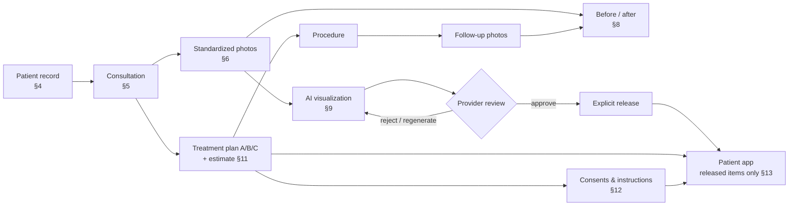
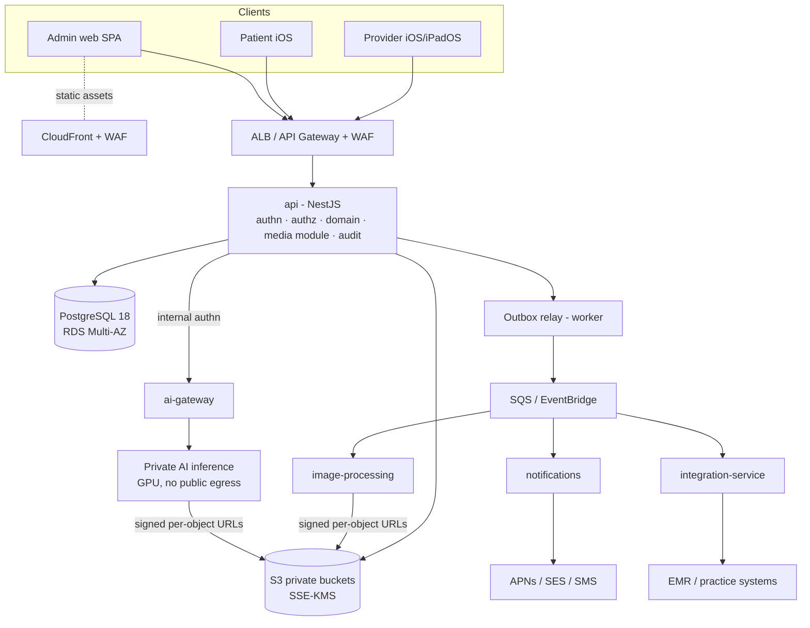
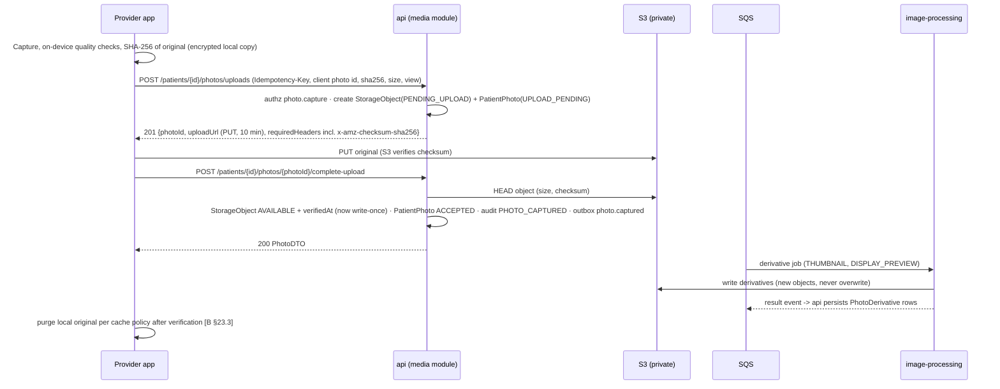

# Aesthetic Platform — Technical Specification

**Version 0.1 · Pre-Layer-0 baseline · 2026-09-25**

| Item | Value |
|---|---|
| Status | **DRAFT — awaiting owner review.** Nothing in this document is implemented yet. |
| Source of truth | `Aesthetic_Platform_Software_Production_Bible_v1.0.pdf` (repository root, 52 pages, dated 2026-09-25) |
| Authority | Production Bible **>** this specification. If they ever disagree, the Bible wins and this document gets corrected. |
| Purpose | Turn the Bible into an engineering-ready baseline: **tech stack**, **database schema**, **API contracts**. It also names every gap the Bible leaves open, so none of them gets quietly assumed in code. |
| Feeds | The Layer 0 documentation pack (Bible §31): `ARCHITECTURE_DECISIONS.md`, `DATABASE_SCHEMA.md`, `API_CONTRACTS.md`, `AUTHORIZATION_RBAC.md`, `SECURITY_REQUIREMENTS.md`, and others (see §9.2). |
| Companion files | [`technical-spec/schema.prisma`](technical-spec/schema.prisma): full draft relational schema (validated). [`technical-spec/constraints.sql`](technical-spec/constraints.sql): integrity rules Prisma cannot express (validated). [`technical-spec/verification/`](technical-spec/verification/): the checks behind §11, re-runnable. |

## Contents

0. [How to read this document](#0-how-to-read-this-document)
1. [What we are building](#1-what-we-are-building)
2. [Tech stack](#2-tech-stack)
3. [System architecture](#3-system-architecture)
4. [Identity, tenancy & authorization](#4-identity-tenancy--authorization)
5. [Database schema](#5-database-schema)
6. [API contracts](#6-api-contracts)
7. [Security, privacy & audit](#7-security-privacy--audit)
8. [Offline & synchronization contract](#8-offline--synchronization-contract)
9. [Build-layer mapping](#9-build-layer-mapping)
10. [Assumptions, unresolved decisions & proposals](#10-assumptions-unresolved-decisions--proposals)
11. [Verification report](#11-verification-report)

---

## 0. How to read this document

Every design statement is tagged with where it comes from. That keeps us honest about Bible §0.1: *"Do not silently invent product behavior when this Bible already specifies it"* and *"record it as an unresolved decision instead of burying an assumption in code."*

| Tag | Meaning |
|---|---|
| **[B §n]** | Specified by the Production Bible, section *n*. Not open to reinterpretation here. |
| **[P]** | **Proposed** by this specification: an engineering choice or a gap-filler the Bible does not dictate. Every [P] is listed for approval in §10.3. Nothing tagged [P] is locked until you approve it. |
| **[UD-nn]** | **Unresolved decision.** The Bible is silent or ambiguous, and choosing wrong would create a permanent dependency. §10.2 gives options and a recommendation for each. |

What this document is **not**: it isn't Layer 0. No repository skeleton, application code, migrations or UI are created here. Layer 0 (Bible §31) turns this baseline into the formal documentation pack and the repo skeleton, after you accept it.

---

## 1. What we are building

### 1.1 In one paragraph

A **visual consultation and patient-engagement platform for aesthetic medicine practices** [B §1]. Clinicians use an iPad/iPhone app to run a consultation end to end. They open the patient, capture **standardized clinical photographs** with live positioning guidance, and compare **before/after** images. They generate a **clinician-controlled AI visualization** of a possible aesthetic change, build **treatment plan options with estimates**, collect **versioned e-consents**, and assign **education and instructions**. Only what the clinician explicitly **releases** reaches the patient's own iPhone app, alongside secure messaging, appointments and telehealth. An admin web portal manages organizations, users, roles, content, integrations and audit. Everything is multi-tenant SaaS, built to grow from a pilot to thousands of practices [B §1.1].

### 1.2 Who uses what

| Surface | Users | What it does | Source |
|---|---|---|---|
| **Provider app** (iOS/iPadOS, iPad-landscape first) | Surgeons/physicians, nurses/injectors/aestheticians, photographers, consultants, front desk | Patient records, photo capture, consultations, before/after, AI visualization review, treatment plans, consents, messaging, telehealth | [B §2, §24] |
| **Patient app** (iOS) | Patients | Released consultations, simulations, photos, plans, documents, instructions, appointments, messages, telehealth; requested photo uploads; consent signing | [B §13] |
| **Admin web portal** | Organization/practice admins; platform operations | Orgs/practices/locations, users & roles, protocols, content, consent templates, catalog, AI model rollout, integrations, audit, security, feature flags | [B §17] |
| **Application API** | All first-party clients | Authentication, authorization, domain logic, versioned contracts, audit | [B §2] |
| **Media service** | Via the API only | Uploads, derivatives, signed access, retention, checksums, storage isolation | [B §2] |
| **AI platform** | Provider workflow via internal API | Quality checks, landmarks, segmentation, simulation, validation, provenance | [B §2, §9] |
| **Integration service** | Backend only | FHIR/HL7/vendor adapters, sync status, mapping, retries | [B §18] |

### 1.3 The core clinical flow



### 1.4 Non-negotiable guardrails, and where this spec enforces each one

These come from Bible §0.1, §1.2 and the Development Constitution (§30). Each one is enforced in at least two places: the database, the API or process controls.

| # | Guardrail | Enforced by |
|---|---|---|
| G1 | Tenancy is enforced server-side; client-supplied org IDs are never proof of entitlement [B §3.1] | Tenant bound into the access token (§4.2); tenant-scoped data access layer (§3.5); **composite foreign keys** that make cross-tenant links impossible in the database (§5.1, verified A1–A5); automated cross-tenant tests (§7.5) |
| G2 | Original clinical photos are never destructively edited [B §6.6] | Write-once `StorageObject` and immutable `PatientPhoto.originalObjectId` triggers (verified C1–C4); derivatives are separate immutable rows (C8–C9); S3 private bucket with versioning (§7.4) |
| G3 | No permission implies another; clinical consent never implies marketing/research/AI-training [B §7.1] | Independent permission rows per category (D3); append-only versioned history (D4–D7); export/release checks the *current* grant at use time and pins the exact version used (`MediaRelease.permissionId`) |
| G4 | Provider drafts and rejected/failed simulations are never exposed to patients [B §13.2, §34.2 #26] | Separate patient-portal API namespace with its own DTOs that can only select released states (§6.5); release requires `RELEASED_TO_PATIENT` with version/time/actor (E12–E13) |
| G5 | Simulations are never described as guaranteed or exact outcomes [B §9] | The mandatory disclaimer [B §9.1] is embedded server-side in every patient-facing simulation DTO (§6.6.4); product vocabulary is "simulation/visualization" |
| G6 | No automatic dosing, diagnosis, drug/product or technique recommendation [B §1.2, §9.6, §21.4] | Model versions carry an allow-listed `parameterSchema` with no dosage/product/technique fields; the registered version is immutable (E1); the API rejects unknown parameters |
| G7 | No PHI in logs, analytics, crash reports or push payloads [B §14.3, §21.2] | Push text is a fixed template key only (`Notification.templateKey`); allow-list log redaction; no PHI in URLs (search uses POST bodies); AI workers receive image references, never demographics (§7.2) |
| G8 | Explicit state machines instead of boolean clusters [B §19.1] | Every Appendix A state machine is a Postgres enum plus a server-side transition table (§5.4); status-to-timestamp CHECK constraints |
| G9 | Consents are versioned; executed documents never change [B §12.2] | Published template versions are frozen (F1–F6); executed assignments are frozen apart from void/supersede bookkeeping (F9–F12); signed snapshot + SHA-256 hash required for `COMPLETE` (F8) |
| G10 | Audit is immutable/tamper-resistant [B §21.2, §22] | `AuditEvent` append-only by trigger (G1–G3) plus DB grants plus export to WORM storage (§7.3) |
| G11 | A production AI model is never silently replaced [B §9.7] | Immutable `AIModelVersion` (E1); activation only via an explicit, audited `AIModelRollout`; one active version per scope (E3–E5) |
| G12 | Implement only the authorized layer, then stop [B §0.1, §30] | Process: this spec gives a per-layer table rollout (§9.1) so no layer ships tables or endpoints early |

### 1.5 Explicit non-goals for the first production build [B §1.2]

No automatic diagnosis. No prescribing of medication, product, dosage, injection depth or surgical technique. No visualization presented as an exact prediction. No replacement of billing, claims, e-prescribing or an enterprise EHR. No cross-practice patient data sharing. No 3D digital patient (deferred to Layer 11). No call recording (§16.2). No break-glass impersonation unless separately specified (§17.1).

### 1.6 Build layers [B §29]

| Layer | Scope | Exit condition |
|---|---|---|
| 0 Architecture Foundation | Monorepo plan, architecture docs, DB design, API conventions, security model, design system, IaC skeleton, ADRs | Architecture pack accepted; repo can be initialized reproducibly |
| 1 Identity, Tenancy, Patients | Auth, orgs, practices, locations, users, permissions, patient CRUD/search, audit, provider app shell | Cross-tenant tests pass; iOS login/patients work |
| 2 Photography Core | Protocols, sessions, camera, upload, immutable originals, derivatives, permissions | Standard photo session works end to end |
| 3 Consultations & Before/After | Consultation lifecycle, annotations, before/after, timeline | Consultation with standardized imagery is functional |
| 4 Documents, Consent, Education, Plans | Versioned docs/consents/content, plans/estimates | Patient-facing plan/document workflow is testable |
| 5 Patient App & Messaging | Patient auth, released content, secure messaging, notifications | Patient can securely access assigned/released records |
| 6 Telehealth & Scheduling | Appointments, telehealth workflow | Scheduled virtual consultation lifecycle works |
| 7 AI Infrastructure | AI gateway, model registry, quality, landmarks, segmentation, validation harness | Versioned AI jobs with provenance |
| 8 Outcome Simulation | Procedure-specific visualization engines, provider review/release | Initial validated simulation categories |
| 9 Similar Cases & Outcome Analysis | Historical case search, measured comparisons | Permission-safe similar-case workflow |
| 10 Integrations | FHIR/vendor adapters, sync monitoring | Selected partner integrations stable |
| 11 3D Digital Patient | Depth/multi-view model, 3D visualization | Separate approved product expansion |

---

## 2. Tech stack

Versions were checked against the npm registry and nodejs.org on **2026-09-25**. Layer 0 pins exact versions in lockfiles. "Source" shows whether the Bible mandates the choice.

### 2.1 Backend & data

| Area | Choice | Version | Source | Why |
|---|---|---|---|---|
| Runtime | Node.js **24 LTS "Krypton"** | 24.x | [B §31] "current supported LTS" | Active LTS today, supported to April 2028. Node 26 enters LTS in October 2026; re-evaluate at Layer 2. |
| Language | TypeScript | **6.0.x** | [B §25.1] | NestJS 12's CLI ships TypeScript ~6.0. TypeScript 7.0 (native compiler) is out but not yet supported by the NestJS toolchain (decorator metadata). Adopt 7.x when NestJS supports it. |
| Monorepo | **pnpm workspaces** + Turborepo | pnpm 12.x, turbo 2.x | [B §31] pnpm · [P] Turborepo | Turborepo adds cached, dependency-aware task runs across ~15 packages. It is optional and can be removed without changing structure. |
| API framework | **NestJS 12** on the **Fastify** adapter | @nestjs/core 12.1 | [B §25.1] NestJS · [P] Fastify | Nest gives modules, guards and interceptors that map directly onto authz/audit/tenancy. Fastify gives lower latency and schema-first request handling. |
| Contracts & validation | **Zod 4** schemas in `packages/api-contracts`, compiled to **OpenAPI 3.1** | zod 4.6, zod-to-openapi 9.1 | [P] | One source for runtime validation, TS types and the published OpenAPI document. DTOs are separate from DB models [B §20.3]. |
| Database | **PostgreSQL 18** (Amazon RDS, Multi-AZ) | ≥ 15 required, 18 targeted | [B §25.1] PostgreSQL · [P] version | `NULLS NOT DISTINCT` and partial indexes (constraints.sql) need ≥ 15. PG 18 has native `uuidv7()`. Confirm the RDS region supports 18 at Layer 0 (17 is an acceptable fallback). |
| ORM / migrations | **Prisma ORM 7** with the `@prisma/adapter-pg` driver adapter | 7.10 (stable) | [B §25.1] | Prisma 8 is at release-candidate stage (npm's `latest` tag currently points at 8.0.0-rc). **Do not adopt 8 until it is GA.** |
| Search | PostgreSQL `pg_trgm` + `btree_gin` (tenant-scoped trigram indexes) | — | [P] | Enough for patient search up to ~100 practices. Revisit OpenSearch at the ~100-practice tier [B §25.4]. |
| Object storage | **Amazon S3**, private, SSE-KMS, versioning, Block Public Access | — | [B §25.3] | No public buckets and no public CDN for patient media [B §21.2, §25.3]. |
| Queues & events | **SQS** (work queues) + **EventBridge** (domain events), fed by a **transactional outbox** | — | [B §25.3] · [P] outbox | The outbox (`OutboxEvent`) guarantees events are published only when the DB change commits: no lost or phantom events. |
| Workers | NestJS worker processes (same codebase, separate deployables) | — | [B §25.2] "worker" | Exports, sync, derivatives, retention jobs; the UI always exposes job status [B §22.4]. |
| Image processing | **Python 3.13** service using OpenCV + libvips (pyvips) | — | [P] · [UD-06] | Registration and alignment need OpenCV. Keeping all pixel work in one language avoids two imaging stacks. |
| AI gateway | NestJS (TypeScript) | — | [P] | Authenticated internal job API, model routing, provenance [B §25.2]. |
| AI inference | Python + PyTorch / ONNX Runtime in a **private** GPU environment (no public egress) | — | [B §2.1] "Private AI Jobs" · [UD-04] hosting | Patient images never go to third-party AI APIs unless a separately approved BAA-covered service is chosen. |
| Notifications | APNs (token auth), Amazon SES (email), AWS End User Messaging (SMS) | — | [P] | HIPAA-eligible AWS services; payloads are generic text only [B §14.3]. |
| Authentication | First-party OIDC-compatible auth module: `jose` (JWT), `@node-rs/argon2` (Argon2id), `otplib` (TOTP), `@simplewebauthn/server` (passkeys) | jose 6.2, argon2 2.2, otplib 13.5, simplewebauthn 14.0 | [B §21.1] OIDC-compatible · [UD-02] build vs buy | See §4.2. The schema supports either outcome. |
| Telehealth video | Vendor adapter (BAA-capable vendor) | — | [UD-05] | Layer 6 decision; the schema is vendor-agnostic (`TelehealthSession.vendor`). |
| Malware scanning | Scanning worker on quarantined uploads | — | [UD-22] | Required for patient uploads and attachments [B §13.4, §14.4]. |
| Logging | `pino` structured JSON with **allow-list** redaction | pino 10.3 | [B §26] · [P] | Only IDs and codes are logged, never request bodies. |
| Tracing & metrics | OpenTelemetry SDK → AWS Distro for OpenTelemetry → CloudWatch / X-Ray | @opentelemetry/sdk-node 0.222 | [B §26] · [P] | Distributed tracing using safe identifiers only. |

### 2.2 Clients

| Area | Choice | Source | Notes |
|---|---|---|---|
| iOS language & UI | Swift 6 language mode, SwiftUI, Swift Concurrency | [B §24.3] | Strict concurrency checking on from day one. |
| iOS frameworks | AVFoundation, Vision, CoreML, Metal, ARKit (future 3D only), CryptoKit, LocalAuthentication, Keychain, URLSession, BackgroundTasks | [B §24.3] | Vision/CoreML power on-device live capture guidance (pose, framing, blur, lighting). |
| iOS packages | Swift Package Manager, one local package per module from Bible §24.4 | [B §24.3–24.4] | 20 provider modules (AppShell … AuditSupport). Patient app reuses CoreNetworking, CoreSecurity, DesignSystem. |
| Xcode project generation | **Tuist** (Swift manifests) | [B §31] "reproducible method" · [P] | Built for heavily modular apps; XcodeGen is the fallback. |
| iOS API client | Apple **swift-openapi-generator** from the OpenAPI 3.1 contract | [P] | The client is generated, never hand-written, so it can't drift from the server. |
| iOS offline store | **GRDB** (SQLite) + **SQLCipher**, key held in Keychain; Data Protection class *Complete* | [B §23.3] "all cached sensitive data encrypted" · [P] | Explicit schema/migrations plus a deterministic mutation queue (§8). |
| Minimum OS | iOS/iPadOS **26** proposed | [UD-12] | Current major minus one at September 2026. Confirm against pilot practices' iPads. |
| Admin web | **React 19 + TypeScript + Vite 8** single-page app, TanStack Router/Query, generated TS client | [UD-01] | The Bible does not name a web framework. A static SPA fits "CloudFront/WAF (admin/public static assets only)" [B §25.3]: no server-side rendering tier handles PHI. |

### 2.3 Infrastructure, delivery & quality

| Area | Choice | Source |
|---|---|---|
| Cloud | AWS, HIPAA-eligible services only, under the customer's/operator's BAA [B §21.3, §25.3] | [B] |
| Compute | Docker images in ECR; ECS on **Fargate** for API/workers; ECS on **EC2 GPU** capacity (or SageMaker, UD-04) for inference | [B §25.1, §25.3] |
| Edge | CloudFront + AWS WAF for admin static assets only; API via ALB (or API Gateway) with WAF rate rules | [B §25.3] |
| Secrets & keys | AWS Secrets Manager; KMS customer-managed keys per environment (envelope encryption) | [B §21.2] |
| IaC | **Terraform** (AWS provider), one root module per environment: dev / staging / production | [B §25.1, §28.1] |
| CI/CD | **GitHub Actions** (repo is on GitHub). Gates from [B §28.2]: format/lint, typecheck, unit/API/DB tests, migration validation, dependency scan (OSV-Scanner + Dependabot), container scan (Trivy), `terraform validate`/`tflint`/`checkov` plus plan review, iOS build/tests on macOS runners | [B §28.2] · [P] tools |
| Test tooling | Vitest (unit/domain), **Testcontainers** + real PostgreSQL (DB/API/authz/tenant tests, never mocks for authz), Playwright (admin web E2E), Swift Testing/XCTest + XCUITest (iOS) | [B §27.1] · [P] tools |
| Local development | Docker Compose: `postgres:18`, LocalStack (S3, SQS, EventBridge, KMS, Secrets Manager), a local SMTP catcher | [P] |

### 2.4 Deliberately *not* in the stack

- **No public CDN caching of patient media**, and no permanent public URLs [B §21.2, §25.3].
- **No third-party analytics, session-replay or crash SDKs that can capture PHI.** iOS crash diagnostics use MetricKit; any vendor tool needs a BAA plus PHI scrubbing, and approval.
- **No third-party generative-AI API receiving patient images** without a separately approved, BAA-covered decision (UD-04).
- **No payment processor, ledger or claims engine** [B §11.3]. Estimates plus references only.
- **No GraphQL.** The Bible's contract rules (§20) are REST resource conventions, and one contract style keeps authorization review tractable.

---

## 3. System architecture

### 3.1 Services and responsibilities [B §2.1, §25.2]

| Deployable | Responsibility | Talks to | Touches PostgreSQL? |
|---|---|---|---|
| `services/api` | All public REST endpoints (`/api/v1`, `/api/v1/portal`), authn/authz, domain logic, audit, outbox. **Includes the media module** (upload intents, signed URLs, storage ledger) [B §25.2 allows "media-service *or* media module"] [P] | PostgreSQL, S3, SQS/EventBridge, ai-gateway (internal) | **Yes: sole owner of the schema** |
| `worker` (same codebase as api, separate process) | Outbox relay, exports, retention jobs, sync orchestration, notification fan-out, permission-expiry job | PostgreSQL, S3, SQS | Yes |
| `services/image-processing` | Thumbnails, display previews, normalization, before/after registration, annotated/export renders | SQS (jobs in/results out), S3 (signed, per-object access) | **No** [P] |
| `services/ai-gateway` | Internal AI job API, model routing via the active rollout, provenance capture, validation harness | api (internal), SQS, inference environment | **No** [P]: reports results as events the api persists |
| AI inference (private) | Quality, landmarks, segmentation, simulation, identity-similarity, artifact detection | ai-gateway only | **No** |
| `services/notifications` | APNs / email / SMS delivery of generic templates | SQS, providers | No |
| `services/integration-service` | FHIR / vendor / CSV adapters behind one `IntegrationAdapter` interface [B §18.1] | api (internal), SQS, external EMRs | No [P]: mappings persisted by api |

**Minimum-necessary principle [P]:** only `api`/`worker` can read patient demographics. Imaging and AI services receive **opaque object references plus job parameters**. They never receive a name, date of birth or MRN, and they cannot query the database. That keeps PHI exposure in the AI environment to the images themselves.

### 3.2 Component diagram



### 3.3 Request pipeline: every authenticated call [B §3.3, §20.3, §22]

1. **Edge:** WAF rate rules and TLS termination. The gateway injects nothing trusted.
2. **Request ID:** a server-generated `X-Request-Id` (UUIDv7) is attached to logs, traces, audit rows and the error envelope.
3. **Authentication:** verify the access token (signature, expiry, audience) and load the `Session`. A revoked, expired or idle session means **401**.
4. **Tenant context:** `organizationId` comes **only** from the verified session/token, never from a header, body or path parameter. The membership must be `ACTIVE`.
5. **Permission guard:** the required permission is declared on each route (e.g. `@RequirePermission('patient.read')`), and effective permissions are computed server-side from `UserRole` scope (§4.6).
6. **Resource scoping:** the data layer adds `organizationId` (and practice scope) to every query. A resource the caller can't see returns **404 with a generic message**, the same response whether it doesn't exist or belongs to another tenant [B §20.3 "no patient enumeration"].
7. **Validation:** Zod schema from `api-contracts`; unknown fields are rejected.
8. **Concurrency and idempotency:** check `If-Match` and `Idempotency-Key` where required (§6.1).
9. **Domain logic:** state transitions go through a single transition table per aggregate (§5.4); invalid transitions return **409 INVALID_STATE_TRANSITION** [B §5.2].
10. **Same transaction:** the state change, the `AuditEvent` row and any `OutboxEvent` rows commit together, or none do.
11. **Response:** a DTO mapper (never the Prisma model) with `ETag` where applicable, and `Cache-Control: no-store` on PHI responses.

### 3.4 Key flows

**A. Photo capture and upload [B §6.3, §6.6]**



**B. AI visualization [B §9.2–9.3, §34.2]**

1. `POST /patients/{id}/simulations` (`simulation.create`) creates the Simulation `DRAFT` with source photos. The server checks that each source is the **same patient**, `ACCEPTED`, and has `CLINICAL_USE`/`INTERNAL_AI_EVALUATION` permission as the model requires.
2. `POST …/{simId}/generate` (`simulation.generate`, `Idempotency-Key` **required**) validates provider parameters against the active model version's allow-list. It then creates a `SimulationVersion` plus an `AIJob` (`QUEUED`), sets the Simulation to `QUEUED`, and writes audit `SIMULATION_GENERATED`.
3. ai-gateway runs input quality → landmarks → segmentation → identity representation → constrained transformation → outside-region identity similarity → artifact detection → output validation, with every check persisted as an `AIValidationRecord`. The status moves `PROCESSING` → `VALIDATING` → `READY_FOR_PROVIDER_REVIEW`, or `FAILED` with a **safe, actionable** error code (e.g. `INPUT_QUALITY_INSUFFICIENT`) [B §34.2 #24].
4. The provider approves (`simulation.approve`), rejects, or regenerates (new version). Approval does **not** release anything.
5. `POST …/{simId}/release` (`simulation.release`) is a **separate explicit action** [B §34.2 #28]. It requires `APPROVED` plus the release rules (§5.4.2) and writes audit `SIMULATION_RELEASED`. The patient-portal DTO always carries the Bible §9.1 disclaimer.

**C. Patient photo upload intake [B §13.4]:** provider creates a `PhotoRequest` → patient uploads through the portal (the object lands `QUARANTINED`) → malware and file-type validation → `PENDING_REVIEW` → staff `ACCEPTED` (enters the clinical record) or `RETAKE_REQUESTED`/`REJECTED`, with every step audited.

**D. Integration sync [B §18]:** a manual, scheduled or webhook trigger creates an `EMRSyncEvent` (`PENDING`, with idempotency key). The adapter maps canonical resources, upserts idempotently via `IntegrationMapping`, and records conflicts (`CONFLICT_DETECTED`, never silently overwritten). Failed records go to `IntegrationDeadLetter` (payload encrypted in S3), and the run ends `SUCCEEDED`/`PARTIAL`/`FAILED` → `RETRY_SCHEDULED` with backoff.

### 3.5 Tenant isolation in depth [B §3.1, §21.2, §36]

| Layer | Mechanism | Status |
|---|---|---|
| 1. Identity | Tenant bound to the session and access token at org selection; switching org issues new tokens | [P] |
| 2. Guard | Membership must be `ACTIVE`; permission evaluated for that org only | [B §3.3] |
| 3. Data access | Tenant-scoped repository layer: a Prisma client extension **requires** a tenant context and injects `organizationId` into every query on tenant-owned models. Unscoped access is only possible through an explicitly named platform repository (used by SUPER_ADMIN tooling and migrations). | [P] |
| 4. Database | **Composite foreign keys** `(organizationId, …)` on every parent/child link. The database rejects cross-tenant links even if application code has a bug (verified A1–A5, C5, D9, E6, F7). | [P] |
| 5. Database (optional) | PostgreSQL Row-Level Security keyed on `SET LOCAL app.organization_id`, as a second net | [UD-03] |
| 6. Tests | Every tenant-scoped endpoint is run by an automated cross-tenant test generator (tenant B credentials against tenant A IDs must return 404, with no timing or message difference) | [B §27.1, §36] |

---

## 4. Identity, tenancy & authorization

### 4.1 Tenant hierarchy [B §3.1]

`PLATFORM → ORGANIZATION → PRACTICE → LOCATION`

- **Tenant-owned** (carries `organizationId`): everything patient-related, plus clinical, content, configuration, integration and storage records.
- **Platform-level** (no `organizationId`, by design): `User` (one person may work for several organizations), `Permission` (catalog), system `Role`s, `AIModel`/`AIModelVersion` (registry), and platform-default `FeatureFlag`/`AIModelRollout` rows.
- Practice/location scoping is added where operationally relevant: appointments, consultations, procedures, sessions, settings, role assignments.

### 4.2 Authentication [B §21.1] (design depends on [UD-02])

| Concern | Design |
|---|---|
| Protocol | OAuth 2.1 / OIDC-compatible token semantics. First-party native apps use the token endpoint with PKCE-style proof. The admin SPA uses the same with a refresh token held in memory plus a `SameSite=Strict` HttpOnly cookie. Enterprise SSO (SAML/OIDC federation for large organizations) can be added later behind an identity-provider adapter. [P] |
| Credentials | Argon2id password hashes; TOTP and WebAuthn/passkeys as second factors (`UserCredential`). **MFA required for admin web and any admin role** per deployment policy [B §21.1] (`OrganizationSetting security.mfaPolicy`). [P] |
| Access token | Signed JWT (ES256, key in KMS). Claims: `sub` (user), `sid` (session), `org` (active organization), `app` (client), `amr`. **Lifetime 10 min.** Permissions are *not* embedded: they are evaluated per request so revocation takes effect immediately. [P] |
| Refresh token | Opaque, stored only as a hash on `Session`, **rotated on every use**. Presenting an older generation is treated as theft: the whole session is revoked with reason `REFRESH_TOKEN_REUSE`. [P] |
| Session policy defaults | Provider app: idle 8 h, absolute 7 d, Face ID/Touch ID re-auth after 5 min in background. Admin web: idle 30 min, absolute 12 h. Patient app: idle 30 d, absolute 90 d, biometrics optional. All configurable per organization. [P] · [UD-18] |
| Biometric re-auth | Refresh token stored in Keychain with access control `.biometryCurrentSet` (plus device passcode fallback); LocalAuthentication gates the app unlock and step-up actions (signing, export) on-device [B §21.1]. The server additionally requires a recent `mfaVerifiedAt` for designated sensitive actions. [P] |
| Revocation | Server-side: `Session.revokedAt`, device revocation cascades to its sessions, and user disable / membership disable revokes all sessions → audit `SECURITY_SESSION_REVOKED` [B §21.1, §22.1]. |
| Organization switch | `PUT /auth/session/organization` re-checks membership and issues new tokens bound to the new org. |
| Login audit | Each attempt writes a `LoginEvent` (security ledger) **and** an `AuditEvent` `LOGIN_SUCCESS`/`LOGIN_FAILURE`/`LOGOUT`. Identical client-facing error for unknown user versus bad password (no account enumeration). |

### 4.3 Roles [B §3.2]

System roles are defined once at platform level (`Role.organizationId = NULL`), one key per Bible row:

`SUPER_ADMIN` · `ORGANIZATION_ADMIN` · `PRACTICE_ADMIN` · `SURGEON_PHYSICIAN` · `NURSE_INJECTOR_AESTHETICIAN` · `PHOTOGRAPHER` · `CONSULTANT` · `FRONT_DESK` · `MARKETING` · `PATIENT`

Assignments (`UserRole`) carry an explicit **scope**: `PLATFORM` (SUPER_ADMIN only), `ORGANIZATION`, `PRACTICE` or `LOCATION` (DB-enforced shape, verified B2–B5). Whether organizations may define **custom roles** is [UD-07]; the schema already supports it (`Role.organizationId` non-null).

### 4.4 Permission catalog

**Bible permissions [B §3.3]: 41 keys, seeded exactly:**

| Domain | Keys |
|---|---|
| Patient | `patient.read` `patient.create` `patient.update` `patient.archive` |
| Photo | `photo.capture` `photo.view` `photo.annotate` `photo.export` `photo.permission.read` `photo.permission.manage` |
| Consultation | `consultation.create` `consultation.edit` `consultation.complete` |
| Simulation | `simulation.create` `simulation.generate` `simulation.review` `simulation.approve` `simulation.release` |
| Treatment plan | `treatmentplan.create` `treatmentplan.edit` `treatmentplan.send` |
| Consent | `consent.template.manage` `consent.assign` `consent.sign.provider` `consent.void` |
| Communication | `message.send` `appointment.manage` `telehealth.start` |
| Users & roles | `user.read` `user.create` `user.update` `user.disable` `role.read` `role.assign` |
| Practice | `practice.read` `practice.manage` |
| Content | `content.read` `content.manage` |
| Integration | `integration.read` `integration.manage` |
| Audit | `audit.read` |

**Gaps [UD-16]:** several Bible-required capabilities have no permission key in §3.3. Change control (Bible §0) says permission changes must be documented before implementation, so these are **proposals, not defaults**:

| Capability (Bible source) | Proposed resolution [P] |
|---|---|
| Create/manage organizations (§17.1; SUPER_ADMIN / ORGANIZATION_ADMIN) | New `organization.read`, `organization.manage` |
| Read consultations, plans, messages, appointments (only write keys exist) | **Map, don't add:** reads require the domain's lowest write key *or* `patient.read` plus a clinical key. Proposal: `consultation.create` implies read of consultations; `message.send` implies read of threads the user participates in; `appointment.manage` covers reads. Keeps the catalog as the Bible wrote it. |
| Photography protocols, treatment catalog, appointment types (§17.1) | Use existing `practice.manage` |
| Documents (upload/release non-consent documents) (§12, §13.2) | New `document.manage` (read covered by `patient.read`) |
| Education/instruction assignment (§12.5–12.6) | Use `content.read` to assign, `consultation.edit` to clinically complete instructions |
| Patient photo intake review (§13.4) | Use `photo.capture` |
| Procedures (§4.3, §13.1) | New `procedure.manage` |
| Patient data export (§22.4) | New `data.export` |
| Session/device revocation by admins (§17.1 "Security/session/device administration") | New `security.manage` |
| AI model registry & rollout (§17.1) | New `ai.model.read`, `ai.model.manage` (platform scope only for manage) |
| Feature flags & settings (§17.1) | New `configuration.manage` |
| Similar-case search (§10) | New `similarcase.search` (Layer 9) |
| Marketing library access (§3.2 MARKETING) | New `marketing.library.read`: only assets with a current `MediaRelease` for WEBSITE / SOCIAL_MEDIA / PAID_ADVERTISING |

### 4.5 Proposed default role → permission matrix [P] · [UD-17]

The Bible gives each role's *typical scope* [B §3.2] but no matrix. Layer 1 needs one to seed roles. This proposal follows the Bible's wording literally and errs on the side of **least privilege**. Practices can grant more once custom roles exist (UD-07).

Legend: ● granted · ○ granted within the assignment's practice/location scope · — not granted. Columns: **SA** SUPER_ADMIN, **OA** ORGANIZATION_ADMIN, **PA** PRACTICE_ADMIN, **SP** SURGEON_PHYSICIAN, **NI** NURSE_INJECTOR_AESTHETICIAN, **PH** PHOTOGRAPHER, **CO** CONSULTANT, **FD** FRONT_DESK, **MK** MARKETING.

| Permission | SA | OA | PA | SP | NI | PH | CO | FD | MK |
|---|---|---|---|---|---|---|---|---|---|
| patient.read | — | — | ○ | ● | ● | ● | ● | ● | — |
| patient.create | — | — | ○ | ● | ● | — | ● | ● | — |
| patient.update | — | — | ○ | ● | ● | — | ● | ● | — |
| patient.archive | — | — | ○ | ● | — | — | — | — | — |
| photo.capture | — | — | — | ● | ● | ● | — | — | — |
| photo.view | — | — | — | ● | ● | ● | ● | — | — |
| photo.annotate | — | — | — | ● | ● | — | — | — | — |
| photo.export | — | — | — | ● | — | — | — | — | ● ¹ |
| photo.permission.read | — | — | — | ● | ● | ● | ● | — | — |
| photo.permission.manage | — | — | — | ● | ● | — | — | — | — |
| consultation.create | — | — | — | ● | ● | — | ● | — | — |
| consultation.edit | — | — | — | ● | ● | — | ● | — | — |
| consultation.complete | — | — | — | ● | — | — | — | — | — |
| simulation.create | — | — | — | ● | ● | — | — | — | — |
| simulation.generate | — | — | — | ● | ● | — | — | — | — |
| simulation.review | — | — | — | ● | ● | — | ● ² | — | — |
| simulation.approve | — | — | — | ● | — | — | — | — | — |
| simulation.release | — | — | — | ● | — | — | — | — | — |
| treatmentplan.create | — | — | — | ● | ● | — | ● | — | — |
| treatmentplan.edit | — | — | — | ● | ● | — | ● | — | — |
| treatmentplan.send | — | — | — | ● | — | — | ● | — | — |
| consent.template.manage | — | ● | ○ | — | — | — | — | — | — |
| consent.assign | — | — | — | ● | ● | — | ● | — | — |
| consent.sign.provider | — | — | — | ● | — | — | — | — | — |
| consent.void | — | — | — | ● | — | — | — | — | — |
| message.send | — | — | — | ● | ● | — | ● | — | — |
| appointment.manage | — | — | ○ | ● | ● | — | ● | ● | — |
| telehealth.start | — | — | — | ● | ● | — | — | — | — |
| user.read | ● | ● | ○ | — | — | — | — | — | — |
| user.create | ● | ● | ○ | — | — | — | — | — | — |
| user.update | ● | ● | ○ | — | — | — | — | — | — |
| user.disable | ● | ● | ○ | — | — | — | — | — | — |
| role.read | ● | ● | ○ | — | — | — | — | — | — |
| role.assign | ● | ● | ○ ³ | — | — | — | — | — | — |
| practice.read | ● | ● | ○ | ● | ● | ● | ● | ● | — |
| practice.manage | — | ● | ○ | — | — | — | — | — | — |
| content.read | — | ● | ○ | ● | ● | — | ● | — | — |
| content.manage | — | ● | ○ | — | — | — | — | — | — |
| integration.read | ● | ● | — | — | — | — | — | — | — |
| integration.manage | — | ● | — | — | — | — | — | — | — |
| audit.read | ● ⁴ | ● | ○ | — | — | — | — | — | — |

¹ MARKETING exports only assets that already have a current purpose-specific release and grant [B §3.2, §7.3]. It has **no** `patient.read`.
² CONSULTANT sees simulations for discussion but cannot approve or release ("without implicit clinical authority" [B §3.2]).
³ PRACTICE_ADMIN may assign only roles at or below its own scope, never ORGANIZATION_ADMIN or SUPER_ADMIN.
⁴ SUPER_ADMIN reads **platform-level** audit only. It holds no `patient.*` permission, so platform operators cannot browse patient records [B §17.2]. Support access to a tenant is a separate, time-bound, audited grant that is **not in scope** until specified [B §17.1].

`PATIENT` holds no staff permission; patient access is governed by §4.7.

### 4.6 Authorization evaluation [B §3.3] [P]

```
authorize(request, requiredPermission, resource):
  session   = verifyAccessToken(request)                 // 401 on failure
  org       = session.organizationId                     // never from client input
  member    = Membership(org, session.userId) ACTIVE     // 401 SESSION_INVALID if not
  grants    = UserRole where user=session.userId, org=org, revokedAt IS NULL
  if resource has practice/location:
      applicable = grants where scope = ORGANIZATION
                   or (scope = PRACTICE and practiceId = resource.practiceId)
                   or (scope = LOCATION and locationId = resource.locationId)
  else applicable = grants
  if requiredPermission ∉ permissions(applicable.roles):
      if caller cannot even see the resource -> 404 <RESOURCE>_NOT_FOUND (generic)
      else                                    -> 403 PERMISSION_DENIED
      audit ACCESS_DENIED [P]
  load resource WITH organizationId = org (and scope filter)  // 404 if absent
```

Patient records are organization-level with an optional primary practice. **Which practice-scoped staff can see which patients is [UD-09]** and must be decided before Layer 1 builds patient search.

### 4.7 Patient-app authorization [B §13.2]

A `PATIENT`-kind user reaches data only through an `ACTIVE` `PatientUserLink` for the org in their token. Every portal query is filtered by `patientId = link.patientId` **and** by the item's release predicate:

| Item | Visible to the patient only when |
|---|---|
| Consultation summary | Summary `Document` has `releasedToPatientAt` set |
| Simulation | `status = RELEASED_TO_PATIENT`, via `releasedVersionId` only; `READY_FOR_PROVIDER_REVIEW`/`REJECTED`/`FAILED` never [B §34.2 #26] |
| Photo / before-after | Current `PATIENT_APP` grant **and** an unrevoked `MediaRelease` with purpose `PATIENT_APP` [B §7.3] |
| Treatment plan | `status ∈ {SENT_TO_PATIENT, VIEWED, ACCEPTED, DECLINED, EXPIRED, SCHEDULED, COMPLETED}` |
| Consent | `status ≠ DRAFT` (assigned to the patient) |
| Instruction / education | Assigned (`PatientInstruction.releasedToPatientAt` / `ContentAssignment`) |
| Messages | Participant in the thread |

---

## 5. Database schema

The complete, validated draft lives in **[`technical-spec/schema.prisma`](technical-spec/schema.prisma)** (86 models, 82 enums). The rules Prisma cannot express are in **[`technical-spec/constraints.sql`](technical-spec/constraints.sql)**. This section explains the design. The files are the precise definition.

### 5.1 Conventions [B §19.1]

| Rule | Implementation |
|---|---|
| UUID identifiers [B] | Every primary key is a **UUIDv7** (time-ordered, index-friendly) in a native `uuid` column. Generated by the Prisma client (`@default(uuid(7))`). Offline-capable records may be created with a **client-generated** UUIDv7 (§8). |
| Tenant ownership [B] | Every tenant-owned table has `organizationId`. |
| **Composite foreign keys** [P] | Every child references its parent by `(organizationId, parentId)`, or `(organizationId, patientId, parentId)` where the Bible demands same-patient guarantees (before/after, simulation sources, consents, permissions). Parents expose a matching `@@unique([organizationId, id])`. **Result: the database physically cannot store a cross-tenant or cross-patient link.** Provider fields reference `ProviderProfile(organizationId, userId)`, so a provider from another tenant can't be attached to a record. |
| Foreign keys & indexes [B] | 275 foreign keys. Every FK is covered by a unique or composite index. Tenant-leading indexes support list queries (`organizationId, patientId, createdAt`). Deliberate exception: `AuditEvent` has **no** FKs (append-only, partition-ready, must outlive the rows it references). |
| Timestamps & authorship [B] | `createdAt`/`updatedAt` as `timestamptz(3)`, stored in UTC. Authorship columns (`createdById`, `capturedByUserId`, `reviewerUserId`, …) where clinically or operationally meaningful. |
| State machines, not booleans [B] | Each Appendix A object has a Postgres enum and a transition table (§5.4). CHECK constraints tie states to their required timestamps and actors (e.g. `COMPLETED` needs `completedAt` and `completedById`). |
| JSON only for flexible metadata [B] | `Json` is used only for: consent builder blocks, annotation vector layers, capture/quality metadata, AI configs/scores, adapter configs, settings values, frozen snapshots. **Never** for relationships, statuses or anything queried relationally. |
| Soft delete is not access control [B] | No generic `deletedAt` filter. Lifecycle is explicit (`ARCHIVED` states, `retiredAt`, `supersededAt`, `revokedAt`), and authorization never depends on a deletion flag. Clinical rows are never hard-deleted by application code. Removal follows retention policy (§5.7). |
| Optimistic concurrency [B §20.3] | Concurrently editable records carry `version Int`, exposed as the `ETag` and checked via `If-Match` (§6.1.7). |
| Money | `Decimal(12,2)` plus ISO-4217 `currency`. Totals are computed server-side; clients never submit totals. |
| Immutability | Enforced **in the database** by triggers (error `AE001` → API `409 IMMUTABLE_RECORD`): originals, storage objects, derivatives, document versions, published template versions, executed consents, signatures, completed simulation versions, model versions, permission history, audit and login ledgers. |
| Naming | Physical names equal the Prisma names (PascalCase tables, camelCase columns) so the spec, ORM and SQL line up 1:1. Switching to snake_case via `@@map` is a one-time choice to make before the first migration [UD-26]. |

### 5.2 Entity catalog

**86 tables:** all **70 entities named in Bible §19**, plus **16 supporting tables** that other Bible sections require (marked ✚; each cites its source). Bible §19: *"at minimum the following entities."*

#### Identity & tenancy (11 + 1)

| Entity | Purpose | Key relations & rules | Layer |
|---|---|---|---|
| User | Platform-level identity (workforce or patient) | Unique `(kind, email)`; not tenant-owned; status `INVITED/ACTIVE/LOCKED/DISABLED` | 1 |
| Organization | Top tenant | Unique `slug` | 1 |
| Practice | Operating unit of an org | Unique `(organizationId, name)`; IANA `timezone` | 1 |
| Location | Physical site of a practice | FK `(organizationId, practiceId)` | 1 |
| Membership | User ↔ organization; `user.disable` acts here | Unique `(organizationId, userId)` | 1 |
| Role | System (org NULL) or custom role | System keys unique (partial index) | 1 |
| Permission | Catalog of permission keys | Unique `key`; seeded from §4.4 | 1 |
| RolePermission | Role → permission grants | PK `(roleId, permissionId)` | 1 |
| UserRole | Scoped role assignment | Scope shape CHECK; requires membership (composite FK); one active duplicate max | 1 |
| Device | Registered app install, APNs token | Unique `(userId, installationIdHash)`; revocable | 1 |
| Session | Server-side session, rotating refresh token | Revocation reason required when revoked | 1 |
| ✚ UserCredential | Password / TOTP / passkey (conditional on UD-02) | Shape CHECK per type; one active password | 1 |

#### Provider & patient (6 + 1)

| Entity | Purpose | Key relations & rules | Layer |
|---|---|---|---|
| ProviderProfile | Clinical identity within an org (credentials, NPI, bookable) | FK `(organizationId, userId)` → Membership; target of every "provider" field | 1 |
| StaffProfile | Non-clinical staff profile | FK → Membership | 1 |
| Patient | Bible §4.2 minimum entity | Unique `(organizationId, mrn)`; trigram search indexes; `ARCHIVED` ⇔ `archivedAt` | 1 |
| PatientContact | Emergency contact / guardian / caregiver | FK → Patient | 1 |
| PatientMedicalHistory | Allergies, medications, conditions, prior procedures | Category enum; source (staff / intake / integration) | 3 |
| PatientConcern | Aesthetic concern by area | Linked to consultations | 3 |
| ✚ PatientUserLink | Patient-app account ↔ patient record (§13) | Unique `(organizationId, patientId, userId)`; `INVITED/ACTIVE/REVOKED` | 5 |

#### Scheduling & consultation (8 + 2)

| Entity | Purpose | Key relations & rules | Layer |
|---|---|---|---|
| Appointment | §15.1 fields incl. timezone, source system, external ID | Location must belong to the practice (3-column FK); `endsAt > startsAt`; integration source needs mapping | 6 ³ |
| Consultation | §5 workflow container | State machine §5.4.1 | 3 |
| ConsultationNote | Clinical notes (offline-draftable) | `FINAL` ⇔ `finalizedAt`; [P] FINAL immutable | 3 |
| Procedure | Planned/performed procedure ("Procedures" tab) | Optional link to the accepted plan item (1:1) | 4 |
| Treatment | Org treatment/procedure catalog | Unique `(organizationId, code)`; maps to simulation category | 4 |
| TreatmentCategory | Catalog hierarchy | Self-FK within tenant | 4 |
| TreatmentPlan | One option (Plan A/B/C) | State machine §5.4.3; server-computed totals ≥ 0 | 4 |
| TreatmentPlanItem | Line: treatment, area, provider, qty, price, discount | Amount CHECKs | 4 |
| ✚ AppointmentType | Practice-configurable appointment types (§15.1 "appointment type") | `isTelehealth` flag | 6 |
| ✚ ConsultationConcern | Concerns selected for a consultation (§5.1) | Same-patient composite FKs | 3 |

³ Appointment tables may be created in Layer 3 if consultations need scheduling links earlier. See §9.1.

#### Photography & media (10 + 2)

| Entity | Purpose | Key relations & rules | Layer |
|---|---|---|---|
| PhotographyProtocol | Standard or custom protocol | Standard protocols (§6.2) seeded per org; frozen when `ACTIVE`, changes supersede | 2 |
| PhotographyProtocolView | Required/optional view + capture instructions + pose target | Unique `(protocolId, viewKey)` | 2 |
| PhotoSession | Capture session (patient, protocol, capturer, time, optional consultation/procedure/location) | Offline client IDs | 2 |
| PatientPhoto | Clinical photo record → immutable ORIGINAL | Original, patient and capture time immutable (trigger) | 2 |
| PhotoDerivative | THUMBNAIL … EXPORT_DERIVATIVE (§6.6) | Immutable; references source photo + generation metadata | 2 |
| PhotoAnnotation | Vector annotation layer (never burned into the original) | Offline client IDs | 3 |
| PhotoTag | Free-form photo tags | Unique `(photoId, tag)` | 2 |
| PhotoPermission | Versioned permission per category (§7) | Append-only; one *current* row per scope (partial unique) | 2 |
| MediaRelease | Asset released/exported for a purpose, pinned to the permission version | Exactly one subject; only revocation may change | 2 |
| BeforeAfterSet | Before + after of the **same patient** (§8) | Composite FKs incl. `patientId`; photos must differ | 3 |
| ✚ StorageObject | Ledger of every S3 object (Media Service §2: checksum, retention, isolation) | Write-once after verification; key never exposed via API | 2 |
| ✚ PhotoRequest | Provider request for patient photos (§13.4) | `OPEN → SUBMITTED → COMPLETED` [P] | 5 |

#### AI (10 + 3)

| Entity | Purpose | Key relations & rules | Layer |
|---|---|---|---|
| AIModel | Registry entry (platform-level) | Unique `key` | 7 |
| AIModelVersion | Immutable version: artifact digest, parameter allow-list, thresholds, intended use | Immutable except lifecycle status | 7 |
| AIJob | Any AI/imaging job with idempotency key | Unique `(organizationId, idempotencyKey)` | 7 |
| AIValidationRecord | Per-check evidence (quality, identity similarity, artifacts, benchmarks) | Tenant required for job/output records | 7 |
| Simulation | Canonical §9.3 state machine | Release requires version, time and actor | 8 |
| SimulationVersion | One generation attempt with full provenance (§9.4) | Provenance immutable; fully immutable after completion | 8 |
| SimulationParameter | Provider-set parameter (allow-listed) | Exactly one value | 8 |
| SimulationApproval | Append-only review decisions | Version must belong to the same simulation | 8 |
| SimilarCaseMatch | Which historical cases were shown, when, to whom (§10) | — | 9 |
| OutcomeMeasurement | Measured comparison values (Layer 9) | Method + model provenance | 9 |
| ✚ AIModelRollout | Which version is active, platform-wide or per org (§9.7 rollback, §17.1 rollout) | One `ACTIVE` per (model, org), NULLs included | 7 |
| ✚ SimulationVersionSource | Source asset IDs per generation (§9.4, §34.2 #23) | Same-patient composite FK | 8 |
| ✚ CaseLibraryEntry | Consented historical case in the library (§10) | Pinned to authorizing permission | 9 |

#### Documents, consents, instructions & education (9 + 1)

| Entity | Purpose | Key relations & rules | Layer |
|---|---|---|---|
| ConsentTemplate | Template identity | — | 4 |
| ConsentTemplateVersion | Builder blocks (§12.1); publish freezes content | One open DRAFT; published immutable; `contentHash` | 4 |
| ConsentAssignment | Consent issued to a patient (§12.4 state machine) | `COMPLETE` needs snapshot + hash; executed = frozen | 4 |
| ConsentSignature | Patient / provider / witness signature | Append-only; idempotency key; one per role | 4 |
| Document | Patient document (summary, signed consent, upload, …) | Release timestamp gates patient visibility | 3–4 |
| DocumentVersion | Immutable file version + SHA-256 | Immutable | 3–4 |
| PatientInstruction | Versioned instruction by procedure **or** consultation | Acknowledgment separate from clinical completion | 4 |
| EducationContent | Org content library item (original or licensed content only) | — | 4 |
| ContentAssignment | Assigned/opened/viewed/completed/acknowledged tracking (§12.5) | — | 4 |
| ✚ EducationContentVersion | Versioned content (Layer 4 "versioned … content") | One open DRAFT; published frozen | 4 |

#### Communication (6)

| Entity | Purpose | Key relations & rules | Layer |
|---|---|---|---|
| MessageThread | Thread owned by org + patient (§14.1) | — | 5 |
| ThreadParticipant | Membership in a thread (required for access) | Unique `(threadId, userId)` | 5 |
| Message | Text + references to documents/instructions | `DRAFT/SENT/DELIVERED/READ/FAILED`; retry metadata | 5 |
| MessageAttachment | Scanned file with signed, short-lived access | 1:1 StorageObject | 5 |
| Notification | Generic-template push/email/SMS/in-app | **No content field exists**, only `templateKey` | 5 |
| TelehealthSession | §16 session; **no recording field by design** | 1:1 appointment; host is a ProviderProfile | 6 |

#### Integration & audit (5 + 3)

| Entity | Purpose | Key relations & rules | Layer |
|---|---|---|---|
| Integration | Adapter instance, non-secret config, `secretRef`, system-of-record set | — | 10 |
| IntegrationMapping | External ID ↔ local ID, field provenance, conflict state | Unique per `(integration, type, externalId)` and `(…, localId)` | 10 |
| EMRSyncEvent | One sync run (§18.3 state machine) | Idempotency key; retry chain | 10 |
| AuditEvent | Append-only audit (§22) | Trigger-enforced append-only; no FKs by design | 1 |
| LoginEvent | Authentication security ledger | Append-only | 1 |
| ✚ IntegrationDeadLetter | Per-record failures kept for replay (§18.4 "no silent data loss") | Payload encrypted in S3 | 10 |
| ✚ OutboxEvent | Transactional outbox to SQS/EventBridge (§2.1 event bus) | IDs only in payload | 1 |
| ✚ IdempotencyKey | Replay protection (§20.3) | Unique `(actorKey, key)`; stores outcome reference, not body | 1 |

#### Commercial & configuration (5 + 3)

| Entity | Purpose | Key relations & rules | Layer |
|---|---|---|---|
| Estimate | Frozen priced snapshot of a plan (not a ledger, §11.3) | Frozen once issued | 4 |
| Quote | **[UD-11]** proposed shape only | — | 4 |
| InvoiceReference | Pointer to an external invoice | Unique per external system/ID | 4 |
| FeatureFlag | Platform/org/practice flag; never bypasses authz (§26) | Unique `(key, org, practice)` incl. NULLs | 1 |
| PracticeSetting | Typed practice settings | Keys registered in code | 1 |
| ✚ OrganizationSetting | Org-level policy (MFA, session, MRN, primary-practice rule) | Keys registered in code | 1 |
| ✚ RetentionPolicy | Policy-driven retention per record category (§22.3) | No hard-coded default; DELETE needs a period | 1 |
| ✚ DataExportJob | Async, audited, status-visible export (§22.4) | Result object + download count | 4 |

### 5.3 Core relationship overview

Only the core entities are shown; the full graph is in `schema.prisma`.


### 5.4 State machines

The server enforces each machine through **one transition table per aggregate**: a single function `transition(aggregate, action, actor)` that checks the current state, permission and preconditions, writes the new state, audit and outbox rows in one transaction, and otherwise returns `409 INVALID_STATE_TRANSITION` [B §5.2]. Source column: **B** = drawn in the Bible; **P** = proposed (listed for approval in §10).

#### 5.4.1 Consultation [B §5.2, Appendix A]

| From | To | Action | Permission | Audit | Src |
|---|---|---|---|---|---|
| — | DRAFT | `POST …/consultations` | consultation.create | CONSULTATION_CREATED | B |
| DRAFT | IN_PROGRESS | `/start` | consultation.edit | CONSULTATION_STATUS_CHANGED | B |
| IN_PROGRESS | AWAITING_INFORMATION | `/request-information` | consultation.edit | ″ | B |
| AWAITING_INFORMATION | READY_FOR_REVIEW | `/submit-for-review` | consultation.edit | ″ | B |
| AWAITING_INFORMATION | IN_PROGRESS | `/resume` | consultation.edit | ″ | P |
| IN_PROGRESS | READY_FOR_REVIEW | `/submit-for-review` | consultation.edit | ″ | P ⁱ |
| READY_FOR_REVIEW | IN_PROGRESS | `/return-to-progress` | consultation.edit | ″ | P |
| READY_FOR_REVIEW | COMPLETED | `/complete` | consultation.complete | CONSULTATION_COMPLETED | B |
| COMPLETED | ARCHIVED | `/archive` | consultation.complete | CONSULTATION_STATUS_CHANGED | B |
| any non-final ⁱⁱ | CANCELLED | `/cancel` (when policy allows) | consultation.edit | ″ | B |
| CANCELLED | ARCHIVED | `/archive` | consultation.complete | ″ | P |

ⁱ The Bible lists the states in order. Whether a consultation with no missing information may skip AWAITING_INFORMATION is [UD-28]. ⁱⁱ Non-final = DRAFT, IN_PROGRESS, AWAITING_INFORMATION, READY_FOR_REVIEW.

#### 5.4.2 Simulation [B §9.3, §34.2, Appendix A]

| From | To | Trigger | Permission | Audit | Src |
|---|---|---|---|---|---|
| — | DRAFT | create with source photos | simulation.create | — | B |
| DRAFT | QUEUED | `/generate` (Idempotency-Key required) | simulation.generate | SIMULATION_GENERATED ⁱ | B |
| QUEUED | PROCESSING | worker picks up the job | system | — | B |
| PROCESSING | VALIDATING | inference complete | system | — | B |
| VALIDATING | READY_FOR_PROVIDER_REVIEW | all checks PASS/FLAG within thresholds | system | — | B |
| QUEUED / PROCESSING / VALIDATING | FAILED | input quality, inference error or threshold breach (safe error code) | system | — | B ⁱⁱ |
| READY_FOR_PROVIDER_REVIEW | APPROVED | `/approve` | simulation.approve | SIMULATION_APPROVED | B |
| READY_FOR_PROVIDER_REVIEW | REJECTED | `/reject` | simulation.review | SIMULATION_REJECTED | B |
| READY_FOR_PROVIDER_REVIEW | REGENERATING | `/regenerate` | simulation.generate | SIMULATION_REGENERATED | B |
| REJECTED / FAILED | REGENERATING | `/regenerate` | simulation.generate | SIMULATION_REGENERATED | P |
| REGENERATING | QUEUED | new SimulationVersion + AIJob | system | — | P |
| APPROVED | RELEASED_TO_PATIENT | `/release`: separate explicit action; needs current `PATIENT_APP` grant for the source photos [UD-20]; disclaimer attached | simulation.release | SIMULATION_RELEASED | B |
| APPROVED / REJECTED / FAILED / RELEASED_TO_PATIENT | ARCHIVED | `/archive` (when allowed) | simulation.approve | — | B |

ⁱ SIMULATION_GENERATED is recorded when an authorized user requests the generation (the audited human act). Completion and failure are recorded on `AIJob`. [UD-29] ⁱⁱ The Bible lists FAILED as an outcome; the exact source states are [P]. SIMULATION_VIEWED is written on every staff or patient content access.

#### 5.4.3 Treatment plan [B §11.2, Appendix A]

| From | To | Trigger | Permission | Src |
|---|---|---|---|---|
| — | DRAFT | create | treatmentplan.create | B |
| DRAFT | PROPOSED | `/propose` | treatmentplan.edit | B |
| PROPOSED | SENT_TO_PATIENT | `/send` | treatmentplan.send | B |
| SENT_TO_PATIENT | VIEWED | patient opens it in the portal | patient (link) | B |
| VIEWED | ACCEPTED / DECLINED | patient responds in the portal | patient (link) | B |
| VIEWED | EXPIRED | system at `expiresAt` | system | B |
| SENT_TO_PATIENT | EXPIRED | system at `expiresAt` (never opened) | system | P |
| ACCEPTED | SCHEDULED | `/schedule` (links appointment/procedure) | appointment.manage | B |
| SCHEDULED | COMPLETED / CANCELLED | `/complete`, `/cancel` | treatmentplan.edit | B |
| PROPOSED | ACCEPTED / DECLINED | staff-recorded in-clinic response | treatmentplan.send | **UD-14** |

Acceptance is **not** medical authorization or consent [B §11.1]. The API response and patient UI say so, and consent is always a separate `ConsentAssignment`.

#### 5.4.4 Consent [B §12.3–12.4, Appendix A]

| From | To | Trigger | Permission | Audit | Src |
|---|---|---|---|---|---|
| — | DRAFT | prepare assignment from a PUBLISHED template version | consent.assign | — | B |
| DRAFT | ASSIGNED | `/assign` (issue to patient) | consent.assign | CONSENT_ASSIGNED | B |
| ASSIGNED | VIEWED | patient opens it | patient (link) | CONSENT_VIEWED | B |
| VIEWED | IN_PROGRESS | first acknowledgment/field saved | patient (link) | — | B |
| IN_PROGRESS | SIGNED_BY_PATIENT | patient signature (all required acknowledgments present) | patient (link) | CONSENT_SIGNED | B |
| SIGNED_BY_PATIENT | SIGNED_BY_PROVIDER | provider signature (+ witness if required) | consent.sign.provider | CONSENT_SIGNED | B |
| SIGNED_BY_PROVIDER | COMPLETE | immutable PDF snapshot + SHA-256 generated | system | CONSENT_COMPLETED | B |
| SIGNED_BY_PATIENT | COMPLETE | when the version requires no provider/witness signature | system | CONSENT_COMPLETED | P |
| COMPLETE | VOIDED | `/void` with reason, per policy | consent.void | CONSENT_VOIDED | B |
| COMPLETE | SUPERSEDED | new assignment replaces it | consent.assign | — | B |
| ASSIGNED … SIGNED_BY_PROVIDER | VOIDED | withdrawn before completion | consent.void | CONSENT_VOIDED | **UD-23** |

#### 5.4.5 Photo permission [B §7.2, Appendix A]

Stored as append-only versions: each transition inserts a new row and stamps `supersededAt` on the previous one (audit `PHOTO_PERMISSION_CHANGED`, permission `photo.permission.manage`).

| From | To | Src |
|---|---|---|
| NOT_REQUESTED | REQUESTED | B |
| REQUESTED | GRANTED / DECLINED | B |
| GRANTED | REVOKED | B |
| GRANTED | EXPIRED (system job at `expiresAt`; use-time checks also honour `expiresAt`) | B |
| NOT_REQUESTED | GRANTED, only with `evidence = SIGNED_CONSENT` (request and grant captured together in clinic) | P |
| DECLINED / REVOKED / EXPIRED | REQUESTED (re-ask) | P |

Revocation blocks future use for that purpose immediately and emits `photo_permission.revoked` for downstream compliance workflows [B §7.3].

#### 5.4.6 Appointment [B §15.2]

`REQUESTED → CONFIRMED → CHECKED_IN → IN_PROGRESS → COMPLETED`; `REQUESTED | CONFIRMED → CANCELLED`; `CONFIRMED → NO_SHOW`. All **B**. Permission `appointment.manage`; the patient may create `REQUESTED` where enabled [B §13.3]. When an external system is system of record, local transitions are proposals synced outward, and conflicts are surfaced [B §15.3].

#### 5.4.7 Message [B §14.2]

`DRAFT → SENT → DELIVERED → READ`; `SENT → FAILED` with `retryCount`/`nextRetryAt` (**B**); `FAILED → SENT` on a successful retry (**P**).

#### 5.4.8 Telehealth [B §16.3]

`SCHEDULED → WAITING → ACTIVE → ENDED`; `SCHEDULED | WAITING → CANCELLED`; `ACTIVE → DISCONNECTED → ACTIVE` on reconnect (**B**); `DISCONNECTED → ENDED` after a reconnect timeout (**P**).

#### 5.4.9 Integration sync [B §18.3]

`PENDING → RUNNING → SUCCEEDED | PARTIAL | FAILED`; `FAILED | PARTIAL → RETRY_SCHEDULED` (**B**). A retry is a new `EMRSyncEvent` linked by `retryOfId` with incremented `attempt`, and exhausted retries dead-letter.

#### 5.4.10 Proposed machines for objects the Bible does not diagram [P]

| Object | States |
|---|---|
| PatientPhoto | `UPLOAD_PENDING → ACCEPTED` (staff capture) · `UPLOAD_PENDING → QUARANTINED → PENDING_REVIEW → ACCEPTED \| RETAKE_REQUESTED \| REJECTED` (patient upload) · `ACCEPTED → ARCHIVED` |
| AIJob | `QUEUED → RUNNING → SUCCEEDED \| FAILED \| TIMED_OUT`; `QUEUED \| RUNNING → CANCELLED` |
| PhotoRequest | `OPEN → SUBMITTED → COMPLETED`; `OPEN → CANCELLED \| EXPIRED` |
| Procedure | `PLANNED → SCHEDULED → COMPLETED`; `PLANNED \| SCHEDULED → CANCELLED` |
| Template / content version | `DRAFT → PUBLISHED → RETIRED` (DB-enforced forward-only) |
| Estimate | `DRAFT → ISSUED → SUPERSEDED \| VOID` |
| DataExportJob | `REQUESTED → RUNNING → COMPLETED \| FAILED`; `COMPLETED → EXPIRED`; `REQUESTED → CANCELLED` |
| ContentAssignment | `ASSIGNED → OPENED → VIEWED → COMPLETED → ACKNOWLEDGED` (states from [B §12.5]; ordering P) |

### 5.5 Integrity rules enforced in the database (`constraints.sql`)

| Rule | Mechanism | Verified |
|---|---|---|
| No cross-tenant links anywhere | Composite FKs (`schema.prisma`) | A1–A5 |
| Role assignment scope shape; no duplicate active assignment | CHECK + partial unique (NULLS NOT DISTINCT) | B2–B5 |
| System role keys unique | Partial unique index | B1 |
| Original photo identity immutable | Trigger | C1–C2 |
| Storage objects write-once after verification; keys never change | Triggers | C3–C4, C10 |
| Before/after = two different photos of the same patient | Composite FK + CHECK | C5–C7 |
| Derivatives immutable | Trigger | C8–C9 |
| One current permission per scope; history append-only; scope shape | Partial unique + triggers + CHECK | D1–D9 |
| Media release covers exactly one asset; only revocation may change | CHECK + triggers | D10 |
| Model versions immutable; one active rollout; same-model versions | Trigger + partial unique + composite FK | E1–E5 |
| Simulation sources same patient; provenance immutable; approvals append-only; release completeness | Composite FKs + triggers + CHECK | E6–E15 |
| Published templates frozen; forward-only status; one draft | Triggers + partial unique | F1–F6 |
| Executed consents frozen; snapshot + hash required; same-patient snapshot | Triggers + CHECK + composite FK | F7–F12 |
| Audit and login ledgers append-only (no UPDATE, DELETE or TRUNCATE) | Triggers (+ DB grants in deployment) | G1–G4, B7–B8 |
| Status ⇔ timestamp/actor consistency | CHECKs | H1, H3, E12, F8 |
| Retention DELETE needs an explicit period | CHECK | H6 |

### 5.6 Indexing, search & scale [B §25.4]

- **Patient search:** tenant-scoped GIN trigram indexes on `lower(lastName)`, `lower(firstName)` (with `btree_gin` for the leading `organizationId`), plus B-tree on `(organizationId, dateOfBirth)` and unique `(organizationId, mrn)`. Search terms travel in a **POST body**, never a URL (§6.1.10).
- **Hot paths** are covered by tenant-leading composite indexes (`organizationId, patientId, createdAt/startsAt/capturedAt`).
- **~100 practices:** partition `AuditEvent` and `LoginEvent` monthly (declarative range partitioning via raw-SQL migration). Retention detaches and archives whole partitions to WORM storage instead of deleting rows. Add read replicas for reporting, and consider OpenSearch for search.
- **~1,000 practices:** evaluate hash-partitioning large tenant tables by `organizationId`, tenant-aware connection pooling (RDS Proxy), and per-tenant rate limits [B §25.4].

### 5.7 Data lifecycle [B §22.3]

- **Nothing is hard-coded.** `RetentionPolicy` rows per organization and record category define period and action (`ARCHIVE`, `DELETE`, `REVIEW`). **If no policy exists for a category, nothing is automatically deleted** [P]. Legal-hold modelling is [UD-24].
- Purging media deletes the S3 object and marks `StorageObject.status = PURGED`. The ledger row, checksums and audit trail remain, so history stays explainable.
- Deletion workflows must account for backups (RDS snapshot and S3 version expiry windows) and downstream integrations [B §22.3].

### 5.8 Migration rollout by layer [P]

The **whole** schema is designed now so later layers can't force a redesign. **Tables are created only by the layer that uses them** [B §0.1 "implement only the currently authorized phase"]:

| Layer | Migration creates |
|---|---|
| 1 | Organization, Practice, Location, User, UserCredential, Membership, Role, Permission, RolePermission, UserRole, Device, Session, LoginEvent, ProviderProfile, StaffProfile, Patient, PatientContact, AuditEvent, OutboxEvent, IdempotencyKey, FeatureFlag, PracticeSetting, OrganizationSetting, RetentionPolicy |
| 2 | StorageObject, PhotographyProtocol, PhotographyProtocolView, PhotoSession, PatientPhoto, PhotoDerivative, PhotoTag, PhotoPermission, MediaRelease |
| 3 | Consultation, ConsultationNote, ConsultationConcern, PatientConcern, PatientMedicalHistory, PhotoAnnotation, BeforeAfterSet, Document, DocumentVersion |
| 4 | TreatmentCategory, Treatment, TreatmentPlan, TreatmentPlanItem, Procedure, Estimate, Quote, InvoiceReference, ConsentTemplate, ConsentTemplateVersion, ConsentAssignment, ConsentSignature, EducationContent, EducationContentVersion, ContentAssignment, PatientInstruction, DataExportJob |
| 5 | PatientUserLink, PhotoRequest, MessageThread, ThreadParticipant, Message, MessageAttachment, Notification |
| 6 | AppointmentType, Appointment, TelehealthSession |
| 7 | AIModel, AIModelVersion, AIModelRollout, AIJob, AIValidationRecord |
| 8 | Simulation, SimulationVersion, SimulationVersionSource, SimulationParameter, SimulationApproval |
| 9 | CaseLibraryEntry, SimilarCaseMatch, OutcomeMeasurement |
| 10 | Integration, IntegrationMapping, EMRSyncEvent, IntegrationDeadLetter |

Some forward references are nullable (e.g. `Appointment.consultationId`, `PhotoSession.procedureId`, `PhotoDerivative.generatedByJobId`). They are added by the later layer's migration together with their FK, so no layer contains a dangling reference.

---

## 6. API contracts

### 6.1 Conventions [B §20]

#### 6.1.1 Base path and versioning

- Staff and admin API: **`/api/v1/...`** [B §20.1]. Patient app: **`/api/v1/portal/...`** (§6.5). Internal services: **`/internal/v1/...`**, never internet-routable. Vendor webhooks: **`/webhooks/v1/{vendor}`**, signature-verified.
- Within `v1` only **additive** changes are allowed (new endpoints, new optional fields, new enum values that clients must tolerate). Breaking changes require `/api/v2`. Deprecations announce `Deprecation` and `Sunset` headers at least one release ahead. CI blocks breaking changes (§6.7).

#### 6.1.2 Formats

JSON (UTF-8), `camelCase` fields. Timestamps are RFC 3339 UTC with milliseconds (`2026-09-25T14:03:11.412Z`); dates are `YYYY-MM-DD`. IDs are UUID strings. Enums are `UPPER_SNAKE`. **Money is a decimal string plus currency** (`{"amount":"1250.00","currency":"USD"}`), never floats. Absent optional fields are omitted, not `null`, unless `null` carries meaning.

#### 6.1.3 Authentication and tenant context

`Authorization: Bearer <access token>` on every call except `/auth/login`, token refresh, password reset and health checks. **Tenant context comes from the token only.** There is no `X-Organization-Id` header, and `organizationId` in bodies or paths is never trusted as entitlement [B §3.1]. Paths containing an organization ID (`/organizations/{id}`) are authorized against the token's org, or against platform scope for SUPER_ADMIN.

#### 6.1.4 Request correlation [B §20.3]

The server generates `X-Request-Id` (UUIDv7) for every request and returns it in the response header and every error envelope. Clients may send `X-Client-Request-Id` for their own correlation; it is logged but never trusted.

#### 6.1.5 Envelopes

```jsonc
// single resource
{ "data": { "id": "0192…", "…": "…" } }

// collection (cursor pagination)
{ "data": [ { … }, { … } ],
  "page": { "nextCursor": "eyJ…", "hasMore": true } }

// error [B §20.4] (+ optional details)
{ "error": {
    "code": "PATIENT_NOT_FOUND",
    "message": "The requested patient could not be accessed.",
    "requestId": "0192f7c4-…",
    "details": { "fieldErrors": [ { "path": "dateOfBirth", "code": "INVALID_DATE", "message": "Must be a valid date." } ] }
} }
```

Error messages never contain stack traces, SQL, storage keys or cross-tenant existence hints [B §20.4].

#### 6.1.6 Pagination, filtering, sorting [B §20.3]

- **Cursor pagination:** `?limit=` (default 25, max 100) and `&cursor=` (opaque, signed, expires). No total counts by default, which is cheaper and avoids enumeration.
- **Filtering** uses explicit, documented query parameters per endpoint (e.g. `?status=IN_PROGRESS&practiceId=…&from=…&to=…`). Unknown parameters return `400 VALIDATION_FAILED`.
- **Sorting:** `?sort=createdAt` / `?sort=-createdAt`, from a per-endpoint allow-list.

#### 6.1.7 Concurrency: ETag / If-Match [B §20.3]

Concurrently editable resources (patient, consultation, note, treatment plan, template draft, protocol, annotation, settings, appointment) return `ETag: "v{version}"`. Every `PATCH` or state-changing action on them **requires** `If-Match`.

- A stale version returns `412 VERSION_CONFLICT` with the current version in `details`. The client must re-fetch and re-apply; the server never silently merges.
- A missing `If-Match` returns `428 PRECONDITION_REQUIRED`.

#### 6.1.8 Idempotency [B §20.3, §23.3]

`Idempotency-Key: <UUID>` is **required** on: every upload intent and completion, consent signatures, AI job creation (`/generate`, `/regenerate`, registration, similar-case search), external sync triggers, export requests, message sends, and **every create that can be queued offline** (patient, photo session, photo, annotation, note). It is accepted on all other `POST`s.

| Situation | Response |
|---|---|
| Same key, same canonical body, completed | Replays the original status and the **current** representation of the created resource (the outcome reference is stored, not the body, to avoid duplicating PHI) |
| Same key, still processing | `409 IDEMPOTENCY_IN_PROGRESS` + `Retry-After` |
| Same key, different body | `409 IDEMPOTENCY_KEY_REUSED` |

Keys are scoped per actor and retained **7 days** [P], long enough to cover the offline mutation queue.

**Client-generated IDs [P]:** offline-capable creates (PhotoSession, PatientPhoto, PhotoAnnotation, ConsultationNote, Message) may include `id` (UUIDv7). The server validates the format; a collision with an existing, non-replayed record returns a generic `409 CONFLICT`.

#### 6.1.9 Media access [B §14.4, §20.3, §21.2]

- **Uploads:** `POST …/uploads` returns a presigned S3 `PUT` URL valid **10 min** [P], with required headers (`Content-Type`, `x-amz-checksum-sha256`). Then `POST …/complete-upload` makes the server verify size and checksum before anything becomes visible.
- **Downloads:** `POST …/access-urls` returns a presigned `GET` URL valid **120 s** [P] (exports: 10 min) for one object and variant, with `Content-Disposition` and `Cache-Control: private, no-store`. Each issuance writes the view/download audit event.
- Object keys are **opaque random paths with no PHI**. They appear only inside short-lived signed URLs and are never returned as data or in errors. There are no permanent or public URLs.
- Size and type allow-lists are enforced both at intent time and at completion: HEIC/JPEG/PNG for photos, PDF for documents, plus configured attachment types.

#### 6.1.10 Other rules

- **No PHI in URLs:** search terms, names, DOB, email and phone always travel in request bodies (`POST /patients/search`), because URLs end up in load-balancer, WAF and proxy logs [P, from B §21.2 "no sensitive data in logs"].
- **No enumeration** [B §20.3]: a resource that is nonexistent, in another tenant, or outside the caller's scope always gets the same `404 <RESOURCE>_NOT_FOUND` body. `403 PERMISSION_DENIED` is returned only when the caller can already see the resource but lacks the action permission.
- **Rate limits** [B §20.3, §21.2]: WAF per-IP rate rules on public/auth endpoints; progressive lockout after repeated login failures (from `LoginEvent`); per-user limits on sensitive endpoints (exports, AI generation, search) with `429 RATE_LIMITED` + `Retry-After`. A shared counter store (ElastiCache for Valkey) arrives when horizontal scaling needs it [UD-27].
- **Security headers:** HSTS, `X-Content-Type-Options: nosniff`, `Cache-Control: no-store` on all PHI responses, strict CORS (admin web origin only).
- **Health:** `GET /health/live` and `GET /health/ready`, unauthenticated, with no data and no dependency details [B §26 "synthetic health checks"].

### 6.2 Error code catalog [P]

| HTTP | Code | When |
|---|---|---|
| 400 | `VALIDATION_FAILED` | Schema/field validation failed; `details.fieldErrors[]` |
| 400 | `MALFORMED_REQUEST` | Unparseable JSON, wrong content type |
| 401 | `UNAUTHENTICATED` | Missing/invalid/expired access token |
| 401 | `SESSION_INVALID` | Session revoked or expired, or membership inactive |
| 401 | `MFA_REQUIRED` | Login step needs a second factor |
| 403 | `PERMISSION_DENIED` | Resource visible, action not permitted |
| 403 | `REAUTHENTICATION_REQUIRED` | Step-up needed (recent MFA/biometric) for a sensitive action |
| 403 | `MEDIA_PERMISSION_NOT_GRANTED` | Export/release without a current purpose-specific grant [B §7.3, §8.3] |
| 404 | `<RESOURCE>_NOT_FOUND` | e.g. `PATIENT_NOT_FOUND`, `PHOTO_NOT_FOUND`: not visible (generic message) |
| 409 | `INVALID_STATE_TRANSITION` | Action not allowed from current state [B §5.2] |
| 409 | `IMMUTABLE_RECORD` | Attempt to modify a frozen record (DB error AE001) |
| 409 | `DUPLICATE_PATIENT_SUSPECTED` | Create without confirming probable duplicates [B §4.1]; `details.candidates` holds opaque IDs + match reasons |
| 409 | `IDEMPOTENCY_IN_PROGRESS` / `IDEMPOTENCY_KEY_REUSED` | §6.1.8 |
| 409 | `CONFLICT` | Unique constraint (e.g. MRN already in use) |
| 409 | `SYNC_CONFLICT` | Integration data conflicts with local edits [B §15.3, §18.4] |
| 412 | `VERSION_CONFLICT` | `If-Match` stale |
| 413 | `PAYLOAD_TOO_LARGE` | Upload exceeds limit |
| 415 | `UNSUPPORTED_MEDIA_TYPE` | File type not allowed |
| 422 | `UPLOAD_VERIFICATION_FAILED` | Size/checksum mismatch on completion |
| 422 | `INPUT_QUALITY_INSUFFICIENT` | AI input fails quality checks; `details.reasons` holds actionable codes (e.g. `LIGHTING_TOO_DARK`) [B §34.2 #24] |
| 422 | `UNSUPPORTED_SIMULATION_INPUT` | View/category outside the validated model domain |
| 428 | `PRECONDITION_REQUIRED` | `If-Match` missing |
| 429 | `RATE_LIMITED` | With `Retry-After` |
| 500 | `INTERNAL_ERROR` | Unexpected; details only in server logs (by requestId) |
| 503 | `SERVICE_UNAVAILABLE` | Dependency outage (AI, storage, integration), with `Retry-After` |

### 6.3 Endpoint catalog: staff & admin API

Notation: **Perm** = required permission (see §4.4 for proposed keys marked *). **Idem** = `Idempotency-Key` required (R) or accepted (–). **Audit** = event written. **L** = layer. Paths are relative to `/api/v1`. `{pid}` = patient ID. Resource groups match Bible §20.2; groups marked ✚ are additions needed by other Bible sections.

#### Auth & session (`/auth`) [B §20.2, §21.1]

| Method & path | Purpose | Perm | Idem | Audit | L |
|---|---|---|---|---|---|
| `POST /auth/login` | Credentials → session (or `MFA_REQUIRED` challenge) | public | – | LOGIN_SUCCESS / LOGIN_FAILURE | 1 |
| `POST /auth/mfa/verify` | Complete an MFA challenge | challenge | – | LOGIN_SUCCESS / LOGIN_FAILURE | 1 |
| `POST /auth/token/refresh` | Rotate refresh token → new access token | refresh token | – | (SECURITY_SESSION_REVOKED on reuse) | 1 |
| `POST /auth/logout` | Revoke current session | authenticated | – | LOGOUT | 1 |
| `GET /auth/session` | Current user, active org, memberships, effective permissions (UI hints only) | authenticated | – | – | 1 |
| `PUT /auth/session/organization` | Switch active organization → new tokens | authenticated + membership | – | – | 1 |
| `GET /auth/sessions` · `DELETE /auth/sessions/{id}` | List/revoke own sessions & devices | authenticated | – | SECURITY_SESSION_REVOKED | 1 |
| `POST /auth/password/forgot` · `POST /auth/password/reset` | Reset flow (identical response for unknown accounts) | public | – | – | 1 |
| `POST /auth/mfa/enrollments` · `DELETE /auth/mfa/enrollments/{id}` | Enroll/remove TOTP or passkey | authenticated + step-up | R | – | 1 |
| `GET /.well-known/jwks.json` | Public signing keys (OIDC-compatible) | public | – | – | 1 |

#### Organizations, practices, locations (`/organizations`, `/practices`, `/locations`) [B §17.1, §20.2]

| Method & path | Purpose | Perm | Audit | L |
|---|---|---|---|---|
| `GET /organizations` · `POST /organizations` | List (platform) / create organization + seed standard protocols & roles | organization.read* / organization.manage* (platform scope) | CONFIGURATION_CHANGED | 1 |
| `GET /organizations/{id}` · `PATCH /organizations/{id}` | View/update own organization | organization.read* / organization.manage* | CONFIGURATION_CHANGED | 1 |
| `GET /practices` · `POST /practices` | List/create practices | practice.read / practice.manage | CONFIGURATION_CHANGED | 1 |
| `GET /practices/{id}` · `PATCH /practices/{id}` | View/update | practice.read / practice.manage | CONFIGURATION_CHANGED | 1 |
| `GET /locations` · `POST /locations` · `GET/PATCH /locations/{id}` | Locations within practices | practice.read / practice.manage | CONFIGURATION_CHANGED | 1 |

#### Users, roles, permissions (`/users`, `/roles`, `/permissions`) [B §20.2, §32]

| Method & path | Purpose | Perm | Idem | Audit | L |
|---|---|---|---|---|---|
| `GET /users` · `GET /users/{id}` | List/view org users (filter by practice, role, status) | user.read | – | – | 1 |
| `POST /users` | Invite/create user + membership | user.create | R | USER_CREATED | 1 |
| `PATCH /users/{id}` | Update profile/contact | user.update | – | USER_UPDATED | 1 |
| `POST /users/{id}/disable` | Disable membership; revokes sessions | user.disable | – | USER_DISABLED, SECURITY_SESSION_REVOKED | 1 |
| `POST /users/{id}/role-assignments` | Assign role at scope (cannot exceed own scope) | role.assign | – | ROLE_ASSIGNED | 1 |
| `DELETE /users/{id}/role-assignments/{assignmentId}` | Revoke assignment | role.assign | – | ROLE_REVOKED* | 1 |
| `GET/PUT /users/{id}/provider-profile` · `GET/PUT /users/{id}/staff-profile` | Provider/staff profile | user.read / user.update | – | USER_UPDATED | 1 |
| `POST /users/{id}/sessions/revoke` | Admin revocation of a user's sessions/devices | security.manage* | – | SECURITY_SESSION_REVOKED | 1 |
| `GET /roles` · `GET /roles/{id}` | Roles + permission sets | role.read | – | – | 1 |
| `GET /permissions` | Permission catalog | role.read | – | – | 1 |

#### Patients (`/patients`) [B §4, §20.2]

| Method & path | Purpose | Perm | Idem | Audit | L |
|---|---|---|---|---|---|
| `POST /patients/search` | Search by name/DOB/MRN/phone/email (body only) | patient.read | – | – | 1 |
| `GET /patients` | Recent/filtered list (status, practice); no PHI in query | patient.read | – | – | 1 |
| `POST /patients/duplicate-check` | Probable-duplicate candidates before create [B §4.1] | patient.create | – | – | 1 |
| `POST /patients` | Create; server assigns tenant; `confirmNoDuplicate` required if candidates exist | patient.create | R | PATIENT_CREATED | 1 |
| `GET /patients/{pid}` | Profile (demographics + counts per tab) | patient.read | – | PATIENT_VIEWED | 1 |
| `PATCH /patients/{pid}` | Update demographics (If-Match) | patient.update | – | PATIENT_UPDATED | 1 |
| `POST /patients/{pid}/archive` | Archive (If-Match) | patient.archive | – | PATIENT_ARCHIVED | 1 |
| `GET /patients/{pid}/timeline` | Chronological events (metadata only; each item links to its resource) | patient.read | – | – | 3 |
| `GET/POST /patients/{pid}/contacts` · `PATCH/DELETE …/{id}` | Contacts | patient.read / patient.update | – | PATIENT_UPDATED | 1 |
| `GET/POST /patients/{pid}/medical-history` · `PATCH …/{id}` | History entries | patient.read / consultation.edit | – | PATIENT_UPDATED | 3 |
| `GET/POST /patients/{pid}/concerns` · `PATCH …/{id}` | Concerns | patient.read / consultation.edit | – | – | 3 |

#### Consultations (`/patients/{pid}/consultations`) [B §5, §20.2]

| Method & path | Purpose | Perm | Idem | Audit | L |
|---|---|---|---|---|---|
| `GET …/consultations` · `GET …/consultations/{cid}` | List/view | consultation.create (read) | – | – | 3 |
| `POST …/consultations` | Create (DRAFT) | consultation.create | R | CONSULTATION_CREATED | 3 |
| `PATCH …/consultations/{cid}` | Reason, provider, location (If-Match) | consultation.edit | – | – | 3 |
| `POST …/{cid}/start` · `/request-information` · `/resume` · `/submit-for-review` · `/return-to-progress` · `/cancel` | Transitions (§5.4.1, If-Match) | consultation.edit | – | CONSULTATION_STATUS_CHANGED* | 3 |
| `POST …/{cid}/complete` · `/archive` | Complete/archive (If-Match) | consultation.complete | – | CONSULTATION_COMPLETED / CONSULTATION_STATUS_CHANGED* | 3 |
| `PUT …/{cid}/concerns` | Set selected concerns | consultation.edit | – | – | 3 |
| `GET/POST …/{cid}/notes` · `PATCH …/notes/{nid}` · `POST …/notes/{nid}/finalize` | Notes (offline-capable create; client ID) | consultation.edit | R (create) | – | 3 |
| `POST …/{cid}/summary` | Generate consultation summary document | consultation.edit | R | – | 3 |
| `POST …/{cid}/release` | Release approved patient-facing materials (summary, selected items) | consultation.complete | R | DOCUMENT_RELEASED* | 5 |

#### Photography (`/patients/{pid}/photo-sessions`, `/patients/{pid}/photos`, ✚ `/photography-protocols`) [B §6, §7, §20.2]

| Method & path | Purpose | Perm | Idem | Audit | L |
|---|---|---|---|---|---|
| `GET/POST /photography-protocols` · `GET/PATCH …/{id}` · `POST …/{id}/activate` · `/retire` | Protocols & views (frozen when active; edits supersede) | photo.capture (read) / practice.manage | – | CONFIGURATION_CHANGED* | 2 |
| `GET …/photo-sessions` · `POST …/photo-sessions` | List / start session (client ID allowed) | photo.view / photo.capture | R | – | 2 |
| `GET …/photo-sessions/{sid}` · `POST …/{sid}/complete` | View / complete | photo.view / photo.capture | – | – | 2 |
| `GET …/photos` | List (filter by session, view, date, status) | photo.view | – | – | 2 |
| `POST …/photos/uploads` | Upload intent → photo ID + presigned PUT | photo.capture | R | – | 2 |
| `POST …/photos/{phid}/complete-upload` | Verify checksum/size, finalize ORIGINAL, queue derivatives | photo.capture | R | PHOTO_CAPTURED | 2 |
| `GET …/photos/{phid}` | Metadata + derivative availability | photo.view | – | – | 2 |
| `POST …/photos/{phid}/access-urls` | Signed GET for a variant (THUMBNAIL, DISPLAY_PREVIEW, ORIGINAL*) | photo.view | – | PHOTO_VIEWED | 2 |
| `PUT …/photos/{phid}/tags` | Replace tags | photo.annotate | – | – | 2 |
| `POST …/photos/{phid}/review` | Intake decision: ACCEPT / REQUEST_RETAKE / REJECT | photo.capture | – | PHOTO_INTAKE_REVIEWED* | 5 |
| `POST …/photos/{phid}/archive` | Archive photo (original retained) | photo.capture | – | – | 2 |
| `GET/POST …/photos/{phid}/annotations` · `PATCH/DELETE …/annotations/{aid}` | Vector annotations (client ID allowed) | photo.view / photo.annotate | R (create) | PHOTO_ANNOTATED* | 3 |
| `POST …/photos/{phid}/exports` | Purpose-specific export derivative (checks current grant) | photo.export | R | PHOTO_EXPORTED | 3 |
| `GET /patients/{pid}/photo-permissions` · `GET …/history` | Current state per category/scope; full version history | photo.permission.read | – | – | 2 |
| `POST /patients/{pid}/photo-permissions` | Record a transition (category, scope, target, state, evidence, expiry) | photo.permission.manage | R | PHOTO_PERMISSION_CHANGED | 2 |
| `GET/POST /patients/{pid}/media-releases` · `POST …/{id}/revoke` | Release assets for a purpose (PATIENT_APP, WEBSITE, …) | photo.export (non-patient purposes) / simulation.release or consultation.complete (PATIENT_APP) | R | MEDIA_RELEASED* / MEDIA_RELEASE_REVOKED* | 2 |
| `GET/POST /patients/{pid}/photo-requests` · `POST …/{id}/cancel` | Request patient uploads | photo.capture | R | – | 5 |

*`ORIGINAL` variant access requires `photo.export` or a clinical role, and is always audited [P].

#### Before / after (`/patients/{pid}/before-after`) [B §8, §34.1]

| Method & path | Purpose | Perm | Idem | Audit | L |
|---|---|---|---|---|---|
| `GET …/before-after` · `GET …/{setId}` | List/view sets | photo.view | – | – | 3 |
| `POST …/before-after` | Create from **exactly two** photos of this patient; compatible view check | photo.view | R | BEFORE_AFTER_CREATED* | 3 |
| `PATCH …/{setId}` | Manual alignment/registration transform, reset (If-Match) | photo.annotate | – | – | 3 |
| `POST …/{setId}/auto-registration` | Queue automatic registration job | photo.view | R | – | 3 |
| `POST …/{setId}/exports` | Composite export (checks purpose grant for **both** photos) | photo.export | R | PHOTO_EXPORTED | 3 |

Comparison modes (side-by-side, swipe, cross-fade, blink, overlay, synchronized zoom/pan) are **client rendering** of display previews plus the registration transform. The original is never modified [B §8.2, §34.1 #14].

#### Simulations (`/patients/{pid}/simulations`) [B §9, §34.2]

| Method & path | Purpose | Perm | Idem | Audit | L |
|---|---|---|---|---|---|
| `GET …/simulations` · `GET …/{simId}` | List/view (staff DTO incl. versions, validation summary) | simulation.review | – | SIMULATION_VIEWED (on view) | 8 |
| `POST …/simulations` | Create DRAFT: category, procedureKey, region, sourcePhotoIds | simulation.create | R | – | 8 |
| `PUT …/{simId}/parameters` | Set provider parameters (validated against the active model's allow-list) | simulation.create | – | – | 8 |
| `POST …/{simId}/generate` | DRAFT → QUEUED | simulation.generate | **R** | SIMULATION_GENERATED | 8 |
| `POST …/{simId}/approve` | Approve the current version (If-Match) | simulation.approve | – | SIMULATION_APPROVED | 8 |
| `POST …/{simId}/reject` | Reject with reason | simulation.review | – | SIMULATION_REJECTED | 8 |
| `POST …/{simId}/regenerate` | New version with (optionally) new parameters | simulation.generate | **R** | SIMULATION_REGENERATED | 8 |
| `POST …/{simId}/release` | APPROVED → RELEASED_TO_PATIENT (separate explicit action) | simulation.release | R | SIMULATION_RELEASED | 8 |
| `POST …/{simId}/archive` | Archive a terminal result | simulation.approve | – | – | 8 |
| `POST …/{simId}/versions/{vid}/access-urls` | Signed URL for output/source previews | simulation.review | – | SIMULATION_VIEWED | 8 |
| `POST /patients/{pid}/similar-cases/search` · `POST …/similar-cases/{matchId}/shown` | Similar Historical Cases (never "your result") | similarcase.search* | R | SIMILAR_CASES_SHOWN* | 9 |

#### Treatment plans & estimates (`/patients/{pid}/treatment-plans`) [B §11]

| Method & path | Purpose | Perm | Idem | Audit | L |
|---|---|---|---|---|---|
| `GET …/treatment-plans` · `GET …/{planId}` | List/view options A/B/C | treatmentplan.create (read) | – | – | 4 |
| `POST …/treatment-plans` | Create DRAFT option | treatmentplan.create | R | – | 4 |
| `PATCH …/{planId}` · `PUT …/{planId}/items` | Edit plan & items; server recomputes totals (If-Match) | treatmentplan.edit | – | – | 4 |
| `POST …/{planId}/propose` · `/send` | DRAFT → PROPOSED → SENT_TO_PATIENT | treatmentplan.edit / treatmentplan.send | – | TREATMENT_PLAN_STATUS_CHANGED* | 4 |
| `POST …/{planId}/schedule` · `/complete` · `/cancel` | Post-acceptance transitions | appointment.manage / treatmentplan.edit | – | TREATMENT_PLAN_STATUS_CHANGED* | 4 |
| `POST …/{planId}/estimates` · `GET …/estimates` | Issue frozen estimate (+ PDF) | treatmentplan.edit | R | – | 4 |
| `GET/POST /patients/{pid}/procedures` · `PATCH …/{id}` · `POST …/{id}/complete` · `/cancel` | Procedures | procedure.manage* | R (create) | – | 4 |

#### Documents, consents, instructions, education (`/patients/{pid}/documents`, ✚ `…/consents`, ✚ `…/instructions`, ✚ `…/content-assignments`) [B §12]

| Method & path | Purpose | Perm | Idem | Audit | L |
|---|---|---|---|---|---|
| `GET …/documents` · `GET …/{docId}` | List/view documents | patient.read | – | – | 3 |
| `POST …/documents/uploads` · `POST …/{docId}/complete-upload` | Upload a clinical document (new version on existing doc) | document.manage* | R | – | 3 |
| `POST …/{docId}/access-urls` | Signed download | patient.read | – | – (DOCUMENT_VIEWED optional [UD-19]) | 3 |
| `POST …/{docId}/release` | Release to patient app | document.manage* | – | DOCUMENT_RELEASED* | 5 |
| `GET …/consents` · `GET …/{consentId}` | List/view assignments | consent.assign (read) | – | – | 4 |
| `POST …/consents` | Prepare (DRAFT) from a published template version | consent.assign | R | – | 4 |
| `POST …/{consentId}/assign` | Issue to patient | consent.assign | – | CONSENT_ASSIGNED | 4 |
| `POST …/{consentId}/signatures` | Provider or witness signature (signature image upload + attestation) | consent.sign.provider (provider) / consent.assign (witness) | **R** | CONSENT_SIGNED (+ CONSENT_COMPLETED) | 4 |
| `POST …/{consentId}/void` | Void with reason | consent.void | – | CONSENT_VOIDED | 4 |
| `POST …/{consentId}/supersede` | Replace with a new assignment | consent.assign | R | – | 4 |
| `POST …/{consentId}/access-urls` | Signed snapshot download | consent.assign | – | – | 4 |
| `GET/POST …/instructions` · `POST …/instructions/{id}/release` · `POST …/{id}/clinical-complete` | Instructions by procedure/consultation | content.read / consultation.edit | R (create) | INSTRUCTION_ASSIGNED* | 4 |
| `GET/POST …/content-assignments` · `POST …/{id}/presented` | Education assignment / presented in consultation | content.read | R (create) | CONTENT_ASSIGNED* | 4 |

#### Consent templates (`/consent-templates`) & content (`/content`) [B §12, §17.1, §20.2]

| Method & path | Purpose | Perm | Audit | L |
|---|---|---|---|---|
| `GET /consent-templates` · `POST /consent-templates` · `GET …/{tid}` | Templates | consent.assign (read) / consent.template.manage | – | 4 |
| `POST …/{tid}/versions` · `PATCH …/{tid}/versions/{vid}` | New DRAFT version / edit draft blocks (If-Match) | consent.template.manage | – | 4 |
| `POST …/{tid}/versions/{vid}/publish` · `POST …/{tid}/retire` | Publish (freezes, hashes) / retire | consent.template.manage | CONSENT_TEMPLATE_PUBLISHED* | 4 |
| `GET /content` · `POST /content` · `GET …/{id}` | Education library | content.read / content.manage | – | 4 |
| `POST /content/{id}/versions` · `PATCH …/versions/{vid}` · `POST …/versions/{vid}/publish` · `POST …/media-uploads` | Versioned content + media | content.manage | CONFIGURATION_CHANGED* | 4 |

#### Appointments (`/patients/{pid}/appointments`, ✚ `/appointments`, ✚ `/appointment-types`) & telehealth (`/telehealth`) [B §15, §16]

| Method & path | Purpose | Perm | Idem | Audit | L |
|---|---|---|---|---|---|
| `GET /appointments?practiceId&from&to&providerUserId` | Practice schedule view | appointment.manage | – | – | 6 |
| `GET/POST /patients/{pid}/appointments` · `PATCH …/{aid}` | Patient appointments (If-Match) | appointment.manage | R (create) | APPOINTMENT_STATUS_CHANGED* | 6 |
| `POST …/{aid}/confirm` · `/check-in` · `/start` · `/complete` · `/cancel` · `/no-show` | Transitions (§5.4.6) | appointment.manage | – | APPOINTMENT_STATUS_CHANGED* | 6 |
| `GET/POST /appointment-types` · `PATCH …/{id}` | Types | practice.manage | – | CONFIGURATION_CHANGED* | 6 |
| `POST /telehealth/sessions` · `GET /telehealth/sessions/{id}` | Create for an appointment / view | telehealth.start | R | – | 6 |
| `POST /telehealth/sessions/{id}/join` | Host join token (short-lived, vendor) | telehealth.start | – | TELEHEALTH_STATUS_CHANGED* | 6 |
| `POST /telehealth/sessions/{id}/admit` · `/end` · `/cancel` | WAITING → ACTIVE, end, cancel | telehealth.start | – | TELEHEALTH_STATUS_CHANGED* | 6 |

#### Messaging (`/patients/{pid}/message-threads`, ✚ `/message-threads`) [B §14]

| Method & path | Purpose | Perm | Idem | Audit | L |
|---|---|---|---|---|---|
| `GET /message-threads?status=OPEN&practiceId=` | Staff inbox (participant threads) | message.send | – | – | 5 |
| `GET/POST /patients/{pid}/message-threads` · `GET …/{tid}` | Threads for a patient | message.send | R (create) | – | 5 |
| `GET …/{tid}/messages` · `POST …/{tid}/messages` | Read / send (client ID; attachments by reference) | message.send + participant | **R** | MESSAGE_SENT | 5 |
| `POST …/{tid}/attachments/uploads` | Attachment upload intent (scanned before use) | message.send + participant | R | – | 5 |
| `POST …/{tid}/attachments/{attId}/access-urls` | Signed download | participant | – | ATTACHMENT_DOWNLOADED | 5 |
| `POST …/{tid}/read` | Mark read up to a message | participant | – | – | 5 |
| `POST /devices` · `DELETE /devices/{id}` | Register/unregister APNs token | authenticated | – | – | 5 |
| `GET /notifications` · `POST /notifications/{id}/read` | In-app notification feed (generic text) | authenticated | – | – | 5 |

#### Integrations, audit, exports, administration (`/integrations`, `/audit`, ✚ `/exports`, ✚ `/ai-models`, ✚ `/feature-flags`, ✚ `/settings`) [B §17, §18, §22]

| Method & path | Purpose | Perm | Idem | Audit | L |
|---|---|---|---|---|---|
| `GET /integrations` · `POST /integrations` · `GET/PATCH …/{id}` | Adapter instances (secrets by reference only) | integration.read / integration.manage | – | INTEGRATION_CONFIG_CHANGED* | 10 |
| `POST /integrations/{id}/enable` · `/disable` | Toggle | integration.manage | – | INTEGRATION_CONFIG_CHANGED* | 10 |
| `POST /integrations/{id}/sync` | Trigger sync (resource type, direction) | integration.manage | **R** | INTEGRATION_SYNC_STARTED | 10 |
| `GET /integrations/{id}/sync-events` · `GET …/mappings?conflictState=` · `GET …/dead-letters` | Monitoring, conflicts, dead letters | integration.read | – | – | 10 |
| `POST /integrations/{id}/dead-letters/{dlId}/replay` · `/discard` | Operate on dead letters | integration.manage | R | – | 10 |
| `GET /audit/events` · `GET /audit/events/{id}` | Filter by actor, patientId, action, resource, time; tenant-scoped | audit.read | – | – | 1 |
| `POST /exports` · `GET /exports/{id}` | Request patient/data export; visible job status | data.export* | **R** | DATA_EXPORT_REQUESTED | 4 |
| `POST /exports/{id}/access-urls` | Download export | data.export* | – | DATA_EXPORT_DOWNLOADED* | 4 |
| `GET /ai-models` · `GET /ai-models/{id}/versions` | Registry visibility | ai.model.read* | – | – | 7 |
| `POST /ai-models/{id}/rollouts` | Activate/deactivate/rollback version (platform or org) | ai.model.manage* | R | AI_MODEL_ROLLOUT_CHANGED* | 7 |
| `GET/PUT /feature-flags/{key}` · `GET/PUT /settings/organization/{key}` · `GET/PUT /settings/practices/{practiceId}/{key}` | Flags & typed settings (If-Match) | configuration.manage* | – | CONFIGURATION_CHANGED* | 1 |
| `GET/POST /retention-policies` | Retention policy per record category | configuration.manage* | – | CONFIGURATION_CHANGED* | 1 |

Integration **worker** activity writes INTEGRATION_SYNC_SUCCEEDED / INTEGRATION_SYNC_FAILED, and **export completion** writes DATA_EXPORT_COMPLETED (actor type `SERVICE`).

### 6.4 Layer 1 contract subset

Layer 1 (Bible §32) needs only: `/auth/*`, `/organizations`, `/practices`, `/locations`, `/users` (+ role assignments, provider/staff profiles), `/roles`, `/permissions`, `/patients` (search, list, duplicate-check, create, view, update, archive, contacts), `/audit/events`, `/feature-flags` and `/settings`, plus health. The permissions are the 13 listed in Bible §32 (plus `organization.*` / `security.manage` / `configuration.manage` if approved, UD-16). The audit events are the 11 in Bible §32.

### 6.5 Patient portal API (`/api/v1/portal`) [B §13]

A **separate controller namespace with separate DTOs** [P]. Portal handlers can only query through release-filtered repositories (§4.7), so a staff DTO containing drafts, rejected versions, internal notes or validation scores cannot be returned to a patient, even by mistake. The patient's identity and `patientId` come from the token and `PatientUserLink`, never from the path.

| Method & path | Purpose | Idem | Audit | L |
|---|---|---|---|---|
| `POST /auth/patient-invitations/{token}/accept` | Accept invitation, set credentials, link account | R | PATIENT_ACCOUNT_LINKED* | 5 |
| `GET /portal/home` | Counts + next actions (unsigned consents, unread messages, upcoming appointment) | – | – | 5 |
| `GET /portal/consultations` · `GET …/{id}` | Released consultation summaries & education | – | – | 5 |
| `GET /portal/simulations` · `POST …/{id}/access-urls` | **RELEASED_TO_PATIENT only**, with disclaimer | – | SIMULATION_VIEWED | 8 |
| `GET /portal/photos` · `POST …/{id}/access-urls` | Photos/before-after with PATIENT_APP grant + release | – | PHOTO_VIEWED | 5 |
| `GET /portal/treatment-plans` · `POST …/{id}/viewed` · `/accept` · `/decline` | Plans sent to the patient | R (accept/decline) | TREATMENT_PLAN_STATUS_CHANGED* | 5 |
| `GET /portal/procedures` | My procedures | – | – | 5 |
| `GET /portal/documents` · `POST …/{id}/access-urls` | Released documents | – | – | 5 |
| `GET /portal/consents` · `POST …/{id}/viewed` · `PUT …/{id}/responses` · `POST …/{id}/signatures` | Review/sign assigned consents | R (signature) | CONSENT_VIEWED / CONSENT_SIGNED | 5 |
| `GET /portal/instructions` · `POST …/{id}/acknowledge` | Acknowledge instructions | R | INSTRUCTION_ACKNOWLEDGED* | 5 |
| `GET /portal/content` · `POST …/{id}/events` | Education engagement (opened/viewed/completed/acknowledged) | – | – | 5 |
| `GET /portal/photo-requests` · `POST …/{id}/uploads` · `POST …/{id}/submit` | Requested photo capture/upload into quarantine | R | – | 5 |
| `GET /portal/appointments` · `POST /portal/appointments` | View / propose (where enabled) | R | – | 6 |
| `GET/POST /portal/message-threads` · `…/{tid}/messages` · attachments | Secure messaging | R (send) | MESSAGE_SENT / ATTACHMENT_DOWNLOADED | 5 |
| `POST /portal/telehealth/{id}/join` | Patient join token (waiting room) | – | TELEHEALTH_STATUS_CHANGED* | 6 |
| `GET/PATCH /portal/profile` · `GET/DELETE /portal/sessions` | Account/session/security preferences | – | SECURITY_SESSION_REVOKED | 5 |

### 6.6 Representative DTOs

Canonical definitions will live as Zod schemas in `packages/api-contracts`. These examples fix the shapes.

#### 6.6.1 Patient

```jsonc
// POST /api/v1/patients   (Idempotency-Key: 0192f7d0-…)
{ "firstName": "Ana", "middleName": null, "lastName": "Reyes", "preferredName": "Ana",
  "dateOfBirth": "1988-04-12", "email": "ana@example.com", "phone": "+15555550123",
  "primaryPracticeId": "0192…", "mrn": null, "confirmNoDuplicate": false }

// 201 Created   ETag: "v1"
{ "data": {
    "id": "0192f7d1-…", "status": "ACTIVE",
    "firstName": "Ana", "middleName": null, "lastName": "Reyes", "preferredName": "Ana",
    "dateOfBirth": "1988-04-12", "email": "ana@example.com", "phone": "+15555550123",
    "mrn": "A-000142", "externalEmrIdentifier": null, "primaryPracticeId": "0192…",
    "createdAt": "2026-09-25T14:03:11.412Z", "updatedAt": "2026-09-25T14:03:11.412Z", "version": 1 } }
```

`organizationId` is **never accepted** in requests (the server assigns it) and is not needed in responses.

#### 6.6.2 Photo upload intent

```jsonc
// POST /api/v1/patients/{pid}/photos/uploads   (Idempotency-Key required)
{ "id": "0192f7e0-…",                     // optional client UUIDv7 (offline capture)
  "photoSessionId": "0192f7df-…", "viewKey": "LEFT_45",
  "contentType": "image/heic", "byteSize": 4821933,
  "sha256": "9f2c…e1", "capturedAt": "2026-09-25T14:05:02.000Z",
  "captureMetadata": { "deviceModel": "iPad16,3", "yawDeg": 44.1, "pitchDeg": 1.2, "positionMatchScore": 0.93 } }

// 201 Created
{ "data": { "photoId": "0192f7e0-…", "status": "UPLOAD_PENDING",
    "upload": { "method": "PUT", "url": "https://…signed…", "expiresAt": "2026-09-25T14:15:02.000Z",
                "headers": { "Content-Type": "image/heic", "x-amz-checksum-sha256": "…" } } } }
```

#### 6.6.3 Simulation (staff view)

```jsonc
{ "data": {
    "id": "0192…", "patientId": "0192…", "consultationId": "0192…",
    "category": "LIP_FILLER", "procedureKey": null, "treatmentRegion": "LIPS",
    "status": "READY_FOR_PROVIDER_REVIEW", "version": 3,
    "currentVersion": {
      "id": "0192…", "versionNumber": 2,
      "sourcePhotoIds": ["0192…"],
      "model": { "key": "lip-visualizer", "version": "1.0.0" },
      "parameters": [ { "key": "upperLipVolume", "value": "0.40" }, { "key": "cupidsBowDefinition", "value": "0.20" } ],
      "validation": [ { "check": "OUTSIDE_REGION_IDENTITY_SIMILARITY", "result": "PASS", "score": "0.984", "threshold": "0.970" },
                      { "check": "ARTIFACT_DETECTION", "result": "PASS" } ],
      "generatedBy": { "userId": "0192…", "displayName": "Dr. Kim" }, "completedAt": "2026-09-25T14:21:40.018Z" },
    "availableActions": ["APPROVE", "REJECT", "REGENERATE"] } }
```

There are no dosage, product, drug, unit, depth or technique fields, by construction [B §9.6, §34.2 #31].

#### 6.6.4 Simulation (patient portal view)

```jsonc
{ "data": {
    "id": "0192…", "category": "LIP_FILLER", "releasedAt": "2026-09-25T15:02:00.000Z",
    "releasedBy": { "displayName": "Dr. Kim" },
    "disclaimer": "AI-generated visualization for consultation purposes. Actual clinical outcomes vary. This visualization is not a guarantee or prediction of medical results.",
    "media": { "beforePreviewAvailable": true, "visualizationAvailable": true } } }
```

The disclaimer text is Bible §9.1 verbatim. It is added server-side and is a **required** schema field, so a portal simulation DTO cannot be serialized without it [B §34.2 #29].

#### 6.6.5 Invalid transition error

```jsonc
// POST /api/v1/patients/{pid}/simulations/{simId}/release  while status = READY_FOR_PROVIDER_REVIEW
// 409
{ "error": { "code": "INVALID_STATE_TRANSITION",
             "message": "This simulation must be approved before it can be released.",
             "requestId": "0192…",
             "details": { "currentStatus": "READY_FOR_PROVIDER_REVIEW", "allowedActions": ["APPROVE", "REJECT", "REGENERATE"] } } }
```

#### 6.6.6 Shared enumerations published in `api-contracts`

Clients and server share these enums so the provider app, patient app and API speak one vocabulary.

**Consent builder block types [B §12.1]:** each block in `ConsentTemplateVersion.blocks` is `{ "id": "<stable id>", "type": "<TYPE>", … }`:

| Block type | Bible element | Captures a response? |
|---|---|---|
| `HEADING` | Heading | No |
| `PARAGRAPH` | Paragraph | No |
| `BULLETS` | Bullets | No |
| `IMAGE` | Image | No |
| `VIDEO_ACKNOWLEDGMENT` | Video acknowledgment | Yes (watched + acknowledged) |
| `CHECKBOX` | Checkbox | Yes (optional) |
| `REQUIRED_CHECKBOX` | Required checkbox | Yes (must be checked to sign) |
| `INITIAL` | Initial | Yes |
| `TEXT_FIELD` | Text field | Yes |
| `DATE` | Date | Yes |
| `PATIENT_SIGNATURE` | Patient signature | Yes → `ConsentSignature(PATIENT)` |
| `PROVIDER_SIGNATURE` | Provider signature | Yes → `ConsentSignature(PROVIDER)`; sets `requiresProviderSignature` |
| `WITNESS_SIGNATURE` | Witness signature | Yes → `ConsentSignature(WITNESS)`; sets `requiresWitnessSignature` |

**Live capture guidance codes [B §6.4]:** the provider app's on-device guidance and the patient app's upload guidance emit these codes, and the UI localizes them: `MOVE_LEFT`, `MOVE_RIGHT`, `MOVE_CLOSER`, `MOVE_BACK`, `CAMERA_TOO_HIGH`, `CAMERA_TOO_LOW`, `LEVEL_CAMERA`, `PATIENT_TURN_LEFT`, `PATIENT_TURN_RIGHT`, `RAISE_CHIN`, `LOWER_CHIN`, `LIGHTING_TOO_DARK`, `RETAKE_MOTION_BLUR`. The same codes appear in `PatientPhoto.qualityChecks` and in `INPUT_QUALITY_INSUFFICIENT.details.reasons`. The ghost-alignment `positionMatchScore` is labelled a **photographic position match**, never medical accuracy [B §6.5].

### 6.7 Internal service contracts [B §2, §25.2]

| Interface | Direction | Contract | Auth |
|---|---|---|---|
| AI job submission | api → ai-gateway | `POST /internal/v1/ai-jobs {jobId, organizationId, jobType, modelKey, inputs:[{objectRef, role}], parameters}` (opaque object references only, no demographics) | Service-to-service: IAM-signed requests or mTLS inside the VPC [P] |
| AI job results | ai-gateway → api | Event on SQS `ai.job.completed` / `ai.job.failed` with scores and output object refs; api persists `AIValidationRecord`, `PhotoDerivative` and transitions | Queue IAM policy |
| Image jobs | api → image-processing → api | SQS `image.derivative.requested` / `image.derivative.completed`; `image.registration.*` | Queue IAM policy |
| Notifications | api → notifications | SQS `notification.requested {notificationId, userId, channel, templateKey, deepLink}`; **no content field exists** | Queue IAM policy |
| Integration | api ↔ integration-service | `IntegrationAdapter` interface (`fetchChanges`, `upsert`, `mapToCanonical`, `mapFromCanonical`); vendor specifics stay inside adapters [B §18.1] | Internal |
| Vendor webhooks | vendor → `/webhooks/v1/{vendor}` | HMAC/signature verified, replay-protected, then enqueued | Vendor signature |

### 6.8 Contract tooling [P]

1. `packages/api-contracts` defines requests, responses, errors and enums as **Zod** schemas. Enum values are generated from the Prisma enums so the DB and API cannot drift.
2. A build step emits `openapi.json` (OpenAPI 3.1), committed to the repo.
3. CI runs `oasdiff` breaking-change detection against `main`; a breaking change fails unless the path version is bumped.
4. The Swift client (swift-openapi-generator) and admin-web TS client are generated from `openapi.json`.
5. **API contract tests** assert every endpoint's declared permission, error envelope, pagination and idempotency behavior [B §27.1]. **Cross-tenant tests** are generated from the route table.

---

## 7. Security, privacy & audit

This section is an outline. Layer 0 expands it into `SECURITY_REQUIREMENTS.md` and `THREAT_MODEL.md`.

### 7.1 Bible security rules → mechanisms [B §21.2]

| Rule | Mechanism |
|---|---|
| TLS in transit | TLS 1.2+ (1.3 preferred) at ALB/CloudFront; TLS to RDS enforced (`rds.force_ssl`); internal service traffic stays inside the VPC over TLS |
| Encryption at rest (DB, objects, backups, local cache) | RDS + snapshots encrypted with KMS CMK; S3 SSE-KMS (bucket key); iOS: Data Protection *Complete* + SQLCipher database + CryptoKit AES-GCM for cached media, keys in Keychain |
| KMS / envelope encryption | Per-environment CMKs; TOTP seeds and integration payloads envelope-encrypted; per-tenant keys evaluated at the ~1,000-practice tier |
| No sensitive data in logs/analytics/crash/push | §7.2 |
| No public buckets / permanent URLs | S3 Block Public Access (account-level), bucket policies deny non-TLS and non-VPC-endpoint access for services, presigned URLs ≤ 10 min |
| Tenant isolation, tested automatically | §3.5, §7.5 |
| Signed temporary media access | §6.1.9 |
| WAF / rate limits / abuse monitoring | AWS WAF managed rules + rate rules; login lockout; anomaly alerts on `ACCESS_DENIED` bursts |
| Secrets Manager | All secrets (DB credentials via RDS-managed rotation, APNs keys, vendor keys); nothing in env files or images |
| Least privilege IAM, service-to-service auth | One IAM role per service; S3 access scoped per object class; queue policies per producer/consumer |
| Tamper-resistant audit | §7.3 |
| Dependency & container scanning in CI | OSV-Scanner/Dependabot + Trivy; deploy blocked on high/critical findings without an approved exception |

### 7.2 PHI handling rules [P, from B §14.3, §21.2, §26]

1. **Logs:** pino with an **allow-list** serializer. Only IDs, codes, durations and counts are logged; request/response bodies never are. A CI test injects canary PHI strings and asserts they never appear in captured log output.
2. **URLs:** no PHI in paths or query strings (search is a POST).
3. **Push/email/SMS:** fixed template text only ("You have a new secure message."), and the deep link carries opaque IDs only.
4. **Analytics:** none in the patient app that could capture PHI. Product analytics, if any, are server-side aggregates without identifiers [UD-19 scope].
5. **Crash reporting:** MetricKit diagnostics; any third-party SDK requires a BAA and demonstrated scrubbing.
6. **AI and imaging environments:** receive object references and parameters only. No names, DOB, MRN, contact details or free text.
7. **Audit metadata:** identifiers and codes only, never clinical content [B §22.2].
8. **Lower environments:** never contain production data without an approved de-identification process [B §28.1]. Seeds are synthetic.

### 7.3 Audit event catalog [B §22]

**Bible minimum events: 36 (all present in `AuditAction`):**

| Group | Events |
|---|---|
| Authentication | LOGIN_SUCCESS · LOGIN_FAILURE · LOGOUT |
| Patient | PATIENT_CREATED · PATIENT_VIEWED · PATIENT_UPDATED · PATIENT_ARCHIVED |
| Photo | PHOTO_CAPTURED · PHOTO_VIEWED · PHOTO_EXPORTED · PHOTO_PERMISSION_CHANGED |
| Consultation | CONSULTATION_CREATED · CONSULTATION_COMPLETED |
| Simulation | SIMULATION_GENERATED · SIMULATION_VIEWED · SIMULATION_APPROVED · SIMULATION_REJECTED · SIMULATION_REGENERATED · SIMULATION_RELEASED |
| Consent | CONSENT_ASSIGNED · CONSENT_VIEWED · CONSENT_SIGNED · CONSENT_COMPLETED · CONSENT_VOIDED |
| Messaging | MESSAGE_SENT · ATTACHMENT_DOWNLOADED |
| Users | USER_CREATED · USER_UPDATED · USER_DISABLED · ROLE_ASSIGNED |
| Integration | INTEGRATION_SYNC_STARTED · INTEGRATION_SYNC_SUCCEEDED · INTEGRATION_SYNC_FAILED |
| Export | DATA_EXPORT_REQUESTED · DATA_EXPORT_COMPLETED |
| Security | SECURITY_SESSION_REVOKED |

*Naming interpretation [UD-19]:* the Bible writes grouped lists such as "USER_CREATED / UPDATED / DISABLED / ROLE_ASSIGNED". Bible §32 spells `ROLE_ASSIGNED` and `LOGOUT` as standalone names, so this spec applies one rule: a token that already contains an underscore is a complete name (`ROLE_ASSIGNED`, `ATTACHMENT_DOWNLOADED`, `LOGIN_FAILURE`); a bare word takes its line's prefix (`PATIENT_` + `VIEWED`). **One deliberate exception:** the photo line's `PERMISSION_CHANGED` is named `PHOTO_PERMISSION_CHANGED`, because roles also have permissions and a bare `PERMISSION_CHANGED` would be ambiguous in the audit viewer. Confirm or override in UD-19.

**Proposed additional events [P]** (each justified by a Bible requirement to audit something the minimum list doesn't name):

| Event | Justification |
|---|---|
| ACCESS_DENIED | Security event alerts [B §26]; authorization failures on sensitive endpoints |
| ROLE_REVOKED | Counterpart of ROLE_ASSIGNED; access reviews |
| PATIENT_ACCOUNT_LINKED | Patient app account creation [B §13] |
| CONSULTATION_STATUS_CHANGED | "Audit lifecycle events" [B §5.1] |
| PHOTO_ANNOTATED · PHOTO_INTAKE_REVIEWED · BEFORE_AFTER_CREATED | Clinical media changes; intake "Audit events" [B §13.4] |
| MEDIA_RELEASED · MEDIA_RELEASE_REVOKED | Release and revocation tracking [B §7] |
| SIMILAR_CASES_SHOWN | "Records which historical cases were shown" [B §10] |
| AI_MODEL_ROLLOUT_CHANGED | Never silently replace a model [B §9.7] |
| TREATMENT_PLAN_STATUS_CHANGED · APPOINTMENT_STATUS_CHANGED · TELEHEALTH_STATUS_CHANGED | Lifecycle traceability |
| CONSENT_TEMPLATE_PUBLISHED · DOCUMENT_RELEASED · CONTENT_ASSIGNED · INSTRUCTION_ASSIGNED · INSTRUCTION_ACKNOWLEDGED | Versioned documents and patient-facing release [B §12, §13.2] |
| INTEGRATION_CONFIG_CHANGED · CONFIGURATION_CHANGED | Admin changes [B §17.2] |
| DATA_EXPORT_DOWNLOADED | "Export generation **and download** are audited" [B §22.4] |

**Event contents [B §22.2]:** actor (type, user or service), organization, resource type and ID, action, outcome, timestamp, request ID, session and device, IP/user agent, `patientId` (identifier only, enabling per-patient access reports), and non-clinical metadata.

**Tamper resistance [B §21.2]:** (1) DB triggers block UPDATE/DELETE/TRUNCATE; (2) the application DB role has only `INSERT, SELECT` on audit tables; (3) the outbox relay streams audit rows to an **S3 bucket with Object Lock (compliance mode)** as the long-term WORM copy; (4) a daily job reconciles DB against WORM counts and alerts on divergence.

### 7.4 Media storage layout [B §6.6, §21.2]

- One private bucket per environment for clinical media, plus separate buckets for exports and for integration payloads (different lifecycle and IAM).
- Keys are `{objectClass}/{random UUIDv7}`: opaque, no tenant/patient/PHI in the key, never overwritten. S3 versioning is on, and non-admin roles are denied `s3:DeleteObject` and `s3:PutObject` on existing keys.
- Uploads verify `x-amz-checksum-sha256` at S3 and again in the API (§3.4 A).

### 7.5 Security & isolation testing [B §27.1, §36]

- **Cross-tenant suite:** for every tenant-scoped route (enumerated from the route table), tenant B's user requests tenant A's resource IDs and must get `404` with a byte-identical body to a random-UUID request. Runs in CI against a real Postgres (Testcontainers).
- **Authorization suite:** role × endpoint matrix generated from §4.5; each cell asserts allow or deny.
- **Database behavior suite:** `technical-spec/verification/schema_behavior_tests.sql` (71 checks today) becomes part of the migration test stage.
- **PHI log canary test**, **media permission tests** (export/release with a revoked or expired grant must fail), and **session revocation tests** (a revoked session's refresh and access token are both rejected within one access-token lifetime).

---

## 8. Offline & synchronization contract [B §23]

| Allowed offline [B §23.1] | Not available offline [B §23.2] |
|---|---|
| View explicitly cached recent patients (per cache policy) | Server AI generation |
| Capture new clinical photographs | EMR sync |
| Draft notes / consultation content | Operations needing real-time authorization confirmation (release, export, sign-off, permission changes, consent completion) |
| Annotate locally cached photos | Finalization steps configured as server-dependent |
| Queue uploads / mutations | |

**Mutation queue rules [B §23.3] [P]:**

1. Each queued operation stores: `operationId` (UUIDv7, sent as `Idempotency-Key`), a client-generated resource `id` for creates, the target resource `version` for updates (`If-Match`), and the payload, all in the encrypted local store.
2. Operations replay **in order per aggregate** (e.g. session before its photos). A failed dependency pauses its dependents; unrelated operations continue.
3. Retries use the same `Idempotency-Key`, so they can **never** duplicate photos, notes, signatures or AI jobs. Signatures and AI jobs are not offline operations anyway.
4. `412 VERSION_CONFLICT` is **surfaced to the user** with both versions. The client never auto-resolves by newest timestamp for clinical or consent data [B §23.3].
5. On reconnect, cached authorization is re-validated (`GET /auth/session`) before replay. Deep links always re-authorize [B §24.5].
6. Offline photo originals are stored encrypted with their SHA-256. After `complete-upload` succeeds and the server confirms the checksum, the local original is purged per cache policy [B §23.3].
7. The cache policy (max patients, max age, auto-purge on sign-out or device revocation) is a `PracticeSetting` [UD-25].

---

## 9. Build-layer mapping

### 9.1 What each layer builds from this spec

From Layer 2 onward, each layer is kicked off with the Bible §33 feature-prompt template (purpose, authorized users, data, state machine, workflow, API, UI, security, audit, failure behavior, acceptance criteria, tests, boundary). This specification pre-fills the **DATA** (§5), **STATE MACHINE** (§5.4), **API** (§6), **SECURITY** (§4, §7) and **AUDIT** (§7.3) parts of that template for every layer. The prompt author adds the workflow, UI and acceptance details.

| Layer | Tables (§5.8) | API groups (§6) | Must-pass tests |
|---|---|---|---|
| 0 | None created. Schema, contracts and ADRs are documented; repo skeleton | — | Docs complete; toolchain initializes reproducibly |
| 1 | Identity, tenancy, patient core, audit, outbox, idempotency, settings | auth, organizations, practices, locations, users, roles, permissions, patients, audit, settings | Bible §32 acceptance 1–15; cross-tenant suite; DB behavior suite (Layer 1 subset) |
| 2 | Storage, protocols, sessions, photos, derivatives, tags, permissions, releases | photography, protocols, photo-permissions, media-releases | Original immutability, checksum verification, permission independence |
| 3 | Consultations, notes, concerns, history, annotations, before/after, documents | consultations, annotations, before-after, documents, timeline | Bible §34.1 #12–21 |
| 4 | Catalog, plans, procedures, estimates, consents, content, instructions, exports | treatment-plans, procedures, consents, consent-templates, content, instructions, exports | Consent snapshot/hash, template versioning, plan state machine |
| 5 | Patient links, photo requests, messaging, notifications | portal/*, message-threads, devices, notifications | Portal visibility rules (§4.7), no PHI in push |
| 6 | Appointment types, appointments, telehealth | appointments, telehealth | Appointment + telehealth state machines |
| 7 | AI registry, rollouts, jobs, validation | ai-models, internal AI contracts | Versioned jobs with provenance; rollback |
| 8 | Simulations + versions/sources/parameters/approvals | simulations, portal simulations | Bible §34.2 #22–31 |
| 9 | Case library, matches, measurements | similar-cases | Permission-safe library |
| 10 | Integrations, mappings, sync, dead letters | integrations, webhooks | Idempotent upsert, conflict surfacing, no silent loss |

### 9.2 Layer 0 deliverables → where this spec seeds them [B §31]

| # | Layer 0 deliverable | Seeded by |
|---|---|---|
| 1 | SYSTEM_ARCHITECTURE.md | §1, §3 |
| 2 | ARCHITECTURE_DECISIONS.md | §2 (every [P] choice becomes an ADR), §10 |
| 3 | REPOSITORY_STRUCTURE.md | §3.1 and Bible §35 target tree |
| 4 | DATABASE_SCHEMA.md | §5 |
| 5 | Initial Prisma schema | `technical-spec/schema.prisma` + `constraints.sql` |
| 6 | API_CONTRACTS.md | §6 |
| 7 | AUTHENTICATION_ARCHITECTURE.md | §4.2 |
| 8 | AUTHORIZATION_RBAC.md | §4.3–4.7 |
| 9 | PHOTO_ARCHITECTURE.md | §3.4 A, §5.2 photography, §5.4.5, §6.3 photography, §7.4 |
| 10 | AI_ARCHITECTURE.md | §3.4 B, §5.4.2, §6.7 |
| 11 | SECURITY_REQUIREMENTS.md | §7 |
| 12 | THREAT_MODEL.md | §1.4, §7 (to be expanded with STRIDE per trust boundary) |
| 13 | IOS_ARCHITECTURE.md | §2.2, §8 |
| 14 | DESIGN_SYSTEM.md | Not covered here (Bible §24.1–24.2 is the input) |
| 15 | TESTING_STRATEGY.md | §7.5, §9.1, §11 |
| 16 | DEPLOYMENT.md | §2.3 |
| 17 | INFRASTRUCTURE.md | §2.3, §3.2, §5.6 |
| 18 | ACCEPTANCE_CRITERIA.md | §9.1 + Bible §32, §34 |
| 19 | CHANGELOG.md | Starts with this spec's acceptance |
| 20 | Monorepo skeleton | Bible §31/§35 tree + §2 toolchain |

---

## 10. Assumptions, unresolved decisions & proposals

### 10.1 Assumptions (Bible §31 "A") [P]

1. First deployments are in the **United States** on AWS, under HIPAA with a BAA covering every service that touches PHI [B §21.3]. Single production region, multi-AZ [B §25.4 "~10 practices"].
2. English-only UI at launch; strings are externalized from day one so localization can follow.
3. Pilot scale is ~10 practices; the design must not block ~1,000 [B §1.1, §25.4].
4. The platform operator runs a single shared multi-tenant deployment (not one deployment per customer).
5. Clinical media are photographs (HEIC/JPEG/PNG). Video capture of patients is out of scope. Education *content* may be video.
6. All AI models are commercially licensable for this use, run privately, and are introduced only through the registry with validation evidence (Layers 7–8).

### 10.2 Unresolved decisions register

Ordered by when they block work. "Rec." is this spec's recommendation.

**Must decide before Layer 0 locks the architecture**

| ID | Decision | Why it matters | Options → Rec. |
|---|---|---|---|
| UD-02 | Identity: build first-party auth vs a managed IdP | Permanent dependency for every client and all session semantics | (a) First-party OIDC-compatible module (`UserCredential`); (b) Amazon Cognito; (c) Auth0/Okta or WorkOS (BAA plans). **Rec. (a)** for reproducible local dev (Layer 1 acceptance), full control of server-side revocation/audit, no per-user vendor cost, keeping SSO federation possible later. Risk: security-critical code in-house, mitigated with vetted libraries plus a pen-test before production. |
| UD-01 | Admin web framework | The Bible doesn't name one | **Rec.** React 19 + Vite static SPA (fits "static assets only" CloudFront). Alternative: Next.js (adds a server tier handling PHI). |
| UD-03 | PostgreSQL Row-Level Security as a second isolation net | Defense in depth vs complexity/perf with Prisma | **Rec.** Adopt for patient-data tables in Layer 1 using `SET LOCAL` in a Prisma transaction extension, *if* the Layer 1 spike shows < 10% latency cost; otherwise rely on layers 1–4 + 6 of §3.5. |
| UD-12 | Minimum iOS/iPadOS version and device list | Determines usable APIs (camera, Vision, SwiftUI) | **Rec.** iOS/iPadOS 26+, pending pilot device inventory. |
| UD-13 | Jurisdictions & data residency | NPI field, region, languages, legal texts | **Rec.** US-only for v1 (assumption 1); design keeps region/locale configurable. |
| UD-26 | Physical DB naming (PascalCase vs snake_case) | Irreversible once the first migration ships | **Rec.** Keep Prisma names (no mapping) for 1:1 spec/ORM/SQL traceability. |

**Must decide before Layer 1**

| ID | Decision | Options → Rec. |
|---|---|---|
| UD-09 | Which practice-scoped staff can see which patients within one organization | **Rec.** Patients are organization-level. Practice/location-scoped staff see patients whose `primaryPracticeId` is in their scope **or** who have any consultation/appointment/procedure in their scope. Org-scoped staff see all. |
| UD-16 | Missing permission keys (§4.4 table) | **Rec.** Approve the listed additions/mappings, or adjust. |
| UD-17 | Default role → permission matrix (§4.5) | **Rec.** Approve as least-privilege defaults. |
| UD-07 | May organizations create custom roles? | **Rec.** Not in Layer 1 (system roles only); schema already supports it for later. |
| UD-18 | Session lifetimes & MFA policy defaults (§4.2) | **Rec.** Approve defaults; configurable per org. |
| UD-19 | Audit naming interpretation + proposed events (§7.3); should document downloads be audited (DOCUMENT_VIEWED)? | **Rec.** Approve interpretation and additions; add DOCUMENT_VIEWED for consistency with PHOTO_VIEWED. |
| UD-24 | Retention defaults and legal hold | **Rec.** No automated deletion until a customer policy exists; add legal hold (per patient/record flag that blocks purge) before any DELETE policy is enabled. |
| UD-27 | Rate-limit store (ElastiCache Valkey) timing | **Rec.** WAF + DB-backed login lockout in Layer 1; Valkey when running > 1 API task per service. |

**Later layers**

| ID | Decision | Needed by | Rec. |
|---|---|---|---|
| UD-06 | image-processing language (Python/OpenCV vs Node/sharp) | L2 | Python (registration needs OpenCV) |
| UD-21 | Permission scope granularity shown to users (patient-wide vs session vs photo) | L2 | Schema supports all three; start with patient-wide + photo exceptions |
| UD-22 | Malware scanning (ClamAV worker vs GuardDuty Malware Protection for S3) | L2 | Managed service if in the BAA scope; else ClamAV |
| UD-25 | Offline cache policy defaults | L2 | 25 most recent patients, 7 days, purge on sign-out |
| UD-15 | Final consultation notes: immutable with addenda? | L3 | Yes (immutable; corrections as addenda) |
| UD-28 | Consultation transitions not drawn in the Bible (§5.4.1 P rows) | L3 | Approve P rows |
| UD-11 | Estimate vs Quote semantics | L4 | Estimate = frozen priced snapshot; Quote = formal accepted offer referencing an estimate, or drop Quote if not needed |
| UD-14 | In-clinic plan acceptance; do sibling options (A/B/C) auto-decline on acceptance? | L4 | Allow staff-recorded acceptance with patient attestation; siblings → DECLINED automatically |
| UD-23 | Void before completion; minors/guardian signers | L4 | Allow pre-completion void with reason; add GUARDIAN signer role if minors are in scope |
| UD-08 | One patient login across organizations; proxy/guardian access | L5 | One identity with per-org links; no cross-org data view; proxy access deferred |
| UD-20 | Does the patient's own simulation/photo in the portal require the PATIENT_APP media grant? | L5/L8 | Yes, apply B §7.3 uniformly (conservative) |
| UD-05 | Telehealth vendor | L6 | BAA-capable vendor; evaluate Amazon Chime SDK first for AWS alignment |
| UD-04 | AI inference hosting & model sourcing/licensing | L7 | ECS on EC2 GPU in a private subnet; SageMaker async as alternative |
| UD-29 | Simulation REJECTED/FAILED → REGENERATING; SIMULATION_GENERATED emission point | L8 | Approve §5.4.2 P rows |
| UD-10 | Which media category authorizes the similar-case library; de-identification standard | L9 | Require EDUCATION grant + de-identified display derivative |

### 10.3 Proposals requiring approval [P]

Accepting this specification approves the following as **Layer 0 ADRs**, unless you strike or amend any line:

1. Toolchain details: TypeScript 6.0 (until NestJS supports 7), Fastify adapter, Turborepo, Zod → OpenAPI 3.1, Tuist, swift-openapi-generator, GRDB + SQLCipher, GitHub Actions, Vitest/Testcontainers/Playwright.
2. PostgreSQL 18 target (≥ 15 required); Prisma 7.x (not 8 RC).
3. api owns the schema; the media module lives inside api; imaging/AI services never touch the DB or demographics.
4. Composite tenant/patient foreign keys everywhere; DB-level immutability triggers (`constraints.sql`).
5. Transactional outbox → SQS/EventBridge.
6. 16 supporting tables (§5.2 ✚ rows).
7. Proposed state-machine rows (P) in §5.4 and proposed machines in §5.4.10.
8. API conventions §6.1: cursor pagination, POST search, 404-not-403 for invisible resources, 7-day idempotency window, client-generated UUIDv7 for offline creates, signed-URL lifetimes.
9. Separate patient-portal API namespace and DTOs.
10. Error code catalog §6.2.
11. Audit tamper-resistance design §7.3.
12. Per-layer table rollout §5.8.

---

## 11. Verification report

*"I need you to check your work."* This section records **how** the work was checked, the results, and what the checks cannot prove. Every automated check can be re-run: see [`technical-spec/verification/README.md`](technical-spec/verification/README.md).

### 11.1 Method

| # | Check | How | What it proves |
|---|---|---|---|
| V1 | Full read of the Bible | All 52 pages extracted and read. Page 6 is intentionally blank (confirmed by rendering it). | Nothing was skipped |
| V2 | **Traceability** (automated) | `check_traceability.py` parses the Bible PDF directly and compares each canonical list with the spec and schema | Every Bible-defined item is represented; spec tables are internally consistent |
| V3 | **Checker mutation test** | 8 deliberate defects planted in copies of the spec/schema (dropped state, renamed entity, missing matrix row, missing audit event, unknown permission, recording field, missing portal endpoint, unmarked table) | The checker really fails on defects; its passes are meaningful |
| V4 | **Schema validity** | `prisma validate` (Prisma 7.10) | The relational design is well-formed |
| V5 | **Schema applies to a real database** | Migration SQL generated by Prisma and applied to PostgreSQL, then `constraints.sql` applied | Every table, enum, FK, index, CHECK and trigger is valid DDL |
| V6 | **Behavior tests** (automated) | `schema_behavior_tests.sql` attempts each forbidden operation and each adjacent legitimate one | The database itself enforces tenancy, immutability, append-only audit, permission versioning and release rules |
| V7 | **Independent adversarial review** | A separate reviewer with no authoring context compared the spec, schema and constraints against the full Bible text, looking for contradictions, untagged inventions, internal inconsistencies, coverage gaps and security gaps | Catches errors a self-review misses |

### 11.2 Results

| Check | Result |
|---|---|
| V2 Traceability | **55 / 55 pass**. Includes: 70/70 §19 entities are Prisma models and in the catalog; 41/41 §3.3 permissions in catalog and role matrix; 10/10 §3.2 roles; 36/36 §22.1 audit events in the enum and catalog; **9/9 Appendix A state machines equal the Prisma enums exactly** (no missing or extra states); 22/22 §20.2 resources have endpoints; 9/9 media-permission categories; 7/7 derivative kinds; 9/9 canonical FHIR resources; 7 simulation categories; 13/13 consent builder elements; 13/13 live-guidance codes; 9 education content types; §4.2 patient fields; §15.1 appointment fields; all 10 §9.4 provenance items; §22.2 audit contents; §11.1 plan composition; 12/12 patient-app screens; 12/12 patient-profile tabs; §32 Layer-1 permissions (13) and audit events (11); every Bible section §0–§36 plus Appendix A referenced |
| V3 Mutation test | **8 / 8 planted defects detected**; unmodified control passes |
| V4 Prisma validate | **Valid** |
| V5 Apply to PostgreSQL | **Clean.** 86 tables, 82 enum types, 275 foreign keys, 25 triggers, 44 CHECK constraints (tested on PostgreSQL 16) |
| V6 Behavior tests | **71 / 71 pass**: tenant isolation (5), identity/RBAC (8), photography (10), media permissions (10), AI provenance and review (15), consents (12), audit (4), scheduling/notes/configuration (6), fixture (1) |
| V7 Adversarial review | See §11.3 |

### 11.3 Defects found during checking, and fixes

Found and fixed before this document was finalized:

| Found by | Defect | Fix |
|---|---|---|
| V6 (DB) | CHECK `Consultation_completed_chk` wrongly let `ARCHIVED` pass on a cancel timestamp and didn't require the completing actor | Split into `COMPLETED ⇒ completedAt + completedById` and `ARCHIVED ⇒ archivedAt` |
| V6 (DB) | `Message_sent_chk` allowed `FAILED` without `sentAt`, contradicting "SENT may become FAILED" [B §14.2] | Every non-draft message requires `sentAt` |
| V2 (checker) | §33 (feature prompt template) was never referenced; the per-layer process didn't connect to it | §9.1 now states how this spec pre-fills the §33 template's DATA/STATE/API/SECURITY/AUDIT parts |
| Self-review | Audit-naming rule was explained inconsistently (§7.3) | One explicit rule consistent with Bible §32, plus one declared exception (`PHOTO_PERMISSION_CHANGED`), raised as UD-19 |
| V6 (test code) | Test fixture IDs weren't valid UUIDs; one test used invalid SQL; one test was confounded by an unrelated unique index | Tests corrected so each asserts exactly one rule |
| V2 (checker code) | PDF bullet glyphs, a table header row, markdown bold and multi-word audit prefixes were mis-parsed | Parser corrected, then V3 confirmed the checker still catches real defects |

### 11.4 What these checks do **not** prove (known limitations)

1. **No application code exists yet.** API contracts are verified for coverage and consistency, not executed. Contract tests arrive with Layer 1 (§6.8).
2. The DB was exercised on **PostgreSQL 16**; production targets 18. Nothing used is version-specific beyond ≥ 15 (`NULLS NOT DISTINCT`).
3. The role → permission matrix (§4.5), every **[P]** item and every **UD** are proposals. They are correct *as proposals* but not approved decisions. Layer 1 cannot seed roles until UD-16/UD-17 are accepted.
4. Tenant isolation is proven at the **database** layer. Application-layer isolation (guards, scoped repository) is proven only when the Layer 1 cross-tenant suite runs.
5. AI identity-preservation thresholds, model choices and validation datasets are out of scope until Layers 7–8 (UD-04).
6. Legal/compliance readiness (BAAs, retention periods, intended-use review) cannot be verified by software [B §21.3, §36].

### 11.5 Conclusion

The foundation is **complete against the Bible and internally consistent**:

- Every entity, permission, role, audit event, state and resource the Bible defines has a place in the schema and the contracts.
- The database enforces the Bible's hardest rules (tenancy, immutable originals, versioned consents and permissions, append-only audit, explicit AI release) independently of application code.
- Every gap is surfaced as a tagged decision rather than buried in code.

**Before Layer 0 can lock the architecture**, the owner needs to decide the six "before Layer 0" items in §10.2 (UD-01, 02, 03, 12, 13, 26) and accept or amend the §10.3 proposals.
