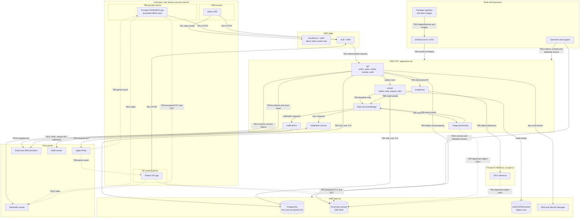

# Threat model

| | |
|---|---|
| Version | 1.0 |
| Status | Layer 0 baseline, 2026-09-28; Layer 1 kickoff review (ADR-0018), 2026-09-29 |
| Authority | Production Bible §21 (security and privacy), §23 (offline), §25 (backend and infrastructure), with §17.2 (administrative safeguards), §30 (constitution) and §36 (production readiness). ADR-0001, ADR-0002, ADR-0003, ADR-0004, ADR-0005, ADR-0006, ADR-0018 (Layer 1 kickoff decisions). |
| Normative sources | [`TECHNICAL_SPECIFICATION.md`](TECHNICAL_SPECIFICATION.md) §1.4 (guardrails), §3 (architecture), §6.7 (internal contracts), §7 (security, privacy, audit), §8 (offline); [`technical-spec/schema.prisma`](technical-spec/schema.prisma); [`technical-spec/constraints.sql`](technical-spec/constraints.sql). Context: [`SYSTEM_ARCHITECTURE.md`](SYSTEM_ARCHITECTURE.md). |

This document models the threats to Aestara with STRIDE per trust boundary, names the mitigation for each and rates what remains. Mitigations are the numbered requirements in [`SECURITY_REQUIREMENTS.md`](SECURITY_REQUIREMENTS.md) (`SR-…`); how each is tested is in [`TESTING_STRATEGY.md`](TESTING_STRATEGY.md). Where no source specifies a control, the gap is recorded as an open item (§11), not filled with an invented control.

---

## 1. Scope

| In scope | Out of scope |
|---|---|
| The design locked in spec v1.0 for Layers 1–10: provider iOS/iPadOS app, patient iOS app, admin web SPA, `api` and `worker`, `image-processing`, `ai-gateway`, private inference, `notifications`, `integration-service`, AWS us-east-1 infrastructure (ADR-0006), CI/CD | Layer 11 3D digital patient (separate approved expansion, B §29) |
| Third-party boundaries: APNs, email/SMS, EMR vendors, telehealth vendor, package registries | The static design prototype (ADR-0009): no backend, no data, never deployed |
| Operator, support and engineering access to production | Customer workforce policy, training, physical clinic security and incident response, which are the customer's obligations [B §21.3] |

**Status of evidence.** No application code exists yet (spec §11.4). Every "verified by" entry is a planned check, except the database behaviour suite, the Terraform static checks (fmt, validate, tflint, checkov) on the Layer 0 modules and the dependency scan (OSV-Scanner), which run in CI today. Checkov entries for resources that do not exist yet (ALB, WAF, queues, service roles) are planned too.

## 2. Assets

| Asset | Where it lives | Property that matters most | Worst credible outcome |
|---|---|---|---|
| PHI records: demographics, medical history, notes, plans, messages | PostgreSQL; provider offline store | Confidentiality, integrity | Disclosure to another organization or the public |
| Clinical photos: immutable originals and derivatives | S3; provider offline store; transient in imaging and inference | Confidentiality, integrity of originals [B §6.6] | Disclosure; altered clinical record |
| Media permissions and releases | PostgreSQL (append-only versions) | Integrity | Use for marketing, research or AI training without the matching grant [B §7.1] |
| Consent snapshots, hashes and signatures | S3 and PostgreSQL | Integrity, non-repudiation | Altered or forged consent [B §12.2] |
| Credentials and keys: password hashes, TOTP seeds, passkeys, refresh-token hashes, token-signing key, APNs and vendor keys, device Keychain items | PostgreSQL, KMS, Secrets Manager, iOS Keychain | Confidentiality | Account takeover; forged tokens |
| Audit trail: `AuditEvent`, `LoginEvent`, WORM copy, CloudTrail | PostgreSQL, S3 Object Lock, security account | Integrity, availability | Misuse that cannot be detected or proven |
| AI models, rollouts, thresholds and provenance | Registry tables; inference environment | Integrity | Silently replaced model; unvalidated output reaching a patient [B §9.7] |
| Unreleased simulation output (drafts, rejected, failed) | PostgreSQL, S3 | Confidentiality toward the patient | Patient sees an unapproved output [B §13.2] |
| Exports, integration payloads, dead letters | Separate S3 buckets | Confidentiality | Bulk disclosure |
| Clinical workflow availability | Whole system | Availability | Consultations cannot proceed |

## 3. Actors

| ID | Actor | Starting access | Typical goal |
|---|---|---|---|
| A1 | Anonymous internet attacker | Public endpoints | Account takeover, data theft, denial of service |
| A2 | User of another organization (other tenant) | Valid account in organization B | Read or link organization A's data |
| A3 | Staff member exceeding scope (malicious or curious insider) | Valid role in the organization | Read or change data beyond the role or practice scope |
| A4 | Malicious patient | Patient-app account | See other patients' data or unreleased material; upload malicious files |
| A5 | Device thief | A stolen or unattended iPad/iPhone | Read cached PHI; reuse the session |
| A6 | Platform operator or support staff | SUPER_ADMIN tooling | Browse patient records; grant themselves access |
| A7 | Engineer or cloud administrator | AWS console, database owner role | Read PHI directly; hide activity |
| A8 | Compromised third party | EMR, telehealth, messaging vendor | Inject data, forge webhooks, harvest PHI |
| A9 | Supply-chain attacker | A dependency, GitHub Action or base image | Run code in CI or production |
| A10 | Automated abuse | Botnets | Credential stuffing, scraping, resource exhaustion |

## 4. Assumptions

| ID | Assumption | Source |
|---|---|---|
| AS1 | Only HIPAA-eligible AWS services under a BAA handle PHI; AWS secures the physical and hypervisor layers. | B §21.3, §25.3; ADR-0006; spec §10.1 |
| AS2 | One shared multi-tenant deployment serves all organizations. | spec §10.1 |
| AS3 | Apple Keychain, Secure Enclave, Data Protection and LocalAuthentication behave as documented on iOS/iPadOS 26. | ADR-0005; spec §2.2 |
| AS4 | Clinical devices have a device passcode. The refresh token's Keychain class (`kSecAttrAccessibleWhenPasscodeSetThisDeviceOnly`) is available only while a passcode is set, but nothing in the sources enforces passcode strength or device management (open item 3). | spec §4.2 (Keychain class); otherwise not specified |
| AS5 | The vetted libraries in ADR-0002 are sound; there is no custom cryptography. | ADR-0002 |
| AS6 | Inference runs privately with no public egress (UD-04 baseline). | spec §2.1 |
| AS7 | Customers meet their own obligations: BAAs, policies, training, incident response. | B §21.3 |

## 5. Data flow and trust boundaries

Solid arrows are service calls; dotted arrows are direct client or service access with a short-lived credential. Labels carry the boundary number.

| TB | Boundary | What crosses it | Main specification |
|---|---|---|---|
| TB1 | Internet → edge (WAF, ALB, CloudFront) | All client traffic; admin static assets | B §25.3; spec §2.3, §3.3 |
| TB2 | Edge → `api` | Authenticated requests; tenant context from the token | spec §3.3, §4.6, §6.1 |
| TB3 | `api`/`worker` → PostgreSQL | Tenant-scoped queries under RLS | ADR-0004; spec §3.5, §5.5 |
| TB4 | Object storage and signed URLs | Photos, documents, attachments, exports | spec §6.1.9, §7.4 |
| TB5 | Queues → `image-processing` / `ai-gateway` → inference | Job messages with object references; result events | spec §3.1, §6.7, §7.7 |
| TB6 | Provider iOS device and its offline store | Cached PHI, originals awaiting upload, queued mutations, offline audit | B §23; spec §8 |
| TB7 | Patient iOS app | Released content, consents, messages, patient uploads | B §13; spec §4.7, §6.5 |
| TB8 | Admin SPA in a browser | Admin sessions and configuration | ADR-0003; spec §4.2 |
| TB9 | `notifications` → APNs → devices | Generic push text and opaque deep links | B §14.3; spec §7.2 |
| TB10 | `notifications` → email and SMS; from Layer 1 the api sends transactional email through SES (ADR-0018 K-14) | Generic template text, reset and invitation messages | B §14.3; spec §2.1 |
| TB11 | `integration-service` ↔ EMR vendor | Canonical resources, webhooks, credentials | B §18; spec §3.4, §6.7 |
| TB12 | Telehealth vendor | Session setup, join tokens, video | B §16; spec §4.7; UD-05 |
| TB13 | CI/CD and supply chain | Dependencies, actions, base images, Terraform, deployments | B §28; spec §2.3, §6.8 |
| TB14 | Operator, support and engineering access | Platform administration, AWS console, database owner role | B §17.2; spec §4.5 |

## 6. Risk rating method

Each threat is rated **after** its specified mitigations are in place and verified (residual risk).

| Score | Likelihood | Impact |
|---|---|---|
| 1 | Rare: needs an unlikely combination of failures or insider privileges | Minor: no PHI exposed; limited, recoverable disruption |
| 2 | Possible: a known technique that the controls make hard but not impossible | Moderate: limited PHI of one patient or one organization, or recoverable integrity loss |
| 3 | Likely: common, automated or low-skill | Severe: PHI across organizations or at scale, altered clinical or consent records, or patient-safety impact |

**Residual = likelihood × impact:** 1–2 **Low**, 3–4 **Medium**, 6–9 **High**.

**Treatment rule:** a High residual must be reduced before the layer that introduces it ships, or accepted by the owner in an ADR. Medium residuals are listed in §9 and re-rated at each review (§10).

## 7. STRIDE per trust boundary

Columns: **S** is the STRIDE letter; **Mitigation** gives SR IDs; **Spec** where the control is specified; **Res.** residual rating (§6); **Verified by** the planned check (TESTING_STRATEGY.md).

### TB1 Internet → edge

| ID | S | Threat | Mitigation | Spec | Res. | Verified by |
|---|---|---|---|---|---|---|
| T1.1 | S | Credential stuffing or brute force on `/auth/login` | SR-IDN-11, SR-IDN-12, SR-IDN-03, SR-IDN-02 | spec §4.2, §6.1.10 | M: MFA is mandatory for admin roles; for clinical roles it depends on the organization's policy (ADR-0018 K-03) | Lockout tests; WAF config review; pen test |
| T1.2 | T | TLS downgrade or interception | SR-DPR-01 | spec §7.1 | L | checkov; pen test |
| T1.3 | I | PHI in URLs captured by ALB, WAF or proxy logs | SR-PHI-03 | spec §6.1.10 | L | Contract test: no PHI-bearing path or query parameters |
| T1.4 | I | Account or patient enumeration through error or count differences | SR-IDN-11, SR-TEN-08 | spec §6.1.6, §6.1.10 | L | Login tests; cross-tenant suite |
| T1.5 | D | Volumetric or application-layer denial of service | SR-MON-05, SR-AUZ-15 | spec §6.1.10, §7.1 | M: protection beyond WAF is not specified (open item 16) | Load tests; WAF review |
| T1.6 | E | Spoofed forwarding or tenant headers trusted by the API | SR-TEN-02 | spec §3.3, §6.1.3 | L | Contract test: tenant headers ignored |
| T1.7 | I | CloudFront caches PHI or patient media | SR-MED-07, SR-DPR-09 | spec §2.4, §3.3 | L | checkov; header contract tests |

### TB2 Edge → api

| ID | S | Threat | Mitigation | Spec | Res. | Verified by |
|---|---|---|---|---|---|---|
| T2.1 | S | Forged or tampered access token | SR-IDN-04, SR-IDN-05, SR-SEC-02 | spec §4.2 | L | Token tests (wrong key, algorithm, audience, expiry); pen test |
| T2.2 | S | Replay of a stolen access token | SR-IDN-04, SR-IDN-09 | spec §4.2, §7.5 | L: 10-minute lifetime, session checked per request | Revocation immediacy test |
| T2.3 | E | Client-supplied organization ID used as entitlement | SR-TEN-02, SR-TEN-03, SR-TEN-04 | spec §3.3, §6.1.3 | L | Cross-tenant suite |
| T2.4 | E | New route shipped without a permission check | SR-AUZ-01, SR-AUZ-03 | spec §6.8, §7.5 | L | Contract test that every route declares a permission; role × endpoint suite |
| T2.5 | T | Mass assignment of server-controlled fields (`organizationId`, totals, status) | SR-INT-10, SR-TEN-02 | spec §3.3, §6.6.1 | L | Contract tests: unknown fields rejected |
| T2.6 | T | Duplicate or replayed mutation | SR-INT-09 | spec §6.1.8 | L | Idempotency tests |
| T2.7 | T | Lost update on concurrent edit | SR-INT-08 | spec §6.1.7 | L | ETag tests |
| T2.8 | E | State skipped (for example release before approval) | SR-INT-06, SR-AI-09 | spec §5.4 | L | State-machine suite; DB E12–E13 |
| T2.9 | I | Stack traces, SQL or storage keys in errors | SR-DPR-10, SR-MED-04 | spec §6.1.5 | L | Error-envelope contract tests |
| T2.10 | R | User denies an action | SR-AUD-03, SR-AUD-04, SR-MON-01 | spec §3.3, §7.3 | L | Audit assertions |
| T2.11 | D | Expensive endpoints abused (search, export, AI generation) | SR-AUZ-15 | spec §6.1.10; UD-27 | L | Rate-limit tests |

### TB3 api/worker → PostgreSQL

| ID | S | Threat | Mitigation | Spec | Res. | Verified by |
|---|---|---|---|---|---|---|
| T3.1 | E | Application bug omits the tenant filter | SR-TEN-04, SR-TEN-05, SR-TEN-06 | spec §3.5 | L: three independent nets | Cross-tenant suite; RLS tests; DB A1–A5 |
| T3.2 | T | SQL injection | Prisma parameterized queries (spec §2.1) | spec §2.1 | L; rules for raw SQL in application code are not specified (open item 17) | Review; pen test |
| T3.3 | T | Code path modifies an immutable clinical record | SR-INT-07, SR-MED-01, SR-INT-02 | spec §5.1, §5.5 | L | DB C1–C4, C8–C9, F3, F10–F11 |
| T3.4 | T | Audit rows altered or deleted by the application | SR-AUD-06, SR-AUD-07 | spec §7.3 | L | DB G1–G3; grant test |
| T3.5 | E | Application role can bypass RLS | SR-TEN-06 | ADR-0004 | L | Role-attribute test |
| T3.6 | I | Tenant setting leaks across pooled connections | SR-TEN-06 (`SET LOCAL` is transaction-scoped) | ADR-0004; spec §3.5 | L | Test: a connection without the setting sees no tenant rows |
| T3.7 | I | Database traffic or snapshots read | SR-DPR-02, SR-DPR-04, SR-SEC-06 | spec §7.1 | L | checkov |
| T3.8 | D | One tenant exhausts database capacity | Scale plan: RDS Proxy, per-tenant limits (spec §5.6) | B §25.4; spec §5.6 | L at pilot; M at ~1,000 practices | Load tests per scale tier |

### TB4 Object storage and signed URLs

| ID | S | Threat | Mitigation | Spec | Res. | Verified by |
|---|---|---|---|---|---|---|
| T4.1 | I | Public bucket or permanent media URL | SR-MED-07, SR-DPR-05 | spec §7.1 | L | checkov; pen test |
| T4.2 | I | Signed URL leaked (shared, logged, cached) | SR-MED-06, SR-MED-03 | spec §6.1.9 | L: 120 s, one object and variant, `no-store` | Media access tests |
| T4.3 | T | Original overwritten through a reused or new PUT | SR-MED-01, SR-MED-03, SR-MED-05 | spec §7.4 | L | DB C1–C4; bucket-policy review |
| T4.4 | T | Uploaded bytes differ from what was declared | SR-MED-05 | spec §6.1.9 | L | Checksum mismatch test (`422 UPLOAD_VERIFICATION_FAILED`) |
| T4.5 | E | URL issued for another tenant's object | SR-MED-04, SR-TEN-08 | spec §6.1.9 | L | Cross-tenant suite covers `access-urls` routes |
| T4.6 | I | Object key reveals patient or tenant | SR-MED-03 | spec §7.4 | L | Key-format test |
| T4.7 | E | Service role has broad bucket access | SR-SEC-06, SR-MED-15 | spec §7.1 | L | IAM review; checkov |
| T4.8 | T/D | Media deleted by a rogue admin or ransomware | SR-MED-03, SR-BCR-02 | spec §7.4, §7.6 | M: the clinical-media bucket policy denies deletes to every principal (ADR-0014), but an account administrator can change the policy; recovery relies on versioning and, from production readiness, replication | Restore drill |
| T4.9 | R | Media fetched without a trace | SR-MED-06 (audit on issuance) | spec §6.1.9 | L: repeated fetches inside 120 s are one audit event | Audit assertions |

### TB5 Queues → image-processing / ai-gateway → inference

| ID | S | Threat | Mitigation | Spec | Res. | Verified by |
|---|---|---|---|---|---|---|
| T5.1 | S | Forged job or result message | SR-DPR-03, SR-SEC-06 | spec §6.7 | L | Queue-policy review |
| T5.2 | T | Crafted image exploits a decoder in `image-processing` or inference | SR-MED-08, SR-MED-09, SR-MED-15, SR-SCI-03 | spec §3.1, §6.1.9 | M: runtime sandboxing is not specified (open item 6) | Malformed-file tests; container scan |
| T5.3 | I | Demographics reach imaging or AI | SR-PHI-07 | spec §3.1, §7.2 | L | Internal contract schema test |
| T5.4 | I | Inference environment exfiltrates images | SR-AI-02 | spec §2.1, §2.4 | L | Network config review; checkov |
| T5.5 | T | Model version replaced silently | SR-AI-03 | B §9.7; spec §1.4 | L | DB E1–E5, R10–R13 |
| T5.6 | T | Falsified validation scores in a result event | SR-DPR-03 (only `ai-gateway` may publish results), SR-AI-05 | spec §6.7 | L | Queue-policy review; provenance tests |
| T5.7 | E | `ai-gateway` reachable from the internet | SR-AI-01 | spec §6.1.1 | L | Network review; pen test |
| T5.8 | D | Poison message or job flood stalls a queue | SR-AUZ-15, SR-MON-02 | spec §7.6 | M: dead-letter handling for imaging and AI queues is not specified (open item 7) | Queue depth and age alerts |
| T5.9 | R | Output cannot be tied to a model and inputs | SR-AI-05 | B §9.4 | L | DB E7–E10 |
| T5.10 | I | Outbox or queue payload carries PHI | SR-PHI-11 | spec §5.2 | L | Payload schema test |

### TB6 Provider iOS device and offline store

| ID | S | Threat | Mitigation | Spec | Res. | Verified by |
|---|---|---|---|---|---|---|
| T6.1 | I | Lost or stolen device exposes cached PHI and photos | SR-DPR-08, SR-DEV-05, SR-DEV-06, SR-IDN-13 | B §23.3; spec §7.1, §8 | M: see abuse case AC-03 | iOS encryption and purge tests |
| T6.2 | S | Refresh token extracted from the device | SR-IDN-06, SR-IDN-08, SR-IDN-13 | spec §4.2 | L: this-device-only Keychain class with `.biometryCurrentSet` and no fallback to the device passcode (ADR-0018 K-22) | Reuse-detection test; iOS Keychain tests |
| T6.3 | T | Queued mutation or photo altered before upload | SR-DEV-02, SR-DEV-04, SR-MED-05 | spec §6.1.9, §8 | L: server re-authorizes and re-verifies checksums | Replay tests |
| T6.4 | R | Offline views never reach the audit trail | SR-DEV-07, SR-AUD-10, SR-MON-06 | spec §8 | M: a device that never reconnects keeps its records | Offline audit replay test |
| T6.5 | E | Patient escapes the staff-assisted signing hand-off | SR-DEV-08 | spec §6.3; UD-31 | L | XCUITest hand-off test |
| T6.6 | E | Deep link opens a record without authorization | SR-AUZ-13 | B §24.5 | L | XCUITest deep-link tests |
| T6.7 | I | PHI visible in the app-switcher snapshot or screenshots | Privacy cover whenever the scene is not active (ADR-0022) | spec §4.2 | M | UI review; ADR-0022 |
| T6.8 | I | PHI in crash reports or analytics | SR-PHI-05, SR-PHI-06 | spec §2.4, §7.2 | L | Dependency review |
| T6.9 | T | App tampering on a jailbroken device | Accepted: server-side enforcement of every rule; no jailbreak detection (ADR-0022); App Attest reconsidered in Layer 5 | spec §4.6 | M | Cross-tenant and authorization suites |
| T6.10 | D | Sync conflict silently discards clinical data | SR-DEV-03 | B §23.3; spec §8 | L | Conflict tests |

### TB7 Patient iOS app

| ID | S | Threat | Mitigation | Spec | Res. | Verified by |
|---|---|---|---|---|---|---|
| T7.1 | E | Patient changes IDs to reach another patient | SR-AUZ-10, SR-AUZ-11 | spec §4.7, §6.5 | L | Portal visibility suite |
| T7.2 | I | Patient sees drafts, rejected or failed simulations, internal notes | SR-AUZ-10, SR-AUZ-11, SR-AI-10 | B §13.2; spec §4.7 | L | Portal visibility suite; B §34.2 #26 test |
| T7.3 | S | Patient account takeover | SR-IDN-11, SR-IDN-12 | spec §4.2 | M: patient MFA and biometrics are optional (open item 21) | Lockout tests |
| T7.4 | T | Malicious file in a patient upload | SR-MED-08, SR-MED-09 | B §13.4; UD-22 | L | Quarantine and scan tests |
| T7.5 | I | Long-lived session on a shared or lost phone | SR-IDN-07, SR-IDN-08 | spec §4.2; UD-18 (ADR-0018 K-03) | M: absolute lifetime 90 days by default | Session policy tests |
| T7.6 | R | Patient disputes a signature | SR-INT-03, SR-INT-04, SR-AUD-03 | B §12.3; spec §5.4.4 | L | Consent tests; DB F8 |
| T7.7 | S | Invitation token leaked or reused | SR-IDN-21: the token travels in the request body, never the URL | spec §6.1.10, §6.5 | M: the patient invitation's lifetime, single use and storage are decided in Layer 5 (open item 2) | Contract test: no token in a path or query string |
| T7.8 | S | Telehealth join token used by someone else | Join token only while `SCHEDULED`/`WAITING` in the join window | spec §4.7 | L | Telehealth tests |
| T7.9 | I | Patient identity links two organizations' records | SR-IDN-17 | spec §4.7; UD-08 | L | Portal tests with two organizations |

### TB8 Admin SPA

| ID | S | Threat | Mitigation | Spec | Res. | Verified by |
|---|---|---|---|---|---|---|
| T8.1 | E | Cross-site scripting steals the in-memory access token or acts as the admin | SR-IDN-15 (the refresh token is only in an `HttpOnly` cookie); React output escaping | spec §4.2, §6.1.10 | M: Content Security Policy is not specified (open item 1) | Playwright tests; pen test |
| T8.2 | S | Cross-site request forgery | SR-IDN-15: `SameSite=Strict` cookie limited to the refresh path, `Origin` allow-list, strict CORS | spec §4.2, §6.1.10 | L | Playwright; pen test |
| T8.3 | S | Admin account takeover | SR-IDN-03, SR-IDN-07 | ADR-0002; spec §4.2 | L | MFA and session tests |
| T8.4 | E | Admin grants itself or others beyond its scope | SR-AUZ-04 | spec §4.5 | L | Separation-of-duties tests; DB R4 |
| T8.5 | I | Audit viewer exposes clinical content | SR-PHI-08 | B §22.2; DESIGN_SYSTEM.md §9 | L | Audit metadata tests |
| T8.6 | R | Configuration change cannot be traced | SR-AUD-02, SR-AUZ-08 | spec §7.3; UD-19 (ADR-0018 K-04) | L | Audit assertions |
| T8.7 | T | Static assets tampered at the origin | TB13 controls; CloudFront + WAF | B §25.3; ADR-0003 | L | Deployment review |

### TB9 Push notifications (APNs)

| ID | S | Threat | Mitigation | Spec | Res. | Verified by |
|---|---|---|---|---|---|---|
| T9.1 | I | PHI in a push payload (lock screen, Apple infrastructure) | SR-PHI-04, SR-VEN-05 | B §14.3; spec §6.7 | L | Notification contract test (no content field) |
| T9.2 | S | Push delivered to a stale or revoked device | Device registration per user; revocation (SR-IDN-08) | spec §6.3 | L: payload carries no PHI | Device tests |
| T9.3 | E | Push deep link bypasses authorization | SR-AUZ-13 | schema `Notification.deepLink` | L | XCUITest deep-link tests |
| T9.4 | S | APNs key stolen and used for phishing pushes | SR-SEC-01 | spec §7.1 | L | Secrets review |

### TB10 Email and SMS

| ID | S | Threat | Mitigation | Spec | Res. | Verified by |
|---|---|---|---|---|---|---|
| T10.1 | I | PHI in email or SMS | SR-PHI-04, SR-VEN-04 | B §14.3; spec §7.2 | L | Template tests |
| T10.2 | S | Lookalike phishing messages to patients | Generic text; no PHI | spec §7.2 | M: sender authentication is not specified (open item 10) | — |
| T10.3 | S | Password-reset or staff-invitation link intercepted or reused | Identical responses (SR-IDN-11); hashed, single-use tokens in the request body, reset valid 30 minutes, a completed reset revokes all sessions (SR-IDN-19, SR-IDN-21) | spec §4.2, §6.3 | M: the staff-invitation lifetime is not specified (open item 2) | Reset and invitation token tests |
| T10.4 | S | Account recovery after a lost second factor abused to take over an account | SR-IDN-20: admin-initiated MFA reset only, scoped to the admin's organization, audited, all sessions revoked | spec §4.2, §6.3 | M: how the admin verifies the requester's identity is not specified (open item 22) | MFA reset tests |

### TB11 EMR vendor

| ID | S | Threat | Mitigation | Spec | Res. | Verified by |
|---|---|---|---|---|---|---|
| T11.1 | S | Forged or replayed webhook | SR-VEN-06 | spec §6.7 | L | Webhook signature and replay tests |
| T11.2 | T | Vendor data overwrites local clinical data | Conflict detection; never silently overwritten | B §15.3, §18.4; spec §3.4 | L | Conflict tests |
| T11.3 | I | Vendor credentials leaked | SR-SEC-03, SR-SEC-01 | spec §5.2 | L | Secrets review |
| T11.4 | E | Mapping links an external record to the wrong tenant or patient | SR-TEN-12 | spec §5.1 | M: polymorphic `localId` is application-enforced only | Integration cross-tenant tests |
| T11.5 | I | Dead-letter payloads expose PHI | Encrypted payloads in a separate bucket | spec §3.4, §7.4 | L | checkov |
| T11.6 | E | Admin-configured endpoint used to reach internal services (SSRF) | Not specified (open item 8) | — | M | — |
| T11.7 | R | Field changes cannot be attributed | Field-level provenance; per-sync audit | B §18.4 | L | Sync audit tests |

### TB12 Telehealth vendor

| ID | S | Threat | Mitigation | Spec | Res. | Verified by |
|---|---|---|---|---|---|---|
| T12.1 | I | Vendor handles PHI without a BAA | SR-VEN-02 | UD-05 | M until the Layer 6 vendor decision | Vendor review |
| T12.2 | S | Unauthorized participant joins | Short-lived join tokens after authorization; host admits from the waiting room | spec §4.7, §6.3 | L | Telehealth tests |
| T12.3 | I | Call recorded | SR-VEN-02 | B §16.2; spec §5.2 | L | Schema review (no recording field) |
| T12.4 | I | PHI in session metadata sent to the vendor | Not specified (open item 9) | — | M | — |

### TB13 CI/CD and supply chain

| ID | S | Threat | Mitigation | Spec | Res. | Verified by |
|---|---|---|---|---|---|---|
| T13.1 | T | Malicious or vulnerable dependency | SR-SCI-06, SR-SCI-02, SR-IDN-02 | spec §2.3; ADR-0016 | M: OSV-Scanner and Dependabot find known vulnerabilities only, not a malicious new release | CI scan output (`security` job) |
| T13.2 | T | Compromised GitHub Action (tag moved) | SR-SCI-15: third-party actions pinned to commit SHAs in M1.2 (ADR-0018 K-21); until then `ci.yml` references them by version tag | ADR-0018 K-21 | L once pinned (M until M1.2) | Workflow review |
| T13.3 | E | Workflow token with write access abused | SR-SCI-07 | `ci.yml` | L | Workflow review |
| T13.4 | I | Secrets committed to the repository | SR-SCI-10 (GitHub's native secret scanning, ADR-0016; gitleaks in CI from M1.2, ADR-0018 K-21) | ADR-0016; ADR-0018 K-21 | L once gitleaks runs (M until M1.2) | Secret-scan output |
| T13.5 | T | Vulnerable base image deployed | SR-SCI-03 | spec §7.1 | L | Trivy gate |
| T13.6 | T | Terraform change opens public access | SR-SCI-04, SR-SCI-05 | spec §2.3 | L | checkov; plan review |
| T13.7 | T | Unreviewed change reaches `main` | SR-SCI-12 | CLAUDE.md | L | Branch protection |
| T13.8 | E | Deployment credentials in CI are stolen | Not specified; decided with the AWS accounts before the first deployment (open item 12) | — | M | — |
| T13.9 | I | Production data used in tests | SR-PHI-09 | B §28.1 | L | Review; synthetic fixtures |

### TB14 Operator, support and engineering access

| ID | S | Threat | Mitigation | Spec | Res. | Verified by |
|---|---|---|---|---|---|---|
| T14.1 | I | Platform operator browses patient records | SR-AUZ-05 (platform reach limited to organization metadata; platform database role without patient or clinical tables) | B §17.2; spec §3.5, §4.5, §4.6 | L | Authorization suite; RLS role tests |
| T14.2 | E | Operator grants itself a clinical role | SR-AUZ-04 | spec §4.5 | L | Separation-of-duties tests; DB R4 |
| T14.3 | I | Engineer reads PHI directly through the console or the database owner role | SR-SEC-06, SR-AUD-13 | spec §7.1, §10.4 | H: spec §10.4 sets only the direction (no standing access; a break-glass role with approval, session recording and audit); the design does not exist yet (open item 13) | — |
| T14.4 | T | Owner role disables audit triggers and edits history | SR-AUD-08 (WORM copy and reconciliation) | spec §7.3 | M: exposure window until reconciliation; no WORM copy in Layer 1 (accepted, ADR-0018 K-18) | Reconciliation test; alert-fire test |
| T14.5 | R | Operator activity cannot be traced | SR-AUD-12, SR-AUD-13 | spec §7.1 | L | CloudTrail review |
| T14.6 | E | Support impersonation of a user | SR-AUZ-05: not built until specified | B §17.1 | L | Review |

## 8. Abuse cases

### AC-01 Cross-organization access

- **Scenario:** a user of organization B obtains patient or photo IDs of organization A and calls patient, photo, access-URL or before/after routes with them (A2).
- **Controls, in the order they stop it:** tenant from the token only (SR-TEN-02); active membership (SR-TEN-03); tenant-scoped repository (SR-TEN-04); RLS (SR-TEN-06); composite foreign keys (SR-TEN-05); identical 404 (SR-TEN-08).
- **Residual:** Low. The application-enforced links (SR-TEN-12) and the named platform repository (SR-TEN-04) rely on tests and review rather than the database.
- **Verified by:** generated cross-tenant suite, RLS tests, DB A1–A5 and R1–R2, penetration test.

### AC-02 A patient sees drafts or rejected simulations

- **Scenario:** a patient calls portal routes with the ID of an unreleased simulation or document, or calls staff routes with a patient token (A4).
- **Controls:** `PATIENT` holds no staff permission (spec §4.5); separate portal namespace and DTOs (SR-AUZ-11); release predicates and deny-by-default (SR-AUZ-10); release needs version, time and actor in the database (SR-AI-09); disclaimer required by the DTO schema (SR-AI-11).
- **Residual:** Low.
- **Verified by:** portal visibility suite for every portal endpoint; Bible §34.2 #26 acceptance test; DB E12–E13.

### AC-03 Stolen iPad

- **Scenario:** a provider iPad is stolen locked, or picked up unlocked in a clinic (A5).
- **Controls:** Data Protection *Complete*, SQLCipher and CryptoKit encryption with Keychain keys (SR-DPR-08); biometric unlock after 5 minutes in background (SR-IDN-13); cache limits and purge on sign-out (SR-DEV-06); admin device revocation that revokes sessions server-side (SR-IDN-08); originals purged after verified upload (SR-DEV-05); offline audit (SR-DEV-07).
- **Residual:** Medium. An unlocked device is exposed for up to the 5-minute window; a device that never reconnects keeps its encrypted cache and cannot receive a purge; passcode strength and remote wipe are not specified (open item 3).
- **Verified by:** iOS tests for encryption at rest, purge on sign-out and revocation; revocation immediacy test.

### AC-04 Refresh-token theft

- **Scenario:** an attacker copies a refresh token from a compromised workstation, browser or device (A1, A5).
- **Controls:** rotation on every use with reuse detection that revokes the whole session (SR-IDN-06); refresh tokens stored as hashes (SR-SEC-05); this-device-only Keychain storage with biometric access control and no fallback to the device passcode (SR-IDN-13); in the SPA, the access token in memory and the refresh token only in an `HttpOnly`, `Secure`, `SameSite=Strict` cookie limited to the refresh path (SR-IDN-15); 10-minute access tokens and per-request session checks (SR-IDN-04, SR-IDN-05); alert on reuse (SR-MON-03).
- **Residual:** Medium. If the attacker refreshes first, they hold the session until the legitimate client refreshes and triggers reuse detection; an idle legitimate client extends that window up to the idle limit.
- **Verified by:** reuse-detection test; revocation immediacy test; alert-fire exercise.

### AC-05 Malicious image upload

- **Scenario:** a crafted HEIC or PNG, a decompression bomb, a polyglot file or a mislabelled content type is uploaded by a patient, or arrives as a message attachment (A4, A1).
- **Controls:** type and size allow-lists at intent and completion (SR-MED-08); checksum verification (SR-MED-05); quarantine, malware scan and staff review for patient uploads (SR-MED-09); scanned attachments (SR-MED-10); imaging services without database access, working through per-object URLs (SR-MED-15, SR-PHI-07); container scanning (SR-SCI-03).
- **Residual:** Medium. A decoder zero-day in `image-processing` or on a viewing client remains possible; sandboxing is not specified (open item 6); scanning of staff-uploaded documents is not specified (open item 19).
- **Verified by:** synthetic malformed-file fixtures in upload tests; quarantine state tests; container scan.

### AC-06 Staff exceeding scope

- **Scenario:** front desk opens consultation notes; a nurse at practice A creates a consultation at practice B; a practice admin grants an organization-level role; a clinician browses patients of another practice out of curiosity (A3).
- **Controls:** permission declared per route and computed server-side (SR-AUZ-01); `patient.read` limited to demographics (SR-AUZ-06); practice and location scope on writes (SR-TEN-10); separation of duties (SR-AUZ-04); `ACCESS_DENIED` audit and burst alerts (SR-AUZ-09, SR-MON-03); `PATIENT_VIEWED` and per-patient access reports (SR-AUD-09, SR-AUD-11); access-review export (SR-AUZ-08).
- **Residual:** Medium for curiosity browsing inside the organization. ADR-0001 makes reads organization-wide by design, so only detective controls apply.
- **Verified by:** role × endpoint suite; separation-of-duties tests; audit assertions.

### AC-07 Consent tampering

- **Scenario:** someone edits a signed consent, reopens a completed one, swaps the template version, or signs on the patient's behalf (A3, A7).
- **Controls:** frozen, hashed template versions (SR-INT-01); executed consents frozen and never reopened (SR-INT-02); snapshot plus SHA-256 required for `COMPLETE` (SR-INT-03); append-only, idempotent signatures (SR-INT-04); the staff-assisted hand-off requires staff re-authentication to exit (SR-DEV-08); `CONSENT_*` audit events with the WORM copy (SR-AUD-01, SR-AUD-08).
- **Residual:** Low against application users. Against a database owner who disables triggers, the snapshot and its hash sit in the same system; whether the hash is also anchored in the WORM audit copy is not specified (open item 14).
- **Verified by:** DB F1–F12 and R5–R6; consent lifecycle and audit tests.

### AC-08 Audit tampering

- **Scenario:** an insider deletes `PATIENT_VIEWED` rows to hide browsing (A3, A7).
- **Controls:** append-only triggers (SR-AUD-06); `INSERT`/`SELECT` grants only (SR-AUD-07); Object Lock WORM copy with daily reconciliation and alert (SR-AUD-08); CloudTrail in a separate account (SR-AUD-13).
- **Residual:** Medium in Layer 1, which has no WORM copy yet (accepted for Layer 1, ADR-0018 K-18); Low once the relay runs in Layer 2.
- **Verified by:** DB G1–G4; grant test; reconciliation test; alert-fire exercise.

### AC-09 An AI output misrepresented as a guarantee

- **Scenario:** a visualization is shown or shared as "your result", used as marketing, or shows identity drift outside the treatment region (A3; also a quality failure).
- **Controls:** mandatory disclaimer in the DTO and shown above the image, not collapsible (SR-AI-11; DESIGN_SYSTEM.md §3); "simulation or visualization" vocabulary and no guarantee language (SR-AI-12); approval and a separate release (SR-AI-09); identity-similarity and artifact thresholds before review (SR-AI-06); no dosing, product or technique parameters (SR-AI-04); marketing use needs its own grant (SR-MED-11, SR-MED-12).
- **Residual:** Medium. What staff say aloud and screenshots taken outside the app are beyond software control; whether the AI label is burned into patient-visible images is not specified (open item 15).
- **Verified by:** portal DTO schema test; copy checks; Layer 7 harness; Bible §34.2 #25, #29, #31 tests.

### AC-10 PHI leaking into logs or push payloads

- **Scenario:** a developer logs a request body, an error echoes a patient name, a push template includes a name, or a search term lands in a URL (A7 as reader of logs; accidental).
- **Controls:** allow-list log serializer (SR-PHI-01); canary test in CI (SR-PHI-02); search in request bodies (SR-PHI-03); template-only notifications with no content field (SR-PHI-04); MetricKit only (SR-PHI-06); identifiers only in audit metadata and tracing (SR-PHI-08, SR-PHI-10).
- **Residual:** Low.
- **Verified by:** PHI canary test on every layer's endpoints; notification contract test; contract test for PHI-free paths.

## 9. Top residual risks

These are the Medium and High residuals that matter most, linked to the risk register in spec §10.4.

| # | Residual risk | Rating | Threats | Spec §10.4 row | Treatment |
|---|---|---|---|---|---|
| 1 | Human production access (console, database owner role) can reach PHI or alter audit | High | T14.3, T14.4 | "Human production access to PHI (operators, support) is not yet specified" (added by ADR-0017) | Design the spec §10.4 controls (no standing access; break-glass with approval, session recording and audit) before the first environment that holds PHI (open item 13) |
| 2 | A defect in the in-house authentication module | Medium | T2.1, AC-04 | "In-house authentication (D-02) has a security defect" | Vetted libraries, reuse detection, pen test before production (SR-IDN-18) |
| 3 | Offline devices hold PHI | Medium | T6.1, AC-03 | "Offline devices hold PHI" | Cache limits (UD-25); device-management decision (open item 3) |
| 4 | Supply-chain compromise | Medium | T13.1, T13.2, T13.4, T13.8 | "Supply-chain compromise (dependencies, CI actions, container images)" (added by ADR-0017) | Dependency scanning is in place; gitleaks, CodeQL and SHA-pinned actions arrive in M1.2 (ADR-0018 K-21); deploy credentials remain (open item 12) |
| 5 | Vendors handling PHI without BAAs | Medium | T12.1, T12.4 | "Vendor dependencies without BAAs" | Each vendor through a UD or ADR (SR-VEN-07) |
| 6 | AI output misread as a prediction, or identity drift | Medium | AC-09 | "AI visualization quality or identity drift"; "Regulatory scope creep" | Harness thresholds, disclaimer by construction, intended-use review (SR-AI-06, SR-AI-11, SR-AI-15) |
| 7 | Within-organization browsing enabled by organization-wide reads | Medium (accepted, ADR-0001) | AC-06 | "Cross-organization data exposure" (the cross-organization part is Low) | Detective controls: `PATIENT_VIEWED`, access reports, alerts |
| 8 | Decoder exploit through a crafted image | Medium | T5.2, AC-05 | "Malicious image files (crafted HEIC/JPEG/PNG)" (added by ADR-0017) | Sandboxing decision (open item 6); scanning; patching |
| 9 | Account takeover for roles without mandatory MFA | Medium | T1.1, T7.3 | Related to "In-house authentication" | Organizations may require MFA for clinical roles (ADR-0018 K-03); patient MFA is decided in Layer 5 (open item 21) |

## 10. Review cadence

| When | What happens |
|---|---|
| Each layer kickoff | Review the boundaries the layer touches, add or re-rate threats, and cite threat IDs in the SECURITY part of each feature prompt [B §33]. Re-confirm the delegated decisions listed for the layer (DEVELOPMENT_ROADMAP.md §4). |
| Before an ADR that adds a service, vendor or data flow | Update the diagram and the affected STRIDE table before implementation [B §0]. |
| Before production | Full review as part of the Bible §36 readiness check; penetration test findings are folded in and every High residual is closed or accepted by ADR. |
| After a security incident or pen-test finding | Add the threat, its mitigation and a regression test. |

| Review | Date | Scope | Outcome |
|---|---|---|---|
| Layer 0 baseline | 2026-09-28 | All boundaries, design level | This document: 105 threats (1 High, 25 Medium residuals), 10 abuse cases, 22 open items |
| Layer 1 kickoff | 2026-09-29 | TB1, TB6, TB7, TB8, TB10, TB13, TB14 against the ADR-0018 decisions | Mitigations added to T1.1, T6.2, T7.7, T8.1, T8.2, T10.3, T10.4, T13.2, T13.4 and T14.1. T13.2 and T13.4 become Low once M1.2 lands. Open items 11 and 20 closed; the others touched are rescheduled |

## 11. Open items

Each is a gap in the sources, not a decided control. Closed items keep their row so the numbering stays stable.

| # | Gap | Threats | Decide at |
|---|---|---|---|
| 1 | Closed: the admin SPA's Content Security Policy is decided in ADR-0022 | T8.1 | M1.11 |
| 2 | Lifetime of staff and patient invitation tokens. Reset tokens are single use and valid 30 minutes, and every token travels in the request body (ADR-0018 K-09, K-15) | T7.7, T10.3 | M1.6 (staff invitations); Layer 5 (patient invitations) |
| 3 | Device passcode enforcement, device management and remote wipe for clinical devices | AS4, T6.1, AC-03 | Layer 2 kickoff, with UD-25 |
| 4 | Closed: a privacy cover hides the app-switcher snapshot; screenshots are not blockable on iOS (ADR-0022) | T6.7 | M1.9 |
| 5 | Closed for Layer 1: no jailbreak detection; App Attest is reconsidered with the patient app (ADR-0022) | T6.9 | M1.9; Layer 5 |
| 6 | Runtime sandboxing of image decoding and inference | T5.2, AC-05 | Layer 2 (UD-06), Layer 7 (UD-04) |
| 7 | Dead-letter and poison-message handling for imaging and AI queues | T5.8 | Layer 2, Layer 7 |
| 8 | Egress allow-list for `integration-service` (SSRF) | T11.6 | Layer 10 kickoff |
| 9 | What session metadata is sent to the telehealth vendor | T12.4 | Layer 6, with UD-05 |
| 10 | Email sender authentication for patient messages | T10.2 | Layer 5 kickoff |
| 11 | Closed at the Layer 1 kickoff: third-party GitHub Actions are pinned to commit SHAs in M1.2 (SR-SCI-15; ADR-0018 K-21) | T13.2 | Closed (ADR-0018 K-21) |
| 12 | How CI authenticates to AWS for deployments (GitHub OIDC with per-environment roles is the proposed baseline) | T13.8 | Before the first deployment, with the AWS accounts ([`DEPLOYMENT.md`](DEPLOYMENT.md), [`INFRASTRUCTURE.md`](INFRASTRUCTURE.md) open items) |
| 13 | Human access to production AWS and the database owner role: the break-glass design that spec §10.4 requires (approval, session recording, audit; no standing access) | T14.3, T14.4 | Before the first deployment ([`INFRASTRUCTURE.md`](INFRASTRUCTURE.md) open items) |
| 14 | Anchoring consent snapshot hashes in the WORM audit copy | AC-07 | Layer 4 kickoff |
| 15 | Burned-in AI label on patient-visible simulation images | AC-09 | Layer 8 kickoff |
| 16 | Denial-of-service protection beyond AWS WAF (AWS Shield Advanced is the named candidate) | T1.5 | Production readiness ([`INFRASTRUCTURE.md`](INFRASTRUCTURE.md) open items) |
| 17 | Rules for raw SQL in application code | T3.2 | Layer 1 (M1.1) |
| 18 | How "no timing difference" for cross-tenant 404s is measured | AC-01 | Layer 1 (M1.4) |
| 19 | Malware scanning of staff-uploaded documents | AC-05 | Layer 2 kickoff, with UD-22 |
| 20 | Closed at the Layer 1 kickoff: MFA is always required for admin roles and the admin web, and an organization may require it for clinical roles too, never fewer (SR-IDN-03; ADR-0018 K-03) | T1.1 | Closed (ADR-0018 K-03) |
| 21 | MFA or biometrics for patients (optional today) | T7.3 | Layer 5 kickoff (UD-18) |
| 22 | Identity verification before an admin-initiated MFA reset; the reset itself is decided (SR-IDN-20; ADR-0018 K-15; see [`AUTHENTICATION_ARCHITECTURE.md`](AUTHENTICATION_ARCHITECTURE.md) §14) | T10.4 | M1.6 |
