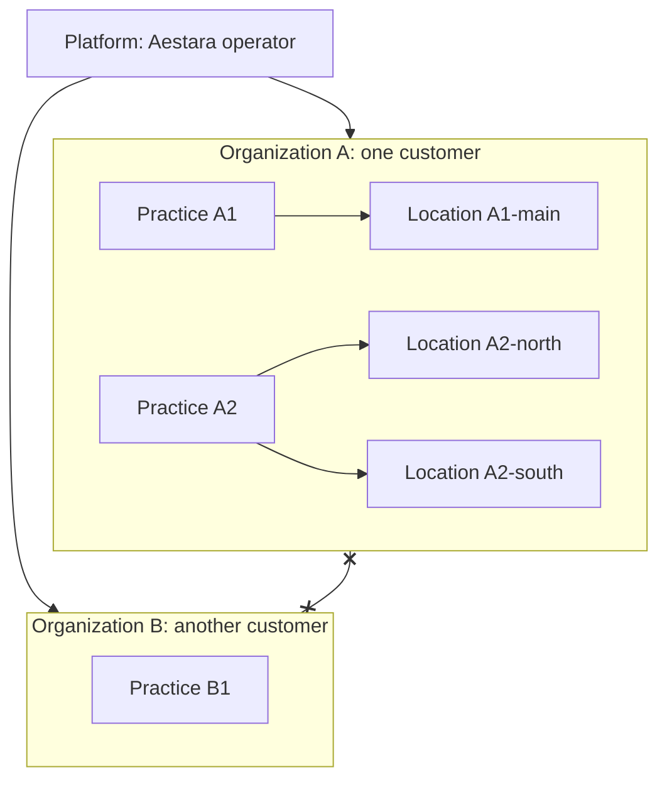

# User Roles and Permissions

| | |
|---|---|
| Version | 1.0 |
| Status | Layer 0 baseline, 2026-09-28 |
| Authority | Production Bible §3 (tenancy, roles, permission model), §13.2 (patient visibility), §17 (admin portal and safeguards). ADR-0001 (sharing within an organization only), ADR-0008 (delegated baselines UD-07, UD-16, UD-17) |
| Normative sources | [`TECHNICAL_SPECIFICATION.md`](TECHNICAL_SPECIFICATION.md) spec §4.1 (hierarchy), spec §4.3 (roles), spec §4.4 (permission catalog), spec §4.5 (default role matrix and separation of duties), spec §4.7 (patient access). `schema.prisma` models `Membership`, `Role`, `Permission`, `RolePermission`, `UserRole`, `PatientUserLink` |

A plain-language guide to who can do what in Aestara, for the owner, practice administrators, support staff and engineers. The normative permission keys and the default role matrix are in spec §4.4 and spec §4.5; how the server enforces them is in [`AUTHORIZATION_RBAC.md`](AUTHORIZATION_RBAC.md).

---

## 1. The model in one paragraph

A **user** signs in once. In each customer **organization** they work for, they hold a **membership** and one or more **role assignments**. Each assignment names a role and a **scope** (the whole organization, one practice, or one location). A role is a named bundle of **permissions** such as `patient.read` or `simulation.approve`. The server checks permissions on every request; it never checks role names, and hiding a button in the app is a convenience, never a security boundary [B §3.3]. Patients use a separate identity and see only what has been released or assigned to them [B §13.2].

---

## 2. The tenant hierarchy in plain language

`PLATFORM → ORGANIZATION → PRACTICE → LOCATION` [B §3.1], spec §4.1.

| Level | What it is | Examples of what lives here |
|---|---|---|
| Platform | The Aestara operator. Not a customer. | User identities (one person may work for several organizations), the permission catalog, the ten system roles, the AI model registry, platform-default feature flags and model rollouts |
| Organization | One customer: a business that owns one or more practices. **Every patient belongs to exactly one organization.** | Patients and all clinical records, users' memberships, consent templates, content, integrations, settings, audit |
| Practice | An operating unit of an organization, with its own time zone | Consultations, appointments, procedures, treatment plans and (optionally) photo sessions are recorded against a practice |
| Location | A physical site of a practice | Appointments, consultations, procedures and photo sessions may name a location |

The crossed link between the two organizations is the wall: nothing about Organization A's patients is ever visible to Organization B, not even whether a record exists.

### 2.1 What D-01 means in practice

Owner decision D-01 (ADR-0001): patient data **may be shared across the practices of one organization and never across organizations**. Reads span the organization; practice and location scope limit where a person may create or change practice-owned records; the similar-case library is organization-wide.

| Situation | Result | Why |
|---|---|---|
| A nurse assigned to Practice A1 opens a patient whose primary practice is A2 | Allowed | Reads span the organization (spec §4.6) |
| The same nurse starts a consultation for that patient at Practice A2 | Refused unless the nurse also holds an assignment covering A2, or an organization-wide assignment | A consultation is a practice-owned record; scope limits writes |
| The same nurse corrects the patient's phone number | Allowed with `patient.update` | The patient record belongs to the organization, not to one practice (spec §4.6 applies all grants to non-practice-owned actions) |
| A surgeon searches the similar-case library | Sees consented cases from every practice of the organization, filterable by originating practice | ADR-0001; `CaseLibraryEntry.practiceId` records the origin (spec §5.2) |
| A user in Organization B looks up a patient ID from Organization A | "Not found", identical to a random ID | Cross-organization access is impossible by construction (spec §3.5) |
| A clinician works for both Organization A and Organization B | One login, two memberships; the session works in one organization at a time, and switching issues new tokens | spec §4.2 |
| A patient is treated by both organizations | Two separate patient records, one per organization. One patient-app login may link to both, but shows one organization at a time | spec §10.2 (UD-08) |

---

## 3. Roles

The ten system roles are defined once at platform level; every organization uses the same definitions (spec §4.3). Custom roles per organization are **not available in Layer 1** (UD-07); the schema is ready for them.

A person may hold several assignments (for example SURGEON_PHYSICIAN at Practice A1 and at Practice A2). Their permissions are the union of the assignments that apply to the action (spec §4.6).

| Role | Bible typical scope [B §3.2] | Surface [B §2] |
|---|---|---|
| SUPER_ADMIN | Platform operations only; tightly restricted and audited | Admin web |
| ORGANIZATION_ADMIN | Organization configuration, users, practices, audit | Admin web |
| PRACTICE_ADMIN | Practice operations, staff, content/configuration within assigned scope | Admin web |
| SURGEON_PHYSICIAN | Clinical consultation, photos, treatment plans, AI review/approval | Provider app |
| NURSE_INJECTOR_AESTHETICIAN | Assigned clinical workflows according to permissions | Provider app |
| PHOTOGRAPHER | Photo capture and permitted image workflows | Provider app |
| CONSULTANT | Consultation/treatment-plan workflow without implicit clinical authority | Provider app |
| FRONT_DESK | Scheduling and approved demographic workflows | Provider app |
| MARKETING | Only media explicitly granted for approved marketing use | Not specified: Bible §2 names no surface for this role |
| PATIENT | Own released patient-facing records only | Patient app |

PLATFORM scope is for SUPER_ADMIN only (spec §4.3); every other staff role is assigned at organization, practice or location scope, and which scope a practice uses for whom is the administrator's choice. The duties below restate the default matrix (spec §4.5, adopted as UD-17). Keys marked \* are proposed additions (UD-16).

### 3.1 SUPER_ADMIN

- **Purpose:** run the platform, not the clinics.
- **Typical duties:** create an organization and bootstrap its first ORGANIZATION_ADMIN (`organization.manage`\*, platform-scope `user.create` and `role.assign`); manage the AI model registry and rollouts (`ai.model.manage`\*); read platform-level audit (`audit.read`); platform security administration (`security.manage`\*). The default matrix also gives it platform-scope `user.read`, `user.update`, `user.disable`, `role.read`, `practice.read`, `integration.read`, `organization.read`\* and `ai.model.read`\*; what the tenant-related ones may reach is an open item (§9).
- **Cannot:** read any patient record (it holds no `patient.*` permission); grant any role that carries patient, photo, consultation, simulation, consent or document permissions; assign a role to itself; impersonate a user or use break-glass access (not built, [B §17.1]). The platform branch of authorization reaches platform resources only (spec §4.6).

### 3.2 ORGANIZATION_ADMIN

- **Purpose:** configure and govern one customer organization.
- **Typical duties:** organization profile (`organization.read`\*, `organization.manage`\* for its own organization); practices and locations (`practice.manage`); users and role assignments across the organization (`user.*`, `role.read`, `role.assign`); consent templates (`consent.template.manage`); content library (`content.manage`); integrations (`integration.read`, `integration.manage`); organization audit (`audit.read`); session and device revocation (`security.manage`\*); organization settings and feature flags (`configuration.manage`\*); patient data export jobs (`data.export`\*); AI registry visibility (`ai.model.read`\*).
- **Cannot:** read patient records or clinical content (no `patient.read`); capture photos, run consultations or touch simulations; manage AI rollouts (platform only); assign a role to itself.

### 3.3 PRACTICE_ADMIN

- **Purpose:** run one practice's operations and staff.
- **Typical duties, within its practice scope:** patient demographics (`patient.read`, `create`, `update`, `archive`); scheduling (`appointment.manage`); users and role assignments for its practice (`user.*`, `role.read`, `role.assign`); practice configuration, protocols, treatment catalog and appointment types (`practice.manage`); consent templates and content (`consent.template.manage`, `content.read`, `content.manage`); audit (`audit.read`); session revocation and practice settings (`security.manage`\*, `configuration.manage`\*).
- **Cannot:** clinical work (no photo, consultation, simulation, plan or consent-assignment permission); integrations; grant ORGANIZATION_ADMIN or SUPER_ADMIN, or any role or scope outside its own practice; assign a role to itself.

### 3.4 SURGEON_PHYSICIAN

- **Purpose:** the clinical decision-maker.
- **Typical duties:** everything clinical: patients including archive; photo capture, view, annotate and export; photo-permission management; consultations including completion; simulations including approval, rejection and release; treatment plans including sending to the patient; consent assignment, provider signature and voiding; messaging; scheduling; telehealth; documents and procedures (`document.read`\*, `document.manage`\*, `procedure.manage`\*); similar-case search (`similarcase.search`\*, Layer 9).
- **Cannot:** administration (users, roles, practice configuration, templates, content management, integrations, audit). Its assignment scope still limits where it may create or change practice-owned records.

### 3.5 NURSE_INJECTOR_AESTHETICIAN

- **Purpose:** carry out assigned clinical workflows.
- **Typical duties:** patient demographics (read, create, update); photo capture, view and annotate; read and manage photo permissions; create and edit consultations; create and generate simulations and view them; create and edit treatment plans; assign consents; messaging; scheduling; telehealth; documents and procedures (`document.read`\*, `document.manage`\*, `procedure.manage`\*).
- **Cannot:** complete a consultation; approve, reject or release a simulation; send a plan to the patient; sign as provider or void a consent; export photos; archive patients.

### 3.6 PHOTOGRAPHER

- **Purpose:** standardized photography.
- **Typical duties:** find patients (`patient.read`, demographics only); capture and view photos; see which media permissions exist (`photo.permission.read`); review patient-uploaded photos (mapped to `photo.capture`, spec §4.4).
- **Cannot:** annotate or export photos; change media permissions; create patients; read consultations, notes, medical history, documents or messages.

### 3.7 CONSULTANT

- **Purpose:** run the consultation and treatment-plan conversation without clinical authority.
- **Typical duties:** patient demographics (read, create, update); view photos and their permissions; create and edit consultations; view simulations for discussion (`simulation.review` is view-only); create, edit and send treatment plans; assign consents; messaging; scheduling; documents (`document.read`\*).
- **Cannot:** approve, reject, regenerate or release a simulation; complete a consultation; capture photos; sign as provider or void a consent.

### 3.8 FRONT_DESK

- **Purpose:** scheduling and approved demographic work.
- **Typical duties:** find, create and update patients (`patient.read`, `patient.create`, `patient.update`); manage appointments; read practice information.
- **Cannot:** see any clinical content. `patient.read` unlocks demographics only; the patient timeline shows front-desk staff only demographic and scheduling items (spec §4.4, spec §6.3).

### 3.9 MARKETING

- **Purpose:** use media that patients explicitly released for marketing.
- **Typical duties:** browse the marketing library (`marketing.library.read`\*: only assets with a current release for WEBSITE, SOCIAL_MEDIA or PAID_ADVERTISING); export those assets (`photo.export`, limited to assets with a current purpose-specific release and grant).
- **Cannot:** read patient records (no `patient.read`); export anything without a current purpose-specific grant; treat clinical consent as marketing permission [B §7.2], [B §30].

### 3.10 PATIENT

- **Purpose:** see and act on their own released care materials.
- **Typical duties:** see §6.
- **Cannot:** hold any staff permission. PATIENT is never combined with staff permissions; patient access is governed by the patient link and release rules (spec §4.7), not by the matrix.

---

## 4. Permission namespaces

The Bible defines 41 keys [B §3.3], seeded exactly. The normative list is spec §4.4; this table explains what each namespace governs.

| Namespace | Bible keys | Governs | Worth knowing |
|---|---|---|---|
| `patient` | read, create, update, archive | The patient record's demographics and lifecycle | `patient.read` never unlocks clinical content |
| `photo` | capture, view, annotate, export | Photo sessions, photos, before/after, annotations, exports | ORIGINAL variant access needs `photo.export`, never a role check |
| `photo.permission` | read, manage | The versioned media-permission record per category | Managing permissions is separate from using media |
| `consultation` | create, edit, complete | The consultation lifecycle and its notes, concerns and history | Reads are mapped to `consultation.create` (spec §4.4) |
| `simulation` | create, generate, review, approve, release | AI visualization lifecycle | `review` is view-only; `approve` covers approve, reject and archive; `release` is a separate act |
| `treatmentplan` | create, edit, send | Plan options A/B/C and estimates | Reads are mapped to `treatmentplan.create` |
| `consent` | template.manage, assign, sign.provider, void | Templates, assignments, signatures | Witness signing and staff-assisted patient signing map to `consent.assign` |
| Communication | `message.send`, `appointment.manage`, `telehealth.start` | Messaging, scheduling, telehealth | Message access also needs thread participation |
| `user`, `role` | user read/create/update/disable; role read/assign | Staff accounts, memberships and assignments | `user.disable` acts on the membership in one organization |
| `practice` | read, manage | Practices, locations, protocols, catalog, appointment types | |
| `content` | read, manage | Education library and instructions | `content.read` also allows assigning education |
| `integration` | read, manage | EMR adapters, mappings, sync | |
| `audit` | read | The audit viewer | SUPER_ADMIN sees platform-level audit only |

**Proposed keys (UD-16, adopted baseline, confirmed at Layer 1 kickoff):** `organization.read`, `organization.manage`, `document.read`, `document.manage`, `procedure.manage`, `data.export`, `security.manage`, `ai.model.read`, `ai.model.manage`, `configuration.manage`, `similarcase.search`, `marketing.library.read`. Their purposes and default holders are in spec §4.4 and spec §4.5.

**Read mappings (excerpt; normative list in spec §4.4).** Where the Bible defines only write keys, reading maps to an existing key rather than adding one: reading consultations, notes, history and concerns needs `consultation.create`; reading plans needs `treatmentplan.create`; reading message threads needs `message.send` plus participation; reading appointments needs `appointment.manage`.

### 4.1 What scope does to a permission

| Assignment scope | Who can hold it | Reads | Creates and changes of practice-owned records | Other changes |
|---|---|---|---|---|
| PLATFORM | SUPER_ADMIN only (spec §4.3; the database enforces the scope shape) | Platform resources only; no tenant data | None | Platform resources only |
| ORGANIZATION | Any non-platform role | Whole organization | Any practice of the organization | Organization-wide |
| PRACTICE | Any non-platform role | Whole organization (D-01) | That practice only | Organization-wide, except the separation-of-duties limits in §5 |
| LOCATION | Any non-platform role | Whole organization (D-01) | Records at that location only | Organization-wide, except the limits in §5 |

"Practice-owned" means consultations, appointments, procedures, photo sessions and treatment plans (ADR-0001, spec §4.6). In the spec §4.5 matrix, a filled mark means granted and a hollow mark means granted within the assignment's practice/location scope; under D-01 that scope limits writes to practice-owned records, and reads still span the organization.

---

## 5. Separation of duties

Four rules (spec §4.5, adopted with ADR-0008). How they are enforced and tested is in [`AUTHORIZATION_RBAC.md`](AUTHORIZATION_RBAC.md).

| # | Rule, in plain words | Why |
|---|---|---|
| 1 | Nobody can give themselves a role or create their own membership | Stops self-escalation; also a database CHECK |
| 2 | Platform operators may only bootstrap an organization's first ORGANIZATION_ADMIN. They cannot target their own account, and can never grant a role carrying patient, photo, consultation, simulation, consent or document permissions | Platform operators must not browse patient records [B §17.2] |
| 3 | A PRACTICE_ADMIN grants roles and scopes only within its own practice, never ORGANIZATION_ADMIN or SUPER_ADMIN | Keeps practice admins inside their practice |
| 4 | Every grant and revocation is audited (`ROLE_ASSIGNED`, `ROLE_REVOKED`) and appears in a periodic access-review export | Accountability |

**Separate steps are not separate people.** Several actions are deliberately split into two explicit steps: approving versus releasing a simulation [B §34.2], choosing a plan versus consenting to treatment [B §11.1], capturing versus exporting a photo. The spec does not require two different people for these; one SURGEON_PHYSICIAN may approve and then, as a second explicit act, release. A two-person rule would need a new decision.

---

## 6. Patient access

- **Identity.** A patient signs in with a PATIENT-kind identity, separate from any staff identity, even when the email address is the same (`User` is unique per kind and email).
- **Link.** Staff invite the patient, which the schema records as an INVITED `PatientUserLink` between the login and one patient record in one organization; accepting the invitation (spec §6.5) sets credentials and makes the link ACTIVE (Layer 5). The staff-side invitation endpoint and its permission are not in spec §6.3 (§9). One login may link to records in several organizations, but the app shows one organization at a time and never combines them (UD-08).
- **What the patient sees.** Only their own records, and only items released or assigned to the patient surface [B §13.2]. Drafts, rejected or failed simulations, unreleased documents, planned procedures and internal notes never appear. Every item type needs an approved visibility rule; anything without one is hidden (deny by default, spec §4.7).
- **What the patient can do.** The Bible §13.3 actions: view released items, upload requested photos into intake, review and sign consents, acknowledge instructions, view or propose appointments where enabled, message, join telehealth, manage their account and sessions.
- **Revocation.** Revoking the link ends access on the next request, because access is evaluated per request.

### 6.1 Proxy access (guardians, caregivers)

Not specified. The UD-08 baseline defers proxy access. `PatientContact` can record a guardian or caregiver, but that grants no app access. If minors are in scope, the UD-23 baseline adds a GUARDIAN consent signer (Layer 4). Any proxy login needs an ADR before Layer 5 builds it.

---

## 7. Platform and support roles

| Actor | Access | Source |
|---|---|---|
| SUPER_ADMIN | Platform scope only; bootstrap, AI registry, platform audit. No patient data | spec §4.5, spec §4.6 |
| Support staff acting inside a customer tenant | **Not in scope.** Any future support access must be minimal, explicit, time-bound where possible and audited, and needs its own specification | [B §17.1], [B §17.2], spec §4.5 |
| Impersonation or break-glass | Not built unless separately specified | [B §17.1], spec §1.5 |
| Backend services (workers, AI gateway, image processing) | Not roles. They authenticate as services and are audited with actor type SERVICE | [`AUTHENTICATION_ARCHITECTURE.md`](AUTHENTICATION_ARCHITECTURE.md) |
| Cloud-console and database operators | Outside the application's role model; governed by IAM and infrastructure controls | [`INFRASTRUCTURE.md`](INFRASTRUCTURE.md), [`SECURITY_REQUIREMENTS.md`](SECURITY_REQUIREMENTS.md) |

---

## 8. How to request a change to the matrix

Permission changes are locked by change control: they must be documented before implementation [B §0].

1. **Describe the need.** Role, permission key, scope, the workflow that needs it, and the Bible section it serves.
2. **Check it against the rules.** The Bible's typical scope for the role [B §3.2]; the guardrails (for example MARKETING never reads patients, platform roles never gain clinical keys, CONSULTANT never gains clinical authority); the separation-of-duties rules in §5.
3. **Decide.** Write an ADR and a `CHANGELOG.md` entry; update spec §4.4 (new keys or mappings) and spec §4.5 (matrix). A new key also needs an endpoint mapping.
4. **Implement.** Update the role seed and the migration that carries it. The role × endpoint authorization suite is generated from the matrix (spec §7.5), so the tests follow automatically.
5. **Review access.** The next access-review export shows who gained or lost the permission.

Until custom roles exist (UD-07), every change to a system role applies to **every organization**. A request that only one customer wants waits for custom roles.

---

## 9. Open items

| Item | Status | Confirmed at |
|---|---|---|
| UD-16 proposed permission keys and endpoint mappings | Adopted baseline | L1 kickoff |
| UD-17 default role matrix | Adopted baseline | L1 kickoff |
| UD-07 custom roles | Not in Layer 1; schema ready | L1 kickoff |
| Separation-of-duties rule 2 forbids granting a role that carries any `consent.*` key, yet the default ORGANIZATION_ADMIN holds `consent.template.manage`, so the platform bootstrap of the first ORGANIZATION_ADMIN conflicts with rule 2 as written | Spec conflict; must be resolved before seeding | L1 kickoff (UD-16/17) |
| What SUPER_ADMIN's platform-scope `user.read`, `practice.read` and `integration.read` reach, given that the platform branch reaches no tenant data | Not specified | L1 kickoff |
| Whether a PRACTICE-scoped PRACTICE_ADMIN may update or disable users whose assignments are all in other practices (only role grants are limited by rule 3) | Not specified | L1 kickoff |
| Patient proxy access | Deferred (UD-08) | L5 kickoff |
| Minors and guardian signing | UD-23 baseline | L4 kickoff |
| Support access to tenant data | Not in scope until specified | Separate specification |
| Which surface MARKETING uses (the Bible §2 surface table names none) | Not specified | L2 kickoff (first media releases) |
| Staff endpoint and permission for inviting a patient to the app (spec §6.5 has only the accept endpoint; `PatientUserLink.invitedById` implies a staff action) | Not specified | L5 kickoff (M5.1) |
