# Workflows

| | |
|---|---|
| Version | 1.0 |
| Status | Layer 0 baseline, 2026-09-28; updated for the Layer 1 kickoff decisions (ADR-0018), 2026-09-29 |
| Authority | Production Bible §4–§18 (workflows), §22 (audit), §23 (offline), Appendix A (canonical states). ADR-0001 (sharing within one organization), ADR-0008 (delegated proposals, including proposed transitions), ADR-0018 (Layer 1 kickoff: K-17, K-20) |
| Normative sources | Technical Specification §3.4 (key flows), §4.4–§4.7 (permissions, role defaults, patient visibility), §5.4 (state machines, including the §5.4.1 completion preconditions), §6.3 and §6.5 (endpoints), §7.3 (audit catalog), §8 (offline contract), §9.1 (layer mapping) |

This document walks through Aestara's end-to-end workflows: who takes part, the steps in order, the states each object moves through, what must be true before a step, what is audited, what works offline, and which layer delivers it. It links to the spec's normative catalogs instead of copying them.

---

## 1. How to read this document

Each workflow section has a facts table, the step sequence, and the rules that bind implementers.

| Facts row | Meaning |
|---|---|
| Actors | Roles by their **default** permission grants (spec §4.5, UD-17). Authorization is always by permission key, never by role name [B §3.3] |
| Delivered in | Build layer and roadmap micro-prompts ([DEVELOPMENT_ROADMAP.md](DEVELOPMENT_ROADMAP.md)) |
| States | The state machine used; diagrams are in section 17 |
| Audit events | Events written; the catalog and event contents are spec §7.3. Events marked [P] are proposed additions adopted by delegation (UD-19) |
| Offline | Behavior without connectivity, from [B §23] and spec §8 |

Tags: `[B §n]` Bible, `spec §n` Technical Specification, **P** a proposed transition or rule adopted by delegation (ADR-0008), **UD-nn** an unresolved decision with an adopted baseline (spec §10.2).

---

## 2. Workflow map

| Section | Workflow | Bible | State machine | Layer |
|---|---|---|---|---|
| 4 | Patient intake and search | [B §4] | Patient status (spec §5.4.10) | 1 |
| 5 | Consultation lifecycle | [B §5] | Consultation | 3 |
| 6 | Guided photo capture and upload | [B §6] | PatientPhoto (spec §5.4.10) | 2 |
| 7 | Media permissions and purpose-specific release | [B §7] | Photo Permission | 2 |
| 8 | Before/after comparison | [B §8] | — (registration job) | 3 |
| 9 | AI visualization | [B §9] | Simulation | 7–8 |
| 10 | Treatment plans A/B/C and patient response | [B §11] | Treatment Plan | 4 (portal 5) |
| 11 | Consent assignment and signing | [B §12] | Consent | 4 (portal 5) |
| 12 | Education and instructions | [B §12] | ContentAssignment (spec §5.4.10) | 4 (portal 5) |
| 13 | Patient-app release rules and photo intake | [B §13] | Release predicates | 5 |
| 14 | Secure messaging | [B §14] | Message | 5 |
| 15 | Scheduling and telehealth | [B §15], [B §16] | Appointment, Telehealth | 6 |
| 16 | EMR sync | [B §18] | Integration Sync | 10 |

---

## 3. Rules every workflow follows

1. **One transition table per aggregate.** A single server function checks the current state, permission and preconditions; anything else returns `409 INVALID_STATE_TRANSITION` [B §5.2]. Every transition writes an audit event: the specific Bible event where one exists, otherwise the object's `…_STATUS_CHANGED` event, with actor type `SERVICE` for system transitions (spec §5.4).
2. **One transaction.** The state change, its `AuditEvent` and any `OutboxEvent` commit together or not at all (spec §3.3).
3. **Concurrency and retries.** Concurrently editable records require `If-Match` (`412 VERSION_CONFLICT` on a stale version, never a silent merge). Retry-sensitive mutations require `Idempotency-Key` (spec §6.1.7, §6.1.8).
4. **Tenancy.** The organization comes from the session only. Reads span the organization; practice or location scope limits who may create or change practice-owned records (D-01). A resource the caller cannot see returns the same `404` whether it is missing or in another tenant [B §20.3].
5. **PHI.** Never in logs, URLs, analytics, crash reports or push payloads [B §30], spec §7.2.
6. **Offline.** Only the [B §23.1] list works offline; edit conflicts are surfaced to the user, and the newest timestamp never silently wins for clinical or consent data [B §23.3].
7. **View states.** Every data-backed screen has loading, empty, error, permission-denied and offline variants [B §27.2], [DESIGN_SYSTEM.md](DESIGN_SYSTEM.md).

---

## 4. Patient intake and search

| | |
|---|---|
| Actors | Create and update: FRONT_DESK, CONSULTANT, SURGEON_PHYSICIAN, NURSE_INJECTOR_AESTHETICIAN, PRACTICE_ADMIN within scope. Read also: PHOTOGRAPHER. Archive: SURGEON_PHYSICIAN, PRACTICE_ADMIN within scope (`patient.*`) |
| Delivered in | Layer 1 (M1.8 API, M1.10 iOS) |
| States | `Patient.status`: `ACTIVE`, `INACTIVE`, `ARCHIVED`, `DECEASED` [B §4.2]. Not an Appendix A machine; spec §5.4.10 gives the rule: `ACTIVE`, `INACTIVE` and `DECEASED` change into one another only through an update (`patient.update`, If-Match, audited `PATIENT_UPDATED`); any of them moves to `ARCHIVED` only through `/archive` (`patient.archive`); nothing changes status automatically (ADR-0018 K-20) |
| Audit events | `PATIENT_CREATED`, `PATIENT_VIEWED`, `PATIENT_UPDATED`, `PATIENT_ARCHIVED` |
| Offline | View explicitly cached recent patients per cache policy (UD-25 baseline: 25 recent patients, 7 days, purged on sign-out). Offline opens write an encrypted local audit record, replayed through `POST /audit/offline-events` on reconnect (spec §8 rule 8). Patient creation is online-only, because the duplicate check needs the server (spec §6.1.8; ADR-0018 K-17) |

Steps [B §4.1]:

1. Staff chooses **New patient** and enters demographics.
2. `POST /patients/duplicate-check` returns probable duplicates as opaque IDs with match reasons.
3. Staff confirms. `POST /patients` with `Idempotency-Key`; if candidates exist and `confirmNoDuplicate` is false, the server returns `409 DUPLICATE_PATIENT_SUSPECTED`.
4. The server assigns `organizationId` from the session, creates the record and writes `PATIENT_CREATED`.
5. The app opens the profile. `GET /patients/{pid}` writes `PATIENT_VIEWED` [B §4.3].

Search, update and archive:

- `POST /patients/search` carries a name prefix, DOB, MRN, phone or email in the body, never the URL. Names match by prefix of the last, first or preferred name; the others match exactly (ADR-0020). Results span every practice of the organization (D-01).
- `PATCH /patients/{pid}` and `POST /patients/{pid}/archive` require `If-Match`. `PATCH` also sets the status `INACTIVE` or `DECEASED`; it never sets or clears `ARCHIVED` (spec §5.4.10).

Rules:

- The primary practice is optional or required per organization policy (`OrganizationSetting`) [B §4.2]. MRN is unique within an organization.
- `patient.read` unlocks demographics and the profile only. Clinical tabs need clinical keys, and timeline items are filtered by the caller's permission for each domain (spec §4.4, §6.3).

---

## 5. Consultation lifecycle

| | |
|---|---|
| Actors | Create and edit: SURGEON_PHYSICIAN, NURSE_INJECTOR_AESTHETICIAN, CONSULTANT (`consultation.create`, `consultation.edit`). Complete and archive: SURGEON_PHYSICIAN (`consultation.complete`) |
| Delivered in | Layer 3 (M3.1–M3.3, M3.8). Materials release endpoint: Layer 5 |
| States | Consultation (diagram 17.1), spec §5.4.1 |
| Audit events | `CONSULTATION_CREATED`, `CONSULTATION_STATUS_CHANGED` [P], `CONSULTATION_COMPLETED` |
| Offline | Draft notes and consultation content, with client-generated IDs [B §23.1]. Completion (sign-off) and release need real-time authorization (spec §8). Whether other lifecycle transitions may be queued offline is not specified; spec §6.1.8 does not list them among offline-capable operations |

The Bible's mandatory sequence [B §5.1], grouped by phase:

| Phase | Bible steps | Realized by |
|---|---|---|
| Open | Open patient; create consultation | `POST …/consultations` (`DRAFT`), `/start` |
| Assess | Select reason or concerns; review relevant history | `PUT …/{cid}/concerns`; medical history |
| Image | Select protocol; capture or import permitted photos; photo quality review; annotate if needed | Section 6; annotations (Layer 3) |
| Discuss | Present assigned education; discuss procedures; optional AI visualization; provider reviews simulation | Sections 12 and 9 |
| Plan | Create treatment plan options; create estimate; assign consents; assign instructions; schedule or propose next step | Sections 10, 11, 12 and 15 |
| Close | Generate consultation summary; release approved patient-facing materials; complete consultation; audit lifecycle events | `POST …/{cid}/summary`, `POST …/{cid}/release`, `/complete` |

Completion preconditions for `READY_FOR_REVIEW → COMPLETED` (excerpt; normative list in spec §5.4.1, UD-33):

| Precondition | Checked against | Note |
|---|---|---|
| A reason or at least one concern is recorded | `Consultation.reason` or a `ConsultationConcern` row | |
| No simulation is `QUEUED`, `PROCESSING` or `VALIDATING` | `Simulation` rows for the consultation | Simulations exist from Layer 8 |
| A consultation summary has been generated | A `Document` of type `CONSULTATION_SUMMARY` for the consultation | |
| A release decision is recorded (materials released, or "nothing to release" confirmed) | No column in `schema.prisma` records this decision | Open item (section 18) |
| No consultation note is still `DRAFT` | `ConsultationNote.status` | `FINAL` notes are immutable (UD-15) |

The other steps are available throughout `IN_PROGRESS` and tracked on the timeline, but they do not block completion.

Rules:

- Skipping `AWAITING_INFORMATION` (`IN_PROGRESS → READY_FOR_REVIEW`) is a proposed transition under UD-28.
- Any non-final state may be canceled "when allowed by policy" [B §5.2]; the policy itself is not specified.
- Creating or changing a consultation needs a role scope covering its practice (D-01).

---

## 6. Guided photo capture and upload

| | |
|---|---|
| Actors | Capture: PHOTOGRAPHER, SURGEON_PHYSICIAN, NURSE_INJECTOR_AESTHETICIAN (`photo.capture`). View: those plus CONSULTANT (`photo.view`) |
| Delivered in | Layer 2 (M2.1, M2.3–M2.7, M2.9) |
| States | `PatientPhoto`: `UPLOAD_PENDING → ACCEPTED` for staff capture, `ACCEPTED → ARCHIVED` (spec §5.4.10, P). `StorageObject`: `PENDING_UPLOAD → AVAILABLE`. `PhotoSession`: `IN_PROGRESS`, `COMPLETED`, `ABANDONED` (enum only; no transition table in the spec) |
| Audit events | `PHOTO_CAPTURED` at upload completion; `PHOTO_VIEWED` on every access-URL issuance |
| Offline | Allowed [B §23.1]. Originals are stored encrypted with their SHA-256; the session and its photos are queued with client UUIDv7s and `Idempotency-Key`s and replay in order (session before photos); the local original is purged after the server confirms the checksum (spec §8) |

Steps [B §6.3], spec §3.4 flow A:

1. Choose the patient and an `ACTIVE` protocol; start a `PhotoSession` (`POST …/photo-sessions`).
2. For each required view, the camera opens with live guidance codes (spec §6.6.6) and an optional ghost overlay. Its score is a **photographic position match**, never "medical accuracy" [B §6.5].
3. Capture, run post-capture quality checks, accept or retake.
4. Compute SHA-256 and keep an encrypted local copy.
5. `POST …/photos/uploads` (`Idempotency-Key`; checksum, size, view) creates `StorageObject(PENDING_UPLOAD)` and `PatientPhoto(UPLOAD_PENDING)` and returns a presigned `PUT` valid 10 minutes.
6. The app uploads the original directly to S3, which verifies the checksum.
7. `POST …/photos/{phid}/complete-upload`: the server checks size and checksum, marks the object `AVAILABLE` (write-once from now on) and the photo `ACCEPTED`, writes `PHOTO_CAPTURED` and queues derivative jobs through the outbox.
8. image-processing writes `THUMBNAIL` and `DISPLAY_PREVIEW` as new objects; api records `PhotoDerivative` rows.
9. Next view; finally `POST …/{sid}/complete`.

Rules:

- Originals are never modified; every derivative references its source and generation metadata [B §6.6].
- The `ORIGINAL` variant needs `photo.export` and is always audited.
- A capture session records its capturing user; only imports have none (verified R3).
- Detail: [PHOTO_ARCHITECTURE.md](PHOTO_ARCHITECTURE.md), [PHOTO_PROTOCOLS.md](PHOTO_PROTOCOLS.md).

---

## 7. Media permissions and purpose-specific release

| | |
|---|---|
| Actors | Record changes: SURGEON_PHYSICIAN, NURSE_INJECTOR_AESTHETICIAN (`photo.permission.manage`). Read: those plus PHOTOGRAPHER, CONSULTANT (`photo.permission.read`). Release to the patient app: `consultation.complete`. Other purposes and exports: `photo.export` (MARKETING only for assets that already hold a current purpose-specific release and grant) |
| Delivered in | Layer 2 (M2.8); `SIGNED_CONSENT` evidence from Layer 4 |
| States | Photo Permission (diagram 17.5), spec §5.4.5, stored as append-only versions |
| Audit events | `PHOTO_PERMISSION_CHANGED`; `MEDIA_RELEASED` and `MEDIA_RELEASE_REVOKED` [P]; `PHOTO_EXPORTED` |
| Offline | Not available: permission changes, releases and exports need real-time authorization (spec §8) |

Steps:

1. `POST /patients/{pid}/photo-permissions` records a transition for one category and scope (patient-wide, session or photo), with evidence and optional expiry. The server inserts a new version and stamps `supersededAt` on the previous one.
2. A release or export checks the **current** grant for that purpose at the moment of use, then creates a `MediaRelease` that pins every permission version it relied on, in the same transaction [B §7.3].
3. Revocation blocks future use for that purpose immediately and emits `photo_permission.revoked` for downstream compliance workflows.
4. Expiry: a system job moves grants to `EXPIRED` at `expiresAt`; use-time checks also honor `expiresAt`.

Rules:

- Nine independent categories; no permission implies another. Clinical use never implies website, advertising, research or AI-training permission [B §7.1].
- AI-training pipelines may use only assets with an explicit `AI_TRAINING` grant and governance approval; the initial build has no training pipeline (spec §7.7).
- A missing grant returns `403 MEDIA_PERMISSION_NOT_GRANTED`.

---

## 8. Before/after comparison

| | |
|---|---|
| Actors | Create and queue registration: `photo.view` holders. Manual alignment: `photo.annotate` (SURGEON_PHYSICIAN, NURSE_INJECTOR_AESTHETICIAN). Export: `photo.export` |
| Delivered in | Layer 3 (M3.5–M3.7) |
| States | No Appendix A machine. `BeforeAfterSet.registrationMode`: `NONE`, `AUTOMATIC`, `MANUAL`. The registration job is an `AIJob` of type `IMAGE_REGISTRATION` (`QUEUED → RUNNING → SUCCEEDED \| FAILED \| TIMED_OUT`; `QUEUED \| RUNNING → CANCELLED`; spec §5.4.10) |
| Audit events | `BEFORE_AFTER_CREATED` [P], `PHOTO_EXPORTED` |
| Offline | Comparison modes are client rendering of display previews; whether previews are cached follows the cache policy (UD-25). Creating sets, registration and export need the server |

Steps [B §8.1]:

1. Select the patient, choose the before photo, choose the after photo.
2. `POST …/before-after` with exactly two photo IDs. The server verifies the same patient and authorization (composite FK and CHECK, verified C5–C7) and a compatible view.
3. Optional automatic registration: `POST …/{setId}/auto-registration` queues the job; the result is a display-time transform.
4. Manual alignment or reset if needed: `PATCH …/{setId}` with `If-Match`.
5. Compare side by side, with swipe, cross-fade, blink or overlay, and with synchronized zoom and pan [B §8.2].
6. Export: `POST …/{setId}/exports` checks the purpose grant for **both** photos, creates an export derivative and writes `PHOTO_EXPORTED`. The originals stay unchanged [B §8.3].

Rules: an ID from another tenant or patient returns the same generic `404`, never a hint that it exists [B §34.1].

---

## 9. AI visualization

| | |
|---|---|
| Actors | Create, set parameters, generate, regenerate: SURGEON_PHYSICIAN, NURSE_INJECTOR_AESTHETICIAN (`simulation.create`, `simulation.generate`). Approve, reject, archive: SURGEON_PHYSICIAN (`simulation.approve`). Release: SURGEON_PHYSICIAN (`simulation.release`). View only: CONSULTANT (`simulation.review`). ai-gateway and inference act as `SERVICE` |
| Delivered in | Layer 7 (gateway, registry, validation harness), Layer 8 (M8.1–M8.4) |
| States | Simulation (diagram 17.2), spec §5.4.2 |
| Audit events | `SIMULATION_CREATED` [P], `SIMULATION_GENERATED`, `SIMULATION_STATUS_CHANGED` [P] (actor `SERVICE`), `SIMULATION_APPROVED`, `SIMULATION_REJECTED`, `SIMULATION_REGENERATED`, `SIMULATION_RELEASED`, `SIMULATION_VIEWED` on every staff or patient content access |
| Offline | Not available: server AI generation is excluded [B §23.2], and release needs real-time authorization |

The pipeline is generate → validate → provider review → approve → separate release [B §9.2], spec §3.4 flow B:

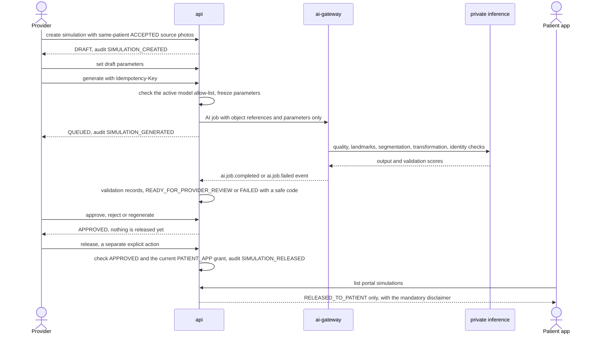

Preconditions and rules:

- **Sources:** same patient (enforced by the database, verified E6), status `ACCEPTED`, and the current media grant that simulation use requires. Which category that is, is UD-32 (baseline: `CLINICAL_USE`).
- **Parameters:** validated against the active model version's allow-list; unknown parameters are rejected. There are no dosage, product, drug, unit, depth or technique fields [B §9.6].
- **Validation:** outside-region identity similarity and artifact detection run before review; outputs over thresholds are rejected or flagged [B §9.5]. Poor inputs fail with `422 INPUT_QUALITY_INSUFFICIENT` and actionable reasons; out-of-domain inputs with `422 UNSUPPORTED_SIMULATION_INPUT`.
- **Review and release:** approval releases nothing. Release needs `APPROVED`, the current `PATIENT_APP` grant (UD-20) and carries the Bible §9.1 disclaimer, embedded server-side in the portal DTO.
- **Patient visibility:** patients never see `READY_FOR_PROVIDER_REVIEW`, `REJECTED` or `FAILED` outputs [B §34.2].
- **Language:** "simulation" or "visualization", never a guaranteed or exact outcome [B §9].
- **Similar cases (Layer 9):** results are labeled "Similar Historical Cases", never "Your Predicted Result"; the cases shown are recorded (`SIMILAR_CASES_SHOWN` [P]) [B §10].
- Detail: [AI_ARCHITECTURE.md](AI_ARCHITECTURE.md), [AI_SIMULATION_RULES.md](AI_SIMULATION_RULES.md).

---

## 10. Treatment plans A/B/C and patient response

| | |
|---|---|
| Actors | Create and edit: SURGEON_PHYSICIAN, NURSE_INJECTOR_AESTHETICIAN, CONSULTANT (`treatmentplan.create`, `treatmentplan.edit`). Send and record an in-clinic response: SURGEON_PHYSICIAN, CONSULTANT (`treatmentplan.send`). Schedule: `appointment.manage`. Patient responds in the portal |
| Delivered in | Layer 4 (M4.1–M4.4); portal view, accept and decline in Layer 5 (M5.5) |
| States | Treatment Plan (diagram 17.3), spec §5.4.3. `Estimate`: `DRAFT → ISSUED → SUPERSEDED \| VOID`, forward-only in the database |
| Audit events | `TREATMENT_PLAN_STATUS_CHANGED` [P] (the Bible's minimum list names no plan events) |
| Offline | Not an offline-capable operation (spec §6.1.8, §8) |

Steps:

1. Create the plan options (Plan A, B, C [B §11.1]; no maximum is specified) as `DRAFT`, with items: treatment, area, provider, description, quantity, price, discount, notes, proposed date [B §11.1]. The server computes totals; clients never submit them.
2. `/propose`. Issue an estimate for an option as needed: a frozen priced snapshot with a PDF. Financing is a reference only [B §11.3].
3. `/send`. The patient opens the plan in the portal (`VIEWED`) and accepts or declines it with `Idempotency-Key`; unanswered plans expire at `expiresAt`.
4. In clinic, staff may record the patient's response from `PROPOSED` with patient attestation (UD-14).
5. `/schedule` links the accepted plan to a procedure (Layer 4) or an appointment (Layer 6); then `/complete` or `/cancel`.

Rules:

- Acceptance is not medical authorization or consent. The API response and the patient UI say so, and consent is always a separate `ConsentAssignment` [B §11.1].
- There is no ledger, claims or payment processing [B §11.3].
- The UD-14 baseline also says sibling options auto-decline when one is accepted; the transitions that implement it are not in spec §5.4.3 (section 18).

---

## 11. Consent assignment and signing

| | |
|---|---|
| Actors | Author and publish templates: ORGANIZATION_ADMIN, PRACTICE_ADMIN within scope (`consent.template.manage`). Prepare, assign, witness, staff-assisted signing, supersede: SURGEON_PHYSICIAN, NURSE_INJECTOR_AESTHETICIAN, CONSULTANT (`consent.assign`). Provider signature and void: SURGEON_PHYSICIAN (`consent.sign.provider`, `consent.void`). Patient reviews and signs |
| Delivered in | Layer 4 (M4.5–M4.6, including staff-assisted signing); portal signing in Layer 5 (M5.5) |
| States | Consent (diagram 17.4), spec §5.4.4. Template versions: `DRAFT → PUBLISHED → RETIRED`, forward-only in the database |
| Audit events | `CONSENT_STATUS_CHANGED` [P], `CONSENT_ASSIGNED`, `CONSENT_VIEWED`, `CONSENT_SIGNED`, `CONSENT_COMPLETED`, `CONSENT_VOIDED`, `CONSENT_TEMPLATE_PUBLISHED` [P] |
| Offline | Not available: signatures and consent completion need real-time authorization; signatures are never queued (spec §8) |

Steps [B §12.3]:

1. Author a template in a `DRAFT` version from the 13 block types (spec §6.6.6); publishing freezes it and records its content hash.
2. Prepare an assignment (`DRAFT`) from a `PUBLISHED` version, optionally linked to a consultation, procedure or plan.
3. `/assign` issues it to the patient (`ASSIGNED`).
4. The patient opens it (`VIEWED`) and saves the first acknowledgment or field (`IN_PROGRESS`).
5. With every required acknowledgment present, the patient signs (`SIGNED_BY_PATIENT`, `Idempotency-Key` required).
6. The provider signs when the version requires it (`SIGNED_BY_PROVIDER`). A required witness signature may be recorded at any point before completion.
7. The system generates the immutable signed snapshot (PDF) and its SHA-256, then moves to `COMPLETE`.
8. Later, per policy: `/void` with a reason, or `/supersede` with a new assignment.

Staff-assisted in-clinic signing (UD-31 baseline) lets the patient sign on the provider's device before the patient app exists (Layer 4):

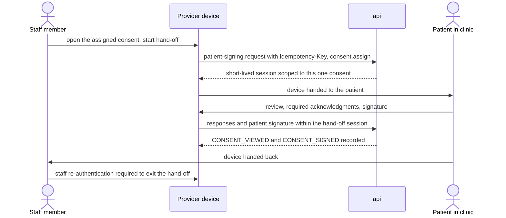

Rules:

- Executed documents never change when a template is edited [B §12.2]. `COMPLETE` requires the snapshot and hash, and executed consents are frozen and cannot be reopened (enforced by the database, verified F8–F12, R5–R6).
- Withdrawal before completion is allowed with a reason (UD-23 baseline); a guardian signer applies if minors are in scope.
- Clinical consent never implies any media permission. A signed consent can be the evidence (`SIGNED_CONSENT`) for a `PhotoPermission` version, but each category is still its own row [B §7.1].
- Detail: [CONSENT_ARCHITECTURE.md](CONSENT_ARCHITECTURE.md).

---

## 12. Education and instructions

| | |
|---|---|
| Actors | Author content: ORGANIZATION_ADMIN, PRACTICE_ADMIN within scope (`content.manage`). Assign education and instructions: `content.read` holders (clinical roles and admins). Clinically complete an instruction: `consultation.edit`. Patient engages in the portal |
| Delivered in | Layer 4 (M4.7–M4.8); patient engagement in Layer 5 |
| States | `EducationContentVersion`: `DRAFT → PUBLISHED → RETIRED`. `ContentAssignment`: `ASSIGNED → OPENED → VIEWED → COMPLETED → ACKNOWLEDGED` (states from [B §12.5], ordering P, spec §5.4.10). `PatientInstruction` uses timestamps: released, acknowledged, clinically completed |
| Audit events | `CONTENT_ASSIGNED`, `INSTRUCTION_ASSIGNED`, `INSTRUCTION_ACKNOWLEDGED` [P] |
| Offline | Not listed as offline-capable |

Education steps:

1. Admins author versioned content (video, image, animation, text, PDF, procedure explanation, FAQ, pre-op and post-op instruction) and publish it; publishing freezes the version.
2. A clinician assigns a content version to the patient (`POST …/content-assignments`), optionally linked to a consultation or procedure, and may record that it was presented in the consultation.
3. Portal engagement events move the assignment through its states.

Instruction steps:

1. Assign a versioned instruction by procedure or by consultation (the database requires at least one).
2. Release it to the patient app.
3. The patient acknowledges it (`INSTRUCTION_ACKNOWLEDGED`).
4. A clinician marks it clinically complete. Acknowledgment and clinical completion are tracked separately [B §12.6].

Rules: content must be original or licensed, never copied from a vendor [B §0.1]; patients see only assigned content and released instructions (spec §4.7).

---

## 13. Patient-app release rules and photo intake

| | |
|---|---|
| Actors | Releasing staff (permission depends on the item, table below). Patients: `PATIENT`-kind users with an `ACTIVE` `PatientUserLink` for the organization in their token |
| Delivered in | Layer 5 (M5.1–M5.5, M5.8); portal simulations in Layer 8 |
| States | Release predicates per item (spec §4.7). `PatientUserLink`: `INVITED`, `ACTIVE`, `REVOKED` |
| Audit events | `PATIENT_ACCOUNT_LINKED` [P], `DOCUMENT_RELEASED` [P], `MEDIA_RELEASED` [P], `SIMULATION_RELEASED`; `SIMULATION_VIEWED`, `PHOTO_VIEWED`, `CONSENT_VIEWED` on patient access; `PHOTO_INTAKE_REVIEWED` [P] |
| Offline | Patient-app offline caching is not specified (section 18) |

The patient sees only records that belong to them, and only content explicitly released or assigned [B §13.2]. Portal handlers live in a separate namespace with separate DTOs and query only through release-filtered repositories; the patient's `patientId` comes from the token and link, never from the path (spec §6.5).

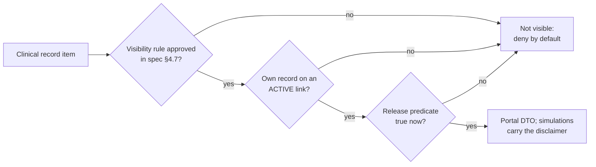

How each item is released (the visibility predicates are an excerpt; normative rules in spec §4.7):

| Item | Staff action | Permission | Visible when |
|---|---|---|---|
| Consultation summary | `POST …/consultations/{cid}/release` | `consultation.complete` | Summary document released |
| Other documents | `POST …/documents/{docId}/release` | `document.manage` [P] | Document released |
| Simulation | `POST …/simulations/{simId}/release` | `simulation.release` | `RELEASED_TO_PATIENT`, released version only |
| Photo, before/after | Media release with purpose `PATIENT_APP` | `consultation.complete` | Current `PATIENT_APP` grant and an unrevoked release |
| Treatment plan | `/send` | `treatmentplan.send` | `SENT_TO_PATIENT`, `VIEWED`, `ACCEPTED`, `DECLINED`, `EXPIRED`, `SCHEDULED` or `COMPLETED` (never `CANCELLED`, `DRAFT` or `PROPOSED`) |
| Consent | `/assign` | `consent.assign` | Any status except `DRAFT` |
| Instruction | `POST …/instructions/{id}/release` | Not explicit in spec (section 18) | Released |
| Education | Content assignment | `content.read` | Assigned |
| Messages | Thread participation | `message.send` | Participant |
| Procedures, appointments, telehealth | None (status-based) | — | Per spec §4.7 (UD-30) |

Revocation:

- Revoking the `PATIENT_APP` grant or the media release removes photos and before/after sets at the next request, because the check runs at use time.
- Revoking a `PatientUserLink` ends portal access to that organization's data. One patient login may link to several organizations, but data never crosses organizations (UD-08 baseline).

Patient photo requests and intake [B §13.4], spec §3.4 flow C:

1. Staff create a `PhotoRequest` (`photo.capture`) naming a protocol, the requested views and instructions (`OPEN`).
2. The patient sees the protocol and instructions, captures with on-device guidance where available, and uploads. The object lands `QUARANTINED`; submitting moves the request to `SUBMITTED`.
3. Malware and file-type validation (UD-22) moves the photo to `PENDING_REVIEW`.
4. Staff review (`POST …/photos/{phid}/review`): `ACCEPTED` enters the clinical record; otherwise `RETAKE_REQUESTED` or `REJECTED`. Each decision writes `PHOTO_INTAKE_REVIEWED`.
5. The request ends `COMPLETED`, or `CANCELLED` or `EXPIRED` (spec §5.4.10).

---

## 14. Secure messaging

| | |
|---|---|
| Actors | Staff with `message.send` (SURGEON_PHYSICIAN, NURSE_INJECTOR_AESTHETICIAN, CONSULTANT) who participate in the thread. Patients with an `ACTIVE` link who participate |
| Delivered in | Layer 5 (M5.6–M5.7) |
| States | Message (diagram 17.7), spec §5.4.7. Thread `OPEN` or `CLOSED`; `Notification` `PENDING`, `SENT`, `DELIVERED`, `FAILED`, `SUPPRESSED` |
| Audit events | `MESSAGE_SENT`, `ATTACHMENT_DOWNLOADED` |
| Offline | A message is an offline-capable create: client UUIDv7 plus `Idempotency-Key`, so retries never duplicate (spec §6.1.8, §8) |

Steps:

1. Staff open or create a thread for the patient; participants are recorded.
2. Attachments: upload intent, malware and content scan before use (UD-22), attached by reference. Authorized types and size limits apply [B §14.4].
3. Send with `Idempotency-Key` (`SENT`, `MESSAGE_SENT`). Messages may reference documents and instructions.
4. Recipients get a notification with fixed template text such as "You have a new secure message." The deep link carries opaque IDs, and the app re-authorizes before showing anything [B §14.3].
5. Read state: `POST …/{tid}/read` marks messages read up to a point.
6. A failed send keeps `retryCount` and `nextRetryAt`; a successful retry returns it to `SENT` (P).
7. Attachment download uses a signed URL valid 120 seconds and writes `ATTACHMENT_DOWNLOADED`.

Rules: thread access needs participation plus the applicable permission (staff) or an active link (patient) [B §14.1]; `Notification` has no content field by design.

---

## 15. Scheduling and telehealth

| | |
|---|---|
| Actors | Appointments: `appointment.manage` (PRACTICE_ADMIN within scope, SURGEON_PHYSICIAN, NURSE_INJECTOR_AESTHETICIAN, CONSULTANT, FRONT_DESK). Telehealth host: `telehealth.start` (SURGEON_PHYSICIAN, NURSE_INJECTOR_AESTHETICIAN). Patients view or propose appointments where enabled, and join sessions |
| Delivered in | Layer 6 (M6.1–M6.4) |
| States | Appointment (diagram 17.6), Telehealth (diagram 17.8); spec §5.4.6, §5.4.8 |
| Audit events | `APPOINTMENT_STATUS_CHANGED` [P], `TELEHEALTH_STATUS_CHANGED` [P] |
| Offline | Not offline-capable; a telehealth call needs a live connection |

Appointment steps [B §15]:

1. The practice configures appointment types (`practice.manage`).
2. Staff book an appointment with `Idempotency-Key`, or the patient proposes one (`REQUESTED`) where enabled [B §13.3].
3. `/confirm`, `/check-in`, `/start`, `/complete`; `/cancel` from `REQUESTED` or `CONFIRMED`; `/no-show` from `CONFIRMED`. Changes need `If-Match`.
4. When an external system is the system of record, local transitions are proposals synced outward, and inbound conflicts are surfaced, never silently overwritten [B §15.3].

Telehealth steps [B §16]:

1. Create a session for an appointment (one per appointment): `SCHEDULED`.
2. The patient joins the waiting room; a join token is issued only while `SCHEDULED` or `WAITING` and inside the join window (spec §4.7).
3. The host joins and admits the patient: `ACTIVE`.
4. In the call: video and audio, mute, camera switch, optional screen or photo sharing, consultation context, treatment-plan review [B §16.1].
5. A dropped connection moves to `DISCONNECTED` and back to `ACTIVE` on reconnect, or to `ENDED` after a reconnect timeout (P).
6. `/end` or `/cancel` (from `SCHEDULED` or `WAITING`).

Rules: calls are not recorded, and `TelehealthSession` has no recording field [B §16.2]; the host is a same-organization provider; the vendor must be BAA-capable (UD-05).

---

## 16. EMR sync

| | |
|---|---|
| Actors | `integration.manage` (ORGANIZATION_ADMIN) triggers syncs and operates dead letters; `integration.read` (SUPER_ADMIN, ORGANIZATION_ADMIN) monitors. The worker and integration-service act as `SERVICE` |
| Delivered in | Layer 10 (M10.1–M10.6) |
| States | Integration Sync (diagram 17.9), spec §5.4.9 |
| Audit events | `INTEGRATION_SYNC_STARTED`, `INTEGRATION_SYNC_SUCCEEDED`, `INTEGRATION_SYNC_FAILED`, `INTEGRATION_CONFIG_CHANGED` [P] |
| Offline | Not available [B §23.2] |

A manual, scheduled or webhook trigger creates an `EMRSyncEvent`; adapters map canonical resources, upsert idempotently, surface conflicts and dead-letter failed records. The full design is in [EMR_INTEGRATIONS.md](EMR_INTEGRATIONS.md).

---

## 17. State machine visualizations

These diagrams **visualize the normative transition tables in spec §5.4**; they do not replace them. If a diagram and the spec differ, the spec wins. `[*]` marks only the initial state. Edge labels name the action or trigger; `P` marks a proposed transition adopted by delegation, and `UD-nn` a transition that depends on an unresolved decision. The state names equal the Prisma enums and Bible Appendix A (verified 9/9, spec §11.2).

### 17.1 Consultation (spec §5.4.1)

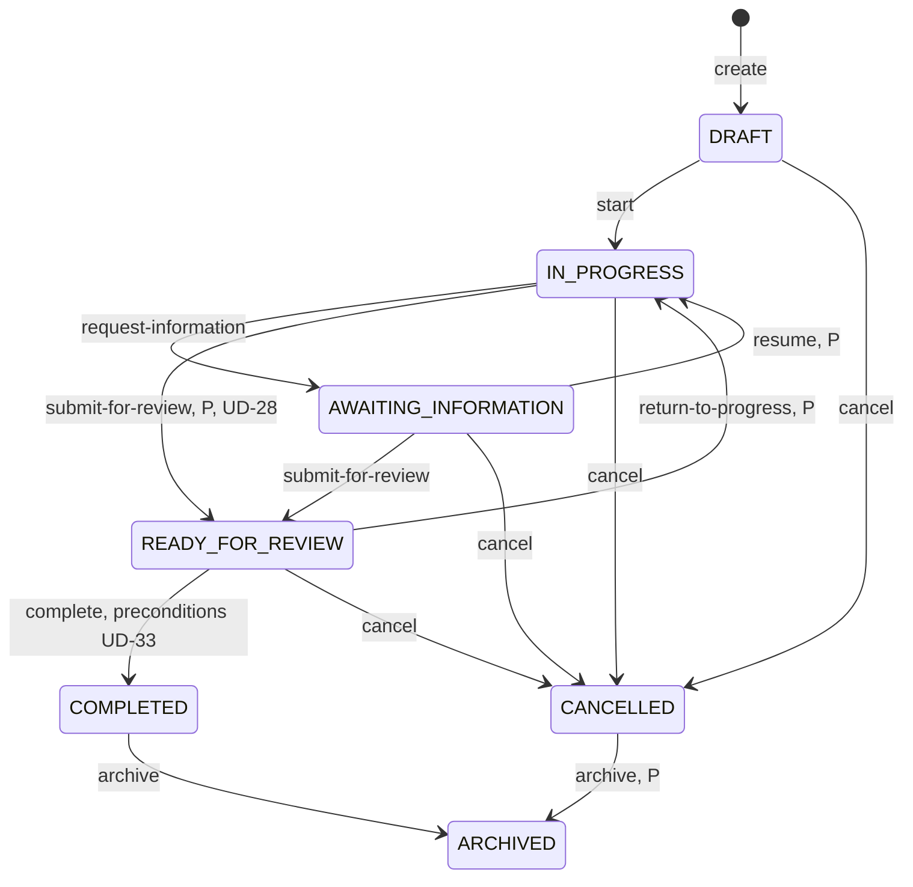

### 17.2 Simulation (spec §5.4.2)

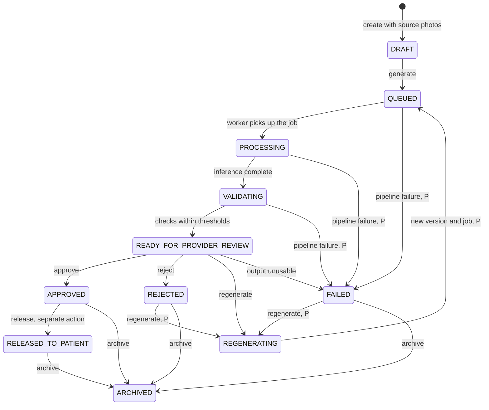

### 17.3 Treatment plan (spec §5.4.3)

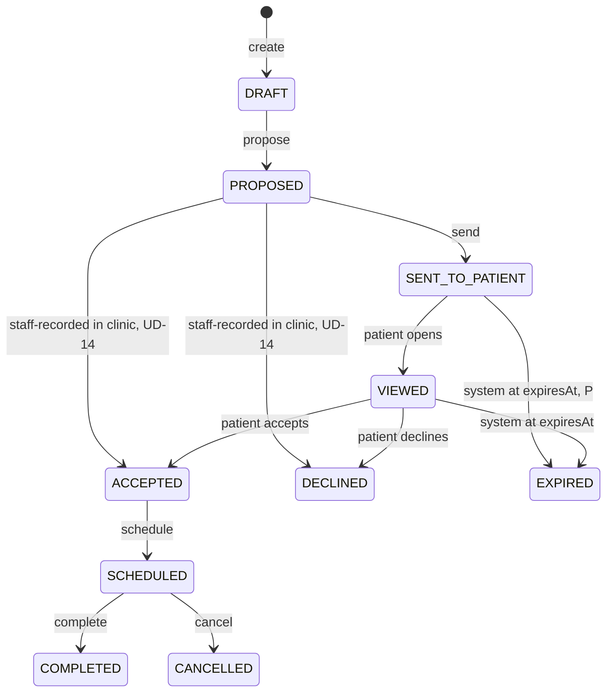

### 17.4 Consent (spec §5.4.4)

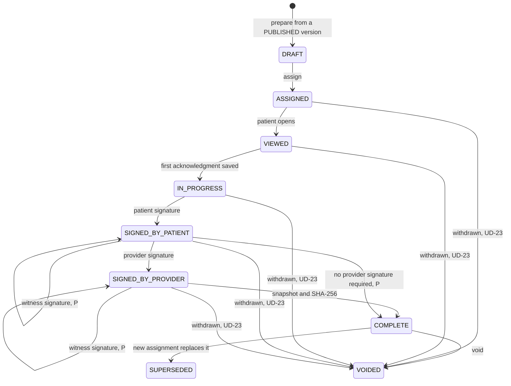

### 17.5 Photo permission (spec §5.4.5)

Each transition inserts a new version row and supersedes the previous one.

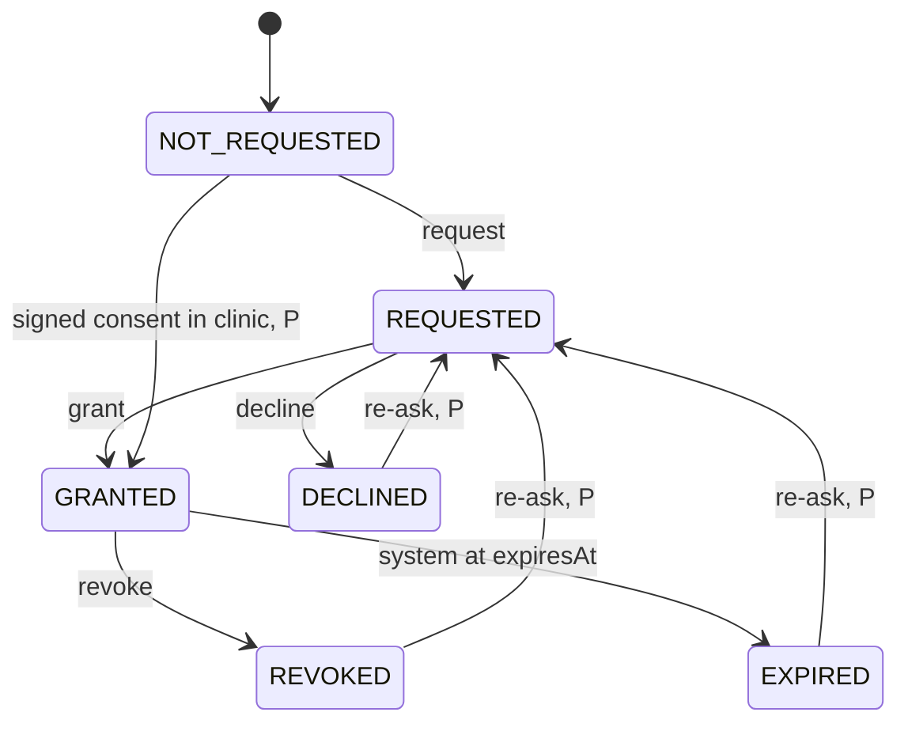

### 17.6 Appointment (spec §5.4.6)

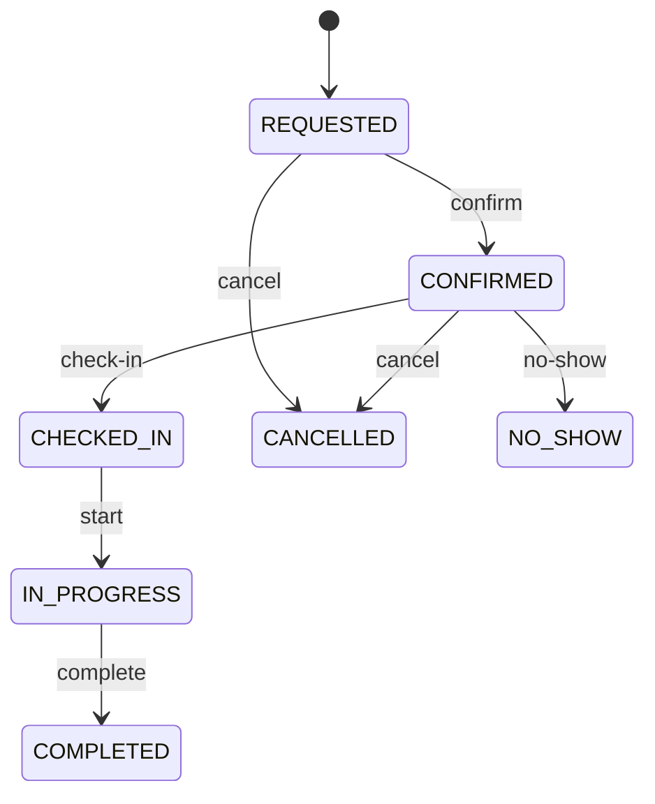

### 17.7 Message (spec §5.4.7)

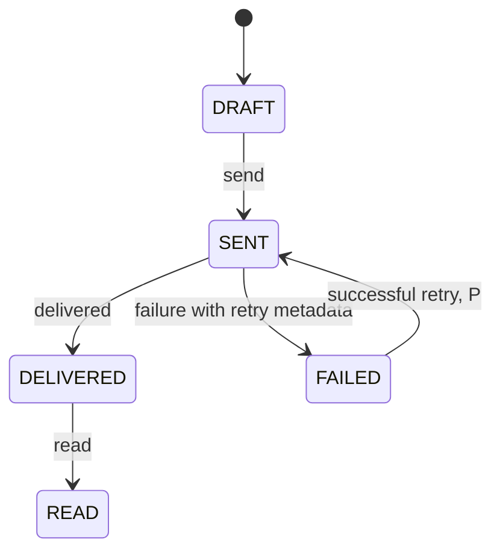

### 17.8 Telehealth (spec §5.4.8)

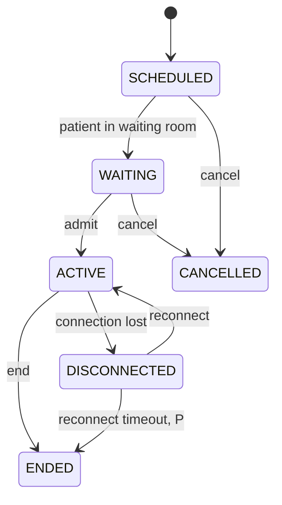

### 17.9 Integration sync (spec §5.4.9)

A retry is a **new** `EMRSyncEvent` linked by `retryOfId` with an incremented `attempt`, which starts again at `PENDING`; exhausted retries dead-letter.

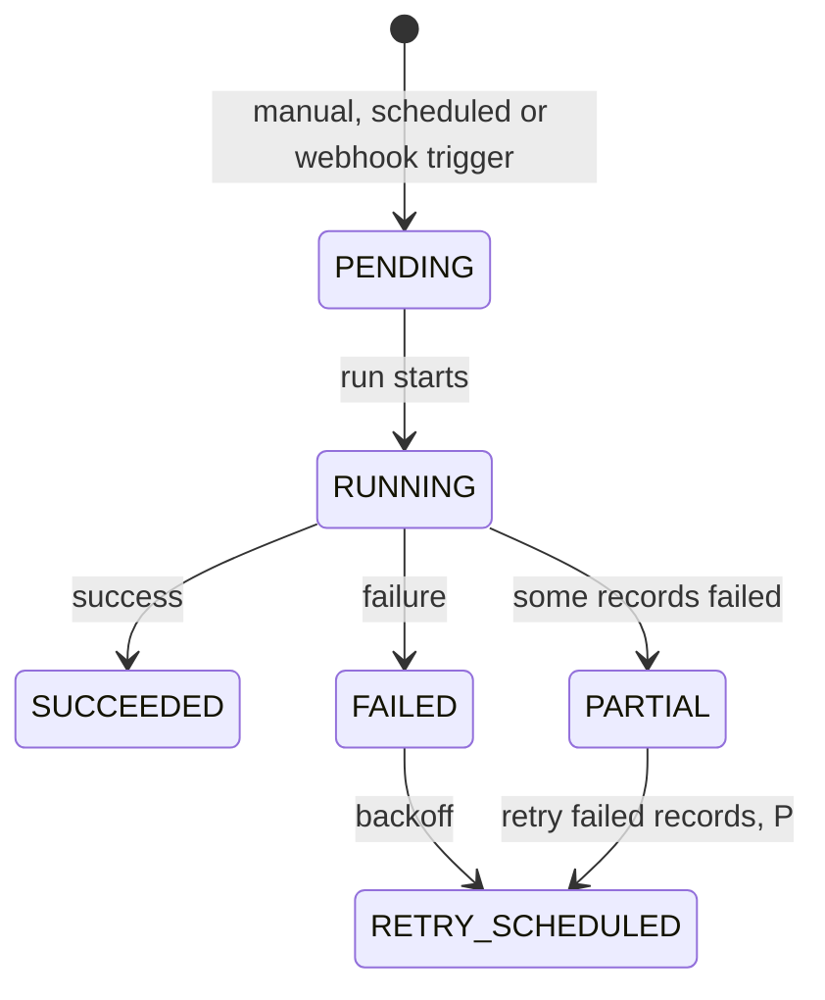

---

## 18. Open items

| Item | Detail | Confirmed at |
|---|---|---|
| Consultation cancellation policy | "When allowed by policy" [B §5.2] is not defined | Layer 3 |
| Offline consultation transitions | Spec §8 excludes sign-off and release offline, but does not say whether `/start`, `/request-information` and similar transitions may be queued | Layer 3 |
| Release-decision precondition | Spec §5.4.1 requires a recorded release decision for `/complete`, but no column stores it, and the consultation release endpoint arrives in Layer 5 | Layer 3 (UD-33) |
| UD-28, UD-33 | Consultation proposed transitions and completion preconditions | Layer 3 |
| UD-14 sibling auto-decline | Siblings in `DRAFT` or `SENT_TO_PATIENT` have no transition to `DECLINED` in spec §5.4.3, and no system actor row exists | Layer 4 |
| Plan scheduling before Layer 6 | `/schedule` "links appointment/procedure"; appointments exist only from Layer 6 | Layer 4 |
| Staff-assisted signing actors | Spec §5.4.4 lists only "patient (link)" for patient transitions; the hand-off session (UD-31) is described only in spec §6.3. `ConsentSignature.signerUserId` is documented as `NULL` for a non-user witness, but a Layer 4 patient has no user account yet | Layer 4 (UD-31) |
| Instruction release permission | Spec §6.3 groups the release endpoint with `content.read` / `consultation.edit` without saying which applies | Layer 4 (UD-16) |
| Content version status for assignment | Spec §5.4.4 requires a `PUBLISHED` version for consents; it does not say whether education and instruction assignments may reference only `PUBLISHED` content versions, and the database does not check it | Layer 4 (M4.7–M4.8) |
| UD-23, UD-31, UD-11 | Pre-completion void and minors; staff-assisted signing; estimate versus quote | Layer 4 |
| Simulation visibility after revocation | Spec §4.7 checks only `RELEASED_TO_PATIENT` for simulations, while photos also need a current `PATIENT_APP` grant; what revoking that grant does to a released simulation is not specified | Layer 5 / Layer 8 (UD-20) |
| Patient-app offline | Spec §8 describes the provider app's clinical cache only | Layer 5 |
| Message delivery and audit | What marks a message `DELIVERED` is not specified, and the catalog has no event for `DELIVERED`, `READ` or `FAILED` although spec §5.4 says every transition is audited | Layer 5 (UD-19) |
| UD-08, UD-20, UD-30 | Patient identity across organizations; `PATIENT_APP` grant; portal visibility of procedures, appointments and telehealth | Layer 5 |
| Telehealth waiting-room trigger | Which action moves `SCHEDULED → WAITING` is not tabulated in spec §5.4.8 | Layer 6 (UD-05) |
| UD-29, UD-32 | Simulation proposed transitions; source-photo grant | Layer 8 |
| Sync audit coverage | No event covers `PARTIAL` or `RETRY_SCHEDULED`, and no `…_STATUS_CHANGED` fallback exists for sync | Layer 10 |
| ~~UD-21, UD-22, UD-25~~ | Closed by ADR-0023 (K2-15, K2-04, K2-17) | Layer 2 kickoff |
